# 数据结构
## 概述
1. 程序=若干代码段的组合：

    + 代码=数据结构+算法；
        + 数据结构：相互之间存在一种或多种特定关系的数据元素的集合；
            + 数据：描述客观事物的符号，是计算机可以操作的对象：
                + 可以输入到计算机;
                + 可以被计算机处理;
                + 数值型：整数、浮点数等；
                + 非数值型：图片、声音等；
                + 数据元素：是组成数据的、有一定意义的基本单位，在计算机中通常作为整体来处理，一个数据元素可以有多个数据项构成，比如一个数组；
                + 数据项：数据项是被定义为最小单位不可再分割，比如数组中的一个元素
                + 数据对象：性质相同的数据元素的集合
            + 结构：相互关系、组织方式即数据元素之间的特定关系；
                + 数据的组织形式：
                    + 线性表；
                    + 树；
                    + 图；
                    + 集合；
                    + .....
                + 数据的存储形式：
                    + 顺序存储；
                    + 链式存储；
                    + <font color = red>任何一种数据的组织形式都可以使用顺序存储、链式存储中的一种实现</font>；
        + 算法：处理数据的方法,解决特定问题的求解步骤的描述（体现为一个代码段）；

2. 数据结构：

    + 逻辑结构：数据元素怎么组织：数据对象中数据元素之间的相互关系；

        + 逻辑结构面向的是具体问题的解决方式；

        + 分类：

            + 集合式：这一堆数据元素属于某一“类”，除此之外没有其它联系，各个数据元素平等且独立，不存在对应关系；
            
            + 树式：数据元素之间以树的层次结构组织即一个根节点派生一堆子节点子接点下继续派生节点,数据元素之间存在一对多的组合关系；
                
            + 图式：数据元素之间对应关系比较复杂（乱七八糟如果将对应关系用线连接起来就是一张乱七八糟的线绘制成的图），数据元素之间存在多对多的关系；
            
            + 线性式：你拉着我我牵着你，连接起来就是一条线：
            

    + **物理结构（存储结构）**：数据元素组织之后怎么在计算机中存储：数据的逻辑结构在计算机的存储形式；

        + 存储结构面向的是计算机（或者说是内存）,数据的存储结构应该能够正确反映数据的逻辑组织关系；
        + 分类：
            + 顺序存储：在内存在开辟一块连续的存储空间按照数据类型依次占位（数组的存储方式），其数据间的逻辑关系和物理关系是一致的；
            + 链式存储：数据存储空间可能是连续的也可能是不连续的
                + 即把数据存储在任意的存储单元里，数据的存储并不能反映其逻辑结构，使用指针记录数据的存储地址，在需要时根据上一个元素的指针才能够找到对应的数据项；
                + 数据存在哪里不重要，只要你有记录数据存储地址的指针即可（你不需要和我做邻居，但是有事的时候我给你发消息你能出现在我面前）
                  

        

3. 算法：解决特定问题的步骤描述，对程序员来说就是一段特定的代码：
    + 特点：
        + 输入输出：
            + 输入：一个算法可能有零个或者多个输入；
            + 输出：一个算法至少有一个输出---可能是一个计算结果可能是一个状态信息；
        + 有穷性：执行的算法步骤是有限的，并且每一步都需要在可接受的时间内完成，执行完有限步骤之后可以自动结束而不是陷入无限循环----毕竟算法是在有限的条件下解决特定的目的，所以要具备实用价值；
        + 可行性：算法的每一个步骤都是可以执行，对于程序员来时就是该步骤可以通过代码体现出来并且能正常运行且得到明确结果；
        + 确定性：每一个步骤都有明确的含义，不会出现二义性；
    + 设计要求：
        + 正确性：一个算法的最最最基本要求就是实现功能，如果连这一点都不能满足写它还有什么意义但是这里的正确性是多维度的：
            + 描述算法的代码描述是正确的
            + 对于给定的输入该算法有明确的预期的输出结果（包括合法、非法的输入）
            + 对于所有的输入都有明确的输出，这一点看上去与第2点是一样的但在实际开发中第2点与第3点有着明显的差异：一些边界数据、特有的测试数据、特定的使用场合等，这是一个算法稳定性（普适性）的问题；
        + 可读性：便于别人理解、交流算法（代码）；
        + 健壮性：对于任何输入或者该问的应用场合都能给出对应的预期的输出结果（其实这里就是一个产品（算法）从0到1和从1到无穷的区别）；
        + **效率**：较好的算法应该执行时间较短，代码实现较为简洁（占用内存空间较少）---时间复杂度和空间复杂度的概念；----时间效率高、存储量低
    + 衡量算法效率的方法（前提这是一个正确的算法）：
        + 算法耗时的主要点：
            + 实现算法采用的策略、方法----取决于算法本身；
            + 编译产生的代码质量----取决于编译器（软件支持）；
            + 问题的输入量（规模）；
            + 机器质量的执行速度---取决于硬件环境；
        + 实测（事后统计）：同一份测试数据在不同算法上测试，获取其运行时间，然后进行比较
            + 需要将多种不同的算提前都实现，最后选取最优的实现方法，这很明显会前期浪费很多资源；
            + 测试依赖环境：同一段代码在性能好的机器上与在性能差的机器上执行时间差异很大
            + 需要为了验证代码而设计特有的测试数据、测试代码---额外开销较大
        + 预先分析：在编码前依据统计方法对备选的几种算法进行预先分析，从理论上选取最优的方案然后将其实现；
            + 抛开软件（编译器）、和硬件环境的因素，一个算法的执行时间其实主要取决于算法的本身实现和输入量，但是输入量又是一个客观的指标，程序员无法限制用户的输入（当然一些限制访问的场合不算---还有其它的限制因素），所以对于前期的算的执行时间理论分析主要是对算法是本身实现进行分析；
            + 鉴于各种环境的影响，在分析算法运行时间是指需要考虑算的**基本执行步骤**的基本取数，不用关新算法具体运行在什么平台、不用细致的计算每一个循环条件的判断等只需要关注算法一个时间趋势----渐进函数的概念；
                + 所以在衡量算法时重要的是基本操作的数量与输入规模关联起来---基本操作的数量表示成输入规模的函数；
                + 渐进增长：对于给定的函数f(n)和g（n）,如果存在一个整数N使得对于所有的n>N,f(n)总是大于g(n),那么我们说f(n)的增长渐快于g(n);
                + *判断一个算法的效率时，函数中的常数和其它次要项常常可以忽略，更应该关注与最高项的阶数*
                + 判断一个算法的时间效率应是基于大数据量的判断，即随着输入规模的增加算法优劣性会体现的越来越明显；
        + 时间复杂度：算法的时间度量，记作：T(n) = O(f(n))、它表示随着问题规模n的增大，算法执行时间的增长率和f(n)的增长率相同，称作算法的渐进时间复杂度，简称时间复杂度：
            + T(n)：语句的总执行次数T（n）是关于问题规模n的函数；
            + f(n)：是问题规模n的某个函数；
        + 推导大O阶方法：
            + 用常数1取代运行时间中是所有加法常数
            + 在修改后的运行次数函数中，只保留最高项
            + 如果最高项存在且不是1，则去除这个项的常数项
            + 示例：
                + 常数阶O(1)：执行时间恒定的算法（与输入规模无关），称之为具有O（1）的时间复杂度，又叫常数阶；

                  ```C
                  int sum = 0,n =100;
                  sum = (1+n)*n/2;
                  printf("%d",sum);
                  ```

                + 线性阶O(n)：

                    ```C
                    int sum = 0,n = 100;
                    for(i = 0; i < n; i++)
                    {
                        sum +=i;
                    }
                    printf("%d\r\n",sum);
                    ```

                    

                + 平方阶O(n^2)：

                    ```C
                    int i，j;
                    for(i = 0;i < n; i++)
                    {
                        for(j = 0; j < n;j++)
                        {
                            /*执行一个时间复杂度为O(1)的操作*/
                        }
                    }
                    ```

                    如果一层循环改成了m则对应的时间复杂度为O（m x n）

                + 对数阶O(logn)：

                    ```C
                    while(count < n)
                    {
                        count *=2;
                    }
                    count * 2*2*....*2 = n---2^x = n 即logn = x---O(logn)
                    ```
            + 常见时间复杂度：
                + 常用时间复杂度所消耗时间从小到大：O(1)<O(logn)<O(nlogn)<O(n^2)<O(n^3)<O(2^n)<O(n!)<O(n^n)
                + 其实对于n^3次方，当输入规模n过大时会是的结果变得不现实，所以一般编程尽量减少循环的嵌套；
                + 2^n 和 n!：除非是很小的输入规模，否则有点不切实际；
            + 最坏情况与平均情况：
                +  最坏情况：算法运行最大时间消耗，最坏情况是一种保障，在应用中，这是一种最重要的需求，通常除非特别指定，我们提到的运行时间是最坏情况下的运行时间---比如从一个数组中查找某一个数值，遍历了整个数组之后才找到；
                +  平均时间：是一个基于大量数据测试出来的一个运行时间，是所有情况中最有意义的，是算法设计的期望运行时间：
                +  最优时间：比如从一个数组中找一个数值，第一个就是，但这个毕竟是特殊情况，不具有参考意义；

        + 空间复杂度：实现算法的语句所占的存储空间：
            +  S（n）=O(f(n)):n 为问题的规模，f（n）为语句关于n所占存储空间的函数；
            +  也可以用空间换去时间，比如将计算结果提前算好存到一张表中，当用户输入数据时直接查表就行了（只是举例说明，查表的速度不一定比计算过程节省时间）；

## 线性表
0. 线性表：零个或者多个相同**数据类型**的数据元素的有限**序列**; 
      + 有限：实际上在计算机中可处理的数据都是有限的；
      + 序列：既然是序列就有前后关系，而且是‘列’也是就单一关系（数据元素之间的关系是一一对应），除首尾元素之外其它的每一个数据元素都有且仅有一个前驱和一个后继，首元素只有后续没有前驱，尾元素只有前驱没有后继（如果首尾相连就成环形结了）；
      + 线性表元素个数n（n ≥ 0）称为线性表长度，当n = 0时称为空表，每一个元素在表中位置索引称元素在表中的位序；
      + 其实所谓的线性并不是指数学意义上的线性而仅仅是指代一种线的结构（或许称为**线型**更为形象）；
          

### 线性表的顺序存储结构

  1. 顺序存储结构：用一段连续的地址空间（内存存储单元）依次存储线性表的数据元素（数组的存放形式）；

      - 描述存储的三个属性：

      + 存储的起始位置：

      + 最大存储容量：

      + 当前（实际）长度：

      + 例如：

          ```C
          #define MAX_SIZE 10         //定义最大长度即数组的长度
          
          typedef int ElemType
          typedef struct {
              ElemType dat[MAX_SIZE];
              unsigned int len;      //当前长度即线性表的长度
          }SqList
          
          ```

      + 线性表的长度应该始终小于等于数组的长度：
          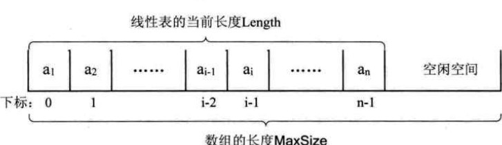

          +  对程序来说习惯于起始位置（索引）是0，但是对于用户或者人们之间的交流来说更加习惯于说“第几个”元素，所以两者之间并不等价而是有一个对应关系，比如交流时所说的第一个元素其实对应数组中索引值为0的元素：
              +  对于第i个元素其存储位置可以由起始地址和数据类型长度（一个数据项所占内存空间）计算得到：LOC(ai)  = LOC(a1)+(i-1)*C
                  +  LOC:表示获取存储位置的函数；
                      +   LOC(a1)：线性表内存空间的起始位置；
                  +  C：单个数据项所占内存空间:sizeof(int)等；
                  +  i:数据元素的位序（从1开始）；
                  +  **对于计算机来说存取一个内存地址的时间是相等的，是一个常数，如果用算法中时间复杂度的概念来说，它的存取时间性能为O(1),通常把具有这种特点的存储结构称之为随机存取结构**
                    

  + 顺序存储结构的操作

      + 获取元素：操作员（用户或者程序员）想要获取该线性表中的第i（位序）个元素；
          + 思路：
              + 该线性表是否为空表；
              + 范围检测，i是否在该线性表的范围内；
              + 如果存在返回其值（位序转为索引）；

          + 实现代码：

              ```C
              #define OK     1
              #define ERROR  0
              #define TRUE   1
              #define FALSE  0
              
              /*Status 作为函数的返回值类型 成功获取到元素的值返回成功否则返回失败*/
              typedef int Status
              
              /*
              L：线性表
              i: 元素位序
              e: 如果存在，用e返回第i个元素的值
              */
              Status GetElem(SqList L, int i , ElemType *e)
              {
              	if(0 == L.len || i < 1 || i > L.len)
              		return ERROR;
              	*e = L.data[i - 1];
              	return OK
              }
              ```


​                  

   + 插入元素：

        + 思路：

            + 检测该线性表长度是否已经等于数组长度（是否还有空间可以插入）；
            + 检测要插入的位置是否符合当前线性表的范围要求；
            + 检测需要插入的数据是否是该线性表的数据类型；
            + 从最后一个元素开始向前遍历到第i个位置，分别将他们都向后移动一个位置；
            + 将要插入的元素放入到第i处；
            + 当前线性表长度增加1；

        + 代码：

            ```C
            Status ListInsertElem(SqList *L, int i , ElemType e)
            {
            	int k ; 
            	if(L->len >= MAX_SIZE)
            		return ERROR;
            	if(i < 1 ||  i > L->len +1)
            		return ERROR
            	if (i <= L->len)
            	{
            		for(k = L->len-1; k >= i-1; k--)
            		{
            
            			L->data[k+1] =L->data[k]; 
            		}
            	}
            	L->data[i-1] = e;
            	L->len += 1;
            	return OK;
            } 
            ```

  + 删除操作：

       + 思路：

           + 删除元素位序范围检测；
           + 取出该元素；
           + 从删除元素位置开始到最后一个元素位置，依次前进一个位置；
           + 线性表长度减1；

       + 代码：

           ```c
           Status ListDelte(SqList *L, int i,ElemType *e)
           {
           	int k;
           	if(0 == L->len)
           		return ERROR;
           	if(i < 1 || i > L->len)
           		return ERROR;
           	*e = L->data[i-1];
           	if(i <= L->len)
           	{
           		for(k = i; k < L->len;k++)
           		{
           			L->data[k-1] = L->data[k];
           
           		}
           	}
           	L->len -= 1;
           	return OK;
           }
           ```


​                  

   + C语言函数参数说明：

        时间复杂度：

        + 存：向线性表中存取一个数据只是向固定的地址内写入数据（这里从存不是插入不需要移动操作），所以时间复杂度为O（1）；
        + 取：取线性表中的某一个数据元素只是对固定的地址进行读操作，所以时间复杂度为O(1)(比如a[1]);
        + 插入：
            + 最优：所要插入的位置正好是线性表的末尾，所以不需要进行移动操作，只进行一个存储操作即可，所以时间复杂度为O（1）；
            + 最坏：在线性表的开头位置插入一个数据项，所以要将之前的N个数据项都进行移动操作，所以时间复杂度为O(n):n为当前线性表的长度；
            + 平均：向线性表的i位置插入一各数据项，需要移动的数据项个数为n-i,每个位置插入的概率是相同的，所以最终的平均移动次数和中间的那个元素的移动次数相等n/2，根据大O标记法可以得到对应的时间复杂度为O（n）;
        + 删除：与插入一致（删除操作时平均移动次数（n-1）/2）；

  + 特点：

      + 优点：
          + 无需为表示表中数据元素之间的逻辑关系而增加额外的存储空间（比如链表的每个及节点都需要记录相邻数据的内存地址）；
          + 可以快速的存、取表中元素
          + 在存、取数据时时间复杂度为O(1),而删除、插入数据项时时间复杂度都是O(n)--比较适合元素个数变化不大，而多是数据存、取的应用；
      + 缺点：
          + 删除、插入需要移动大量元素；
          + 难以确定存储空间的具体容量；
          + 造成存储空间的碎片；

      2.实例代码：

      ```c
      /*线性表的顺序结构*/
      #include <stdio.h>
      #define OK 1
      #define ERROR 0
      #define TRUE 1
      #define FALSE 0
      #define MAXSIZE 20
      typedef int Status;
      typedef int ElemType;
      
      typedef struct 
      {
      	ElemType data[MAXSIZE];
      	unsigned int length;
      }Sqlist;
      
      /*get element*/
      
      Status GetElem(Sqlist L,unsigned int i,ElemType *e)
      {
      	if((L.length == 0)||(i < 1) || (i > L.length))
      		return ERROR;
      	*e = L.data[i-1];
      	return OK;
      }
      
      /*insert element
      	param:
      		L:DATA LIST
      		i:index
      		e: data to insert
      */
      Status ListInsert(Sqlist *L,unsigned int i,ElemType e)
      {
      	unsigned int index;
      	if(NULL == L)
      		return ERROR;
      	//(i > (L->length +1)) 避免空隙
      	if((L->length >= MAXSIZE) || i < 1 || (i > (L->length +1)))
      		return ERROR;
      
      	if(i <= (L->length))
      	{
      		for(index = L->length-1; index >= i-1; index--)
      		{
      			L->data[index +1] = L->data[index];
      		}
      	}
      	L->data[i-1] = e;
      	L->length += 1;
      	return OK;
      }
      
      Status DeleteList(Sqlist *L, unsigned int i, ElemType *e)
      {
      	unsigned int index =0;
      
      	if(NULL == L)
      		return ERROR;
      	if(i < 1 || i > L->length)
      		return ERROR;
      	//i <= L->length
      	if(NULL != e)
      		*e = L->data[i-1];
      
      	for(index = i; index < L->length; index++)
      	{
      		L->data[index-1] = L->data[index];
      	}
      
      	L->length -= 1;
      	return OK;
      }
      
      int main(int argc, char const *argv[])
      {
      	
      	Sqlist order_list;
      	ElemType temp;
      	unsigned char index = 0;
      	order_list.length = 0;
      	
      	for (index = 0; index < MAXSIZE;index++)
      	{
      		if(ERROR == ListInsert(&order_list,index+1,(ElemType)(index+1+100)))
      			printf("insert data error\n");
      	}
      	printf("----------------------------------\n");
      	
      	DeleteList(&order_list,2,NULL);
      	//DeleteList(&order_list,2,NULL);
      
      	for(index = 0; index < order_list.length;index++)
      	{
      		printf("index:%d,value:", index+1);
      		if(OK == GetElem(order_list,index+1,&temp))
      			printf("%d\n", temp);
      		else
      			printf("%s\n","get error");
      	}
      	return 0;
      }
      
      -----------------------
      index:1,value:101
      index:2,value:103
      index:3,value:104
      index:4,value:105
      index:5,value:106
      index:6,value:107
      index:7,value:108
      index:8,value:109
      index:9,value:110
      index:10,value:111
      index:11,value:112
      index:12,value:113
      index:13,value:114
      index:14,value:115
      index:15,value:116
      index:16,value:117
      index:17,value:118
      index:18,value:119
      index:19,value:120
      ```

      

### 线性表的链式存储结构
1. 对于顺序存储结构插入和删除操作的时间复杂度取决于当前线性表的规模（长度），当规模较大时所花费的时间（进行的操作步骤）的比较多的，原因在于顺序存储结构数据元素是相邻的，占用一整块内存空间，所以当插入或者删除时必须要进行对应的移位操作否则整个顺序就会错乱（存储位置之间没有空位，所以无法插入，同样当删除某个位置的元素之后如果不进行移位中间就会留下空白，且整个结构都乱了）；

2. 针对顺序存储的问题提出一种使用一组存储空间（空间可以是连续的也可是不连续的，只要是内存中可用的位置即可）存储线性表的数据元素，每个数据项除了记录自身的数据信息外还需要记录相邻（可以记录前驱和后继，也可以只记录后继）数据项的位置，这样才插入、删除操作时只需要改变相邻数据项即可不需要移动多个数据元素；

    - 存储数据项数据信息的域称为数据域

    - 存储直接后继位置的域称为指针域，指针域中存储的信息称为指针或者链
    - 这两部分数据组成一个数据及结点（Node）---绳子打结的结点；

    - n个结点链接称一个链表即为线性表的链式存储结构其中每个结点只包含一个指针域，所以称之为单链表；
        

3. 链表中的第一个结点的*存储位置*---头指针；

    - 对于单链表来说尾结点的指针域指向空（通常用null表示）；

    - 通常为了方便操作，会在单链表的第一个结点前附设一个结点，称为头结点，头结点的数据域可以不存任何信息，头结点的指针域指向第一个结点（注意头结点不等于第一个结点，第一个结点是针对数据结点的开始，头结点类似于虚拟结点）；

    - 头指针：

        - 指向链表的第一个结点的指针，若链表有头结点则是指向头结点的指针；

        - 头指针有表示的作用，所有常用头指针冠以链表的名字；

        - 无论链表是否为空（只有一个结点），头指针永远都不为空（至少指向一个结点的链表）；

    - 头结点：

        - 是为了方便操作的统一和方便而虚拟（设立）的，放在第一个元素的结点之前，其数据域一遍无意义（也可以存储链表长度）；

        - 头结点不一定是链表的必须要素

        - 有了头结点，对在第一元素结点前插入和删除第一结点其操作与其它结点的操作就统一了不需要特殊考虑（统一操作）；
            

4. 线性表的链式结构对应的操作方式

    - 定义结点

        ```c
        typedef struct node
        {
        	ElemType data;
        	struct node* next_prt;
        }Node;
        typedef struct node* LinkList;
        ```

        

    - 单链表的读取：

        ```c
        Status get_elem(LinkList L, int i,ElemType *e)
        {
        	unsigned int index = 1;
        	LinkList temp = NULL;
        
        	if(NULL == L)
        		return ERROR;
        	if(i <=0)
        		return ERROR;
        	temp=L->next_prt;
        
        	while((temp!= NULL) && (index < i))
        	{
        		temp = temp->next_prt;
        		index++;
        	}
        	if(!temp || index > i)
        		return ERROR;
        	
        	*e = temp->data;
        	return OK;
        }
        ```

        - 从头开始，直到第i个元素为止；
            - 假设是有头结点的链表且没有记录链表的长度；
        - 核心思想是“工作指针后移”；
        - 算法的时间复杂度取决于i 的位置：
            - 当i= 1时，时间复杂度就是O(1);
            - 当i= n时，需要遍历n-1次
            - 因此最坏的时间复杂度就是O(n)；

    - 单链表的插入

        - 找位置:位置从第一个数据结点开始（1）

        - 创建结点

        - 插入结点（移动指针）；

        - 链表长度加1；

        - 示例代码：

            ```c
            Status insert_elem(LinkList list, int i, ElemType e)
            {
            	LinkList temp =NULL;
            	LinkList node =NULL;
            	unsigned int index = 1;
            	if (NULL == list)
            		return ERROR;
            	if(i <= 0)
            		return ERROR;
            	temp = list;
            
            	while(temp->next_ptr && index < (i))
            	{
            		temp = temp->next_ptr;
            		index++;
            	}
            	
            	if(!temp->next_ptr || index > (i))
            		return ERROR;
            	if(NULL == (node = calloc(1,sizeof(Node))))
            		return ERROR;
            	node->data = e;
            	node->next_ptr = temp->next_ptr;
            	temp->next_ptr = node;
            	list->data += 1;
            	return OK;
            
            }
            
            ```

            

        - 时间复杂度：O（n）

    - 单链表的删除

        - 找位置；
        - 删除结点；
        - 释放内存；
        - 链表长度减1：
        - 时间复杂度：O（n）
            - 真正的删除操作是O(1);
            - 遍历查找位置O(n);

    - 打印链表

        - 遍历链表

    - 获取链表长度

        - 维护链表头结点的作为链表的长度记录结点
        - 遍历链表获取长度
        - 不包含头结点的长度

    - 从单个数据结点的插入、删除来看单链表的数据操作时间复杂度都是O（n）,但是对于**数据删除、增加**频繁的操作，单链表的效率优势就越明显；

5. 实例：

    ```c
    /*线性表的链式存储结构*/
    
    #include <stdio.h>
    #include <stdlib.h>
    
    #define OK  1
    #define ERROR 0
    
    typedef int Status;
    typedef int ElemType;
    
    typedef struct node
    {
    	ElemType data;
    	struct node* next_ptr;
    }Node,*LinkList;
    
    
    
    Status get_elem(LinkList list, int i,ElemType *e)
    {
    	unsigned int index = 1;
    	LinkList temp = NULL;
    
    	if(NULL == list)
    		return ERROR;
    	if(i <=0)
    		return ERROR;
    	temp=list->next_ptr;
    
    	while((temp!= NULL) && (index < i))
    	{
    		temp = temp->next_ptr;
    		index++;
    	}
    	if(!temp || index > i)
    		return ERROR;
    	*e = temp->data;
    	return OK;
    }
    
    Status insert_head(LinkList list,ElemType e)
    {
    	LinkList tLemp = NULL;
    	LinkList node = NULL;
    	if(NULL == list)
    		return ERROR;
    	temp = list;
    	if(NULL == (node = calloc(1,sizeof(Node))))
    		return ERROR;
    	node->data = e;
    	node->next_ptr = temp->next_ptr;
    	temp->next_ptr = node;
    	list->data +=1;
    	return OK;
    }
    
    Status insert_tail(LinkList list,ElemType e)
    {
    	LinkList temp = NULL;
    	LinkList node = NULL;
    	if(NULL == list)
    		return ERROR;
    	temp = list;
    
    	while(temp->next_ptr)
    	{
    		temp = temp->next_ptr;
    	}
    
    	if(NULL == (node = calloc(1,sizeof(Node))))
    		return ERROR;
    	node->data = e;
    	node->next_ptr = NULL;
    	temp->next_ptr = node;
    	list->data +=1;
    	return OK;
    }
    
    /*
    	param:
    	1.i:start from 1;
    	
    */
    Status insert_elem(LinkList list, int i, ElemType e)
    {
    	LinkList temp =NULL;
    	LinkList node =NULL;
    	unsigned int index = 1;
    	if (NULL == list)
    		return ERROR;
    	if(i <= 0)
    		return ERROR;
    	//first node
    	temp = list;
    
    	while(temp->next_ptr && index < (i))
    	{
    		temp = temp->next_ptr;
    		index++;
    	}
    	
    	if(!temp->next_ptr || index > (i))
    		return ERROR;
    	if(NULL == (node = calloc(1,sizeof(Node))))
    		return ERROR;
    	node->data = e;
    	node->next_ptr = temp->next_ptr;
    	temp->next_ptr = node;
    	list->data += 1;
    	return OK;
    
    }
    
    Status delete_node(LinkList list,int i,ElemType *e)
    {
    	LinkList temp = NULL;
    	unsigned int index = 1;
    	LinkList node = NULL;
    	if(NULL == list)
    		return ERROR;
    	if(i <= 0)
    		return ERROR;
    	
    	temp = list;
    	while(temp->next_ptr && index < i)
    	{
    		index++;
    		temp = temp->next_ptr;
    	}
    	if(!temp->next_ptr || i > i)
    		return ERROR;
    	
    	node =temp->next_ptr;
    	*e = node->data;
    	temp->next_ptr = node->next_ptr;
    	free(node);
    	list->data -= 1;
    	return OK;
    
    }
    Status init_list(LinkList list,ElemType e)
    {
    	LinkList node = NULL;
    
    	if(NULL == list)
    		return ERROR;
    	list->data = 0;//list length
    	list->next_ptr = NULL;
    	//create first node
    	if(NULL == (node = calloc(1,sizeof(Node))))
    		return ERROR;
    	node->next_ptr = NULL;
    	node->data = e;
    	list->next_ptr = node;
    	list->data += 1;
    }
    
    void print_list(LinkList list)
    {
    	LinkList temp =NULL;
    	unsigned int index = 0;
    	if(NULL == list)
    		printf("%s\n", "list error");
    	temp =list;
    	printf("list length:%d\n",temp->data);
    	while(temp->next_ptr)
    	{
    		temp = temp->next_ptr;
    		index++;
    		printf("index:%d %d\n", index,temp->data);
    		
    	}
    	printf("%s\n","print list over!" );
    }
    
    
    unsigned int get_list_len(LinkList list)
    {
    	LinkList temp = NULL;
    	unsigned int count = 0;
    	if(NULL == list)
    		return ERROR;
    
    	
    	temp =list->next_ptr;
    	while(temp)
    	{
    		count++;
    		temp = temp->next_ptr;
    	}
    	return count;
    }
    
    int main(int argc, char const *argv[])
    {
    	// header node
    	Node list;
    	ElemType temp ;
    	printf("init_list-------------------\n");
    	init_list(&list,0);
    	insert_elem(&list,1,1234);
    	insert_elem(&list,2,2345);
    	insert_elem(&list,3,3234);
    	insert_elem(&list,4,4345);
    	print_list(&list);
    	if(OK == delete_node(&list,1,&temp))
    		printf("delete node data:%d\n",temp);
    	else
    		printf("%s\n", "delete error");
    
    	// insert_head(&list,3);
    	// insert_head(&list,2);
    	// insert_head(&list,1);
    	// insert_head(&list,0);
    	// insert_tail(&list,4);
    	// insert_tail(&list,5);
    	// insert_tail(&list,6);
    	
    	// print_list(&list);
    	// printf("insert_elem-------------:\n");
    	// insert_elem(&list,5,9999);
    	// print_list(&list);
    	// insert_elem(&list,7,1234);
    	// print_list(&list);
    	// printf("get_elem-------------:\n");
    	// if(OK == get_elem(&list,2,&temp))
    	// 	printf("%d\n",temp);
    	// else
    	// 	printf("%s\n","get element error" );
    	
    	// printf("delete_node-------------:\n");
    	// if(OK == delete_node(&list,5,&temp))
    	// 	printf("delete node data:%d\n",temp);
    	// else
    	// 	printf("%s\n", "delete error");
    
    
    	print_list(&list);
    	printf("list_len:%d,%d\n", get_list_len(&list),list.data);
    	return 0;
    }
    
    
    -----------------------
    init_list-------------------
    list length:5
    index:1 1234
    index:2 2345
    index:3 3234
    index:4 4345
    index:5 0
    print list over!
    delete node data:1234
    list length:4
    index:1 2345
    index:2 3234
    index:3 4345
    index:4 0
    print list over!
    list_len:4,4
    [Finished in 0.3s]
    ```

### 线性表对比

1. 若线性表需要频繁的进行**查找操作**（查询某个位置的数据），很少进行插入和删除操作时，应该采用顺序存储结构，若需要进行频繁的插入和删除动作时，宜采用链式存储结构；

2. 当线性表中的数据元素个数变化较大或者根本不知道有多大时，最好采用链式存储结构，这样可以不需要考虑存储空间的大小问题，而如果事先已经知道线性表的大致长度，可以考虑使用顺序存储；

### 静态链表

0. 所谓**静态**是指线性表的数据元素空间不用在使用过程申请、释放；
     - 结合了顺序线性表和链式线性表的优点：
         - 存、取元素的时间复杂度为O(1);
         - 频率高的删除、插入操作效率要高于数组，不需要移动数组元素；
         - 数据元素是乱序存储（链式），用游标记录数据元素之间的相互联系；
     - 没有指针实现的语言可使用该方案实现链式存储；
     - 数据内存空间已经分配好了不会改变，数据元素的增、删、改、查都是对游标进行操作；

1. 静态链表即使用数组实现链表或者叫**游标实现法**；

    - 数组的每一项都是一个结构体
    - 结构体重包含了
        - 数据域：真实的数据；
        - 指针域（游标）：后驱指针

2. 数据项：

    - 通常把未被使用的数据元素称为备用链表；
    - **数组的第一个元素，即下标为0的元素的cur用于存放备用链表的第一个结点的下标**;
    - **数组的最后一个元素的cur存放第一个有用数值的元素的下标，相当于单链表中的头结点的作用**；

3. 初始化：

    - 遍历数组，为数组的cur域赋值()；
    - 最后一个元素的cur为0（目前还没有可用数据）；
    - 即将所有的结点都变成备用结点；

4. 数据插入：

    - 数据空间已经全部分配；

    - 所以插入动作类似单链表的插入，只是将动态分配内存的步骤用分配“备用链表号代替

        - 遍历找到要插入位置的前一个位置；
        - 申请空间---找可用的备用链表
        - 将新的结点插入----当前位置数据元素的游标指向插入位置的前一个元素的cur,插入位置的前一个元素的cur指向当前位置，

    - 插入时指定的位序：

    - 游标的顺序；数据元素之间的相对位置，链表中的指针，

    - 比如再如下静态链表中插入“丙”这个元素

        - 找到备用链表结点7，将数据存储

        - 遍历找到插入之前的点，修改游标为7

        - 把7处的

            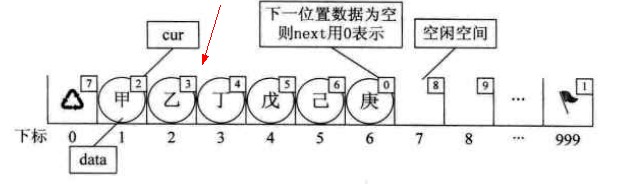

    - 插入完成

    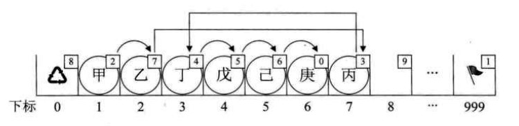

    ​    

5. 数据删除：

    - 与单链表的删除类似：
    - 遍历
    - 释放备用结点；

6. 示例代码：

    ```c
    #include <stdio.h>
    
    #define OK 1
    #define ERROR 0
    #define MAXSIZE 100
    
    typedef int Status;
    typedef int ElemType;
    typedef struct 
    {
    	ElemType data;
    	int cur;
    }Component,StaticLinkList[MAXSIZE];
    
    
    Status init_list(StaticLinkList list)
    {
    	unsigned int index = 0;
    	
    	for (index = 0; index < MAXSIZE-1;index++)
    	{
    		list[index].cur = index+1;
    	}
    	list[index].cur = 0;
    	return OK;
    }
    unsigned int get_list_len(StaticLinkList list)
    {
    	unsigned int len = 0;
    	int first = list[MAXSIZE -1].cur;
    	while(first)
    	{
    		len++;
    		first = list[first].cur;
    	}
    	return len;
    }
    int malloc_index(StaticLinkList list)
    {
    	int index = list[0].cur;
    
    	if(NULL == list)
    		return -1;
    	if(list[0].cur)
    		list[0].cur = list[index].cur;
    	return index;
    }
    
    int free_index(StaticLinkList list, int index)
    {
    	list[index].cur = list[0].cur;
    	list[0].cur = index;
    }
    
    Status insert_node(StaticLinkList list, int i, ElemType e)
    {
    	int index = 1;
    	int j = 0;
    	int k = 0;
    
    	if(i <= 0 || i > get_list_len(list)+1)
    		return ERROR;
    
    	k  = MAXSIZE - 1;
    	index = malloc_index(list);
    	
    	if(index)
    	{
    		list[index].data = e;
    
    		for(j = 1; j < i; j++)
    			k = list[k].cur;
    
    		list[i].cur = list[k].cur;
    		list[k].cur = i;
    		return OK;
    	}
    	
    	return ERROR;
    }
    
    //游标从1开始，到0结束，输入的位置是从1开始。
    //数组的位置无关紧要
    //数组的第一个元素 最后一个元素不存储数据
    //
    Status delete_node(StaticLinkList list, int i ,ElemType *e)
    {
    	int k = MAXSIZE - 1;
    	int j = 1;
    	if(i <= 0 || i > get_list_len(list))
    		return ERROR;
    
    	for(j = 1; j < i; j++)
    		k =list[k].cur;
    	
    	j = list[k].cur;
    
    	list[k].cur = list[j].cur;
    	*e = list[j].data;
    	free_index(list,j);
    	return OK;
    }
    
    void print_list(StaticLinkList list)
    {
    	int index = 0;
    	int first = MAXSIZE-1;
    	for (index = 1; index <= get_list_len(list); index++)
    	{
    		first = list[first].cur;
    		printf("index:%d,data:%d\n", index,list[first].data);
    	}
    }
    
    int main(int argc, char const *argv[])
    {
    	StaticLinkList list;
    	ElemType tmp;
    	init_list(list);
    
    	insert_node(list,1,3);
    	insert_node(list,2,2);
    	insert_node(list,3,1);
    	insert_node(list,4,0);
    	print_list(list);
    	delete_node(list,1,&tmp);
    	printf("delete_node:%d\n",tmp);
    
    	print_list(list);
    	/* code */
    	return 0;
    }
    
    --------------
    index:1,data:3
    index:2,data:2
    index:3,data:1
    index:4,data:0
    delete_node:3
    index:1,data:2
    index:2,data:1
    index:3,data:0
    ```

    

    - 优缺点：

        - 优点：

            - 内存固定申请，避免了多次malloc（）free()的性能消耗；
            - 插入、删除操作时只需要移动游标，不需要移动元素，改进了顺序存储结构中需要大量移动数据的弊端；

        - 缺点：

            - 内部固定分配，大小不好确认；

            - 失去了顺序存储的随机存取的特点（存，取都需要遍历）；

### 循环链表

1. 将单链表的尾结点的后驱指针指向头结点，整个单链表形参一个环，头尾相接（circular linked lis t）。

    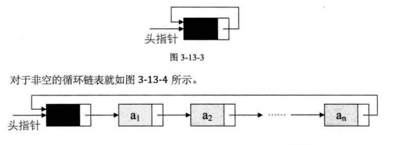

2. 循环链表可以从任一结点开始遍历整个链表（单链表只能从头开始完整遍历）

3. 循环链表与单链表的实习主要是循环判断条件不同：

    - 单链表以p->next == NULL 作为循环结束条件；
    - 循环链表以p->nexit != 头指针作为循环结束条件；

4. 没啥意义，既然能是实现循坏链表，还不如实现双向链表；

### 双向链表

1. 在单向链表的每一个结点中加入**前驱指针**，实现链表的双向遍历(double linked list);
    - 单链表只能从头到尾遍历无法后退；
    - 单链表从当前结点到下移结点的时间复杂度为O(1),但是回到上一个结点的时间复杂度为O(n)，如果加入前驱指针，由当前结点到上一结点的时间复杂度为O(n);
    - 双向链在带来反向遍历的捷径的同时也带来了插入、删除时的复杂（一个结点需要移动两个指针）；
    - 双向链表中的结点都有两个指针，一个指向直接后继，一个指向直接前驱；
    - 

2. 数据结构定义：

    ```c
    typedef struct _node
    {
    	struct _node *pre_ptr;
    	ElemType data;
    	struct _node *next_ptr;
    }Node,*pNode;
    ```

    

3. 双向循环链表：单链表可以是循环链表，双向链表也可以是循环链表，即尾结点的后继指针指向头结点，头结点的前驱指针指向尾结点；

    - 如果是空链表，则头结点的前驱指针，后驱指针都指向自己；

    - 当前的结点的后继指针的前驱还是自己；

        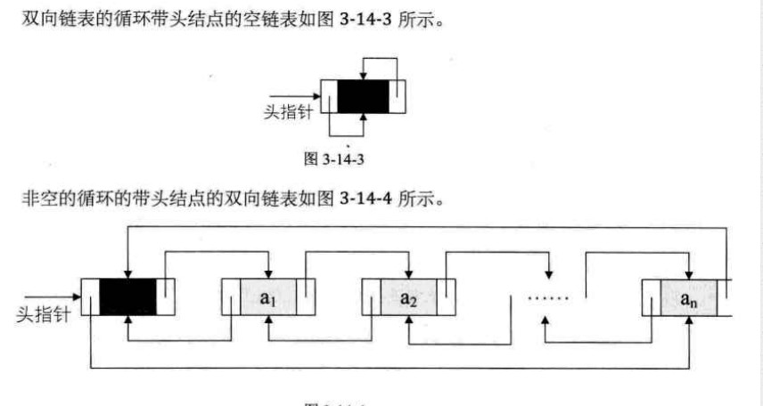


4. 示例代码：

    ```c
    /*double linked list*/
    #include <stdio.h>
    #include <stdlib.h>
    
    #define OK 1
    #define ERROR 0
    
    typedef int ElemType;
    typedef int Status;
    
    typedef struct _node
    {
    	struct _node *pre_ptr;
    	ElemType data;
    	struct _node *next_ptr;
    }Node,*pNode,*pList;
    
    
    Status init_list(pList list)
    {
    	if(NULL == list)
    		return ERROR;
    	list->pre_ptr = list;
    	list->data = 0;
    	list->next_ptr = list;
    	return OK;
    	
    }
    
    
    Status insert_node(pList list, int i, ElemType e)
    {
    	pNode temp_node = NULL;
    	unsigned int index = 1;
    	pNode index_node = NULL;
    	if(list == NULL)
    		return ERROR;
    	if(i <= 0 || i > (list->data + 1))
    		return ERROR;
    	index_node = list;//point to header node
    
    	while(index_node && index < (i))
    	{
    		index_node = index_node->next_ptr;
    		index++;
    	}
    
    	if(!index_node || index > (i))
    		return ERROR;
    	
    	if(NULL == (temp_node = calloc(1,sizeof(Node))))
    		return ERROR;
    
    	temp_node->data = e;
    	temp_node->next_ptr = index_node->next_ptr;
    	temp_node->pre_ptr = index_node;
    	index_node->next_ptr = temp_node;
    	list->data += 1;
    	return OK;
    }
    
    // exclude header node	
    void print_list(pList list)
    {
    	pNode index_node = NULL;
    	unsigned int index = 1;
    	
    	if(NULL == list)
    	{
    		printf("%s\n", "print list err");
    		return;
    	}
    	index_node = list->next_ptr;
    	
    	printf("list len:%d\n", list->data);
    	while(index_node != list)
    	{
    		printf("index:%d,data:%d\n",index,index_node->data);
    		index++;
    		index_node = index_node->next_ptr;
    	}
    }
    //delete node and return delete data
    Status delete_node(pList list, int i, ElemType *e)
    {
    	unsigned int index = 1;
    	pNode index_node = NULL;
    	pNode temp_node = NULL;
    
    	if(NULL == list)
    		return ERROR;
    	if(i <= 0 ||  list->data <= 0 || i > list->data)
    		return ERROR;
    
    	index_node = list;//frist node
    	while(index_node && index < (i))
    	{
    		index_node = index_node->next_ptr;
    		index++;  
    	}	
    	if(!index_node && index > i)
    		return ERROR;
    	temp_node = index_node->next_ptr;
    	index_node->next_ptr = temp_node->next_ptr;
    	temp_node->next_ptr->pre_ptr = index_node;
    	*e = temp_node->data;
    	free(temp_node);
    	list->data -= 1;
    	return OK;
    }
    
    pNode get_node(pList list, int i)
    {
    	pNode index_node = NULL;
    	unsigned int index = 1;
    
    	if(NULL == list)
    		return NULL;
    	if(i <= 0 || list->data <= 0 || i > list->data)
    		return NULL;
    	index_node = list;
    	while(index_node && index < i)
    	{
    		index_node  = index_node->next_ptr;
    		index++;
    	}
    	if(!index_node || index > i)
    		return NULL;
    
    	return index_node->next_ptr;
    
    }
    int main(int argc, char const *argv[])
    {
    	Node list;
    	ElemType tmp;
    	pNode node = NULL;
    	init_list(&list);
    	
    	insert_node(&list,1,4);
    	insert_node(&list,1,5);
    	insert_node(&list,1,6);
    	insert_node(&list,4,3);
    	insert_node(&list,5,2);
    	insert_node(&list,6,1);
    	print_list(&list);
    
    	if(OK == delete_node(&list,6,&tmp))
    		printf("delete data:%d\n", tmp);
    	else
    		printf("%s\n", "delte data err");
    
    	if(OK == delete_node(&list,1,&tmp))
    		printf("delete data:%d\n", tmp);
    	else
    		printf("%s\n", "delte data err");
    	if(OK == delete_node(&list,1,&tmp))
    		printf("delete data:%d\n", tmp);
    	else
    		printf("%s\n", "delte data err");
    
    
    	printf("\n");
    	print_list(&list);
    
    
    	if(NULL == (node = get_node(&list,1)))
    		printf("get node err");
    	else
    		printf("get node:%d\n",node->data);	 
    
    	if(NULL == (node = get_node(&list,(int)list.data)))
    		printf("get node err");
    	else
    		printf("get node:%d\n",node->data);	 
    	return 0;
    }
    
    ------------------------------
    list len:6
    index:1,data:6
    index:2,data:5
    index:3,data:4
    index:4,data:3
    index:5,data:2
    index:6,data:1
    delete data:1
    delete data:6
    delete data:5
    
    list len:3
    index:1,data:4
    index:2,data:3
    index:3,data:2
    get node:4
    get node:2
    ```

    

### 总结
1. 线性表分类：

    - 顺序存储结构：
    - 链式存储结构：
        - 单链表：
        - 静态链表：
        - 循环链表：
        - 双向链表：

2. 线性表操作：

    - 存
    - 取
    - 插入
    - 删除
    - 遍历
    - 获取长度

3. 线性表的使用场合：

## 栈与队列

### 栈

1. 栈是限定在**表尾**进行插入、删除操作的线性表（LIFO）；

    - 一个底部封起来的桶（垂直，立起来的线性表）；

    - 允许对数据进行插入、删除操作的一段称为栈顶（top）（表尾）；

    - 封起来的一端称为栈底（bottom）；

    - 不含任何元素的栈空间称为空栈；

    - 栈本质上就是LIFO的线性表；

    - 满递减栈

    - 满递增栈

    - 空递增栈

    - 空递减栈

    - 栈的插入操作:**入栈**\\**压栈**\\**进栈**push

        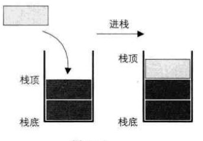

    - 栈的删除操作:**出栈**\\**弹栈**pop

        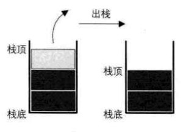

        
#### 栈的顺序存储结构及实现

1. 用线性表的顺序存储结构实现的栈称为**顺序栈**；

2. 栈只能在表的一端进行删除、插入操作：
    - 选取arry[0]为栈底；
    - 因为数据都是存储在首地址；

3. 入栈、出栈就相当于对数组元素的存、取操作所以时间复杂均为O(1);

4. 示例代码：

    ```c
      #include <stdio.h>
        
        #define ERROR 0
        #define OK 1
        #define uint unsigned int
        #define MAX_STACK_LEN 100
        typedef int ElemType;
        typedef int Status;
      
    
         
            typedef struct 
            {
            	ElemType stack_data[MAX_STACK_LEN];
            	int top;
            }Stack,*pStack;
           
            //栈顶指针指向最后一个插入的元素()
            //
            Status init_stack(pStack stack)
            {
            	if(NULL == stack)
            		return ERROR;
            	stack->top = -1;
            }
            
            Status stack_push(pStack stack,ElemType e)
            {
            	if(NULL == stack)
            		return ERROR;
            	
            	if(stack->top >=MAX_STACK_LEN -1)
            		return ERROR;
            	
            	stack->top += 1;
            	stack->stack_data[stack->top] = e;
            	return OK;
            }
            
            Status stack_pop(pStack stack, ElemType *e)
            {
            	if(NULL == stack)
            		return ERROR;
            	if(stack->top < 0)
            		return ERROR;
            	
            	*e = stack->stack_data[stack->top];
            	stack->top -= 1;
            	return OK;
            }
            
            void  print_stack(pStack stack)
            {
            	int index = 0;
            	if(NULL == stack)
            		return;
            	if(stack->top < 0)
            		return;
            	
            	for (index = stack->top; index >= 0; index--)
            	{
            		printf("index:%d,value:%d\n",index, stack->stack_data[index]);
            	}
            	printf("%s\n","print stack over");
            }   
            int main(int argc, char const *argv[])
            {
            	Stack stack;
            	ElemType tmp;
            	int index = -1;
            	init_stack(&stack);
            	stack_push(&stack,1);
            	stack_push(&stack,2);
            	stack_push(&stack,3);
            	stack_push(&stack,4);
            	print_stack(&stack);
            	if(OK== stack_pop(&stack,&tmp))
            		printf("pop data:%d\n",tmp);
            	else
            		printf("pop err\n");
            	
            	print_stack(&stack);
            	return 0;
            }
            -----------------------
            index:3,value:4
            index:2,value:3
            index:1,value:2
            index:0,value:1
            print stack over
            pop data:4
            index:2,value:3
            index:1,value:2
            index:0,value:1
            print stack ove
    ```

    
#### 两栈共享空间

1. 如果有两个想同类型的栈,为他们各自开辟了数组空间,极有可能是第一个栈已经满了,再进栈就要溢出了,而另一个栈还有很多存储空间空闲;

    - 相同的数据类型；
    - 使用这样的数据结构通常是当两个栈的空间需求有相反关系时，也就是一个栈增长时，另一个栈在缩短；

2. **将两个栈放到一个数组中,一个向下生长,一个向上生长,当数组都用完了才表示两个栈都满了;**

    - 当两个栈的栈顶指针相遇的时候就是两个栈都满的情况,top1 +1 = top2;
    - 

3. 数组有两个端点,两个栈有两个栈底,让一个栈的栈底为数组始端,另一个栈的栈底是数组的末端,两个栈增加元素,就是两个端点向中间延伸;

    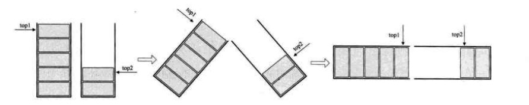

4. 示例代码：

    ```c
    #include <stdio.h>
    
    #define OK 0
    #define ERROR 1 
    #define MAX_STACK_SIZE 100
    
    typedef int ElemType;
    typedef int Status;
    
    typedef enum 
    {
    	f_stack = 1,
        s_stack,
    }StackIndex; 
    
    typedef struct 
    {
    	ElemType data[MAX_STACK_SIZE];
    	int top1;
    	int top2;
    }Stack,*pStack;
    
    
    Status init_stack(pStack stack)
    {
    	if(NULL == stack)
    		return ERROR;
    	stack->top1 = MAX_STACK_SIZE;// 向下生长栈顶指针,栈底为data[MAMAX_STACK_SIZE -1]
    	stack->top2 = -1; // 向上生长栈顶指针,栈底为data[0]
    	return OK;
    }
    
    Status stack_push(pStack stack,ElemType e,StackIndex stack_num)
    {
    	if(NULL == stack)
    		return ERROR;
    	
    	if((stack->top1-1) == stack->top2)
    		return ERROR;
    
    	if(stack_num == f_stack)
    		stack->data[--(stack->top1)] = e;
    	else
    		stack->data[++(stack->top2)] = e;
    	return OK;
    
    }
    
    void print_stack(pStack stack,StackIndex stack_index)
    {
    	int index = 0;
    	if(NULL == stack)
    		return;
    	printf("\nprint stack_%d start!\n", (int)stack_index);
    	if(stack_index == f_stack)
    	{
    		if(stack->top1 >= MAX_STACK_SIZE)
    		{
    			printf("%s\n", "stack 1 is empty");
    			return;
    		}
    		else
    		{
    			for(index =stack->top1; index < MAX_STACK_SIZE;index++)
    			{
    				printf("index:%d,data:%d\n",index-stack->top1,stack->data[index]);
    			}
    			printf("print stack_%d over!\n", (int)stack_index);
    			return;
    		}
    			
    	}
    	if(stack->top2 < 0)
    	{
    		printf("%s\n", "stack 2 is empty");
    		return;
    	}
    	else
    	{
    		for(index = stack->top2; index >= 0;index--)
    		{
    			printf("index:%d,data:%d\n",stack->top2-index,stack->data[index]);
    		}
    		printf("print stack_%d over!\n", (int)stack_index);
    		return;
    	}
    	
    }
    
    Status stack_pop(pStack stack,ElemType *e, StackIndex stack_num)
    {
    	if(NULL == stack)
    		return ERROR;
    	if(stack_num == f_stack)
    	{
    		if(stack->top1 >= MAX_STACK_SIZE)
    			return ERROR;
    		*e = stack->data[stack->top1];
    		stack->top1 += 1;
    		return OK;
    	}
    	else
    	{
    		if(stack->top2 < 0)
    			return ERROR;
    		*e = stack->data[stack->top2];
    		stack->top2 -= 1;
    		return OK;
    	}
    	return ERROR;
    }
    
    int main(int argc, char const *argv[])
    {
    	Stack stack;
    	ElemType tmp;
    	if(ERROR == init_stack(&stack))
    		printf("%s\n", "init stack err");
    
    	stack_push(&stack,1,f_stack);
    	stack_push(&stack,2,f_stack);
    	stack_push(&stack,3,f_stack);
    	stack_push(&stack,4,f_stack);
    
    	stack_push(&stack,1,s_stack);
    	stack_push(&stack,2,s_stack);
    	stack_push(&stack,3,s_stack);
    	stack_push(&stack,4,s_stack);
    	stack_push(&stack,5,s_stack);
    
    	print_stack(&stack,f_stack);
    	print_stack(&stack,s_stack);
    	
    	if(ERROR == stack_pop(&stack,&tmp,f_stack))
    		printf("pop stack err\n");
    	else
    		printf("pop stack_%d,data:%d\n",f_stack,tmp);
    
    	if(ERROR == stack_pop(&stack,&tmp,s_stack))
    		printf("pop stack err\n");
    	else
    		printf("pop stack_%d,data:%d\n",s_stack,tmp);
    	
    	print_stack(&stack,f_stack);
    	print_stack(&stack,s_stack);
    
    	return 0;
    }
    
    
    -------------------------------------------
    print stack_1 start!
    index:0,data:4
    index:1,data:3
    index:2,data:2
    index:3,data:1
    print stack_1 over!
    
    print stack_2 start!
    index:0,data:5
    index:1,data:4
    index:2,data:3
    index:3,data:2
    index:4,data:1
    print stack_2 over!
    pop stack_1,data:4
    pop stack_2,data:5
    
    print stack_1 start!
    index:0,data:3
    index:1,data:2
    index:2,data:1
    print stack_1 over!
    
    print stack_2 start!
    index:0,data:4
    index:1,data:3
    index:2,data:2
    index:3,data:1
    print stack_2 over!
    ```

    


#### 栈的链式存储结构及实现

1. 栈的链式存储结构，简称为链栈；

2. 对于单链表来讲，将链表的头结点作为栈底，**链表的首结点作为栈顶**，插入、删除操作在栈顶进行，可保证LIFO的特性同时结合了链表的头指针和栈顶；

    - 首结点非头结点；
    - 在栈的实现中可以省略头结点（因为所有的入栈都是“”头插入“）；

3. 对于链栈来说，基本上不存在栈满的情况，除非当前平台内存已经没有可用空间（malloc申请内存失败），如果真的是这种情况，OS早就奔溃了；

4. 对于链栈来说，空栈即链表为空，链表的头指针指向NULL；

5. push、pop操作均是在链表头进行操作，不需要遍历链表，所以时间复杂度均为O(1);

6. 示例代码：

    ```c
    #include <stdio.h>
    #include <stdlib.h>
    
    #define OK 0
    #define ERROR 1
    #define  uint unsigned int 
    
    typedef int Status;
    typedef int ElemType;
    
    
    typedef struct _node
    {
    	ElemType data;
    	struct _node * next_ptr;
    }Node,*pNode;
    
    typedef struct 
    {
    	pNode top;
    	unsigned int len;
    }Stack,*pStack;
    
    Status stack_push(pStack stack, ElemType e)
    {
    	pNode temp_node = NULL;
    	if(NULL == stack)
    		return ERROR;
    	if(NULL == (temp_node=calloc(1,sizeof(Node))))
    		return ERROR;
    	temp_node->data = e;
    	temp_node->next_ptr = stack->top;
    	stack->top = temp_node;
    	stack->len += 1;
    	return OK;
    }
    
    Status stack_pop(pStack stack, ElemType *e)
    {
    	pNode temp_node = NULL;
    	if(NULL == stack)
    		return ERROR;
    	*e = stack->top->data;
    	temp_node =stack->top ;
    	stack->top = stack->top->next_ptr;
    	free(temp_node);
    	stack->len -= 1;
    	return OK;
    }
    void  print_stack(pStack stack)
    {
    	pNode temp_node = NULL;
    	int index = 1;
    	if(NULL == stack)
    	{
    		printf("print statck err\n");
    		return;
    	}
    		
    	if(NULL == stack->top)
    	{
    		printf("stack is empty\n");
    		return;
    	}
    		
    	printf("\nstack len:%d\n",stack->len);
    	temp_node = stack->top;
    	while(temp_node)
    	{
    		printf("index:%d,data:%d\n",index,temp_node->data);
    		temp_node = temp_node->next_ptr;
    		index++;
    	}
    
    }
    Status init_stack(pStack stack)
    {
    	if(NULL == stack)
    		return ERROR;
    	stack->top = NULL;
    	stack->len = 0;
    }
    
    int main(int argc, char const *argv[])
    {
    	Stack stack;
    	ElemType tmp;
    	int index;
    	int tmp_index =0;
    	if(ERROR == init_stack(&stack))
    		printf("%s\n", "init_stack err");
    	print_stack(&stack);
    	
    	stack_push(&stack,123);
    	stack_push(&stack,223);
    	stack_push(&stack,323);
    	print_stack(&stack);
    	tmp_index = stack.len;
    	for(index = 1;index <=tmp_index ;index++)
    	{
    		printf("pop stack:index %d,data:",index);
    		if(ERROR == stack_pop(&stack,&tmp))
    			printf("err\n");
    		else
    			printf("%d\n",tmp);
    	}
    	printf("\n");
    	print_stack(&stack);
    	return 0;
    }
    --------------------------------
    stack is empty
    stack len:3
    index:1,data:323
    index:2,data:223
    index:3,data:123
    pop stack:index 1,data:323
    pop stack:index 2,data:223
    pop stack:index 3,data:123
    
    stack is empty
    [Finished in 0.3s]
    
    ```

    

7. 顺序栈&链栈：
    - pop、push操作的时间复杂度均为O（1）；
    - 顺序栈需要提前开辟栈空间，链栈可以在使用过程中按需开辟；
    - 顺序栈肯能会出现栈内存空间浪费、栈溢出等问题，但是对于链栈基本不存在栈溢出的问题
        - 每一个栈点都是堆内存；
    - 链栈的每一个栈点都需要“指针域”，浪费存储空间；
    - 所以在栈元素数据不可控，有时候很大，有时非常小，最后使用链栈，反之如果栈长度变化是在可控范围内，建议使用顺序栈；

#### 栈的作用

##### 递归

1. 斐波那契数列（Fibonacci）:

    

2. 实现方式1：迭代

    ```c
    #include <stdio.h>
    int main(int argc, char const *argv[])
    {
    	int a[40] = {0};
    	int index = 0;
    	a[0] = 0;
    	a[1] = 1;
    	for( index= 2; index < 40; index++)
    	{
    		a[index] =a[index-1] + a[index-2];
    	}
    	for (index = 0; index < 40; ++index)
    	{
    		/* code */
    		printf("index:%d,data:%d\n",index,a[index]);
    	}
    	return 0;
    }
    -----------------------------
    index:0,data:0
    index:1,data:1
    index:2,data:1
    index:3,data:2
    index:4,data:3
    index:5,data:5
    index:6,data:8
    index:7,data:13
    index:8,data:21
    index:9,data:34
    index:10,data:55
    index:11,data:89
    index:12,data:144
    index:13,data:233
    index:14,data:377
    index:15,data:610
    index:16,data:987
    index:17,data:1597
    index:18,data:2584
    index:19,data:4181
    index:20,data:6765
    index:21,data:10946
    index:22,data:17711
    index:23,data:28657
    index:24,data:46368
    index:25,data:75025
    index:26,data:121393
    index:27,data:196418
    index:28,data:317811
    index:29,data:514229
    index:30,data:832040
    index:31,data:1346269
    index:32,data:2178309
    index:33,data:3524578
    index:34,data:5702887
    index:35,data:9227465
    index:36,data:14930352
    index:37,data:24157817
    index:38,data:39088169
    index:39,data:63245986
    ```

    

3. 示例2：递归函数

    ```c
    #include <stdio.h>
    
    int fibonacci(int num)
    {
    	int ret = 0;
    	if(num < 2)
    		return num ==0 ? 0 : 1;	
    	return fibonacci(num -1)+fibonacci(num -2);
    }
    int main(int argc, char const *argv[])
    {
    	int num;
    	num = 39;
    	printf("%d\n", fibonacci(num));	
    	return 0;
    }
    --------------------
    63245986
    
    ```

    

4. 递归：

    - 一个直接调用自己或者通过一系列的调用语句间接调用自己的函数称作递归函数
    - 每个递归定义必须至少有一个条件，满足时递归不再进行，即不再引用自身而是返回值退出；
    - 递归使用的选择结构，迭代使用的是选择结构；
        - 递归：代码结构清晰，简洁，减少代码的阅读时间，**但是大量的递归调用会建立函数的副本，会耗费大量的时间和内存**；
        - 迭代： 需要反复调用函数和占用额外的内存；

5. 递归，前行阶段，对于每一次递归，函数的局部变量、参数、返回值都被压入栈中，在回退阶段，位于栈顶的局部变量，参数值和返回地址被弹出，用于返回掉用层次中执行代码的其余部分；

    

##### 四则运算表达式求值

1. 波兰逆序：解决计算机中如何体现“先乘除、后加减、有括号先运算括号里面”的四则运算法则,一种不需要括号的**后缀表达式**法则；
    - 后缀是指运算符号在操作数后面；
2. 9+（3-1）*3+10/2:
    - 后缀表达式：9 3 1 - 3 * +10 2/ +；
    - 计算规则：从左到右遍历表达式的每个数字和符号，遇到数字就进栈，遇到符号就将栈顶指针指向的最近两个元素出栈，新出栈的两个元素与符号进行运算，得到的结果入栈，一直到获取到最终结果；
        - 计算开始、计算结束栈都是空的；
3. 中缀表达式转后缀表达式：
    - 中缀表达式：正常书写的四则运算表达式的形式；
        - 中缀：操作符在两个操作数中间；
    - 转换规则：从左到右遍历中缀表达式的每个数字和符号，若是数字就输出（打印）即成为后缀表达式的一部分，若是符号，则判断其与栈顶符号的优先级（符号栈），是右括号或者优先级低于栈顶符号,则栈顶元素依次出栈并输出，并将当前符号进栈，一直到最终输出后缀表达式位置

### 队列

1. 队列：只允许在一端进行插入操作，咋另一端进行删除操作的线性表；
    - 允许插入的一端称为队尾；
    - 允许删除的一端称为队头；

2. 队列是在表头进行插入、在表尾进行删除的线性表（FIFO）:

    - 一段水平的管道；
    - 线性表有顺序存储和链式存储，栈是线性表，所以有顺序栈、链栈同理队列是线性表，所以队列也存在线性存储和链式存储两种；
#### 顺序队列

1. 队列顺序存储：

    - 即用数组的方式实现队列；

    - 数组下标为0的元素作队头，可以从这里去取元素；

        - 队列的前N个元素必须存储在数组的前n个单元；

    - 队列的入队操作即在数组的尾部存入一个元素，其时间复杂度为0；

    - 队列的出队操作即在数组的头取一个元素（将下标为0的元素取出），然后需要将后面的n-1个元素，下标都前移动一个下标，所以其时间复杂度为O（n）；

        - 顺序栈的插入、删除操作时间复杂度为O（1）：数组头为栈底，数组尾为栈顶；

            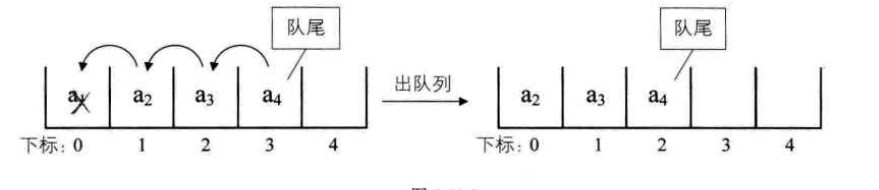

    - 示例代码：

        ```c
        #include <stdio.h>
        #include <stdlib.h>
        #define OK 0
        #define ERROR 1
        #define MAX_QUEUE_LEN 100
        
        typedef int Status;
        typedef int ElemType;
        typedef struct
        {
        	ElemType data[MAX_QUEUE_LEN];
        	unsigned int len;
        }Queue,*pQueue;
        
        
        Status init_queue(pQueue queue)
        {
        	if(NULL == queue)
        		return ERROR;
        	queue->len = 0;
        }
        Status in_queue(pQueue queue,ElemType e)
        {
        	if(NULL == queue)
        		return ERROR;
        	if(queue->len >= MAX_QUEUE_LEN-1)
        		return ERROR;
        	queue->data[queue->len] = e;
        	queue->len +=1;
        	return OK;
        }
        
        Status out_queue(pQueue queue,ElemType *e)
        {
        	unsigned int index = 0;
        	if(NULL == queue)
        		return ERROR;
        	if(queue->len < 1)
        		return ERROR;
        	*e = queue->data[0];
        
        	for(index = 0;index < queue->len;index++)
        	{
        		queue->data[index] = queue->data[index+1];
        	}
        	queue->len -= 1;
        	return OK;
        }
        
        void print_queue(pQueue queue)
        {
        	unsigned int index = 0;
        	if(NULL == queue)
        		return;
        	printf("%s\n", "print queue start:");
        	if(!queue->len)
        		printf("%s\n", "empty quque");
        	for(index = queue->len;index > 0;index--)
        	{
        		printf("index:%d,data:%d\n",(index),
        			queue->data[index-1]);
        	}
        	printf("%s\n", "print queue over!");	
        
        }
        
        int main(int argc, char const *argv[])
        {
        	Queue queue;
        	ElemType tmp;
        	if(ERROR == init_queue(&queue))
        		return ERROR;
        	print_queue(&queue);
        
        	in_queue(&queue,1);
        	in_queue(&queue,2);
        	in_queue(&queue,3);
        	in_queue(&queue,4);
        	in_queue(&queue,5);
        	print_queue(&queue);
        
        	if(OK== out_queue(&queue,&tmp))
        		printf("out queue:%d\n",tmp);
        	else
        		printf("%s\n","out queue err");
        	print_queue(&queue);
        
        	return 0;
        }
        
        -----------------------
        print queue start:
        empty quque
        print queue over!
        print queue start:
        index:5,data:5
        index:4,data:4
        index:3,data:3
        index:2,data:2
        index:1,data:1
        print queue over!
        out queue:1
        print queue start:
        index:4,data:5
        index:3,data:4
        index:2,data:3
        index:1,data:2
        print queue over!
        ```

        

2. 循环队列：

    - 如果不限制队列的前N个元素必须存储在数组的前N个单元，那么顺序队列出队的时候就不需要移动后面n-1元素的下标；

    - 队头、队尾都是可以移动；

        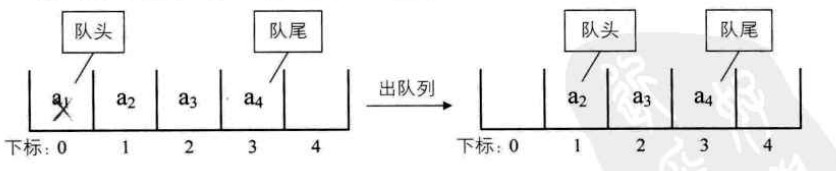

    - 为了避免当只有一个元素是，队头和队尾重合使处理麻烦，引入两个指针，font 指针指向队元素、rear指针指向队尾元素的下一个位置（即指向下一个可用位置），这样当font等于rear时表示队列为空；

        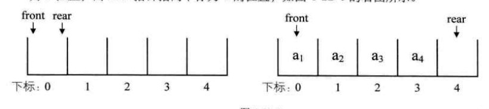

    - 如下情况，rear指针如果继续后移就会造成数组溢出的情况，但是实际上此时队列中只有3个元素，可以继续接受元素入队，这种情况就是**假溢出**；

    - 为了上述的**假溢出**情况，当后面满了，就再从头开始，也就是头尾相接的循环，将这种头尾相接的**顺序**存储结构的队列称为循环队列；

        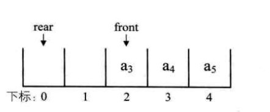

    - 在无循环的情况下rear == font的时候即认为此时队列是空队列（），在循环队列的情况下：rear== font 的情况 即可以表示队列为空、也可以表示队列满，所以无法区分：

        - 在队列中保留一个空位，当rear+1 == front时 认为队列满；
            - 若队例的最大尺寸为MAX_QUEUE_SIZE 那么队列满的条件是（rear+1）%MAX_QUEUE_SIZE  == front
        - 当rear== front 是认为队列为空；
        - 即可以认为rear永远指向下一个可用的空间，不允许出现rear== front的情况；

    - 算队列长度:

        - reae == front:len = 0
        - rear> front:len = rear -front;
        - rear < front:len = rear -fron + MAX_QUEUE_SIZE；
            - 一段为：MAX_QUEUE_SIZE - front;
            - 另一段为：0+rear;
        - 所以通用的计算公式就是：（rear-front+MAX_QUEUE_SIZE）%MAX_QUEUE_SIZE

    - 示例代码：

        ```c
        #include <stdio.h>
        #include <stdlib.h>
        
        #define OK 0
        #define ERROR 1
        
        #define MAX_QUEUE_LEN 5
        
        typedef int Status;
        typedef int ElemType;
        
        
        typedef struct 
        {
        	ElemType data[MAX_QUEUE_LEN];
        	int front;
        	int rear;
        }CycleQueue,*pCycleQueue;
        
        
        Status init_cqueue(pCycleQueue c_queue)
        {
        	if(NULL == c_queue)
        		return ERROR;
        	c_queue->front =0;
        	c_queue->rear = 0;
        }
        
        Status is_empty(pCycleQueue c_queue)
        {
        	if(NULL == c_queue)
        	{
        		printf("%s\n", "queue err");
        		return ERROR;
        	}
        	if(c_queue->rear == c_queue->front)
        		return  OK;
        	return ERROR;	
        }
        
        Status is_full(pCycleQueue c_queue)
        {
        	if(c_queue ==NULL)
        	{
        		printf("%s\n", "queue err");
        		return ERROR;
        	}
        	if(((c_queue->rear+1)% MAX_QUEUE_LEN) == c_queue->front)
        		return OK;
        	return ERROR;
        }
        
        int get_cqueue_len(pCycleQueue c_queue)
        {
        	if(OK == is_empty(c_queue))
        		return -1;
        	return ((c_queue->rear - c_queue->front + MAX_QUEUE_LEN) % MAX_QUEUE_LEN);
        }
        
        Status in_cqueu(pCycleQueue c_queue,ElemType e)
        {
        	if(NULL == c_queue)
        		return ERROR;
        	if(OK == is_full(c_queue))
        		return ERROR;
        	c_queue->data[c_queue->rear] = e;
        	c_queue->rear = (c_queue->rear + 1)%MAX_QUEUE_LEN;
        	return OK;
        }
        
        Status out_cqueue(pCycleQueue c_queue,ElemType *e)
        {
        	if(NULL == c_queue)
        		return ERROR;
        	if(OK == is_empty(c_queue ))
        		return ERROR;
        	*e = c_queue->data[c_queue->front];
        	c_queue->front = (c_queue->front +1) % MAX_QUEUE_LEN;
        	return OK;
        }
        
        
        void print_cqueue(pCycleQueue c_queue)
        {
        	int index =0;
        	if(get_cqueue_len(c_queue) > 0)
        	{	
        		printf("%s\n", "print c_queue start!");
        		if(c_queue->rear > c_queue->front)
        		{
        			for(index = c_queue->front;index < c_queue->rear;index++)
        				printf("index:%d,data:%d\n",index,c_queue->data[index]);
        		}
        		else
        		{
        			for(index = c_queue->front;index < MAX_QUEUE_LEN;index++)
        				printf("index:%d,data:%d\n",index,c_queue->data[index]);
        			for(index = 0; index < c_queue->rear;index++)
        				printf("index:%d,data:%d\n",index,c_queue->data[index]);
        		}
        		printf("%s\n", "print c_queue over!");
        	}
        	else
        		printf("%s\n", "c_queue is empty");
        
        }
        int main(int argc, char const *argv[])
        {
        	CycleQueue queue;
        	ElemType tmp;
        	if(ERROR == init_cqueue(&queue))
        	{
        		printf("%s\n", "init queu ERROR");
        		return 0;
        	}
        	print_cqueue(&queue);
        	
        	in_cqueu(&queue,1);
        	in_cqueu(&queue,2);
        	in_cqueu(&queue,3);
        	print_cqueue(&queue);
        	
        	if(OK == out_cqueue(&queue,&tmp))
        		printf("out queue:%d\n",tmp);
        	else
        		printf("out queue err\n");
        	print_cqueue(&queue);
        	
        	printf("current queue len:%d\n",get_cqueue_len(&queue));
        	in_cqueu(&queue,4);
        	in_cqueu(&queue,5);
        	in_cqueu(&queue,6);
        	printf("current queue len:%d\n",get_cqueue_len(&queue));
        	print_cqueue(&queue);
        	return 0;
        }
        
        
        -----------------------------------------------
        c_queue is empty
        print c_queue start!
        index:0,data:1
        index:1,data:2
        index:2,data:3
        print c_queue over!
        out queue:1
        print c_queue start!
        index:1,data:2
        index:2,data:3
        print c_queue over!
        current queue len:2
        current queue len:4
        print c_queue start!
        index:1,data:2
        index:2,data:3
        index:3,data:4
        index:4,data:5
        print c_queue over!
        ```

3. 单一的顺序队例出队的时间复杂度为O（n),循环队列出队、入队操都是O(1),但可能会浪费一个元素的存储空间，“假溢出”等问题；
#### 队列的链式存储结构及其实现


## misc


### 一些有趣的用法
1. 三目运算符

    ```c
    int main(int argc, char const *argv[])
    {
    	int time = 0;
    	printf("%d\n",(time ? :100));
    
    	time = 50;
    	printf("%d\n",(time ? :100));
    	return 0;
    }
    --------------
    100
    50
    ```


