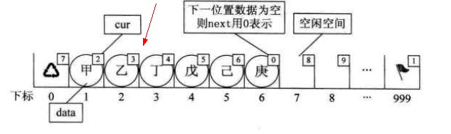
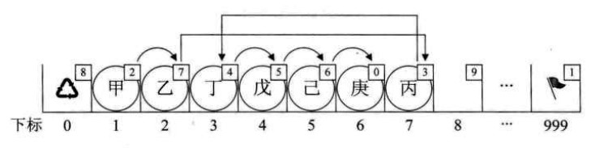
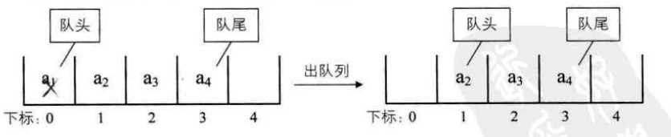
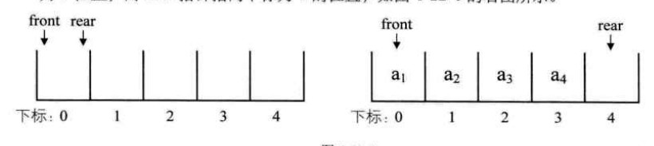
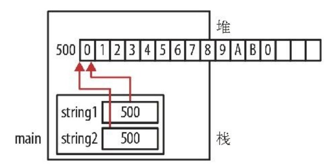
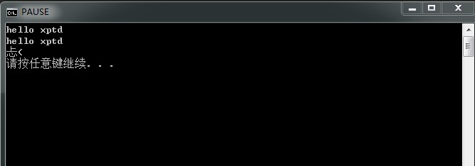
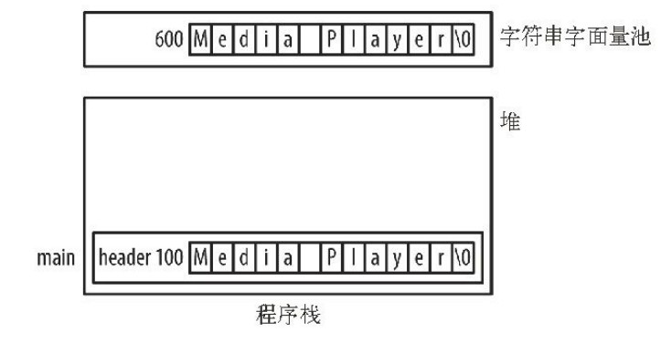

# 操作系统概念
##  概述
1. 计算机系统：
    - 计算机硬件:为系统提供基本的硬件资源，执行用户程序并你呢更容易的解决用户问题。
        + CPU
        + 内存（memory）
        + 输入、输出设备(I/O devicess)
        + 硬盘
    - **操作系统**：
        + 本质上也是一段运行在计算上的程序，但是本身并不实现任何有用的功能，只是提供了一个方便其他程序做有用工作的环境；
        + 对下统一管理硬件资源，对上提供统一的编程接口（模型，隐藏具体硬件设备特性）；
    - 系统程序
    - 应用程序：规定了用户以何种方式使用计算机硬件资源，方便、简化用户对计算机操作；

2. 计算机结构:
    - 通用计算机系统由一个CPU和多个设备控制器组成，他们通过共同的总线连接（该总线提供了对共享内存的访问）起来，每个设备控制器负责特定类型的设备，可有多个设备与其相连，设备控制器维c护一定量的本地缓冲存储和一组特定用途的寄存器，设备控制器负责在其所控制的外部设备与本地缓冲存储之间进行数据传递。

    - 操作系统为每个设备控制器提供一个设备驱动程序，设备驱动程序理解设备控制器，并提供一个设备与其它操作系统的统一接口。

    - CPU和设备控制器可以并发工作，并竞争**内存周期？**；

      

3. 存储结构：速度、价格、易失性、大小
    - 一个完整的存储系统的设计必须平衡所有因素：只使用必需的昂贵的存储器，而提高尽可能便宜的、非易失的存储器；
    - 对于两个部分存在较大访问时间或者传输速率差别时，可通过加高速缓存改善性能；
    - 层次越高，价格越贵，但是速度越快
      

4. 操作系统是由中断驱动的，事件总是由中断会陷阱引起；
    - 陷阱（异常）是一种软件中断，源于出错（真正意义的出错比如内存越界、除数为0）或者源于用户程序的一个特别请求（系统调用）：
        - 中断：硬件中断，外部中断
        - 异常：软件中断，内部中断
        - 系统调用：本质上就是一类函数，只是这些函数是由操作系统提供，可以操作硬件；

5. 由于操作系统和用户公用计算机系统资源（硬件、软件），必须保证用户程序中的一个错误仅影响该用户进程。
    - 双重操作模式：用户模式和系统模式，在不同模式模式下可访问的资源不同;
        - 保护原理：将能引起损害的机器指令作为特权指令，如果在用户模式下试图执行特权指令，那么硬件并不执行该指令，而认为该指令非法（或者是试图访问不属于自己的内存空间地址等操作），并将其以陷阱的形式通知操作系统，操作系统会对该陷阱（中断）做判断，如果是程序错误，操作系统就对他异常行为进行终止。
        - 硬件支持的双模式：在计算机中增加一个模式位标识当前模式，有了模式位就可以区分操作系统所执行的任务和用户执行的认为，当计算机系统表示用户应用程序正在执行，系统处于用户模式，当用户程序需要操作系统的服务（系统调用），它必须从用户模式转换到操作系统模式执行对应的调用，执行完成之后返回到用户模式；

          

        - 无硬件支持的穿模式：没有硬件标识位，多个程序可同时对设备进行写操作可能会引起灾难性结果。
    - 定时器：防止用户程序陷入死循环或不调用系统服务并且不将控制权返回到操作系统，可使用定时器，将定时器设置为在给定时间后中断计算机。	

6. 内存：
    - 一个大的字节或字的数组，每个字节或字都有自己的地址，CPU在获取指令周期时从内存中读取指令，在获取数据周期时对内存内的数据进行读出或写入操作
    - 内存是CPU所能直接寻址和访问的唯一大容量存储器：
        - 内存要访问磁盘上数据必须先通过CPU生成的I/O调用传输到内存中
        - CPU需要执行指令，这些指令必须在内存中
        - 计算机体系结构：
            - 冯·诺依曼结构：是一种将程序指令存储器和数据存储器合并在一起的电脑设计概念结构， 把要执行的程序和处理的数据首先存入内存，计算机执行程序时，按顺序从内存中取出指令一条一条地执行。串行
            - 哈佛结构：将程序指令储存和数据储存分开的存储器结构。中央处理器首先到程序指令储存器中读取程序指令内容，解码后得到数据地址，再到相应的数据储存器中读取数据，并进行下一步的操作（通常是执行）。程序指令储存和数据储存分开，数据和指令的储存可以同时进行，可以使指令和数据有不同的数据宽度。并行

7. 由于内存太小不能容纳所有的数据和程序，且掉电会丢失所有数据，计算机必须提供二级存储器以备份内存，现在多以硬盘作为二级存储器，将程序存储在硬盘上，要执行时才调入到内存中，在执行时将硬盘作为处理的来源地和目的地。

    - 有时也需要比二级存储更慢、价格更低的存储器做访问频率很低的磁盘数据备份比如长期档案存储，代码备份等，所以还需要三级存储器，常用的有磁带、光盘；

8. 高速缓存：
    - 需要特定信息是首先检查它是否在高速缓存中如果是可直接使用高速缓存中信息，如果没有使用位于内存中的信息，同时将其复制到高速缓存中以便下次使用；
    - 如过没有高速缓存CPU将会等待多个时钟周期以便从内存中获取运行所需要的信息（指令、数据），所以高速缓存的存在对提高CPU效率是很有帮助，很必要的；
    - 指令缓存（Icache）
    - 数据缓存（Dcache）
    - 寄存器：速度最快，寄存器的读写访问速度就近似等同于CPU的读写速度；

9. 不同级别的存储器性能

    
    - 高速缓存到CPU和寄存器之间的数据传递通常是硬件完成，无需操作系统干预 ---隐式数据转移
    - 磁盘到内存的数据转移是通常是操作系统控制完成---显示数据转移

10. 分布式系统：将物理上分开的、各种可能异构的计算机通过网络连接起来完成特定的工作任务；

11. 专用系统：功能有限、目的在于处理特定领域问题。
       - 实时嵌入式系统：
           - 实时系统：对处理器的操作或数据流动有严格的时间要求，处理必须在固定时间约束内完成，否则系统会失败。
       - 多媒体系统：专用的处理多媒体数据（图片、视频等）
       - 手持系统 ：手机系统、PDA
## 操作系统结构

1. 分析一款操作系统的角度（同时也是对操作系统定义的最全面解释）
    - 用户：操作系统提供了什么服务（纯粹的使用者）；

    - 程序员（应用层）：操作系统提供了什么接口（应用程序开发者）；

    - 操作系统设计者 ：操作系统的组成部分和相互关系（操作系统构建者）；

2. 操作系统服务
    - 用户界面：所有的操作系统都有用户界面
        + 命令行：
           + 命令解释程序：获取并执行用户指定 的下一条命令，这部分代码是属于操作系统内核代码，一般称之为shell。
           + 执行：当一个任务开始或者用户首次登陆时，命令解释程序会被操作系统调用运行，等待用户输入指令并执行；
           + 执行方式：
               + 将命令的实现代码（功能代码）融合到shell中，检测到用户输入的命之后跳转执行对应的命令分支代码，如果支持的命令很多将导致shell的体积加大；
               + shell本身不包实现命令的功能代码，功能代码有系统程序实现，shell不必理解命令，只要用命令识别文件以装入内存并执行；
                   + 比如在Linux终端输入“mkdir xxx” ,系统会搜索mkdir文件并装入内存执行，传入参数xxx
        + 图像界面：
           + 图标：在桌面系统中，一个图标代表程序、文件、目录和系统功能
           + 系统根据光标指针的位置，按一下鼠标按钮可以调用程序、选择文件和目录或者打开包含命令的菜单。
    - 程序执行：系统必须能够将程序装载到内存中运行，并且结束程序（正确、错误结束）；
        - API:应用程序接口，一系列适用于应用程序员的函数，包括参数返回值等信息，
            - 适用于Windows系统的win32 API;
            - 适用于POSIX系统的POSIX API（UNIX、Linux、Mac OS x）;
            - Java API运行与Java虚拟就程序。
        - 系统调用接口：
            - 程序设计语言的运行时支持系统（与编译器一起的预先构造的函数库---标准C库）;
            - 由一系列系统调用函数构成的特殊的接口。程序员或应用程序通过该特殊的接口取得操作系统内核所提供的服务，**它是专为程序员编程时使用**，是应用程序和系统内核通信的桥梁。也就是说，在应用程序中使用的系统调用是以函数的形式展现在用户面前，提供给用户使用。例如，用户可以通过和文件系统相关的系统调用，请求系统打开文件、关闭文件或读、写文件等。
            - 系统调用接口截取API的函数调用，并调用操作系统中相应的系统调用，通常每个系统调用用一个与其相关的数字，系统调用接口根据这些数字维护一张索引列表（IOCTL）
        - 系统调用：
            - 系统调用的作用是把应用程序的请求传递给系统内核，然后调用相应的内核函数完成所需的处理，最终将处理结果返回给应用程序;
            - 系统调用是应用程序和系统内核之间的接口;
            - API并不需要和系统调用一一对应，它们之间的关系可以是一对一、一对多、多对一或者无关系。例如read()接口就和read系统调用对应，而abs()作用是求绝对值，不需要任何系统调用;
               
            - 系统调用分类（其实也是操作系统的基本模块）：
                - 进程控制：
                - 文件管理：
                - 设备管理：操作系统控制的不同资源可以当做设备看待，有些可以被当做物理设备看待，有些可当做抽象或虚拟设备（如文件）
                - 信息维护：获取系统信息、时间信息、进程信息等
                - 通信：对内的进程间通信、对外的进程间通信：
                  - 共享内存模型：计算机内部
                  - 消息传递模型：计算机之间

    - 向操作系统传递参数：
        - 配置寄存器：可传递的数量有限；
        - 内存块、表：将参数存放在内存块、表中，然后将内存块、表的地址存放在寄存器中（Linux采用该方式）；
        - 堆栈：通过程序放在或者压入	堆栈中，并通过操作系统弹出。

- IO操作:
- 文件系统:
- 通信：进程间的通信（广义）
    + 一台计算机内部的进程间通信；
    + 不同机器之间的通过网络的通信等
- 资源分配：
- 错误检测：
- 安全：

3. 操作系统设计：
    - 策略：决定做什么；
    - 机制：决定如何做，策略决定对所有的资源分配都很重要，无论何时，只要决定资源分配就必须做出策略决定，只要问题是“如何做”而不是“是什么”这就由机制决定；
    - 实现：
4. 内核结构：
    - 分层法：
    - 微内核：
        - 将所有非基本部分从内核中移走，并将它们实现为系统程序或用户程序；
        - 通常应该包括最小的进程和内存管理以及通信功能；
        - 主要功能是使客户程序和运行在用户空间的各种**服务**之间进行通信，通信以消息传递的方式进行。客户程序不会和服务直接交互，而是通过微内核的消息来通信；
        - 优点：
            - 便于系统扩展：新扩展的服务可以作为用户程序增加而不必修改内核
            - 安全：功能以服务的形式提供，这些服务是用户层的所以出错之后不会影响内核的行为；
            - 移植性强：内核小很容易进行平台移植；
        - 缺点：用户功能的实现都是通过服务实现，服务的通信必须经过内核，增加了系统总开销；
    - 宏内核：也称为单一内核，几乎所有的服务都集成到内核中；
5. 虚拟机：
    - 虚拟机软件可以运行在内核模式，因为它就是操作系统（指的是运行在虚拟机中的OS）；
    - 虚拟机本身只能运行在用户模式（只运行在物理机上虚拟机App，本身是一个应用程序）；
    - 虚拟机完全模式物理机（只是在物理资源上有所不同），所以虚拟机也必须有用户模式和内核模式，但是这两种模式都建立在物理机的用户模式下。
    - 当一个虚拟用户模式在虚拟机上运行的程序执行系统调用时，它会在真是机器上引起一个到**虚拟机监控器**的转换，当虚拟机监控器获得控制，他能改变虚拟机的寄存器内容和程序计数器以模拟系统调用的效果。
## 进程管理
1. 系统由一组进程组成：操作系统进行执行系统代码而用户进程执行用户代码，通过CPU多路复用，所有这些进程可以并发执行；
2. 程序：程序是被动实体，是一个静态的概念，比如一个存储在磁盘上的可执行文件；
    - 代码：是指实现某一个功能的代码段；
        - 数据+处理数据的方法（方法、算法）；
        - 程序代码有时也称为文段或者代码段---从内存分布角度；
    - 程序：完成某一个用户功能的代码段集合；
    - 装载可执行程序的方法：双击可执行文件的图标或者在命令行执行；
3. 进程：进程是一个活动实体，
    - 从内存的角度看进程通常包括：
        - 代码段（文本段）：程序代码
        - 堆栈段：存放临时数据，函数参数，返回地址，局部变量（一般说的 堆栈其实就是指栈）；
        - 数据段：全局变量；
        - 堆：动态分布的内存；

    - 进程状态：一次只有一个进程处于运行状态，可以有多个进程处于就绪或者等待状态
        - 创建：正在创建进程

        - 运行：进程正在执行

        - 就绪：进程已经具备可运行的条件，等待CPU调度；

        - 等待：进程等待某个事件发生；

        - 终止：进程完成操作

          

    - 进程控制块：进程在内存中以PCB(Process control block)表示：
        - 进程状态：
        - 程序计数器PC：下一个指令的地址；
        - CPU寄存器：体系不同包含的寄存器（组）不同比如堆栈寄存器、链接寄存器、通用寄存器等
        - CPU调度信息：包括线程优先级等；
        - 内存管理信息：
        - IO状态信息：打开的文件列表、该进程所涉及到的IO设备的列表；

    - 进程调度：
        - 作业队列：进程进入系统时，会被加到作业队列中，该队列包括系统中的所有进程；
        - 就绪队列：驻留在内存中的就绪的等待运行（等待运行不等于进程处于等待状态）的进程会被保存中就绪队列；
        - 设备队列：等待特定IO设备的进程列表称为设备队列，每个设备都有自己的设备队列；
        - 调度程序：操作系统从队列中选取进程的选择程序；
            - 长期调度程序（作业调度程序）：选择进程并装入到内存中，控制内存中进程的数量；
                - 调用不频繁：当多任务数量一定时（内存中进程数量一定），只有一个进程处于终止状态时才需要调用长调度程序从缓存池中选项新的进程装载到内存中；
                - 长期调度程序要合理的选择**一组**进程装入内存
                    - IO密集型进程：进程多数时间是在做IO访问操作，进程CPU计算的时间相对较少；
                    - 计算密集型进程：主要以进行CPU计算为主，很少进行IO请求；
                    - 如果选择都是计算密集型进程，则IO等待队列几乎为空，基本不是用设备；
                    - 如果选择的都是IO密集型的，就绪队列几乎为空，短期调度程序无事可做；
            - 短期调度程序（CPU调度程序）：从准备执行的进程中选择进程，并为其分配CPU；
                - 调用频繁:频繁的为CPU选择新进程，
            - 中期调度：将进程从从内存（或CPU竞争）中移出，从而减低多道程序设计的程度（数量），之后进程可以被重新载入，并从中断处继续执行；（解决竞争问题）；

    - 上下文切换
        - 将CPU切换到另外一个进程需要保存当前进程的状态并恢复另外一个进程的状态,这一任务程序为上下文切换;
        - 保存状态：保存CPU当前状态；
        - 恢复状态：恢复之前中断状态；
        - 上下文切换的时间：以来内存速度。必须复制的寄存器的数量、是否有特殊指令，还有硬件是否对上下文切换有支持（类似于FIQ那种设计或者每个模式都有自己的寄存组，模式切换是不需要备份备份当前寄存器）等，一般需要几ms；

    - 进程操作：

        - 进程创建：
            - 大多数操作系统根据一个唯一的进程标识符PID(Process indentifier )来识别进程，该值通常是一个整数值；
            - 在UNIX系统中可以通过ps 命令获取一个进程列表：

                - ps -el将会列出系统所有当前活动进程的完整信息；
            - 当一个进程创建子进程时，子进程可能从操作系统直接获取资源，也可能只从父进程那里获取资源；
            - 子进程的初始化数据（或输入）由父进程传递给子进程；
            - 当创建新进程时，:
                - 父进程与子进程并发执行；
                - 父进程等待，知道某个或全部子进程执行完；
            - 新进程的地址空间：
                - 子进程是父进程的复制品（具有与父进程相同的程序和数据）；
                - 子进程装入另一个新程序；
            - Unixc创建进程：
                - 通过fork()系统调用创建新进程

                - 新进程复制原来的进程的地址空间，两个进程都继续执行位于系统调用fork()之后的指令；

                - **对于子进程fork()的返回值为0，而对于父进程，返回值为子进程的进程ID（非零值）**

                - 通常，在系统调用fork()之后，一个进程会使用系统调用exex(),以用新程序来取代进程的内存空间，系统调用exec()将二进制文件装入内存，并开始执行，采用这种方式，两个进程能相互通信，并能按格式的方法执行，父进程能创建更多的子进程或者爱子进程运行时没有什么可做，那么它采用系统调用wait()把自己移出去、就绪队列来等待子进程的终止。

                - 例如:

                    ```C
                    //*************************************************
                    //@FileName:main.c
                    //@Author: xiaopaotangde
                    //@For:
                    //@Created Time:Sat 07 Dec 2019 02:19:48 PM CST
                    //************************************************
                    #include<stdio.h>
                    #include<unistd.h>
                    #include<sys/types.h>
                    
                    int main()
                    {
                    	pid_t pid;
                    	
                    	printf("hello coder i am back\r\n");
                    	pid = fork();
                    	
                    	if(pid < 0){
                    		printf("fork error\r\n");
                    		exit(-1);
                    	}
                    	else if(pid == 0){
                    		execlp("/bin/ls","ls",NULL);
                    	}
                    	else{
                    		printf(".\r\n");
                    		wait(NULL);
                    		printf("child process complete and pid is %d\r\n", pid);
                    		exit(0);
                    	}
                    	return 0;
                    }
                    ```

                    

                    
                    

        - 进程终止：

            - 当进程执行完最后的语句并使用系统调用exit()请求操作系统删除自身时，进程终止，这时进程可以返回状态值，发哦父进程，所有进程资源都会释放；
                - 分配给子进程的任务已不在需要；
                - 子进程使用了超过它所分配的到的一些资源；
                - 父进程退出，如果父进程终止，其所有子进程一并终止---级联终止；

    - 进程通信：

        - 独立进程：如果一个进程不能影响其他进程或者被其他进程所影响即不与任何其他进程共享数据；
        - 协作进程：如果一个进程能影响其他进程或者被其他进程所影响即与其他进程进行数据共享；
            - 信息共享：
            - 提高运算速度：一个任务分割成多个子任务；
            - 模块化 ：系统设计模块化；
            - 方便：
        - 进程间通信机制（IPC:interprocess communication）：允许进程相互交换数据
            - 通信基本模式：
                - 共享内存：
                    - 开辟一块进程共享的内存区域，进程通过向此共享区域读写数据实现信息交换，仅在建立共享内存区域的时候需要系统调用，一旦建立起共享区域后续的通信部需要内核的参与（通信）,类似于客户端与客户端直接通信不需要经过服务器的转换；
                    - 共享内存区域驻留在生成共享内存段进程的地址空间，其它希望使用这个共享内存段进行通信的进程必须将该段内存**放到**他们自己的地址空间上；
                    - 相互通信的进程必须取消对共享内存的读写限制；
                    - 通信数据格式、存放的地址由这些进程决定，与操作系统无关；
                    - 要保证同一时间只有一个进程向一个地址写数据（防止写冲突）；
                    - 生产者-消费者模型：生产者进程和消费者进程在其共享内存区域中开辟一个缓冲区用来做生产-消费使用，当消费者消费一项时，生产者能生产另一项，生产和消费必须同步，以免出现消费者消息一个没有生产出来的项；
                        - 无限缓冲：对缓冲区没有大小限制，生产者总是可以生产新的项，消费者可能需要等待（这里似乎是假设生产总是有剩余）---不太现实毕竟内存不可能开辟出无限大；

                        - 有限缓冲：设定缓冲区的大小，如果缓冲区满，生产者必须等待，如果缓冲区为空，消费者必须要等待---实际使用中还是以有限为主；

                        - 例如：

                            ```C
                            //0.通过一个结构体表示生产-消费数据项目
                            typedef struct{
                            	....
                            }item;
                            
                            //1.定义缓冲区大小
                            #define MAX_BUFFER_SIZE 10
                            
                            //2.通过一个结构体数组实现数据缓冲区
                            item item_buffer[MAX_BUFFER_SIZE];
                            
                            //3.生产者维护的生产索引标记（向哪个地方存储）,指向下一个空位索引(索引最大为：MAX_BUFFER_SIZE - 1)
                            int in = 0;
                            
                            //4.消费者维护的消费索引标记（从哪个地方取值），指向下一个满位索引()
                            int out
                            //5. in == out  时表示该缓冲区为空
                            //6. (in + 1) % MAX_BUFFER_SIZE == out 时表示该缓冲区满
                            
                            //7.生产者代码
                            {
                            	
                            	item next_produced;
                            	while(1){
                            		//如果满 则不生产
                            		while((in + 1) % MAX_BUFFER_SIZE == out);
                            		item_buffer[in] =next_produced;
                            		in = (in + 1) % MAX_BUFFER_SIZE;
                            	}
                            }
                            //8.消费者代码
                            {
                            	
                            	item next_consumed;
                            	while(1){
                            		
                            		while(in == out );
                            		next_consumed = item_buffer[out];
                            		out = (out + 1) % MAX_BUFFER_SIZE; 
                            	}
                            }
                                 
                            ```
                - 消息传递：通过在进程间交换消息来实现（类似于客户端在数据发送到服务器（内核），服务器再根据信息中的目标地址信息转换到另外的客户端），每一次的通信都需要内核的参与；
                  - 如果两个进程需要通信就必须在他们之间建立通信线路：
                      - 物理实现：
                          - 共享内存
                          - 硬件总线
                          - 网络
                      - 逻辑实现：进程P和进程Q通过send()、receive()来接收和发送消息
                          - 直接或间接通信：通信线路
                              - 直接：需要通信的每个进程必须明确地命名通信的接受者和发送者。
                                  - send(P,msg):发送消息到进程P；
                                  - receive（Q,msg）：接收Q进程的消息；
                                  - 特点：
                                      -  自动建立通信线路，进程之间只需要知道通信双方的通信标识符号（进程名称）；
                                      - 一对通信进程维护一条通信线路（一条通信线路只能允许两个进程进程通信）；
                                      - 限制了进程定义的模块化即通信依赖于通信直接依赖于通信双方定义的通信标识符（进程名），如果需要改动某一个进程的名称则与其相关联的通常线路都需要修改；
                                  - 对称寻址：发送方和接收方必须命名对方以便通信（可以理解为直接建立通信线路，一个接收方对应与一个发送方）；
                                  - 非对称寻址：只需要发送者命名接受者，而不需要接受者命名发送者；
                                      - send(P,msg):发送消息到进程P；
                                      - receive（pid,msg）：接收来自进程pid的消息，即可以接收任何进程的消息；
                              - 间接：通过**邮箱**或者端口发送消息和接收消息，每一个邮箱都有一个唯一的标识，进行可以向邮箱中存储消息、接收消息，一个进程可能通过许多不同的邮箱与其它进程通信，但两个进程仅在其共享至少一个邮箱时可以通信（）；
                                  - send(A,msg):向邮箱A发送消息；
                                  - receive（A，msg）:接收来自A邮箱的消息；
                                  - 特点：
                                      - 两个通信进程之间可有多个不同的路线（邮箱或者端口），每个路线对应一个邮箱；
                                      - 一个线路（邮箱或者端口）可以与两个或者更多的进程相关联；
                                  - 邮箱拥有者：
                                      - 进程：进程是邮箱的拥有者（邮箱属于进程的地址空间的一部分），当拥有邮箱的进程结束，该邮箱将不会存在，将无法继续使用该邮箱；
                                          - 拥有者：只能通过邮箱接收消息；
                                          - 使用者：只能向邮箱发送消息；
                                      - 操作系统：由操作系统所拥有的邮箱是独立于其他进程存在的，操作系统提供进程对邮箱的操作方法，使得某个进程获取该邮箱的使用权（发送消息）和拥有权（接收消息）；
                                          - 创建新邮箱：创建邮箱的进程默认为邮箱的拥有者；
                                          - 通过邮箱发送、接收消息；
                                          - 删除邮箱；
                          - 同步（阻塞）或异步通信（非阻塞）：send()/receive()原语的实现方式；
                              - 阻塞send:发送进程阻塞，知道消息被接收（进程、邮箱）；
                              - 非阻塞send:发送进程发送消息并继续其它操作；
                              - 阻塞receive：接收者阻塞，直到有消息可用；
                              - 非阻塞receive：接收者收到一个有效消息或空消息；
                              - send(）、receive()可以进行不同组合实现进程间通信；
                                  - 同步与异步关注的是消息通信机制：
                                  - 阻塞与非阻塞关注的是等待消息时的状态：
                                      - 同步、阻塞：发出一个命令（或调用、功能）之后必须要得到一个明确的返回消息，在没有得到返回消息（返回值）之前该命令就不返回，这个时候进程（线程）处于的阻塞状态（等待）；
                                      - 异步、非阻塞：发出一个命令（或调用、功能）之后立马返回，此时没有拿到明确的返回结果，真是的命令执行状态是通过被命令者的状态、通知来通知调用者的，或者通过回调函数来处理被调用者的状态（反正就是我现在不关心，或者我知道你不可能马上完成），此时进程（线程）没有被这个命令或者调用阻塞；
                                      - 比如你发一条消息给你的朋友，如果你是同步消息模式在你发出消息之后你整个人就啥也不做了就在等对方给你回复，如果你是异步消息模式在你发送完消息之后你可以继续做其它工作如果他回复你消息了会有系统提醒消息等提示你（回调，或者你朋友直接做完某件事情比如你让他给你打100W 你看到支付宝的提醒消息了 你就知道刚刚命令的执行结果了）；
                                      - 从这个例子也可以看出采用同步、异步机制多数取决于命令的内容；
                              
                          - 自动或显示缓冲：通信消息的队列(消息的承载能力大小)实现方式：
                              - 零容量：队列的最大长度为0，因此线路中不能有任何消息处于等待状态，对于这种情况，必须阻塞发送；
                              - 有限容量：队列长度为N，在队列未满的情况下发送者可以继续发送消息并且暂存在队列中，如果队列满，必须阻塞消息发送者，等待队列释放容量；
                              - 无限容量：队列可以无限长，从不阻塞消息发送者
                      
                            

    - IPC系统实例

        - POSIX共享内存实现进程通信（使用POSIX API实现共享内存以达到进程通信的目的）：

            - 开辟一块区域作为共享空间；

                - 调用shmget()创建共享内存段（shared memory get）
                    - segment_id = shmget(IPC_PRIVATE,size,S_IRUSR | S_IWUSR);
                        - 第一个参数是指定共享内存的关键字：
                        - 第二个参数指定新生成的共享内存的大小（以字节为单位）；
                        - 第三个参数指明了共享内存的属性（使用方式）：拥有者可以对该共享内存区域执行读、写操作；
                        - 如果shmget（）调用成功则返回一个共享内存段整数标识值，其它进程需要将该 共享区域映射到自己的地址空间时需要该id值；

            - 需要通信的进程将该共享空间映射到自己的地址空间；

                - shmat()系统调用将一块共享内存区域加入到该进程的地址空间（shared memory attach）；
                    - shared_memory = (char *)shmat(id,NULL,0);
                        - 第一个参数：希望加入共享内存段的整数标识值（shmget系统调用的成功返回值）；
                        - 第二个参数：内存中的一个指针位置，表示要将该共享内存段加入到什么地方（起始地址），如果传入NULL则操作系统会自动指定；
                        - 第三个参数：对该共享内存段的操作权限，如果传递0则表示可以对该共享内存段进行读写操作；
                        - shmat()系统调用返回一个指向共享内存段加入到内存中的起始位置指针

            - 取消进行对该空间的读写限制；

            - 对该共享地址空间的读、写即实现了进程通信；

                - 如果共享内存成功加入到进程的地址空间内则即可以像访问一般内存一样访问共享内存

            - 使用完毕之后（不再通信）间该共享区域从自己的地址空间移除：

                - 当一个进程不需要共享内存段（不需要进行进程通信）时，可以将共享内存段从其地址空间移除：
                    - shmdt()系统调用将会将之前已经加入的共享内存段移除：
                        - shmdt(shared_memory)
                            - 参数：共享内存段在进程地址空间内的起始地址指针即shmat()系统调用的返回值；
                    - 如果所有的进程都不需要通过该内存共享区域进行通信，则可以释放该共享内存段：
                        - shmctl()：从系统中删除共享内存段。

            - 代码示例：

                ```C
                //*************************************************
                //@FileName:main.c
                //@Author: xiaopaotangde
                //@For:
                //@Created Time:Sun 08 Dec 2019 04:49:38 PM CST
                //************************************************
                
                #include<stdio.h>
                #include<sys/shm.h>
                #include<sys/stat.h>
                
                int main(int argc, char* argv[])
                {
                	int segment_id;
                	char* shared_memory = NULL;
                	
                	const int size = 4096;
                	
                	segment_id = shmget(IPC_PRIVATE,size,S_IRUSR | S_IWUSR);
                	
                	shared_memory = (char*)shmat(segment_id,NULL,0);
                	
                	sprintf(shared_memory,"Hello xpdt\r\n");
                	printf("*%s\n",shared_memory);
                	
                	shmdt(shared_memory);
                	shmctl(segment_id,IPC_RMID,NULL);
                	
                	return 0;
                }
                
                ```
- 
## CPU管理的直观想法

### CPU的工作原理

1. CPU 怎么工作：自动的取值-执行；

2. CPU怎么管理：设定好PC指针的初值 之后CPU自动的取址-执行；

   - CPU可以运行了但是CPU的利用率太低了（比如IO操作就会导致CPU等待时间边长）
     - 计算密集型与IO密集型约为10^6:1；
   - 怎么解决：多道程序、交替执行使得CPU的工作时间变多-----**并发**；提高效率的核心是使得CPU变得忙碌；

3. 并发才是提高CPU利用率的王道：

   - 交替执行的基本思想就是来回切换PC指针同时保留、恢复现场；
   - 所以要有一个数据结构用来记录**现场信息**；

4. 所以运行着的程序和静态的程序是不一样的：

   - 需要记录运行的程序有关动态记录信息等：
   - 为了描述“运行着的程序+不一样的记录信息”所以引入了一个全新的概念---**进程**（进行着的程序）
     - 所以一个运行中的程序就是一个进程；

5. 并发是一种解决CPU高利用率的手段（思路），进程是一个为了描述运行中的程序+运行中的程序与静态程序不同而引出的概念；
### 多进程图像

1. 多进程图像（view）：
   - 从用户角度来看多进程就是打开了多个应用程序;
     - 用户使用计算机启动多个进程；
   - 程序员的角度来说就是使用了“fork()”系统API进行编程；
   - 从操作系统的角度来看多进程就是开辟了多个PCB，将这些进程记录好，按照合理的次序推进即**资源分配和进行调度**;
   - 启动一个进程解决一个问题、完成一个问题；

2. 多进程如何组织：PCB+状态+队列

   - 操作系统管理、维护、推进进程的核心就是PCB(process control block);

   - 通过PCB形成了多个管理队列：

     - 执行队列:正在执行
     - 等待队列：等待某个时间发生；
     - 就绪队列：具备执行条件，等待调度；

   - 状态：进程的当前状态：

     

3. 多进程如何交替：进程调度---PCB信息的交替：

   - FIFO:先进先出
     - FIFO显然是公平的的策略；
     - FIFO显然没有考虑进程执行任务的区别；
   - Priority:
     - 优先级该怎么设定？可能会使某些进程饿死；

4. 多进程如何影响（进程间的相互影响）：

   - 内存（地址空间）的相互污染；-----多进程的地址空间分离；

5. 多进程如何进行合作：----进程同步

   - 生产者--消费者模型；

## 用户级线程

1. 进程= 资源+指令执行序列,所以 进程的切换就涉及到资源的切换和指令的切换，但是呢如果每次都对进程的资源进行切换开销是很大的，所以采用**分治**的思路：

   - 将资源和指令执行序列分开；

   - 一个资源+多个指令执行序列（多个执行序列+一个地址空间）；

   - 这样的话在切换的时候资源不用来回切换只需要切换执行的指令序列极大的减少了进程切换的开销；

     - **实质就是映射表不变而PC指针变**;

     

2. 线程(Thread)：**保留了并发的特点避免了进程切换的代价**:

3. 多个执行序列+一个地址空间是否实用：

   - 假设一种情况：打开一个浏览器（启动一个进程）输入一个url之后，浏览器会向对应的服务器请求数据并将获得的数据进行显示(假设只有文本+图片的形式)；

   - 基本的执行流程是：

     - 从服务器请求数据；
     - 接受数据到指定的缓冲区；
     - 解析缓冲区中的数据并显示；

   - 如果顺序执行的化用户看到的结结果将会是：

     - 打开浏览器，输入URL，回车；
     - 浏览器向指定的服务器发起请求并等待服务器响应；
     - 服务器响应浏览器请求并将请求的页面数据返回；
     - 浏览器接收全部的页面数据到指定的数据缓冲区；
     - 等到所有的数据接收完成之后浏览器执行数据解析代码（功能）将所有的数据解析完毕；
     - 浏览器执行对应的显示代码，显示上一不解析的数据；
     - 用户看到请求的页面信息；
     - 整个过程中用户在前期将有一大段时间什么都看不到（页面信息）---如果页面的数据比较多的话用户看到空白页面的时间将会很差，造成用户体验感极差的情况；

   - 为了解决上诉问题所以就需要引入多道程序执行的思路：即从服务器接收数据、解析数据、显示数据同时进行，接收一部分数据就解析一部分数据，解析一部数据就显示一部分数据，三个过程穿插进行，这样的话用户就可以在发起请求之后在逐步看到页面的显示信息；

   - 既然要并发执行那么就需要有多个进程同时工作，但是这里还有一个问题，接收的数据要放在指定的显示缓冲区，而且所有的显示都是输出到同一个显示设备，这样就带了多个进程共享缓存区的问题和进程间通信的问题，且多个进程的相互切换开销很大；

   - 基于以上的考虑在同一个进程内开启多个任务的情况即多个执行序列+一个地址空间的情形是有实用价值的：

     - 一个线程用来从服务器接收数据；
     - 一个线程用来显示文本；
     - 一个线程用来处理图片数据；
     - 一个线程用来显示图片；
     - 所有的这些线程都在一个进程空间内可以方便的共享数据缓存区和显示设备；

     

4. 两个执行序列与一个栈：

   - 


# 数据结构
## 概述
1. 程序=若干代码段的组合：

    + 代码=数据结构+算法；
        + 数据结构：相互之间存在一种或多种特定关系的数据元素的集合；
            + 数据：描述客观事物的符号，是计算机可以操作的对象：
                + 可以输入到计算机
                + 可以被计算机处理
                + 数值型：整数、浮点数等；
                + 非数值型：图片、声音等；
                + 数据元素：是组成数据的、有一定意义的基本单位，在计算机中通常作为整体来处理，一个数据元素可以有多个数据项构成，比如一个数组；
                + 数据项：数据项是被定义为最小单位不可再分割，比如数组中的一个元素
                + 数据对象：性质相同的数据元素的集合
            + 结构：相互关系、组织方式即数据元素之间的特定关系；
        + 算法：处理数据的方法,解决特定问题的求解步骤的描述（体现为一个代码段）；

2. 数据结构：

    + 逻辑结构：数据元素怎么组织：数据对象中数据元素之间的相互关系；

        + 逻辑结构面向的是具体问题的解决方式；

        + 分类：

            + 集合式：这一堆数据元素属于某一“类”，除此之外没有其它联系，各个数据元素平等且独立，不存在对应关系；
            
            + 树式：数据元素之间以树的层次结构组织即一个根节点派生一堆子节点子接点下继续派生节点,数据元素之间存在一对多的组合关系；
                
            + 图式：数据元素之间对应关系比较复杂（乱七八糟如果将对应关系用线连接起来就是一张乱七八糟的线绘制成的图），数据元素之间存在多对多的关系；
            
            + 线性式：你拉着我我牵着你，连接起来就是一条线：
            

    + 物理结构（存储结构）：数据元素组织之后怎么在计算机中存储：数据的逻辑结构在计算机的存储形式；

        + 存储结构面向的是计算机（或者说是内存）,数据的存储结构应该能够正确反映数据的逻辑组织关系；
        + 分类：
            + 顺序存储：在内存在开辟一块连续的存储空间按照数据类型依次占位（数组的存储方式），其数据间的逻辑关系和物理关系是一致的；
            + 链式存储：数据存储空间可能是连续的也可能是不连续的
            + 即把数据存储在任意的存储单元里，数据的存储并不能反映其逻辑结构，使用指针记录数据的存储地址，在需要时根据上一个元素的指针才能够找到对应的数据项；
                + 数据存在哪里不重要，只要你有记录数据存储地址的指针即可（你不需要和我做邻居，但是有事的时候我给你发消息你能出现在我面前）
                
                

        

3. 算法：解决特定问题的步骤描述，对程序员来说就是一段特定的代码：
    + 特点：
        + 输入输出：
            + 输入：一个算法可能有零个或者多个输入；
            + 输出：一个算法至少有一个输出---可能是一个计算结果可能是一个状态信息；
        + 有穷性：执行的算法步骤是有限的，并且每一步都需要在可接受的时间内完成，执行完有限步骤之后可以自动结束而不是陷入无限循环----毕竟算法是在有限的条件下解决特定的目的，所以要具备实用价值；
        + 可行性：算法的每一个步骤都是可以执行，对于程序员来时就是该步骤可以通过代码体现出来并且能正常运行且得到明确结果；
        + 确定性：每一个步骤都有明确的含义，不会出现二义性；
    + 设计要求：
        + 正确性：一个算法的最最最基本要求就是实现功能，如果连这一点都不能满足写它还有什么意义但是这里的正确性是多维度的：
            + 描述算法的代码描述是正确的
            + 对于给定的输入该算法有明确的预期的输出结果（包括合法、非法的输入）
            + 对于所有的输入都有明确的输出，这一点看上去与第2点是一样的但在实际开发中第2点与第3点有着明显的差异：一些边界数据、特有的测试数据、特定的使用场合等，这是一个算法稳定性（普适性）的问题；
        + 可读性：便于别人理解、交流算法（代码）；
        + 健壮性：对于任何输入或者该问的应用场合都能给出对应的预期的输出结果（其实这里就是一个产品（算法）从0到1和从1到无穷的区别）；
        + **效率**：较好的算法应该执行时间较短，代码实现较为简洁（占用内存空间较少）---时间复杂度和空间复杂度的概念；----时间效率高、存储量低
    + 衡量算法效率的方法（前提这是一个正确的算法）：
        + 算法耗时的主要点：
            + 实现算法采用的策略、方法----取决于算法本身；
            + 编译产生的代码质量----取决于编译器（软件支持）；
            + 问题的输入量（规模）；
            + 机器质量的执行速度---取决于硬件环境；
        + 实测（事后统计）：同一份测试数据在不同算法上测试，获取其运行时间，然后进行比较
            + 需要将多种不同的算提前都实现，最后选取最优的实现方法，这很明显会前期浪费很多资源；
            + 测试依赖环境：同一段代码在性能好的机器上与在性能差的机器上执行时间差异很大
            + 需要为了验证代码而设计特有的测试数据、测试代码---额外开销较大
        + 预先分析：在编码前依据统计方法对备选的几种算法进行预先分析，从理论上选取最优的方案然后将其实现；
            + 抛开软件（编译器）、和硬件环境的因素，一个算法的执行时间其实主要取决于算法的本身实现和输入量，但是输入量又是一个客观的指标，程序员无法限制用户的输入（当然一些限制访问的场合不算---还有其它的限制因素），所以对于前期的算的执行时间理论分析主要是对算法是本身实现进行分析；
            + 鉴于各种环境的影响，在分析算法运行时间是指需要考虑算的**基本执行步骤**的基本取数，不用关新算法具体运行在什么平台、不用细致的计算每一个循环条件的判断等只需要关注算法一个时间趋势----渐进函数的概念；
                + 所以在衡量算法时重要的是基本操作的数量与输入规模关联起来---基本操作的数量表示成输入规模的函数；
                + 渐进增长：对于给定的函数f(n)和g（n）,如果存在一个整数N使得对于所有的n>N,f(n)总是大于g(n),那么我们说f(n)的增长渐快于g(n);
                + *判断一个算法的效率时，函数中的常数和其它次要项常常可以忽略，更应该关注与最高项的阶数*
                + 判断一个算法的时间效率应是基于大数据量的判断，即随着输入规模的增加算法优劣性会体现的越来越明显；
        + 时间复杂度：算法的时间度量，记作：T(n) = O(f(n))、它表示随着问题规模n的增大，算法执行时间的增长率和f(n)的增长率相同，称作算法的渐进时间复杂度，简称时间复杂度：
            + T(n)：语句的总执行次数T（n）是关于问题规模n的函数；
            + f(n)：是问题规模n的某个函数；
        + 推导大O阶方法：
            + 用常数1取代运行时间中是所有加法常数
            + 在修改后的运行次数函数中，只保留最高项
            + 如果最高项存在且不是1，则去除这个项的常数项
            + 示例：
                + 常数阶O(1)：执行时间恒定的算法（与输入规模无关），称之为具有O（1）的时间复杂度，又叫常数阶；

                  ```C
                  int sum = 0,n =100;
                  sum = (1+n)*n/2;
                  printf("%d",sum);
                  ```

                + 线性阶O(n)：

                    ```C
                    int sum = 0,n = 100;
                    for(i = 0; i < n; i++)
                    {
                        sum +=i;
                    }
                    printf("%d\r\n",sum);
                    ```

                    

                + 平方阶O(n^2)：

                    ```C
                    int i，j;
                    for(i = 0;i < n; i++)
                    {
                        for(j = 0; j < n;j++)
                        {
                            /*执行一个时间复杂度为O(1)的操作*/
                        }
                    }
                    ```

                    如果一层循环改成了m则对应的时间复杂度为O（m x n）

                + 对数阶O(logn)：

                    ```C
                    while(count < n)
                    {
                        count *=2;
                    }
                    count * 2*2*....*2 = n---2^x = n 即logn = x---O(logn)
                    ```
            + 常见时间复杂度：
                + 常用时间复杂度所消耗时间从小到大：O(1)<O(logn)<O(nlogn)<O(n^2)<O(n^3)<O(2^n)<O(n!)<O(n^n)
                + 其实对于n^3次方，当输入规模n过大时会是的结果变得不现实，所以一般编程尽量减少循环的嵌套；
                + 2^n 和 n!：除非是很小的输入规模，否则有点不切实际；
            + 最坏情况与平均情况：
                +  最坏情况：算法运行最大时间消耗，最坏情况是一种保障，在应用中，这是一种最重要的需求，通常除非特别指定，我们提到的运行时间是最坏情况下的运行时间---比如从一个数组中查找某一个数值，遍历了整个数组之后才找到；
                +  平均时间：是一个基于大量数据测试出来的一个运行时间，是所有情况中最有意义的，是算法设计的期望运行时间：
                +  最优时间：比如从一个数组中找一个数值，第一个就是，但这个毕竟是特殊情况，不具有参考意义；

        + 空间复杂度：实现算法的语句所占的存储空间：
            +  S（n）=O(f(n)):n 为问题的规模，f（n）为语句关于n所占存储空间的函数；
            +  也可以用空间换去时间，比如将计算结果提前算好存到一张表中，当用户输入数据时直接查表就行了（只是举例说明，查表的速度不一定比计算过程节省时间）；

## 线性表
0. 线性表：零个或者多个相同**数据类型**的数据元素的有限**序列**; 
      + 有限：实际上在计算机中可处理的数据都是有限的；
      + 序列：既然是序列就有前后关系，而且是‘列’也是就单一关系（数据元素之间的关系是一一对应），除首尾元素之外其它的每一个数据元素都有且仅有一个前驱和一个后继，首元素只有后续没有前驱，尾元素只有前驱没有后继（如果首尾相连就成环形结了）；
      + 线性表元素个数n（n ≥ 0）称为线性表长度，当n = 0时称为空表，每一个元素在表中位置索引称元素在表中的位序；
      + 其实所谓的线性并不是指数学意义上的线性而仅仅是指代一种线的结构（或许称为**线型**更为形象）；
          

### 线性表的顺序存储结构

  1. 顺序存储结构：用一段连续的地址空间（内存存储单元）依次存储线性表的数据元素（数组的存放形式）；

      - 描述存储的三个属性：

      + 存储的起始位置：

      + 最大存储容量：

      + 当前（实际）长度：

      + 例如：

          ```C
          #define MAX_SIZE 10         //定义最大长度即数组的长度
          
          typedef int ElemType
          typedef struct {
              ElemType dat[MAX_SIZE];
              unsigned int len;      //当前长度即线性表的长度
          }SqList
          
          ```

      + 线性表的长度应该始终小于等于数组的长度：
          

          +  对程序来说习惯于起始位置（索引）是0，但是对于用户或者人们之间的交流来说更加习惯于说“第几个”元素，所以两者之间并不等价而是有一个对应关系，比如交流时所说的第一个元素其实对应数组中索引值为0的元素：
              +  对于第i个元素其存储位置可以由起始地址和数据类型长度（一个数据项所占内存空间）计算得到：LOC(ai)  = LOC(a1)+(i-1)*C
                  +  LOC:表示获取存储位置的函数；
                      +   LOC(a1)：线性表内存空间的起始位置；
                  +  C：单个数据项所占内存空间:sizeof(int)等；
                  +  i:数据元素的位序（从1开始）；
                  +  **对于计算机来说存取一个内存地址的时间是相等的，是一个常数，如果用算法中时间复杂度的概念来说，它的存取时间性能为O(1),通常把具有这种特点的存储结构称之为随机存取结构**
                    

  + 顺序存储结构的操作

      + 获取元素：操作员（用户或者程序员）想要获取该线性表中的第i（位序）个元素；
          + 思路：
              + 该线性表是否为空表；
              + 范围检测，i是否在该线性表的范围内；
              + 如果存在返回其值（位序转为索引）；

          + 实现代码：

              ```C
              #define OK     1
              #define ERROR  0
              #define TRUE   1
              #define FALSE  0
              
              /*Status 作为函数的返回值类型 成功获取到元素的值返回成功否则返回失败*/
              typedef int Status
              
              /*
              L：线性表
              i: 元素位序
              e: 如果存在，用e返回第i个元素的值
              */
              Status GetElem(SqList L, int i , ElemType *e)
              {
              	if(0 == L.len || i < 1 || i > L.len)
              		return ERROR;
              	*e = L.data[i - 1];
              	return OK
              }
              ```


​                  

   + 插入元素：

        + 思路：

            + 检测该线性表长度是否已经等于数组长度（是否还有空间可以插入）；
            + 检测要插入的位置是否符合当前线性表的范围要求；
            + 检测需要插入的数据是否是该线性表的数据类型；
            + 从最后一个元素开始向前遍历到第i个位置，分别将他们都向后移动一个位置；
            + 将要插入的元素放入到第i处；
            + 当前线性表长度增加1；

        + 代码：

            ```C
            Status ListInsertElem(SqList *L, int i , ElemType e)
            {
            	int k ; 
            	if(L->len >= MAX_SIZE)
            		return ERROR;
            	if(i < 1 ||  i > L->len +1)
            		return ERROR
            	if (i <= L->len)
            	{
            		for(k = L->len-1; k >= i-1; k--)
            		{
            
            			L->data[k+1] =L->data[k]; 
            		}
            	}
            	L->data[i-1] = e;
            	L->len += 1;
            	return OK;
            } 
            ```

  + 删除操作：

       + 思路：

           + 删除元素位序范围检测；
           + 取出该元素；
           + 从删除元素位置开始到最后一个元素位置，依次前进一个位置；
           + 线性表长度减1；

       + 代码：

           ```c
           Status ListDelte(SqList *L, int i,ElemType *e)
           {
           	int k;
           	if(0 == L->len)
           		return ERROR;
           	if(i < 1 || i > L->len)
           		return ERROR;
           	*e = L->data[i-1];
           	if(i <= L->len)
           	{
           		for(k = i; k < L->len;k++)
           		{
           			L->data[k-1] = L->data[k];
           
           		}
           	}
           	L->len -= 1;
           	return OK;
           }
           ```


​                  

   + C语言函数参数说明：

        时间复杂度：

        + 存：向线性表中存取一个数据只是向固定的地址内写入数据（这里从存不是插入不需要移动操作），所以时间复杂度为O（1）；
        + 取：取线性表中的某一个数据元素只是对固定的地址进行读操作，所以时间复杂度为O(1)(比如a[1]);
        + 插入：
            + 最优：所要插入的位置正好是线性表的末尾，所以不需要进行移动操作，只进行一个存储操作即可，所以时间复杂度为O（1）；
            + 最坏：在线性表的开头位置插入一个数据项，所以要将之前的N个数据项都进行移动操作，所以时间复杂度为O(n):n为当前线性表的长度；
            + 平均：向线性表的i位置插入一各数据项，需要移动的数据项个数为n-i,每个位置插入的概率是相同的，所以最终的平均移动次数和中间的那个元素的移动次数相等n/2，根据大O标记法可以得到对应的时间复杂度为O（n）;
        + 删除：与插入一致（删除操作时平均移动次数（n-1）/2）；

  + 特点：

      + 优点：
          + 无需为表示表中数据元素之间的逻辑关系而增加额外的存储空间（比如链表的每个及节点都需要记录相邻数据的内存地址）；
          + 可以快速的存、取表中元素
          + 在存、取数据时时间复杂度为O(1),而删除、插入数据项时时间复杂度都是O(n)--比较适合元素个数变化不大，而多是数据存、取的应用；
      + 缺点：
          + 删除、插入需要移动大量元素；
          + 难以确定存储空间的具体容量；
          + 造成存储空间的碎片；

      2.实例代码：

      ```c
      /*线性表的顺序结构*/
      #include <stdio.h>
      #define OK 1
      #define ERROR 0
      #define TRUE 1
      #define FALSE 0
      #define MAXSIZE 20
      typedef int Status;
      typedef int ElemType;
      
      typedef struct 
      {
      	ElemType data[MAXSIZE];
      	unsigned int length;
      }Sqlist;
      
      /*get element*/
      
      Status GetElem(Sqlist L,unsigned int i,ElemType *e)
      {
      	if((L.length == 0)||(i < 1) || (i > L.length))
      		return ERROR;
      	*e = L.data[i-1];
      	return OK;
      }
      
      /*insert element
      	param:
      		L:DATA LIST
      		i:index
      		e: data to insert
      */
      Status ListInsert(Sqlist *L,unsigned int i,ElemType e)
      {
      	unsigned int index;
      	if(NULL == L)
      		return ERROR;
      	//(i > (L->length +1)) 避免空隙
      	if((L->length >= MAXSIZE) || i < 1 || (i > (L->length +1)))
      		return ERROR;
      
      	if(i <= (L->length))
      	{
      		for(index = L->length-1; index >= i-1; index--)
      		{
      			L->data[index +1] = L->data[index];
      		}
      	}
      	L->data[i-1] = e;
      	L->length += 1;
      	return OK;
      }
      
      Status DeleteList(Sqlist *L, unsigned int i, ElemType *e)
      {
      	unsigned int index =0;
      
      	if(NULL == L)
      		return ERROR;
      	if(i < 1 || i > L->length)
      		return ERROR;
      	//i <= L->length
      	if(NULL != e)
      		*e = L->data[i-1];
      
      	for(index = i; index < L->length; index++)
      	{
      		L->data[index-1] = L->data[index];
      	}
      
      	L->length -= 1;
      	return OK;
      }
      
      int main(int argc, char const *argv[])
      {
      	
      	Sqlist order_list;
      	ElemType temp;
      	unsigned char index = 0;
      	order_list.length = 0;
      	
      	for (index = 0; index < MAXSIZE;index++)
      	{
      		if(ERROR == ListInsert(&order_list,index+1,(ElemType)(index+1+100)))
      			printf("insert data error\n");
      	}
      	printf("----------------------------------\n");
      	
      	DeleteList(&order_list,2,NULL);
      	//DeleteList(&order_list,2,NULL);
      
      	for(index = 0; index < order_list.length;index++)
      	{
      		printf("index:%d,value:", index+1);
      		if(OK == GetElem(order_list,index+1,&temp))
      			printf("%d\n", temp);
      		else
      			printf("%s\n","get error");
      	}
      	return 0;
      }
      
      -----------------------
      index:1,value:101
      index:2,value:103
      index:3,value:104
      index:4,value:105
      index:5,value:106
      index:6,value:107
      index:7,value:108
      index:8,value:109
      index:9,value:110
      index:10,value:111
      index:11,value:112
      index:12,value:113
      index:13,value:114
      index:14,value:115
      index:15,value:116
      index:16,value:117
      index:17,value:118
      index:18,value:119
      index:19,value:120
      ```

      

### 线性表的链式存储结构
1. 对于顺序存储结构插入和删除操作的时间复杂度取决于当前线性表的规模（长度），当规模较大时所花费的时间（进行的操作步骤）的比较多的，原因在于顺序存储结构数据元素是相邻的，占用一整块内存空间，所以当插入或者删除时必须要进行对应的移位操作否则整个顺序就会错乱（存储位置之间没有空位，所以无法插入，同样当删除某个位置的元素之后如果不进行移位中间就会留下空白，且整个结构都乱了）；

2. 针对顺序存储的问题提出一种使用一组存储空间（空间可以是连续的也可是不连续的，只要是内存中可用的位置即可）存储线性表的数据元素，每个数据项除了记录自身的数据信息外还需要记录相邻（可以记录前驱和后继，也可以只记录后继）数据项的位置，这样才插入、删除操作时只需要改变相邻数据项即可不需要移动多个数据元素；

    - 存储数据项数据信息的域称为数据域

    - 存储直接后继位置的域称为指针域，指针域中存储的信息称为指针或者链
    - 这两部分数据组成一个数据及结点（Node）---绳子打结的结点；

    - n个结点链接称一个链表即为线性表的链式存储结构其中每个结点只包含一个指针域，所以称之为单链表；
        

3. 链表中的第一个结点的*存储位置*---头指针；

    - 对于单链表来说尾结点的指针域指向空（通常用null表示）；

    - 通常为了方便操作，会在单链表的第一个结点前附设一个结点，称为头结点，头结点的数据域可以不存任何信息，头结点的指针域指向第一个结点（注意头结点不等于第一个结点，第一个结点是针对数据结点的开始，头结点类似于虚拟结点）；

    - 头指针：

        - 指向链表的第一个结点的指针，若链表有头结点则是指向头结点的指针；

        - 头指针有表示的作用，所有常用头指针冠以链表的名字；

        - 无论链表是否为空（只有一个结点），头指针永远都不为空（至少指向一个结点的链表）；

    - 头结点：

        - 是为了方便操作的统一和方便而虚拟（设立）的，放在第一个元素的结点之前，其数据域一遍无意义（也可以存储链表长度）；

        - 头结点不一定是链表的必须要素

        - 有了头结点，对在第一元素结点前插入和删除第一结点其操作与其它结点的操作就统一了不需要特殊考虑（统一操作）；
            

4. 线性表的链式结构对应的操作方式

    - 定义结点

        ```c
        typedef struct node
        {
        	ElemType data;
        	struct node* next_prt;
        }Node;
        typedef struct node* LinkList;
        ```

        

    - 单链表的读取：

        ```c
        Status get_elem(LinkList L, int i,ElemType *e)
        {
        	unsigned int index = 1;
        	LinkList temp = NULL;
        
        	if(NULL == L)
        		return ERROR;
        	if(i <=0)
        		return ERROR;
        	temp=L->next_prt;
        
        	while((temp!= NULL) && (index < i))
        	{
        		temp = temp->next_prt;
        		index++;
        	}
        	if(!temp || index > i)
        		return ERROR;
        	
        	*e = temp->data;
        	return OK;
        }
        ```

        - 从头开始，直到第i个元素为止；
            - 假设是有头结点的链表且没有记录链表的长度；
        - 核心思想是“工作指针后移”；
        - 算法的时间复杂度取决于i 的位置：
            - 当i= 1时，时间复杂度就是O(1);
            - 当i= n时，需要遍历n-1次
            - 因此最坏的时间复杂度就是O(n)；

    - 单链表的插入

        - 找位置:位置从第一个数据结点开始（1）

        - 创建结点

        - 插入结点（移动指针）；

        - 链表长度加1；

        - 示例代码：

            ```c
            Status insert_elem(LinkList list, int i, ElemType e)
            {
            	LinkList temp =NULL;
            	LinkList node =NULL;
            	unsigned int index = 1;
            	if (NULL == list)
            		return ERROR;
            	if(i <= 0)
            		return ERROR;
            	temp = list;
            
            	while(temp->next_ptr && index < (i))
            	{
            		temp = temp->next_ptr;
            		index++;
            	}
            	
            	if(!temp->next_ptr || index > (i))
            		return ERROR;
            	if(NULL == (node = calloc(1,sizeof(Node))))
            		return ERROR;
            	node->data = e;
            	node->next_ptr = temp->next_ptr;
            	temp->next_ptr = node;
            	list->data += 1;
            	return OK;
            
            }
            
            ```

            

        - 时间复杂度：O（n）

    - 单链表的删除

        - 找位置；
        - 删除结点；
        - 释放内存；
        - 链表长度减1：
        - 时间复杂度：O（n）
            - 真正的删除操作是O(1);
            - 遍历查找位置O(n);

    - 打印链表

        - 遍历链表

    - 获取链表长度

        - 维护链表头结点的作为链表的长度记录结点
        - 遍历链表获取长度
        - 不包含头结点的长度

    - 从单个数据结点的插入、删除来看单链表的数据操作时间复杂度都是O（n）,但是对于**数据删除、增加**频繁的操作，单链表的效率优势就越明显；

5. 实例：

    ```c
    /*线性表的链式存储结构*/
    
    #include <stdio.h>
    #include <stdlib.h>
    
    #define OK  1
    #define ERROR 0
    
    typedef int Status;
    typedef int ElemType;
    
    typedef struct node
    {
    	ElemType data;
    	struct node* next_ptr;
    }Node,*LinkList;
    
    
    
    Status get_elem(LinkList list, int i,ElemType *e)
    {
    	unsigned int index = 1;
    	LinkList temp = NULL;
    
    	if(NULL == list)
    		return ERROR;
    	if(i <=0)
    		return ERROR;
    	temp=list->next_ptr;
    
    	while((temp!= NULL) && (index < i))
    	{
    		temp = temp->next_ptr;
    		index++;
    	}
    	if(!temp || index > i)
    		return ERROR;
    	*e = temp->data;
    	return OK;
    }
    
    Status insert_head(LinkList list,ElemType e)
    {
    	LinkList tLemp = NULL;
    	LinkList node = NULL;
    	if(NULL == list)
    		return ERROR;
    	temp = list;
    	if(NULL == (node = calloc(1,sizeof(Node))))
    		return ERROR;
    	node->data = e;
    	node->next_ptr = temp->next_ptr;
    	temp->next_ptr = node;
    	list->data +=1;
    	return OK;
    }
    
    Status insert_tail(LinkList list,ElemType e)
    {
    	LinkList temp = NULL;
    	LinkList node = NULL;
    	if(NULL == list)
    		return ERROR;
    	temp = list;
    
    	while(temp->next_ptr)
    	{
    		temp = temp->next_ptr;
    	}
    
    	if(NULL == (node = calloc(1,sizeof(Node))))
    		return ERROR;
    	node->data = e;
    	node->next_ptr = NULL;
    	temp->next_ptr = node;
    	list->data +=1;
    	return OK;
    }
    
    /*
    	param:
    	1.i:start from 1;
    	
    */
    Status insert_elem(LinkList list, int i, ElemType e)
    {
    	LinkList temp =NULL;
    	LinkList node =NULL;
    	unsigned int index = 1;
    	if (NULL == list)
    		return ERROR;
    	if(i <= 0)
    		return ERROR;
    	//first node
    	temp = list;
    
    	while(temp->next_ptr && index < (i))
    	{
    		temp = temp->next_ptr;
    		index++;
    	}
    	
    	if(!temp->next_ptr || index > (i))
    		return ERROR;
    	if(NULL == (node = calloc(1,sizeof(Node))))
    		return ERROR;
    	node->data = e;
    	node->next_ptr = temp->next_ptr;
    	temp->next_ptr = node;
    	list->data += 1;
    	return OK;
    
    }
    
    Status delete_node(LinkList list,int i,ElemType *e)
    {
    	LinkList temp = NULL;
    	unsigned int index = 1;
    	LinkList node = NULL;
    	if(NULL == list)
    		return ERROR;
    	if(i <= 0)
    		return ERROR;
    	
    	temp = list;
    	while(temp->next_ptr && index < i)
    	{
    		index++;
    		temp = temp->next_ptr;
    	}
    	if(!temp->next_ptr || i > i)
    		return ERROR;
    	
    	node =temp->next_ptr;
    	*e = node->data;
    	temp->next_ptr = node->next_ptr;
    	free(node);
    	list->data -= 1;
    	return OK;
    
    }
    Status init_list(LinkList list,ElemType e)
    {
    	LinkList node = NULL;
    
    	if(NULL == list)
    		return ERROR;
    	list->data = 0;//list length
    	list->next_ptr = NULL;
    	//create first node
    	if(NULL == (node = calloc(1,sizeof(Node))))
    		return ERROR;
    	node->next_ptr = NULL;
    	node->data = e;
    	list->next_ptr = node;
    	list->data += 1;
    }
    
    void print_list(LinkList list)
    {
    	LinkList temp =NULL;
    	unsigned int index = 0;
    	if(NULL == list)
    		printf("%s\n", "list error");
    	temp =list;
    	printf("list length:%d\n",temp->data);
    	while(temp->next_ptr)
    	{
    		temp = temp->next_ptr;
    		index++;
    		printf("index:%d %d\n", index,temp->data);
    		
    	}
    	printf("%s\n","print list over!" );
    }
    
    
    unsigned int get_list_len(LinkList list)
    {
    	LinkList temp = NULL;
    	unsigned int count = 0;
    	if(NULL == list)
    		return ERROR;
    
    	
    	temp =list->next_ptr;
    	while(temp)
    	{
    		count++;
    		temp = temp->next_ptr;
    	}
    	return count;
    }
    
    int main(int argc, char const *argv[])
    {
    	// header node
    	Node list;
    	ElemType temp ;
    	printf("init_list-------------------\n");
    	init_list(&list,0);
    	insert_elem(&list,1,1234);
    	insert_elem(&list,2,2345);
    	insert_elem(&list,3,3234);
    	insert_elem(&list,4,4345);
    	print_list(&list);
    	if(OK == delete_node(&list,1,&temp))
    		printf("delete node data:%d\n",temp);
    	else
    		printf("%s\n", "delete error");
    
    	// insert_head(&list,3);
    	// insert_head(&list,2);
    	// insert_head(&list,1);
    	// insert_head(&list,0);
    	// insert_tail(&list,4);
    	// insert_tail(&list,5);
    	// insert_tail(&list,6);
    	
    	// print_list(&list);
    	// printf("insert_elem-------------:\n");
    	// insert_elem(&list,5,9999);
    	// print_list(&list);
    	// insert_elem(&list,7,1234);
    	// print_list(&list);
    	// printf("get_elem-------------:\n");
    	// if(OK == get_elem(&list,2,&temp))
    	// 	printf("%d\n",temp);
    	// else
    	// 	printf("%s\n","get element error" );
    	
    	// printf("delete_node-------------:\n");
    	// if(OK == delete_node(&list,5,&temp))
    	// 	printf("delete node data:%d\n",temp);
    	// else
    	// 	printf("%s\n", "delete error");
    
    
    	print_list(&list);
    	printf("list_len:%d,%d\n", get_list_len(&list),list.data);
    	return 0;
    }
    
    
    -----------------------
    init_list-------------------
    list length:5
    index:1 1234
    index:2 2345
    index:3 3234
    index:4 4345
    index:5 0
    print list over!
    delete node data:1234
    list length:4
    index:1 2345
    index:2 3234
    index:3 4345
    index:4 0
    print list over!
    list_len:4,4
    [Finished in 0.3s]
    ```

### 线性表对比

1. 若线性表需要频繁的进行**查找操作**（查询某个位置的数据），很少进行插入和删除操作时，应该采用顺序存储结构，若需要进行频繁的插入和删除动作时，宜采用链式存储结构；

2. 当线性表中的数据元素个数变化较大或者根本不知道有多大时，最好采用链式存储结构，这样可以不需要考虑存储空间的大小问题，而如果事先已经知道线性表的大致长度，可以考虑使用顺序存储；

### 静态链表

0. 所谓**静态**是指线性表的数据元素空间不用在使用过程申请、释放；
     - 结合了顺序线性表和链式线性表的优点：
         - 存、取元素的时间复杂度为O(1);
         - 频率高的删除、插入操作效率要高于数组，不需要移动数组元素；
         - 数据元素是乱序存储（链式），用游标记录数据元素之间的相互联系；
     - 没有指针实现的语言可使用该方案实现链式存储；
     - 数据内存空间已经分配好了不会改变，数据元素的增、删、改、查都是对游标进行操作；

1. 静态链表即使用数组实现链表或者叫**游标实现法**；

    - 数组的每一项都是一个结构体
    - 结构体重包含了
        - 数据域：真实的数据；
        - 指针域（游标）：后驱指针

2. 数据项：

    - 通常把未被使用的数据元素称为备用链表；
    - **数组的第一个元素，即下标为0的元素的cur用于存放备用链表的第一个结点的下标**;
    - **数组的最后一个元素的cur存放第一个有用数值的元素的下标，相当于单链表中的头结点的作用**；

3. 初始化：

    - 遍历数组，为数组的cur域赋值()；
    - 最后一个元素的cur为0（目前还没有可用数据）；
    - 即将所有的结点都变成备用结点；

4. 数据插入：

    - 数据空间已经全部分配；

    - 所以插入动作类似单链表的插入，只是将动态分配内存的步骤用分配“备用链表号代替

        - 遍历找到要插入位置的前一个位置；
        - 申请空间---找可用的备用链表
        - 将新的结点插入----当前位置数据元素的游标指向插入位置的前一个元素的cur,插入位置的前一个元素的cur指向当前位置，

    - 插入时指定的位序：

    - 游标的顺序；数据元素之间的相对位置，链表中的指针，

    - 比如再如下静态链表中插入“丙”这个元素

        - 找到备用链表结点7，将数据存储

        - 遍历找到插入之前的点，修改游标为7

        - 把7处的

            

    - 插入完成

    

    ​    

5. 数据删除：

    - 与单链表的删除类似：
    - 遍历
    - 释放备用结点；

6. 示例代码：

    ```c
    #include <stdio.h>
    
    #define OK 1
    #define ERROR 0
    #define MAXSIZE 100
    
    typedef int Status;
    typedef int ElemType;
    typedef struct 
    {
    	ElemType data;
    	int cur;
    }Component,StaticLinkList[MAXSIZE];
    
    
    Status init_list(StaticLinkList list)
    {
    	unsigned int index = 0;
    	
    	for (index = 0; index < MAXSIZE-1;index++)
    	{
    		list[index].cur = index+1;
    	}
    	list[index].cur = 0;
    	return OK;
    }
    unsigned int get_list_len(StaticLinkList list)
    {
    	unsigned int len = 0;
    	int first = list[MAXSIZE -1].cur;
    	while(first)
    	{
    		len++;
    		first = list[first].cur;
    	}
    	return len;
    }
    int malloc_index(StaticLinkList list)
    {
    	int index = list[0].cur;
    
    	if(NULL == list)
    		return -1;
    	if(list[0].cur)
    		list[0].cur = list[index].cur;
    	return index;
    }
    
    int free_index(StaticLinkList list, int index)
    {
    	list[index].cur = list[0].cur;
    	list[0].cur = index;
    }
    
    Status insert_node(StaticLinkList list, int i, ElemType e)
    {
    	int index = 1;
    	int j = 0;
    	int k = 0;
    
    	if(i <= 0 || i > get_list_len(list)+1)
    		return ERROR;
    
    	k  = MAXSIZE - 1;
    	index = malloc_index(list);
    	
    	if(index)
    	{
    		list[index].data = e;
    
    		for(j = 1; j < i; j++)
    			k = list[k].cur;
    
    		list[i].cur = list[k].cur;
    		list[k].cur = i;
    		return OK;
    	}
    	
    	return ERROR;
    }
    
    //游标从1开始，到0结束，输入的位置是从1开始。
    //数组的位置无关紧要
    //数组的第一个元素 最后一个元素不存储数据
    //
    Status delete_node(StaticLinkList list, int i ,ElemType *e)
    {
    	int k = MAXSIZE - 1;
    	int j = 1;
    	if(i <= 0 || i > get_list_len(list))
    		return ERROR;
    
    	for(j = 1; j < i; j++)
    		k =list[k].cur;
    	
    	j = list[k].cur;
    
    	list[k].cur = list[j].cur;
    	*e = list[j].data;
    	free_index(list,j);
    	return OK;
    }
    
    void print_list(StaticLinkList list)
    {
    	int index = 0;
    	int first = MAXSIZE-1;
    	for (index = 1; index <= get_list_len(list); index++)
    	{
    		first = list[first].cur;
    		printf("index:%d,data:%d\n", index,list[first].data);
    	}
    }
    
    int main(int argc, char const *argv[])
    {
    	StaticLinkList list;
    	ElemType tmp;
    	init_list(list);
    
    	insert_node(list,1,3);
    	insert_node(list,2,2);
    	insert_node(list,3,1);
    	insert_node(list,4,0);
    	print_list(list);
    	delete_node(list,1,&tmp);
    	printf("delete_node:%d\n",tmp);
    
    	print_list(list);
    	/* code */
    	return 0;
    }
    
    --------------
    index:1,data:3
    index:2,data:2
    index:3,data:1
    index:4,data:0
    delete_node:3
    index:1,data:2
    index:2,data:1
    index:3,data:0
    ```

    

    - 优缺点：

        - 优点：

            - 内存固定申请，避免了多次malloc（）free()的性能消耗；
            - 插入、删除操作时只需要移动游标，不需要移动元素，改进了顺序存储结构中需要大量移动数据的弊端；

        - 缺点：

            - 内部固定分配，大小不好确认；

            - 失去了顺序存储的随机存取的特点（存，取都需要遍历）；

### 循环链表

1. 将单链表的尾结点的后驱指针指向头结点，整个单链表形参一个环，头尾相接（circular linked lis t）。

    

2. 循环链表可以从任一结点开始遍历整个链表（单链表只能从头开始完整遍历）

3. 循环链表与单链表的实习主要是循环判断条件不同：

    - 单链表以p->next == NULL 作为循环结束条件；
    - 循环链表以p->nexit != 头指针作为循环结束条件；

4. 没啥意义，既然能是实现循坏链表，还不如实现双向链表；

### 双向链表

1. 在单向链表的每一个结点中加入**前驱指针**，实现链表的双向遍历(double linked list);
    - 单链表只能从头到尾遍历无法后退；
    - 单链表从当前结点到下移结点的时间复杂度为O(1),但是回到上一个结点的时间复杂度为O(n)，如果加入前驱指针，由当前结点到上一结点的时间复杂度为O(n);
    - 双向链在带来反向遍历的捷径的同时也带来了插入、删除时的复杂（一个结点需要移动两个指针）；
    - 双向链表中的结点都有两个指针，一个指向直接后继，一个指向直接前驱；
    - 

2. 数据结构定义：

    ```c
    typedef struct _node
    {
    	struct _node *pre_ptr;
    	ElemType data;
    	struct _node *next_ptr;
    }Node,*pNode;
    ```

    

3. 双向循环链表：单链表可以是循环链表，双向链表也可以是循环链表，即尾结点的后继指针指向头结点，头结点的前驱指针指向尾结点；

    - 如果是空链表，则头结点的前驱指针，后驱指针都指向自己；

    - 当前的结点的后继指针的前驱还是自己；

        


4. 示例代码：

    ```c
    /*double linked list*/
    #include <stdio.h>
    #include <stdlib.h>
    
    #define OK 1
    #define ERROR 0
    
    typedef int ElemType;
    typedef int Status;
    
    typedef struct _node
    {
    	struct _node *pre_ptr;
    	ElemType data;
    	struct _node *next_ptr;
    }Node,*pNode,*pList;
    
    
    Status init_list(pList list)
    {
    	if(NULL == list)
    		return ERROR;
    	list->pre_ptr = list;
    	list->data = 0;
    	list->next_ptr = list;
    	return OK;
    	
    }
    
    
    Status insert_node(pList list, int i, ElemType e)
    {
    	pNode temp_node = NULL;
    	unsigned int index = 1;
    	pNode index_node = NULL;
    	if(list == NULL)
    		return ERROR;
    	if(i <= 0 || i > (list->data + 1))
    		return ERROR;
    	index_node = list;//point to header node
    
    	while(index_node && index < (i))
    	{
    		index_node = index_node->next_ptr;
    		index++;
    	}
    
    	if(!index_node || index > (i))
    		return ERROR;
    	
    	if(NULL == (temp_node = calloc(1,sizeof(Node))))
    		return ERROR;
    
    	temp_node->data = e;
    	temp_node->next_ptr = index_node->next_ptr;
    	temp_node->pre_ptr = index_node;
    	index_node->next_ptr = temp_node;
    	list->data += 1;
    	return OK;
    }
    
    // exclude header node	
    void print_list(pList list)
    {
    	pNode index_node = NULL;
    	unsigned int index = 1;
    	
    	if(NULL == list)
    	{
    		printf("%s\n", "print list err");
    		return;
    	}
    	index_node = list->next_ptr;
    	
    	printf("list len:%d\n", list->data);
    	while(index_node != list)
    	{
    		printf("index:%d,data:%d\n",index,index_node->data);
    		index++;
    		index_node = index_node->next_ptr;
    	}
    }
    //delete node and return delete data
    Status delete_node(pList list, int i, ElemType *e)
    {
    	unsigned int index = 1;
    	pNode index_node = NULL;
    	pNode temp_node = NULL;
    
    	if(NULL == list)
    		return ERROR;
    	if(i <= 0 ||  list->data <= 0 || i > list->data)
    		return ERROR;
    
    	index_node = list;//frist node
    	while(index_node && index < (i))
    	{
    		index_node = index_node->next_ptr;
    		index++;  
    	}	
    	if(!index_node && index > i)
    		return ERROR;
    	temp_node = index_node->next_ptr;
    	index_node->next_ptr = temp_node->next_ptr;
    	temp_node->next_ptr->pre_ptr = index_node;
    	*e = temp_node->data;
    	free(temp_node);
    	list->data -= 1;
    	return OK;
    }
    
    pNode get_node(pList list, int i)
    {
    	pNode index_node = NULL;
    	unsigned int index = 1;
    
    	if(NULL == list)
    		return NULL;
    	if(i <= 0 || list->data <= 0 || i > list->data)
    		return NULL;
    	index_node = list;
    	while(index_node && index < i)
    	{
    		index_node  = index_node->next_ptr;
    		index++;
    	}
    	if(!index_node || index > i)
    		return NULL;
    
    	return index_node->next_ptr;
    
    }
    int main(int argc, char const *argv[])
    {
    	Node list;
    	ElemType tmp;
    	pNode node = NULL;
    	init_list(&list);
    	
    	insert_node(&list,1,4);
    	insert_node(&list,1,5);
    	insert_node(&list,1,6);
    	insert_node(&list,4,3);
    	insert_node(&list,5,2);
    	insert_node(&list,6,1);
    	print_list(&list);
    
    	if(OK == delete_node(&list,6,&tmp))
    		printf("delete data:%d\n", tmp);
    	else
    		printf("%s\n", "delte data err");
    
    	if(OK == delete_node(&list,1,&tmp))
    		printf("delete data:%d\n", tmp);
    	else
    		printf("%s\n", "delte data err");
    	if(OK == delete_node(&list,1,&tmp))
    		printf("delete data:%d\n", tmp);
    	else
    		printf("%s\n", "delte data err");
    
    
    	printf("\n");
    	print_list(&list);
    
    
    	if(NULL == (node = get_node(&list,1)))
    		printf("get node err");
    	else
    		printf("get node:%d\n",node->data);	 
    
    	if(NULL == (node = get_node(&list,(int)list.data)))
    		printf("get node err");
    	else
    		printf("get node:%d\n",node->data);	 
    	return 0;
    }
    
    ------------------------------
    list len:6
    index:1,data:6
    index:2,data:5
    index:3,data:4
    index:4,data:3
    index:5,data:2
    index:6,data:1
    delete data:1
    delete data:6
    delete data:5
    
    list len:3
    index:1,data:4
    index:2,data:3
    index:3,data:2
    get node:4
    get node:2
    ```

    

### 总结
1. 线性表分类：

    - 顺序存储结构：
    - 链式存储结构：
        - 单链表：
        - 静态链表：
        - 循环链表：
        - 双向链表：

2. 线性表操作：

    - 存
    - 取
    - 插入
    - 删除
    - 遍历
    - 获取长度

3. 线性表的使用场合：

## 栈与队列

### 栈

1. 栈是限定在**表尾**进行插入、删除操作的线性表（LIFO）；

    - 一个底部封起来的桶（垂直，立起来的线性表）；

    - 允许对数据进行插入、删除操作的一段称为栈顶（top）（表尾）；

    - 封起来的一端称为栈底（bottom）；

    - 不含任何元素的栈空间称为空栈；

    - 栈本质上就是LIFO的线性表；

    - 满递减栈

    - 满递增栈

    - 空递增栈

    - 空递减栈

    - 栈的插入操作:**入栈**\\**压栈**\\**进栈**push

        

    - 栈的删除操作:**出栈**\\**弹栈**pop

        

        
#### 栈的顺序存储结构及实现

1. 用线性表的顺序存储结构实现的栈称为**顺序栈**；

2. 栈只能在表的一端进行删除、插入操作：
    - 选取arry[0]为栈底；
    - 因为数据都是存储在首地址；

3. 入栈、出栈就相当于对数组元素的存、取操作所以时间复杂均为O(1);

4. 示例代码：

    ```c
      #include <stdio.h>
        
        #define ERROR 0
        #define OK 1
        #define uint unsigned int
        #define MAX_STACK_LEN 100
        typedef int ElemType;
        typedef int Status;
      
    
         
            typedef struct 
            {
            	ElemType stack_data[MAX_STACK_LEN];
            	int top;
            }Stack,*pStack;
           
            //栈顶指针指向最后一个插入的元素()
            //
            Status init_stack(pStack stack)
            {
            	if(NULL == stack)
            		return ERROR;
            	stack->top = -1;
            }
            
            Status stack_push(pStack stack,ElemType e)
            {
            	if(NULL == stack)
            		return ERROR;
            	
            	if(stack->top >=MAX_STACK_LEN -1)
            		return ERROR;
            	
            	stack->top += 1;
            	stack->stack_data[stack->top] = e;
            	return OK;
            }
            
            Status stack_pop(pStack stack, ElemType *e)
            {
            	if(NULL == stack)
            		return ERROR;
            	if(stack->top < 0)
            		return ERROR;
            	
            	*e = stack->stack_data[stack->top];
            	stack->top -= 1;
            	return OK;
            }
            
            void  print_stack(pStack stack)
            {
            	int index = 0;
            	if(NULL == stack)
            		return;
            	if(stack->top < 0)
            		return;
            	
            	for (index = stack->top; index >= 0; index--)
            	{
            		printf("index:%d,value:%d\n",index, stack->stack_data[index]);
            	}
            	printf("%s\n","print stack over");
            }   
            int main(int argc, char const *argv[])
            {
            	Stack stack;
            	ElemType tmp;
            	int index = -1;
            	init_stack(&stack);
            	stack_push(&stack,1);
            	stack_push(&stack,2);
            	stack_push(&stack,3);
            	stack_push(&stack,4);
            	print_stack(&stack);
            	if(OK== stack_pop(&stack,&tmp))
            		printf("pop data:%d\n",tmp);
            	else
            		printf("pop err\n");
            	
            	print_stack(&stack);
            	return 0;
            }
            -----------------------
            index:3,value:4
            index:2,value:3
            index:1,value:2
            index:0,value:1
            print stack over
            pop data:4
            index:2,value:3
            index:1,value:2
            index:0,value:1
            print stack ove
    ```

    
#### 两栈共享空间

1. 如果有两个想同类型的栈,为他们各自开辟了数组空间,极有可能是第一个栈已经满了,再进栈就要溢出了,而另一个栈还有很多存储空间空闲;

    - 相同的数据类型；
    - 使用这样的数据结构通常是当两个栈的空间需求有相反关系时，也就是一个栈增长时，另一个栈在缩短；

2. **将两个栈放到一个数组中,一个向下生长,一个向上生长,当数组都用完了才表示两个栈都满了;**

    - 当两个栈的栈顶指针相遇的时候就是两个栈都满的情况,top1 +1 = top2;
    - 

3. 数组有两个端点,两个栈有两个栈底,让一个栈的栈底为数组始端,另一个栈的栈底是数组的末端,两个栈增加元素,就是两个端点向中间延伸;

    

4. 示例代码：

    ```c
    #include <stdio.h>
    
    #define OK 0
    #define ERROR 1 
    #define MAX_STACK_SIZE 100
    
    typedef int ElemType;
    typedef int Status;
    
    typedef enum 
    {
    	f_stack = 1,
        s_stack,
    }StackIndex; 
    
    typedef struct 
    {
    	ElemType data[MAX_STACK_SIZE];
    	int top1;
    	int top2;
    }Stack,*pStack;
    
    
    Status init_stack(pStack stack)
    {
    	if(NULL == stack)
    		return ERROR;
    	stack->top1 = MAX_STACK_SIZE;// 向下生长栈顶指针,栈底为data[MAMAX_STACK_SIZE -1]
    	stack->top2 = -1; // 向上生长栈顶指针,栈底为data[0]
    	return OK;
    }
    
    Status stack_push(pStack stack,ElemType e,StackIndex stack_num)
    {
    	if(NULL == stack)
    		return ERROR;
    	
    	if((stack->top1-1) == stack->top2)
    		return ERROR;
    
    	if(stack_num == f_stack)
    		stack->data[--(stack->top1)] = e;
    	else
    		stack->data[++(stack->top2)] = e;
    	return OK;
    
    }
    
    void print_stack(pStack stack,StackIndex stack_index)
    {
    	int index = 0;
    	if(NULL == stack)
    		return;
    	printf("\nprint stack_%d start!\n", (int)stack_index);
    	if(stack_index == f_stack)
    	{
    		if(stack->top1 >= MAX_STACK_SIZE)
    		{
    			printf("%s\n", "stack 1 is empty");
    			return;
    		}
    		else
    		{
    			for(index =stack->top1; index < MAX_STACK_SIZE;index++)
    			{
    				printf("index:%d,data:%d\n",index-stack->top1,stack->data[index]);
    			}
    			printf("print stack_%d over!\n", (int)stack_index);
    			return;
    		}
    			
    	}
    	if(stack->top2 < 0)
    	{
    		printf("%s\n", "stack 2 is empty");
    		return;
    	}
    	else
    	{
    		for(index = stack->top2; index >= 0;index--)
    		{
    			printf("index:%d,data:%d\n",stack->top2-index,stack->data[index]);
    		}
    		printf("print stack_%d over!\n", (int)stack_index);
    		return;
    	}
    	
    }
    
    Status stack_pop(pStack stack,ElemType *e, StackIndex stack_num)
    {
    	if(NULL == stack)
    		return ERROR;
    	if(stack_num == f_stack)
    	{
    		if(stack->top1 >= MAX_STACK_SIZE)
    			return ERROR;
    		*e = stack->data[stack->top1];
    		stack->top1 += 1;
    		return OK;
    	}
    	else
    	{
    		if(stack->top2 < 0)
    			return ERROR;
    		*e = stack->data[stack->top2];
    		stack->top2 -= 1;
    		return OK;
    	}
    	return ERROR;
    }
    
    int main(int argc, char const *argv[])
    {
    	Stack stack;
    	ElemType tmp;
    	if(ERROR == init_stack(&stack))
    		printf("%s\n", "init stack err");
    
    	stack_push(&stack,1,f_stack);
    	stack_push(&stack,2,f_stack);
    	stack_push(&stack,3,f_stack);
    	stack_push(&stack,4,f_stack);
    
    	stack_push(&stack,1,s_stack);
    	stack_push(&stack,2,s_stack);
    	stack_push(&stack,3,s_stack);
    	stack_push(&stack,4,s_stack);
    	stack_push(&stack,5,s_stack);
    
    	print_stack(&stack,f_stack);
    	print_stack(&stack,s_stack);
    	
    	if(ERROR == stack_pop(&stack,&tmp,f_stack))
    		printf("pop stack err\n");
    	else
    		printf("pop stack_%d,data:%d\n",f_stack,tmp);
    
    	if(ERROR == stack_pop(&stack,&tmp,s_stack))
    		printf("pop stack err\n");
    	else
    		printf("pop stack_%d,data:%d\n",s_stack,tmp);
    	
    	print_stack(&stack,f_stack);
    	print_stack(&stack,s_stack);
    
    	return 0;
    }
    
    
    -------------------------------------------
    print stack_1 start!
    index:0,data:4
    index:1,data:3
    index:2,data:2
    index:3,data:1
    print stack_1 over!
    
    print stack_2 start!
    index:0,data:5
    index:1,data:4
    index:2,data:3
    index:3,data:2
    index:4,data:1
    print stack_2 over!
    pop stack_1,data:4
    pop stack_2,data:5
    
    print stack_1 start!
    index:0,data:3
    index:1,data:2
    index:2,data:1
    print stack_1 over!
    
    print stack_2 start!
    index:0,data:4
    index:1,data:3
    index:2,data:2
    index:3,data:1
    print stack_2 over!
    ```

    


#### 栈的链式存储结构及实现

1. 栈的链式存储结构，简称为链栈；

2. 对于单链表来讲，将链表的头结点作为栈底，**链表的首结点作为栈顶**，插入、删除操作在栈顶进行，可保证LIFO的特性同时结合了链表的头指针和栈顶；

    - 首结点非头结点；
    - 在栈的实现中可以省略头结点（因为所有的入栈都是“”头插入“）；

3. 对于链栈来说，基本上不存在栈满的情况，除非当前平台内存已经没有可用空间（malloc申请内存失败），如果真的是这种情况，OS早就奔溃了；

4. 对于链栈来说，空栈即链表为空，链表的头指针指向NULL；

5. push、pop操作均是在链表头进行操作，不需要遍历链表，所以时间复杂度均为O(1);

6. 示例代码：

    ```c
    #include <stdio.h>
    #include <stdlib.h>
    
    #define OK 0
    #define ERROR 1
    #define  uint unsigned int 
    
    typedef int Status;
    typedef int ElemType;
    
    
    typedef struct _node
    {
    	ElemType data;
    	struct _node * next_ptr;
    }Node,*pNode;
    
    typedef struct 
    {
    	pNode top;
    	unsigned int len;
    }Stack,*pStack;
    
    Status stack_push(pStack stack, ElemType e)
    {
    	pNode temp_node = NULL;
    	if(NULL == stack)
    		return ERROR;
    	if(NULL == (temp_node=calloc(1,sizeof(Node))))
    		return ERROR;
    	temp_node->data = e;
    	temp_node->next_ptr = stack->top;
    	stack->top = temp_node;
    	stack->len += 1;
    	return OK;
    }
    
    Status stack_pop(pStack stack, ElemType *e)
    {
    	pNode temp_node = NULL;
    	if(NULL == stack)
    		return ERROR;
    	*e = stack->top->data;
    	temp_node =stack->top ;
    	stack->top = stack->top->next_ptr;
    	free(temp_node);
    	stack->len -= 1;
    	return OK;
    }
    void  print_stack(pStack stack)
    {
    	pNode temp_node = NULL;
    	int index = 1;
    	if(NULL == stack)
    	{
    		printf("print statck err\n");
    		return;
    	}
    		
    	if(NULL == stack->top)
    	{
    		printf("stack is empty\n");
    		return;
    	}
    		
    	printf("\nstack len:%d\n",stack->len);
    	temp_node = stack->top;
    	while(temp_node)
    	{
    		printf("index:%d,data:%d\n",index,temp_node->data);
    		temp_node = temp_node->next_ptr;
    		index++;
    	}
    
    }
    Status init_stack(pStack stack)
    {
    	if(NULL == stack)
    		return ERROR;
    	stack->top = NULL;
    	stack->len = 0;
    }
    
    int main(int argc, char const *argv[])
    {
    	Stack stack;
    	ElemType tmp;
    	int index;
    	int tmp_index =0;
    	if(ERROR == init_stack(&stack))
    		printf("%s\n", "init_stack err");
    	print_stack(&stack);
    	
    	stack_push(&stack,123);
    	stack_push(&stack,223);
    	stack_push(&stack,323);
    	print_stack(&stack);
    	tmp_index = stack.len;
    	for(index = 1;index <=tmp_index ;index++)
    	{
    		printf("pop stack:index %d,data:",index);
    		if(ERROR == stack_pop(&stack,&tmp))
    			printf("err\n");
    		else
    			printf("%d\n",tmp);
    	}
    	printf("\n");
    	print_stack(&stack);
    	return 0;
    }
    --------------------------------
    stack is empty
    stack len:3
    index:1,data:323
    index:2,data:223
    index:3,data:123
    pop stack:index 1,data:323
    pop stack:index 2,data:223
    pop stack:index 3,data:123
    
    stack is empty
    [Finished in 0.3s]
    
    ```

    

7. 顺序栈&链栈：
    - pop、push操作的时间复杂度均为O（1）；
    - 顺序栈需要提前开辟栈空间，链栈可以在使用过程中按需开辟；
    - 顺序栈肯能会出现栈内存空间浪费、栈溢出等问题，但是对于链栈基本不存在栈溢出的问题
        - 每一个栈点都是堆内存；
    - 链栈的每一个栈点都需要“指针域”，浪费存储空间；
    - 所以在栈元素数据不可控，有时候很大，有时非常小，最后使用链栈，反之如果栈长度变化是在可控范围内，建议使用顺序栈；

#### 栈的作用

##### 递归

1. 斐波那契数列（Fibonacci）:

    

2. 实现方式1：迭代

    ```c
    #include <stdio.h>
    int main(int argc, char const *argv[])
    {
    	int a[40] = {0};
    	int index = 0;
    	a[0] = 0;
    	a[1] = 1;
    	for( index= 2; index < 40; index++)
    	{
    		a[index] =a[index-1] + a[index-2];
    	}
    	for (index = 0; index < 40; ++index)
    	{
    		/* code */
    		printf("index:%d,data:%d\n",index,a[index]);
    	}
    	return 0;
    }
    -----------------------------
    index:0,data:0
    index:1,data:1
    index:2,data:1
    index:3,data:2
    index:4,data:3
    index:5,data:5
    index:6,data:8
    index:7,data:13
    index:8,data:21
    index:9,data:34
    index:10,data:55
    index:11,data:89
    index:12,data:144
    index:13,data:233
    index:14,data:377
    index:15,data:610
    index:16,data:987
    index:17,data:1597
    index:18,data:2584
    index:19,data:4181
    index:20,data:6765
    index:21,data:10946
    index:22,data:17711
    index:23,data:28657
    index:24,data:46368
    index:25,data:75025
    index:26,data:121393
    index:27,data:196418
    index:28,data:317811
    index:29,data:514229
    index:30,data:832040
    index:31,data:1346269
    index:32,data:2178309
    index:33,data:3524578
    index:34,data:5702887
    index:35,data:9227465
    index:36,data:14930352
    index:37,data:24157817
    index:38,data:39088169
    index:39,data:63245986
    ```

    

3. 示例2：递归函数

    ```c
    #include <stdio.h>
    
    int fibonacci(int num)
    {
    	int ret = 0;
    	if(num < 2)
    		return num ==0 ? 0 : 1;	
    	return fibonacci(num -1)+fibonacci(num -2);
    }
    int main(int argc, char const *argv[])
    {
    	int num;
    	num = 39;
    	printf("%d\n", fibonacci(num));	
    	return 0;
    }
    --------------------
    63245986
    
    ```

    

4. 递归：

    - 一个直接调用自己或者通过一系列的调用语句间接调用自己的函数称作递归函数
    - 每个递归定义必须至少有一个条件，满足时递归不再进行，即不再引用自身而是返回值退出；
    - 递归使用的选择结构，迭代使用的是选择结构；
        - 递归：代码结构清晰，简洁，减少代码的阅读时间，**但是大量的递归调用会建立函数的副本，会耗费大量的时间和内存**；
        - 迭代： 需要反复调用函数和占用额外的内存；

5. 递归，前行阶段，对于每一次递归，函数的局部变量、参数、返回值都被压入栈中，在回退阶段，位于栈顶的局部变量，参数值和返回地址被弹出，用于返回掉用层次中执行代码的其余部分；

    

##### 四则运算表达式求值

1. 波兰逆序：解决计算机中如何体现“先乘除、后加减、有括号先运算括号里面”的四则运算法则,一种不需要括号的**后缀表达式**法则；
    - 后缀是指运算符号在操作数后面；
2. 9+（3-1）*3+10/2:
    - 后缀表达式：9 3 1 - 3 * +10 2/ +；
    - 计算规则：从左到右遍历表达式的每个数字和符号，遇到数字就进栈，遇到符号就将栈顶指针指向的最近两个元素出栈，新出栈的两个元素与符号进行运算，得到的结果入栈，一直到获取到最终结果；
        - 计算开始、计算结束栈都是空的；
3. 中缀表达式转后缀表达式：
    - 中缀表达式：正常书写的四则运算表达式的形式；
        - 中缀：操作符在两个操作数中间；
    - 转换规则：从左到右遍历中缀表达式的每个数字和符号，若是数字就输出（打印）即成为后缀表达式的一部分，若是符号，则判断其与栈顶符号的优先级（符号栈），是右括号或者优先级低于栈顶符号,则栈顶元素依次出栈并输出，并将当前符号进栈，一直到最终输出后缀表达式位置

### 队列

1. 队列：只允许在一端进行插入操作，咋另一端进行删除操作的线性表；
    - 允许插入的一端称为队尾；
    - 允许删除的一端称为队头；

2. 队列是在表头进行插入、在表尾进行删除的线性表（FIFO）:

    - 一段水平的管道；
    - 线性表有顺序存储和链式存储，栈是线性表，所以有顺序栈、链栈同理队列是线性表，所以队列也存在线性存储和链式存储两种；
#### 顺序队列

1. 队列顺序存储：

    - 即用数组的方式实现队列；

    - 数组下标为0的元素作队头，可以从这里去取元素；

        - 队列的前N个元素必须存储在数组的前n个单元；

    - 队列的入队操作即在数组的尾部存入一个元素，其时间复杂度为0；

    - 队列的出队操作即在数组的头取一个元素（将下标为0的元素取出），然后需要将后面的n-1个元素，下标都前移动一个下标，所以其时间复杂度为O（n）；

        - 顺序栈的插入、删除操作时间复杂度为O（1）：数组头为栈底，数组尾为栈顶；

            

    - 示例代码：

        ```c
        #include <stdio.h>
        #include <stdlib.h>
        #define OK 0
        #define ERROR 1
        #define MAX_QUEUE_LEN 100
        
        typedef int Status;
        typedef int ElemType;
        typedef struct
        {
        	ElemType data[MAX_QUEUE_LEN];
        	unsigned int len;
        }Queue,*pQueue;
        
        
        Status init_queue(pQueue queue)
        {
        	if(NULL == queue)
        		return ERROR;
        	queue->len = 0;
        }
        Status in_queue(pQueue queue,ElemType e)
        {
        	if(NULL == queue)
        		return ERROR;
        	if(queue->len >= MAX_QUEUE_LEN-1)
        		return ERROR;
        	queue->data[queue->len] = e;
        	queue->len +=1;
        	return OK;
        }
        
        Status out_queue(pQueue queue,ElemType *e)
        {
        	unsigned int index = 0;
        	if(NULL == queue)
        		return ERROR;
        	if(queue->len < 1)
        		return ERROR;
        	*e = queue->data[0];
        
        	for(index = 0;index < queue->len;index++)
        	{
        		queue->data[index] = queue->data[index+1];
        	}
        	queue->len -= 1;
        	return OK;
        }
        
        void print_queue(pQueue queue)
        {
        	unsigned int index = 0;
        	if(NULL == queue)
        		return;
        	printf("%s\n", "print queue start:");
        	if(!queue->len)
        		printf("%s\n", "empty quque");
        	for(index = queue->len;index > 0;index--)
        	{
        		printf("index:%d,data:%d\n",(index),
        			queue->data[index-1]);
        	}
        	printf("%s\n", "print queue over!");	
        
        }
        
        int main(int argc, char const *argv[])
        {
        	Queue queue;
        	ElemType tmp;
        	if(ERROR == init_queue(&queue))
        		return ERROR;
        	print_queue(&queue);
        
        	in_queue(&queue,1);
        	in_queue(&queue,2);
        	in_queue(&queue,3);
        	in_queue(&queue,4);
        	in_queue(&queue,5);
        	print_queue(&queue);
        
        	if(OK== out_queue(&queue,&tmp))
        		printf("out queue:%d\n",tmp);
        	else
        		printf("%s\n","out queue err");
        	print_queue(&queue);
        
        	return 0;
        }
        
        -----------------------
        print queue start:
        empty quque
        print queue over!
        print queue start:
        index:5,data:5
        index:4,data:4
        index:3,data:3
        index:2,data:2
        index:1,data:1
        print queue over!
        out queue:1
        print queue start:
        index:4,data:5
        index:3,data:4
        index:2,data:3
        index:1,data:2
        print queue over!
        ```

        

2. 循环队列：

    - 如果不限制队列的前N个元素必须存储在数组的前N个单元，那么顺序队列出队的时候就不需要移动后面n-1元素的下标；

    - 队头、队尾都是可以移动；

        

    - 为了避免当只有一个元素是，队头和队尾重合使处理麻烦，引入两个指针，font 指针指向队元素、rear指针指向队尾元素的下一个位置（即指向下一个可用位置），这样当font等于rear时表示队列为空；

        

    - 如下情况，rear指针如果继续后移就会造成数组溢出的情况，但是实际上此时队列中只有3个元素，可以继续接受元素入队，这种情况就是**假溢出**；

    - 为了上述的**假溢出**情况，当后面满了，就再从头开始，也就是头尾相接的循环，将这种头尾相接的**顺序**存储结构的队列称为循环队列；

        

    - 在无循环的情况下rear == font的时候即认为此时队列是空队列（），在循环队列的情况下：rear== font 的情况 即可以表示队列为空、也可以表示队列满，所以无法区分：

        - 在队列中保留一个空位，当rear+1 == front时 认为队列满；
            - 若队例的最大尺寸为MAX_QUEUE_SIZE 那么队列满的条件是（rear+1）%MAX_QUEUE_SIZE  == front
        - 当rear== front 是认为队列为空；
        - 即可以认为rear永远指向下一个可用的空间，不允许出现rear== front的情况；

    - 算队列长度:

        - reae == front:len = 0
        - rear> front:len = rear -front;
        - rear < front:len = rear -fron + MAX_QUEUE_SIZE；
            - 一段为：MAX_QUEUE_SIZE - front;
            - 另一段为：0+rear;
        - 所以通用的计算公式就是：（rear-front+MAX_QUEUE_SIZE）%MAX_QUEUE_SIZE

    - 示例代码：

        ```c
        #include <stdio.h>
        #include <stdlib.h>
        
        #define OK 0
        #define ERROR 1
        
        #define MAX_QUEUE_LEN 5
        
        typedef int Status;
        typedef int ElemType;
        
        
        typedef struct 
        {
        	ElemType data[MAX_QUEUE_LEN];
        	int front;
        	int rear;
        }CycleQueue,*pCycleQueue;
        
        
        Status init_cqueue(pCycleQueue c_queue)
        {
        	if(NULL == c_queue)
        		return ERROR;
        	c_queue->front =0;
        	c_queue->rear = 0;
        }
        
        Status is_empty(pCycleQueue c_queue)
        {
        	if(NULL == c_queue)
        	{
        		printf("%s\n", "queue err");
        		return ERROR;
        	}
        	if(c_queue->rear == c_queue->front)
        		return  OK;
        	return ERROR;	
        }
        
        Status is_full(pCycleQueue c_queue)
        {
        	if(c_queue ==NULL)
        	{
        		printf("%s\n", "queue err");
        		return ERROR;
        	}
        	if(((c_queue->rear+1)% MAX_QUEUE_LEN) == c_queue->front)
        		return OK;
        	return ERROR;
        }
        
        int get_cqueue_len(pCycleQueue c_queue)
        {
        	if(OK == is_empty(c_queue))
        		return -1;
        	return ((c_queue->rear - c_queue->front + MAX_QUEUE_LEN) % MAX_QUEUE_LEN);
        }
        
        Status in_cqueu(pCycleQueue c_queue,ElemType e)
        {
        	if(NULL == c_queue)
        		return ERROR;
        	if(OK == is_full(c_queue))
        		return ERROR;
        	c_queue->data[c_queue->rear] = e;
        	c_queue->rear = (c_queue->rear + 1)%MAX_QUEUE_LEN;
        	return OK;
        }
        
        Status out_cqueue(pCycleQueue c_queue,ElemType *e)
        {
        	if(NULL == c_queue)
        		return ERROR;
        	if(OK == is_empty(c_queue ))
        		return ERROR;
        	*e = c_queue->data[c_queue->front];
        	c_queue->front = (c_queue->front +1) % MAX_QUEUE_LEN;
        	return OK;
        }
        
        
        void print_cqueue(pCycleQueue c_queue)
        {
        	int index =0;
        	if(get_cqueue_len(c_queue) > 0)
        	{	
        		printf("%s\n", "print c_queue start!");
        		if(c_queue->rear > c_queue->front)
        		{
        			for(index = c_queue->front;index < c_queue->rear;index++)
        				printf("index:%d,data:%d\n",index,c_queue->data[index]);
        		}
        		else
        		{
        			for(index = c_queue->front;index < MAX_QUEUE_LEN;index++)
        				printf("index:%d,data:%d\n",index,c_queue->data[index]);
        			for(index = 0; index < c_queue->rear;index++)
        				printf("index:%d,data:%d\n",index,c_queue->data[index]);
        		}
        		printf("%s\n", "print c_queue over!");
        	}
        	else
        		printf("%s\n", "c_queue is empty");
        
        }
        int main(int argc, char const *argv[])
        {
        	CycleQueue queue;
        	ElemType tmp;
        	if(ERROR == init_cqueue(&queue))
        	{
        		printf("%s\n", "init queu ERROR");
        		return 0;
        	}
        	print_cqueue(&queue);
        	
        	in_cqueu(&queue,1);
        	in_cqueu(&queue,2);
        	in_cqueu(&queue,3);
        	print_cqueue(&queue);
        	
        	if(OK == out_cqueue(&queue,&tmp))
        		printf("out queue:%d\n",tmp);
        	else
        		printf("out queue err\n");
        	print_cqueue(&queue);
        	
        	printf("current queue len:%d\n",get_cqueue_len(&queue));
        	in_cqueu(&queue,4);
        	in_cqueu(&queue,5);
        	in_cqueu(&queue,6);
        	printf("current queue len:%d\n",get_cqueue_len(&queue));
        	print_cqueue(&queue);
        	return 0;
        }
        
        
        -----------------------------------------------
        c_queue is empty
        print c_queue start!
        index:0,data:1
        index:1,data:2
        index:2,data:3
        print c_queue over!
        out queue:1
        print c_queue start!
        index:1,data:2
        index:2,data:3
        print c_queue over!
        current queue len:2
        current queue len:4
        print c_queue start!
        index:1,data:2
        index:2,data:3
        index:3,data:4
        index:4,data:5
        print c_queue over!
        ```

3. 单一的顺序队例出队的时间复杂度为O（n),循环队列出队、入队操都是O(1),但可能会浪费一个元素的存储空间，“假溢出”等问题；
#### 队列的链式存储结构及其实现


# C 语言

## 深入理解C指针
### 基础知识
1. 指针和内存

    - C程序编译之后内存分配：

        | 区域   | 说明                                                         |
        | ------ | ------------------------------------------------------------ |
        | Bss段  | 未初始化的全局变量和静态变量（.bssd段）；                    |
        | Data段 | 包含栈区、堆区、静态区,其中静态区（Static Data也有称为.data段）用于存储已经初始化的全局变量和声明为static变量;堆区用于动态内存申请；栈区用于局部变量（函数形参也属于局部变量）； |
        | Text段 | 程序代码段，大小是有编译器在编译链接时自动计算的（.text段）  |

        

    - 变量与内存：

        | 内存类               | 作用域                   | 生命周期           |
        | -------------------- | ------------------------ | ------------------ |
        | 全局内存             | 整个文件                 | 应用程序的生命周期 |
        | 静态内存             | 声明它的函数内部         | 应用程序的生命周期 |
        | 自动内存（局部内存） | 声明它的函数内部         | 函数执行期间       |
        | 动态内存             | 用引用该内存块的指针决定 | 直到内存释放       |

    - 基础操作：

        - 声明指针：通过在数据类型后面加星号（*）再接变量名就可以声明指针：

            - 星号（*）贴近 数据类型或者贴近变量名都可以，具体看个人或者公司的规范要求
            - 星号（*）也可以在中间---星号两边的空格无所谓；

            ```C
            int* p;
            int *p;
            int * p;
            int*p;
            
            ```

        - 阅读声明：倒过来读

            ```C
            const int *P;
            ```

            - p：变量p;
            - *p：指针变量p;
            - int *p:指向int数据类型的指针变量p；
            - const int  *p:指向整数常量的指针变量p;
            - 表明指针变量中存储的地址处的内容是整型常量不可变，但是指针变量（指向该地址处的变量）是可变的；

            ```c
            int const *p;//指针指向的地址处的内容不可变
            int * const p;//指针指向的地址不可变，地址处的内容可变；
            const int * const p;//指针指向的地址不可变，地址处的内容也不可变；
            ```

        - 地址操作符&：返回操作数的地址；

            ```c
            int main(int argc, char const *argv[])
            {
            	int num = 10;
            	int *p = &num;
            	
            	printf("addr:%x,value:%d\n",&num,num);
            	printf("addr:%x,value:%x\n",&p,p);
            	printf("addr:%p,value:%x\n",&p,p);
            	return 0;
            }
            --------------------------------------------
            addr:bfcb3d28,value:10
            addr:bfcb3d2c,value:bfcb3d28
            addr:0xbfcb3d2c,value:bfcb3d28
            ```

            

        - 间接引用操作符（*）：返回指针变量指向的值，一般称作解引指

            ```C
            int num =190;
            int *p = &num;
            printf("%d\r\n",*p);
            *p = 20;
            printf("%d\r\n",*p);
            -------------------------------------
            xptd@ubuntu:~/Cproject/01.Test/test$ ./test.out 
            190
            20
            ```

            

        - NULL

            - 在很多代码中可以看到指针在声明时同时初始化为NULL；
            - 一般情况下NULL定义为#define NULL (（void*）0);
            - NULL指针和未定义指针意义是不一样的一个是尾初始化的野指针，一个是明确指向NULL的指针；
            - 虽然可以给指针赋值为NULL(0),但是不能给定一个随意的数值，因为你不知道随意的这个地址会对你的代码造成什么影响（其实就相当于野指针）；
            - 任何时候对不能对NULL指针、野指针进行接引用操作，程序可能会直接奔溃；
            - 在声明指针的并初始化的时候可以指定为NULL也可以直接使用0，这个是个人编程风格的习惯，不过使用NULL能直观的看出前面的变量是一个指针变量（似乎没什么卵用）；

2. void指针

    - void指针是通用指针，用来存放任何数据类型的引用（地址）；

        - void指针具有与char指针相同的形式和内存对齐方式；

        - void指针和别的指针用于不会相等，不过两个赋值为NULL的void指针是相等的；

        - 任何指针都可以被赋值给void指针，它可以被转换回原来的的指针类型；

        - void指针只用作数据指针，不能用作函数指针；

        - sizeof(void *) 是合法的(4)，sizeof(void)是不合法的(实验是可以的1)；

        - 不能对void * 类型指针直接使用解引用符；

            ```c
            int main(int argc, char const *argv[])
            {
            	
            	int num = 10;
            	int *p = &num;
            	void *pn = NULL;
            	printf("addr:%p,value:%d\n",p ,*p);
            	printf("size_of void *:%d\r\n",sizeof(void*));
            
            	//printf("addr:%p,value:%d\n",pn ,*pn); //error:invalid use of void expression
            	pn = p;
            	p = (int *)pn;
            	printf("addr:%p,value:%d\n",p ,*p); 
            	return 0;
            }
            
            --------------------------------------------
            addr:0xbfe4c5e4,value:10
            size_of void *:4
            addr:0xbfe4c5e4,value:10
            ```

            

3. 指针长度

    - 在大部分现代平台上数据指针的长度通常是一样的，与指针类型无关，char指针和结构体指针长度相同；
    - 函数指针长度可能与数据指针长度不同
    - 指针长度与类型无关，与平台（编译用的机器）以及编译器有关；
    - 32位编译器下数据指针的长度固定为4字节大小；
    - 不同的C基本数据类型在不同编译器下的数据长度（所占内存大小）也是不同的但是char型固定为1个字节；
    - 指针相关的预定义类型
        - 

4. 指针操作符

    - 操作符

        | 符号               | 作用                                                   |
        | ------------------ | ------------------------------------------------------ |
        | *                  | 与数据类型出现在同一语句中则是声明指针变量；int *p     |
        | *                  | 解引用，取指针变量中指向地址处的数据；*p;              |
        | &                  | 取地址符号 *p =&num,对指针取地址得到的是指针变量的地址 |
        | ->                 | 指向，访问指针引用的结构体成员 寻址+取值；             |
        | 其它常用数据操作符 |                                                        |

    - 算术操作

        - 指针加上一个整数：指针加上一个整数，实际上是指针地址加上整数*指针数据类型的单位长度；

            - 一般的数据类型长度

                | 数据类型 | 长度（bytes） |
                | -------- | ------------- |
                | byte     | 1             |
                | char     | 1             |
                | short    | 2             |
                | int      | 4             |
                | long     | 8             |
                | float    | 4             |
                | double   | 8             |

                

            ```c
            int main(int argc, char const *argv[])
            {
            	int num[] = {1,2,3,4};
            	int *p = num;
            	
            	printf("size_of int :%d\r\n",sizeof(int));
            	
            	printf("num_addr:%p value: %d\r\n",num, *num);
            	printf("num+1_addr:%p value:%d\r\n",num+1, *(num+1));
            	printf("point_addr:%p,value:%p\r\n",&p,p);
            	printf("addr:%p,value:%d\r\n",p,*p);
            	
            	printf("addr:%p,value:%d\r\n",(p+2),*(p+2));
            	p += 2;
            	printf("addr:%p,value:%d\r\n",(p-1),*(p-1));
            	return 0;
            }
            -----------------------------------------------
            size_of int :4
            num_addr:0xbfa82ed0 value: 1
            num+1_addr:0xbfa82ed4 value:2
            point_addr:0xbfa82ecc,value:0xbfa82ed0
            addr:0xbfa82ed0,value:1
            addr:0xbfa82ed8,value:3
            addr:0xbfa82ed4,value:2
            ```

            - 数组名就是数组的首地址，即数组中第一个元素的地址；

            - 对指针做算术运算的时候要小心指针越界，指针越界然后对其进行存取操作后果可能会很严重；

            - void 指针

                - 对void *指针做加法得到的结果有常规的数据指针加法是一致的

                - **不能对void* 指针进行取值操作，编译器会报错**

                    ```c
                    int main(int argc, const char * argv[])
                    {
                    	
                    	char num = 5;
                    	void *p = &num ;
                    	char *pc = &num;
                    	printf("addr:%p value:%p \r\n",&pc,pc);
                    	printf("addr:%p value:%p \r\n",&p,p);
                    	printf("%p\r\n",(p+4));
                    	//printf("value: %d\r\n",*p);//error: invalid use of void expression
                    	return 0;
                    }
                    --------------------
                    addr:0xbfdd425c value:0xbfdd4257 
                    addr:0xbfdd4258 value:0xbfdd4257 
                    0xbfdd425b
                    ```

                    

        - 指针减去一个整数：

            - 同加上一个整数类似，指针同一个整数做减法其结果等于指针指向的地址值减去整数*指针指向的数据类型长度；

                ```c
                int main(int argc, const char *argcv[])
                {
                	
                	int nums[] = {1,10,100,1000};
                	int *p = nums+3;
                	
                	printf("addr:%p\r\n",nums);
                	printf("addr:%p\r\n",&nums);
                	printf("addr:%p,value:%p\r\n",nums+3,p);
                	p--;
                	printf("addr:%p,value:%d\r\n",p,*p);
                	p -= 1;
                	printf("addr:%p,value:%d\r\n",p,*p);
                	return 0;
                }
                ------------------
                addr:0xbfc1d500
                addr:0xbfc1d500
                addr:0xbfc1d50c,value:0xbfc1d50c
                addr:0xbfc1d508,value:100
                addr:0xbfc1d504,value:10
                ```

                

        - 指针相减：一个指针减去另一个指针会得到两个地址的差值，这个差值通常没什么用，但是在数组应用中可以指示数组元素顺序；

            - 指针之间的差值是他们之间的“单位”数，差的符号取决于操作数的顺序；

            - 一般指针相减用于计算两个指针之间的相对位差；

                ```c
                int main(int argc , const char* argv[])
                {
                	int nums[] = {1,100,1000,10000};
                	int *p  = nums;
                	
                	printf("addr:%p----addr:%p\r\n",(p+1),(p+3));
                	
                	printf("%d\r\n",((p+3)-(p+1)));
                	
                	return 0;
                }
                ------------------------
                addr:0xbfcfa994----addr:0xbfcfa99c
                2
                ```

                

            - 指针比较：两个指针可以使用标准的比较符进行比较，但没有什么实际意义；

                - 比较两个指针可以得知在数组中两个指针的相对元素，但这东西真没什么用；

                

5. 常见的指针用法

    - 多层间接引用（双重指针、指向指针的指针）：要时刻清楚的辨识 “自己bianz”

        - 避免内存的重复分配，理论上讲间接引用没有层数的限制，但实际上2层以上就很迷惑了；

            ```c
            int main(int argc, const char* argv[])
            {
            	char* title[]={
            		"A Tale of Two Cities",
            		"Wuthering Heights",
            		"Don Quixote",
            		"Odyssey",
            		"Moby-Dick",
            		"Hamlet"
            	};
            	
            	char** best_book[3];
            	char** englisg_book[4];
            	
            	best_book[0] = &title[0];
            	best_book[1] = &title[3];
            	best_book[2] = &title[5];
            	
            	englisg_book[0] = &title[0];
            	englisg_book[1] = &title[1];
            	englisg_book[2] = &title[5];
            	englisg_book[3] = &title[6];
            	
            	printf("addr:%p,value:%s\r\n",&title[3],title[3]);
            	printf("addr:%p,value:%p,content:%s\r\n", &best_book[1],best_book[1],*best_book[1]);
            	
            	title[3] = "xpdt";
            	printf("addr:%p,value:%s\r\n",&title[3],title[3]);
            	printf("addr:%p,value:%p,content:%s\r\n", &best_book[1],best_book[1],*best_book[1]);
            	
            	*best_book[1] = "hello coder";
            	printf("addr:%p,value:%s\r\n",&title[3],title[3]);
            	printf("addr:%p,value:%p,content:%s\r\n", &best_book[1],best_book[1],*best_book[1]);
            	
            	return 0;
            }
            ----------------------------
            addr:0xbff84094,value:Odyssey
            addr:0xbff84070,value:0xbff84094,content:Odyssey
            addr:0xbff84094,value:xpdt
            addr:0xbff84070,value:0xbff84094,content:xpdt
            addr:0xbff84094,value:hello coder
            addr:0xbff84070,value:0xbff84094,content:hello coder
            ```

            

    - 常量与指针：const 关键字与指针的结合使用

        - 指向常量的指针：指针指向的内容为一常量，即指针指向的内容是不可变的（不可以通过程序修改其值）

            - 数据类型和const关键字的顺序不重要（一个简单的区分就是const在*号之前还是之后）：

                - const int *p;
                - int cons *p;
                - 上面两个声明语句是等价的，都是声明一个指向常量的指针；

            - 指针的值不是常量，指针可以改为引用另一个整数常量，或者普通整数或者可以使用另外一个指针引用该常量；

            - 声明只是限制我们不能通过指针来修改引用的值；

            - 可以解引指向常量的指针以读取其值；

            - **不可以通过解引指向常量的指针以修改其值**；

                - 如果解引指向常量的指针试图修改引用的值，编译器会报错；

                - 如果用普通的int指针指向声明为const的int常量；

                    - 如果常量是局部变量，编译器会警告 ，且通过解引用可以修改其值---局部变量是存储在**栈区**；

                    - 如果常量是全局且初始化（声明为const 的全局变量如果不初始化编译器会报错），编译器会报错//error: assignment of read-only location ‘*p’----已初始化的const变量存储在**常量区**；

                        ```c
                        //const int num  = 6;//error: assignment of read-only location ‘*p’
                        int main(int argc, char* argv[])
                        {
                        	const int num  = 6;
                            int *p = &num;
                        	*p = 10;
                        	printf("%d\r\n",num);
                        	return 0;
                        }
                        -----
                        10
                        ```

                        

                - 如果用指向常量的指针指向一个普通的整数，尝试修改引用的值，编译器会报错（无论指向的变量时全局变量还是局部变量）；

                ```c
                int main(int argc, const char* argv[])
                {
                	int num = 5;
                	const int cnum = 100;
                	int *p = &num;
                	const int *cp = &cnum;
                	
                	printf("addr:%p,value:%p,content:%d\r\n",&p,p,*p);
                	printf("addr:%p,value:%p,content:%d\r\n",&cp,cp,*cp);
                	printf("addr_num:%p\r\n",&num);
                	printf("addr_cnum:%p\r\n",&cnum);
                	
                	
                	//*cp = 10;error: assignment of read-only location ‘*cp’
                	
                	p = &cnum;// warning: assignment discards ‘const’ qualifier from pointer target type [enabled by default]
                	cp = &num;
                	
                	printf("%d\r\n",*p);
                	printf("%d\r\n",*cp);
                	//*cp = 500;//error: assignment of read-only location ‘*cp’
                	*p = 10;
                	
                	printf("%d\r\n",*p);
                	printf("%d\r\n",*cp);
                	
                	printf("%d\r\n",num);
                	printf("%d\r\n",cnum);
                	
                	return 0;
                }
                ------------------------------------
                addr:0xbfca85a8,value:0xbfca85a0,content:5
                addr:0xbfca85ac,value:0xbfca85a4,content:100
                addr_num:0xbfca85a0
                addr_cnum:0xbfca85a4
                100
                5
                10
                5
                5
                10
                ```

                

        - 指针常量：

            - 指向非常量的常量指针：

                - 指针指向的地址是不可变的；

                - 地址处的内容是可变的；

                - 指针如果指向一个const 常量 编译器会报错(warning: initialization discards qualifiers from pointer target type,如果指针常量引用了常量那就意味着常量是可以被修改的这样的做法是违背原则的)；

                    ```c
                    
                    int main(int argc, const char *argv[])
                    {
                    	
                    	int num = 6;
                    	int cnum = 10;
                    	
                    	int *const p = &num;
                    	printf("addr:%p,value:%d\r\n",p,*p);
                    	//p = &cnum;error: assignment of read-only variable ‘p’
                    	
                    	return 0;
                    }
                    
                    ```

                    

            - 指向常量的常量指针：

                - 指针指向的地址不能修；

                - 指针引用的内容也不能修改；

                - 使用场合不多:

                - **指向常量的常量指针在声明时必须初始化否则会报错且不能初始化为NULL**；

                - 指向常量的常量指针可以指向普通类型的变量，但是不能通过解引用修改变量的值，否则编译器会报错；

                    ```c
                    int main(int argc , const char* argv[])
                    {
                    	int num = 10;
                    	const int * const p = &num;
                    	// *p = 20; error: assignment of read-only location ‘*p’
                    	return 0;
                    }
                    ```

                    

            - 指向“指向常量的常量指针”的指针：

                ```c
                int main()
                {
                	
                	const int limit = 500;
                	const int * const p = &limit;
                	const int * const * plimit = &p;
                	printf("%d\r\n",*p);
                	printf("%d\r\n",**plimit);
                	return 0;
                }
                
                --------------------------------
                xptd@ubuntu:~/Cproject/01.Test/test$ ./test.out 
                500
                500
                ```

    - 指针类型及关系总结：

        | 指针类型             | 指针是否可修改 | 指针指向的数据是否可修改 | 示例                |
        | -------------------- | -------------- | ------------------------ | ------------------- |
        | 指向非常量的指针     | 是             | 是                       | int *p = &num ;     |
        | 指向常量的指针       | 是             | 否                       | const int *p        |
        | 指向非常量的常量指针 | 否             | 是                       | int *const p        |
        | 指向常量的常量指针   | 否             | 否                       | const int * const p |

        

### C内存动态管理

1. C中使用动态内存分配的基本步骤：

    - 用**malloc()类**函数申请内存块；

        - 参数传入需要申请的内存块大小，单位是字节；
        - 如果申请成功则返回申请内存块的首地址，如果申请失败则返回NULL；
        - 动态申请的内存来自于堆内存块；
        - 动态申请内存时，堆内存管理器中维护的数据结构中会保存额外的数据信息，比如申请内存块的大小等，通常放在紧挨着分配的内存块的位置（实际上这些信息的存储位置取决于编译器的行为），如果代码访问内存越界则会将该区域的数据信息破坏，然后可能就会发生一些诡异的行为；

    - 使用申请的内存块；

    - 使用free()函数释放内存块；

        - *每次调用malloc()类函数申请内存块之后在对应的都要有free（）函数释放内存块，避免程序出现**内存泄漏*；**

        - 内存一旦释放则不能再去访问，但是实际上在程序中不可避免的会出现（访问已经释放的指针会造产生什么结果依赖于系统实现），所以习惯性的在free()之后将指针赋值为NULL（如果对NULL指针进行解引：Segmentation fault (core dumped)）；
        - 

        ```c
        int main(int argc, const char* argv[])
        {
        	int *p = (int *)malloc(sizeof(int));
        	if(NULL == p )
            {
                printf("malloc error\r\n");
                return 1;
            }
        	*p = 5;
        	printf("addr:%p ,value:%d\r\n",p,*p);
        	free(p);
        	return 0;
        }
        -------------------------------------------------
        xptd@ubuntu:~/Cproject/01.Test/test$ ./test.out 
        addr:0x9767008 ,value:5
        xptd@ubuntu:~/Cproject/01.Test/test$ ./test.out 
        addr:0x9ff1008 ,value:5
        xptd@ubuntu:~/Cproject/01.Test/test$ ./test.out 
        addr:0x8854008 ,value:5
        xptd@ubuntu:~/Cproject/01.Test/test$ ./test.out 
        addr:0x81f0008 ,value:5
        xptd@ubuntu:~/Cproject/01.Test/test$ ./test.out 
        addr:0x8fd7008 ,value:5
        xptd@ubuntu:~/Cproject/01.Test/test$ 
        
        ```

        

2. 内存泄漏：系统无法正常管理某一块内存区域即该区域对于内存管理器来说是盲点（无法对该内存区域进行回收并重复利用）---直接的表现就是堆管理器可用内存数量变少;

    - 如果不再使用已分配的内存块却没有将其释放就会发生内存泄漏；

    - 导致内存泄漏的基本情况：

        - 丢失指针（找不到之前的申请的内存区域）：

            - 从示例代码可以看出申请的内存块的起始地址存储在name指针中，但是在代码运行过程中name指针一直在累加，到最后free()释放的时候name已经丢失了申请内存块的起始地址；
            - 

            ```c
            #include<stdio.h>
            #include<string.h>
            
            #define NAME "coder_xptd"
            
            int main(int argc, const char *argv[])
            {
            	char *name = (char*)malloc(strlen(NAME)+1);
            	
            	strcpy(name,NAME);
            	if(NULL == name)
            	{
            		printf("malloc erro\r\n");
            		return 1;
            	}
            	
            	while(*name != '\0')
            	{
            		printf("addr:%p,value:%c\r\n",name,*name);
            		name++;
            	}
            	free(name);
            	return 0;
            }
            
            ------------------------------------------
            addr:0x8d80008,value:c
            addr:0x8d80009,value:o
            addr:0x8d8000a,value:d
            addr:0x8d8000b,value:e
            addr:0x8d8000c,value:r
            addr:0x8d8000d,value:_
            addr:0x8d8000e,value:x
            addr:0x8d8000f,value:p
            addr:0x8d80010,value:t
            addr:0x8d80011,value:d
            *** Error in `./test.out': free(): invalid pointer: 0x08d80012 ***
            Aborted (core dumped)
            ```

        - 使用的完的内存区域没有free()（隐式内存泄漏）：应用程序使用完申请的内存块之后没有释放，对象在使用的内存已经不需要了但是没有释放还给堆管理器，导致的结果就是堆管理器可能无法按需分配内存，导致程序终止，最好的情况就是应用程序占用了不必要的内存块；

        - 还有一种情况是结构体中包含的成员指向了动态分配的内存块，所以在释放结构体内存的时候需要先释放其成员变量指向的内存块（如果先释放结构的内存块，其成员变量已经没有了，之前申请的内存块就找不到地址了），再释放结构体的内存区域；

        - 

3. 动态内存分配类函数

    - 具体的内存分配函数依据编译器、系统的不同会有所不同，但是大部分系统的stdlib.h头文件中都会支持常用的内存分配函数：

        | 函数名称  | 描述                                                         |
        | --------- | ------------------------------------------------------------ |
        | malloc()  | 从堆内存上申请一块内存                                       |
        | realloc() | 在之前分配的内存基础上重新分配为更大或者更小的区域           |
        | calloc()  | 从堆内存上申请一块内存并清零（从堆上直接申请的内存是一块脏内存） |
        | free()    | 释放之前申请的堆内存空间                                     |

        - **动态内存申请是从堆内存上申请一块内存区域（该区域是连续的），但是如连续的使用内存申请系统调用，系统不保证内存的顺序和所分配的内存的连续性**；
        - 分配的内存会根据指针的数据类型对齐，比如4字节的整数会分配在能被4整除的地址边界上；
        - 如果申请成功，堆管理器返回的是申请的内存区域的起始地址；

    - malloc()函数：

        - 函数原型：void * malloc(size_t);

        - 使用malloc()函数时，系统会从堆内存上分配一块内存，所分配的大小是由函数的参数指定，单位为字节，函数返回值是空指针类型（void*）,如果内存不足，申请失败返回NULL,该**函数申请到的内存空间不会对其进行初始化操作，所以申请到的内存其实是一块脏内存**；

        - 函数参数：

            - 如果函数的参数为负数，其实现与系统有关（在windows上会奔溃当前应用程序）

            - 如果函数参数为0，会返回1个数据类型的内存空间：

                ```C
                #include <stdio.h>
                #include <stdlib.h>
                
                int main(int argc, const char *argv[])
                {
                	int *p = (int *)malloc(0);
                	
                	if(NULL == p)
                	{
                		printf("erro\r\n");
                	}
                
                	*p = 10000;
                	
                	printf("addr:%p,value:%d\r\n",p,*p);
                	return 0;
                }
                -------------------------
                addr:00750F78,value:10000
                ```

        - 强制类型转换：

            - 默认的malloc()函数的返回值类型是void * 类型的空指针，在使用时通常会进行强制类型转换，但是实际上现在的已经不需要进行强制类型转换了，大家认为保留显示强制类型转换可以：
                - 显示的说明malloc()函数的用意；
                - 代码可以和C++进行兼容（或早期的C编译器兼容）
                - C默认函数的返回值是int类型，如果头文件没有包含<stdlib.h>即没有引入malloc()函数的原型，C编译器可能会报错警告---**“代码试图将int类型的值赋值给指针”**

        - 分配内存失败

            - 声明了一个指针，但是在使用之前并没有给其之前的地址空间分配内存（或者是coder没有意识到需要给它赋值）

            - 以下的代码**可能会导致运行时异常**，代码中已经使用了name所引用的内存空间，实际上内存空间还没有分配；

                ```c
                #include <stdio.h>
                #include <stdlib.h>
                
                int main(int argc, const char *argv[])
                {
                	char *name;
                	//name = (char *)malloc(50);
                	printf("please input a name:\r\n");
                	scanf("%s", name);
                	printf("addr:%p  %s\r\n",name,name);
                	//free(name);
                	return 0;
                }
                ```

        - malloc()可分配的最大内存是跟系统相关，看起来只是受限于size_t的大小，起始还与物理内存和操作系统相关；

        - **惰性初始化：执行malloc时应该分配所请求数量的内存然后返回内存地址。但是如果操作系统采用“惰性初始化”策略直到访问内存才真正分配-----一般开发时不需要考虑这个问题，这种惰性初始化策略非常罕见**；

        - 静态、全局指针和malloc

            - 初始化静态或者全局指针变量的时候不能调用malloc()函数；
            - **在编译器看来作为赋值和初始时使用=是不一样的；**

    - callovc函数

        - 函数原型：void calloc(size_t numElements, size_t elementSize);

        - calloc会在分配内存空间的同时将申请到的内存空间清空（初始化为0）；

        - 该函数会已经numElements*elementsSize的值申请内存空间;

        - 如果申请成功则返回内存空前的起始地址，如果申请失败则返回NULL;

            ```C
            #include <stdio.h>
            #include <stdlib.h>
            int main(int argc, const char * argv)
            {
            	
            	int *p = calloc(4,sizeof(int));
            	int test_num[4] = {11,55,66,77};
            	int i = 0;
            	if(NULL == p)
            	{
            		perror("calloc error\r\n");
            		return 1;
            	}		
            	memcpy(p,test_num,sizeof(test_num));
            	
            	for(i = 0; i < sizeof(test_num)/sizeof(test_num[0]) ; i++)
            	{
            		printf("addr:%p value:%d\n", p,*p);
            		p++;
            	}
            	return 0;
            }
            ----------------------
            addr:00AA0FF8 value:11
            addr:00AA0FFC value:55
            addr:00AA1000 value:66
            addr:00AA1004 value:77
            ```

        - 如果传入的参数为0，calloc函数可能会返回一个空指针（不是NULL指针）

            ```c
            int main(int argc, char const *argv[])
            {
            	int *p = calloc(0,sizeof(int));
            	if(NULL == p)
            	{
            		perror("calloc error\r\n");
                    retrun 1;
            	}
            	printf("addr:%p, value:%d\n", p,*p);
            	return 0;
            }
            -----------------------
            addr:008F0F78, value:9375488
            ```

        - 使用mallo()+memset()函数可以得到calloc()的效果

            ```c
            int main(int argc, char const *argv[])
            {
            	int *p = malloc(4*sizeof(int));
            	int i = 0;
            	if(NULL == p)
            	{
            		perror("malloc error\n");
            		return 1;
            	}
            	memset(p,0,5*sizeof(int));
            	for(i = 0; i < 5; i++)
            	{
            		printf("addr:%p value:%d\n", p,*p);
            		p++;
            	}
            	free(p);
            	return 0;
            }
            ----------------
            addr:00960FF8 value:0
            addr:00960FFC value:0
            addr:00961000 value:0
            addr:00961004 value:0
            addr:00961008 value:0
            ```

        - **执行callo()可能比执行calloc()慢**

    - realloc():为指针重新分配内存空间大小

        - 函数原型：void* realloc(void * ptr,size_t size);

            - 函数参数

                - 第一个参数是指向原来内存块的指针；

                - 第二个是请求分配的内存空间大小；

                    - 如果重新申请的内存空间小于之前的内存空间，则会把多余的空间还给堆内存管理器，但是不能保证多余的内存空间会被清空（可能是直接将内存注销而不做初始化操作）；

                        - 如下所示：第一分配的内存大小为16字节大小，第二次分配的时候缩小了内存空间的大小，多余的内存空间还给了堆管理器，当这部分空间是*原样**返回的并没有清楚里面的内存，所以我们在第二次访问时即使超出了内存空间范围但仍可以访问到之前的字符串内容---但这做是不合规的；

                        ```c
                        int main(int argc, char const *argv[])
                        {
                        	char *str1 = NULL;
                        	char *str2 = NULL;
                        
                        	if(NULL == (str1 = malloc(16)))
                        	{
                        		perror("malloc error");
                        		return 1;
                        	}
                        	strcpy(str1,"123456789AB");
                        	printf("addr:%p value:%s\n", str1,str1);
                        	str2 = realloc(str1,8);
                        	printf("addr:%p value:%s\n", str2,str2);
                        	free(str2);
                        
                        	return 0;
                        }
                        ----------------------------
                        addr:00A30FF8 value:123456789AB
                        addr:00A30FF8 value:123456789AB
                        ```

                        

                    - 如果申请的内存空间大于当前的内存空间，如果可能的话会紧接着当前的内存空间进行分配，如果不行那就重新找一块足够的内存空间（毕竟还要包含一部分管理信息），重新分配并且将原来内存空间中的数据复制到新的内存空间；

                        ```c
                        int main(int argc, const char *argv[])
                        {
                        	char *str1 = malloc(16);
                        	char *str2 = NULL;
                        	char *str3 = NULL;
                        	if(NULL == str1)
                        	{
                        		perror("malloc error\r\n");
                        		return ERROR;
                        	}
                        	strcpy(str1,"0123456789AB");
                        	printf("addr:%p value:%s\n", str1,str1);
                        	str2 = realloc(str1,64);
                        	printf("addr:%p value:%s\n", str2,str2);
                        	str3 = realloc(str2,2048);
                        	printf("addr:%p value:%s\n", str3,str3);
                        	free(str3);
                        	return OK;
                        }
                        -----------------------------------
                        addr:006B0FF8 value:0123456789AB
                        addr:006B0FF8 value:0123456789AB
                        addr:006B3588 value:0123456789AB
                        ```

                    - 如果重新申请的内存空间大小为0其结果相当于释放之前的内存；

            - 返回值：

                - 申请成功则返回指向内存块的指针；
                    - 如果无法分配空间那么原来的内存块就保持不变，返回空指针，且全局的error变量会设置为ENOMEM;

    - alloca(malloca)与变长数组：这个函数不是标准函数，如果应用程序需要具有可移植性，尽量避免使用它

        - 在函数**栈帧**上分配内存，函数返回后会自动释放内存空间，若底层的运行时系统实现不是基于栈的那这个函数的实现就会很难；

        - C99之后引入了变长数组的概念（VLA），**允许函数内部声明和创建其长度由<font color=red>变量</font>决定**(在这之前数组是定长的声明数组时指定的参数必须是一个常量或者是在声明之前可以确定的量)，即数组长度可以在运行时确定，长度一经确定就无法再次更改（如果需要实现真正意义上的变长需要使用realloc()）；

            ```c
            int main(int argc, char const *argv[])
            {
            	int a = 10;
            	int nums[a];
            	int i = 0;
            
            	for (i = 0;i < a; i++)
            	{
            		nums[i] = i;
            		printf("%d\n",nums[i]);
            	}
            	return 0;
            }
            
            -----------------------
            0
            1
            2
            3
            4
            5
            6
            7
            8
            9
            ```

            ```c
            void fun(int len)
            {
            	int i = 0;
            	int nums[len];
            	
            	for(i =0; i < len;i++)
            	{
            		nums[i] = i;
            		printf("%d\n",nums);
            		//nums++; 不能这样使用，数组名是一个常量不是变量
            	}
            
            }
            int main(int argc, char const *argv[])
            {
            	int len;
            	printf("please input a len :\n");
            	scanf("%d",&len);
            	fun(len);
            	return 0;
            }
            ```

    - free()函数释放内存

        - 函数原型：void free(void *ptr)

        - 参数：传入一个指针参数，该指针指向之前使用malloc类函数申请的内存空间

            - 如果传入的参数是一个NULL值，则该函数将什么都不做；

                ```c
                int main(int argc, char const *argv[])
                {
                	int *p  = NULL;
                	free(p);
                	return 0;
                }
                ```

            - 如果传入的指针不是由malloc类函数申请得到的，函数行为未定义（或者说该函数并没有严格要求传输的地址必须是堆地址）；

                ```c
                int main(int argc, char const *argv[])
                {
                	int num = 10;
                	int *p = &num;
                	printf("addr:%p value:%d\n",p,*p );
                	free(p);
                	num = 20;
                	printf("addr:%p value:%d\n",&num,num );
                	*p = 30;
                	printf("addr:%p value:%d\n",p,*p );
                
                	return 0;
                }
                ---------------------------------
                addr:0028FF44 value:10
                addr:0028FF44 value:20
                addr:0028FF44 value:30
                ```

                

        - 该函数会将之前申请到的内存空间返回给堆内存管理器，堆管理器可以将其分配给其它需要内存空间的地方；

        - 释放之后虽然ptr指针仍然指向该块内存区域，但应该将它看成指向垃圾数据；

        - 这里有一个问题是如果堆内存管理器将这块区域再次分配给其它需求方即有另外的指针指向这块区域，此时如果对ptr指针(这个时候该指针已经编程了迷途指针)操作会影响到内存空间,且产生的行为是未定义的（比如如下代码虽然可以正常输出结果但是程序会马上奔溃），**所以在释放之后应该立即将ptr赋值为NULL**

            

            ```c
            int main(int argc, char const *argv[])
            {
            	char *str = malloc(16);
            	if(NULL == str)
            	{
            		perror("malloc Error\r\n");
            		return ERROR;
            	}
            	strcpy(str,"123456789AB");
            	printf("addr:%p value:%s\r\n" ,str ,str);
            	free(str);
            	strcpy(str,"abcd");
            	printf("addr:%p value:%s\r\n" ,str,str);
            	return 0;
            }
            ----------------------------------
            addr:006E0FF8 value:123456789AB
            addr:006E0FF8 value:abcd
            输出结果之后程序奔溃
            ```

        - **重复释放内存：两次（多次）释放同一块内存，结果未定义（但是实际上这里是相当于再操作已经释放内存空间的指针）,堆内存管理器很难判断一个块是否已经释放，因此它们不会试图去检测是否两次释放了同一块内存区域，这样做通常会导致堆损坏和程序终止；**

            - 案例1：

                ```
                int main(int argc, char const *argv[])
                {
                	char * str = malloc(16);
                	if(NULL == str)
                	{
                		perror("malloc error\r\n");
                		return ERROR;
                	}
                	strcpy(str,"coder xptd");
                	printf("addr:%p value:%s\n" ,str ,str);
                	
                	free(str);
                	free(str);
                	printf("addr:%p value:%s\n" ,str ,str);
                	return 0;
                }
                
                ```

                

            - **案例二**：

                - 如果释放的不是堆内存：

                    ```c
                    int main(int argc, char const *argv[])
                    {
                    	int num = 10;
                    	int *p1 = &num;
                    	int *p2 = p1;
                    	printf("addr:%p value:%d\n", &num, num);
                    	printf("addr:%p value:%d\n", p1, *p1);
                    	printf("addr:%p value:%d\n", p2, *p2);
                    	free(p2);
                    	
                    	*p1 = 20;
                    	printf("addr:%p value:%d\n", &num, num);
                    	printf("addr:%p value:%d\n", p1, *p1);
                    	printf("addr:%p value:%d\n", p2, *p2);
                    	free(p1);
                    	num = 30;
                    	printf("addr:%p value:%d\n", &num, num);
                    	printf("addr:%p value:%d\n", p1, *p1);
                    	printf("addr:%p value:%d\n", p2, *p2);
                    	return 0;
                    }
                    ---------------------
                    addr:0028FF44 value:10
                    addr:0028FF44 value:10
                    addr:0028FF44 value:10
                    addr:0028FF44 value:20
                    addr:0028FF44 value:20
                    addr:0028FF44 value:20
                    addr:0028FF44 value:30
                    addr:0028FF44 value:30
                    addr:0028FF44 value:30
                    ```

                    

                - **如果释放的是堆内存：可以正常输出结果但是程序会马上奔溃**

                    ```c
                    int main(int argc, char const *argv[])
                    {
                    	char *str = malloc(16);
                    	char *str1 = NULL;
                    	
                    	if(NULL == str)
                    	{
                    		perror("malloc error");
                    		return ERROR;
                    	}
                    	strcpy(str,"hello xptd");
                    	str1 = str;
                    	printf("addr:%p value:%s\n",str,str);
                    	printf("addr:%p value:%s\n",str1,str1);
                    	free(str1);
                    	strcpy(str,"gyj");
                    	printf("addr:%p value:%s\n",str,str);
                    	free(str1);
                    	return 0;
                    }
                    ------------------------------------
                    addr:00470FF8 value:hello xptd
                    addr:00470FF8 value:hello xptd
                    addr:00470FF8 value:gyj
                    ```

        - 堆的大小可能（多数情况下）在程序创建之后就固定不变了，也可能可以增长，堆一般利用操作系统的功能实现内存管理；堆管理器不一定会在调用free()函数时，将内存返还给操作系统（内存时操作系统统一管理的系统的资源）。释放符内存只是可供应用程序后续使用，**所以如果程序先分配内存然后释放，从操作系的角度懒，释放符内存通常不会反映在应用程序的内存使用上**---比较拗口

        - 程序结束前释放内存（这里的程度指一个应用程序不是一个函数---当然可能一个函数就是一个应用程序）：

            - 操作系统负责维护应用程序的资源，包括内存，当应用程序终止时，操作系统要负责重新分配这块内存以便别的应用程序使用，但这只是希望，有些操作系统本身可能不会有自动回收,所以需要程序员自动动手在程序结束前释放内存，但是对于这样的做法略有争议，是否要在程序终止前释放内存取决于具体的应用程序。

                - 可能得不偿失----应用程序异常终止
                - 可能很耗时，释放复杂的结构也比较麻烦；
                - 可能增加应用程序的大小；
                - 导致更长的运行时间；
                - 增加引入更多编程错误的概率；

                

4. 迷途指针：如果内存已经释放，而指针还在引用原始内存，这样的指针就称为迷途指针，迷途指针没有指向的有效对象，有时候也称为过早释放

    - 迷途指针产生的情景：

        - 访问已经释放的内存：比如继续操作free()之后指针已经多次释放同一块地址的情况

        - <font color=red>**返回的指针指向的是上次函数中的自动变量**</font>(即局部变量,局部变量总是分配在栈帧上的)

            - 使用块语句可能会造成的错误的示例:()

                - 大部分编译器会把块语句当做一个栈帧，temp变量分配上栈帧上之后在退出块语句时会出栈，所以指针p现在就是一个迷途指针，如果这块内存被其他需求申请，后续操作就胡错误。

                ```c
                int main(int argc, char const *argv[])
                {
                	int *p = NULL;
                	{
                		int temp = 10;
                		p = &temp;
                		printf("addr:%p, value:%d\n", &temp, temp);
                		printf("addr:%p value:%d\n",p,*p );
                	}
                
                	printf("addr:%p value:%d\n" ,p ,*p);
                	*p = 20;
                	printf("addr:%p value:%d\n" ,p ,*p);
                	
                	return 0;
                }
                -----------------------------
                addr:0028FF40, value:10
                addr:0028FF40 value:10
                addr:0028FF40 value:10
                addr:0028FF40 value:20
                ```

                

            

    - 使用迷途指针可能会找找一系列的问题：
        - 如果访问内存，则行为不可预期
        - 如过内存不可访问，则是段错误
        - 潜在的安全隐患

    - 解决、避免迷途指针：

        - 释放指针之后立即将其置为NULL，后续使用这个指针就会终止终止应用程序
        - 第三方工具检测迷途指针和其它问题
        - 复写释放的内存比如0xDEADBEEF，在不抛出异常的情况下如果程序员在预期之外的地方看到这些复写的特殊值，可以认为程序可能在访问已经释放的内存；

5. 动态内存分配----C的非标技术

     

### 指针和函数
#### 程序的堆和栈

​	在移植BSP时经常会遇到一个阶段(也是比较阶段),在汇编代码转向C代码执行时会执行一个叫做“初始化堆栈”的函数（一般是汇编实现的）用于初始化C程序运行时（run-time）环境，可见程序的栈（stack）和堆（heap）是C重要的运行时元素（在一般的称呼中所谓的堆栈指定是栈，堆、栈同时也是数据结构命名称）；

1. 程序栈

    - 程序栈是支持函数执行的内存区域，通常和堆共享，也就是说，堆、栈共享一块内存区域，程序栈通常占据这块区域的下部，堆用的则是上部

        

    - 程序栈存放的是**栈帧（stack frame）**，有时候也称为**活跃记录（activation record）**或者**活跃帧（activation frame）**

        - 函数的形参、局部变量（自动变量）存储在栈帧上；
        - 函数调用时，**函数的栈帧**被push到**程序栈**上，栈向上生长出一个栈帧，当函数终止时其栈帧从程序栈上pop，栈帧所使用的内存不会被清空，但最终可能会被push到程序栈上的另一个栈帧覆盖。

    - 栈帧的结构

        - 返回地址：函数指针完成之后要返回的程序内部地址；

        - 局部数据存储：为局部变量分配内存；

        - 参数存储：为函数参数分配的内存（形参也是局部变量，**但是在内存分布上局部变量和函数参数之间是有空隙的，保存的是运行时系统管理栈所需要的其它栈帧元素**）；

        - 栈指针和基指针：运行时系统用来管理栈的指针

            - 栈向上生长；
            - 栈指针通常指向栈的顶部；
            - 基指针通常存在并指向栈帧内部的地址，比如返回地址，用来协助范文栈帧内部元素
            - **这两个指针都不是C指针，它们是运行时系统管理程序栈的地址，如果运行时系统是用C实现，这些指针就是C指针；**

        - 系统在创建栈帧时，将参数以跟声明时相反的顺序push到帧上，然后是函数调用的返回地址，最后推入局部变量即形参列表的从右往左push

            ```c
            float average(int *arr, int size)
            {
            	float sum = 0.0;
            	int i = 0;
            
            	printf("addr:%p value:%p\r\n",&arr,arr);
            	printf("addr:%p value:%d\r\n",&size,size);
            	printf("addr:%p value:%d\r\n",&sum,sum);
            
            	for(i = 0; i < size;i++,arr++)
            	{
            		sum += *arr;
            	}
            	return ((sum*1.0) / size);
            }
            
            int main(int argc, char const *argv[])
            {
            	int nums[5] = {1,2,3,4,5};
            	printf("%p\n", nums);
            	average(nums,sizeof(nums)/sizeof(nums[0]));
            	return 0;
            }
            ---------------------------------
            0028FF20
            addr:0028FEF0 value:0028FF20
            addr:0028FEF4 value:5
            addr:0028FEE4 value:0
            ```

            
2. 函数调用的深层次细节讨论：

#### 指针传递和返回数据

1. 用指针传递数据：

    - 用指针传递数据可以提高函数的调用效率，尤其是对于大量的数据的时候，这时候只传了一个地址，重形参的角度来说也只需要开辟一个指针大小的空间，能避免某些情况下的复制大量内存；

    - 用指针传递参数的一个主要原因是函数可以修改数据：

        - 在C中所有的函数传参（包括指针类型）都是**值传递**，传递给函数的是参数值的一个副本；
        - 指针修改值只是修改了指针指向地址处的值并不会修改指针的指向；
        - 如果是使用普通参数的形式进行传参只是给了函数一个参数的副本，数据交换也只是对副本进行了操作，对原本的数据没进行操作。（本质的处境交换只是在函数两个局部变量进行）

        ```c
        void swap_data_p(int *a, int *b)
        {
        	int tmp =0;
        	tmp = *a;
        	*a = *b;
        	*b = tmp;
        }
        
        void swap_data(int a, int b)
        {
        	int tmp =0;
        	tmp = a;
        	a = b;
        	b = tmp;
        }
        int main(int argc, char const *argv[])
        {
        	int a = 10;
        	int b = 20;
        
        	printf("a:%d,b:%d\n", a ,b);
        	swap_data(a,b);
        	printf("a:%d,b:%d\n", a ,b);
        
        	swap_data_p(&a, &b);
        
        	printf("a:%d,b:%d\n", a ,b);
        
        	return 0;
        }
        
        -----------------------
        a:10,b:20
        a:10,b:20
        a:20,b:10c
        ```

         

    - 用指针传递数据

        - 传递指向常量的指针（const char* ptr）,如果不希望函数将传递进来的参数被修改，还需要指针传参这个时候就需要传递一个指向常量的指针进来，在函数内部不能修改常量指针指向地址处的值，在函数内部如果试图对其进行操作就会报错；

        - 如果变量的本质不是const，而指向他的指针是const修饰则不可以改变其值:---运行程序时应用陈旭会直接报错；<font color=red>变量是const 指针不是const 本身就会报错</font>

        - 如果变量本身是const修饰，而函数的形参指针没有声明const可以修改其值(即使是全局变量）  

            ```c
            
            void test(int *p)
            {
            	*p = 20;
            }
            int main(int argc, char const *argv[])
            {
            	const int a = 10;
            	int *p = &a; 
            	test(p);
            	printf("%d\n", a);
            	return 0;
            }
            -----------------------
            20
            ```

        - 

    - 返回指针（起始也叫指针函数即函数的返回值值指针类型）

        - 只要在函数声明时将函数的返回值声明为某种数据类型的指针；

        - 常用场景：

            - malloc类函数申请内存并返回内存块起始地址，使用地址，将地址返回交给调用者此后由调用者维护（比如释放地址），比如创建一个链表的结点其返回值就是一个结构体指针；

                - 函数返回指针有一定的潜在操作风险：

                    - 返回一个未初始化的指针；

                    - 返回一个指向无效地址的指针；

                    - <font color = red>返回局部变量的指针；</font>----局部变量在函数栈上，函数返回之后栈就被释放了，所以返回的地址其实是一个无效的地址；

                        ```c
                        int *creat_array(int size)
                        {
                        	int arr[size];
                        	int index = 0;
                        	
                        	for(index = 0; index < size; index++)
                        	{
                        		arr[index] = index;
                        	}
                        	return arr;
                        }
                        
                        int main(int argc, char const *argv[])
                        {
                        	int i = 0;
                        	int *array = creat_array(10);
                        	
                        	for (i = 0; i < 10; i++)
                        	{
                        		printf("%d\n", array[i]);
                        	}
                        	
                        	return 0;
                        }
                        ---------------------
                        0
                        1985455170
                        1986069696
                        2686680
                        1985475068
                        17
                        2686744
                        1985529427
                        1
                        1986079008
                        ```
                        - 对于以上方式的一个变例是使用static关键字，改变数组空间的内存区域，在函数栈空间回收的时候其实并不影响

                            - static 关键字会将变量的作用域限制在函数内部但是内存空间分配在栈帧外面；

                            - 使用static 静态数组，数据必须在声明为固定长度（或者声明时初始化元素）

                                这样的话就失去了原来函数的意义；

                                

                            ```c
                            int *creat_array()
                            {
                            	static int arr[10];
                            
                            	int index = 0;
                            	
                            	for(index = 0; index < 10; index++)
                            	{
                            		arr[index] = index;
                            	}
                            	return arr;
                            }
                            
                            int main(int argc, char const *argv[])
                            {
                            	int i = 0;
                            	int *array = creat_array();
                            	
                            	for (i = 0; i < 10; i++)
                            	{
                            		printf("%d\n", array[i]);
                            	}
                            	
                            	return 0;
                            }
                            ---------------------
                            0
                            1
                            2
                            3
                            4
                            5
                            6
                            7
                            8
                            9
                            ```

                            

                        - 如下代码可以使用指针返回局部变量的地址使用区别：

                            ```c
                            
                            char* fun()
                            {
                            	char str[] = "hello";
                            	return str;
                            }
                            
                            char* fun1()
                            {
                            	char *str = "hello";
                            	return str;
                            }
                            
                            int main(int argc, char const *argv[])
                            {
                            	char *pstr =fun();
                            	char *pstr1 =fun1();
                            	puts(pstr); 
                            	puts(pstr1); 
                            	return 0;
                            }
                            
                            ```

                            

                        - 一个变态的示例：

                            ```c
                            char *func(void)
                            {
                                char s[] = "hello world";
                                return s;
                            }
                            
                            int main()
                            {
                                char str[50];
                                char *p = str;
                                char *s = func();
                                while(*p++=*s++); 
                                
                                printf("%s\n", str);
                            }
                            //warning: function returns address of local variable
                            ```

                            

                    - 返回指针但是在使用完成之后忘记内存释放---比如下面代码中main函数中最后操作完数组之后没有free()操作就会造成内存泄漏；

                ```c
                int *creat_array(int size)
                {
                	int *addr = malloc(size*sizeof(int));
                	int index = 0;
                	if(NULL == addr)
                	{
                		perror("malloc error\r\n");	
                		return NULL;
                	}
                	for(index = 0; index < size; index++)
                	{
                		//*addr = index;
                		//addr++;
                		addr[index] = index;
                	}
                	return addr;
                }
                
                int main(int argc, char const *argv[])
                {
                	int i = 0;
                	int *array = creat_array(10);
                	
                	if(NULL == array)
                	{
                		perror("creat_array error\r\n");
                		return ERROR;
                	}
                
                	for (i = 0; i < 10; i++)
                	{
                		printf("%d\n", array[i]);
                	}
                	free(array);
                	return 0;
                }
                -----------------------------
                0
                1
                2
                3
                4
                5
                6
                7
                8
                9
                ```

                

            - 传递一个对象给函数并让函数修改它，这样的话对象的内存管理都是调用者的责任；

    - 传递指针的指针（二重指针）

        - C语言所有的函数传参都是值传参，只不过这个**值**可能是一个真实的数据值，也可能是一个地址值

        - 通过传递变量的地址，在被调函数内部可以通过修改地址处的值达到修改变量内容的目的同理如果想修改一个指针的指向即需要传递指针变量的地址（指针的指针），通过修改地址修改其指向的值；

        - 一个简单的原则就是想要在调用函数中改变参数的值就需要传递原始变量的地址到函数即传指向变量的指针（只不过这里原始的变量时一个指针变量，所以参数就是指向指针的指针参数）

        - 一个示例：

            - 在如下代码中

                ```c
                #if 0
                int creat_array(int ** arr, int size, int value)
                {
                
                	int *addr = (int *) malloc(size *sizeof(int));
                	int i = 0;
                
                	if(NULL == addr)
                	{
                		perror("malloc error \r\n");
                		return ERROR;
                	}
                	
                	for(i = 0; i < size;i++)
                	{
                		addr[i] = value;
                	}
                
                	*arr = addr;
                	return OK;
                }
                #endif
                
                int creat_array(int **arr, int size, int value)
                {
                
                	int i = 0;
                	*arr = (int *) malloc(size *sizeof(int));
                
                	if(NULL == *arr)
                	{
                		perror("malloc error \r\n");
                		return ERROR;
                	}
                	
                	for(i = 0; i < size;i++)
                	{
                		*(*arr+i) = value;
                	}
                
                	return OK;
                }
                int main(int argc, char const *argv[])
                {
                	int *array = NULL; 
                	int i = 0;
                	if(!(creat_array(&array,10,10)))
                	{
                		for(i = 0; i < 10;i++)
                			printf("%d\n", array[i]);
                		free(array);
                		return OK;
                	}
                
                	return ERROR;
                }
                -----------------------
                10
                10
                10
                10
                10
                10
                10
                10
                10
                10
                ```

            ​           

            - 如果函数参数传递是指针而不是指向指针的指针

                - 如下所示：代码的本意是通过creat_array（）函数创建一个数组并且将数组的首地址放到arr变量中，在main函数中声明原始的指针变量用于指向数组，所以在调用creat_array()函数时需要传递指针变量的地址（&array），函数调用时是值传递，所以将array地址值赋值到creat_array（）函数的形参arr,此时arr值为array的地址值，然后在creat_array()函数中arr被赋值为新的堆内存中申请的数组内存空间，之后声明并初始化数组，都已经与原始的指针变量没有关系了，最后函数返回，堆上申请的内存也没有被释放，这块内存就是丢了；

                ```c
                int creat_array(int *arr, int size, int value)
                {
                	int i = 0;
                	arr = (int *) malloc(size * sizeof(int));
                
                	if(NULL == arr)
                	{
                		perror("malloc error \r\n");
                		return ERROR;
                	}
                
                	for(i = 0; i < size;i++)
                	{
                		arr[i] = value;
                
                		printf("addr:%p,value:%d\n", &arr[i],arr[i]);
                	}
                
                	return OK;
                }
                
                int main(int argc, char const *argv[])
                {
                	int *array = NULL; 
                	int i = 0;
                
                	if(!(creat_array(&array,10,10)))
                	{
                	
                		printf("%p\n", array);
                		free(array);
                		return OK;
                	}
                
                	return ERROR;
                }
                -----------------------------
                addr:00590FF8,value:10
                addr:00590FFC,value:10
                addr:00591000,value:10
                addr:00591004,value:10
                addr:00591008,value:10
                addr:0059100C,value:10
                addr:00591010,value:10
                addr:00591014,value:10
                addr:00591018,value:10
                addr:0059101C,value:10
                00000000
                ```

                

    - 实现free()函数

        - free()函数用于释放malloc类函数申请的内存空间，函数参数是指向堆内存空间的指针，但是标准库提供的free()函数不对传入的函数参数做检测；

            - 虽然好像即使传入一个NULL也没什么会发什么，但比较是对NULL指针进行了操作，终究是不太和规矩的；

            - free()函数执行完成之后应该立即将指针指向NULL，但是这个是很容易忘记的操作，所以如果free()函数能够将该功能内置那就省事多了

                ```c
                int main(int argc, char const *argv[])
                {
                	int *p = NULL;
                	free(p);
                	return 0;
                }
                ```

                

            - 基于以上的考虑，所以自己动手丰衣足食（free之后需要将指针指向NULL即需要改变指针的值所函数参数是指向指针的指针）：

                - 为了函数调用的时候方便这里使用宏定义的方式，自己坐转换（**不要依赖于调用者自己会做完整的、正确的类型转换**）；

                ```c
                #define safeFree(p) safa_free((void**)&(p))
                void safa_free(void **pp)
                {
                	if(pp != NULL && *pp != NULL )
                	{
                		printf("safa_free:addr:%p  value:%s",pp,*pp);
                		free(*pp);
                		*pp = NULL;
                		return;
                	}
                	printf("safa_free param error\r\n");
                	return;
                
                }
                int main(int argc, char const *argv[])
                {
                	char *p = malloc(50*sizeof(char));
                	if(NULL == p)
                	{
                		printf("malloc error\r\n");
                		return ERROR;
                	}
                	strcpy(p,"safa_free test\r\n");
                	printf("before free:addr:%p  value:%s\r\n",&p,p);
                	safeFree(p);
                	printf("after free:addr:%p  value:%s\r\n",&p,p);
                	
                	return 0;
                }
                ------------------------------------------------
                before free:addr:0028FF44  value:safa_free test
                safa_free:addr:0028FF44  value:safa_free test
                after free:addr:0028FF44  value:(null)
                
                
                ```
#### 函数指针

0. 函数指针是指向函数地址的指针：

    - 使用函数指针肯能会导致程序运行变的缓慢，处理器可能无法配合流水线做分支预测。

1. 声明函数指针：

    - 函数指针、指针函数

        - 函数指针：指向函数的指针；

            - **void （*fun）()**：指向形参列表为空，函数返回值为void空函数的函数指针

                

        - 指针函数：函数的返回值是指针；

            - **void * fun()**:函数的参数列表为空、函数的返回值为void* 空指针；

        - 通常函数指针的约定命名前缀为fptr；

2. 使用函数指针：

    - 使用函数指针调用函数：

        - 内存是单位大小是字节，通常说的地址即为字节（内存单元）的地址，也就是说内存中有多少个内存格子就有多少个内存地址（每一个字节都有自己的地址），但只有首字节地址才能作为整个变量的空间的地址，比如&a代表的就是第一个字节的地址；

        - 数据名即数组地址：

            - 从编译器的角度来讲，数组也是一个变量，和普通的变量没有本质区别，变量的本质就是一段内存空间），编译器在编译的时候会将一个变量名和这段内存空进的第一个字节班底，变量的类型决定了这段内存空间的字节数；

            - 从内存的角度讲，数组就是一次性开辟了N个连续的内存单元用于存储N/sieof(type)个变量

            - **一维数组中的几个符号**：

                - 假设有定义数组int buf[100] = {0};

                - buf：

                    - 数组名，sizeof(buf)shi ,buf代表的就是整个数组；
                    - 等价于&buf[0],表示数组第一元素的首字节地址，是一个**常量**
                    - buf 不能做左值使用，数组不能整体赋值且buf只能表示首字节不能表示一个完成的变量所以也不能做左值；

                - buf[0]:数组第一个元素的内存空间，可以对其进行读写操作；

                - &buf:对数组名取地址：表示数组的首地址，是数组类型；

                    - buf的值等于&buf,但含义完全不同， buf表示数组第一个元素的首字节地址，加1得到的是一个元素空间的大小，&buf表示的是数组的首地址，加1加的是整个数组空间大小，

                - &buf[0]:对数组第一个元素取地址：等价于buf,是一个常量，左值；

                    ```
                    int main(int argc, char const *argv[])
                    {
                    	int buf[100]={0};
                    
                    	printf("%p\n", buf);
                    	printf("%p\n", &buf[0]);
                    	printf("%p\n", &buf);
                    	printf("%d\n", buf[0]);
                    
                    	printf("%d\n", sizeof(buf));
                    	printf("%d\n", sizeof(buf[0]));
                    
                    	printf("%p\n", buf+1);
                    	printf("%p\n", &buf[0]+1);
                    	printf("%p\n", &buf+1);
                    	
                    	return 0;
                    }
                    -------------------------------------
                    0028FDB0
                    0028FDB0
                    0028FDB0
                    0
                    400
                    4
                    0028FDB4
                    0028FDB4
                    0028FF40
                    ```

                    

        - 函数名即函数地址：

        - 函数名与数组名最大的区别就是函数名做右值时加不加&效果和意义都一样，数组名做右值加不加&是有区别的；

        - 示例：

            - 函数名即函数地址即使使用fptr = &fun 编译器也会进行优化；

            ```c
            int fun(int num)
            {
            	return num*num;
            }
            int (*fptr)(int) = fun;
            
            int main(int argc, char const *argv[])
            {
            	int num = 5;	
            	printf(" %d result: %d\n",num,fptr(num));
            	return 0;
            }
            ---------------------
             5 result: 25
            ```

        - 一个通用的做法是使用typedef对使用的函数指针进行类型定义

            ```c
            typedef int (*funcptr)(int);
            funcptr fptr = NULL;
            ```

    - 

3. 函数指针做函数参数（传递函数指针）

    - 传递函数指针很简单只需要在函数指针声明为函数形参即可：

        ```c
        typedef int (*fptr)(int, int);
        
        int add(int num1, int num2)
        {
        	return num1 + num2;
        }
        int sub(int num1, int num2)
        {
        	return num1 - num2;
        } 
        
        int compute(fptr p, int num1 ,int num2)
        {
        	p(num1, num2);
        }
        int main(int argc, char const *argv[])
        {
        	/* code */
        	fptr padd = add;
        	fptr psub = sub;
        
        	printf("%d\n", compute(padd,10,20));
        	printf("%d\n", compute(psub,20,10));
        	return 0;
        }
        ------------------------
        30
        10
        ```

        

4. 返回函数指针

    - 返回函数指针即函数的返回值是函数指针类型，在函数声明时需要声明函数的返回值为函数指针类型

        ```c
        typedef int (*fptr)(int,int);
        
        int add(int num1, int num2)
        {
        	return num1+num2;
        }
        int sub(int num1, int num2)
        {
        	return num1 - num2;
        }
        fptr select(int value)
        {
        	switch (value)
        	{
        		case '+':return add;
        		break;
        		case '-':return sub;
        		break;
        		default:return NULL;
        	}
        	
        }
        int compute(char selector, int num1, int num2)
        {
        	fptr p=select(selector);
        	if(NULL == p)
        	{
        		printf("select error\n");
        		return;
        	}
        	return p(num1,num2);
        }
        int main(int argc, char const *argv[])
        {
        	printf("%d\n",compute('+',10,20));
        	printf("%d\n",compute('-',10,20));
        	return 0;
        }
        ----------------
        30
        -10
        ```

        

5. 使用函数指针数组（这个应用在Uboot初始化流程中很常见）

    - 即声明一个数组数组中的每一个元素都是一个函数指针，遍历数组就可以间所需要执行的函数依次都执行同时可以通过条件编译的形式决定是否执行数组内的函数（基于某些条件选择要执行的函数）；

        ```c
        #define MUX 1
        
        typedef int (*fptr)(int,int);
        
        int add(int num1, int num2)
        {
        	return num1+num2;
        }
        
        int sub(int num1, int num2)
        {
        	return num1 - num2;
        }
        
        int squar(int num1,int num2)
        {
        	return num1 *num2;
        }
        //int (*fptr[5])(int, int) = {NULL};
        //int (*fptr)[5](int, int) = {NULL};
        fptr ops[5]={
        add,
        sub,
        #if MUX
        squar,
        #endif
        
        };
        
        int main(int argc, const char * argv[])
        {
        	int i = 0;
        	for (i = 0; i < 5; ++i)
        	{
        		if(NULL !=ops[i])
        		{
        			printf("%d\n", ops[i](10,20));
        		}
        		
        	}
        	return 0;
        }
        
        
        -------------------------------
        30
        -10
        200
            
            
        //
        ```

        

6. 比较函数指针

    - 函数指针比较只能进行相等不相等比较（或者说只有这的比较是有意义的），在实际应用中可以通过函数值与函数值指针数组中的内容比较获取当前是运行步骤（一般情况下会见一系列顺序执行的函数存放到函数指针数组中，然后遍历数组，依次执行）

        ```c
        
        typedef int (*fptr)(int,int);
        
        int add(int num1, int num2)
        {
        	return num1 + num2;
        }
        
        int sub(int num1, int num2)
        {
        	return num1 -num2;
        }
        
        int main(int argc,const char* argv[])
        {
        	fptr ops[2] = {add,sub};
        	int i = 0;
        
        	if(ops[0] == add)
        		printf("point to add function\r\n");
        	else
        		printf("error\n");
        	return 0;
        }
        
        --------------
        point to add function
        ```

        

7. 转换函数指针

    - <font color = red>使用函数指针调用函数时不会检查函数传递参数的类型</font>；
    - 可以使用类型转换都函数指针进行类型转换；
    - 可以函数指针转换为另一个类型的函数指针类型，然后再转回来，但是函数指针的长度不一定相等；
        - 无法保证函数指针和数据指针相互转换之后能正常工作；
    - void * 指针不一定能用在函数指针上，但是一般void *空指针用再指针类型转换时制作中间交换变量的（基指针）；

### 指针和数组

​	数组和指针的表示法密切相关，在某些场合（专业的说法是上下文）下可互换，尽管数组名可以做指针使用，但是数据名不是指针（数组名是一个常量，本身不能做赋值操作即不能当左值使用）。

数组概述

1. 数组是能用索引访问的同质元素连续集合。
    - 连续：数组的内存空间是连续的元素之间没有空隙；
    - 同质:相同数据类型；
    - 在C99之前变长数组是用realloc()函数实现的，C99之后引入了变长数组(VLA)；
2. 一维数组：
    - 一维数组是线性结构；
    - 数组索引从0开始，到声明长度-1位置结束，C并没有强制规定数组的边界，用无效的索引访问内存得到的是不可预期的结果；
    - 常用的计算数组长度的方法：sizeof(array)/sizeof(array[0]);
3. 二维数组
    - 二维数组即数组的数组，数组中的每一个元素都是一个一维数组；
    - 二维数组声明时第2个[]中的值不可以省略；
4. 三维数组:
5. 

指针表示法和数组

1. 数组表示法和指针表示法在某些场合下可以互换，但是它们并不相同；

2. 对指向数组的指针也可以使用“数组表示法”进行操作：

    - 对于指针指向数组（即指针赋值）的时候要区分下面几个符号的含义
        - buf:数组第一个元素的首地址 等价于&buf[0]
        - &buf:数组的首地址，数值上等于buf/&buf[0],但是指针类型是数组指针；
        - buf[0]:数组的第一个元素
        - &buf[0]:数组第一个元素的内存空间起始地址
    - *（p+i）等效于buf[i]即“偏移并解引”操作；
    - 对指向数组的指针的加、减操作即指针加、减对应数据类型长度地址
        - &buf+1 加的是一个数组长度的；
        - buf+1加的是一个数组元素的长度；

    ```c
    int main(int argc, char const *argv[])
    {
    	int nums[]={1,11,21,111,555,};
    	int i = 0;
    	int *p = nums;
    	for(i = 0;i < sizeof(nums)/sizeof(nums[0]);i++)
    	{
    		printf("addr:%##p,value:%d\n",(p+i), *(p+i));
    		printf("addr:%##p,value:%d\n",&nums[i], nums[i]);
    	}
    	return 0;
    }
    
    ----------------------------
    addr:0X0028FF20,value:1
    addr:0X0028FF20,value:1
    addr:0X0028FF24,value:11
    addr:0X0028FF24,value:11
    addr:0X0028FF28,value:21
    addr:0X0028FF28,value:21
    addr:0X0028FF2C,value:111
    addr:0X0028FF2C,value:111
    addr:0X0028FF30,value:555
    addr:0X0028FF30,value:555
    ```

    

3. 数组和指针的差别：

    1. 可以对指向数组的指针执行“偏移+解引”操作，但是不可以对数组名执行“偏移+解引”操作，因为**数组名是一个常量不是变量**；
    2. buf[i]和*（p+i)表示法(假设p=buf),生成的机器码是不一样的，虽然最后变现出来的结构是一样的（实际上这种差别也无关紧要）：
        - buf[i]表示法：机器码从位置buf开始，移动i个地址，取出内容；
        - *（p+i）:机器码从位置buf开始，地址上加i，然后取出这个地址中的内容
    3. sizeof操作不同：
        - sizeof对数组名进行操作得到的是整个数组的长度（数组所占内存空间大小/byte）;
        - sizeod对指向数组的指针做操作得到的只是指针的长度（与具体编译器有关，一般是4bytes）；
    4. 可以对指向数组的指针执行运算、其可以做左值，而数组名不不可以做左值（数组名是常量这一点一定要明确）；
    5. 

#### 用malloc创建一维数组

1. 使用malloc类函数在堆上申请一块内存空间并把地址赋值给一个指针，对指针使用数组下标并把这块内存当成一个数组；

    - *解引操作符的优先级要比加、减运算符的优先级高，所以用\*(p+i)而不能使用\*p+i；

    ```c
    int creat_array(int **p, int size)
    {
    	int index = 0;
    
    	if(p != NULL)
    	{
    		*p = malloc(size * sizeof(int));
    		if(NULL != *p)
    		{
    			for(index = 0; index < size;index++)
    			{
    				*(*p+index)= index;
    				printf("addr:%##p value:%d\n",*p+index,*(*p+index));
    			}
    			return OK;
    		}
    		return ERROR;	
    	}
    	return ERROR;
    
    }
    
    int main(int argc, char const *argv[])
    {
    	int *p = NULL;
    	int i = 0;
    	if(!(creat_array(&p,10)))
    	{
    		printf("\r\n in main function \r\n");
    		for(i = 0; i < 10;i++)
    		{
    			printf("addr:%##p value:%d\n",(p+i),*(p+i));
    		}
    		return OK;
    	}
    	return ERROR;
    }
    
    ----------------------------------------
    addr:0X00380FF8 value:0
    addr:0X00380FFC value:1
    addr:0X00381000 value:2
    addr:0X00381004 value:3
    addr:0X00381008 value:4
    addr:0X0038100C value:5
    addr:0X00381010 value:6
    addr:0X00381014 value:7
    addr:0X00381018 value:8
    addr:0X0038101C value:9
    
    
     in main function 
    
    addr:0X00380FF8 value:0
    addr:0X00380FFC value:1
    addr:0X00381000 value:2
    addr:0X00381004 value:3
    addr:0X00381008 value:4
    addr:0X0038100C value:5
    addr:0X00381010 value:6
    addr:0X00381014 value:7
    addr:0X00381018 value:8
    addr:0X0038101C value:9
    ```

用realloc调整数组长度

1. C99虽然已经支持变成数组，但是变长数组也只能在函数内部声明，如果数组需要的生命周期比函数长，那也只能用realloc()

2. 如果没有使用C99,变长数组也只能通过realloc函数实现；

3. 使用realloc()函数实现get_line()函数，不限制用户的输入个数，输入以回车符结束，将用户的标准输入字符读取到缓冲区，最后将缓冲区的首地址返回，由于不限制用户的输入所以需要根据输入的个数不断重新分配缓冲区的大小（其实Java等语言的数组扩容就是这样实现的）；

    - *cur_pos++:自增 自减运算符的优先级要高于\*；

        - *p++:\*号的优先级要低于++，但是由于是后置的++所以不会立马生效最后的等效结果是先取值，地址在+1；

        - *（p++）:与上面的执行效果是相同的，

        - *(p)++：先取值，再对取到的值++；

            ```c
            int main(int argc, char const *argv[])
            {
            	char nums[6] = {10,20,30,40,50,60};
            	char *p = nums;
            	int i = 0;
            
            	for(i = 0; i < sizeof(nums)/sizeof(nums[0]);i++)
            	{
            		*p++ = i;
            		printf("addr:%p value:%d\n", &nums[i],nums[i]);
            	}
            	return OK;
            
            }
            -------------------------------
            addr:0028FF30 value:0
            addr:0028FF31 value:1
            addr:0028FF32 value:2
            addr:0028FF33 value:3
            addr:0028FF34 value:4
            addr:0028FF35 value:5
            ```

            

    - 

    ```c
    /*input buffer increment step count*/
    #define INCREMENT 16 
    
    char *get_line(void)
    {
    
    	char *input_buf = malloc(INCREMENT);
    	/*current str length*/
    	unsigned int len =0; 
    	/*current inpurt buffer max length*/
    	unsigned int max_buf_len = INCREMENT;
    	char *cur_pos = input_buf;
    	char c ='\n';
    	
    	if(NULL == input_buf)
    		return NULL;
    
    	while(1)
    	{
    		c = fgetc(stdin);
    		
    		if('\n' == c)
    			break;
    		/*++len reserve the end of line '\0' */
    
    		if(++len < max_buf_len)
    		{
    			char *new_buf = realloc(input_buf,max_buf_len += INCREMENT);
    			
    			if(NULL == new_buf)
    			{
    				free(input_buf);
    				return NULL;
    			}
    			
    			cur_pos = new_buf+(cur_pos-input_buf);
    			input_buf = new_buf;
    		}
    		*cur_pos++ = c ;
    	}
    	*cur_pos = '\0';
    	return input_buf;
    }
    
    
    int main(int argc, char const *argv[])
    {
    	
    	char* p = NULL;
    	
    	if(NULL != (p = get_line()))
    	{
    		printf("%s\n", p);
    		free(p);
    		return OK;
    	}
    
    	return ERROR;
    }
    
    ```

    

4. 使用realloc（）函数实现trim函数，去掉字符串开头的空白字符；

    ```c
    char *tirm(char* str)
    {
    	char *old_str = str;
    	char *new_str = str;
    
    	while(*old_str == ' ')
    		old_str++;
    
    	while(*old_str)
    		*new_str++ = *old_str++;
    	
    	*new_str = '\0';
    	return (char *)realloc(str,strlen(str)+1);
    }
    
    int main(int argc, char const *argv[])
    {
    	char *str =malloc(strlen("  xptd")+1);
    
    	if(NULL == str)
    	{
    		fprintf(stderr, "%s\n","malloc error\r\n");
    		return ERROR;
    	}
    
    	strcpy(str,"  xptd");
    	printf("before tirm:%s\n", str);
    	printf("after  tirm:%s\n", tirm(str));
    	return OK;
    }
    -----------------------------------
    before tirm:  xptd
    after  tirm:xptd
    ```

5. 完善一下trim()函数的功能能够将字符串的前、后空白字符都去掉：

    ```c
    char *trim(char *ptr)
    {
    	char *old_str = ptr;
    	char *new_str = ptr;
    	
    	if(NULL == ptr)
    		return NULL;
    
    	while(*old_str == ' ')
    		old_str++;
    	
    	while(*old_str)
    		*new_str++ = *old_str++;
    	
    	new_str--;
    	
    	while(*new_str == ' ')
    		new_str--;
    	*(++new_str) = '\0';
    	return (char *)realloc(ptr,strlen(ptr)+1); 
    
    }
    
    #define STR "    hello coder xptd    "
    int main(int argc, char const *argv[])
    {
    	char *p = malloc(strlen(STR)+1);
    	char *modify_ptr = NULL;
    	
    	if(NULL == p)
    	{
    		fprintf(stderr, "%s\n", "malloc error");
    	}
    	strcpy(p,STR);
    	printf("befor trim:%s\tled:%d\n", p,strlen(STR)+1);
    	if(NULL != (modify_ptr = trim(p)))
    	{
    		p = NULL;
    		printf("after tirm:%s\tlen:%d\n", modify_ptr ,strlen(modify_ptr)+1);
    		free(modify_ptr);
    		return OK;
    	}
    	free(p);
    	p = NULL;
    	return ERROR;
    }
    --------------------------------------
    befor trim:    hello coder xptd    	led:25
    after tirm:hello coder xptd	len:17
    ```

6. 综合一个案例从输入获取字符串并且截取前后空格

    ```c
    #define STEP_LEN 16
    
    char* get_line()
    {
    	char *str = calloc(STEP_LEN,1);
    	char c = '\0';
    	unsigned int buf_len = STEP_LEN;
    	unsigned int len = 0;
    	char *cur_pos = str;
    
    	if(NULL == str)
    	{
    		fprintf(stderr, "%s\n", "calloc error");
    		return NULL;
    	}
    	
    	while(1)
    	{
    		c = fgetc(stdin);
    		if(c == '\n')
    			break;
    		if(++len > buf_len)
    		{
    			char *tmp_ptr = realloc(str,buf_len += STEP_LEN);
    			
    			if(NULL == tmp_ptr)
    			{
    				free(str);
    				return NULL;
    			}
    			
    			cur_pos =tmp_ptr+(cur_pos - str);
    			str = tmp_ptr;
    			
    		}
    		*cur_pos++ = c;
    	}
    	cur_pos = '\0';
    	return str;
    }
    
    char *str_trim(char *str)
    {
    	char *old_str = str;
    	char *new_str = str;
    
    	if(NULL == str)
    		return NULL;
    	
    	while(*old_str == ' ')
    		old_str++;
    	
    	while(*old_str)
    		*new_str++ = *old_str++;
    
    	new_str--;
    	while(*new_str == ' ')
    		new_str--;
    	
    	*(++new_str) = '\0';
    	
    	return (char *)realloc(str,strlen(str)+1);
    }
    
    int main(int argc, char const *argv[])
    {
    	char* str = NULL;
    	char* modify_str = NULL;
    	
    	if(NULL != (str = get_line()))
    	{
    		printf("before trim:%s----len:%d\r\n",str,strlen(str)+1);
    		if(NULL != (modify_str = str_trim(str)))
    		{
    			printf("after tirm:%s----len:%d\r\n",modify_str,strlen(modify_str)+1);
    			free(modify_str);
    			return OK;
    			
    		}
    
    	}
    	return ERROR;
    }
    
    ```

    

#### 传递一维数组

1. 将一维数组作为参数传递给函数实际是通过值来传递数组的地址，这样的话可以不用在栈帧上开辟大块的栈空间用来存储数组，但是这样传参的话通常需要将数组的长度一并传递，否则被调函数不知道数组的大小，访问可能会越界；

2. 数组做函数参数的声明方法有两种：

    - 数组表示法：

        

        ```c
        
        void printf_array(int array[],int size)
        {
        	int index = 0;
        	for(index = 0; index < size;index++)
        	{
        		printf("addr:%p value:%d\n",&array[index],array[index]);
        	}
        
        }
        int main(int argc, char const *argv[])
        {
        	int nums[5] = {11,22,33,44,55,};
        	printf_array(nums,sizeof(nums)/sizeof(nums[0]));
        	return 0;
        }
        
        --------------------
        addr:0028FF20 value:11
        addr:0028FF24 value:22
        addr:0028FF28 value:33
        addr:0028FF2C value:44
        addr:0028FF30 value:55
        ```

        - 在函数声明时也可以指定数组的大小

            ```c
            void print_array(int addr[10])
            {
            	int i = 0;
            	if(NULL == addr)
            		return;
            	for(i = 0; i < 10;i++)
            	{
            		printf("addr:%p,value:%d\n",&addr[i],addr[i]);
            	}
            }
            int main(int argc, char const *argv[])
            {
            	int nums[] ={123,456,789,741,258,};
            	print_array(nums);
            	return 0;
            }
            ---------------------------------
            addr:0028FF20,value:123
            addr:0028FF24,value:456
            addr:0028FF28,value:789
            addr:0028FF2C,value:741
            addr:0028FF30,value:258
            addr:0028FF34,value:4199344
            addr:0028FF38,value:2686792
            addr:0028FF3C,value:4199446
            addr:0028FF40,value:4199344
            addr:0028FF44,value:2130567168
            ```

        - **数组形参会退化为指针**：对于一维数组来说，数组作为函数参数传递，实际上传递了一个指针，在C编译器中当数组名作为函数参数时没在函数体内数组名自动退化为指针，此时调用函数时，相当于传址而不是传值会改变数组元素的值；

            ```c
            void print_array(int addr[5])
            {
            	int i = 0;
            	if(NULL == addr)
            		return;
            	for(i = 0; i < 5;i++)
            	{
            		printf("addr:%p,value:%d\n",&addr[i],addr[i]);
            		addr[i] = i;
            	}
            }
            int main(int argc, char const *argv[])
            {
            	int nums[] ={123,456,789,741,258,};
            	int i = 0;
            
            	for(i = 0; i< 5;i++)
            	{
            		printf("addr:%p,value:%d\n",&nums[i],nums[i]);
            	}
            
            	print_array(nums);
            
            	for(i = 0; i< 5;i++)
            	{
            		printf("addr:%p,value:%d\n",&nums[i],nums[i]);
            	}
            	return 0;
            }
            ---------------------------------
            addr:0028FF20,value:123
            addr:0028FF24,value:456
            addr:0028FF28,value:789
            addr:0028FF2C,value:741
            addr:0028FF30,value:258
            
            addr:0028FF20,value:123
            addr:0028FF24,value:456
            addr:0028FF28,value:789
            addr:0028FF2C,value:741
            addr:0028FF30,value:258
            
            addr:0028FF20,value:0
            addr:0028FF24,value:1
            addr:0028FF28,value:2
            addr:0028FF2C,value:3
            addr:0028FF30,value:4
            ```

            

    - 指针表示法：

        ```c
        void print_array(int *addr, int size)
        {
        	int i = 0;
        	if(NULL == addr)
        		return;
        	for(i = 0; i < size;i++,addr++)
        	{
        		printf("addr:%p,value:%d\n",addr,*addr);
        	}
        }
        int main(int argc, char const *argv[])
        {
        	int nums[] ={123,456,789,741,258,};
        	print_array(nums,sizeof(nums)/sizeof(nums[0]));
        	return 0;
        }
        ------------------------------
        addr:0028FF20,value:123
        addr:0028FF24,value:456
        addr:0028FF28,value:789
        addr:0028FF2C,value:741
        addr:0028FF30,value:258
        ```

    - 对调用者来说函数的调用形式是一样的；

        

#### 使用指针的一维数组

1. 主要是区分注意几个用法

    ```c
    int main(int argc, char const *argv[])
    {
    	int *array[4];
    	int i = 0;
    	
    	for(i = 0; i < sizeof(array)/sizeof(array[0]); i++)
    	{
    		array[i] = calloc(sizeof(int),1);
    		if(array[i] == NULL)
    			return ERROR;
    		*array[i] = i;
    		printf("addr:%p,value:%d\n",*(array+i),**(array+i));
    	}
    	return 0;
    }
    
    ------------------------
    addr:00A50F78,value:0
    addr:00A50FF8,value:1
    addr:00A51008,value:2
    addr:00A51018,value:3
    ```

    

指针和多维数组

1. 二维数组:二维数组的每一行都可以当做一维数组，数组按行-列顺序存储，将第一行按顺序存入内存，后面紧接着第二行。

    ```c
    int main(int argc, char const *argv[])
    {
    	int matrix[2][5]={
    		{1,2,3,4,5},
    		{6,7,8,9,10},
    	};
    
    	int i,j;
    	
    	for(i =0; i < 2;i++)
    	{
    		for(j = 0; j < 5;j++)
    			printf("addr:%p value:%d\n",&matrix[i][j],matrix[i][j]);
    	}
    	return 0;
    }
    
    -------------------------
    addr:0028FF10 value:1
    addr:0028FF14 value:2
    addr:0028FF18 value:3
    addr:0028FF1C value:4
    addr:0028FF20 value:5
    addr:0028FF24 value:6
    addr:0028FF28 value:7
    addr:0028FF2C value:8
    addr:0028FF30 value:9
    addr:0028FF34 value:10
    ```

    

2. 两个概念区分：

    - 指针数组：本质是一个数组只不过数组的每一个元素都是一个指针 int *str [5];

    - 数组指针：本质是一个指针，该指针的数据类型是数组形式（int()[5]），常用来与二维数组结合使用；

    - 示例：

        ```c
        
        typedef int (*parray)[5] ;
        void print_array(parray p, int row, int col)
        {
        	int i = 0;
        	int j = 0;
        	
        	if(NULL == p)
        		return;
        
        	for(i = 0; i < row; i++)
        	{
        		for(j = 0; j < col;j++)
        			printf("addr:%p,value:%d\n",(*(p+i)+j),*(*(p+i)+j));
        	}
        }
        int main(int argc, char const *argv[])
        {
        	int nums[2][5] = {
        		{1,2,3,4,5,},
        		{6,7,8,9,10,},
        	};
        	print_array(nums,2,5);
        	return 0;
        }
        -------------------------------
        addr:0028FF10,value:1
        addr:0028FF14,value:2
        addr:0028FF18,value:3
        addr:0028FF1C,value:4
        addr:0028FF20,value:5
        addr:0028FF24,value:6
        addr:0028FF28,value:7
        addr:0028FF2C,value:8
        addr:0028FF30,value:9
        addr:0028FF34,value:10
        ```

        

#### 传递多维数组

1. 函数签名：函数名+函数形参列表（包括形参的个数、类型、顺序）；

    - 函数返回值不是函数签名的内容；
    - 函数签名其实在C中应用的不多只是有这么一个概念，在Java等面向对象的语言中有函数重写、函数重载的概念时会涉及到函数签名的概念；

2. 同一维数组一样函数传递多维数组的时候（将数组作为函数的形参），可以有如下两种表示方法，同时应该考虑如何传递数组的形态（数组的维度以及每一维的大小）：

    - 数组表示法：

        - void print_array(int p\[]\[5], int rowsl)

        - 如下代码函数并不会为int arrr\[]\[]开辟数组空间（传递的只是地址）；

            ```c
            
            void print_array(int arr[][5],int rows)
            {
            	int i =0;
            	int j = 0;
            	for(i =0; i < rows;i++)
            	{
            		for(j= 0;j<5;j++)
            		{
            			printf("addr:%p value:%d\n", &arr[i][j],arr[i][j]);
            		}
            	}
            }
            int main(int argc, char const *argv[])
            {
            	
            	int nums[2][5]={
            		{1,2,3,4,5},
            		{6,7,8,9,10},
            	};
            
            	print_array(nums,sizeof(nums)/sizeof(nums[0]));
            	return 0;
            }
            
            -------------------------------
            addr:0028FF10 value:1
            addr:0028FF14 value:2
            addr:0028FF18 value:3
            addr:0028FF1C value:4
            addr:0028FF20 value:5
            addr:0028FF24 value:6
            addr:0028FF28 value:7
            addr:0028FF2C value:8
            addr:0028FF30 value:9
            addr:0028FF34 value:10
            
            ```

            

    - 指针表示法：

        - void print_array(int (*p)[5], int rowsl)

    - 

#### 动态分配二维数组

1. 二维数组动态分配内存涉及的几个问题：

    - 数组元素是否需要连续；
        - 可以将二维数组当做数组的数组看待，因而“内层”的数组没有必要一定是连续的
            - 如果采用这种操作分配内存则不可以使用下标的方法访问外层数组；
        - 也可以直接一次性申请一个连续的内存块，然后在内部自己分配内存空间给内层数组
            - 这样分配的地址空间是连续的可以使用下标法访问数组元素；
    - 数组是否规则；

2. 分配可能不连续的地址空间：外层连续 内层可能不连续，内层的内部是连续的

    - 如果在两次分配之间没有其他的程序从堆上申请内存，那么两次分配到的极可能是连续的；

    ```c
    #define ROWS 2
    #define COLS 5
    
    int main(int argc, char const *argv[])
    {
    	int **array = (int **)malloc(ROWS*sizeof(int));
    	int i = 0;
    	int j = 0;
    	
    	for(i = 0; i < COLS;i++)
    	{
    		*(array+i) = calloc(sizeof(int),5);
    		if(*(array+i) == NULL)
    			return ERROR;
    		for(j = 0; j < COLS;j++)
    		{
    			*(*(array+i)+j) = j;
    		}
    	}
    	for(i = 0; i < ROWS;i++)
    	{
    		printf("addr:%p,value:%p\n", (array+i),*(array+i));
    		for ( j = 0; j < COLS; ++j)
    		{
    			printf("addr:%p,value:%d\n",*(array+i)+j,*(*(array+i)+j));
    		}
    	}
    	return 0;
    }
    ------------------------------------
    addr:00390F78,value:00390FF8
    addr:00390FF8,value:0
    addr:00390FFC,value:1
    addr:00391000,value:2
    addr:00391004,value:3
    addr:00391008,value:4
    addr:00390F7C,value:00391048
    addr:00391048,value:0
    addr:0039104C,value:1
    addr:00391050,value:2
    addr:00391054,value:3
    addr:00391058,value:4
    [Finished in 0.2s]c
    ```

    

3. 分配连续的地址控制：

    - 先分配外层再一次性分配所有内层的空间：

        ```c
        
        #define ROWS 2
        #define COLS 5
        int main(int argc, char const *argv[])
        {
        	int **array = (int **)calloc(sizeof(int),ROWS);
        	int i = 0;
        	int j = 0;
        	
        	if(array == NULL)
        		return ERROR;
        	
        	array[0] = (int *)calloc(sizeof(int),ROWS*COLS);
        	if(array[0] == NULL)
        		return ERROR;
        
        	for(i = 0; i < ROWS;++i)
        	{
        		array[i] = array[0]+COLS*i;
        		for(j = 0; j < COLS;j++)
        			array[i][j] = j;
        	}
        
        	for(i = 0; i < ROWS;i++)
        	{
        		printf("addr:%p,value:%p\n", (array+i),*(array+i));
        		for ( j = 0; j < COLS; ++j)
        		{
        			printf("addr:%p,value:%d\n",*(array+i)+j,*(*(array+i)+j));
        		}
        	}
        	return 0;
        }
        -------------------------
        addr:003D0F78,value:003D0FF8
        addr:003D0FF8,value:0
        addr:003D0FFC,value:1
        addr:003D1000,value:2
        addr:003D1004,value:3
        addr:003D1008,value:4
        addr:003D0F7C,value:003D100C
        addr:003D100C,value:0
        addr:003D1010,value:1
        addr:003D1014,value:2
        addr:003D1018,value:3
        addr:003D101C,value:4
        ```

        

    - 一次性将外层、内层的空间都分配：

        ```c
        #define ROWS 2
        #define COLS 5
        
        int main(int argc, char const *argv[])
        {
        	int *array = calloc(sizeof(int),ROWS*COLS);
        	int i = 0;
        	int j = 0;
        
        	if(NULL == array)
        		return ERROR;
        	for(i = 0; i < ROWS;i++)
        	{
        		for(j = 0; j < COLS;j++)
        		{
        			*(array+i*COLS+j) = j;
        		}
        	}
        
        	for(i = 0; i < ROWS;i++)
        	{
        		printf("addr:%p\n", (array+i*COLS));
        		for ( j = 0; j < COLS; ++j)
        		{
        			printf("addr:%p,value:%d\n",(array+i*COLS+j),*(array+i*COLS+j));
        		}
        	}
        	
        	return 0;
        }
        
        -----------------------------------------
        addr:00650FF8
        addr:00650FF8,value:0
        addr:00650FFC,value:1
        addr:00651000,value:2
        addr:00651004,value:3
        addr:00651008,value:4
        addr:0065100C
        addr:0065100C,value:0
        addr:00651010,value:1
        addr:00651014,value:2
        addr:00651018,value:3
        addr:0065101C,value:4
        ```

        

#### 不规则数组和指针
### 指针和字符串

#### 字符串基础

1. 字符串是以ASCLL字符<font color = red>NUL（‘\0’）</font>>结尾的字符序列，字符串通常存储在数组或从堆上分配的内存中，不过，并非所有的字符数组都是字符串，字符数组可能没有NUL字符；

    - 结尾字符是NUL而非NULL；
        - NULL是（void *）0或者直接就是0，通常表示一个特殊的指针；
        - NUL是字符串的结束标识符，对应的ASCLL 码就是0，表示字符就是‘\0’;

2. C中有两种类型的字符串：

    - 单字节字符串
        - 由char数据类型组成的序列；
        - 相关操作函数在<string.h>;
    - 宽字符串
        - 由wchar_t数据类型组成的序列；
        - wchar_t数据类型用来表示宽字符，要么是16位，要么是32位;
        - 相关操作函数在<wchar.h>;
        - 在C中字符串的长度是字符串中除了NUL字符之外的字符数（strlen()函数的返回值），但是在为字符串分配内存时要记得为NUL分配一个字节的内存；

3. **字符常量**是**单引号**引起来的字符序列，字符常量通常由**一个字符**组成，也可包含多个字符，比如转意字符，**类型是int**;

    ```c
    int main(int argc, char const *argv[])
    {
    	printf("sizeof(char):%d\n",sizeof(char));
    	printf("sizeof('a'):%d\n",sizeof('a'));
    	return 0;
    }
    ---------------------------------
    sizeof(char):1
    sizeof('a'):4
    ```

4. 字符串声明：声明字符串的方式有三种：

    - 字面量：**双引号**引起来的字符序列；位于**字符串字面量池**中，常用来初始化，

        - 例：

            ```c
            
            #define PID "xptd"
            
            int main(int argc, char const *argv[])
            {
            	char *pid =PID;
            	printf("%s\n", pid); 
            	return 0;
            }
            
            ---------------------
            xptd
            ```

        - 注意区分字符串字面量和字符字面量；

        - 字符串字面量池：

            - 字符串字面量一般分配在只读内存中（即通常所说的常量区），所以是不可变的，字符串字面量在哪里使用，或者他是全局、静态或局部的都无关紧要，从这个角度讲，**字符串字面量不存在作用域的概念**----这一点很重要；

                - 示例：

                    ```c
                    char *get_str(void)
                    {
                    	char*str = "hello xptd";
                    	return str;
                    }
                    char *get_str_1(void)
                    {
                    	char str[] = "hello xptd";
                    	printf("%s\n",str);
                    	return str;
                    }
                    int main(int argc, char const *argv[])
                    {
                    	char *p = NULL;
                    	p = get_str();
                    	printf("%s\n", p);
                    	p = get_str_1();
                    	printf("%s\n", p);
                    
                    	return 0;
                    }
                    ```

                    

            - 多次用同一个字面量时，字面量池中通常只有一份副本，这样会减少扫应用程序占用的内存m

            - 通常认为字面量是不可变，大部分比编译器都有关闭字面量池的选项，一旦关闭，字面量可能生成多个副本，每个副本拥有自己的地址；

            - 一般在使用到字符串字面量的时候都是不希望这个值被修改，但是有些编译器是支持关闭字符串字面量开关的，所以下编码时对于 我们不期望被修改的字符串字面量的指针要const修饰，如果尝试去修改字符传字面量的值应用程序会直接奔溃（如果编译器没有关闭字符串常量开关GCC 用的-fwritable-strings）:

                ```c
                int main(int argc, char const *argv[])
                {
                	char *str = "xptd";
                	printf("%s\n", str);
                	*str='L';
                	printf("%s\n",str );
                	return 0;
                }
                ```

    - 字符数组：

        - 即声明一个char 型数组，数组长度=字符串长度+NUL的长度；
        - 字符数组声明字符串的方式，字符创在内存中的位置取决于声明的位置；

    - 字符指针

        - 声明一个char* p 指针；

5. 字符串初始化

    - 字符串初始化的方式取决于字符串的声明方式：

        - 初始化字符数组：

            - 用初始化操作符初始化char数组：

                - char str[] = "xptd";

                - 在初始化时编译器会自动将字符**复制**到数组中，并且以NUL结尾；

                    - 原始是字符串常量还存储常量区，这里只是复制；

                        

            - strcpy()函数完成初始化：

                - strcpy(str,"xptd");

                    - 合法示例：

                        ```c
                        int main(int argc, char const *argv[])
                        {
                        	char str[5];
                        	strcpy(str,"xptd");
                        	printf("%s\n", str);
                        	return 0;
                        }
                        ```

                        

                    - 不合法示例:**数组名是常量不能做左值**

                        ```c
                        int main(int argc, char const *argv[])
                        {
                        	char str[5];
                        	str = "xptd";
                        	printf("%s\n", str);
                        	return 0;
                        }
                        ```

                        

                - 同样是将字符串字面量**复制**到了数组中；

            - 单个字符赋值：

                ```c
                int main(int argc, char const *argv[])
                {
                	char str[5];
                	str[0] = 'x';
                	str[1] = 'p';
                	str[2] = 't';
                	str[3] = 'd';
                	str[4] = '\0';
                	printf("%s\n", str);
                
                	return 0;
                }
                ---------------
                xptd
                ```

                

        - 初始化字符指针：

            - 指针初始化字符串的常用方法使用malloc()类函数申请指定大小的空进，使用strcpy()将指定的内容赋值到指针指向的内存空间；

                - 示例1：

                    - 在malloc()类函数中str的长度一定要加上NUL的长度；

                    ```c
                    #define CODER "xptd"
                    int main(int argc, char const *argv[])
                    {
                    	char*str = calloc(strlen(CODER)+1,1);
                    
                    	if(NULL == str)
                    		return ERROR;
                    	
                    	strcpy(str,CODER);
                    
                    	printf("%s\n",str);
                    	return 0;
                    }
                    
                    ------------------
                    xptd
                    ```

                    

            - 示例2：以数组的形式访问指针（当然这时候不是赋值常量池中内容）；

            - 示例3：将字符串字面量的地址直接赋给字符指针：

                ```c
                int main(int argc, char const *argv[])
                {
                	char*str = "xptd";
                	printf("%s\n", str);
                	return 0;
                }
                ----------------------
                xptd
                ```

                

                - 错误示例（经常会放这种错误）：运行程序的时候应用程序会直接奔溃，这个时候只是声明了一个指针，并没有为它开辟内存空间（在使用前没有为其开辟空间）；

                    ```c
                    int main(int argc, char const *argv[])
                    {
                    	char*str = NULL;
                    	strcpy(str,"xptd");
                    	printf("%s",str);
                    	return 0;
                    }
                    ```

        - 从标准输入初始化字符串：

            - 错误示例：输入字符串命令之后程序会报错（同上一个示例，使用指针变量之前没有为其分配空间）

                ```c
                int main(int argc, char const *argv[])
                {
                	char *command = NULL;
                	printf("%s\n", "please input a command");
                	scanf("%s",command);
                	
                	return 0;
                }
                ```

            - 正确示例：

                - 如下代码实现看从标准输入中获取一个字符串，但是用于接收字符串的字符数组的长度是固定了，只限于用在固定（规定）用户输入的情景下，且数组的固定长度不太容易确定，长度设定小不够用，长度设定大优点浪费内存：

                ```c
                int main(int argc, char const *argv[])
                {
                	char command[100];
                	char c = '\n';
                	unsigned int len =0;
                	
                	while(1)
                	{
                		c = fgetc(stdin);
                		
                		if(c == '\n')
                			break;
                		
                		if(++len < 100)
                			command[len-1] = c;
                		else
                			break;
                	}
                	command[len] = "\0";
                	printf("%s\n", command);
                	return 0;
                }
                ```

            - 改进版：针对上一版的情况，通用的从标准输入中获取字符串的操作应该是使用realloc（）动态申请内存：

                ```c
                #define STEP_LEN 5
                
                char *get_line()
                {
                	char *input = (char*)calloc(STEP_LEN,1);
                	char len = 0;
                	char buf_len = STEP_LEN;
                	char *cur_pos = input;
                	char c = '\n';
                	
                	if (NULL == input)
                		return NULL;
                
                	while(1)
                	{
                		if((c = fgetc(stdin)) == '\n')
                			break;
                		
                		if(++len < buf_len)
                		{
                			char *temp = realloc(input,buf_len += STEP_LEN);
                			if(NULL == temp)
                			{
                				free(input);
                				return NULL;
                			}
                			cur_pos = temp + (cur_pos - input);
                			input = temp;
                		}
                		*cur_pos++ = c;
                	}
                	*cur_pos = '\0';
                	
                	printf("get_line:%s\r\n",input);
                	
                	return input;
                }
                
                int main(int argc, char const *argv[])
                {
                	char *str = NULL;
                	if(NULL == (str = get_line()))
                		return ERROR;
                	
                	printf("%s----len:%d\n", str, strlen(str)+1);
                    free(str);
                	return OK;
                }
                ```

                

6. **字符串在内存中的位置：其实不只是字符串，理解变量的存储空间及生命周期在C中都很有用**

    - 字符串的位置决定了他能存在多久，以及程序的那些部分可以访问它；
    - 字符串可能存储在堆内存上，也可能存储在字符常量池，还可存储在函数栈空间；
    - 分配在全局内存的字符串会一直存在，也可以被多个函数访问；
    - 静态字符串也一直存在，不过自由定义他们的函数才能访问；
    - 分配在对上的内存会在释放之前会一直存在，也可以被多个函数访问；

#### 标准字符串操作

1. 比较字符串：

    - 函数原型：int strcpy(const char* str1, const char* str2);

    - 两个形参都是指向常量的指针（只是比较不能修改字符串的内容）；

    - 函数返回值：

        - 负数：如果按照字母顺序s1比s2小就返回负数；
        - 0:如果两个字符串相等就返回0；
        - 正数：如果按照字母顺序s1比s2大就返回正数；

    - **注意：在C中不能用‘=’或者‘’==‘比较字符串’**

    - 示例1:

        ```c
        #define PASS_WD "xptd"
        int main(int argc, char const *argv[])
        {
        	char passwd[9];
        _retry:	
        	scanf("%s",passwd);
        	if(!(strcmp(PASS_WD,passwd)))
        		printf("%s\n", "passwd ok");
        	else
        	{
        		printf("%s\n", "passwd error");
        		goto _retry;
        	}
        
        	return 0;
        }
        ```

        

2. 复制字符串

    - 函数原型：char* strcpy(char *des,const char *s2);

    - 函数参数：

        - 第一个参数是目标地址
        - 第二个参数是源地址，字符串复制不能修改原地址处的字符串内容所以用一个指向常量的指针；

    - 常用应用场景：应用场景会读入一系列字符串，依次存入占据最少内存的数组，要实现这一点可以创建一个长度足以容纳用户可能输入的最长字符串数组(可以用之前的实现的get_line()函数实现)，并且把字符串读入到这个数组，有了读入的数组字符串，然后再分配合适的内存存储；

        - 用一个很长的char数组读入字符串；

        - 用malloc()类函数分配恰好容纳字符串的适量内存；

        - 用strcpy()把字符串复制到动态内存分配的内存中：

        - 示例：

            ```c
            int main(int argc, char const *argv[])
            {
            	char* names[4];
            	char name[30];
            
            	unsigned int count = 0;
            _input:
            	printf("%s\n", "please input a name(max 29 chars):");
            	scanf(" %s",name);
            	names[count]=(char *)calloc(1,strlen(name)+1);
            
            	strcpy(names[count],name);
            	count++;
            	if(count < 4)
            		goto _input;
            	
            	for(count = 0 ; count < 4;count++)
            	{
            		printf("addr:%p value:%s\n",names[count],names[count]);
            		free(names[count]);
            	}
            	
            	return 0;
            }
            ```

            

    - 两个指针指向可以引用同一个字符串，两个指针引用同一个地址称为别名

        - 把一个指针赋值给另外一个指针不会复制字符串，只是复制了字符串的地址；

3. 拼接字符串：

    - 函数原型：char* strcat(char *s1,const char *s2);

    - 函数参数：

        - 第一个参数是原始的字符串指针；
        - 第二个参数是需要本次需要添加的内容；（常量指针）
        - 函数不会动态分配内容，这也就说明了在使用该函数之前必须要确认之情字符串指针指向的地址空间足够大能够容纳的下拼接起来的长度，否则函数会越界写入导致不可预期的效果；

    - 函数的返回值与第一个参数地址一样；

    - 使用示例：

        - 示例1

            ```c
            #define ERROR_PRINT "error:"
            int main(int argc, char const *argv[])
            {
            	char*error_msg = "it's time to over wrok\n";
            	char *print_buf = calloc(1,strlen(ERROR_PRINT)+strlen(error_msg)+1);
            	if(NULL == print_buf)
            		return ERROR;
            	strcpy(print_buf,ERROR_PRINT);
            	printf("%s\n", strcat(print_buf,error_msg));
            	free(print_buf);
            	return 0;
            }
            -------------------------------
            error:it's time to over wrok
            ```

            

            - 错误示例：

                - 下面的代码程序在运行时会奔溃，error指针指向的的字符串常量，在执行拼接字符的会修改该常量（需要去掉前一个字符串的’\n‘），所值直接就会奔溃；
                - 

                ```c
                int main(int argc, char const *argv[])
                {
                	char* error = "ERROR";
                	char* err_msg = "it's time to over wrok";
                	printf("%s\n", strcat(error,err_msg));
                	printf("%s\n", error);
                	printf("%s\n", err_msg);
                	return 0;
                }
                ```

            - 示例3：

                - 如下代码中要注意字符串转义序列,实际开辟空间的时候只要开辟实际长度即可转义符号不需要：

                    ```c
                    int main(int argc, char const *argv[])
                    {
                    	char *root_path = "C:";
                    	char *file_path = (char *)calloc(1,(strlen(root_path)+3));
                    	char *file = "\\\\";
                    	printf("len:%d\n",strlen(root_path)+1);
                    	
                    	stpcpy(file_path,root_path);
                    	file_path = strcat(file_path,file);
                    	printf("%s----len:%d\n",file_path,strlen(file_path)+1);
                    	
                    	return 0;
                    }
                    ------------------------------
                    len:3
                    C:\\----len:5
                    ```

                    

#### 传递字符串

1. 传递简单字符串：

    - 示例：

        - 函数声明找那个的数组会在编译时自动退化为指针

        ```c
        //unsigned int str_len( char str[])
        unsigned int str_len(const char* str)
        {
        	unsigned int count = 0;
        	if(NULL == str)
        		return count;
        
        	while(*str++)
        	{
        		count++;
        	}
        	return count;
        }
        
        int main(int argc, char const *argv[])
        {
        	char*str = "xptd\n";
        
        	printf("%d\n", str_len(str));
        	return 0;
        }
        ```

2. 传递字符常量的指针：同上

3. 传递需要初始化的字符串：

#### 返回字符串

#### 函数指针和字符串

### 指针和结构体

#### 基础知识

1. 结构体的声明：

   - 正常声明：

     ```c
     #include <stdio.h>
     #include <string.h>
     
     struct _person
     {
     	char *first_name;
     	char *secode_name;
     	char *title;
     	unsigned int age;
     }person;
     
     int main(int argc, char const *argv[])
     {
     	struct _person person_1;
     	person_1.first_name = (char*)malloc(strlen("gao")+1);
     	if(NULL == person_1.first_name)
     		return 1;
     	strcpy(person_1.first_name,"gao");
     	person_1.secode_name = (char*)malloc(strlen("yj")+1);
     	if(NULL == person_1.secode_name)
     	{
     		free(person_1.first_name);
     		return 1;
     	}
     	strcpy(person_1.secode_name,"yj");
     	person_1.title = (char *)malloc(strlen("xptd")+1);
     	if(NULL == person_1.title)
     	{
     		free(person_1.first_name);
     		free(person_1.secode_name);
     		return 1;
     	}
     	strcpy(person_1.title,"xptd");
     	printf("struct _person size:%d\n", sizeof(struct _person));	
     	person_1.age = 20;
     	printf("%s\n",person_1.secode_name );
     	printf("%s\n",person_1.title );
     	printf("%d\n",person_1.age);
     	person = person_1;
     	printf("%s\n",person.first_name);
     	printf("%s\n",person.secode_name );
     	printf("%s\n",person.title );
     	printf("%d\n",person.age);
     	return 0;
     }
     
     --------------------------
     struct _person size:16
     gao
     yj
     xptd
     20
     gao
     yj
     xptd
     20	
     ```

   - 类型定义方式：

     - 实例变量形式：

       ```c
       #include <stdio.h>
       #include <string.h>
       
       typedef struct _person
       {
       	char *first_name;
       	char *secode_name;
       	char *title;
       	unsigned int age;
       }Person;
       
       int main(int argc, char const *argv[])
       {
       	Person person_1;
       	person_1.first_name = (char*)malloc(strlen("gao")+1);
       	if(NULL == person_1.first_name)
       		return 1;
       	strcpy(person_1.first_name,"gao");
       	person_1.secode_name = (char*)malloc(strlen("yj")+1);
       	if(NULL == person_1.secode_name)
       	{
       		free(person_1.first_name);
       		return 1;
       	}
       	strcpy(person_1.secode_name,"yj");
       	person_1.title = (char *)malloc(strlen("xptd")+1);
       	if(NULL == person_1.title)
       	{
       		free(person_1.first_name);
       		free(person_1.secode_name);
       		return 1;
       	}
       	strcpy(person_1.title,"xptd");
       	printf("struct _person size:%d\n", sizeof(struct _person));	
       	person_1.age = 20;
       	printf("%s\n",person_1.first_name );
       	printf("%s\n",person_1.secode_name );
       	printf("%s\n",person_1.title );
       	printf("%d\n",person_1.age);
       	return 0;
       }
       -----------------------
       struct _person size:16
       gao
       yj
       xptd
       20
       
       ```

     - 指针形式

       - 注意成员引用符“.”和“->”的使用
         - ->相当于内部做了一次解引用；
   - **在为结构体申请内存的时候，运行时系统不会自动为结构体内部的指针分配内存**；
     
       ```c
       #include <stdio.h>
       #include <string.h>
       
       typedef struct _person
       {
       	char *first_name;
       	char *secode_name;
       	char *title;
       	unsigned int age;
       }Person;
       
       int main(int argc, char const *argv[])
       {
       	Person* person_1 = (Person *)malloc(sizeof(Person));
       
       	if(NULL == person_1)
       		return 1;
       
       	(*person_1).first_name = (char*)malloc(strlen("gao")+1);
       	if(NULL == (*person_1).first_name)
       		return 1;
       	strcpy(person_1->first_name,"gao");
       	person_1->secode_name = (char*)malloc(strlen("yj")+1);
       	if(NULL == person_1->secode_name)
       	{
       		free(person_1->first_name);
       		return 1;
       	}
       	strcpy((*person_1).secode_name,"yj");
       	(*person_1).title = (char *)malloc(strlen("xptd")+1);
       	if(NULL == person_1->title)
       	{
       		free(person_1->first_name);
       		free(person_1->secode_name);
       		return 1;
       	}
       	strcpy(person_1->title,"xptd");
       	printf("struct _person size:%d\n", sizeof(struct _person));	
       	(*person_1).age = 20;
       	printf("%s\n",person_1->first_name );
       	printf("%s\n",person_1->secode_name );
       	printf("%s\n",person_1->title );
       	printf("%d\n",(*person_1).age);
       	return 0;
       }
       
       ------------------------
       struct _person size:16
       gao
       yj
       xptd
       20
       请按任意键继续. . .
       ```
   ```
       
       
   ```

2. 结构体分配内存：

   - 结构体内存分配至少要满足当前结构体成员的需要即各数据变量的所占内存之和；

   - 但是因为内存对齐的缘故，通常分配的内存会大于所有成员变量所占内存大小之和：

   - 内存对齐原则：

     - 单个成员：结构体（或者联合体），第一个数据成员放在offset=0的地方，以后每个数据成员的对齐按照**#pragma pack**指定的数值和这个**数据成员自身长度**种**较小**的那个进行；
       - #pragma pack:对齐系数，可以通过#pragma pack(n)（n= 1,2,8,16）
       - 默认情况下：
         - windows:#pragma pack(4)
         - linux：#pragma pack(4)
         - 
       - 当#pragma pack(n)的值等于或者超过数据成员长度的时候，这个n值的大小将不产生仍何效果；
     - 整体：在数据成员完成自身的对齐之后，结构体（联合体）本身也要进行对齐，对齐案子min(#pragma pack,最大数据成员)的值进行；
     - 结构体作成员，如果一个结构体有某系结构体成员，则结构体成员要从其内部**最大元素**大小的整数倍地址开始存储；

   - 实例

     ```c
     //#pragma pack(1);
     
     typedef struct _person
     {
     	char *first_name;
     	char *secode_name;
     	char *title;
     	unsigned int age;
     }Person;
      
      typedef struct 
      {
      	char * first_name;
      	char *secode_name;
      	char *title;
      	unsigned short age;
      }AlterPerson;
     
     typedef struct 
     {
     	int i;
     	short k;
     	Person person;
     	short j;
     	AlterPerson alt_person;
     }Test;
     
     int main(int argc, char const *argv[])
      {
      	/* code */
      	printf("sizeof(Person):%d\n", sizeof(Person));
      	printf("sizeof(AlterPerson):%d\n", sizeof(AlterPerson));
     	printf("sizeof(Test):%d\n", sizeof(Test));
      	return 0;
      }
     
     
     --------------------------
     sizeof(Person):16
     sizeof(AlterPerson):16
     sizeof(Test):44
     请按任意键继续. . .
     ```

#### 结构体内存释放问题

1. 为结构体申请内存是时候，运行时系统不会自动为结构体内部指针成员分配内存（指针大小是算在结构体整体的内存空间），当然在释放结构体的内存的时候，运行时系统也不会自动释放结构体内部指针申请的地址空间，所以需要手动释放；

   - 从内到外释放；

   - 避免指针丢失；

2. 实例：

   - person是在process_data()函数栈空间的一个指针，函数返回时自动就释放了，所以代码中部不需要手动释放它
   - 如果没有在process_data()函数结束前释放其结构体内部成员所占有空间，那么之后该部分空间将会泄露，已经找不到释放的起始位置**，函数返回后栈空间回收，person指针就没了**；
   - 内部成员的释放没有顺序要求，但是最好是按次序进行，以免遗漏；

   ```
   #include <stdio.h>
   #include <string.h>
   #include <stdlib.h>
   
   typedef struct 
   {
   	char* first_name;
   	char* second_name;
   	char* title;
   	unsigned int age;
   }Person;
   
   
   int init_data(Person *person,const char* fn, const char* sn,
   	const char* tt, unsigned int num)
    {
    	person->first_name = calloc(strlen(fn)+1,1);
    	if(NULL == person->first_name)
    		goto err1;
    	strcpy((*person).first_name,fn);
   
    	(*person).second_name = malloc(strlen(sn)+1);
    	if(NULL == person->second_name)
    		goto err2;
    	memset(person->second_name,0,strlen(sn)+1);
    	strcpy(person->second_name,sn);
   
    	person->title = calloc(1,strlen(tt)+1);
    	if(NULL == person->title)
    		goto err3;
    	strcpy((*person).title,tt);
    	person->age = num;
    	
    	return 0;
   
    err3:
    	free(person->second_name);
    err2:
    	free(person->first_name);
    err1:
     return 1;
   
    }
   
   int print_data(Person *person)
   {
   	if(NULL == person)
   	{
   		printf("data error\n");
   		return 1;
   	}
   
   	printf("%s\n", person->first_name);
   	printf("%s\n", person->second_name);
   	printf("%s\n", person->title);
   	printf("%d\n", person->age);
   
   	return 0;
   }
   
   void free_data(Person *person)
   {
   	if(person == NULL)
   		return ;
   	free(person->first_name);
   	free(person->second_name);
   	free(person->title);
   	//free(person);
   	
   }
   void process_data(void)
   {
   
   	Person *person = calloc (1,sizeof(Person));
   	if(NULL == person)
   		return;
       if(!(init_data(person,"gao","yj","xptd",18)))
       	print_data(person);
       free_data(person);
   
   }
   
   int main(int argc, char const *argv[])
   {
   	process_data();
   	return 0;
   }
   
   --------------------------
   gao
   yj
   xptd
   18
   请按任意键继续. . .
   ```

   

3. 

#### 避免malloc/free开销

1. 结构体池：在一定程度上可以缓解结构体内存空间反复申请、注销的开销；

2. 基本实现思路（可以使用数组或者其它数据结构，以数组为例）：

   - 有点类似一个小的公司买了10买了10辆车，每次有运输任务的时候就开走一辆，用完了就把车再还回来，下次可以继续用，如果某次使用车时，发现库里没有车了，那就临时去汽车公司租赁一辆回来，用完之后再还给人家（租赁和还车比较麻烦）；
     - 这个小公司的10台车子时一次性购买还是陆续购买；
     - 某一次用车时发现车库里面没有车，是否既可以等待一定的时间，如果等不到可用车子再去租赁；
     - 一段时间之后小公司发现经常需要打汽车公司租赁汽车，这时候是不是就该考虑一下，自己再多购买几台车子；
     - 。。。。；这里只是做一个简单的实现，并没有严谨的考虑；

   - 定义一个指针数组，数组中的每一个元素都是该结构体类型的指针；
     - 数组长度固定,这也是这种方法的一个不足之处，如果数据空间开辟大了有点浪费，如果数组空间开辟小了不够用，结构的内存申请、释放的次数还是会很多；
   - 对数组的操作：
     - 初始化：建一个车库；
     - 取元素：从车库中开一辆车出来；
       - 遍历车库看一下有没有可用的车，有的话就直接走；
       - 如果没有就需要从汽车公司申请一辆车；
         - 如果车库中已登记的车辆还没有放满仓库，这辆车就算购买车辆；
     - 放元素：将车停回车库：
       - 如果车库是满的，就把车子还到汽车公司；

3. 实例

   ```c
   
   
   #include <stdio.h>
   #include <stdlib.h>
   #include <string.h>
   #define POOL_SIZE 10
   
   typedef struct{
   	char* first_name;
   	char* second_name;
   	char* title;
   	unsigned int age;
   }Person;
   
   Person *person_list[POOL_SIZE];
   
   void init_pool()
   {
   	int index;
   	for(index = 0; index < POOL_SIZE;index++)
   	{
   		person_list[index] = NULL;
   	}
   }
   
   Person *get_element(void)
   {
   	int index;
   	Person *person = NULL;
   	for (index = 0; index < POOL_SIZE;index++)
   	{
   		if(NULL != person_list[index])
   		{
   			person = person_list[index];
   			person_list[index] = NULL;
   			return person;
   		}
   			
   		
   	}
   	
   	person = calloc(1,sizeof(Person));
   	if(NULL == person)
   	{
   		printf("%s\n","calloc error get element failed");
   		return NULL;
   	}
   	return person;
   
   }
   void free_person(Person *person)
   {
   	free(person->first_name);
   	free(person->second_name);
   	free(person->title);
   }
   Person *put_element(Person *person)
   {
   	int index = 0;
   	if(NULL == person)
   		return NULL;
   	for(index = 0;index < POOL_SIZE;index++)
   	{
   		if(person_list[index] == NULL)
   		{
   			person_list[index]= person;
   			return person;
   		}
   	}
   	free_person(person);
   	free(person);
   	return NULL;
   
   }
   
   void print_data(Person *person)
   {
   	if(NULL == person)
   	{
   		printf("%s","print info error");
   		return;
   	}
   	printf("%s\n",person->first_name);
   	printf("%s\n",(*person).second_name);
   	printf("%s\n", (*person).title);
   	printf("%d\n", person->age);
   
   }
   int init_person(Person *person, const char *fn,const char *sn,
   	const char *tt, unsigned int age)
   {
   	if(NULL == (person->first_name = (char *)calloc(1,strlen(fn)+1)))
   	{
   		printf("%s\n","calloc error");
   		goto _err1;
   	}
   	strcpy(person->first_name,fn);
   
   	if(NULL == (person->second_name = (char *)calloc(1,strlen(sn)+1)))
   	{
   		printf("%s\n","calloc error");
   		goto _err2;
   	}
   	strcpy(person->second_name,sn);
   	if(NULL ==(person->title = malloc(strlen(tt)+1)))
   	{
   		printf("%s\n", "malloc error");
   		goto _err3;
   	}
   	memset(person->title,0,strlen(tt)+1);
   	strcpy(person->title,tt);
   	person->age = age;
   	return 0;
   
   _err3:
   	free(person->second_name);
   _err2:
   	free(person->first_name);
   _err1:
   	return 1;
   }
   int main(int argc, char const *argv[])
   {
   	Person *person = NULL;
   	init_pool();
   	person = get_element();
   	init_person(person,"gao","yunjie","xptd",18);
   	print_data(person);
   	put_element(person);
   	return 0;
   }
   -------------------------------
   gao
   yunjie
   xptd
   18
   请按任意键继续. . .
   ```

#### 用指针支持数据结构

 	0. 指针可以为简单的数据结构或复杂的数据结构提供更多的灵活性：
     - 切换指针的便利性；
     - 动态内存分配的灵活性；
       - 比如链表、数组；
     - 这部分只是简单的说明、示例指针、结构体、函数指针在数据结构中的应用，详细的说明、使用介绍在**”数据结构与算法“**章节给出；

1. 链表：单链表：

   - 单链表：一个节点到下一个节点只有一个连接，连接从头节点开始，到尾节点结束；

     

   - 双链表；链表中的每一个节点包含两个指针域，一个指向该节点的前一个节点，一个指向该节点的后一个节点；

     

   - 循环链表；没有尾节点，链表的最后一个节点又指向头节点；

     

   - 概念：

     - 头指针：头指针是一个指针变量（4字节大小，类型司struct node*）,头节点是链表的第一个节点（sizeodf(struct node)大小）
     - 通常的链表实现是：定义一个头指针，头指针指向链表的第一个节点（头节点），然后第一个节点指针指向下一个节点.....;
     - 首节点：
     - 头节点：
       - 头指针指向链表的首个有实际意义的节点；
       - 把头指针指向的第一个节点作为头节点使用；
       - 头节点的数据部分是空的（有时也会存储链表长度），指针u部分指向第一个有效节点；
       - 头节点不是必须的，但是加上之后方便操作（操作统一化，不需要对第一个有效节点做特殊处理）；

   - 实例1：

     ```c
     #include <stdio.h>
     
     #if 0
     /*
     1.头指针与首节点：
     	1.头指针只是一个指针变量(4字节大小，类型是struct node *)，头节点是链表的第一个节点(sizeof(struct node)大小)；
     	2.通常的链表实现是：定义一个头指针，头指针指向链表的第一个节点(头节点)，然后第一个节点指针指向下一个节点....
     2.头节点：
     	1.头指针指向链表的首个有实际意义的节点；
     	2.把头指针指向的第一个节点作为头节点使用
     	3.头节点：
     		1.紧跟在头指针后面
     		2.头节点的数据部分是空的（有时也会存储链表长度）指针部分指向第一个有效节点；
     		3.头节点不是必须的，但是加上之后方便操作（操作统一化不需要对第一个有效节点做特殊处理）；
     */
     
     /*定义节点*/
     struct node{
     	int data;
     	struct node * pNext;
     };
     
     /*
     1.申请堆内并检查申请内存是否成功；
     2.申请的空间大小为节点结构体类型规定大小，刚申请到的内存空间就是一个新的节点；
     3.清除刚申请到的内存空间---堆内存刚申请到的是脏内存块；
     4.向新节点写入数据；
     5.初始化指针域为NULL:----默认无后继--也不知道后继是什么；
     
     	create a node 
     	ret:nodr addr
     */
     
     struct node* create_node(int value)
     {
     	struct node * p =(struct node*)malloc(sizeof(struct node));
     	
     	if(NULL == p)
     	{
     		printf("create node error\r\n");
     		return NULL;
     	}
     	
     	memset(p, 0, sizeof(struct node));
     	
     	p->data = value;
     	p->pNext = NULL;
     	return p;
     }
     
     
     /*
     1.创建一个只有一个节点的链表；
     	int main(int argc, const char *argv[])
     	{
     		
     		struct node* pList = NULL;
     		pList = create_node(2);
     		printf("%d\r\n",pList->data);//2;
     		return 0;
     	}
     */
     
     /*
     在链表的尾部插入一个节点；
     1.创建一个新节点（待插入的节点）；
     2.找到当前的链表的尾节点（指针域为NULL）；
     3.将当前链表的尾节点的指针域指向新节点，更新新节点的指针域为NULL（创建时默认为NULL）；	
     */
     
     void insert_tail(struct node * pList, struct node* node)
     {
     	struct node* p = pList;
     	
     	while(NULL != p->pNext)
     	{
     		p = p->pNext;
     	}
     	p->pNext = node;
     }
     /*
     在链表头部插入一个新节点：
     	1.新节点的pNext指针指向之前的首节点（第一个有效节点，下同）
     	2.头节点的pNext指针指向新节点；
     */
     
     void insert_head(struct node* plist, struct node* node)
     {
     	node->pNext = plist->pNext;
     	plist->pNext = node;	
     }
     
     /*
     遍历链表：
     1.指针p访问第一个有效节点并判断此节点是否为尾节点（指针域指向NULL），取出数据，指针p移动到下一节点
     2.判断节点是否为尾节点，取出数据，继续下移；
     3.循环到尾节点，停止遍历；
     
     
     void print_list(struct node * plist)
     {
     	struct node* p = plist->pNext;
     	unsigned int index = 0;
     	printf("print list-----------------------start\r\n");
     	
     	while(NULL != p->pNext)
     	{
     		printf("index:%d,value:%d\r\n",index,p->data);
     		p = p->pNext;
     		index++;
     	}
     	printf("index:%d,value:%d\r\n",index,p->data);
     	
     	printf("print list-----------------------end\r\n");
     }
     */
     void print_list(struct node * plist)
     {
     	struct node* p = plist;
     	unsigned int index = 0;
     	
     	printf("print list-----------------------start\r\n");
     	while(NULL != p->pNext)
     	{
     		p = p->pNext;
     		printf("index:%d,value:%d\r\n",index,p->data);
     		index++;
     	}
     	
     	printf("print list-----------------------end\r\n");
     }
     
     unsigned int get_list_len(const struct node* pList)
     {
     	struct node* p = pList;
     	unsigned int count = 0;
     	
     	if(NULL != p)
     	{
     		count += 1;
     		while(NULL != p->pNext){
     			count++;
     			p = p->pNext;
     		}
     		return count;
     	}
     	else
     	{
     		return 0;
     	}
     	
     }
     
     /*
     删除节点：
     1.知道节点的次序删除某个节点（比如指定删除第2个节点）；
     2.删除指定数据域指的节点（遍历链表查找是否有包含指定数据的节点）；
     3.如果节点存在：
     	1.节点不是尾节点：
     		1.将待删除节点的pNext值赋值给新节点的pNext
     		2.修改待删除节点前一个节点的指针域指向新节点；
     		3.free()；内存释放
     	2.节点是尾节点：
     		1.修改待删除节点前一个节点的指针域指向NULL(新的尾节点)；
     		2..free()；内存释放
     */
     
     int delete_node(struct node* plist, int data)
     {
     
     	struct node* p = plist;
     	struct node* pPrev = NULL;
     	
     	while(NULL != p->pNext)
     	{
     		pPrev = p;
     		p = p->pNext;
     		
     		if(p->data == data)
     		{
     			if(NULL == p->pNext)
     			{
     				pPrev->pNext = NULL;
     				free(p);
     			}
     			else
     			{
     				pPrev->pNext = p->pNext;
     				free(p);
     			}
     			return 0;
     		}
     	}
     	printf("not find node\r\n");
     	return 1;
     }
     
     
     
     /*
     链表逆序：
     1.依次取出原始列表的每个节点（遍历链表，如果没有有效节点、或者只有一个有效节点则不需要逆序操作）；
     2.取出的数据每次都从头部插入到新链表中，即可实现逆序；
     3.保持链表的头指针、头节点不变，原链表的第一个有效节点在逆序之后就变成了尾节点，所以要将其指针域
     	赋值为NULL--=特殊处理,y原始链表的尾节点也需要特殊处理（遍历时判断条件限制了对该节点进行处理）；
     4.引入辅助变量pBack：指向当前节点的后一个节点---协助完成遍历；
       即链表逆序 = 遍历+头插入；
     */
     
     
     void  reverse_list(struct node* plist)
     {
     	struct node* p = plist->pNext;
     	struct node* pBack = NULL;
     	
     	if ((NULL == p) || (NULL == p->pNext))
     		return;
     		
     	while(NULL != p->pNext)
     	{
     		pBack = p->pNext;
     		
     		if(p == plist->pNext)
     		{
     			p->pNext = NULL;
     		}
     		else
     		{
     			p->pNext = plist->pNext;
     		}
     		plist->pNext = p;
     		p = pBack;
     	}
     	insert_head(plist,p);
     }
     
     
     
     
     
     int main(int argc, const char *argv[])
     {
     	
     	struct node* pList = NULL;
     	pList = create_node(0);
     			
     	insert_tail(pList,create_node(3));
     	insert_tail(pList,create_node(4));
     	insert_tail(pList,create_node(5));
     	
     	insert_head(pList,create_node(2));
     	insert_head(pList,create_node(1));
     	
     	printf("list len:%d\r\n",get_list_len(pList));
     	print_list(pList);
     	delete_node(pList,5);
     	printf("list len:%d\r\n",get_list_len(pList));
     	print_list(pList);
     	
     	insert_tail(pList,create_node(6));
     	insert_tail(pList,create_node(7));
     	insert_tail(pList,create_node(8));
     
     	delete_node(pList,2);
     	printf("list len:%d\r\n",get_list_len(pList));
     	print_list(pList);
     	
     	
     	reverse_list(pList);
     	printf("list len:%d\r\n",get_list_len(pList));
     	print_list(pList);
     	return 0;
     }
     #endif
     
     ```

     

   - 实例2：

     - 节点插入：
       - 头插入：
       - 尾插入：
     - 获取节点：
     - 删除节点：
     - 遍历链表：
     - 函数指针：

     ```c
     #include <stdio.h>
     #include <stdlib.h>
     #include <string.h>
     
     typedef void (*pFdisplay)(void*);
     typedef int (*pFcmp)(void*,void*);
     
     typedef struct 
     {
     	char name[32];
     	unsigned int age;
     }Employee;
     
     typedef struct _node
     {
     	void *data;
     	struct _node *next_ptr;
     	
     }Node;
     typedef struct 
     {
     	Node *list_head;
     	Node *list_tail;
     	Node *list_cur;
     }LinkList;
     /*
     0:相等；
     1：大于
     -1：小于；
     */
     int cmp_employee(Employee* e1,Employee *e2)
     {
     	return strcmp(e1->name,e2->name);
     }
     
     void print_info(Employee *e)
     {
     	printf("%s\n",e->name);
     	printf("%d\n",e->age);
     }
     
     void init_list(LinkList* list)
     {
     	list->list_head = NULL;
     	list->list_tail = NULL;
     	list->list_cur =  NULL;
     
     }
     /*
     	1.定义节点指针变量；
     	2.为节点变量开辟空间；
     	3.赋值节点的数据域；
     	4.处理节点的指针域（将节点加入到链表的合适位置）;
     */
     void add_head(LinkList* list,void* dat)
     {
     	Node *node = calloc(1,sizeof(Node));
     	if(NULL == node)
     		return;
     	node->data = dat;
     
     	if(NULL == list->list_head)
     	{
     		list->list_tail = node;
     		node->next_ptr = NULL;
     	}
     	else
     	{
     		node->next_ptr = list->list_head;
     	}
     	list->list_head = node;
     }
     
     void add_tail(LinkList* list,void* dat)
     {
     	Node *node = NULL;
     	if(NULL == (node = calloc(1,sizeof(Node))))
     		return;
     	node->data = dat;
     	if(NULL == list->list_tail)
     	{
     		list->list_head = node;
     	}
     	else
     	{
     		list->list_tail->next_ptr = node;
     	}
     	node->next_ptr = NULL;
     	list->list_tail = node;
     }
     /*
     1.param1: list pointer;
     2.param2: compare funcitong pointer;
     3.parama3:target data pointer;
     
     */
     Node *get_node(LinkList* list, pFcmp fcmp,void *dat)
     {
     	Node *node = list->list_head;
     
     	if(NULL == list || NULL == fcmp || NULL == dat )
     		return NULL;
     	while(node != NULL)
     	{
     		if(0 == fcmp(node->data,dat))
     		{
     			return node;
     		}
     		node = node->next_ptr;
     	}
     	return NULL;
     
     }
     
     /*
     	1.先确认给定的数据是否再当前列表（删除只是给的定节点数据域的某一个字段）；
     		用get_node()函数判断，如果存在调用delete_node()函数进行删除操作，
     	2.如果数据在链表中：移动指针指向既；
     		1.
     	3.释放内存空间；
     */
     void delete_node(LinkList* list, Node* node)
     {
     	if(NULL == list || NULL == node)
     		return;
     	if(node == list->list_head)
     	{
     		if(node->next_ptr == NULL)
     		{
     			list->list_head = list->list_tail = NULL;
     		}
     		else
     		{
     			list->list_head = node->next_ptr;
     		}
     	}
     	else
     	{
     		Node * tmp_node = list->list_head;
     		while((tmp_node != NULL)&&( tmp_node->next_ptr != node))
     		{
     			tmp_node = tmp_node->next_ptr;
     		}
     		if(NULL != tmp_node)
     			tmp_node->next_ptr = node->next_ptr;
     	}
     	free(node);
     }
     
     
     void print_list(LinkList *list, pFdisplay show)
     {
     	printf("%s\n", "print emp_list");
     	Node *cur = list->list_head;
     	while(cur != NULL)
     	{
     		show(cur->data);
     		cur = cur->next_ptr;
     	}
     }
     
     int main(int argc, char const *argv[])
     {
     	LinkList emp_list;
     
     	Employee *e1 = calloc(1,sizeof(Employee));
     	Employee *e2 = NULL;
     	Employee *e3 = NULL;
     
     	if(NULL == e1)
     		goto _err1; 
     	strcpy(e1->name,"gao");
     	e1->age = 18;
     	if(NULL == (e2 = malloc(sizeof(Employee))))
     		goto _err2; 
     	memset(e2,0,sizeof(Employee));
     	strcpy(e2->name,"yun");
     	e2->age = 19;
     
     	if(NULL == (e3 = calloc(1,sizeof(Employee))))
     		goto _err3;
     	strcpy(e3->name,"jie");
     	e3->age = 20;
     
     	init_list(&emp_list);
     
     	add_head(&emp_list,e1);
     	add_head(&emp_list,e2);
     	add_head(&emp_list,e3);
     
         
         add_tail(&emp_list,e1);
         add_tail(&emp_list,e2);
         add_tail(&emp_list,e3);
         
        Node *node = get_node(&emp_list,(int (*)(void*,void*))cmp_employee,e3);
        	if(node)
        		delete_node(&emp_list,node);
        	print_list(&emp_list,(void (*)(void *))print_info);
     
     _err3:
     	free(e2);
     _err2:
     	free(e1);
     _err1:
     	return 1;
     }
     
     ---------------------------------
     print emp_list
     yun
     19
     gao
     18
     gao
     18
     yun
     19
     jie
     20
     请按任意键继续. . .
     
     ```

2. 队列：简单的先进先出队列：

   - 基本概念：
     - 队列是一种线性结构，行为类似排队，简单的队列实现就是链表固定了要从头插入数据，从链表尾部移除数据；
     - 队列一般支持两种操作：
       - 入队：添加一个元素到队列中；
       - 出队：从队列中删除元素；
     - 排队的意义在于有序、先到先得：同理队列的特性就是FIFO(先进先出)；
     - 一般使用链表实现队列：
       - 入队操作就是将节点添加到**链表头**；
       - 出队操作就是将节点从**链表尾**删除；
       - 插入的数据永远是头，第一各插入发数据，随着第二个数据的插入慢慢也就变成了尾；
     
   - 实例

     ```c
     #include <stdio.h>
     #include <stdlib.h>
     #include <string.h>
     
     
     typedef struct 
     {
     	char name[31];
     	unsigned int age;
     }Employee;
     
     typedef struct _node
     {
     	void * data;
     	struct _node* next_ptr;
     }Node;
     
     typedef struct
     {
     	 Node* head;
     	 Node* tail;
     	 Node* cur;
     }LinkList;
     
     typedef LinkList Queue;
     
     void init_list(LinkList * list)
     {
     	list->head = NULL;
     	list->tail = NULL;
     	list->cur = NULL;
     }
     
     void init_queue(Queue * queue)
     {
     	init_list(queue);
     }
     
     void add_head(LinkList *list,void* dat)
     {
     	Node *node = NULL;	
     	if(NULL== list)
     		return;
     	if(NULL == (node = calloc(1,sizeof(Node))))
     		return;
     	node->data = dat;
     
     
     	if(NULL == list->head)
     	{
     		list->tail = node;
     		node->next_ptr = NULL;
     	}
     	else
     	{
     		node->next_ptr = list->head;
     	}
     	list->head = node;
     }
     void in_queue(Queue *queue,void* dat)
     {
     	add_head(queue,dat);
     }
     void* out_queue(Queue *queue)
     {
     	Node *tmp_node = queue->head;
     	void *data = NULL;
     	if(NULL == queue)
     		return NULL;
     	if(NULL == queue->head)
     	{
     		data = NULL;
     	}
     	else if(queue->head == queue->tail)//注意这个边界值
     	{
     		queue->head = queue->tail = NULL;
     		data = tmp_node->data;
     		free(tmp_node);
     	}else
     	{
     		while(tmp_node->next_ptr != queue->tail)
     			tmp_node = tmp_node->next_ptr;
     
     		queue->tail = tmp_node;
     		tmp_node = tmp_node->next_ptr;
     		queue->tail->next_ptr = NULL;
     		data = tmp_node->data;
     		free(tmp_node);
     	}
     	return data;
     }
     
     int main(int argc, char const *argv[])
     {
     	Queue emp_queue;
     	
     	Employee *e1 = calloc(1,sizeof(Employee));
     	Employee *e2 = NULL;
     	Employee *e3 = NULL;
     
     	if(NULL == e1)
     		goto _err1; 
     	strcpy(e1->name,"gao");
     	e1->age = 18;
     	if(NULL == (e2 = malloc(sizeof(Employee))))
     		goto _err2; 
     	memset(e2,0,sizeof(Employee));
     	strcpy(e2->name,"yun");
     	e2->age = 19;
     
     	if(NULL == (e3 = calloc(1,sizeof(Employee))))
     		goto _err3;
     	strcpy(e3->name,"jie");
     	e3->age = 20;
     
     	init_queue(&emp_queue);
     	in_queue(&emp_queue,e1);
     	in_queue(&emp_queue,e2);
     	in_queue(&emp_queue,e3);
     
     	Employee *tmp_emp = (Employee *)out_queue(&emp_queue);
     	printf("%d\n",tmp_emp->age);
     	tmp_emp = (Employee *)out_queue(&emp_queue);
     	printf("%d\n",tmp_emp->age);
     	tmp_emp = (Employee *)out_queue(&emp_queue);
     	printf("%d\n",tmp_emp->age);
     
     _err3:
     	free(e2);
     _err2:
     	free(e1);
     _err1:
     	return 1;
     
     }
     --------------------------
     18
     19
     20
     请按任意键继续. . .
     
     ```

     

3. 栈：Stack

   - 基本概念：

     - 栈数据结构也是一种链表，对于栈，元素被推入栈顶，然后被弹出；
     - 栈的行为似乎先进后出（FILO）(队列是一条水平的队伍，栈是一个桶，桶底是封起来的，只可以从桶口进东西，出东西，桶底--栈底，桶口--栈顶)；
     - 常见的栈操作：
       - 出栈：
       - 入栈：
     - 可以用链表实现栈：
       - 入栈：从链表头插入数据；
       - 出栈：从链表头删除数据；

   - 实例：

     ```c
     #include <stdio.h>
     #include <stdlib.h>
     #include <string.h>
     typedef struct 
     {	
     	char name[31];
     	unsigned int age;
     }Employee;
     
     typedef struct _node
     {
     	void *data;
     	struct _node *next_ptr;
     }Node;
     
     typedef struct 
     {
     	Node *head;
     	Node *tail;
     	Node *cur;
     
     }LinkList;
     
     typedef  LinkList Stack;
     
     void init_stack(Stack *stack)
     {
     	stack->head = NULL;
     	stack->tail = NULL;
     	stack->cur = NULL;
     }
     
     void push_stack(Stack *stack,void *dat)
     {
     	Node *node = NULL;
     	if(NULL == stack)
     		return;
     	if(NULL==(node = calloc(1,sizeof(Node))))
     		return;
     	node->data = dat;
     	if(stack->head == NULL)
     	{
     		stack->tail = node;
     		node->next_ptr = NULL;
     	}
     	else
     	{
     		node->next_ptr = stack->head;
     	}
     	stack->head = node;
     }
     
     void *pop_stack(Stack* stack)
     {
     	void* data = NULL;
     	Node *tmp_node = stack->head;
     	if(NULL == stack)
     		return NULL;
     	if(NULL == stack->head)
     		return NULL;
     	else if(stack->head == stack->tail)
     	{
     		stack->tail = stack->head = NULL;
     		data = tmp_node->data;
     		free(tmp_node);
     	}
     	else
     	{
     		data = tmp_node->data;
     		stack->head =tmp_node->next_ptr;
     		free(tmp_node);
     	}
     	return data;
     }
     
     int get_stack_len(Stack *stack)
     {
     	int len = -1;
     	Node *node = stack->head;
     	if(NULL == stack)
     		return -1;
     	if(stack->head == NULL)
     		len = 0;
     	len = 1;
     	while(node->next_ptr != NULL)
     	{
     		len++;
     		node = node->next_ptr;
     	}
     	return len;
     }
     int main(int argc, char const *argv[])
     {
     	Stack emp_stack;
     	int index = -1;
     	int i = 0;
     	Employee *e1 = calloc(1,sizeof(Employee));
     	Employee *e2 = NULL;
     	Employee *e3 = NULL;
     
     	if(NULL == e1)
     		goto _err1; 
     	strcpy(e1->name,"gao");
     	e1->age = 18;
     	if(NULL == (e2 = malloc(sizeof(Employee))))
     		goto _err2; 
     	memset(e2,0,sizeof(Employee));
     	strcpy(e2->name,"yun");
     	e2->age = 19;
     
     	if(NULL == (e3 = calloc(1,sizeof(Employee))))
     		goto _err3;
     	strcpy(e3->name,"jie");
     	e3->age = 20;
     	init_stack(&emp_stack);
     	push_stack(&emp_stack,e1);
     	push_stack(&emp_stack,e2);
     	push_stack(&emp_stack,e3);
     
     	push_stack(&emp_stack,e1);
     	push_stack(&emp_stack,e2);
     	push_stack(&emp_stack,e3);
     	
     	if((index = get_stack_len(&emp_stack)) >= 0)
     		printf("stack len:%d\n", index);
     
     	for( i = 0; i < index;i++ )
     	{	
     		Employee *tmp_node = NULL;
     		tmp_node = pop_stack(&emp_stack);
     		if(NULL != tmp_node)
     			printf("name:%s---age:%d\n",tmp_node->name,tmp_node->age);
     		else
     			printf("%s\n","pop_err" );
     	}
     	
     
     _err3:
     	free(e2);
     _err2:
     	free(e1);
     _err1:
     	return 1;
     
     }
     
     -----------------------------------
     stack len:6
     name:jie---age:20
     name:yun---age:19
     name:gao---age:18
     name:jie---age:20
     name:yun---age:19
     name:gao---age:18
     请按任意键继续. . .
     
     ```

4. 树:二叉树，这个后面再看

5. 

### 安全问题和指针误用

#### 指针的声明和初始化

1. 指针的声明和初始化：

   - 如下声明方式，看上去似乎是声明了两个int*类型的指针变量，只有ptr1是int\*,ptr2只是一个int 变量；

     ```c
     int* ptr1,ptr2;
     ```

     - 正确的声明方式应该是：

       ```c
       int *ptr1,*ptr2;
       ```

     - 这种情况下的声明最好是单独声明：

       ```c
       int *ptr1;
       int *ptr2;
       ```

     - 使用宏定义声明：这种情况下，ptr1是 int*类型，ptr2是int类型；

       ```c
       #define PINT int*
       PINT ptr1,ptr2;
       ```

     - 使用类型定义声明：<font color = red>**两个变量均被声明为int* 指针变量**；</font>

       ```c
       typedef int* PINT
       PINT ptr1,ptr2;
       ```

     - #define是宏定义：

2. 指针使用前未初始化：

   - 在初始化指针之前就使用指针会导致运行时错误，有时间将这种指针称为野指针；

     ```c
     char *p;
     printf("%s\n",p)
     ```

3. 处理未初始化的指针：

   - **指针并不能告诉coder他是否有效，所以不能只靠检测指针的内容来判断他是否有效**；

   - 总是用NULL初始化指针；

     ```c
     char* str = NULL;
     if(NULL == str)
     {
     	printf("%s","str error\n");
     }
     else
     {
     	printf("%s\n",str);
     }
     ```

   - 用assert()函数:使用assert()函数要包含<assert.h>头文件

     - 如果为真则什么都不会发生；
     - 如果为假则停止运行；

     ```c
     #include <stdio.h>
     #include <stdlib.h>
     #include <assert.h>
     int main(int argc, char const *argv[])
     {
     	char * str = NULL;
     	assert(str != NULL);
     	str = "xptd";
     	printf("%s\n", str);
     	return 0;
     }
     --------------------------
     Assertion failed: str != NULL,
     ```

     

   - 用第三方工具；

#### 指针的使用问题

1. 可能导致缓冲区溢出的情况：

   - 访问数组元素时没有检查索引值；
   - 对数组指针做算术运算时不够小心；
   - 用gets()这样的函数从标准输入中读取字符串；
   - 无用strcpy()、strcat()这样的函数；
   - **如果缓冲区溢出，发生在栈帧上的元素上，就可能把栈帧的返回地址部分，覆写为对同一时间创建的恶意代码的调用；**

2. 测试NULL:

   - malloc()\calloc()\realloc()类函数返回时一定要检测内存是否申请成功；

3. 错误使用**解引用***操作：

   - 声明并且初始化：

     ```c
     int num;
     int *p = &num;
     ```

   - 先声明，后初始化：错误的使用了解引用符号；

     ```c
     int num;
     int *p;
     *p = &num
     ```

4. 迷途指针：

   - 指针所指向的内存空间已经被释放，但是代码中还在访问原来的内存：
     - 对这块内存进行写操作可能会损坏内存；
     - 读操作可能回返回无效数据；
     - 两种情况可能都会导致程序的终止；

5. 越过数组边界内存访问：数据下标越界访问；

6. 错误计算数组长度：多出现在字符数组存储字符串的时候忘记考虑最后的**“NUL“**字符的位置；

   - 如下代码：
     - strcpy()不会检测长度；
     - strcpy()是以'\\0'为停止条件（printf("%s")也是）；
     - 

   ```c
   #include <stdio.h>
   #include <stdlib.h>
   #include <string.h>
   
   void char_repalce(char buffer[],char c,unsigned int size)
   {
   	unsigned int count = 0;;
   	if(NULL == buffer)
   		return;
   	while(buffer != '\0' && count++ <size)
   	{
   		*buffer = c;
   		buffer++;
   	}
   }
   int main(int argc, char const *argv[])
   {
   	char name[8];
   	strcpy(name,"gaoyunjie");
   	printf("%s\n", name);
   	char_repalce(name,'+',sizeof(name));
   	printf("%s\n",name );
   	return 0;
   }
   ----------------------
   gaoyunjiec
   ++++++++e
   请按任意键继续. . .
   
   ```

   

7. 错误使用sizeof()j计算长度：多u见于直接用sizeof（）计算得到的是**指针长度**而不是”数组长度“；

   ```c
   
   #include <stdio.h>
   #include <stdlib.h>
   #include <string.h>
   int main(int argc, char const *argv[])
   {
   	char name[8];
   	char *str = NULL;
   	str = name;
   	strcpy(name,"gaoyunjie");
   	printf("%d\n", sizeof(name));
   	printf("%d\n",sizeof(str));
   	char_repalce(name,'+',sizeof(str));
   	return 0;
   }
   --------------------
   8
   4
   请按任意键继续. . .
   ```

8. 一定要匹配指针类型（不只是指针所有的数据都要类型匹配）：

   

9. 有界指针:

## 输入输出

### 流

1. 在C89中，所有的标准输入、输出函数都属于<stdio.h>，但是在C99中有所不同，有些输入、输出函数在<wchar.h>头中声明；

2. 流：表示任意输入的源或者任意的输出目的地；

3. 文件指针：C程序中对流的操作是通过文件指针实现的，此指针的类型为FILE *，FILE结构体在<stdio.h>中定义；

4. 标准流:<stdio.h>中提供了3个标准流，不需要对其进行声明即可直接使用：

    | 文件指针 | 流         | 默认 |
    | -------- | ---------- | ---- |
    | stdin    | 标准输入流 | 键盘 |
    | stdout   | 标准输出流 | 屏幕 |
    | stderr   | 标准错误流 | 屏幕 |

    - printf()、scanf()等操作函数都是使用stdin作为输入流，stdout作为输出流；
    - 可以通过重定向操作修改系统的标准输入流、输出流等：
        - demo < in.dat
        - demo >out.dat
        - < 、>输入、输出重定向符号与文件名的是否相邻没有关系
        - 输入、输出重定向顺序也没有关系；

5. 文件类型：

    - 文本文件：
        - 字节表示字符：
        - 文本文件分为若干行，每行以一个或者两个特殊的字符结尾：
            - Windows下以回车符（0x0d-\r）+换行符（回行符0x0a-\n）
            - Unix/linux系统下是以换行符（\n）;
            - 旧版本的MacOS是以回车符（\r）;
        - 文本文件可以包含一个特殊的文件结束标识符（EOF），这个标识符不是必须的，如果存在则标记文件的结束，其后所有的字符都被忽略；
            - Windows下是以CTRL+Z(0x1a)标记文件的结束；
    - 二进制文件：
        - 二进制文件不分行，没有行末标记，所有字符都是平等的；
    - 在无法确定文件是文本文件还是二进制文件的情况下假定文件为二进制文件；

6. 文件操作：

    - 打开文件：

        - 函数原型：FILE * fopen(const char* restrict filename,const char* resstrict mode)

            - 第一个参数是打开文件的文件名（可能、可以包含文件的路径等相当于文件的url）字符串;

                - 如果文件名中包含路径，请注意在windows下路径分割符\会被编译器认为是转意符号：
                    - 一种解决办法是使用\\\作为分割符c:\\\user\\\xxx
                    - 另外一种解决办法是使用/：c:/user/xxx

            - 第二个参数是打开文件的模式，用于指定对开文件的操作：

                - 模式参数不仅取决于文件的类型还取决于对文件操作；

                - 文本文件模式参数

                    | 字符 | 说明                                                     |
                    | ---- | -------------------------------------------------------- |
                    | r    | 只读方式打开文件                                         |
                    | w    | 只写方式打开文件，清空文件内容（文件不需要存在）         |
                    | a    | 只写方式打开文件，在文件尾追加文件（文件不需要存在）     |
                    | r+   | 以可读可写的方式打开文件，从文件头开始                   |
                    | a+   | 以可读可写的方式打开文件，从文件尾追加                   |
                    | w+   | 以可读可写的方式打开文件，清空文件（如果文件存在就截去） |

                - 二进制文件模式参数

                    | 字符     | 说明                                                     |
                    | -------- | -------------------------------------------------------- |
                    | rb       | 只读方式打开文件                                         |
                    | wb       | 只写方式打开文件，清空文件内容（文件不需要存在）         |
                    | ab       | 只写方式打开文件，在文件尾追加文件（文件不需要存在）     |
                    | rb+(r+b) | 以可读可写的方式打开文件，从文件头开始                   |
                    | ab+(a+b) | 以可读可写的方式打开文件，从文件尾追加                   |
                    | wb+(w+b) | 以可读可写的方式打开文件，清空文件（如果文件存在就截去） |

                

            - 函数的返回值是一个文件指针FILE*，打开文件之后对文件的操作都以该文件句柄为操作对象；

                - 打开文件失败函数返回值为空指针（NULL）----**永远不要假设文件可以正常打开**;
                    - 打开失败:
                        - 文件不存在；
                        - 没有对应的权限；

    - 关闭文件

        - 函数原型：int fclose(FILE* stream)
            - 关闭不在需要操作的文件，函数参数必须是文件指针，此指针来自fopen()或者freopen()

    - 为打开的流文件附加文件：

        - 函数原型：FILE *freopen(const char * restrict  filename,const char * restrict   mode, FILE * restrict  stream);
        - freopen()函数为已经打开的流附加上一个不同的文件，

    - 文件缓冲：

        - 把写入流的数据存储在内存的缓冲区内，当缓冲区满或者关闭流时，对缓冲区进行清洗（写入到实际的输出设备）；
        - 读数据的时候实际是从内存的缓冲区读取数据不是从设备本身读取数据；
        - 把缓冲区的数据写入到磁盘或者从磁盘读取数据到缓存区是需要一定时间的，但是一次大的“块移动”比多次小的字节移动要快很多；
        - 手动缓冲：
            - 函数原型：int fflush(FILE *stream);
            - 使用：
                - fflush(fp):为和fp相关联的文件清洗缓冲区；
                - fflush(NULL):清洗了全部输出缓冲区
            - 返回值：
                - 如果调用成功函数返回0
                - 如果调用失败函数返回EOF;

    - 删除文件：

        - 函数原型：int remove(const char* filename)
        - 使用：remove("filename"),对文件名进行操作而不是对文件指针进行操作,
        - 如果文件不存在其执行结果由定义实现（可以先打开文件判断文件是否存在，在windows上测试不会报错）；
        - 返回值：
            - 成功：0
            - 失败：非0值

    - 重命名文件：

        - 函数原型：int rename(const char * old, const char* new);
        - 如果打开了要执行重命名的文件，那么在执行重命名之前要确保文件已经关闭，对打开的文件执行重命名操作是不允许的会报错；
        - 对于已经有新名称的文件存在，其执行结果由定义实现（在windows上测试不会报错，也不会替换原来同名文件，不会生成新文件）；

    - 文件定位

        - 打开文件时依据打开文件的选项打开文件时文件指针的位置可能会在文件头也可能在文件尾（追加模式）
        - 在执行文件读写操作时文件位置会自动推进并且允许按照顺序贯穿整个文件；
        - 文件位置定位函数fseek(),将文件位置移动到对应位置：
            - 函数原型：int fseek(FILE* stream, long int offset, int whence)
                - 第一个参数：文件指针即需要操作的文件；
                - 第二个参数：偏移量（单位：字节）；
                - 第三个参数：相对位置：
                    - SEEK_SET:文件起始位置；
                    - SEEK_CUR:当前文件位置；
                    - SEEK_END:文件末尾（第二个参数的是一个有符号类型也就是说可以传一个负值）；
            - 返回值：
                - 如果定位成功返回0；
                - 定位失败：返回非0值；
            - 对于文本文件不同实现下fseek()函数有不同的要求，该函数最适合用于二进制文件
        - ftell():返回当前文件位置：
            - 函数原型：long int ftell（FILE* stream）;
            - 返回一个long int 数值表示返回当前文件位置；
            - 如果发生错误则返回-1；
            - 如果是二级制文件则返回的是以字节计数，如果是文本文件返回值不一定是字节计数；
        - rewind()函数将文件位置定位到起始位置相当于fseek(fp，0L，SEEK_SET);

###  格式化输入输出

#### 格式化输出

1. 函数原型：
    - int fprintf(FILE * stream, const char* format,...);----向指定的文件流中写入数据项
    - int printf(const char * format,...);----向固定的stdout流中写入数据项
    - **如果将fprint()函数的文件指针指定为stdout 其功能与printf()功能一致**；

2. fprintf()和printf()函数向输出流中写入可变数量的数据项，并且以指定的格式串控制输出的形式；

3. 函数的返回值为实际写入的字符数，写入失败则返回一个负值；

4. fprintf()最常使用场景是向stderr写入消息，可以保证消息输出到屏幕上；

    - 一般情况下标准的错误输出是使用perror()函数，但是该函数只能输出字符串不能以格式化的方式输出，所以如果需要格式化（定制化的输出错误消息就需要使用到fprintf()）

    - perror()只是打印指定的消息并不会结束当前程序

        ```c
        #include <stdio.h>
        
        int main(int argc, char const *argv[])
        {
        	perror("test");
        	printf("test perror\n");
        	return 0;
        }
        -----------------
        test: No error
        test perror
        ```

5. vfprintf()、vprinf()也可以向流中写入数据---不常用；

6. ...printf()转换说明：

    - printf()格式字符串（const char * format)包含普通字符和转换说明：

        - 普通字符：原样输出；
        - 转换说明：指明了剩余的实参如何转换为字符格式显示出来；
            - 转换书面由%和紧随其后的**最多5个**不同的选项构成且选项是有顺序的；

    - %#012.5Lg

        - 标志选项：可选项，以#号开头

            | 符号 | 说明                                                         |
            | ---- | ------------------------------------------------------------ |
            | -    | 在字段内左对齐（默认是右对齐）                               |
            | +    | 显示有符号数的符号（默认情况下只有显示负数的时候才会显示-号） |
            | 空格 | 转换得到的有符号数非负数前面加空格                           |
            | 0    | 以0开头的八进制数，以0x或者0X开头的16进制非零数,最终的输出都是以0x |
            |      |                                                              |

        - 最小字段宽度：可选项

            - 如果数据项太小无法达到数据最小字段宽度要求，那么会对字段进行填充（默认情况下是右对齐，所以左边会添加空格填充）

            - 如果数据项超过当前最小字段宽度，数据会被完整显示；
            - 

        - 精度：

        - 长度修饰符：

        - 转换说明符：

7. dad

####  格式化输入

#### 字符的输入输出

#### 行的输入输出

#### 块的输入输出

#### 字符串的输入输出
## misc


### 一些有趣的用法
1. 三目运算符

    ```c
    int main(int argc, char const *argv[])
    {
    	int time = 0;
    	printf("%d\n",(time ? :100));
    
    	time = 50;
    	printf("%d\n",(time ? :100));
    	return 0;
    }
    --------------
    100
    50
    ```

    
    
# POSIX多线程编程

## 基本概念

### 术语定义：

1. 线程（Thread）,在计算机软件中体现为一种实现某种功能的基本软件单元；
2. 异步(asynchronous)：任何两个彼此独立运行的操作都是异步的，表明事情相互独立的发生，
3. 并发(concurrency):指让实际上可能是串行发生的事情**好像同时发生**；
   - <font color = red>并发不是同时发生；</font>
   - 并发很好的描述了单处理器系统中线程或进程的行为特点；
   - **延迟调用线程的函数不应该导致其它线程的无期限等待**；
4. 单处理器&多处理器：
   - 单处理器：一台计算机只有一个编程人员可见的执行单元（CPU）;
   - 多处理器：一台计算机有多个可执行单元,他们之间共享同一个指令集和无论内存；
5. 并行(parallelism)：
   - 事情在相同的方向上独立进行（么有交错）；
   - 并行不等同于并发：
     - 真正的并行只能在多处理器上实现；
     - 并发可以在单处理器，多处理器上实现
     - 并发是并行的假象，并行要求i程序能够同时执行多个操作，而并发只是要求程序能够假装同时执行多个操作；
6. 线程安全：
   - 代码能够被多个线程调用而不会产生灾难性的后果；
   - 不要求代码在多个线程中**高效**执行，只要求能够安全执行；
   - 可以通过**函数调用的串行化**，实现线程安全，比如进入函数时加锁，退出函数时解锁，这样函数可以被多个线程调用但是一次只能有一个线程调用它；
     - 当然对整个函数做限制的代价是比较大
     - 更细节的保护是临界区代码：多个线程可以进入函数，但是不能同时进入执行临界区代码
     - 再细节的就是将代码改造为对临界数据的保护而不是对临界代码的保护；
7. 可重入：
   - 有时用来表示”有效的线程安全“；
   - 可重入一般是指可重入函数，即多个线程可以安全访问的函数；
   - 可重入的函数应该避免任何**静态数据**的依赖，最好避免依赖线程间的任何形式的同步；
   - 
8. 并发控制功能：
   - 并发系统必须提供的核心功能：
     - 执行环境（执行现场）：
       - 并发系统必须提供建立、删除执行环境和独立维护它们状态的方式；
       - 并发系统必须能够不时的保存好当前的执行环境，切换到另外一个执行环境执行，
     - 调度：
       - 决定某个给定的时刻去执行哪个执行环境，并在不同的执行环境中切换；
     - 同步：协调
       - 为并发环境提供协**调访问共享资源**的一种机制；
       - 一般意义上的同步是”同时发生“，而并发中的同步是”阻止同时发生“的意思；
         - 同步存在的意义就是防止多线程访问冲突；
       - 同步可以由多种方式实现：
         - 互斥量；
         - 条件变量；
         - 信号量；
         - 事件；
         - 消息机制：
           - 管道；
           - POSIX消息队列；
           - SOCKET
   - 同步操作：
     - 执行时由顺序的需要前提条件的（虽然有时候这个条件不是那么明确）：
     - 编写代码--->程序编译-->运行程序：这三个过程就是一个同步的实例(当然这是针对同一个程序来说的)，不可能同时执行编辑和编译动作；（即使是解释型语言也需要写完本句话才开始解释）；
9. 线程是进程中执行功能代码的部分：
   - 可以将线程理解为一种减负的进程，精干、简单、快速；
10. 多线程模型的特点：
    - 在多处理器系统中开发程序的并行性；
      - 
    - **在等待慢速外设I/O操作结束的同时，层序可以执行其它计算，为程序的并发提供更有效、更自然的的开发方式；**
    - 一种模块化的编程模型，能清晰的表达程序中独立事件的的相互关系；
11. 互斥量：允许线程在访问共享数据时锁定它，以避免其它线程的干扰；---保护
12. 条件变量：允许线程在等待共享数据到达某个期望的状态---通信

## 线程

 ### 建立和使用线程

1. 线程

### 线程的生命周期

## 基本API介绍

1. pthread_create:

   - 原型：

     ```c
     int pthread_create(pthread_t *tidp,const pthread_attr_t *attr, 
                        (void*)(*start_rtn)(void*),void *arg);
     ```

   - 功能：创建线程；
   - 参数：该函数包含四个参数：
     - 指向线程标识符的指针变量，输出型参数；
     - 线程属性参数：设置线程属性，默认为NULL;
     - 函数指针:线程函数
       - 函数的参数是void*类型;
       - 函数的返回值是void*类型；
     - 线程函数参数：void *类型:
       - 也就是start_rtn()函数的参数，如果需要传递的参数不只一个，那么需要把传递的参数放到一个数据结构中，然后将该数据结构传递；
       - 同理返回值也是；
     - 返回值：
       - 线程创建成功则返回0；
       - 线程创建失败返回**错误码**
     - 说明：
       - 线程创建者何新建线程之后没有**父子关系**，两个线程是平等的；
       - 调用pthread_create()创建并运行线程之后，线程创建者和新建线程哪个西安运行时不确定的，特别是在多处理机器上；

2. pthread_exit:

   - 原型：

     ```c
     void  pthread_exit（void  *retval）;
     ```

   - 功能：调用该函数显示退出线程，线程调用该函数结束自己；

   - 参数：retval作为线程的返回值被调用pthread_join()的线程使用，

   - 说明：由于一个进程中的多个线程是共享数据段的，因此通常在线程退出之后，退出线程所占用的资源并不会随着线程的的终止而得到释放，但是可以调用，pthread_join()函数来同步并释放资源；

3. pthread_self:

   - 原型：

     ```
     pthread_t pthread_self(void);
     ```

   - 功能：

     - 该函数返回调用线程的ID；
     - 返回的ID值与该线程创建时得到的线程ID是一样的，只是一个给线程内部使用，一个给线程外部使用；

   - 参数：无

   - 说明：

     - thread id 仅仅保证在一个进程内部的唯一性；
     - 当一个结束了的线程joined(使用join()等待结束)之后，或者一个detached状态的线程被结束，thread id可能会被重新使用。
     - pthread_self()返回的id与调用gettid()得到的内核线程ID是不一样的；

4. pthread_equal:

   - 原型：

     ```
     int pthread_equal(pthread_t tid1, pthread_t tid2)
     ```

   - 功能：比较线程ID

     - 线程ID比较是没有意义的；
     - 在线程中线程ID值pthread_t 类型，该类型在不同的平台上的实现是不一样的，处于平台兼容性的考虑所以引入了该函数：
       - 在ubuntu下：unsigned long;

   - 参数：

   - 返回值：

     - 如果 tid1与tid2相等则**返回非零值**；
     - 如果tid1与tid2不相等则返回**零值**；
     - 如果tid1、tid2是无效的线程ID，返回值结果无法预测；

   - 说明：

5. pthread_cancel:

   - 原型：

     ```c
     int pthread_cancel(pthread_t thread);
     ```

   - 功能：取消线程

   - 参数：需要取消的线程ID；

   - 返回值：

     - 在成功完成之后返回0；
     - 其它任何返回值都表示出了错误；
     - 

   - 说明：
   
6. 连接线程（**阻塞**）

   - 原型：

     ```c
     int pthread_join(pthread_t thread,void ** value_ptr)
     ```

   - 功能：

     - 等待线程thread结束，并设置*value_ptr为thread的返回值；
     - **pthread_join()阻塞调用者，一直等到thread线程结束为止**；
     - 当函数返回时，被等待的线程资源被回收，
     - 如果线程已经结束，那么该函数会立即返回；
     - **被等待的线程必须是joinable的**；

   - 参数

     - 指定的线程必须是该进程中的；
     - 指定的线程不能是分离线程；

   - 返回值：

     - 调用完成之后，该函数返回0
     - 其它任何返回值都表示出现了错误；

   - 说明：

     - 线程终止的情况：
       - 从主函数返回；
       - 自己调用pthread_exit();
       - **其它线程调用pthread_cancel**；
       - 现场所属的进程中的任何线程调用**exit()**导致所有的线程结束；

   - 分离线程

     - 原型

       ```c
       int pthread_detach(pthread_t thread)
       ```

     - 功能：

       - 线程thread结束后系统可以回收它的私有数据；

     - 参数：

       - 指定线程的ID

     - 返回值：

     - 说明：

       - pthread 有两种状态joinable、unjoninable,一个线程默认的是joinable
       - 如果线程是joinable,当线程自己返回或pthread_exit()时都不会四分线程所占用堆栈和线程描述符，只有dang调用pthread_join()之后这些资源才会被释放；
       - 如果线程时unjoinable状态的线程，资源在线程函数退出或者pthread_exit()之后就会被自动释放。
       - unjoinable可以在pthread_join()时指定，或者在创建线程之后在线程中调用pthread_detach(pthread_self()),或者在父线程中调用pthread_detach(thread_id)**结束**相应的子进程；
         - **如果tid尚未终止，pthread_detach()不会终止该线程**；

7. 实例1：

   ```c
   #include <stdio.h>
   #include <pthread.h>
   #include <stdlib.h>
   #include <unistd.h> 
   #define MAX_COUNT 100
   
   int g_number = 0;
   
   void *counter_1(void *arg)
   {
   	int i = 1;
   	while( i <= (MAX_COUNT / 2))
   	{
   		g_number++;
   		printf("counter_1,num:%d\n",g_number);
   		sleep(1);
   		i++;
   	}
   	return NULL;
   }
   
   void *counter_2(void* arg)
   {
   	int j = 1;
   	while(j <= (MAX_COUNT / 2))
   	{
   		g_number++;
   		printf("counter_2,num:%d\n",g_number);
   		sleep(1);
   		j++;
   	}
   	return NULL;
   }
   
   int main(int argc, char const *argv[])
   {
   	pthread_t thread_id_1;
   	pthread_t thread_id_2;
   
   	pthread_create(&thread_id_1,NULL,counter_1,NULL);
   	pthread_create(&thread_id_2,NULL,counter_2,NULL);
   
   	pthread_join(thread_id_1,NULL);
   	pthread_join(thread_id_2,NULL);
   	return 0;
   }
   ```

   

8. 互斥量（mutex）：mutual exclusion，互斥量是实现线程同步的和保护同时写数据的主要方法；

   - 互斥量对共享数据的保护就像一把锁，在pthread中，任何时候有且仅有一个线程可以锁定互斥量，因此当多个线程尝试去锁定该互斥量的时候仅有一个会成功，知道锁定互斥量的线程解锁之后，其它线程才可以去锁定互斥量；
   - 一个拥有互斥量的线程经常用于更新**全局变量**，确保了多个线程更新同样的变量，以安全的方式运行，最终的结果和线程处理的结果是相同的，这个更新的变量属于一个**“临界区（critical section）”**;
   - 使用互斥量的基本步骤：
     - **创建、初始化**一个互斥量；
     - 多个线程**尝试去锁定**该互斥量；
     - 仅有一个线程可以成功锁定该互斥量；
     - **锁定**该互斥量之后执行“临界区”操作；
     - 线程**解锁**该互斥量；
     - 另外一个线程获的该互斥量，重复执行上述过程；
     - 最后销**毁该**互斥量；
   - 当多个线程竞争同一个互斥量时，失败的线程会阻塞在lock调用处。可以用trylock()代替lock(),失败时不会阻塞；
   - ；

9. 创建（声明）互斥量：

   - 互斥量必须用pthread_mutex_t 类型声明；

10. 初始化互斥量：

    - 互斥量在使用时必须初始化，互斥量初始化之后是**解锁的**；

    - **静态初始化**：

      - ```c
        pthread_mutex_t mut=PTHREAD_MUTEX_INITIALIZER;
        ```

        

    - **动态初始化**：

      - 原型：

        ```c
        int pthread_mutex_init(pthread_mutex_t *mutex,pthread_mutexattr_t *mutattr)
        ```

        

      - 调用pthread_mutex_init()函数进行初始化，这种方法允许设定互斥量的属性对象attr;

        - attr对象用于设定互斥量对象的属性，使用时必须声明为pthread_mutex_attr_t,默认值可以是NULL；
        - pthreads标准定义了三种可选的 互斥量属性：
          - 协议（protocol）:指定了协议用于阻止互斥量的优先级改变；
          - 优先级上限（prioceiling）：指定互斥量的优先级上限；
          - 进程共享（process-shared）:指定进程共享互斥量；
        - pthread_mutexattr_init()创建互斥量属性对象；
        - pthread_mutexattr_destroy()销毁互斥量属性对象；

11. 销毁互斥量:

    - pthread_mutex_destroy():销毁不再使用的互斥量对象；

12. 锁定互斥量：

    - 原型：

      ```c
      int pthread_mutex_lock(pthread_mutex_t *mutex);
      ```

    - 说明：

      - 该函数去锁定指定的mutex变量，若该mutex已经被另外一个线程锁定，该调用将会阻塞调用线程直到mutex被解锁；
      - 即当该函数返回时即可认为该互斥锁已经被锁定；
      - 返回0表示函数执行成功，返回其他值则认为锁定失败；

    - 原型：

      ```c
      int pthread_trylock(pthread_mutex_t &mutex)
      ```

    - 说明：

      - 该函数时是无阻塞版本的pthread_mutex_lock()
      - 尝试去锁定一个互斥量，然而，若互斥量已经被锁定，程序会立刻返回并返回一个“忙错误”，该函数在优先级改变的情况下，阻止死锁是非常有用的，

    - 

    - 

13. 解锁互斥量：

    - 原型：

      ```c
      int pthread_mutex_unlock(&mutex)
      ```

    - 说明：

      - 线程调用该函数解锁自己占用的互斥量；
      - 在一个线程完成对保护数据的使用，而其它线程，要获得互斥量在保护数据上工作时，可以调用该函数；
      - 若有一下情景则会发生错误：
        - 互斥量已经被解锁；
        - 互斥量被另外一个线程占用；
      - 当有多个互斥量等待同一个锁定的互斥量，当互斥量被解锁后哪一个线程会首先获取到互斥量？
        - 除非线程使用了**优先级调度**机制，否则线程会被系统调度器去分配，哪一个线程会首先获取到互斥量时随机的；

14. 实例

    ```c
    #include <unistd.h>
    #include <stdlib.h>
    #include <pthread.h>
    #include <stdio.h>
    
    typedef struct
    {
    	int sum;
    	pthread_mutex_t lock;
    }ct_sum;
    
    
    void* add_1(void *arg)
    {
    	int i;
    	//printf("add_1_id:%ld\n",pthread_self() );
    	pthread_mutex_lock(&(((ct_sum *)(arg))->lock));
    	for(i = 0; i < 50 ;i++)
    	{
    		((ct_sum*)arg)->sum += i;
    		printf("add_1,sum:%d\n", ((ct_sum*)arg)->sum);
    	}
    	pthread_mutex_unlock(&(((ct_sum*)arg)->lock));
    	pthread_exit(NULL);
    	return 0;
    }
    
    void* add_2(void *arg)
    {
    	int i = 0;
    	pthread_mutex_lock(&(((ct_sum*)arg)->lock));
    	for(i = 50 ;i < 100;i++)
    	{
    		(*((ct_sum*)arg)).sum += i;
    		printf("add_2,sum:%d\n", (*(ct_sum*)arg).sum);
    
    	}
    	pthread_mutex_unlock(&(((ct_sum *)arg)->lock));
    	pthread_exit(NULL);
    	return 0;
    }
    
    int main(int argc, char const *argv[])
    {
    	pthread_t tid_1,tid_2;
    	ct_sum cnt;
    
    	cnt.sum = 0;
    	pthread_mutex_init(&(cnt.lock),NULL);
    	pthread_create(&tid_1,NULL,(void*)add_1,&(cnt));
    	pthread_create(&tid_2,NULL,(void*)add_2,&(cnt));
    
    	
    
    	pthread_join(tid_1,NULL);
    	pthread_join(tid_2,NULL);
    	printf("%d\n", cnt.sum);
    	return 0;
    }
    ```

    

15. 实例

    ```c
    #include <unistd.h>
    #include <stdio.h>
    #include <pthread.h>
    
    #define MAX_COUNT 1000
    int g_number = 0;
    pthread_mutex_t count_lock;
    
    void* count_1(void)
    {
    	int i = 0;
    	while(i < MAX_COUNT /4)
    	{
    		pthread_mutex_lock(&count_lock);
    		g_number++;
    		pthread_mutex_unlock(&count_lock);
    		printf("count_1,num:%d\n", g_number);
    		i++;
    		usleep(10*1000);
    	}
    	pthread_exit(NULL);
    	return 0;
    }
    
    void *count_2(void)
    {
    	int i = 0;
    	while(i <= MAX_COUNT /4)
    	{
    		pthread_mutex_lock(&count_lock);
    		g_number++;
    		pthread_mutex_unlock(&count_lock);
    		printf("count_2,num:%d\n",g_number);
    		usleep(10*1000);
    		i++;
    	}
    	pthread_exit(NULL);
    	return 0;
    }
    int main (int argc, const char* argv[])
    {
    	pthread_t tid_1, tid_2;
    	pthread_mutex_init(&count_lock,NULL);
    	pthread_create(&tid_1,NULL,(void*)count_1,NULL);
    	pthread_create(&tid_2,NULL,(void*)count_2,NULL);
    	pthread_join(tid_1,NULL);
    	pthread_join(tid_2,NULL);
    	printf("main thread,num:%d\n",g_number);
    	return 0;
    }
    
    ```

    

16. 条件变量：

    - 条件变量提供了另外一种线程间同步的方法，互斥量是通过控制线程访问数据来实现同步，条件变量允许线程同步是基于实际数据的值；
    - 如果没有条件变量，程序员需要让线程不断的轮询，以检测时是否满足条件，由于线程处在一个不简断的忙碌状态，所以这是相当耗资源的，条件变量就是这么一个不需要轮询就可以解决这个问题的方法；
    - 条件变量总是跟互斥锁一起使用；
    - 使用条件变量的基本步骤：
      - 声明并初始化需要同步的**全局数据或者变量**；
      - 声明并初始化一个**条件变量**对象；
      - 声明并初始化一个与条件变量关联的**互斥量**；
      - 创建线程A、B开始运行；
        - 线程A：
          - 线程运转至某一个条件被触发；
          - 锁定相关联的互斥量并检查全局变量的值；
          - 调用pthread_cond_wait()阻塞线程等待线程B的信号
            - pthread_cond_wait()以自动的原子方式（autonically）解锁相关联的互斥量，以便可以被线程B使用；
          - 当收到信号时，唤醒线程，互斥量被以自动的原子方式被锁定；
          - 明确的解锁互斥量；
          - 继续；
        - 线程B：
          - 线程运转；
          - 锁定相关的互斥量；
          - 更改线程A正在等待的全局变量的值；
          - 检查线程A等待的变量值，如果满足条件，发信号给线程A；
          - 解锁互斥量；
          - 继续；

17. 条件变量声明：

    - 条件变量必须被声明为：pthread_cond_t类型，并且在使用之前必须要初始化；

18. 条件变量初始化：

    - 静态初始化：

      ```c
      pthread_cond_t cond_var = PTHREAD_COND_INITIALIZER;
      ```

    - 动态初始化：

      - 原型：

        ```c
        int ptherad_cond_init(pthread_cond_t* cv,const pthread_condattr_t * attr)
        ```

        

      - 说明：

        - attr对象可设置条件变量的属性；
          - 条件变量只有一种属性：
            - process-shared：允许条件变量被其它进程的线程看到。
          - 属性参数必须是pthread_condattr_t类型

19. 条件变量销毁：

    - 原型： https://www.cnblogs.com/dongsheng/p/4186560.html 

# Linux使用杂记

## windows与Ubuntu 共享文件

