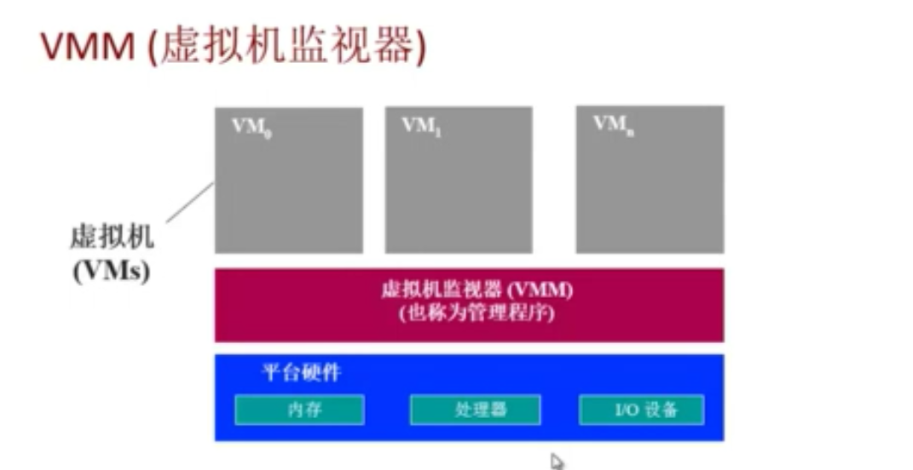

# 操作系统概述

- 操作系统是一套**系统软件**；
  - 软件：
    - 应用软件：直接向用户提供服务（功能）；
    - 系统软件：不直接向用户提供服务，为应用层序提供运行支持 ；
    - 
  - 考虑操作系统往往要从以下三个维度思考
    - 用户（纯粹的使用者）
    - 编程人员（应用程序开发者）
    - 操作系统开发人员（内核设计者）
- 功能角度（对上）：
  - 用户角度：
    - 操作系统是一个控制软件
      - 管理应用程序
      - 
  - 编程人员：
    - 
- 资源管理器（对下）
  
  - 管理外设、分配资源
- 操作系统层次结构：
  - 硬件之上：
    - **对下：统一管理硬件资源；**
      - 与硬件外设的交互主要通过中断机制实现；
  - 应用程序之下：
    - **对上：提供统一的编程接口；**
      - 通过系统调用、异常机制实现
- shell：
  - linux、Windows、Android的界面就是shell(外壳)，而不是外壳
  - shell是kernal与user的交互层
  - 在Windows系统下shell 就是GUI图形界面
  - 在Linux下shell就是命令行界面；
  - 
- Kernel主要内容：
  - OS对下的主要作用就是管理硬件，那么OS的组要组成部分也将是围绕这些硬件开的：
  - CPU：
    - CPU调度器
  - 内存：
    - 内存管理
    - 虚拟内存管理
  - 磁盘：
    - 文件系e统管理
  - 其它硬件设备：
    - 中断处理与设备驱动：
- OS Kernel的特征：
  - 并发：
    - 计算机系统中同时存在多个运行的程序；
    - 并行：
      - **一个时间点上有多个程序执行**；
        - 物理机上要求有多个CPU；
    - 并发：
      - **一段时间内有多个程序运行；**
        - 一个时间点上只有一个程序在运行；
  - 资源共享（多个应用程序使用同一个硬件资源）：
    - “同时”访问（分时复用，看起来是同时）
    - 互斥共享：
  - 虚拟：
    - 利用多道程序设计技术，让每个用户的都感觉有一个计算机专门为它服务
      - CPU---操作系统---进程；
      - 磁盘---操作系统--文件；
      - 内存---操作系统--地址空间；
  - **异步**：
    - 程序的执行不是一贯到底，而是走走停停，向前推进的速度不可预知
    - 但只要运行环境相同，OS需要保证程序运行结果也要相同
- 综合知识储备：
  - 程序设计语言
  - 数据结构
  - 算法
  - 计算机体系结构
    - 硬件外设
- 操作系统需要权衡
  - 空间与时间	
  
  - 性能与可预测性

  - 公平和性能
  
## 操作系统实例
- UNIX家族

  - UNIX BSD（伯克利软件发行版）
  - UNIX
  - Free BSD
  - IOS
  - HP
  - solaris
  - New BSD

- Linux家族(类UNIX系统)

  - redhat
  - ubuntu
  - debian
  - 红旗
  - andriod

- Windows家族

  - 桌面
  - 服务器
  - 移动终端

- 实时操作系统

## 操作系统演变过程
- 早期计算机使用纸袋传输程序和数据，操作系统只起到加载作用；
- 批处理阶段；
  - CPU等硬件快速发展，计算机速度得到提升的性能未得到充分利用
  - 将处理过程流水线化
- 多道程序设计：
  - 内存容量越来越来，CPU执行多道程序；
  - 将多个程序都读取到内存中，减少了硬件设备读、写操作时间
- 分时系统：
  - 时间片：
    - 定时器
  - 分时调度：
- 个人电脑操系统
- 多核多处理
- 分布式操作系统
  - 网络的快速发展
## 操作系统结构设计
-  宏内核
  - 所有的操作系统功能都组合在一起
  - 各个操作系统模块通过函数调用联系**（紧耦合）**
- 微内核
  - 系统功能模块化，内核中只保留核心功能（kernel）;
  - 模块之间通过消息传递配合完成一定的功能**（松耦合）**;
- 外核：
- 虚拟机（VMS） ：多操作系统共享硬件资源；
  - 

##  启动

- 

  

- DISK：存放bootloader、OS等
- BIOS:开机运行的一段固件（类似spl）
  - 上电自检
  - 初始化基本硬件
  - 加载、运行bootloader
    - 将bootloader从磁盘的引导扇区（512字节）加载到0x7c00
    - 跳转到CS:IP=0000:7c00
    - 
- BOOTLOADER:加载OS(类似uboot)
  - 硬盘的第一个扇区（521字节）
  - 加载、运行OS
    - 将操作系统的代码和数据从硬盘加载到内存中
    - 跳转到操作系统的起始地址

## 中断、异常、系统调用

- 操作系统提供的接口：

  - 外部设备：中断；
    - 来源与外设
    - 来自不同的硬件设备的计时器和网络的中断等；
  - 应用程序：系统调用、异常
    - 系统调用:
      - 来源与应用程序；
      - 应用程序主动向操作系统发出服务请求；
        - 应用程序不能直接访问硬件设备，只有操作系统（内核）可以操作硬件设备：
          - 在计算机运行中，内核是被信任的第三方；
          - 只有内核可以执行特权指令；
          - 为了方便应用程序；
            - 封装硬件提供统一的编程接口
    - 异常：
      - 来源于不良的应用程序；
      - 非法指令或者其他异常处理状态（内存溢出）
  - 

- 中断、异常和系统调用的比较

  - 源头不同：
    - 中断：外设(interrupt)；
    - 异常：应用程序意想不到的运行情况(exception)；
    - 系统调用：应用程序正常请求操作系统的服务（syscall）；
    - 

  - 处理时间点：
    - 中断：异步
      - 中断也称为异步事件：不知道什么时候会产生；
    - 异常：同步（可预计）
    - 系统调用：异步或者同步
      - 这里的异步、同步是参考系统调用的返回点
        - 同步：应用程序执行系统，应用程序等待系统调用的执行结果；
        - 异步：调用系统调用之后转去执行其他事情，系统调用执行完毕之后异步通知应用程序获取系统调用的执行结果
  - 响应状态：
    - 中断：持续，对用户应用程序是透明的（用户起始感觉不到）；
    - 异常：杀死或者重新执行意想不到的应用程序指令；
    - 系统调用：等待和持续；
    - 

- 中断和异常的处理机制
  - 中断是外设的事件
  - 异常时内部CPU的事件
  - 中断和异常迫使CPU访问一些被中断和异常服务访问的功能；
  - 中断的处理流程： 
    - 硬件：
      - 设置中断标记（CPU初始化）
        - 将内部、外部事件**设置中断标记**
        - 中断事件ID；
          - 外部中断触发->CPU进入到中断模式->发出具体的中断号 ；
    - 软件：
      - 保存当前处理状态；
      - 中断服务程序处理；
      - **清除中断标记**；、
      - 恢复中断前的执行环境；
  - 异常的处理：异常编号
    - 保存现场
    - 异常处理：
      - 杀死产生异常的程序
      - **重新执行异常指令**
        - 弥补
    - 恢复现场

系统调用的概念

- 应用程序的目的是要操作外设，但是出于安全和编程的方便性考虑，应用程序不能够直接访问硬件设备，所以需要在应用程序和硬件设备之间加一个隔离层即系统调用

  - 应用程序需通过调用系统调用获取操作系统服务；
    - 应用程序通过API调用对应的系统掉
      - win32 API 用于windows系统
      - POSIX API用于posix-based system
        - unix、Linux、Max OS x(所有版本)
      - Java API用于Java 虚拟机（JVM）
        - 其实Java API下层是POSIX API 或者是win32 API

  

-  系统调用的实现

  - 用户态：
    - 应用层序在运行是CPU所处的一个指令集的状态；
    - 指令集的特权级比较低；
  - 内核态：
    - 操作系统运行时CPU所处的指令集状态；
    - 可以执行所有指令；
  - 应用程序---library code---system call interface---用户态切换到内核态---系统调用函数；
    - 
  - **系统调用接口**
  - 系统调用
    - 与普通函数调用的区别：
      - 应用程序的普通函数调用其实是在一个栈空间中完成参数的处理
      - 系统调用其实涉及到用户堆栈到内核堆栈的切换
        - 开销比较大（跨越操作系统边界的开销）；
          - 在执行时间上的开销超过程序调用
            - 建立中断/异常/系统调用号与对应服务例程映射关系的初始化开销；
            - 建立内核堆栈
            - 验证参数
            - 内核态映射到用户态的地址空间更新页面映射权限
            - 内核态独立地址空间：Tlb
        - 但是安全、可靠

## 计算机体系结构/内存分层体系

- 计算机基本硬件结构
  - 

- CPU
  - 功能：取指---解码---执行
  - 组成：
    - 控制器
    - 运算器
    - 寄存器
    - cache
      - L1:指令缓冲Icache；
      - L2:数据缓冲Dcache;
      - 
    - 存储管理单元（MMU）：
      - 
      - 
- 内存:
  - **内存的层次结构：**
    -  
  - 寄存器、L1缓存都是位于CPU内部，操作系统无法直接管理该部分内存
    - 速度快、容量小；
  - 主存：
    - 物理内存：DDR等
  -  虚拟内存：
    - 物理硬盘；
- 设备（I/O）
- **操作系统在内存管理要完成的目标：**
  - 抽象：
    - 逻辑地址空间
    - 为应用程序提供来连续的地址空间；
  - 保护：
    - 独立地址空间
  - 共享：
    - 访问相同内存
  - 虚拟化
    - 更多的地址空间
- **操作系统内存管理的手段**：
  - 程序重定位
  - 分段
  - 分页
  - 虚拟内存
  - 按需分页虚拟内存
  - 内存管理高度依赖于硬件
    - 必须指定内存架构
    - MMU（内存管理单元）：硬件组件负者处理CPU的内存访问请求
  - 

## 地址空间&地址生成

- 地址空间定义：

  - 逻辑地址空间：**一个运行的程序所拥有的内存范围**

    - 起始地址0~地址MAXprog；

    - 所有的逻辑空间都要映射到物理地址空间；
      - 可能映射到主存中也可能映射到硬盘中；
    - 

  - 物理地址空间：硬件支持的地址空间

    - 硬件：主存、硬盘等
    - 范围：起始地址0-MAXsys;

  - 

- 地址空间生成

  - 逻辑地址生成：
    - 代码中的变量、函数本身就是地址标号
      - 每个*.o程序都是从0开始
      - 
  - 物理地址生成
    - CPU:
      - 运算器需要在逻辑地址的中的内容
      - 内存管理单元寻找逻辑地址和物理地址之间的对应关系
      - 如果找到对应该关系，控制器从总线发送在物理地址内存内容的请求；
    - 内存：
      - 内存发送物理地址内存的内容给CPU；
    - OS:
      - 建立逻辑地址和物理地址之间的映射关系 （映射表）
      - 

- 地址安全检查机制

  - 内存访问要在OS建立的逻辑地址与物理地址的映射关系中；

## 连续内存分配

- 内存碎片问题
  - 内存空间不能被使用
  - 外部碎片：
    - 在分配单元间的未使用内存
  - 内部碎片：
    - 在分配单元中的未使用内存
- 分区的动态分配
  - 第一适配
  - 最佳适配
  - 最差适配
- 压缩式碎片整理
- 交换式碎片整理

