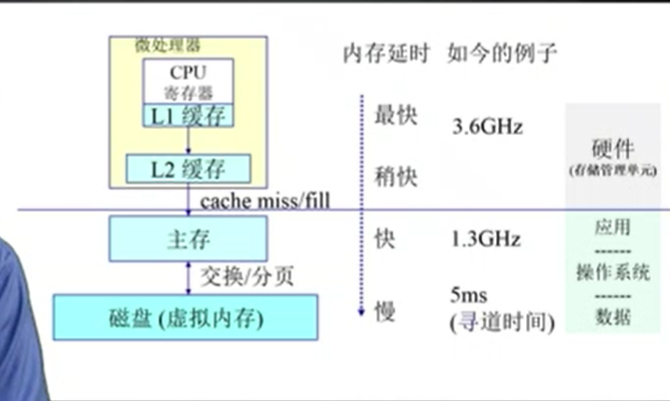
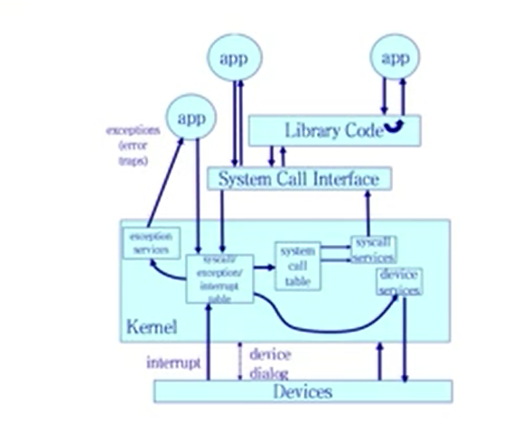

# 概述

- 操作系统没有一个精确的定义，有关操作系统的所有描述将从以下角度展开

  - 属性：  **操作系统是一套软件**
    - 应用软件
    - 系统软件
  - 层次：
    - 位于应用程序之下
    - 位于硬件之上
  - 功能：
    - **管理计算机硬件**（资源管理、分配器）：
      - CPU:进程、CPU调度相关
      - 内存：内存管理相关
      - IO设备：
        - 磁盘：磁盘管理相关
        - 基本输入、输出设备：设备驱动相关
        - 网络等
    - **为应用程序提供服务**：
      - 应用程序运行环境等；
    - **充当计算机硬件和用户的中介**：
      - 提供统一的编程接口等
      - 用户态、内核态等
      - 中断、系统调用、异常等；
  - 设计目的：
    - **PC所用的计算机系统**：即个人操作系统，以用户使用方便为最高设计目标，性能其次、几乎不在乎资源的使用率；
    - 大型机操作系统：操作系统设计为资源使用做优化
      - 多个用户可以通过终端连接到大型机，然后访问同一计算机，而且用户之间是可以资源共享，交换信息；
      - 只有一台物理机
    - 工作站操作系统：操作系统的设计目的是个人使用和i资源利用的折衷；
    - 移动终端设备系统：个人使用方便；

- **维度**：通常情况下考虑操作系统时要从以下三个角度考虑：

  - 用户：计算机使用者（最终用户），完全不需要考虑功能实现，只需要应用即可；

  - 应用程序开发者：基于当前操作系统进行应用程序开发的程序员，重点在于API的使用以完成特定的设计功能，不需要太多的关注底层设计实现；

  - 操作系统设计者：系统调用实现者，需要考虑计算机硬件的特性以及对应用程序开发者提供高效的API接口即封装底层硬件特性向应用层提供统一的编程接口（暂时将标准库的提供者等算在这个维度中）；

## 计算机系统组织

### 计算机操作系统

- **计算机系统部件的时间顺序**：
  - 为了运行用户程序和解决用户问题所以人们有了对计算机的需求，继而是对计算机硬件的研发
  - 但是裸机的硬件不一定容易使用（或者不高效），所以有了用户程序的开发，让程序代替用户去操作硬件，
  - 随后人们发现还需要一套机制用于管理计算机硬件资源以保证用户程序可以合理、高效的使用计算机硬件设备完以及提供一些基础服务（共同功能）（控制IO设备等功能，不需要每个用户程序都实现这些功能）完成特定的功能，所以才有了操作系统的需求；

- **计算机系统的组成：**
  - 计算机硬件：为系统提供基本的计算资源
    - CPU：一个或者多个
    - 内存
      - 主存：
      - 磁盘：
    - 输入、输出设备
    - cpu通过**总线**于各种控制器连接，CPU通过对控制器的访问实现对硬件的访问；
      - 
  - 操作系统：控制和协调各用户的应用程序对硬件的使用；
    - 操作系统本身不能实现任何有用的功能，它只不过是提供了一个方便其他程序有有用工作的环境；
  - 系统程序和应用程序：规定了用户按何种方式使用计算机资源；
    - 
  - 用户：通过应用程序操作计算机硬件资源实现特定的目的；
  - 

- **计算机系统的启动流程**

  - 按下电源按键、系统上电；
  - 运行BIOS程序：
    - 通常位于ROM或者EEPROM中，称为计算机硬件中的固件；
    - 功能类似于spl固件功能；
      - 硬件上电自检；
      - 基本硬件设备的初始化：
        - CPU寄存器的初始化；
        - 设备控制器初始化；
        - 内存初始化；
  - 加载、运行bootloader程序
    - 磁盘的第一个扇区的512字节内容（其实引导程序部足512字节大概446字节）
    - 从磁盘中将OS加载到内存中；
  - 操作系统开始执行第一个进程（init进程），并**等待事件的发生**；

- **操作系统的接口**

  - 硬件：（硬件中断）
    - 来源：硬件设备；
    - 硬件设备随时可以通过系统总线CPU发出信息，以触发中断
  - 软件：(软中断)
    - 系统调用（system call）：
      - 监视器调用(monitor call):
      - 来源：应用程序直接、间接（通过标准库函数）嗲用系统调用；
    - 异常：
      - 来源于不良的应用程序；
      - 非法指令或者其他异常处理状态（内存溢出）；

- 操作系统能够“感知”到事件的发生

  - 事件的发生通常是通**过硬件或者软件中断**来表示；
  - 当CPU被中断时，它停止正在做的事情并保存当前的 执行状态，立即转到固定的位置去执行
    - 固定的位置通常时中断服务程序的的开始位置；
  - 中断读物程序开始执行，在执行完之后，CPU重新执行被中断的计算
  - 对应用程序来说这一切都是透明的好像什么都没有发生过一样；
  - 中断是OS中的一大块重要的内容；

### 存储结构

- **根据访问速度和价格，可以按照层次结构来组织计算机系统的部同类型的的存储系统**
- 层次越高,越靠进CPU，速度越快，单位存储价格越高，容量越小
  
- 层次越低,越远离CPU，速度相对较低，单位存储价格相对较低，容量越大
  
  - 其中寄存器、高速缓冲是CPU内部存储资源
      - 寄存器的访问速度就进似乎表征了CPU的速度；
      - 
    - 高速缓存又可以分为：
    - 对于两个部分存在较大访问时间或者速率差别时，通过高速缓存改善性能；
    - 
    - L1缓存:Icache;
      - L2缓存:Dcache;
    - 
  
- **计算机系统中的存储器也可以按照如下角度划分：**
  - 易失性（掉电数据丢失）
    - RAM:
      - DRAM:动态随机存储器，需要靠充电来保持数据
        - SDRAM
        - DDR SDRAM
        - DDRII SDRAM
        - DDRIII SDRAM
      - SRAM：静态随机存储器
        - 保存数据靠的时候晶体管的锁存
        - 速度快、成本高、容量小，
        - **寄存器，cache一般是使用SRAM介质实现**
        - 
  - 非易失性（掉电数据部丢失）
    - ROM(read only memory)
      - MASK ROM
      - PROM
        - OTPROM
        - EPROM
        - EEPROM
    - FLASH
      - NOR FLASH
      - NAND FLASH
        - **FLASH与EEPROM比较**
          - 介质不同
          - 容量不同
          - 访问接口
            - EEPROM通常是IIC协议
            - flash
              - nor flash(串行flash)：SPI协议
              - nandflash：总线协议
                - U盘：
                - SSD固态硬盘等；
      - 
    - 光盘
    - 软盘
    - 机械硬盘
    - 磁带
    - ....
  - 

- **主存、辅存的由来：**
  - 主存(内存))一般是指操作系统可以直接访问的唯一的大容量存储区域
    - 随机访问内存（random access memory,RAM）
    - 通常是DDR；
    - 
  - 辅存：作为内存的的扩充存在
    - 内存太小，不能用永久的存储所有需要的程序和数据
    - 内存是易失性存储设备，当掉电时会失去所有内容；
    - 通常是磁盘；
- **CPU：取值--解码--执行**
  - CPU首先从内存中获取指令，并保存在**指令寄存器**中，
  - 指令被解码，并可能导致从内存中获取操作数活将操作数保存在内部寄存器中；
  - 
  - 在指令完成对操作数据的执行后，其结果可以存回到内存中，
- 程序为什么要运行在内存中：
  - 变量数据的更改
    - 所以要求要可以执行写入操作
  - 随机访问（即可以按字节寻址）

### IO结构

- **CPU、总线、设备控制器、设备**

  - 通用计算机系统由一个CPU和多个**设备控制器**组成，他们通总线进行链接
  - 每个设备控制器负责特定类型的设备，可有多个设备与之相连接；
  - 设备控制器维护一定量的本地缓冲存储和一组特定的用途的寄存器，设备控制器复制在所控制的外部设备与本地缓冲区之间进行数据传递
    - 寄存器即CPU的寄存器地址空间
    - 本地缓存存储地址空间其实是驱动代码将内存区域分配给设备控制器

- CPU、设备控制器、设备、操作系统

  - 设备控制器：控制设备、与设备进行数据交互；

    - 通过控制**寄存器**控制设备；
    - 通过本缓存存储空间与设备进行数据交互；
      - 加载、存储设备数据（即向设备发送、接收数据）

  - CPU：

    - 设备数据处理；
    - 设备控制的控制寄存器地址空间由

  - 操作系统

    - 提供控制设备控制器的**设备驱动程序**；

  - 大概流程

    - CPU执行相应的读设备指令：

    - 操系统调用设备驱动程序在设备控制器中装载适当的寄存器，

    - 设备控制器检查相关寄存器的内容以决定采取什么操作

    - 控制器向其本地缓存区中传输数据，

    - 一旦完成数据传输，设备控制器通过中断（或者其它方式）通知设备驱动程序，对应的操作以及完成；

    - 设备驱动程序返回对操作系统的控制，

## 计算机系统体系结构

### 单处理器系统

- 

### 多处理器系统

### 集群系统

## 操作系统结构

- **从操作系统的所在层次以及功能上来看操作系统的结构（组成或者是主要功能）**
  - 对上提供统一的编程接口
    - 操作系统提供执行程序的环境
    - 操作系统通过**系统调用**向应用程序提供服务
  - 对下管理计算机的硬件资源
    - CPU:CPU---操作系统---进程；
      - CPU包含MMU：地址空间映射；
      - CPU调度;
      - 进程管理;
      - 进程通信;
      - 进程死锁
      - ...
    - 内存：内存---操作系统--地址空间
      - 内存管理
      - 虚拟内存
        - 逻辑内存
        - 物理内存
      - 内存映射
      - ....
    - 设备
      - 磁盘:磁盘---操作系统--文件：
        - 磁盘存储
        - 文件系统管理
        - ....
        - 
- **多道程序处理**（多任务处理，CPU调度）
  - **使得CPU总有一个作业可执行，从而提高CPU的利用率**
  - 处理流程：
    - 操作系统同时将多个任务保存在内存中
    - 操作系统选择以一个位于内存中的作业并开始执行，
    - 该作业可能必须要等待另外一个任务（比如IO操作）的完成，
    - 对于多道程序设计，CPU会简单的切换道另外一个作业并执行，
      - **对于非多道程序设计CPU需要在此等待，即CPU进入到空闲状态**
    - 当重新载入执行的作业需要等待时吗，CPU会切换到下一个作业
    - 最后，第一个作业完成等待并且重新获取到CPU的运行权限，
  - 多道程序系统设计提供了一个可以充分使用各种系统资源的环境，但是他们**没有提供与计算机系统直接交互的能力**？？？
- **分时系统（多任务系统）**
  - 分时系统是多道程序设计的延申
  - 在分时系统中，虽然CPU还是通过在作业之间切换来执行多个作业，但是由于切换频率很高，用户可以在程序运行期间与值进行交互
  - **分时操作系统主要是针对于多用户来说的，而多道程序系统主要是针对于多程序来说的**。
- **分时系统作业调度、执行：**
  - 分时和多道程序设计需要在存储去中同时保存几个作业
  - 通常由与主存较小而不能容纳太多作业，所以这些作业要存储在磁盘的**作业池（job pool）**中，
    - 该池由所有驻留在磁盘中需要等待分配内存的作业组成，
    - 如果多个作业需要调入内存但是没有足够的内存，那么系统就必须在这些等待的作业中做出选择，这样的决策机制称为**作业调度（job scheduling）**
  - 当操作系统从作业池中选中一个作业就将其调入内存执行
    - 在内存中同时又多个任务需要执行，那么必须做出选择，这样的的选择称为**CPU调度（CPU scheduling）**
  - 最后，多个并发执行的作业需要操作系统在各方面的限制，进程的相互影响，如**进行调度、磁盘存储、内存管理**等
- **分时系统响应时间的合理性**：
  - 在分时操作系统中没，操作系统必须**保证响应时间的合理性**，有时需要通过交换来得到，交换时进程被换入内存或者又内存换出到磁盘；
  - 虚拟内存（virtual, memory）:
    - 虚拟内存允许将一个执行的作业不完全放在内存中，
    - 优点：
      - 程序可以比**物理内存**大，
      - 将内存抽象成一个庞大且统一的存储数组，将用户所理解的**逻辑内存**与真正的物理内存区分开来，这种安排使得程序员不比为内存空间的限制为担心
- **分时系统的文件系统**
  - 分时操作系统也必须提供**文件系统**
  - 文件系统驻留在磁盘上，所以系统也必须提**磁盘管理**

## 操作系统操作

- 现代操作系统是由事件驱动的，事件是由中断引起的

  - 中断：
    - 软中断
      - 系统调用：
        - 应用程序的服务请求；
      - 陷阱（异常）：
        - 来源
          - 应用程序的异常错误
          - **应用程序的特别请求**
    - 硬中断：
      - 来源真是的硬件设备服务

  

### 双重模式操作

- 为了确保操作系统的正常执行，必须区分系统代码和用户定义代码的执行；

  - 用户的的某一个任务发生异常不能影响到操作系统或者其他用户程序的执行；
  - 至少需要两种独立的操作模式
    - 用户模式（user mode）：
      - 当计算机系统表示用户应用程序正在执行，系统就处于用户模式
    - 系统模式（system mode）:特权模式（privileged mode）,管理模式（supervisor mode）,监督模式（monitor mode），**内核模式（kernel mode）**;
      - 当用户应用程序需要操系统服务，它必须从用户模式切换到系统模式执行请求；
        - 操作系统通过系统调用向应用程序提供服务
      - 
  - 提供**硬件支持**以区分执行模式；
    - 在计算机硬件中增加一个**模式位（mode bit）**，以表示当前模式，
      - 用户模式:1
      - 系统模式:0

- **系统引导时，硬件处于内核模式**，接着，装入操作系统，开始在用户模式下执行用户进程，一旦出现陷阱或者中断，**硬件会从用户模式切换到内核模式**，系统在将控制权交还给用户的时候切换到用户模式；

- 双重模式通过区分不同模式下可执行的指令集的不同以大道保护操作系统和用户程序不受错误用户程序影响

  - 用户模式下不可以执行**特权指令**
    - 在用户模式下执行特权指令，那么硬件并不执行该指令，而且认为该指令是非法指令，并将其以陷阱的方式通知操作系统；
  - 内核模式下拥有该计算机系统下所有指令的执行权限；

- **系统调用**

  - 功能：用户程序请求操作系统代表用户程序完成预留给操作系统的任务的接口；
  - 组成：
    - **系统调用接口**	
      - 用户程序可以直接调用系统调用也可以通过系统调用接口调用对应的系统调用
      - 
    - **系统调用服务程序**
      - 系统调用服务程序是操作系统的一部分；
  - 调用过程：
    - 当系统调用被执行时，硬件会将他作为软件中断，
    - 控制权通过中断向量转交到操作系统中的中断处理程序，模式位被设置位内核模式
    - 内核检查中断指令以确定发什么了什么系统调用
    - 内和检查参数的合法性
      - 参数的作用：
        - 需要表明用户应用程序请求的服务类型
    - 执行对应的系统调用服务程序
    - 然后将控制返回到系统待用之后的指令（回到用户程序）；

  

### 定时器

- 必须确保操作系统能维持对CPU的控制，也必须防止用户程序陷入死循环或者不调用系统服务，并且不将控制权返回给操纵系统

- 可将定时器设置为在给定的时间后中断计算机，可以防止用户程序运行时间过长，

  - 时间段可以是固定(1/60s)；
  
  - 也是是可变的（1ms--1s）；
  
## 操作系统主要讨论主题

### 进程管理

- **进程**：
  - 处于执行中的程序被称为进程；
    - 存储在磁盘空间上的未被载入的是可执行文件；
    - 可执行文件需要通过loader应用程序进行装载；
  - 程序并不进程，程序是被动的实体，而进程时是一个活动的实体，
  - 进程是系统的工作的单元，系统由多个进程组成，其中一些是操作系统进程（执行系统代码），其余的是用户进程（执行用户代码）；
- 进程资源：
  - 进程需要一定的资源（CPU时间、内存、文件、IO设备）已完成其任务：
    - 这些资源可以是进程创建的时候分配给进程；
    - 也可以是进程执行过程中分配给进程；
  - 当进程终止时操作系统将会**所有可再用的资源**；
- 进程相关话题
  - 创建和删除用户进程、系统进程
  - 挂起和重启进程
  - 提供进程同步机制
  - 提供进程通信机制
  - 提供死锁处理机制

### 内存管理

- **内存：**
  - 内存是一个大的**字节或字**的数组，每个字节、字都有自己的地址
  - 内存是可以被CPU、IO设备共同快速访问的数据残酷，
    - CPU在指令取指周期时从内存中读取指令；
    - 在获取数据周期时对内存内的数据进行读出、写入；
    - 内存是CPU所能直接**寻址**和访问的唯一大容量存储；
      - CPU并不会直接操作磁盘内的数据，
        - 如果CPU需要处理磁盘内的数据，数据必须首先通过CPU生成的IO调用传送到内存中
- 内存相关话题
  - 记录内存的哪部分正在被使用以及被谁使用；
  - 当由内存空间时，决定哪些进程可以被装入内存；
  - 根据需要分配和释放内存空间；
  - 
### 存储管理

- 在操作系统层面并没有磁盘的概念，操作系统对存储设备物理属性进行了抽象，定义了逻辑存储单元，**文件**；‘
  - **文件：是由其创建者定义的一组相关信息的集合；**
  - 通过对文件的读、写、访问实现了对磁盘的访问；
  - 在操作系统中文件的概念相当广泛：

#### 文件系统管理

- **文件相关话题：**
  - 创建、删除文件
  - 创建、删除目录来组织我呢见
  - 提供操作文件和目录的原语
  - 将文件映射到**二级存储上**；
  - 在稳定存储介质上备份文件；

#### 大容量存储器管理

- 由于内存太小不能容纳所有的数据和程序，再加上掉电会失去所有数据，计算机必须提供二级存储器以备份内存，
  - 现代操作系统 都采用**硬盘**作为主要的在线存储介质来存储数据和程序；
- **磁盘相关话题：**
  - 空闲空间管理
  - 存储空分配
  - 硬盘调度

#### 高速缓存

- cache的存在就是为了解决CPU、内存、磁盘速度不一致导致的的短板效应问题，
  - 当CPU需要特定的信息时，首先检查它是否在高速缓存中 ，
  - 如果在，直接使用高速缓存中的数据，
  - 如果不在，使用位于内存中的信息，同时将其复制到高速缓存以便下次使用，

- 高速缓存在一个存储系统中是多级存在的

  - 寄存器、L2、L2可以作内存的高速缓存
  - 内存可以是外存储的高速缓存
    - 外存数据必须先复制到内存才可以使用；
    - 数据在移至外存保存前以为必须保存在内存中；

- 数据移动方式

  - 显示：
    - 磁盘到内存的数据传递通常是由操作系统控制的；
  - 隐示：
    - 高速缓存到CPU和寄存器之间的数据传递通常是硬件功能实现，无需操作系统的干预；

- 数据层次

  - 情景：整数A位于文件B且需要加1，而文件B位于磁盘上

  - 首先，CPU发出IO操作将A所在的磁盘块调入内存，

    - 打开文件、读取文件

  - 之后，A由内存复制到高速缓存中和硬件寄存器

    - A之前不在缓冲，使用内存中A数据到寄存器进行操作，同时是将A复制到高速缓存中；

  - 到目前位置A出现的地方磁盘、内存、高速缓冲、硬件寄存器；

  - 一但寄存器中A的值执行了加法运算，那么当前系统中各个存储结构中A的数值将会出现不一样；

    - cache中的数据是否与reg中的数值保一致；
    - **高速缓存一致性**
    - 

  - **只有A的新值从内部寄存器写回磁盘时，A的值才会一样；**

  - 

    

### IO系统

- IO相关话题
  - 一个包括缓冲、高速缓冲、假脱机的内存管理部分；
  - 通用设备驱动接口；
  - 特定的硬件设备驱动程序；

### 保护和安全

- **保护：**
  - 是一种控制进程或者用户对计算机系统资源的访问的机制；
  - 这个机制必须为强加控制提供一种规格说方法和一种强制执行方法；
- **安全**：
  - 安全的主要工作是防止系统不受外部或内部的攻击，
    - 病毒、蠕虫、服务偷窃、拒绝服务攻击
- 

### 分布式系统

- **分布式系统**：
  - 将一组物理上分来的，各种**异构**的计算机系统通过网络连接在一起，为用户提供系统所维护的各种资源的**计算机集合*
    - 访问共享资源增加了计算速度、功能、数据可用性及可靠性
  - 分布式系统通过**网络**，提供功能
- 网络：
  - 对于操作系统而言，一个网络协议只简单的需要一个接口设备（网络适配器），加上管理它的驱动程序以及按网络协议处理数据的 软件；
- **网络操作系统：**
  - 提供跨网络的文件共享、包括允许在不同计算机上的进程进行进行消息切换的通信方法等功能，
  - 相对于网络上的其他计算机，运行网络操作系统的计算机是**自治的**
    - 分布式操作系统提供较少的自治环，不同的操作系统紧密地联系在一起，就好像一个操作系统在控制网络一样；

### 专用系统

- 专用系统区分通用的计算机系统，这类操作系统的功能有限，其目的在于处理有限的计算领域；

#### 实时嵌入式系统

- 嵌入式系统
  - 嵌入式设备运行的操作系统
    - 有些是通用计算机，运行标准的操作系统，如UNIX，具有专门的应用程序来实现其功能；
    - 有些只具有很少甚至没有用户户接口，而将他们的时间花费在监视和管理硬件设备上；
- 实时系统
  - 有明确而固定的时间约束，处理必须在固定时间约束内完成；

#### 多媒体系统

- 专业的处理多媒体数据

#### 手持系统

- 移动端设备系统
- 

### 计算环境

#### 传统计算

- 几乎所有的工作都在个人独立的计算机上完成；

#### 客户机-服务器计算

- 

- 计算服务器系统：
  - 提供一个接口，以接收用户所发送的执行操作的请求（如读取数据）执行操作，并将操作结果返回给客户机
    - 运行响应客户机数据请求的**数据库**；
- 文件服务器系统：
  - 提供文件系统接口，以便客户机能创建、更新、访问和删除我呢见
    - Web服务器：他将我呢见传输到正在运行Web浏览器的客户机
- 

#### 对等计算

- 不存在客户端、服务端的概念，同一个网络的下的所有节点都是对等的
  - 如果需要提供服务：服务端
  - 如果需要请求服务：客户端
  - 

#### 基于web计算

## 操作系统家族

- UNIX家族

  - UNIX BSD（伯克利软件发行版）
  - UNIX
  - Free BSD
  - IOS
  - HP
  - solaris
  - New BSD

- Linux家族(类UNIX系统)

  - redhat
  - ubuntu
  - debian
  - 红旗
  - andriod

- Windows家族

  - 桌面
  - 服务器
  - 移动终端

- 实时操作系统

# 操作系统结构

- 不同角度看待操作系统
  - 用户：提供什么服务---考察操作系统所提供的服务；
  - 程序员：如何提供服务---考察操作系统为用户、程序员提供的接口
  - 操作系统设计人员：设计系统的各种方法---研究系统各个组成部分机及其关系；

## 操作系统服务

- 用户界面：所有的操作系统都有用户界面（user interface）
  - 命令行界面：command line:
    - 采用文本命令，并用一定的方法输入
    - 批界面：控制这写命令和命令的指令被输入文件中，通过执行文件来实现；
      - Windows 系统下的批处理文件；
  - 图形用户界面:graphical user interface:
    - 视窗界面，它具有定位设备来指挥IO、从菜单来选择、选中部分并用键盘输入文本；
    - Windows PC操作系统
- 程序执行：
  - 系统必须能将程序装入内存并运行程序，程序必须能结束执行，包括正常或不正常结束
    - 3种异常：
      - 调用abort
        - 函数向调用者发送SIGABRT信号；
      - 接到一个信号并终止
      - 最后一个线程对取消（cancel）请求做出响应；
    - 5种正常：
      - retrun函数返回
      - 调用exit函数
      - 调用_Exit函数或\_exit函数
      - 最后一个线程从其启动例程返回
      - 最后一个线程调用pthred_exit
      - 
- IO操作：
  - 用户通常不能直接控制IO设备，因此操作系统必须提供进行IO操作的方法；
- 文件系统操作：
  - 程序需要读写文件和目录也需要根据文件名来创建和删除文件、搜索一个给定的文件、列出文件信息
  - 
- 通信：
  - 一种是发生在同一台计算机运行的两个进程之间的通信，
  - 一种是运行在由网络连接起来的不同的计算机上的进程之间的通信
- 错误检查：
  - 操作系统需要知道可能出现的错误，并采取适当的动作以确保正确和一致的计算；
  - 错误可能是来自CPU、内存硬件、IO设备、用户程序对呢等
  - 
- 资源分配：
  - 当同时有多个用户或者多个作也运行时，系统必须为他们种的每一个分配资源，
    - CPU资源
    - 内存资源
    - 打印终端
    - ...
    - 
- 统计：
  - 需要记录哪些用户使用了多少和什么类型的资源
    - 
- 保护和安全：
  - 保护：
    - 当多个进程并发执行时，一个进程不能干预另外一个进程或操作系统本身
    - 保护即确保所有对系统资源的访问都是受控的；
  - 安全：
    - 不受外界侵犯

## 操作系统的用户界面

- 目前的来看所有的操作系统实现用户界面的方法无外乎
  - 提供命令行界面或命令中断，允许用户字节输入操作系统完成的命令；
    - UNIX系统
  - 提供图形用户界面，允许用户通过图形用户界面与操作系统交互；
    - Windows系统
- 无论是何种方式的用户界面其目的只有一个：提供给用户（普通用户、程序员）与操作系统的交互接口即shell;
  - 

### 命令解释程序

- **命令解释程序存在形式**：
  - 有的操作系统在其内核部份包含了命令解释程序；
  - 有的操作系统将命令解释程序作为一个特殊的程序（应用程序）；
    - 当一个任务开始时或者用户首次登录时就会运行该命令解释程序；
  - 
- **命令解释程序类别：**
  - 在Unix、Linux系统中就有多中不同的Shell可供用户选择：
    - C Shell
    - Bourne Shell
    - Korn Shell
    - ...
    - 各种版本的shell只有细微的差别，都是提供类似的功能，许多用户对shell的选择只是基于个人偏好
- 命令解释程序的工作方式:
  - **命令解释程序的主要作用是获取并执行用户的下一条指令**；
  - 命令解释程序本身包含了代码以执行这些命令：
    - 比如要执行删除文件的命令，命令解释程序在识别到删除命令之后就执行对应的删除分支代码
    - 对于这种方法，所能提供的命令的数量决定了命令解释程序的大小；
    - **可以想象为一个大的switch结构**
  - 命令解释程序只负责用命令识别文件（可执行程序）并装载入内存并执行
    - 比如要执行删除文件的命令，命令换行解释程序会搜索名rm的文件，将该文件装入内存，并将参数传递到rm文件中，以完成删除文件的功能，具体的删除文件功能代码并不在命令解释器程序中实现
    - 程序员能通过传教合适名称的新文件以轻松的向系统增加新命令，在新加命令时不需要对命令解释器程序作修改；
    - 命令解释器程序其实就是一个简单的字符串处理函数+exec函数；
  - 

### 图形用户界面

- 图形用户界面：
  - GUI允许提供基于鼠标的窗口和菜单作为接口
    - 用户移动鼠标把指针定为到屏幕的图像上，即选择执行相应的功能
    - 图标代表程序、文件、目录和系统功能；
  - **1973年产生了第一个GUI界面；**
- 目前来看，用户界面可随系统的不同甚至用户的不同而变换，**它经常被从实际系统结构中删除；**
  - 用户界面已经不再是内核关注的模块；
- **选择命令行还是图形用户界面完全是工作环境以及个人喜好的选择**
  - 现在的操作系统基本上命令行和GUI都会提供
  - 

## 系统调用

-  系统调用是什么
  - 为什么要有系统调用
- 系统调用的使用方式
- 系统调用的工作原理
- 系统调用的类型
- 

### 系统调用
- 操作系统与外界的接口
  - 中断：
  - 异常（陷阱）：
  - 系统调用：
    - 应用程序的进程通常在user模式下运行，当它调用一个系统调用时，进程进入kernel模式，执行的是kernel内部的代码，从而具有执行特权指令的权限，完成特定的功能。换句话说，系统调用是应用程序主动进入操作系统内核的入口。
- 系统调用（system call）
  - 提供了操作系统提供的有效服务界面
    - **操作系统服务的接口提供者**：即通过执行系统调用即调用相关操作系统服务
    - **操作系统服务的实现者**：系统调用服务程序的实现即是操作系统服务的实现函数；
- 系统调用的调用：
  - 
  - 对于应用程序的编写人员来说
    - 可以通过标准的库函数API调用相应的系统功能，
    - 可以直接通过系统调用接口调用对应的系统调用；
      - **_syscall\*()**，
    - 可以直接调用系统调用
  - API接口：
    - API是一系列适用于应用程序的函数，包括传递给每个函数的参数及其返回值；
      - 其实应用程序接口也调用了相应的系统调用接口；
    - 常用API:
      - win32 API 用于windows系统;
      - POSIX API用于posix-based system:
        - Unix、Linux、Max OS x(所有版本);
      - Java API用于Java 虚拟机（JVM）:
        - 其实Java API下层是POSIX API 或者是win32 API;
      - 
- 系统调用接口：
  - 绝大多数程序设计语言的运行时支持系统（与编译器一起预先构造的函数库）提供了系统调用接口，作为应用程序和操作系统的系统调用的链接
  - 通常，每个系统调用与一个与其相关的数字绑定，系统调用接口根据这些数字维护一个列表索引，然后，每个系统调接口来调用所需要的操作系统内核中的系统调用，并返回系统的调用状态及其它返回值
    - 数字：即功能码，可以想象成iocntl;
  - **大多数系统调用都在各种C语言函数库中有所实现，所以在一般情况下，我们都可以像调用普通的库函数那样调用系统调用，只在极个别的情况下，我们才有机会用到_syscall*()宏传递对应的系统调用标号调用对应的系统调用**
- API编程：
  - 程序的可移植性;
    - 一个才有API设计程序的应用程序员希望他的程序能在任何支持通用API的系统上编译并执行；
      - 比如标准C函数中打开一个文件执行的fopen（）
      - 该功能可以在windows 系统上执行
        - 实际调用openFile()系统调用；
      - 可以在Unix系统上执行；
        - 实际调用open（）系统调用；
  - 保护操作系统；
- 操作系统传参：
  - 通过寄存器传递参数：
    - 传递的参数数量有限；
  - 通过寄存器传递参数的地址：
    -  当参数较多时可以间参数块的地址传递给寄存器；
  - 堆栈传参：
    - 参数可以通过程放在或者压入堆栈中，并通过操作系统弹出；
  - 
- 系统调用工作原理：中断陷入内核---查找中断向量表--识别中断为系统调用类型---查找对应的系统调用表---执行对应的系统调用实现函数--函数执行完毕---回到用户空间；
  - 一般的，用户进程是不能访问内核的。它不能访问内核所占内存空间也不能调用内核函数。CPU硬件决定了这些（这就是为什么它被称作"保护模式"）。系统调用是这些规则的一个例外。
  - 其原理是进程先用适当的值填充寄存器，然后调用一个特殊的指令，这个指令会跳到一个事先定义的内核中的一个位置（当然，这个位置是用户进程可读但是不可写的）。
    - 在Intel CPU中，这个由中断0x80实现。硬件知道一旦你跳到这个位置，你就不是在限制模式下运行的用户，而是作为操作系统的内核所以你就可以为所欲为。
    - 进程可以跳转到的内核位置叫做sysem_call。
    - 这个过程检查系统调用号，这个号码告诉内核进程请求哪种服务。然后，它查看系统调用表(sys_call_table)找到所调用的内核函数入口地址。
    - 接着，就调用函数，等返回后，做一些系统检查，最后返回到进程（或到其他进程，如果这个进程时间用尽）。

### 系统调用类型

#### 进程控制

- 结束、终止
- 装入、执行
- 创建进程、终止进程
- 获取进程属性、设置进程属性
- 等待时间
- 等待事件、唤醒事件
- 分配和释放内存

#### 文件管理

- 创建文件、删除文件

- 打开文件、关闭文件

- 读、写、重定位文件

- 获取文件属性、设置文件属性

  

#### 设备管理

- 请求设备、释放设备；
- 读、写、重定位
- 获取设备属性、设置设备属性

- 逻辑链接或打开设备

#### 信息维护

- 读取时间或日期、设置时间或日期

- 读取系统数据、设置系统数据

- 读取进程、文件或设备属性

- 设置进程、文件或设备属性

  

#### 通信

- 创建、删除通信连接
- 发送、接收消息
- 传递消息状态
- 连接或断开远程设备
- 

#### 系统程序

- 计算机逻辑层次（由上到下）：
  - 应用程序
  - 系统程序
  - 操作系统
  - 计算机系统硬件
- **系统程序**
  - 即系统工具：设备管理器、任务管理器、磁盘管理器等等；
  - 系统程序可以其实以及属于应用程序，但是与纯粹的应用程序又有区别，介于应用程序和系统调用（操作系统之间）；
  - 系统程序提供了一个方便的环境，以开发程序和执行程序：
    - 比如编译器、链接器、装载器、编辑器；
- **系统程序分类**：
  - 文件管理：这些程序创建、删除、复制、重新命名、打印、转储、列出和操作文件、目录；
  - 文件修改：有多个编辑器可以创建和修改位于磁盘或其他设备上的文件内容，
  - 状态信息：一些程序从系统那里获取到时间、日期、可用内存或可用磁盘空间，设备管理器、任务管理器等
  - 程序语言支持：常用程序设计语言的编译程序、汇编程序、调试程序和解释程序通常与操作系统一起提供给个用户
    - 比如Ubuntu下自带gcc python的编译器
  - 程序装入和执行：一旦程序汇编或者编译之后，它必须装入存才能运行，系统可能要提供绝对加载程序、重定位加载程序、链接编辑器和覆盖是加载程序；
  - 通信：提供在进程、用户和计算机系统之间创建虚拟连接的机制，他们运行用户在相互的屏幕上发送消息、浏览网页、发送电邮、从一台机器向另外有一台及其传输文件
  - 

## 操作系统设计和实现

- 策略：决定做什么
- 机制：决定怎么做
- 

## 操作系统结构

### 简单结构

- 没有明确的定义的结构，没有明确的区分结构和功能接口，没有硬件的支持；
  - MS-DOS：
    - 
  - 原始的UNIX系统：

### 分层结构

- 

### 微内核

### 模块

## 虚拟机

## 系统生成

## 系统启动

