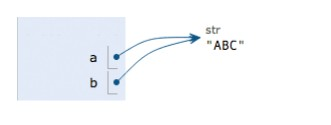
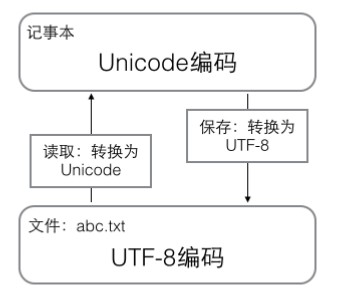
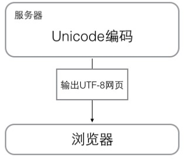
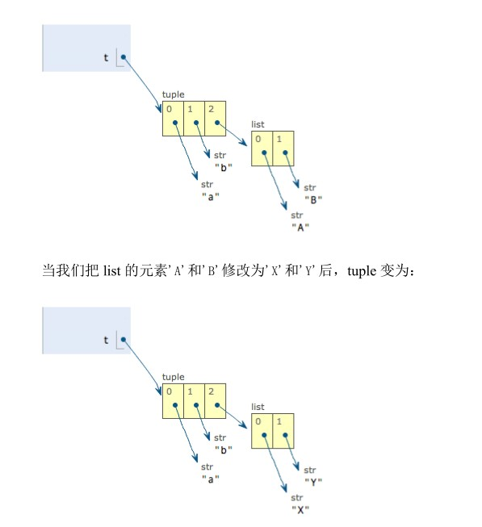

# 基础语法

## 基础

1. 当句号以“：”冒号结尾时，缩进的语句视为**代码块**
    - 同一代码块中的语句保持缩进一致；
    - **具体的缩进数量或者是tab并没有严格的要求，一般程序员的习惯都是4个空格缩进（一个tab键）**；
    - 缩进给粘贴、复代码带了不便
    - 缩进强迫程序员将大段代码拆分成若干函数（代码块），因为大段代码的缩进很难控制
2. Python是**大小写铭感**语言；
## 输入和输出

### 输出

1. Python语句的注释是“#”；

2. python语句后面可以加分号也可以不加；

    - 加分号是为了保留编程习惯；

3. Python中的代码段不是以花括号界定，直接用缩进区分不同的代码段，也可以理解为以前C等编程语言中使用到花括号的地方在Python中以缩进代替就可以了；

4. python是**弱类型**语言，即变量没有数据类型；

5. 用print()在括号中加上字符串，就可以向屏幕输出指定的文字;

6. print()函数可以接收多个字符串，用逗号隔开，就可以连成一串输出

    - 输出时逗号被空格替代；

        ```python
        print("hello","xptd")
        ------------------
        hello xptd
        ```

7. print()也可以直接打印整数或者计算结果：

    - **print()函数中逗号的作用**

    ```python
    print(1024);
    print(1024*1024)
    print("100+200=",100+200);
    ---------------------------
    1024
    1048576
    100+200= 300
    ```

8. 

### 输入

1. input()：可以让用户输入**字符串**，并存放到一个变量里面；

    ```python
    str = input()
    print("the input is:",str)
    -------------------------
    xptd
    the input is: xptd
    
    请按任意键继续. . .
    ```

2. input()函数可以携带输出消息；

    ```python
    str = input("please input a name:")
    print("hello:",str)
    ---------------------------
    please input a name:xptd
    hello: xptd
    
    请按任意键继续. . .
    ```

## 数据类型和变量

### 数据类型

python 中可以**直接处理**的数据类型：

1. 整数：python可以处理任意大小的整数；

2. 浮点数：浮点数即小数；对于很大、很小的浮点数必须用科学计数法表示

    - 整数和浮点数在计算机内部的存储方式是不同的，整数运算永远是精确的，而浮点运算可能会四舍五入；

3. 字符串：字符串是以**单引号**或者**双引号**括起来的任意文本：

    - “i'm ok”

    - 'I\\'m \\"OK\\"!':使用转义字符串保证一个字符串中同时包行单引号，双引号；

    - r“string”:r表示内部字符串不进行转义；

        ```python
        
        str = 'i \' am \"xptd\"'
        str1 = r'i \' am \"xptd\"'
        print(str, str1)
        
        ----------------
        i ' am "xptd" i \' am \"xptd\"
        ```

    - python允许使用'''dadas'''格式表示多行内容：

        ```python
        print('''123
        	456
        	789454545''')
        --------------------------
        123
        	456
        	789454545
        ```

        

4. 布尔值：在python中可以直接用True、False表示布尔值，也可以通过布尔运算计算出来

    - 布尔值可以直接参与运算:

        - True:1;
        - False:0;

        ```c
        print(True+True)
        2
        ```

    - 逻辑与：and；

    - 逻辑或：or；

    - 逻辑非：not

5. 空值：空值是python里一个特殊的值，用**None**，表示：

    - **<font color = red>None不能理解为0,0是有意义的，None就是一个特殊的空值</font>**；
### 变量

1. python是弱类型语言，故变量没有明确的变量类型；

    - 变量本身类型不固定的语言也称为动态语言，与之相对的是静态语言
    - 静态语言在变量声明时必须指明变量的数据类型；

2. 变量名必须是大小写英文、数组和下划线的开头，**且不能用数字开头**；

3. 在python中，等号“=”是赋值语句，可以把任意数据类型赋值给变量，同一个变量可以反复赋值，而且可以是不同类型的数据；

4. a="ABC"

    - z在内存中创建了一个“ABC”的字符串；

    - 在内存中创建一个名为a的变量，并把他指向“ABC”

    - 也可以把一个变量a赋值给另一个变量b，这个操作实际上是把变量b指向a所指向的数据；

        - 

        - **浅复制**；

        ```
        a = "ABC";
        b = a;
        a.replace('A','D')
        a = "XYZ"
        print(a,b)
        --------------
        XYZ ABC
        
        请按任意键继续. . .
        ```

5. 常量：在python中，通常用全部大写的变量名表示常量；

    - python中根本没有任何机制保证所谓的常量不被改变，所以全部大写的表示变量名的方式只是大家习惯上的一个用法；

## 字符串和编码

### 字符编码

1. 一个必须明确的大前提**计算机只能处理0、1序列**；

2. 如果要计算机处理文件（或者其它形式的数据），就必要把文本转换为0、1数字序列才能进行处理；

3. 计算机是美国人发明的，因此，最早只有127个字母被编码到计算机里，也就是大小写英文字母、数字、和一些符号，这个编码表称为ASCII编码；

4. Unicode把所有的语言都同统一到一套编码里；

    - Unicode标准也在不断的发展，但最常用的是用**两个字节**表示一个字符，而ASCLL是固定用一个表示字符；
    - 将ASCLL码统一到Unicode,原来的ASCLL编码即需要扩展成2个字节，在前面补0；
    - Unicode 固然已经统一了所有的字符集合但是，如果一个只有ASCL码的文档，如果采用Unicode编码则会浪费一倍的存储空间；
    - 为了解决上诉问题又出现了UTF-8编码即**“可变长编码”**，
        - UTF-8字符长度范围为1-6个字节
        - 常用的英文字符被编码成1个字节；
            - 从这个角度来看ASCLL码是UTF-8编码的子集；
        - 汉字通常是3个字节；
        - 其它生僻的字符编码成4-6个字节；

5. **在计算机内存中，统一使用Unicode编码，当需要保存到硬盘或者需要传输的时候就转换为UTF-8编码**；

    - 用记事本编辑文件的时候，从文件读取的UTF-8字符被转换为Unicode字符到内存里，编辑完成之后，保存的时候再把Unicode转换为UTF-8字符保存；

        

    - 浏览网页的时候，服务器会把动态生成的Unicode内容转换为UTF-8再传输到浏览器；

        

6. 在python3.x版本中字符串是以Unicode编码即Python的**字符串支持多语言**；

7. 字符函数：

    - ord():获取单个字符在字符集中对应的位序：

    - chr():将数值转换为对应的单字符；

        ```python
        print(ord("我"))
        print(chr(65))
        ------------------
        25105
        A
        ```

    - 如果已知字符的十六进制的数值可以使用转义的方式显示字符

        - 只能用单引号；

            ```c
            print(hex(ord("我")))
            print('\u6211')
            --------------------
            0x6211
            我
            ```

    - len()：

        - 计算字符串中**字符的个数**；

        - 计算字节流bytes中的字节个数；

        - Unicode3个字节表示一个汉字；

            ```
            print(len("小跑堂的"))
            
            print(len("小跑堂的".encode('utf-8')))
            ----------------
            4
            12
            ```

            

8. python中的字符串是string类型，在内存中以Unicode表示，一个字符占若干个字节。如果要传输或者保存到硬盘上，就需要把字符流变成字节流bytes:

    - bytes类型：数据前用b前缀的单引号或者双引号引导的字符串;

    - 传输、保存文件的时候需要将数据**编码（encode）**成utf-8字格式；

    - 接收到对应的bytes流之后需要对接收到的数据数据进行**解码(decode)**成UTF-8字符；

    - 纯ASCII码文件可以使用ASCII字符集进行编码、解码；

    - 中文等超出1个字节长度的数据不能用ASCII编码、解码；

        ```c
        print("ABC",b"ABC")
        print("ABC".encode('ascii'))
        print("小跑堂的".encode("utf-8"))
        print(b'\xe5\xb0\x8f\xe8\xb7\x91\xe5\xa0\x82\xe7\x9a\x84'.decode("utf-8"))
        ---------------------------------
        ABC b'ABC'
        b'ABC'
        b'\xe5\xb0\x8f\xe8\xb7\x91\xe5\xa0\x82\xe7\x9a\x84'
        小跑堂的
        ```

9. Python源码（*.py）文件本身也是一个文本文件，所以在保存源码文件的时候需要以UTF-8的编码方式进行保存，这样才能保证解释器在读取源码文件的时候不会出错；

    - 当然如果源码文件中ascii字符，不用UTF-8也没什么问题；
    - 但是通常大家都会以UTF-8编码方式进行保存，并且通知编译器以UTF-8的方式读取源码文件；
    - 在python的源码文件中通常会看到如下两句语句：
        - #！/usr/bin/env python3:在Linux 系统中标识这是一个python可执行程序，Window系会自动忽略？
        - #-\*-：utf-8-\*\-:告知python解释器，按照UTF-8编码读取源代码，否则可能会乱码；
            - 这里只是申明，编辑源码时需要在文本编辑器中确认编辑使用的是“UTF-8 without BOM”编码；

10. 格式化字符串：

    - 在python中使用占位的%的形式实现字符串格式化（其实都是这样）；

    - 注意格式字符串与后面变量之间的**%**

    - 在字符串内部%s表示用字符串替换，%d表示用整数替换，有几个占位符%？后面就跟几个变量或者值，顺序要对应好，**如果只有一个%？**括号可以省略；

        - %f:浮点数；
        - %x:十六进制；
        - %%输出%号
        - **%s永远起作用**它会把任何数据类型转换为字符串：
            - 这也是很多函数默认%s的原因，比如编辑器中自动补齐的printf()函数；

    - ```c
        print("num is %d%%" % 7)
        print("name is %s age is:%d" % ("xptd",18))
        print("name is {0} age is {1}".format("xptd",18))
        ------------------------------
        num is 7%
        name is xptd age is:18
        name is xptd age is 18
        ```

## 列表和元组

1. 列表和元组都属于有序线性表：
    - 列表元素可以增、删、改；
    - 元组一旦初始化就不可以改变；

### 列表

1. list 是python内置的一种数据结构，有序集合；

    - 一个列表中可以存放不同的数据类型，字符串、数值等；

    - 当然list中也可以包含另外一个list，这个包含的list整体作为外层list的一个元素存在；

        - 类似二维数组；用这种方式可以实现“多维s”

    - 

    - ```python
        name = list()
        name.insert(1,"xptd")
        name.insert(2,"gyj")
        print(name)
        name.insert(2,18)
        print(name)
        ----------------------------
        ['xptd', 'gyj']
        ['xptd', 'gyj', 18]
        [Finished in 0.1s]
        ```

        

2. list的一些操作：

    - len()函数：返回当前列表的长度（元素个数）

        - 如果list为空，该函数返回0；

        ```python
        name = ["xptd","gao","yun","jie"];
        print("list len:%d" %(len(name)),name)
        ------------------------------------
        list len:4 ['xptd', 'gao', 'yun', 'jie']
        ```

    - 通过索引访问list元素：

        - list索引是从0开始；
        - 如果访问的索引越界，编译器会报错；
            - IndexError: list index out of range
        - 列表的最后一个索引是**-1**:
            - 同样可以通过-2、-3等逆序访问列表；

    - append():在list的末尾增加元素；

    - insert():list中指定位置插入元素：

        - 如果当前list为空，第一个插入的元素无论位序指定的是多少都是插入0元素；

        - 即list 是按有序的插入的

        - ```python
            name = list();
            name.insert(13,"xptd");
            print("list len:",len(name),name)
            print(name[0])
            ----------------------
            list len: 1 ['xptd']
            xptd
            ```

        - 向已有元素的位置再次执行insert()操作相当于链表的插入操作；

            ```c
            name = list();
            name.insert(0,"xptd");
            print(name);
            name.insert(0,"gyj");
            print(name);
            name[0] ="yunjie"
            print(name)
            ------------------------
            ['xptd']
            ['gyj', 'xptd']
            ['yunjie', 'xptd']
            
            ```

            

    - pop()：删除list的元素；

        - 无参数：**末尾**元素；
        - index参数:删除指定位置的元素；

    - 替换元素：

        - name[i] = 替换内容；
            - name[i]必须存在，否则就是增加元素；

    - 

### 元组

1. 元组（tuple）：也是一种有序的列表，与list不同的是，**元组一旦初始化就无法更改**；

    - 比如类似使用C中的枚举类型的场合就可以考虑使用元组；
    - 这里的不可变可以理解为C中“指针常量”而不是“常量指针”：
        - 元组每一个元素的指向不能变，但是指向的内存区域的内容是可以被改变的；
        - 

2. **元组并不是以（）来区分的，而是以（，）进行区分**

    - （）可以理解为数学表达式中的括号，所以不能单独以（)界定元组

        - ```c
            name = (1);
            name_1 = (1,)
            print(type(name),type(name_1))
            print(name,name_1)
            -----------------------
            <class 'int'> <class 'tuple'>
            1 (1,)
            ```

            

3. **“可变”**的元组：

    - 所以要确保元组真正的不可变就要保证元组的每一个元素都不可变；

    ```c
    name = ("xptd","gao",["yun","jie"])
    print(len(name),name)
    name[-1][0] = "y"
    print(len(name),name)
    --------------------------
    3 ('xptd', 'gao', ['yun', 'jie'])
    3 ('xptd', 'gao', ['y', 'jie'])
    ```

    

4. 

5. 
## 流程控制语句

### 条件判断

1. 注意if...else 结构的优先判断的问题：

    - if语句是从上往下判断，如果在某个判断上是True,就把该判断语句对应的语句执行后，就忽略掉剩下的elif和else;

    - ```c
        record =int(input("please inp a num:"))
        
        if record > 90:
        	print("A");
        elif record > 80:
        	print('B');
        elif record > 70:
        	print('C');
        else:
        	print('D');
        ```

    - input()获取到的是str字符串类型，需要通过显示的类型装换，将字符串类型转为int类型；

### 循环

1. for循环:

    - for...in...依次把list或者tuple中的每个元素迭代出来

    - ```python
        for x in ("xptd","gyj"):
        	print(x)
        -----------------
        xptd
        gyj
        ```

        

    - ```python
        for x in range(0,10):
        	print(x,end=" ")
        ------------------------
        0 1 2 3 4 5 6 7 8 9 [Finished in 0.1s]
        ```

    - ```python
        for x in list(range(10)):
        	print(x,end="-")
        -------------------------
        0-1-2-3-4-5-6-7-8-9-[Finished in 0.1s]
        ```

    - 把每一个元素代入变量x然后执行缩进的循环语句；

        - 注意**包左不包右 **的性质；

    - 

2. while循环:

    - 满足条件就执行循环语句，不满足条件就跳出循环

        ```
        sum = 0;
        n = 99;
        while n > 0:
        	sum = sum + n;
        	n -= 2;
        
        print(sum)
        --------------
        2500
        ```

        

## 字典和集合

### 字典

1. dict:(dictionary):python内部集成了字典的支持（java中称为map），使用键值对的形式存储数据，具有极快的查找速度；
    - 无论这个字典有多大，其查找速度是不会改变：
    - 时间复杂度就类似于数组的存、取元素O（1）；
    
2. key-value:一个key只能对于一个value,
    - 即key-value可以是一对一，一对多的关系，但是不可以是一对多；
    - 多次对一个key赋值会替换之前是数值，保留最后一个；
    - 字典中的key必须是**不可变**对象，key都变了整个字典就乱套了；
      - 在python中字符串，整数等都是不可变的，而list是可变的所以不能 用list做key;
        - 要区分变量、变量的值，str = "xptd"
          - str 是一个变量是可变的
          - “xptd”是变量的值，它本事就是一个字符串
          - 当改变str的值的时候只是str又指向了新的字符串，原来的“xptd”字符串是不会变的；
    - 字典在存储时将key带入待哈希算法中得到value的存储位置；
    
3. 如果查询的KEY不在所查询的dict中则会报错；
    - 避免查找时抛异常的方法：
        - 通过in判断key是否在dict中，如果存在才进行查询
            - if key in dict:
        - 使用get()方法进行查询，如果key不存在则返回None,如果存在返回其值；
            - get()方法可以指定默认的返回值；
    
4. 使用pop(key)方法删除dict中的元素，如果删除成功则返回该key对应的value；

5. 字典内部存放的顺序和key的放入顺序没有关系；

6. 字段与列表的比较：

    - 查找和插入的速度极快，不会随着key的增加而增加；
    - 需要占用大量的内存，内存浪费多；
      - 属于牺牲空间复杂度换取时间复杂度的做法；

7. 示例代码：

    ```python
    dic = {"name":"xptd","age":18};
    print(len(dic),dic)
    
    dic["name"] = "yunjie"
    print(len(dic),dic)
    
    if "name" in dic:
    	print(dic["name"])
    else:
    	print("key not  exist")
    
    print(dic.get("age"))
    print(dic.get("sex","no elem"))
    
    print(dic.pop("age"))
    for tmp in dic:
    	print(tmp)	
    ----------------------------------
    2 {'name': 'xptd', 'age': 18}
    2 {'name': 'yunjie', 'age': 18}
    yunjie
    18
    no elem
    18
    name
    ```

    

### 集合

1. 集合（set）：是一组key的集合，**但不能存储value**,所以key不能重复；

   - dict中可以key重复，只要能保证key-value 的对应关系就行；
   - 重复的元素在set中会被自动过滤；
   - set同dict的唯一区别就在于，set不可以存储value,所以存到set中的key 也要保证**不可变**

2. 集合操作：

   - 创建集合：
     - 要创建一个set,需要提供一个list作为输入集合；

     - 重复元素会被自动过滤；

     - set是无序的，dict也是无序的：存储的时候都是根据哈希值进行存取:

     - **set可以看成是数学意义上的无序和无重复元素的集合**；

     - 示例：

       ```python
       s = set([1,2,2,2,3,3,3])
       print(s)
       -----------------
       {1, 2, 3}
       ```

       

   - 增：

     - add(key)：向set中添加元素：
     - 可以重复添加同i一个key,但是会被忽略：

   - 删：

     - remove(key):删除元素:

   - 集合操作：set可以看成是数学意义上的无序和无重复元素的集合,所以可以对其进行数学意义上的集合操作；

     - 交集：取两个集合的公共部分：s1 & s2;
     - 并集：融合两个无序、无重复的集合：s1|s2;

   - 示例代码：

     ```c
     s1 = set([1,2,3,4,5])
     s2 = set([2,3,4,7,9,5,1])
     s3 = s1 | s2;
     print(s3);
     s4 = s1 & s2;
     print(s4)
     
     s1.add("xptd")
     s2.remove(1)
     print(s1)
     print(s2)
     ---------------------
     {1, 2, 3, 4, 5, 7, 9}
     {1, 2, 3, 4, 5}
     {1, 2, 3, 4, 5, 'xptd'}
     {2, 3, 4, 5, 7, 9}
     [Finished in 0.1s]
     ```

     

## 函数

1. 当代码出现有规律的重复的时候，避免不必要的重复编码，可以考虑使用函数对这部分代码进行封装（抽象）；

2. 函数签名：顾名思义，函数签名就是函数的唯一身份：

   - 函数名称：函数名其实就是一个指向函数的对象的引用（即函数指针）；

     - 完全可以把函数名称赋值给一个变量，然后通过该变量调用之前的函数,相当与给函数起了一个别名；

     - ```python
       man = help
       man(list.append)
       --------------------
       Help on method_descriptor:
       
       append(self, object, /)
           Append object to the end of the list.
       ```

   - 函数形参个数；

   - 函数形参类型；

     - py是若类型语言，在定义函数的时候无法明确参数的类型，所以函数调用的时候解释器不会检查函数参数类型是否正确；
     - 如果需要在函数内部对参数类型进行检查；

   - 函数形参顺序；

   - 所以当调用一个函数的时候必须要完全与函数签名一致才能达到，调用函数的目的，函数形参的个数、数据类型等都不能出错

   - 在python中可以通过内置函数help（）查看函数的用法；

   - 

     

3. 在py中，定义一个函数要使用**def**关键词，后跟函数名，（形参列表），冒号：，缩进的函数体，函数返回值（return）;

   - 如果函数没有return 语句，函数执行完成之后也会返回结果，此时结果过为None;

     - return None可以简写为return;

       ```python
       def say_hello(name):
       	return name+" hello!"
       
       print(say_hello("xptd"))
       --------------------
       xptd hello!
       ```

   - 空函数：如果定义一个什么事情都不作的函数，通常是起到占位后续实现的作用，可以使用**pass**,否则解释器会报错;

     - 同样的pass语句可以用在其它语句中充当占位语句；

     - ```python
       def hello():
       	pass
       value = int(input())
       
       if value > 100:
       	pass;
       ```

       

   - 函数参数类型检查：对传入的形参进行类型检测，如果参数类型不匹配则抛出一个异常：

     - 使用py内置的isinstance()函数进行类型检测：

       - 该函数的第二个参数可以传入一个list，以判断传入的形参是否满足一个范围的类型

       - ```python
         def say_hello(name):
         	if not isinstance(name,str):
         		raise TypeError("bad param type")
         	else:
         		return(name+"hello!")
         print(say_hello("gyj"))
         print(say_hello(123))
         ------------------
         gyjhello!
         Traceback (most recent call last):
             raise TypeError("bad param type")
         ```

   - 返回多个值：其实py的函数的返回值时一个元组，但是在语法上返回一个tuple时可以省略括号不写，而多个变量可以同时接收一个元组，按位置赋值给对应的值；

     - ```python
       
       
       def swap_data(a,b):
       	tmp = a;
       	a = b;
       	b = tmp;
       	return a,b;
       
       a,b = (10,20);
       print(a,b)
       a,b = swap_data(a,b);
       print("swap data:%d,%d," % (a,b));
       --------------------------
       10 20
       sap data:20,10,
       ```

   - 函数参数：

     - 位置参数：函数调用时，传入的实参严格按照函数形参定义的**顺序**传递；

       - 默认情况下使用的就是位置参数；

     - 默认参数:在函数声时指定参数的默认值；

       - **必选参数在前，默认参数在后，否则py解释器会报错**

         - 如果默认参数在前，调用函数的时候，会以位置参数的形式进行参数匹配，默认参数被传入的调用实参重写，而后面的位置参数相当于没有参数，所以解释器会报错；

       - 当函数又多个参数时，把变化大的参数放前面，变化下的参数放后面，变化小的参数可以作为默认参数；

       - 使用默认参数可以简化函数的调用即在指定默认参数的情况下，函数调用时可以不传入默认的参数；

         - 当然这是不好的编码习惯（个人认为）；

         - ```python
           def power(x,n=2):
           	sum  = 1;
           	for i in range(0,n):
           		sum *=x;
           	return sum;
           
           print(power(2));
           print(power(2,2));
           
           -----------------
           4
           4
           
           ```

         - **默认参数必须指向不变对象：**

           - 这里没有明确解释：L是一个形式参数，当函数调用结束时，应该已经在函数栈帧上销毁，为什么会保留呢？

             - 

           - ```python
             def add_end(L=[]):
             	L.append("END");
             	return L;
             print(add_end(list(range(5))))
             print(add_end())
             print(add_end())
             print(add_end())
             ----------------------------
             [0, 1, 2, 3, 4, 'END']
             ['END']
             ['END', 'END']
             ['END', 'END', 'END']
             ```

             

       - 可变参数：

         - 顾名思义：可变参数即函数的参数个数是可变的(参数收集器)；

         - 可变参数放在函数形参列表的最后；

         - 其实可变参数实现就是原始列表或者元组；

           - 函数调用时自动组装为一个tuple;

         - 如果已经有一个list或者元组，这个时候要调用可变参数的函数，只需要在list、tuple前面加加*即可；

         - ```python
           def cal(nums):
           	sum = 0;
           	for x in nums:
           		sum +=x;
           	return sum;
           
           l = list(range(5));
           print(cal(l)) 
           
           def cal_1(*nums):
           	sum = 0;
           	for x in nums:
           		sum += x;
           	return sum;
           
           print(cal_1(0,1,2,3,4));
           print(cal_1(*l));
           -------------------
           10
           10
           10
           
           ```

       - 关键字参数：

         - 关键字参数允许传入0个或任意个含参数名称的参数，这些关键字在在函数内部自动组装成一个dict；

           - 函数调用的时候可以值传入必选参数；

           - 如果已有一个dict,可以使用**dict的方式将参数传到关键字参数的函数中；

           - ```python
             def print_info(name,age,**info):
             	#print("name:%s,age:%d,other:" % (name,age,info))
             	print("name:",name,"age:",age,"other:",info)
             
             print_info(name="xptd",age=18,gender = 'M',job = "coder")
             
             dic = {"gender":'M',
             	 "job":"coder"}
             
             print_info("xptd",18,**dic)
             -------------------------------
             name: xptd age: 18 other: {'gender': 'M', 'job': 'coder'}
             name: xptd age: 18 other: {'gender': 'M', 'job': 'coder'}
             ```

         - 命名关键字参数：

           - 即限定参数的关键字：

           - 调用含有命名关键字参数的函数时：

             - 命名关键字参数必须传入；
             - 传入参数时必须指定命名关键字参数的参数名（不能按照位置参数的形式进行匹配）；
               - 不指定关键字参数的名称Py解释器会按照位置参数的形式进行解析参数，此时传入的关键字参数会被认为时位置参数，但实际上位置参数的数量没有那么多，所以解释器会报错；
             - 当然如果关键字参数有默认值，则函数调用的时候不需要必须传入该参数；

           - ```
             def print_info(name,age,*,gender,job):
             	print(name,age,gender,job)
             
             print_info("xptd",18,gender='M',job="coder")
             -----------------
             xptd 18 M coder
             ```

     - 参数组合：

       - 参数的定义顺序：必须参数-默认参数-可变参数/命名关键字参数、关键字参数；

       - 可变参数、关键字参数、命名关键字参数都是位置解决函数参数可变的问题，只是使用的场合不同；

       - 可变长参数命名关键字参数无法组合：

       - 可通过def fun(*varg,**karg);实现任意函数参数形式；

       - ```python
         
         def fun():
         	pass;
         def fun_1(a,b):
         	pass;
         def fun_2(a,b,c = 1):
         	pass;
         def fun_3(a,b,c=1,*nums):
         	pass;
         def fun_4(a,b,c=1,**kw):
         	pass;
         def fun_5(a,b,c=1,*,gender='M',job):
         	pass;
         ```

         


## 高级特性

### 切片

1. 切片(Slice)顾名思义，从一个整体中切已部分出来；

   - list:切片之后返回的是一个list;

   - tuple:切片之后返回的是tuple;

   - str：切片之后返回的是一个字符串：

     ```python
     str1 = "xptd"
     print(type(str1[0:2]));
     ------------
     <class 'str'>
     ```

2. 常用于取一个list或者tuple的部分元素；

   - 取前N个元素，即下标从0开始到N-1结束；

   - 下标是0的话还可以省略不写；

   - 可以把切片理解为[m：n]从m开始的n个元素；

   - list，tuple支持逆序取值，同样切片也支持逆序操作；

     - 最后一个索引号为-1，-1可以不写：

   - ```python
     lan=["lua","html"];
     lan.append('C');
     lan.insert(0,'python'.title())
     lan.append("C++");
     
     print(lan)
     
     for i in range(0,2):
     	print(lan[i]);
     print(lan[0:2])
     print(lan[:2])
     print(lan[-2:-1])
     print(lan[-2:])
     ---------------------------
     ['Python', 'lua', 'html', 'C', 'C++']
     Python
     lua
     ['Python', 'lua']
     ['Python', 'lua']
     ['C']
     ['C', 'C++']
     [Finished in 0.1s]
     
     ```

   - 切片支持指定步长：

     ```
     num = list(range(100))
     print(num[::10])
     --------------------------------------
     [0, 10, 20, 30, 40, 50, 60, 70, 80, 90]
     ```

   - 以下几个操作的输出是一致的：

     ```python
     #print(num)
     #print(num[:])
     #print(num[::])
     ```


### 迭代

1. 迭代（iteration）:可以简单理解为遍历；

2. 在python中迭代时通过for 循环来实现；

   - python中for 循坏可以用在一切可以迭代的对象；

3. 可迭代对象：

   - str;
   - dict；
   - list；
   - tuple:

4. 示例代码:

   ```python
   str1 = "xptd";
   for tmp in str1:
   	print(tmp,end=" ");
   
   print();
   
   l = list(range(5));
   for tmp in l:
   	print(tmp ,end =",")
   print()
   
   for i,value in enumerate(l):
   	print("index:%d,value:%d"%(i,value));
   
   
   t = (1,2,"xptd");
   
   for x in t:
   	print(x,end = " ");
   print()
   
   dic = {
   	"name":"xptd",
   	"age":18
   	};
   
   for tmp in dic:
   	print(tmp,end = " ")
   print()
   
   for tmp in dic.values():
   	print(tmp,end="")
   print();
   
   for key,value in dic.items():
   	print("key:{0}-value:{1}".format(key,value));
   print()
   
   
   ---------------------------------
   x p t d 
   0,1,2,3,4,
   index:0,value:0
   index:1,value:1
   index:2,value:2
   index:3,value:3
   index:4,value:4
   1 2 xptd 
   name age 
   xptd18
   key:name-value:xptd
   key:age-value:18
   ```

5. 可以使用isinstance()方法判断一个对象是否是可迭代对象：

   ```python
   
   from collections import Iterable
   
   print(isinstance(123,Iterable))
   print(isinstance("xptd",Iterable))
   ------------------
   False
   True
   ```

### 列表生成式

1. 列表生成式即List comprehensions是python内置的可以生成list的方法；

   - 即使用表达式生成一定格式的list;
   - 使用列表生成式可以极大的简洁代码量；

2. 示例代码1:

   ```python
   print([x for x in range(5)])
   
   print([x*x for x in range(5)])
   
   print([x for x in range(10) if x % 2 == 0])
   
   print([x+n for x in "abc" for n in "ABC" ])
   -------------------------------
   [0, 1, 2, 3, 4]
   [0, 1, 4, 9, 16]
   [0, 2, 4, 6, 8]
   ['aA', 'aB', 'aC', 'bA', 'bB', 'bC', 'cA', 'cB', 'cC']
   ```

3. 示例代码2：将一个list的字符串全部转换为小写：

   ```python
   lan = ["C","C++","Java","Python",18,20];
   print([x.lower() for x in lan if isinstance(x,str)])
   ------------------------------
   ['c', 'c++', 'java', 'python']
   ```

4. 

### 生成器

1. 通过列表生成式可以生成一个特定的列表，但是受到内存的限制，列表的容量是有限的，一次性生成一个列表如果仅仅是访问前面的几个元素，后面的绝大多数元素占用的空间都白白浪费了。

2. 所以可以采用某种方式使得列表不必一次性创建，而是按照某种推到规则，当使用到的时候再生成；

   - 避免了一次性创建一个整个列表的开销；

3. 生成器（generator）：一边循环一边计算的机制；

4. 创建生成器：

   - 将列表生成式的[]符号改成（）；

     - 于列表生成式不同的是，这里返回的不是一个list类型的列表而是一个generator对象，当使用到列表元素是才会生成真正的元素；

     - 返回的生成器是一个可迭代对象；

     - 已经生成的对象不可再获取；

     - ```python
       l = (x for x in range(10))
       print(l);
       
       print(next(l));
       print(type(l));
       for x in l:
       	print(x,end = ",");
       print(l);
       -----------------------------
       <generator object <genexpr> at 0x000001CC7AE8F430>
       0
       <class 'generator'>
       1,2,3,4,5,6,7,8,9,
       <generator object <genexpr> at 0x000001CC7AE8F430>
       ```

   - 如果一个函数包含**yield**关键字那么整个函数就是一个生成器：

     - 函数是顺序执行，遇到return语句或者执行完最后一行函数语句就返回；

     - 编程生成器的函数，在每次调用next()的时候执行，遇到yield语句返回，**再次执行时从上次返回的yield语句处继续执行**；

       - 有点多线程编程中的yield的意思，先让出时间片，下次回来之后继续从之前的地方开始执行；

     - 示例代码：

       - 代码1：

         ```python
         def fib(max):
         	n,a,b = 0,0,1;
         	while n < max:
         		print(b);
         		a,b = b,a+b;
         		n += 1;
         	return "done";
         fib(39);
         ---------------------
         [Finished in 0.1s]
         
         ```

       - 代码2：

         ```python
         def fib(max):
         	n,a,b = 0,0,1;
         	while n < max:
         		yield b;
         		a,b = b,a+b;
         		n += 1;
         	return "done";
         
         f = fib(39);
         
         for x in f:
         	print(x);
         ```

       - 代码3：利用异常捕获机制获取生成器函数的return值；

         ```python
         def fib(max):
         	n,a,b = 0,0,1;
         	while  n < max:
         		yield b;
         		a,b = b,a+b
         		n += 1;
         	return "done";
         
         f = fib(5);
         while True:
         	try:
         		x = next(f);
         		print("f:",x);
         	except StopIteration as e:
         		print("generator return value:",e.value)
         		break;
         ---------------------------
         f: 1
         f: 1
         f: 2
         f: 3
         f: 5
         generator return value: done
         ```

         

       - 代码4：

         ```python
         def fib(num):
         	if(num < 0):
         		return None;
         	elif (num < 2):
         		return (1 if num else 0);
         	else:
         		return (fib (num -1)+ fib(num -2));
         
         print(fib(39));
         ------------------------
         63245986
         [Finished in 24.0s]
         
         ```

       - 代码4：

         ```c
         #include <stdio.h>
         int fib(num)
         {
         	if (num < 0)
         		return 0;
         	if(num < 2)
         		return num?1:0;
         	return fib(num -1)+fib(num-2);
         }
         
         // int main(int argc, char const *argv[])
         // {
         // 	int index = 0;
         // 	for(index = 0; index < 39;index++)
         // 		printf("%d\n", fib(index));
         // 	return 0;
         // }
         
         // ---------------
         // [Finished in 4.1s]
         
         int main(int argc, char const *argv[])
         {
         	int index = 0;
         	for(index = 38; index >=0;--index)
         		printf("%d\n", fib(index));
         	return 0;
         }
         ---------- --------
         [Finished in 2.3s]
         ```

         

       - 代码5：

         ```python
         def trangles(max):
         	n = 1;
         	l = [1];
         	while n <= max:
         		yield l;
         
         		l = [1]+[l[k]+l[k+1] for k in range (len(l)-1) ]+[1];
         		n+=1;
         for t in trangles(10):
         	print(t);
         	
         
         		
         
         ```

​            


### 迭代器

1. 生成器不但可以作用域for循环，还可以被next()函数不断调用并返回下一个值，直到最后抛出StopIteration异常表示无发继续返回下一个数值；

2. 可以被next()函数调用并不断返回下一个值的对象称为迭代器（Iterator）；

3. 可以使用isinstance()判断一个对象是否为可迭代对象：

   - ```python
     from collections import Iterable
     print(isinstance(str,Iterable))
     print(isinstance("xptd",Iterable))
     print(isinstance(list,Iterable))
     print(isinstance((x for x in range(10)),Iterable))
     
     -----------------
     False
     True
     False
     True
     ```

4. 生成器是Iterator对象，但是list 、dict、str等虽然是iterable但不是Iterator对象

   - 可以通过iter()显示类型转换，将dict等转换为iterator对象：

   - ```python
     from collections import Iterable 
     from collections import Iterator 
     print(isinstance("xptd",Iterable))
     print(isinstance("xptd",Iterator))
     print(isinstance(iter("xptd"),Iterator))
     -----------------------
     True
     False
     True
     ```

     ```
     
     ```

5. 凡是可以作用于for循环的对象都是Iterable类型；

   - 凡是可以作于于next()函数的对象都是Iterator类型，他们可以便是一个**惰性**计算的序列
   - 集合数据类型如list、set、dict、str等都是Iterable但不是Iterator,但是可以通过iter()函数将其装换位Iterator

6. py的for循环本质上就是通过不断调用next()函数实现的

   - ```python
     for x in range(5):
     	pass
     
     it  = iter([x for x in range(5)])
     while True:
     	try:
     		x = next(it);
     	except StopIteration:
     		break;
     ```

## 函数式编程

1. 把大段代码拆成函数，通过一层一层的函数调用，可以把复杂的任务拆分成简单的任务，这种分解可以称之为面向过程的程序设计；

   - 函数就是面向过程设计的基本单元；

2. 函数式编程是一种**抽象程度**很高的编程范式：

   - 纯粹的函数式编程语言编写的函数没有变量，任意一个函数，只要输入是确定的，输出就是确定的---没有副作用；

   - 允许使用变量的程序设计语言，由于函数内部的变量状态不确定，同样的输入，可能得到不同的输出，这种函数就是偶副作用的；
     - python允许使用变量，因此**py不是纯粹的函数式编程**；
   - 函数式编程允许把**函数作为参数**传入到另一个函数，还允许返回一个函数：
     - 类似C种的函数指针、指针函数；

3. 函数本身也可以赋值给变量，即变量可以指向函数；

   - 函数名就是指向函数的变量，同样这个变量可以指向其它值；

4. 高阶函数（highter-order function）：既然变量可以指向函数，函数的参数能接收变量，那么一个函数就可以接受另外一个函数作为参数；

   - 编写高阶函数的目的就是让函数的参数能够收别的函数：

   - ```python
     def add_data(x,y,f):
     	return f(x)+f(y);
     print(add_data(-5,6,abs))
     -------------
     11
     ```

     

5. map/reduce函数：

   - py内建了map()和reduce()函数；

   - map():

     - map函数有两个形参，一个是函数，一个是Iterable;

     - map将传入的函数依次作用大序列的每个元素，并把结果作为新的Iterator返回；

     - ```python
       from collections import Iterator;
       
       L =[x for x in range(10)];
       print(L);
       def fun(x):
       	return x*x;
       
       ret = map(fun,L);
       print(type(ret));
       print(isinstance(ret,Iterator));
       print(list(ret));
       -----------------------------
       [0, 1, 2, 3, 4, 5, 6, 7, 8, 9]
       <class 'map'>
       True
       [0, 1, 4, 9, 16, 25, 36, 49, 64, 81]
       
       ```

       

   - reduce():

     - reduce把一个函数作用再一个序列上，这个函数必须接收两个参数，reduce把结果继续和序列的下一个元素做累积计算；

     - reduce(f,[x1,x2,x3,x4])=f(f(f(x1,x2),x3),x4);

      ```python
       from functools import reduce;
       
       def  add(x,y):
       	return x+y;
       
       print(reduce(add,[1,3,5,7,9]));
       ------------------
       25
      ```

     - list的元素转换为一个整数：

       ```python
    from functools import reduce;
       
       def list2int(x,y):
       	return x*10 +y;
       
       print(reduce(list2int,[1,2,3,4,5]))
       -----------------------------
       12345
       ```
     
     - str转换为int:即将str类型的“数字”转换为真实的int类型的数字：
     
       ```python
       from functools import reduce;
       num_str = "12345678";
       
       print(type(num_str));
       print(num_str);
       
       def list2num(x,y):
       	return x*10 +y;
       
       def char2num(x):
       	return ord(x)-ord('0');
       
       num_tmp = list(map(char2num,num_str));
       print(num_tmp);
       num_int = reduce(list2num,num_tmp)
       print(type(num_int))
       print(num_int)
       
       -------------------------------
       <class 'str'>
       12345678
       [1, 2, 3, 4, 5, 6, 7, 8]
       <class 'int'>
       12345678
       [Finished in 0.1s]
       
       ```
   
6. filter：

   - py内建的filter()函数用于过滤序列；

   - filter:接收一个函数和一个序列作为函数形参；

   - filter()把传入的函数依次作用于每个元素，然后根据返回值是True还是False决定保留还是丢弃该元素；

     - True:保留；
     - False:丢弃：

   - filterd函数的返回的是一个iterator;

   - 示例代码：

     - ```python
       def is_odd(num):
       	return num % 2 ==1;
       
       l = [x for x in range(11)];
       
       print(list(filter(is_odd,l)))
       ---------------------
       [1, 3, 5, 7, 9]
       ```

     - ```python
       def not_emprty(s):
       	return s and s.strip();
       
       l = ["xpdt","","C"," ","C++"];
       print(len(l),l);
       tmp = list(filter(not_emprty,l));
       print(len(tmp),tmp);
       --------------------
       5 ['xpdt', '', 'C', ' ', 'C++']
       3 ['xpdt', 'C', 'C++']
       ```

     - 求素数：

       - 质数又称素数。一个大于1的自然数，除了1和它自身外，不能被其他自然数整除的数叫做质数；否则称为[合数](https://baike.baidu.com/item/合数/49186)；

         - 1不是素数；
         - 2是唯一一个即使偶数又是素数的数；

       - 埃氏筛法；

         - 从2开始的所有自然数，构造一个序列；
         - 取序列的第一个数2，它一定是素数，然后用2把序列的2的倍数筛掉；
         - 取新序列的第一个数3，它一定是素数，然后用3把序列中3的倍数筛掉；
         - 取新序列的第一个数5，然后用5把序列中5的倍数的的数筛掉；
         - 不断的筛选下取就可以得到一个序列中的所有素数；

       - ```python
         
         
         def _odd_iter():
         	n = 1;
         	while True:
         		n = n+2;
         		yield n;
         
         def _not_divisible(n):
         	return lambda x: x % n > 0;
         
         def primes(): 
         	yield 2;
         	it = _odd_iter();
         	while True:
         		n = next(it)
         		yield n;
         		it = filter(_not_divisible(n),it);
         
         for n in primes():
         	if n < 1000:
         		print(n);
         	else:
         		break;
         
         ```

         

7. sorted：排序算法：

   - 排序的核心就比较两个元素的大小，不同的是不同数据类型判断大小的方式不同：

     - 数字 可以直接比较；
     - 通常函数定义中：
       - 如果x==y ，则返回0；
       - 如果 x>y,则返回1；
       - 如果x<y，则返回-1；
     - 不需要关系排序算法的实现（具体比较过程），只需要关注排序结果；

   - sorted():函数是py内置的排序函数；

     - 同时该函数还可以收一个key函数参数实现自定义的排序；

       - key 是一个关键字参数，函数传参的时候必须指定名称key=xx；
       - key指定的函数将作用于 list的每一个元素，并根据key函数返回的结果进行排序；

         - ```python
           l = [-10,10,1,4,7,-20];
         print(sorted(l));
         print(sorted(l,key=abs))
           [-20, -10, 1, 4, 7, 10]
           [1, 4, 7, -10, 10, -20]
           ```
   
     - 默认进行的是升序排序，如果要实现逆序只需要再sorted()函数中传入reverse = True;即可
     
       - ```python
         l = ['a','b','D','E']
         print(sorted(l));
         print(sorted(l,key = str.lower))
         print(sorted(l,key= str.upper,reverse = True))
         ----------------------
         ['D', 'E', 'a', 'b']
         ['a', 'b', 'D', 'E']
         ['E', 'D', 'b', 'a']
         ```
   
8. 返回函数：

   - 高阶函数除了可以接收函数作为参数之外还可以返回函数；

   - ```python
     def lazy_sum(*args):
     	def sum():
     		s = 0;
     		for tmp in args:
     			s += tmp;
     		return s;
     	return sum;
     
     l = list(range(10));
     print(l);
     
     fun = lazy_sum(*l);
     
     print(fun);
     print(fun())
     --------------------------
     [0, 1, 2, 3, 4, 5, 6, 7, 8, 9]
     <function lazy_sum.<locals>.sum at 0x000002CBCA5EC1F0>
     45
     [Finished in 0.1s]
     ```

     - lazy_sum函数中定义了sum函数，并且内部的sum 函数可以引用外部的函数lazy_sum的参数的局部变量，当外层函数返回sum时，相关参数和变量的都保存再返回函数中；
     - **调用lazy_sum()时，每次都会返回一个新的函数，即使传入相同的参数**；
     - 

   - 闭包：

     - 当一个函数返回了一个函数后，外层函数的局部变量还被新函数引用；

     - 返回的函数并没有被立刻执行，而是**直到调用时才执行**；

     - ```python
       def count():
       	fl= [];
       	for i in range(1,4):
       		def f():
       			print("in inner function:i = %d"%(i));
       			return i*i;
       		
       		fl.append(f);
       	return fl;
       
       f1,f2,f3 = count();
       
       print(f1());
       print(f2());
       print(f3());
       
       --------------------------
       in inner function:i = 3
       9
       in inner function:i = 3
       9
       in inner function:i = 3
       9
       ```

       - 函数返回的时候局部变量i 已经变成了3，函数在调用时才执行，此时是以i = 3在执行函数，所以返回的结果都是9；

     - 闭包时不要引用任何循环变量，或者后续会发生变化的量；

     - ```python
       def count():
       
       	def f(j):
       		def g():
       			return j*j;
       		return g;
       	fl = [];
       	for x in range(1,4):
       		fl.append(f(x));
       
       	return fl;
       
       f1,f2,f3 = count()
       print(f1())
       print(f2())
       print(f3())
       
       --------------------
       1
       4
       9
       ```

   - 函数返回一个函数时，该函数并未执行，返回函数中不要引用任何肯能会变化的变量；

9. 匿名函数：

   - 没有名字的函数，即lambda函数表达式；

   - 使用函数作为函数的参数时，有时候传入的函数可能就只使用一次，其它代码中不会使用到该函数可以使用匿名函数简化此类函数的定义；

     - 因为函数没用名字，所以不用担心匿名函数的命名冲突；

     - ```python
       def f(x):
       	return x*x;
       print(list(map(f,[1,2,3,5])));
       print(list(map(lambda x:x*x,[1,2,3,5])));
       -------------------------------------
       [1, 4, 9, 25]
       [1, 4, 9, 25]
       ```

   - 关键字lambda表示匿名函数，冒号前面的x表示函数参数。

   - 匿名函数 只能由一个表达式语句，不用写return语句，返回值就是该表达式的结果；

   - 匿名函数也是一个函数对象，也可以把匿名函数赋值给一个变量，再利用变量来调用函数；

   - 匿名函数也可以做为函数的返回值；

     - ```python
       def add_data(x,y):
       	return lambda :x+y;
       
       f = add_data(1,2);
       print(f)
       print(add_data(1,2)())
       -----------------
       <function add_data.<locals>.<lambda> at 0x00000295D060C1F0>
       3
       
       ```
     
   - py对匿名函数的支持有限，只有一些简单的情况下可以使用匿名函数；
   
10. 装饰器

    - 装饰器（Decorator）:在代码与运行期间**动态**增加功能的方式；

      - 本质上就是一个接收函数作为参数，对该函数进行修饰，然后返回修饰之后的函数的高阶函数；

    - ```python
      
      def log(fun):
      	def wrapper(*arg,**kw):
      		print("call %s:"% fun.__name__);
      		return fun(*arg,**kw);
      	return wrapper;
      
      @log
      def now():
      	print("2020-03-08");
      
      now()
      ------------------
      call now:
      2020-03-08
      ```

      - @log置于函数的定义处就相当于执行 now = log(now);

    - 装饰器本身需要参数的情况：

      - ```python
        def log(text):
        	def decorator(fun):
        		def wrapper(*args,**kw):
        			print("%s %s()"%(text,fun.__name__))
        			return fun(*args,**kw)
        		return wrapper;
        	return decorator;
        @log("xptd test")
        def now():
        	print("2020-03-08")
        
        now()
        -------------------
        xptd test now()
        2020-03-08
        [Finished in 0.1s]
        ```

        - 现当于:now  = log(text)(now);
        - **始终要明确装饰器的参数的函数，返回值也是函数**所以第二层的才是真正的装饰器；

    - 装饰之后的函数名问题：

      - ```
        
        def print_info(fun):
        	def wrapper(*args,**kw):
        		print("xptd test");
        		return fun(*args,**kw);
        	return wrapper;
        
        @print_info
        def test():
        	print("test func");
        print(test.__name__);
        ----------------------
        wrapper
        
        ```

        - test = print_info(test);这里返回的其实已经是wrapper函数了 所以再次打印函数名称的时候不是test;

      - 对于有些依赖函数签名的代码如果遇上这种情况就会报错，所以需要保证函数被装饰之后，其函数名不变；

      - ```python
        import functools
        
        def print_info(fun):
        	@functools.wraps(fun)
        	def wrapper(*args,**kw):
        		print("xptd test");
        		return fun(*args,**kw);
        	return wrapper;
        
        @print_info
        def test():
        	print("test func");
        print(test.__name__);
        ----------------------
        
        test
        ```

        

11. 偏函数

    - partial function:把一个函数的某些参数固定（设置默认参数），返回以一个新函数；

      ```python
      num_str = "123456"
      print(num_str);
      print(int(num_str));
      print(int(num_str,base = 8));
      
      def int8(num_s,base = 8):
      	return int(num_s,base);
      
      print(int8(num_str))
      
      import functools 
      
      int8_p = functools.partial(int,base = 8);
      print(int8_p(num_str))
      
      ----------------------------
      123456
      123456
      42798
      42798
      42798
      ```

    - 创建偏函数时，实际上可以接收函数对象，*args,**kw 这3个参数；

## 模块

1. 在Py中一个*.py文件就是一个模块（module）；

2. 使用模块的特点：

    - 提高代码的可维护性；
    - 代码不必从零来时编写，可复用自己模块也可以直接使用第三方模块；
    - 避免函数名和变量名冲突；
        - 不能与py内置的函数命名冲突；

3. 包（package）：模块的组织结构，一个包可以包含多个模块：

    - 避免了模块命名冲突的问题；
        - 引入包之后只要顶层包名不与别人冲突，那么该包下的所有模块，对应模块下的函数名、变量名就不会与其它冲突；
    - 引入包的概念之后完整的模块名称就变成了xxx.abc
        - xxx是包名
        - abc是模块名称（一个模块对应一个.py文件）;
            - 注意模块名不包括.py 后缀；
    - 每一个包下面必须要有一个**\_\_init\_\_.py**文件，否则py解释器会这个目录当成是普通目录而不是一个包；
        - ***\_\_init\_\_.py**文件本身就是一个模块它的模块名就是顶层包名；

4. 使用模块：

    - 安装模块：

        - 通过包管理工具pip 完成 ：
        - pip intstall xxx;pip install Pillow

    - 导入模块：

        - from xxx import xxx as xxx;
        - 从xxx包导入xxx模块
        - 从xxx模块导入xxx变量、值等；
        - 

    - 搜索模块路径：

        - 当代码试图加载其它模块是，python会在指定的路径下搜索对应的**xxx.py文件**，如果找不到，就会报错：

        - 搜索路径存放在sys模块中的path变量中；

            - path 是一个list类型：

                ```python
                import sys
                print(sys.path)
                print(type(sys.path))
                ------------------------
                <class 'list'>
                ```

            - 如果需要增加搜索路径:

                - path.append()将对应的路添加即可；---这种方式在运行时修改运行结束后失效；
                - 修改当前系统的PYTHONPATH环境变量，该环境变量的内容会被自动添加到模块的搜索路径中；

        - **默认情况下，python解释器会搜索当前目录、所有已安装的内置模块、第三方模块、**

        - 

5. 作用域:

    - 在一个模块中可以定义很多函数和变量，但是有的函数和变量是仅仅限于在本模块中使用，有的函数变量是希望留个模块以外的其它代码使用的，所以要区分：
    - py中通过在函数、变量前加**_**前缀实现公有、私有的区分：
        - \_\_name\_\_:这一类变量是系统使用的特殊变量；
        - \_XXX:单个下划线开头表示私，不应该被直接使用；
            - 这里只是一种**建议**并不能完全保证该类型变量、函数就一定不会被外部代代访问；
            - 类java类中的私有变量一样，用户可以通过get/set访问到变量的值但是不能直接访问，不需要关心其实现细节；
        - 通常外部不需要引用的函数全部定义成private,只有外部需要引用的函数才定义为public；
        - 


## 面向对象编程

1. 面向过程的程序设计把计算机程序视为一系列命令的集合,即一组函数的顺序执行;

2. 面向对象的陈旭设计把程序视为一组对象的集合,每个对象可以接收其它对象发过来的消息，并处理这些消息，

3. python 中，所有的数据类型都可以视为对象，自定义的对象就是面向对象中的类Class的概念；

4. 面向对象的抽象程度要比函数的抽象程度高，因为一个class即包含数据，又包含操作数据的方法；

    - 面向对象的设计思想是抽象出Class,根据Class创建Instance；

### 类和实例

1. 在Python中通过**class**关键字定义类，class后面紧跟**类名**，类名通常是大写开头的单词，紧跟着是（）中包含了继承的基类，所有的class都继承与**object**类；

2. 类是创建实例的**模板**，而实例是一个个具体 的对象，各个实例拥有的数据都相互独立，互补影响；

3. 创建实例通过 类名（）实现；

    ```python
    class Student(object):
    	pass;
    
    if __name__ == "__main__":
    	stu = Student();
    	print(stu);
    -----------------
    <__main__.Student object at 0x0000000002223DC8>
    ```

4. 可以自由的给实例变量绑定属性（后绑定）：后绑定只是给这个实例添加了新增的属性，不会将新的属性添加到类中：

    - 也就是说，对与同属于一个类的两个实例变量，他们可能拥有的变量名（属性）可能会不同；

        

    ```
    class Student(object):
    	pass;
    
    if __name__ == "__main__":
    	stu = Student();
    	print(stu);
    	stu.name = "xptd";
    	stu_1 = Student();
    	print(stu_1.name);
    ------------------------------------------
    AttributeError: 'Student' object has no attribute 'name'
    ```

    

5. \_\_init\_\_():

    - 可以在实例化对象的时候把一些基本的、必须的**属性**强制填写进去；

    - \_\_init\_\_():方法的第一个参数永远都是**self**,表示创建的实例本身：

        - 类似Java中的this指针；

    - 实例化的时候必须要传入该方法需要的参数，否则编译器会报错

        ```
        TypeError: __init__() missing 2 required positional arguments: 'name' and 'score'
        ```

    - 实际在调用实例方法的时候不需要传入self参数，Python解释器自己会把实例变量传进去；

    - 

6. 和普通函数相比，在类中定义的函数只有一点不同，就是第一个参数永远都是**实例变量self**,并且调用时，不用传递该参数，

    ```python
    
    class Student:
    	def __init__(self,name,score):
    		self.name = name;
    		self.score =score;
    	def info(self):
    		print("name:{0},score:{1}".format(self.name,self.score));
    
    if __name__ == '__main__':
    	stu = Student(name = "xptd",score = 18);
    	stu.info();
    
    ------------------
    name:xptd,score:18
    ```

7. 数据封装
    - OOP的一个重要特点就是数据封装；
    - 类的方法：函数是类本身关联起来的；
    - 隐藏具体实现，对于外部来讲看到就是类这个整体，以及整体所具有的一些行为：
        - 属性设置为私有；
        - 行为设置为公有；
    - 在Class内部，可有属性和方法，而外部代码可以通过直接调用实例变量的方法来操作数据，这样就隐藏内部复杂的逻辑；

8. 访问限制：
    - 内部属性不让外部访问：
        - 在python中 ，实例的变量名如果以两个下划线开头**\-\-**,就变成了一个私有变量，只有内部可以访问，外部不能访问‘
        - 两个下划线开头**\-\-**并且两个下划线**\-\-**结尾的变量是特殊变量，特殊变量不是私有变量，可以直接访问；
        - 单下划线开头的变量“你可以访问、修改变量的值，请最好不要”；
        - 通过实例的预留的接口修改、访问属性；
            - 可以做类型检测，避免错误赋值；
        - 双下划线开头的变量其实也是可以修改的python其实是对双下划线开头的变量进行了重命名以达到外部不可以直接访问的目的；
            - 比如\_\_name 其实内部将其装换为\_Student\__name,所以仍然可以通过_Student\__name访问修改；
            - 不同版本的Python 解释器可能会板\_\_name修改成不同的变量名，所以最好不要这样做；

9. 继承：

    - 在OOP程序设计中，当定义一个**类**的时候，可以直接从某个现有的class**继承**，新的class 称为**子类**，而被继承的类称为**父类**、**基类**、**超类**

    - 通过继承子类可以获取父类的全部功能；

    - 在继承关系中，如果一个实例的数据类型是某个子类，那么他的数据类型也可以被看做是父类的，但是反过来就不行：

      - 取最小的集合；
      - 子类是父类的扩展；

      ```python
      class Animal:
      	def run(self):
      		print("Animal run");
      
      class Dog(Animal):
      	def run(self):
      		print("Dog run");
      class Cat(Animal):
      	pass;
      
      if __name__ == "__main__":
      	dog = Dog();
      	cat = Cat();
      	ani = Animal();
      	print(dog);
      	print(cat);
      	print(isinstance(dog,Dog));
      	print(isinstance(cat,Cat));
      	print(isinstance(dog,Animal));
      	print(isinstance(ani,Animal));
      	print(isinstance(ani,Dog));
      	dog.run();
      	cat.run();
      ----------------------------
      <__main__.Dog object at 0x00000000021E0548>
      <__main__.Cat object at 0x00000000021E0588>
      True
      True
      True
      True
      False
      Dog run
      Animal run
      ```

      

10. 多态：

    - 子类可以可以在父类的基础上添加自己的新方法，当然子类也可以覆盖父类的原有方法（多态）；
    - 核心：父类引用指向子类对象（比如申明函数的时候只说明了要传一个Ainimal的引用，但是在实际使用的时候这个ainimal可以是任何一个该类或者该类子类的实例）；
      - 对于静态语言（JAVA）:如果需要传入Animal类型，则传入的对象必须是Animal类型或者它的子类，否则无法调用run()方法；
      - 对于动态语言(python):不一定需要传入Animal类型，只需要保证传入的对象有需要执行的方法即可；
        - 这就是动态语言的**鸭子类型**，它并不要求严格的继承体系，一个对象只要**看起来像鸭子，走起路来像鸭子**，那它就可以被看做是鸭子；
      - 调用方只管调用，不管细节；
    - 

11. 获取对象信息：

      - type():判断对象类型；

        - 基本数据类型；

        - 一个指向函数或者类的变量；

        - type()函数判断一个对象是否为函数时可以使用types模块中的相关函数常量：

          - FunctionType;普通函数
          - BuiltinFunctionType;内置函数；
          - LambdaType;

        - ```python
          import types;
          
          class Dog():
          	pass;
          
          def fun():
          	pass;
          
          b = fun;
          a = abs;
          dog = Dog()
          print(type(dog));
          print(a(-1));
          print(type(b));
          print(type(a));
          print(type(123) == type(456));
          print(type(123) == type("456"));
          print(type(123) == str);
          
          print(type(a) == types.BuiltinFunctionType)
          print(type(b) == types.FunctionType)
          print(type(lambda x: x*x) == types.LambdaType)
          ---------------------------
          <class '__main__.Dog'>
          1
          <class 'function'>
          <class 'builtin_function_or_method'>
          True
          False
          False
          True
          True
          True
          ```

          

      - dir():

        - 获取一个对象的所有**属性和方法**；
        - 返回值是一个包含字符串的list;

      - hasattr():判断对象是否含有某个属性；

      - getattr():获取对象的某个属性值；

        - 如果试图获取不不存在的属性，会抛出，AttributeError错误；
        - 可以传入一个default参数，当属性不存在时可以返回默认值；
        - 

      - setattr():设置属性，如果属性不存在则绑定该属性；

      - ```python
        class Number():
        	def __init__(self):
        		self.x = 10;
        
        if __name__ == "__main__":
        	num = Number();
        
        	print(hasattr(num,'x'));
        	print(hasattr(num,'y'));
        	print(getattr(num,'x'));
        	print(getattr(num,'y',"get err"));
        	print(setattr(num,'y',20));
        	print(setattr(num,'x',30));
        	print(num.x)
        	print(num.y)
        	# print(dir(num))
        -------------------------------
        True
        False
        10
        get err
        None
        None
        30
        20
        [Finished in 0.1s]
        
        ```

12. 实例属性和类属性：

      - py是动态语言，根据类创建的实例可以**任意绑定属性**；
        - 通过实例变量或者self变量实现；
        - 这部分添加的属性是属于实例个类不属于类（模板）；
      - 在类中直接定义的属性是属于class的，所有继承该类的或者该类的实例变量都是具有该属性；
      - 不要把实例属性和类属性使用相同的名字，因为相同名称的实例属性将屏蔽掉类属性，但是在伤处掉实例属性后没再使用相同的名称，访问到的将是类的属性；
         - 删除一个属性 del obj.x

### 面向对象高级编程

1. 动态绑定属性、方法：

   - 单个实例绑定属性、方法：

       - ```python
         import types;

         def set_age(self,age):
            self.age =age;

         class Person:
            pass;

         if __name__ == "__main__":
            p = Person();
            print(hasattr(p,'xptd'));
            print(hasattr(p,'age'));
            p.name = "xptd";
            print(p.name);
            p.set_age = types.MethodType(set_age,p);
            print(hasattr(p,'age'));
            p.set_age(20);
            print(p.age);
         --------------------------
         False
         False
         xptd
         False
         20

         ```

   - 类绑定属性、方法：

     - 动态绑定包类的属性、方法所有属于该类的实例都可以使用；

     - ```python
       from types import *;
       
       def set_age(self,age):
       	self.age = age;
       
       class Person:
       	pass;
       
       if __name__ == "__main__":
       	p = Person();
       	print(hasattr(p,'age'));
       	Person.set_age = MethodType(set_age,Person);
       	p.set_age(18);
       	print(hasattr(p,"age"));
       	p1 =Person();
       	print(p1.age);
       
       -----------------------
       False
       True
       18
       ```

       

2. _\_slots\_\_：限定实例所能添加的属性、方法：

   - py允许在定义class的时候，定义一个特殊的_\_slots\_\_变量，来限制该class**实例**能添加的属性；

   - **_\_slots\_\_定义的属性仅对当前类的实例起作用，对继承的子类不起作用**；

   - 在子类中定义_\_slots\_\_变量，这样，子类的实例运行定义的属性就是自身的_\_slots\_\_加上父类的_\_slots\_\_；

   - ```python
     class Student:
     	__slots__ = ("name","age");
     
     class SubStudent(Student):
     	__slots__ = ("other");
     
     if __name__ == "__main__":
     	xptd = Student();
     	print(hasattr(xptd,'name'));
     	print(hasattr(xptd,'age'));
     	xptd.name = "xptd";
     	print(xptd.name);
     	#xptd.score = 90;
     	#AttributeError: 'Student' object has no attribute 'score'
     	print(xptd.__slots__);
     	sub_xptd = SubStudent();
     
     	print(hasattr(sub_xptd,'name'));
     	sub_xptd.name = "sub_xptd";
     	print(sub_xptd.__slots__);
     	#sub_xptd.score = 90;
     	#AttributeError: 'SubStudent' object has no attribute 'score'
     ----------------------
     False
     False
     xptd
     ('name', 'age')
     False
     other
     [Finished in 0.1s]
     
     
     
     
     ```

3. @property

   - py内置的@property装饰器就是负责把一个**方法**变成**属性**调用；

   - 简化了方法的调用，方法变成属性之后：

     - 做左值：实际上调用的是set();
     - 做右值：实际上调用的是get();

   - 把一个get()方法变成属性，只需要加@property就可以了，此时@property本身又创建了另一个装饰器@xxx.setter，负责把一个set（）方法变成属性；

   - 一个属性有读、写两个基本属性：

     - 如果对一个属性只定义了get()的情况下其实就是限制该变量为**只读**属性；

   - 常规做法：

     - 在调用set之前不能调用get方法；

     - ```python
       class Student:
       
       	def get_score(self):
       		return self.score;
       	def set_score(self,score):
       		if not isinstance(score,int):
       			raise ValueError("score must be an integer")
       		if score < 0 or score > 100:
       			raise ValueError("score must between 0 and 100");
       		self.score = score;
       
       if __name__ == "__main__":
       	stu = Student();
       	#print(stu.get_score());
       	#AttributeError: 'Student' object has no attribute 'score'
       	stu.set_score(18);
       	print(stu.get_score())
       	#sud.set_score('18')
       	#NameError: name 'sud' is not defined
       ```

       

   - 使用@property

     - ```python
       class Student:
       	@property
       	def score(self):
       		return self._score;
       
       	@score.setter
       	def score(self,score):
       		if not isinstance(score,int):
       			raise ValueError("score must be int type ");
       		if score < 0 or score > 100:
       			raise ValueError("score must between 0 and 100");
       		self._score = score;
       
       if __name__ == "__main__":
       	stu = Student();
       	stu.score = 50;
       	print(stu.score);
       ```

4. 多重继承:

   - 通过多重继承，一个子类就可以同时获得多个父类的所有功能；
   - MixIn继承模式：
   - 

5. 定制类：

   - 利用class 中的**特殊用途**函数，实现定制类；

   - \_\_len\_\_():自定义实现len(obj)方法,的内容

   - \_\_str\_\_():自定义print(实例变量)打印消息；

   - \_\_repr\_\_():自定义命令行中直接“实例名”的输出消息；

     - _\_str\_\_()返回的是用户看到的字符串；

     - \_\_repr\_\_(）返回的是程序员调试看到的消息；

     - ```python
       class Student:
       	def __init__(self,name):
       		self.name = name;
       	def __len__(self):
       		return 100;
       	def __str__(self):
       		return "Student object (name %s)"% self.name;
       	__repr__ = __str__;
       
       if __name__ == "__main__":
       	stu = Student("xptd");
       	print(len(stu));
       	print(stu)
       	#<__main__.Student object at 0x0000000001EA10C8>
       	#Student object (name xptd)
       ```

       

   - _\_iter\_\_():

     - 如果以个类想要是“可迭代的（iterable）”那就必须实现一个_\_iter\_\_()方法，该方法会返回也一个迭代对象，然后py的for循环就会不断调用该迭代对象的_\_next\_\_()(next（obj）)方法，拿到下一个值知道遇到StopIteration 错误时退出循环；

     - 实现_\_iter\_\_()方法的同时会将_\_next\_\_(）

     - ```python
       class Fib:
       	def __init__(self):
       		self.a,self.b = 0,1;
       	def __iter__(self):
       		return self;
       	def __next__(self):
       		self.a ,self.b = self.b ,self.a+self.b;
       		if self.a > 10000:
       			raise StopIteration();
       		return self.a;
       
       if __name__ == "__main__":
       
       	for n in Fib():
       		print(n);
       ```

       

    - _\_getitem\_\_()：

       - 实现通过索引的方法获取元素，类似于l[index]的形式；

       - _\_getitem\_\_()：的参数可能是一个int类型的index ，也可能是一个[m:n]的切片对象；

       - ```python
         class Fib:
         
         	def __getitem__(self,n):
         		if isinstance(n,int):
         			a,b = 1,1;
         			for x in  range(n):
         				a,b = b,a+b;
         			return a;
         		elif isinstance(n,slice):
         			start = n.start;
         			stop  = n.stop;
         			
         			if start is None:
         			 	start = 0;
         
         			a,b = 1,1;
         			L = [];
         			for x in range(stop):
         				if x >= start:
         					L.append(a);
         					a,b = b,a+b;
         			return L;
         		
         if __name__ == "__main__":
         	f = Fib();
         	print(f[0:5])
         	print(f[10])
         ----------------------
         [1, 1, 2, 3, 5]
         89
         ```

   - _\_getattr\_\_():

     - 动态返回一个属性：

     - 当访问某一个不存在的属性时，会调用该方法， 来尝试获取属性

     - ```Python
       class Student:
       	def __init__(self):
       		self.name = "xptd";
       	def __getattr__(self,attr):
       		if attr == "score":
       			return 100;
       
       if __name__ == "__main__":
       	stu = Student();
       	print(stu.score)
       ---------------------------
       100
       - 
       ```

       

   - _\_call\_\_():直接调用实例：

     - ```python
       class Student:
       	def __init__(self,name):
       		self.name = name;
       	def __call__(self):
       		print("My name is %s."%self.name);
       
       
       if __name__ == "__main__":
       	stu = Student("xptd");
       	stu();
       ---------------------------
       My name is xptd.
       ```

     - callable():判断一个对象是否是可被调用的：

       - ```python
         class Student:
         	def __init__(self,name):
         		self.name = name;
         	def __call__(self):
         		print("My name is %s."%self.name);
         
         
         if __name__ == "__main__":
         	stu = Student("xptd");
         	stu();
         	print(callable(stu));
         	print(callable(Student))
         ---------------------------
         My name is xptd.
         True
         True
         ```

         

   - 枚举类：

       - 当需要是使用**常量**的时候可以使用全大写的变量表示常量；

           - 实际上仍然是变量，只是大家约定；

       - 使用枚举类Enum,每一个常量都是该类的一个实例；

       - ```python
           from enum  import Enum;
           
           Month  = Enum('Month',("Jan","Feb","Mar"));
           
           for name ,member in Month.__members__.items():
           	print(name,"=>",member,',',member.value)
           --------------------------
           Jan => Month.Jan , 1
           Feb => Month.Feb , 2
           Mar => Month.Mar , 3
           ```

       - ```python
           from enum import Enum,unique;
           @unique
           class WeekDay(Enum):
           	Sun = 0;
           	Mon = 1;
           	Tue = 2;
           	Wed = 3;
           	Thu = 4;
           	Fri = 5;
           
           for x, y in WeekDay.__members__.items():
           	print(x,y,y.value)
           -----------------------------
           Sun WeekDay.Sun 0
           Mon WeekDay.Mon 1
           Tue WeekDay.Tue 2
           Wed WeekDay.Wed 3
           Thu WeekDay.Thu 4
           Fri WeekDay.Fri 5
           [Finished in 0.1s]
           ```

           

   - 元类：


​                            


# 常用模块

## OS模块

1. os.name:当前操作系统类型：
   - nt：Windows系统；
   - posix: linux、unix、macos;
2. os.uname():获取详细的操作系统信息：Windows系统不支持；
3. 环境变量：
   - os.environ:包含当前操作系统所有环境变量；
   - os.environ.get():获取某个环境变量的值；
4. 文件和目录操作：

### 

1. 官方文档：https://docs.python.org/3/library/os.html;
2. 与目录

## 时间模块


# IO编程

1. CPU的读、写速度要远高于磁盘的读、写速度，所以IO编程中就存在速度严重不匹配的问题：

   - CPU等着，也就是程序暂停执行后续代码，等到数据完全写入磁盘之后，再接着往下执行，这种模式叫同步IO；
   - CPU不等，只是告诉磁盘要写多少数据等信息，然后CPU就会去执行其他代码，等到磁盘写完了再通知CPU，这种模式称为异步IO；
     - 通知的方式：
       - 回调模式：
       - 轮询模式：
     - 只要是采用通知方式的都可以认为是异步模式；
   - **同步、异步的区别就在于，是否等待IO的执行结果；**
   - 异步的性能要高于同步，对应的编程模式也相对复杂；
   - IO即可以是文件流形式的文件IO，也可以是网络IO；

## 文件IO
1. python内置的文件读写函数用法和C是兼容的；

2. 磁盘上读写文件的功能都是由操作系统提供的（磁盘驱动），现代操作系统不允许普通的程序直接操作磁盘，所以，读写文件就是请求操作系统打开一个文件对象（文件描述符），然后，通过操作系统单提供接口从这个文件对象中读取数据（读文件）或者把数据写入到这个文件对象（写文件）；

3. 文件使用完毕后必须要关闭文件，因为文件对象会占用操作系统的资源，并且操作系统**同一时间能够大开的文件数量也是有限**；

   - 文件读写过程中都有可能会出现IOError 一旦出现IO错误后续的close就不会调用，为了保证能够执行到close方法，在文件操作是加入try.....finally

   - 

   - ```python
     try:
         f = open('/path/to/file', 'r')
         print(f.read())
     finally:
         if f:
         f.close()
     ```

   - python 为简化上面的代码引入了with语句：

     ```python
     with open("path",'r') as f:
     	print(f.read());
     ```
### 打开文件：

1. Python 提供了open函数用于打开一个文件：

   - open(file_name\[,access_mode][,buffering]);
   - file_name：文件路径，必须；
   - access_mode:打开文件模式；
     - 默认的打开模式是”r“
   - buffering:

2. 打开文件之后可以调用文件对象的属性和方法：

   - 属性：

     - file.closed:该文件是否已经关闭；

     - file.mode:打开文件的访问模式；

     - file.name:文件名称；

     - file.encoding:文件的编码方式，注意不能使用二进制模式打开；

     - ```python
       if __name__ == "__main__":
       	file = open("write_log.c");
       	print(file.closed);
       	print(file.name);
       	print(file.mode);
       	print(file.encoding);
       -----------------------------
       False
       write_log.c
       r
       cp936
       
       ```

3. 文件打开模式：

   - 如果是用r、r+打开文件则要求文件必须存在，w，a等模式下不需要文件必须存在；
   - b模式可以追加到其它模式上去，用于二进制文件，计算机的文件大多都是二进制文件；
   - 

4. 缓冲：

   - 内存中程序的读写速度很快，如果不是用缓冲则程序必须等待外设进行同步读写。
   - 在打开缓冲区之后，当程序执行输出时，程序会先将数据输出到缓冲区中，而不用等待外设同步输出，当程序把所有的数据都输出到缓冲区之后，程序就可以去干其他事情去了，留着黄成渠慢慢同步到外设即可，反过来，当程序执行输入时，程序会先等待外设将数据读入到缓冲区，而不用等待外设同步输入；
   - 

### 读取文件：

1. 按字节或者字符读取文件：

   - 文件对象提供了read(）方法来按字节或者字符读取文件内容，到底是字节还是字符，则取决于是否使用了b模式：

     - 如果使用了b模式，则每次读取一个**字节**；

     - 如果没有使用b模式，则每次读取一个**字符**；

     - 调用read()方法时可以指定一个int类型的参数，用于指定最多读取多少个字节或字符；

     - 如果read()方法不传任何参数则表示读取文件的所有内容（如果文件太大则可能溢出）；

     - ```python
       if __name__ == "__main__":
       	
       	f = open("write_log.c","rb",True);
       	try:	
       		while True:
       			ch  = f.read();
       			if not ch:break;
       			print(ch.decode('utf-8'),end="");
       	finally:
       		f.close();
       ```

       

     - open()函数打开文件时**总是使用当期操作系统的字符集**，因此读取到的文件也必须是以对应的字符集保存文件，否则会报“UnicodeDecodeError”;

     - 如果要读取的文件所使用的字符集和当前操作系统的字符集不匹配，解决方法：

       - 使用二进制模式读取，然后用bytes()的decode()方法恢复成字符串；

         - r模式读取回来的是bytes对象；

         ```python
         
         if __name__ == "__main__":
         	
         	f = open("write_log.c","rb",True);
         	try:	
         		while True:
         			ch  = f.read();
         			if not ch:break;
         			print(ch.decode('utf-8'),end="");
         	finally:
         		f.close();
         
         ```

       - 使用codecs模块的open()函数打开文件，该函数在打开文件的时候允许指定字符集；

         ```python
         import codecs;
         f = codecs.open("write_log.c",'r','utf-8');
         while True:
         	ch = f.read(1);
         	if not ch:break;
         	print(ch ,end='');
         f.close();
         ```

       - 

2. 按行读取文件：

   - **只有文本文件才有行的概念，二进制文件是没有行的概念的**，所以程序要读取行，通常只能用文本方式来读取；

   - readline(n)：读取一行内容，如果指定了参数n，则只读取次行内的n个字符；

     ```python
     
     import codecs;
     
     file = codecs.open("test.txt","r","utf-8");
     while True:
     	line = file.readline();
     	if not line :break;
     	print(line,end="");
     ```

     

   - readlines():读取文件内所有行，返回所有行组成的列表（相当于多次调用readline()）

     ```python
     import codecs;
     
     file = codecs.open("test.txt","r","utf-8");
     for line in file.readlines():
     	print(line,end="");
     ```

     

   - 

3. fileinput()读取多个输入流:(多个输入流合并到一起)

   - fileinput.input(files = None,inpalce=False,backup= "",bufsize=0,mode="r",openhook=None):
     - files参数用于指定多个文件输入流，该函数返回一个FileInput对象；
     - 遍历该对象可以获取到所有内容；
   - fileinput,filename():返回正在读取文件的文件名；
   - fileinput.fileno():返回当前文件的文件描述符（int类型）；
   - fileinput.lineno():返回当前读取的行号；
   - fileinput。close():关闭fileinpu对象；

4. 文件迭代器;

   - 文本对象本身就是可迭代的，因此完全可以使用for循环遍历文件；

   - ```python
     import codecs;
     file = codecs.open("test.txt","r","utf-8",buffering = True);
     for line in file:
     	print(line,end="");
     ```

   - ```python
     import sys;
     
     for line in sys.stdin:
     	print(line);
     ```

5. 管道输入：

   - 管道的作用在于系统会将上一个命令的输出，当成下一个命令的输入，Windows、Linux、Unix都支持管道操作；

6. 使用with语句：

   - Python 提供了with语句来管理资源的关闭，可以吧打开的文件放在with语句中，这with语句就会自动关闭文件；

   - 语句格式：

     - ```python
       with context_expression [as target]:
       	with 代码块
       ```

### 写文件：

1. 文件指针：用于标明文件读写的位置：

   - 如果是以普通模式打开，每个数据就是一个字符；
   - 如果是以b模式打开，每个数据就是一个字节；
   - 文件指针操作函数：
     - seek(offset[,whence]):从指定的位置开始，偏移多少；
     - tell():判断文件指针的位置；
     - 当程序使用文件对象读写数据时，文件指针会自动向后移动，读写了多少个数据。文件就自动向后移动多少个位置。

2. 文件对象提供的写文件的方法主要有两个：

   - write(str或者bytes),输出字符串或者字节流，只有以二进制模式打开的文件才能写入字节流；

   - writelines(可迭代对象)；输出多个字符串或者多个字节串；

   - 正常情况下程序会使用当前操作系统默认的字符集输出文件，如果需要使用指定的字符集输出文件，则可以使用二进制形式，程序先将所输出的字符串转换成指定字符集对应的二进制数据（bytes），然后用二进制输出；

     ```python
     import codecs;
     import os;
     if __name__ =="__main__":
     
     	f = open("1.txt","wb+");
     	f.write("情海情天幻情身\r".encode("utf-8"));
     	f.writelines((("情"+os.linesep).encode("utf-8"),
     		("海"+os.linesep).encode("utf-8")));
     	f.close()
     ```

     

   - 

### 目录操作：


## 网络编程

0. 网络编程就是如何在程序中实现两台计算机的通信；

1. 网络通信其实是两台计算机上两个进程之间的通信；

   - 在Python程序本身这个进程内，链接别的服务器进程端口进行通信；

2. 互联网上每个计算机的唯一标识就是IP地址，但是实际上IP地址对应 的实际上是计算机的网络接口，通常是网卡；

3. IP协议负责不数据从一台计算机通过网络发送到另一台计算机，数据被分割成一小块一小块，然后通过IP包发送出去：

   - IP包中出了包含要传输的数据外，还要包含源IP地址和目标IP地址，源端口和目标端口；

   - 互联网链路复杂，两台计算机之间经常有多条线路，因此，路由器就负责决定如何把一个IP包转发出去；
   - IP包的特点是按块发送，途径多个路由，但是不保证能到达，也不保证顺序到达；
   - IPV4是32位地址，x.x.x.x的形式进行表示，x是十进制数（便于人阅读）；
   - IPV6是128地址；

4. TCP协议是建立在IP协议之上的，TCP负责在两台计算机之间建立可靠连接，保证数据包按顺序到达，TCP协议会通过握手建立连接，然后，对每个IP包编号，确保对方按顺序收到，如果包丢了，就自动重发；

5. 端口：

   - 端口是一个16的整数，用于表示将数据交给哪个通信程序处理，因此端口就是应用程序与外界交流的出入口，它是一种抽象的软件结构，包括一些数据结构和I/O缓冲区；

   - 在两台计算机通信时，只发IP地址是不够的，因为同一台计算机上跑着多个网络程序，一个IP包来了之后，到到底是交个浏览器还是QQ就需要使用端口进行区分，
   - **每个网络程序都向操作系统申请唯一的端口号**，这样两个进程在两台计算机之间建立网络链接就需要各自的IP地址和各自的端口号；
     - 提供什么样的服务其端口号就必须要固定下来：
       - 80：web服务的标准端口；
       - 25:SMTP(邮箱)；
       - 21：FTP端口；
       - 端口号小于1024的是Internet标准服务，端口号大于1024的可以任意使用；
       - 端口号可用为0-65535，通常端口可以分为3类：
         - 公认端口（Well Known Port）:端口号为0-1023，他们紧密的bangd一些特殊的服务；
         - 注册端口（Register Port）:端口号1024-41951：他们松散的绑定一些服务，应用程序通常应该使用这个范围的端口；
         - 动态、私有端口（Dynamic and or Private Port）：端口号为49152~65535，这些端口号是应用程序使用的动态端口，
   - 一个进程也可能同时与多个计算机建立链接，因此它会申请多个端口号；

6. 通常的网络程序模型是4层：

   - 应用层：
   - 传输层：
     - 传输层协议主要是TCP和UDP，**Python提供了socket等模块对传输层协议进行编程**；
     - 
   - 网络层：
     - 主要是IP协议，它是所有互联网协议的基础，ICMP等可以认为是IP协议的子协议，通常来说很少有直接在网络层编程；
   - 网络接口层：

   

7. Socket是网络编程的一个抽象概念，通常一个Socket表示**打开了一个网络连接**，而打开一个网络连接需要知道目标计算机的**IP地址和端口号**，再指定**协议类型**即可；

   - 大多数应用层协议都是依靠TCP链接；

8. 创建TCP连接的时候，主动发起连接的一端是**客户端**，被动响应的一端是**服务端**；

9. 

### 基于TCP协议的网络编程

1. TCP\IP通信协议是一种可靠的网络协议，它在通信的两端都各建立一个socket，从而形成虚拟的网络链路，一旦建立了虚拟的网络链路，两端的程序就可以通过该链路，进行通信；

   - Python使用socket对象代表两端的通信端口，并通过socket进行网络通信；

2. IP协议只是负责数据传输、数据的可靠性、通信的连接的建立都是TCP协议完成的；

3. TCP协议采用重发机制：当一个通信试图发送一个消息给另一个通信实体后，需要接受到另一个通信试图的确认信息，如果没有接受到该确认信息，则会重发信息；

   - 凡是要链接到internet的计算机都必须要按照和使用TCP、IP协议；
   - 

#### 使用socket创建TCP服务器端

1. 使用socket之前先要创建**socket对象**：

   - socket.socket(family = AF_INET,type = SOCKT_STREAM,proto = 0,fileno=None)
     - family:指定**网络类型**，该参数支持：
       - AF_UNIX:UINX网络；
       - AF_INET:基于IPv4的网络；
       - AF_INET6:基于IPv6的网络；
     - type:用于指定网络socket类型，：
       - SOCK_STREAM:默认值，创建基于TCP协议的socket
       - SOCK_DGRAM:创建基于UDP协议的socket;
       - SOCK_RAW:原始的socket；
     - proto:用于指定协议号，如果没有特殊需求该参数默认为0，并且可以忽略；

2. 作为**服务端使用的socket必须被绑定到指定IP地址和端口**，并在该IP地址和端口进行监听接收来自客户端的连接；

3. socket对象常用方法：

   - accept():作为服务器端使用的socket必须调用该方法接收来自客户端的连接；
   - bind(address):作为服务器端使用socket调用该方法，将该socket绑定到指定的address;
     - 该address可以是一个元组，包含IP地址和端口；
   - close():关闭连接，回收资源；
   - connect(address):作为客户端使用的socket调用该方法连接远程服务器；
   - connect_ex(addres):与connect()方法的功能相同，只是调用该方法程序出错时不会抛出异常，而是返回一个错误标识符；
   - listen([backlog]):作为服务器端使用的socket调用该方法进行监听；
   - recv(bufsize[,flags]):接收socket中的数据，该方法返回bytes对象代表接收到的数据；
   - recv_into(buffers[,nbytes[,flags]]):类似recv()方法，但是该方法将接收到数据放入到buffer中；
   - recvfrom(bufsize[,flags]):与recv()方法的功能大体一致，只是该方法返回的是（bytes，address）元组；
   - recvfrom_into(buffers[,nbtes[,flags]]):类似于recvfrom()方法，但是该方法将接收到数据放入到buffer中；
   - recvmsg(bufsize[,ancbufzise[,flags]])：不仅接收来自socket的数据，还接收来自socket的辅助数据，因此该方法返回的是一个长度为4的元组（data,ancdata,msg_flags,address）;
   - send(bytes[,flags]):向socket发送数据，该socket**必须与远程socket建立了连接**，该方法通常用于在基于TCP协议的网络中发送数据；
   - sendto(bytes,address)：向socket发送数据，该socket应该**没有与远程socket建立连接**，该方法同用在基于UDP协议的网络中发送数据；
   - sendfile(file,offset = 0,count = None):将整个文件都发送出去，直到遇到文件的EOF;
   - shutdowun(how):关闭连接，其中how用于设备关闭方式；

4. 服务器端编程的基本步骤：

   - 服务器端创建一个socket对象；

   - 服务器端socket将自己绑定到指定IP和端口；

   - 服务器端socket调用listen()方法监听网络；

   - 程序采用循环不断调用socket的accept()方法接收来自客户端的连接；

   - ```python
     import socket;
     if __name__ == "__main__":
     	server = socket.socket();
     	server.bind(("172.16.10.179",30000));
     	server.listen();
     	while True:
     	 	c addr = server.accept();
     	 	.....
     ```

     

#### 使用socket通信

1. 主动进行通信的一方是客户端，被动响应的一端是客户端；

2. 客户端操作步骤：

   - 客户端先创建一个socket对象；

   - 客户端socket调用connet()方法连接远程服务器；

   - ```python
     import  socket;
     if __name__ == '__main__':
     	client = socket.socket();
     	client.connct(("172.16.10.179",30000)))
         ......
     ```

     

3. 一个简单的通信实例：

   - 服务器端：先开启服务端

     - ```python
       import socket;
       
       server_ip = r"172.16.40.140";
       server_port = 6666;
       if __name__ == "__main__":
       	server_obj = socket.socket(socket.AF_INET,socket.SOCK_STREAM);
       	server_obj.bind((server_ip,server_port));
       	server_obj.listen();
       	while True:
       		socket_obj,cilent_addr = server_obj.accept();
       		print(socket_obj);
       		print("client ip:",cilent_addr);
       		socket_obj.send("hello 服务端已经接收到你请求！".encode("utf-8"));
       		socket_obj.close()
       
       
       ----------------------------------
       <socket.socket fd=224, family=AddressFamily.AF_INET, type=SocketKind.SOCK_STREAM
       , proto=0, laddr=('172.16.40.140', 6666), raddr=('172.16.40.140', 49995)>
       client ip: ('172.16.40.140', 49995)
       <socket.socket fd=136, family=AddressFamily.AF_INET, type=SocketKind.SOCK_STREAM
       , proto=0, laddr=('172.16.40.140', 6666), raddr=('172.16.40.140', 49996)>
       client ip: ('172.16.40.140', 49996)
       
       ```

       

   - 客户端：

     ```python
     import socket;
     
     if __name__ == "__main__":
     	client_obj = socket.socket(socket.AF_INET,socket.SOCK_STREAM);
     	result = client_obj.connect_ex(("172.16.40.140",6666));
     
     	if not result:
     		print("--%s--"% client_obj.recv(1024).decode("utf-8"));
     	else:
     		print("connect failed");
     --------------------------------------------
     --hello 服务端已经接收到你请求！--
     [Finished in 0.1s]
     ```

     

#### 加入多线程

1. socket的recv()方法在成功读取到数据之前，线程会被阻塞，程序无法继续执行，所以在服务端应该为每一个socket都单独启动一个线程，每个线程负责与一个客户端进行通信；
2. 客户端读取服务数据的线程同样会被阻塞，所以系统应该单独启动一个线程，该线程专门负责读取服务器的数据；
3. 在实际应用中，客户端可能需要和服务器保持长时间通信，即服务器需要不断的读取客户端数据，并向客户端写入数据，客户端也需要不断地读取服务器端的数据，并向服务器端写入数据。
4. 


# 多任务

1. 正真的并行执行多任务只能在多核CPU上实现，但是由于任务数量远远多于CPU的核心数量数量，所以操作系统会自动把多任务轮流调度到每个核心上执行；

2. 对应操作系统来说一个任务就是一个进程（process），比如打开一个word程序，有些进程不只是同时做一件事，比如word它可以同时进行打字、拼写检测们等，在一个进程内部，要同时干多件事，就需要同时运行多个子任务，这些进程内的子任务称为线程（Thread）；

3. 每个进程至少要干一件事，所以，一个进程至少要有一个线程；

4. 线程是最小的执行单元；

5. 如何调度进程和线程，完全有操作系统决定，程序自己不能决定声明时候执行，执行多少时间；

6. 如何执行多任务：

   - 启动多个进程，每个进程中只有一个线程，这样多个线程可以实现多任务；
   - 启动一个进程，在一个进程内穷多个线程，这样多线程可以一起支持多任务；
   - 启动多个进程、每个进程中包含多个线程（相对复杂，较少使用）；

## 多进程

1. fork():

   - fork()调用一次，返回两次，因为操作系统自动把当前进程（父进程）复制了一份（子进程），然后分别在父进程、子进程中返回；
     - 子进程返回0；
       - 在子进程中调用getppid()就可以拿到父进程的ID；
     - 父进程返回子进程的ID；

2. Linux、Unix下的fork使用:

   ```python
   # # import os;
   
   # if __name__ == "__main__":
   # 	print("main fuction %s\r\n"%os.getpid());
   # 	pid = os.fork();
   # 	if pid == 0:
   # 		print("child process:%s, parent process:%s\r\n"%(os.getpid(),
   # 			os.getppid()));
   # 	else:
   # 		print("parent process: %s,child process:%s\r\n"%(os.getpid(),
   # 			pid));
   
   ```

   

3. windows 下的多进程实现：

   - Python是跨平台的所以在Windows下也有对应的进程支持；

   - multiprocessing模块就提供了跨平台的多进程实现：

   - ```python
     from multiprocessing import Process;
     
     import os;
     
     def run_func(str_args):
     	print("run function param:%s,pid:%s,ppid:%s"%
     		(str_args,os.getpid(),os.getppid()));
     
     if __name__ == '__main__':
     
     	print("main function %s"%(os.getpid()));
     	p = Process(target = run_func,args = ("xptd",));
     	print("child  process will start");
     	p.start();
     	p.join();
     	print("child process end");
     -----------------------------------
     main function 5476
     child  process will start
     run function param:xptd,pid:5944,ppid:5476
     child process end
     ```

     

4. 进程池：

   - 如果要启动大量的子进程，可以

# GUI

1. GUI编程的基本思路就是创建一个窗口(Tk)，窗口上放置一块画布（Frame）,然后将需要的各种小元素（widgets）放置在合适的位置（布局：pack、gird、place）;
2. 当界面复杂时就需要在窗口上放置多个Frame，然后分区域进行管理‘；

## 布局

## pack

1. 使用pack布局，当程序向容器中添加组件时，这些组件会依次向后排列，排列方向既可以是水平，也可以是垂直；

2. help(tkinter.Label.pack)可以查看pack方法参数：， 

   - anchor:当可用空间大于组件所需求的大小是时该选项，决定组件被放置在何处，该选项支持：

     - N：北，代表上；
     - S：南，代表下；
     - E：东，代表右；
     - W：西，代表左；
     - NW:左上
     - NE:右上；
     - SW：左下
     - SE：右下；
     - CENTER:中；

   - expand:该bool值指定当父容器增大时，是否拉伸组件；

   - fill:设置组件是否沿水平、垂直方向填充。

     - NONE:不填充；
     - BOTH：沿着两个方向填充（上下、或者左右）；
     - X:沿水平方向
     - Y:沿垂直方向；

   - ipadx;（internal）:内部留白（padding）；

   - ipady:

   - padx;组件在水平方向上与其它组件之间的间距；

   - pady:组件在垂直方向上与其它组件之间的间距；

   - side:设置组件添加的位置：

     - TOP;
     - LEFT;
     - BOTTOM;
     - RIGHT;

   - 示例代码：

     - ```python
       from tkinter import *
       from tkinter import ttk;
       
       
       class App:
       	def __init__(self,master):
       		self.master = master;
       		self.init_widgets();
       		self.layout();
       	def init_widgets(self):
       		self.top_frame = Frame(master = self.master,bg = "red");
       		
       		self.bottom_frame = Frame(master = self.master,bg ="green");
       		
       		self.left_frame = Frame(master = self.master,bg = "black");
       		
       		self.right_frame = Frame(master = self.master,bg = "blue");
       		
       		self.center_frame = Frame(master = self.master,bg = "yellow");
       		
       	def layout(self):
       		self.top_frame.pack(side = TOP,fill = BOTH,expand = YES);
       		
       		self.bottom_frame.pack(side = BOTTOM,fill = BOTH,expand = YES);
       		
       		self.left_frame.pack(side = LEFT,fill = BOTH,expand = YES);
       		
       		self.center_frame.pack(side = LEFT,fill = BOTH,expand = YES);
       		
       		self.right_frame.pack(side = LEFT,fill = BOTH,expand = YES);
       		Label(master =self.top_frame,text = "上",bg = "red").pack(side = TOP,fill = BOTH,expand = YES);
       		Label(master =self.bottom_frame,text = "下",bg = "green").pack(side = TOP,fill = BOTH,expand = YES);
       		Label(master =self.left_frame,text = "左",bg = "cyan").pack(side = TOP,fill = BOTH,expand = YES);
       		Label(master =self.right_frame,text = "右",bg = "blue").pack(side = TOP,fill = BOTH,expand = YES);
       		Label(master =self.center_frame,text = "中",bg = "yellow").pack(side = TOP,fill = BOTH,expand = YES)
       if __name__ == "__main__":
       	root = Tk();
       	root.title("test gui");
       	App(root);
       	root.mainloop();
       ```

       

     - 注意布局时候的先后顺序；

     - expand指定的时候拉伸时方向以fill指定的方向为准；

     - 

## gird

1. Gird把组件空间分解成一个**网格**进行维护，按照行、列的方式进行排列组件，组件的位置由其所在行号、列号决定：

   - 行号相同，列号不同的几个组件会被依次**上下**排列；
   - 列号相同，行号不同的几个组件会被依次**左右排列**；
   - 不需要为每个网格都指定大小，Gird布局会自动为它们设置合适的大小；
   - 

2. 布局参数：

   - padx、pady、ipadx、ipady;
   - column:指定列号，**起始列号为0**；
   - columnsapn:指定组件**横跨**多少列；
   - row:指定行号，**起始行号为0**；
   - rowspan:指定组件横跨多少行；
   - sticky:类似pack()布局器中的anchor参数；

3. 示例：

   - ```python
     from tkinter import *;
     from tkinter import ttk;
     
     class App:
     	def __init__(self,master):
     		self.master = master;
     		self.init_widgets();
     
     	
     
     	def init_widgets(self):
     		self.top_frame = Frame(master = self.master);
     		self.bottom_frame = Frame(master = self.master);
     		self.top_frame.pack(side = TOP,fill = BOTH,expand =YES);
     		self.bottom_frame.pack(side  = TOP,fill = BOTH,expand = YES);
     		self.init_top();
     		self.init_bottom();
     	def init_top(self):
     		self.cal_resesult=IntVar();
     		self.result = Label(master = self.top_frame,justify=RIGHT,anchor = E,textvariable=self.cal_resesult,bg = "red");
     	
     		self.result.pack(side = TOP,fill = BOTH,expand = YES,);
     		self.cal_resesult.set(0);
     	def init_bottom(self):
     		names = ("0","1","2","3","4","5","6"
     			,"7", "8","9","+","-","*","/",".","=");
     		for tmp in range(len(names)):
     			Button(master=self.bottom_frame,text=names[tmp],width = 6).grid(row = (tmp // 4),column =(tmp % 4));
     
     		
     if __name__ == "__main__":
     	root = Tk();
     	root.title("grid test");
     	App(root);
     	root.mainloop();
     ```

   - 

   

## place

1. place 即**绝对布局**，要求显示的指定每个组件的绝对位置或者相对于其他组件的位置；
2. 参数：
   - x:指定组件的x坐标，x为0代表最左边；
   - y:指定组件的y坐标，有为0代表最上边；
   - relx:
   - rely：以父容器的高度为单位1，该值应在0.0-1.0之间；
   - width:
   - height:指定高度、宽度以像素为单位：
     - 在其他两种布局中，高度、宽度都是以**字符**宽度、高度为单位；
     - 如果是图片则是以像素为单位
   - relwidth:
   - relheight:相对高度，宽度；
   - bordermode:用于指定当设置组件的宽度、高度时，是否计算该组件的**边框宽度**；
   - 

## 基本组件

### 基本属性

### 组件
1. 


## 常用方式


# Spider

## 正则表达式

1. 用一种描述性的语言来给字符串定义一个规则，符合规则的字符串就认为它是匹配的；

2. 正则语法：（用字符串描述字符串）：

   - \d：可以匹配一个数字[0-9];

   - \w:可以匹配一个字符（[a-zA-Z_0-9]）;

     - ‘00\d’:可以匹配到“007”，但是无法匹配“00A”;
     - r"\d\d\d"可以匹配“000”；
     - r“\w\w\d”可以匹配“WE0”；

   - r".":点符号可以匹配任意字符

     - r“00.”:可以匹配“000”，“00A”等；

   - 变长字符：

     - r"*"星号表示任意个字符（包括0）；
     - r"+"加号表示至少一个字符；
     - r"?"表示0个或1个字符；
     - r"{n}"表示n个字符；
     - r"{n,m}":表示n-m个字符(n到m的范围)；
       - r"\d{3}\s+\d{3,8}"：匹配任意个空格隔开的带区号的电话号码；
         - r"\d{3}",表示3个数字；
         - r"\s+"至少有一个空白字符（）：
           - 空格r“ ”;
           - tab;
           - r“”；
         - r"\d{3,8}"：表示3-8个数字；

   - []：

     - []可以表示一个匹配的范围：
     - [0-9a-zA-Z\\_]可以配配一个数字、字母、下划线；
     - [0-9a-zA-Z\\_]+可以匹配至少由一个数字、字母、下划线组成的字符串
       - r"a100“，r“0_z",r"py123456"；
     - \[a-zA-Z\\_][0-9a-zA-z\_]*可以匹配由字母或下划线开头，后接任意字母、数字、下划线组成的字符串；
     - \[a-zA-Z\\_][0-9a-zA-z\_]{0,19}更精确的限制了变量的长度是1-20个字符（开头一个后面0-19个）
       - 注意这里是有右包的；

   - A|B可以匹配A或者B：

     - [P|p]ython:即可以匹配r“python”或者r“Python”

   - ^表示行的开头:

     - ^\b:必须是以数字开头；

   - $表示行的结尾：

     - \d$:必须是以数字结尾；

     - 

   - 匹配IP地址的正则表达式：

     - ```python
       ip_format = r"((?:(?:25[0-5]|2[0-4]\d|[01]?\d?\d)\.){3}(?:25[0-5]|2[0-4]\d|[01]?\d?\d))"
       ```

       

3. re模块：

   - 在Python中字符创最好是使用r前缀，这样就可以避免字符串被无意间的转义；

     - “ABC\\\\-001”：其实这里的双斜线进行了转义，实际上需要匹配的表达式r“ABC\\-001”
       - 在正则表达式中也存在转义；

   - match()方法：

     - match()方法判断是否匹配，如果匹配成功，返回一个Macth对象，否则返回None;

     - ```python
       import re;
       
       re_str = r"ABC\_001";
       
       if __name__ == "__main__":
       	if re.match(re_str,r"ABC_001"):
       		print("match");
       	else:
       		print("not match");
       
       -------------------------
       match
       ```

     - ```python
       
       import re;
       
       re_ip_str = r"^\d[0-9]{1,2}.[0-9]{1,3}.[0-9]{1,3}.[0-9]{0,2}\d$";
       
       if __name__ == "__main__":
       	ip_address =input("please input a vaild IPv4 address:")
       
       	ip_re =re.match(re_ip_str,ip_address);
       	if ip_re:
       		print("ip macth");
       	else:
       		print("ip not match");
       ```

   - 切分字符串：

     - 使用正则表达式切分字符串比用固定的字符更灵活；

     - ```python
       import re;
       target_str = "a b   c";
       
       print(target_str.split(" "))
       
       print(re.split(r"\s+",target_str));
       print(re.split(r"[\s\,]+",target_str));
       ---------------------------------
       ['a', 'b', '', '', 'c']
       ['a', 'b', 'c']
       ['a', 'b', 'c']
       ```

   - 分组：

     - 除了判断是否匹配之外，正则表达式还有提取子串
     - 用（）表示的就是要提取的分组（group）。
     - 如果正则表达式中定义了组，就可以在match对象向用group()方法提取出子串；
       - group(0):永远表示原始的字符串，
       - group(1)表示第一个.....
     - 

   - 贪婪匹配：

     - 正则表达式默认是贪婪匹配，也就是尽可能匹配多的字符；

     - ```python
       import re;
       re_str = r"^(\d+)(0*)$";
       re_str_1 = r"^(\d+?)(0*)$";
       
       test_str = r"10230000";
       print(re.match(re_str,test_str).groups())
       print(re.match(re_str_1,test_str).groups())
       ---------------------
       ('10230000', '')
       ('1023', '0000')
       ```

       

   - 编译：

     - 在python中使用正则表达式时，re模块会干两件事情：

       - 编译正则表达式，如果正则表达式的字符串本身不合法，会报错；
       - 用编译后的正则表达式去匹配字符串；

     - 如果一个正则表达式，在一个应用程序中会重复使用，那么可以预先编译正则表达式，避免每次调用的时候都进行编译，以后的步骤中只需要匹配就行了；

       - 编译后生成一个RegularExpression对象；

       - ```python
         import re;
         re_str = r"^(\d{3}-(\d{3,8})$)";
         
         if __name__ =="__main__":
         	re_compile = re.compile(re_str);
         	re_obj = re_compile.match(r"010-12345");
         	if re_obj:
         		print("str match")
         		print(re_obj.groups());
         	else:
         		print("str not ,match")
         -----------------------
         str match
         ('010-12345', '12345')
         ```

     - 


