# PC机USB设备识别数据抓包分析

## 目的

参考Windows系统对USB设备(特别是当前比较新的USB3.x设备)的识别过程，对wince USB 设备的驱动的USB设备识别过程做优化，主要包括以下结果方面：

1. 枚举过程；
2. 枚举过程标准类请求携带参数；
3. SCSI指令以及SCSI指令携带参数；

## 环境

1. PC机+windows7 64位旗舰版；
2. USB lyzer 2.2  、BusHound抓包工具；
3. Sandisk USB 3.0 "Cruzer Glide 3.0" 32G U盘+FAT32文件系统；

## 数据分析

### 设备枚举

1. 前期的HUB复位、USB设备复位在抓包工具上体现不出来；

2.  Get Descriptor from Device：
   - 控制传输；
   
   - 命令数据：
   
     - bmRequestType：80h：1000_0000(b):
       - 方向：IN；
       - 命令类型：标准类请求；
       - 命令接收者：设备；
     - bRequest:06h：获取描述符；
     - wValue：0100h
       - 高字节：01h:描述符的类型编号,即设备描述符；
       - 低字节：00h:
     - wIndex：获取设备描述符时该字段为0；
     - wLength：0012h：即要求设备返回18个字节；
   
   - 设备返回数据： 12 01 00 03 00 00 00 09 81 07 97 55 00 01 01 02 03 01                                             
   
     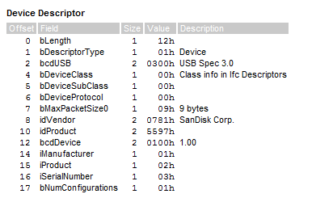                               
   
3.  Get Descriptor from Device          

   -  控制传输；

   - 命令数据：

     - bmRequestType：80h:
       - 方向:IN,device-->host;
       - 命令类型：00:标准类请求；
       - 命令接收者：0000：设备
     - bRequest：命令请求码：06h：获取设备描述符；
     - wValue：0200h:
       - 高字节：描述符类型为“配置描述符”；
       - 低字节：00；
     - wIndex：获取配置描述符时该字段为0；
     - wLength：0009h：要求设返回9个字节的配置描述符

   - 设备返回数据：09 02 20 00 01 01 00 80 70

     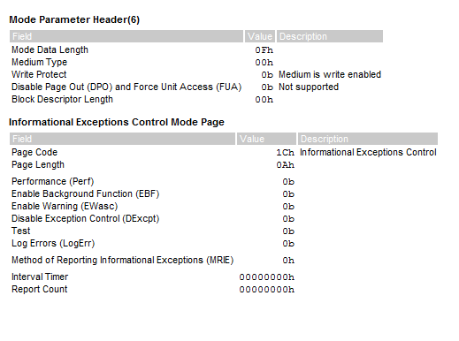

4.  Get Descriptor from Device          

   -  控制传输；

   - 命令数据：

     - bmRequestType：80h:
       - 方向:IN,device-->host;
       - 命令类型：00:标准类请求；
       - 命令接收者：0000：设备
     - bRequest：命令请求码：06h：获取设备描述符；
     - wValue：0200h:
       - 高字节：描述符类型为“配置描述符”；
       - 低字节：00；
     - wIndex：获取配置描述符时该字段为0；
     - wLength：0020h：**要求设返回32个字节描述符信息**

   - 设备返回数据： 09 02 20 00 01 01 00 80 70 09 04 00 00 02 08 06 50 00 07 05 81 02 00 04 00 07 05 02 02 00 04 00 
   
     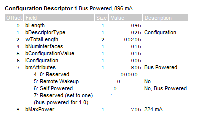
   
     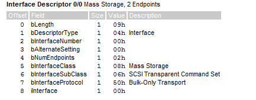
   
     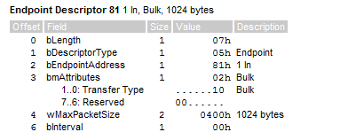
   
     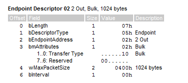
   
5.  Get Descriptor from Device          

   - 控制传输；

   - 命令数据：

     - bmRequestType：80h:
       - 方向:IN,device-->host;
       - 命令类型：00:标准类请求；
       - 命令接收者：0000：设备
     - bRequest：命令请求码：06h：获取设备描述符；
     - wValue：0300h:
       - 高字节：描述符类型为“字符串描述符”；
       - 低字节：00；低字节为描述符的字符串索引即所谓的language id
     - wIndex：与字符串有关的语言ID；
     - wLength：0002h:要求设备返回2个字节长度的描述符；

   - 设备返回数据：04 03    

     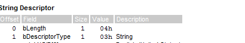

6.  Get Descriptor from Device          

   - 控制传输；

   - 命令数据：

     - bmRequestType：80h:
       - 方向:IN,device-->host;
       - 命令类型：00:标准类请求；
       - 命令接收者：0000：设备
     - bRequest：命令请求码：06h：获取设备描述符；
     - wValue：0300h:
       - 高字节：描述符类型为“字符串描述符”；
       - 低字节：00；Language Id
     - wIndex：与字符串有关的语言ID；
     - wLength：0004h:要求设备返回4个字节长度的描述符；

   - 设备返回数据：04 03 09 04

     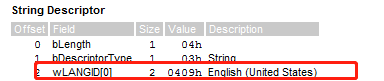

     

7.    Get Descriptor from Device          

   - 控制传输；

   - 命令数据：

     - bmRequestType：80h:
       - 方向:IN,device-->host;
       - 命令类型：00:标准类请求；
       - 命令接收者：0000：设备
     - bRequest：命令请求码：06h：获取设备描述符；
     - wValue：0303h:
       - 高字节：描述符类型为“字符串描述符”；
       - 低字节：00；Language Id
     - wIndex：0409:English；
     - wLength：0002h:要求设备返回4个字节长度的描述符；

   - 设备返回数据：2A 03

     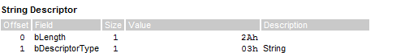

8.   Get Descriptor from Device          

   - 控制传输；

   - 命令数据：

     - bmRequestType：80h:
       - 方向:IN,device-->host;
       - 命令类型：00:标准类请求；
       - 命令接收者：0000：设备
     - bRequest：命令请求码：06h：获取设备描述符；
     - wValue：0303h:
       - 高字节：描述符类型为“字符串描述符”；
       - 低字节：00；Language Id(Descri[tor Index]);
     - wIndex：0409:English；
     - wLength：002Ah:要求设备返回42个字节长度的描述符；

   - 设备返回数据： 2A 03 34 00 43 00 35 00 33 00 30 00 30 00 30 00 31 00 32 00 32 00 30 00 31 00 31 00 38 00 31 00 32 00 31     

     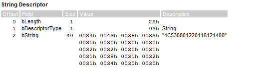                                  

9. Select Configuration     :   

   - 控制传输；
   - 命令数据：00 09 01 00 00 00 00 00 

     - bmRequestType：00h:
       - 方向:OUT,host-->device;
       - 命令类型：00:标准类请求；
       - 命令接收者：0000：设备
     - bRequest：命令请求码：09h：set config；
     - wValue：0100h:
       - 高字节：01h:即配置描述符中的iConfigurationValue字段的值 ；
       - 低字节：00
     - wIndex：固定为0；
     - wLength：固定为0；

10.   Select Interface    

    - 控制传输；
    - 命令数据：01 0b 00 00  00 00 00 00

      - bmRequestType：01h:
        - 方向:OUT,host-->device;
        - 命令类型：00:标准类请求；
        - 命令接收者：0001：接口
      - bRequest：命令请求码：0Bh：set interface；
      - wValue：0000h:
        - 高字节：00h:接口描述符中的 bAlternateSetting 字段； ；
        - 低字节：00h:
      - wIndex：接收该命令的接口编号, 即接口描述符中的 bInterfaceNumber 字段的值；
      - wLength：固定为0；

11.  Class Interface:

    - 控制传输；
    - 命令数据：a1 fe 00 00  00 00 01 00

      - bmRequestType：a1h:
        - 方向:OUT,host-->device;
        - 命令类型：00: 类请求命令；
        - 命令接收者：0001：接口
      - bRequest：命令请求码：feh：get max lun；
      - wValue：0000h:
      - wIndex：接收该命令的接口编号, 即接口描述符中的 bInterfaceNumber 字段的值；
      - wLength：00 01：即期望返回的数据1个自己

    - 返回数据：00：对于U盘来讲这个数据是没有意义的；

12. Inquiry:

    - BOT传输：

    - CBW:数据固定长度31字节的数据包：

      | 偏移量 | 字段               | 大小 | 数据(hex)   | 描述           |
      | ------ | ------------------ | ---- | ----------- | -------------- |
      | 0      | dCBWSignature      | 4    | 43 42 53 55 | 固定           |
      | 4      | dCBWTag            | 4    | 09 d0 1a 00 | 配对序列号     |
      | 8      | DataTransferLength | 4    | 00 00 00 24 | 期望传输36字节 |
      | 12     | bmCBWFlags         | 1    | 80          | device-->host  |
      | 13     | bmCBWFlags         | 1    | 00          | 对U盘无意义    |
      | 14     | bCBWCBLength       | 1    | 06          | 命令包长度     |
      | 15-30  | CBWCB              | 15   |             | 指令包         |

      - CDB：命令包12 00 00 00 24  00 00 00 00 00 00 00 00  00 00 00

        | 字段                             | 值(hex) | 描述                  |
        | -------------------------------- | ------- | --------------------- |
        | SCSI命令码                       | 12      |                       |
        | Enable Vital Product Data (EVPD) | 0       | Standard Inquiry Data |
        | Standard Inquiry Data            | 00h     |                       |
        | Allocation Length                | 00 24   |                       |
        | Control                          | 00      |                       |

    - 设备返回数据：这个与具体的操作指令相关；

      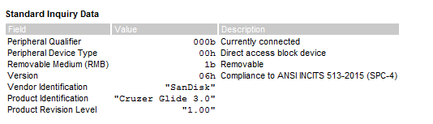  

    - CSW:数据这个没什么看的

      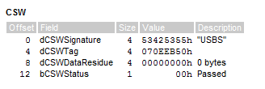

13. Inquiry：

    - BOT传输；

    - CBW:数据固定长度31字节的数据包：

      | 偏移量 | 字段               | 大小 | 数据(hex)          | 描述           |
      | ------ | ------------------ | ---- | ------------------ | -------------- |
      | 0      | dCBWSignature      | 4    | 43 42 53 55        | 固定           |
      | 4      | dCBWTag            | 4    | -                  | 没有实际意义   |
      | 8      | DataTransferLength | 4    | 00 00 00 48        | 期望传输72字节 |
      | 12     | bmCBWFlags         | 1    | 80                 | device-->host  |
      | 13     | bCBWLUN            | 1    | 00（此后不在说明） | 对U盘无意义    |
      | 14     | bCBWCBLength       | 1    | 06                 | 命令包长度     |
      | 15-30  | CBWCB              | 15   |                    | 指令包         |

      - CDB（这里的参数才是最重要的）：命令包12 00 00 00 48  00 00 00 00 00 00 00 00  00 00 00 

        | 字段                             | 值(hex) | 描述                  |
        | -------------------------------- | ------- | --------------------- |
        | SCSI命令码                       | 12      |                       |
        | Enable Vital Product Data (EVPD) | 0       | Standard Inquiry Data |
        | Page code                        | 00h     |                       |
        | Allocation Length                | 00 48   |                       |
        | Control                          | 00      |                       |

    - 设备返回数据：

      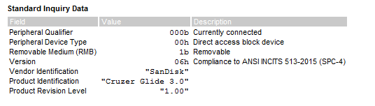

    - CSW:

      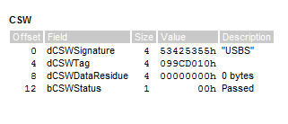

      

14. **Security Protocol In PC 机对于所有的Sandisk U盘都会发这个指令，但是所有（目前已有的）的Sandisk U盘在响应这个指令的时候又都会出错；**

    - 错误之后就会进行get sense data 操作从返回的sense data中看到该指令属于“Illegal Request”;
    - wince 、linux上都没有该指令； 

    - CSW:

      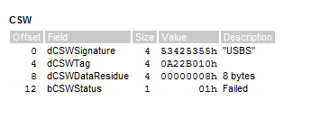

15. Read Format Capacities：

    - CBW:

      | 偏移量 | 字段               | 大小 | 数据(hex)          | 描述            |
      | ------ | ------------------ | ---- | ------------------ | --------------- |
      | 0      | dCBWSignature      | 4    | 43 42 53 55        | 固定            |
      | 4      | dCBWTag            | 4    | -                  | 没有实际意义    |
      | 8      | DataTransferLength | 4    | 00 00 00 FC        | 期望传输252字节 |
      | 12     | bmCBWFlags         | 1    | 80                 | device-->host   |
      | 13     | bCBWLUN            | 1    | 00（此后不在说明） | 对U盘无意义     |
      | 14     | bCBWCBLength       | 1    | 0a                 | 命令包长度      |
      | 15-30  | CBWCB              | 15   |                    | 指令包          |

      - CDB

      | 字段              | 值(hex) | 描述     |
      | ----------------- | ------- | -------- |
      | SCSI命令码        | 23      |          |
      | Allocation Length | 00 FC   | 252bytes |
      | Control           | 0       |          |

    - 设备输入数据：

      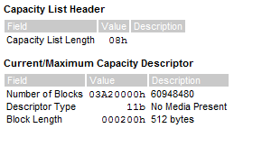

    - CSW:

      - Residue:**字段是期望传输和实际传输的数据量之间的差值，这里的期望传输的值是不是可以改变？**；

      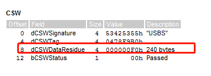

16. Inquiry

    - 控制传输：

    - CBW:

      | 偏移量 | 字段               | 大小 | 数据(hex)          | 描述            |
      | ------ | ------------------ | ---- | ------------------ | --------------- |
      | 0      | dCBWSignature      | 4    | 43 42 53 55        | 固定            |
      | 4      | dCBWTag            | 4    | -                  | 没有实际意义    |
      | 8      | DataTransferLength | 4    | 00 00 00 FF        | 期望传输255字节 |
      | 12     | bmCBWFlags         | 1    | 80                 | device-->host   |
      | 13     | bCBWLUN            | 1    | 00（此后不在说明） | 对U盘无意义     |
      | 14     | bCBWCBLength       | 1    | 06                 | 命令包长度      |
      | 15-30  | CBWCB              | 15   |                    | 指令包          |

      - CDB

        | 字段                             | 值(hex) | 描述               |
        | -------------------------------- | ------- | ------------------ |
        | SCSI命令码                       | 12      |                    |
        | Enable Vital Product Data (EVPD) | 1       | Vital Product Data |
        | Page code                        | 80h     | Unit Serial Number |
        | Allocation Length                | 00 FF   | 255 bytes          |
        | Control                          | 00      |                    |

    - 设备返回数据:

      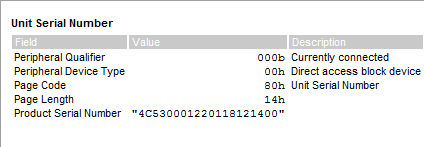

    - CSW:

      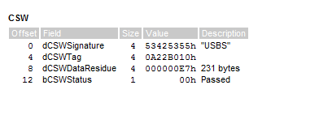

17. Read Capacity(10):

    - BOT传输：

    - CBW:

      | 偏移量 | 字段               | 大小 | 数据(hex)          | 描述          |
      | ------ | ------------------ | ---- | ------------------ | ------------- |
      | 0      | dCBWSignature      | 4    | 43 42 53 55        | 固定          |
      | 4      | dCBWTag            | 4    | -                  | 没有实际意义  |
      | 8      | DataTransferLength | 4    | 00 00 00 08        | 期望传输8字节 |
      | 12     | bmCBWFlags         | 1    | 80                 | device-->host |
      | 13     | bCBWLUN            | 1    | 00（此后不在说明） | 对U盘无意义   |
      | 14     | bCBWCBLength       | 1    | 0A                 | 命令包长度    |
      | 15-30  | CBWCB              | 15   |                    | 指令包        |

      - CDB:25 00 00 00 00 00 00 00 00 00 00 00 00 00 00 00 

        | 字段                           | 值(hex)     | 描述 |
        | ------------------------------ | ----------- | ---- |
        | SCSI命令码                     | 25          |      |
        | Logical Block Address          | 00 00 00 00 |      |
        | Partial Medium Indicator (PMI) | 0           |      |
        | Control                        | 00          |      |

    - 设备输入数据：

      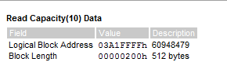

    - CSW:

      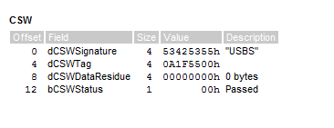

18. Read(10):

    - BOT传输：

    - CBW:

      | 偏移量 | 字段               | 大小 | 数据(hex)          | 描述            |
      | ------ | ------------------ | ---- | ------------------ | --------------- |
      | 0      | dCBWSignature      | 4    | 43 42 53 55        | 固定            |
      | 4      | dCBWTag            | 4    | -                  | 没有实际意义    |
      | 8      | DataTransferLength | 4    | 00 00 02 00        | 期望传输512字节 |
      | 12     | bmCBWFlags         | 1    | 80                 | device-->host   |
      | 13     | bCBWLUN            | 1    | 00（此后不在说明） | 对U盘无意义     |
      | 14     | bCBWCBLength       | 1    | 0A                 | 命令包长度      |
      | 15-30  | CBWCB              | 15   |                    | 指令包          |

      - CDB:28 00 00 00 00 00 00 00  01 00 00 00 00 00 00 00

        | 字段                                 | 值(hex)      | 描述 |
        | ------------------------------------ | ------------ | ---- |
        | SCSI命令码                           | 28           |      |
        | Read Protect                         | 000b         |      |
        | Read Protect                         | 0b           |      |
        | Force Unit Access                    | 0b           |      |
        | Force Unit Access Non-Volatile Cache | 0b           |      |
        | Logical Block Address                | 00 00 00 00h |      |
        | Transfer Length                      | 00 01h       |      |
        | Group Number                         | 00h          |      |
        | Control                              | 00 h         |      |

    - 设备输入数据:设备返回逻辑扇区0的内容；

    - CSW:

      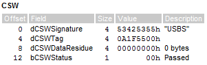

19. Mode Sense(6):(Wince这里发送的Mode Sense (10))

    - BOT传输：

    - CBW:

      | 偏移量 | 字段               | 大小 | 数据(hex)          | 描述            |
      | ------ | ------------------ | ---- | ------------------ | --------------- |
      | 0      | dCBWSignature      | 4    | 43 42 53 55        | 固定            |
      | 4      | dCBWTag            | 4    | -                  | 没有实际意义    |
      | 8      | DataTransferLength | 4    | 00 00 00 C0        | 期望传输192字节 |
      | 12     | bmCBWFlags         | 1    | 80                 | device-->host   |
      | 13     | bCBWLUN            | 1    | 00（此后不在说明） | 对U盘无意义     |
      | 14     | bCBWCBLength       | 1    | 06                 | 命令包长度      |
      | 15-30  | CBWCB              | 15   |                    | 指令包          |

      - CDB:1A 00 1C 00 C0 00 00 00  00 00 00 00 00 00 00 00 

        | 字段                            | 值(hex) | 描述 |
        | ------------------------------- | ------- | ---- |
        | SCSI命令码                      | 1A      |      |
        | Disable Block Descriptors (DBD) | 0b      |      |
        | Page Control (PC)               | 00b     |      |
        | Page and Subpage Code           | 1C 00 h |      |
        | Allocation Length               | C0 h    |      |
        | Control                         | 00 h    |      |

    - 设备输入数据:

      

    - CSW:

      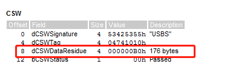

