# USB知识梳理

## 基本概念

1. USB版本及速度变化：

   | 版本号       | 速度（理论最大速度） | 名称                   | 推出时间   |
   | ------------ | -------------------- | ---------------------- | ---------- |
   | USB1.0       | 1.5Mbps(192KB/s)     | 低速(low-speed)        | 1996年1月  |
   | USB1.1       | 12Mbps(1.5MB/s)      | 全速(full-speed)       | 1998年9月  |
   | USB2.0       | 480Mbps(60MB/s)      | 高速(high-speed)       | 2000年4月  |
   | USB3.0       | 5Gbps(500MB/s)       | 超高速(super-speed)    | 2008年11月 |
   | USB3.1 GEN 2 | 10Gbps(1280MB/s)     | 超高速+(super speed +) | 2013年12月 |

   - 在推出USB3.1 GEN 2的时候同时将USB3.0 定义为 USB3.1 GEN 1；
   - 在Linux的驱动代码中还有一个USB2.5的概念即指代无线USB接口的速度适用于无线键鼠等蓝牙设备；
   - 其实USB4.0、雷电等更加高速的USB已经在使用，目前对于U盘来说常见的还是USB3.0；
   - 上面提到的速度都是理论上的最大速度实际U盘的传输受多方面限制；

2. USB控制器（usb controller ：

   - cpu并不直接和USB设备作用，CPU将需要发送/接收的数据请求发送到USB 控制器，USB控制器完成与设备的具体通信任务，任务完成之后通知CPU获取结果；

   - 控制器版本：

     | 版本名称 | 描述                                                         |
     | -------- | ------------------------------------------------------------ |
     | UHCI     | intel 推出的通用标准接口，支持USB1.0/USB1.1，**硬件便宜，驱动复杂** |
     | OHCI     | 支持USB1.1的标准接口（这个接口不单是USB的），**硬件复杂，驱动简单** |
     | EHCI     | intel主导的USB2.0标准接口，**EHCI仅提供USB2.0的高速功能**，而依靠UHCI或OHCI来提供对全速（full-speed）或低速（low-speed）设备的支持。 |
     | xHCI     | USB3.0的接口标准，xHCI全面兼容其它三个版本，推出的目的就是为了取代前者 |

     - 还有以**KHCI**:Kinetis主机控制器接口，飞思卡尔的出的不是通用的不用管他；

   - 层级：

     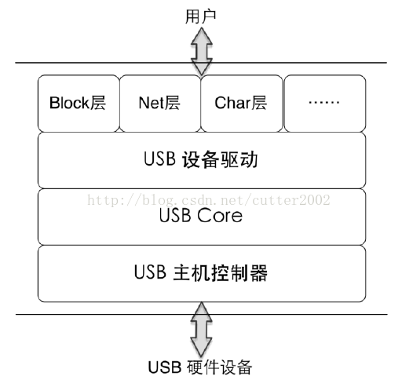

3. usb controller 所能扮演的几个角色：

   - host:usb 控制器以主机的形式出现，可以起到控制作用；
   - otg:控制器既可以做主机也可以做从机，比如wince在调试过程中接了OTG之后的行为；
   - device:从机,是被控制的,比如U盘/HID等;
     - **在Wince驱动代码中是以function出现的**；
       - Root hub:
       - External hub:
       - Function:
   - gadget:个人理解基本与OTG模式下的做从机的情况像相同比如将wince设备当一个“U盘”使用；

4. roothub:

   - 所有USB设备（U盘、HUB、HID设备等）最终都是连接到了roothub上，roothub也是一种USB设备只不过通常只能看到USB接口（物理）不会注意到roothub的存在，或者说通常只注意到了usb host controller的概念却遗忘了roothub；
   - 目前的芯片都是将usb host controller和root hub 集成到一起，所以通常会忽略root hub的存在；
   - 有些文档会把roothub称为host hub；

5. 两个设备名称(在代码中会看到这个概念)：

   - compound device：将HUB和连在HUB上的设备设备封装在一起所组成的设备，各自都有独立的设备地址；
   - composite device：一个设备具备多个接口即一个USB设备具备多种功能，从逻辑上来讲usb core看到的其实是多个device,公用一个设备地址；

6. 一个USB设备的几个层级(在不同场合下的角色的描述,从大到小)：

   - 设备(device)：对应设备描述符，是对整个USB设备的描述，比如厂家/ID号等，在代码中最终体现为一个struct usb_device的数据结构（具体的设备描述符只是这个数据结构中的一个成员，下面对接口类似，USB相关的数据结构定义大部分在\include\linux\usb.h文件中）；
   - 配置(configure)：
     - 对应配置描述符，在驱动代码中最终体现为一个strict usb_host_config的数据结构体；
     - 一个设备可以有多中配置，但是同一时间只能有一个配置生效，在配置描述符中有一个'bConfigurationValue'字段就指明了对应配置的配置号，使用set_configuration(bConfigurationValue)即可激活对应的配置，该设备有几
       个配置可在设备描述中获取到的；
     - 对于U盘来说配置描述符（即设备的配置）只有一个；
     - 配置描述符中的“bNumInterfaces”字段指明了该配置下有几个接口，最大32；
   - 接口(interface)：
     - 对应接口描述符，一个接口对应的就是一个USB设备的功能可以理解composite device中的一个功能每个接口对应一个驱动；
     - 在驱动代码的上层其实一个USB设备的最终就体现为一个 strcut usb_interface数据结构体；
   - 端点(endpoint)：
     - 对应端点描述符，端点是数据传输的起始、终止点，每一个接口(功能)都包含了属于自己的一组端点(不包含控制端点)，比如说对MSC设备来说就需要包含BULI IN和BULK OUT 这两类必须的端点；
     - 在接口描述符中有一个‘bNumEndpoints’的字段指明了该接口所包含的端点数;
     
     

7. 描述符：USB的描述符就是一个预定好的数据结构体，里面存储各种USB相关信息,在设备枚举阶段通过发送**标准类请求**可以从设备获取到对应的描述符数据从而进一步掌握设备信息（填充usb_device 设备结构体），这些描述符在设备出产前就已经被固化在设备的EEPROM中(其实USB协议中表明的描述符有8中)：

   - 设备描述符(0x01)：参看usb 2.0 spec"Table 9-8. Standard Device Descriptor";
   - 配置描述符(0x02)：参看usb 2.0 spec"Table 9-10. Standard Configuration Descriptor
   - 接口描述符(0x04)：参看usb 2.0 spec"Table 9-12. Standard Interface Descriptor";
   - 端点描述符(0x05)：参看usb 2.0 spec"Table 9-13. Standard Endpoint Descripto";
   - 字符串描述符(非必须0x03)：
   - 后续三个没见过（起码再U盘/HID设备中没有用到）：
     - DEVICE_QUALIFIER 
     - OTHER_SPEED_CONFIGURATION ；
     - INTERFACE_POWER

8. usb设备状态：**在协议中明确规定的设备状态只有6种**，但是在不同的驱动代码中记录设备状态的枚举变量可能不止6种（比如在Linux驱动代码种enum usb_device_state就记录了9种）：

   - Attached(连接状态):表示设备连接到USB接口，是hub检测到设备时的初始状态；
     
     - 从代码的角度看只要构建usb_device成功设备就已经处于连接状态了；
   - Powered(上电状态):在协议中明确指出的USB设备有两种供电方式：
     - self-power(自供电):USB设备的电源来自外部（可能是外接供电源）;
     - bus-power(总线供电):USB设备的电源来自USB总线即设备的电源是从USB接口的VBUS、GND获取；
     - 基本上现在所有的设备都是bus-power类型的，有些HUB可能会考虑到BUS供电不足的情况会在hub上预留一个5V的电源接口，这种情况下就需要bus-power和self-power的协同工作，但是对于U盘来说只有bus-power这种类型；
     - 此处的上电状态就表示设备连接到UBS接口且正常供电的状态（不供电设备都没办法进行通信）
       - 从代码的角度看构建usb_device并且完成基本的device结构体的初始化设备就已经处于加电状态;
     - 即使是自供电的设备在接入USB口之前可能已经打开电源，但是也不能算Powred状态所有的状态都是以host端为参考的；
   - Default(默认状态):这里的默认主要是值设备使用默认的地址（0地址，这个地址是设备在usb总线上的地址）与host进行通信，主要是进行控制传输，协议中明确说明，当设备完成powered状态之后，设备会收到一个reset信号在成功复位之后，使用默认地址与主机进行通信已完成主机获取设备描述符等的标准类请求；
   - Address(地址状态):host明确给device分配一个唯一的设备地址号此后设备就可以使用这个地址与host进行通信(通信必须要有地址)USB总线规定usb设备总线上的设备不能超过128且根hub已经占据了一个地址，0地址不分配给某一个具体的设备留作缺省地址使用；
     - 在枚举过程中会调用choose_devnum(udev)函数为设备选择一个地址；
     
     - USB是以层级的总线形式存在的，总线上的每一个设备都有其唯一的地址；
     
     - 每一条USB总线对应一个struct usb_bus的数据结构，该结构体内成员devmap.devicemap记录了该条总线上的地址映射信息其实就是一个数组，数组长度为4即有四个ulong型的数组成员4\*(4\*8) = 128即最多表示的地址只能有128个（这也是前面提到的为什么usb总线上最多允许有128个设备）；
     
     - 128个bit表示128个总线节点，如果节点上有设备了则将对应的bit置1同时将该bit所在的位序返回给设备(struct usb_device )作为设备的地址使用(devnum),然后将总线上的devnum_next加1(表示下一个可分配的地址);
     
     - 128个设备地址是循环使用的，用完了才会再返回来使用之前的地址(设备卸载的时候会将之前置1的bit再清0);
     
       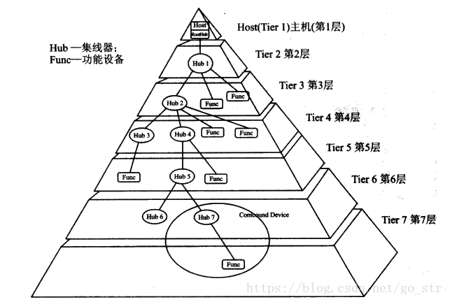
   - Configered(配置状态):一个设备可以有多个不同的配置模式(比如一个手机设备也可以配置成一个存储设备设备使用/也可以配置成的一个拍照设备使用等),枚举阶段host在获取到设备的配置描述符之后会发送一个setconfiguration的标准类请求对设备配置(对于U盘来说只有一种配置)；
   - Suspend(挂起状态):
     - 协议中明确规定所有的USB设备都必须要有挂起状态,这个是为电源管理设计的(节能);
     - 在usb总线上数据指定的时间内没有数据传输,设备就要自动进入挂起状态,当总线上有数据传输的时候设备自动退出该状态，进入挂起状态前的状态信息需要设备自己维护;
       - 设备端检测不到总线上有数据变化，EHCI/xhci对于这个时间是不同的EHCI要求是3ms；
   - 在Linux中还有一个USB_STATE_NOTATTACHED状态很明显这是一个驱动中的虚拟初始状态即根本没有设备连接；

9. 端点(endpoint)：

   - 作用:USB通信的发送点和接收点，USB设备在通信过程中在上层看来就是一个个端点(形式上类似质点)；

   - 分类:当前USB设备的只有4种类型的端点对应与四种不同的数据传输类型：

     | 端点类型 | 对应传输方式 | 描述                                                         |
     | -------- | ------------ | ------------------------------------------------------------ |
     | 控制端点 | 控制传输     | USB协议要求每个设备必须具有一个控制端点且端点号必须是0       |
     | 中断端点 | 中断传输     | 在HUB中数据通信使用的就是中断传输，所以HUB中要求必须具备中断端点 |
     | 等时端点 | 等时传输     | 等时传输主要用在麦克风等设备（这个不当前内容）               |
     | 批量端点 | **批量传输** | 对于大容量存储设备基本全部使用该方式                         |
     |          |              |                                                              |

   - 数量：USB设备端点的数量是协议中明确规范的USB设备厂商在制造设备时必须严格遵守（不包含0端点）

     - 低速设备最多只能有2个端点；
     - 高速设备最多有15个IN端点和15个输出端点并且端点号在设备出产前已经按协议固定；

   - 方向：协议规定以host端为参考：

     - OUT:host->device；
     - IN:device->host；
     - 0号端点是双向的(其实是一个OUT端点和一个IN端点的组合且这俩个端点的端点号都为0)；

   - 特殊的0号端点：

     - 协议要求每个USB设备必须有且仅有一个0号端点；
     - 0号端点用于控制传输（枚举阶段在进入Address状态之前的所有通信都是使用的0号端点完成）；
     - 控制传输的使用的管道（即默认管道）的通信方式是message方式而协议明确要求该方式下管道必须对应两个相同端点号的端点，一个用来做IN，一个用来做OUT，所以与之对应的0号端点就必须设计成“双向”--这里深层的就是硬件设备的实现，暂时不去考虑；
     - 端点0能处理的最大数据长度，
       - 对于高速设备来说固定为64bytes；
       - 对于低速设备固定为8bytes；
       - 对于全速设备可能为8/16/32/64需要进一步获取**设备描述符**确认；
       - 对于非0号端点最大数据长度保存在其**端点描述符**的“wMaxPacketSize”这个字段,而端点0 是没有自己的描述符的(端点0的大部分属性已经在usb协议中明确规定)所以将这个信息保存到了设备描述符的"bMaxPacketSize0"字段;

   - 获取端点最大数据包的长度的一个故事：

     - 前面已经介绍了端点0的特殊性同时指出端点0的最大数据包长度是来自设备描述符而设备描述符是存储在设备的EEPROM中想要获取设备描述符就需要向设备发送GetDescriptor()标准类请求，发送请求，就需要使用端点0并且知道该端点的最大数据包长度所有这就陷入鸡生蛋丹生鸡的循环；
     - 为了解决这个问题USB协议中就给出了一种解决方法:最大数据包长度的可取数字为8/16/32/64而设备描述符的byte7字段正好就是“bMaxPacketSize0”字段,所以第一次通信的时候就默认ep0的最大的数据包长度为8,这就获取到了设备描述符的前8个字节进而得到端点了的最大数据包长度，后续的通信就使用获取的最大数据包长度进行通信,但是这样的解决方案就有一个前提即**host要8个字节,device就返回设备描述符前8个字节而不是返回整个设备描述符**,那么问题就来了不是所有的OEM都是那么规矩的，本来host只要8个字节设备却返回了整个设备描述符,所以就会造成溢出无法正常获取到设备描述符，设备无法识别,----Linux的内核代码最初就是规规矩矩的按照协议中的要求做的---**听话的人总是受欺负**；
     - windows系统的做法是：既然ep0的最大数据包长度的可取数值为64，那么第一步就以64bytes为参数进行通信，如果设备端的ep0的最大数据包长度为32/64bytes(它这里假设设备描述符长度为18bytes)，那么就可以直接一次性将描述符传输完成，如果ep0的最大数据包长度是8/16的话获取一个数据包之后不能将描述符描述接收完成，但是至少是获取了8个字节的数据了也就是说已经获取大ep0的最大数据包长度了，而此时设备仍然处于数据发送状态(这一点在“事务传输”部分在解释)，不会响应其他的**数据操作**指令，windows就比较机智，在获取到8个字节的数据之后直接对设备进行一次复位操作，之后host端就以之前获取到的最大数据包长度与设备进行通信；
     - 后来一些(大多数)U盘的厂商呢就按照windows的这种方式进行设计、测试了（**本来是windows 的一个不遵守协议的bug却引领了一次潮流**），所有设备厂商也早已经忽略了协议的要求，结果就是Linux的系统USB设备不识别，Linux为了解决这部分U盘的识别问题迫于无奈就在驱动代码中引入了两套机制；

   - 管道(pipe)：在协议中管道被定义成一种在host和device之间移动数据的能力

     - 作用：其实管道可以简单的理解为host和device(endpoint)之间的桥梁
       - 一般说管道的时候只指明了目标地址不会说源地址，其实这是一个大家的习惯而已并不是说管道只有目标地址没有源地址；
     - 通信方式：管道有两种通信方式：
       - massage：要求传输的数据必须严格遵守其数据格式，主要用与host向device请求信息比如获取描述符等,massage方式的默认的方式;
       - stream:对数据格式没有特殊要求;
     - 严格意义上讲管道连接的并不是host和device 而是device上的一个端点和host端的一个buffer;

   - 传输类型:

     | 传输方式 | 描述                                                         |
     | -------- | ------------------------------------------------------------ |
     | 控制传输 | 主要用在设备枚举阶段和标准类请求的发送如发送设备控制指令、设备状态查询及确认命令 |
     | 中断传输 | 传输数据量很小，但这些数据需要及时处理，以达到实时效果，如HID设备等 |
     | 批量传输 | **也就bulk传输，传输的数据量大、传输实时性要求不是很高但对传输的正确性要求高，属于牺牲时间效率换取正确性的传输方式，大容量存储设备、printer等使用该方式** |
     | 等时传输 | 对传输的数据正确性要求不高，但是对**传输时间要求极高**，等时传输主要用在麦克风等设备 |

10. 名词解释(各种协议上一大堆名称，只解释U盘相关的，其它的我也不知道，盗图)：

    - MSC: Mass Storage Device ，大容量存储设备
      - U盘属于大容量存储设备的一种，是其一个子集合；
      - 软盘也属于大容量存储设备；

    - 标准类请求：USB协议明确的规定USB设备必要实现的标准功能集合（从host端来看就usb设备必须要是实现的指令集合）；
      - 还有一个设备类请求的概念是协议没有明确规定，但是厂商自己实现，然后公布的；
    - SCSI：指令集包含host对usb设备的标准动作，读/写、获取设备错误信息等指令；
    - UASP:USB MSC USB Attached SCSI Protocol (UASP) SCSI协议的补充部分；---没使用过
      -  据说是为了提高USB 2.0的USB总线利用率，和充分利用USB 3.0的全双工能力 而新推出的一种加强版的SCSI；
    - BOT/BBB:Bulk-Only (BBB) Transport:
      - 传输涉及到三个阶段：建立-数据-状态，这个三个阶段都是通过bot传输实现所以称为为BB
    - CBI: Control/Bulk/Interrupt 
      - 建立阶段通过控制传输完成；
      - 数据阶段通过BOT传输完成；
      - 状态阶段通过中断传输完成；
      - 从代码的注释来看这中传输方式适用在Floppy drive（ full-speed的软盘），目前代码中没有使用---软盘已经被属于上个世纪；
      - 很明显BBB是CBI的替代品，或者是升级品；
    - UFI: Universal Floppy Interface：同样是有关软盘的协议
      - 其实对比看一下知道了CBI、UFI一个是适用与软盘设备的指令集合一个是适用于该类设备的传输方式；
      - 同样SCSI、BOT是适用与U盘这类设备（Flash memory）的指令集和传输方式；

    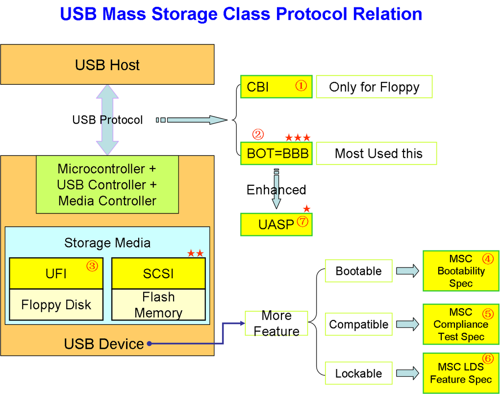

## USB设备枚举

1. USB设备枚举：

   - 从功能上来看就是host将一个设备识别为USB设备进而识别为MSC设备或者Printer设备；
   - 从代码的角度看就是host构造了一个usb_device结构体，枚举的过程就是结构体成员赋值的过程；

2. host与device的关系（图片部分来源于网络）：

   - 用户看到的可能是这个样子的：

     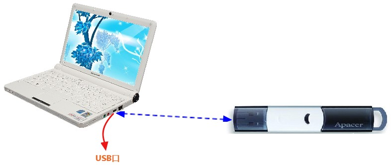

   - 初级硬件工程师看到的可能是这个样子的：

     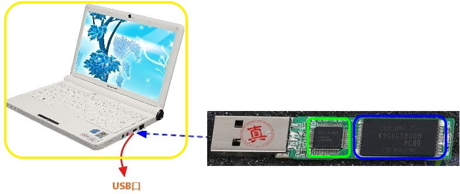

   - 程序员看到的可能是这个样子的：

     - struct usb_device_driver:USB设备驱动
     - struct usb_driver:USB接口驱动：
     - struct usb_device:USB设备；
     - strcut usb_interface:usb 接口；
     - struct usdbrv_wrap:为了区分接口驱动和设备驱动而加的一个中间驱动；
     - struct usb_bus:对应一条USB 总线；
     - struct usb_hcd:对应一个USB hcd控制器；
     - ......

   - 高级的硬件工程师看到的可能是这个样子的：

     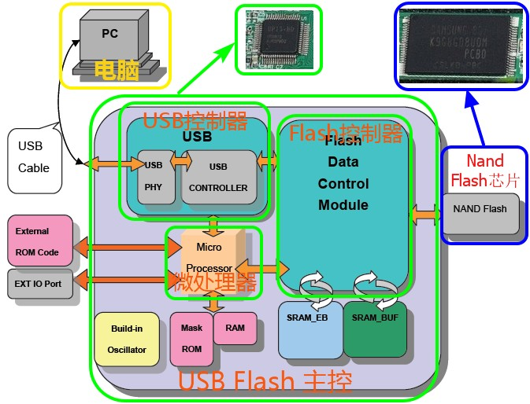

   - 高级程序员看到的可能是这个样子的：

     - 如果以Linux的USB驱动框说明的话，Linux USB驱动整体来看大致分为3层（从上到下）：
       - 客户软件层（Client SW）即Client层:系统无关，设备相关（这里的设备指HID/printer等），对接的只是一个interfacce（功能）；
       - USB系统软件（USB System SW）即usb core层：系统相关，设备无关，表示系统里支持USB的部分，对接的只是一个usb_device结构体，负者实现一些核心功能，为别的设备驱动程序提供一个用于访问和控制USB硬件的接口；
       - USB Host Controller即HCD层：处于最底层，但是负责整个USB的通信，对接真是的物理设备，协议中规定HCD层必须位于最底层，该层提供一个host controller的硬件抽象，隐藏具体的controller硬件细节（不管你是哪呢设备厂商的host controller对上都是一样的接口）；

     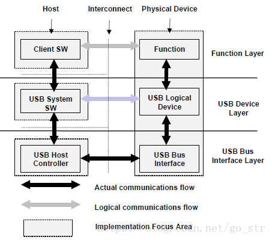

     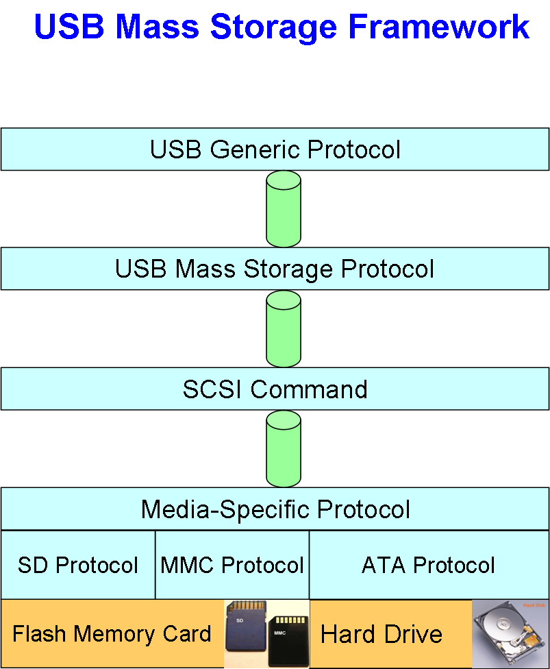

   - 累的半死不活的人看到的是这个样子的（以wince为例）：

     | 文件名      | 层级           |
     | ----------- | -------------- |
     | scsi2.c     | scsi指令集     |
     | usbmsc.c    | MSC设备级      |
     | bot.c       | 块传输级       |
     | usbclient.c | client层       |
     | usbddrv.c   | client到usbd级 |
     | hcddrv.c    | usbd级到HCD级  |
     | hcd.c       | hcd级          |
     | cdevice.cpp | 设备级         |
     | cpipe.cpp   | 管道级         |
     | chw.cpp     | HCD传输级      |
     | cppidma.cpp | DMA级          |
     | usbcdma.c   | DMA传输控制    |
     |             |                |
     |             |                |

3. 枚举过程（以wince驱动代码为例）:

   -  hub端口检测到端口有电信号的改变(从硬件的角度来看这是很复杂的过程)，hub向host报告，报告的内容只是hub端口的设备连接/断开的事件 ：

     - 从硬件的角度来看：简单的概括就是由于设备上拉电阻的作用使得D+或者D-上电压从0V变化到3V，USB主机一但检测到这样的变化就能确定有设备连接（ 集线器端口的两根信号线的每一根都有15kΩ的下拉电阻）；

       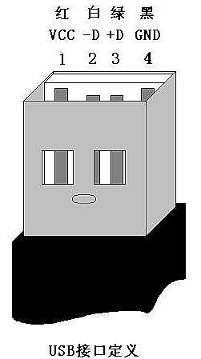

     - D+/D-为什么要接上拉电阻： D+/D-上的上拉电阻则是来指明usb device是low或full/high设备。

       - D+上拉说明是full/high speed设备(至少是全速设备);

       - D-上拉说明是low设备（以后也不会对其在进行速度枚举）；

         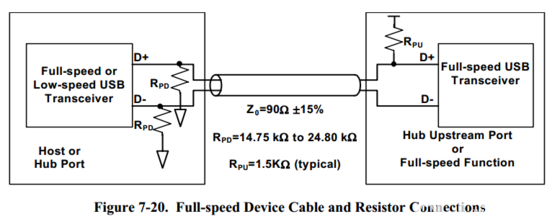

     - 从固件的角度来看就是HubStatusChangeThread(wince)或者hub_port_connect_change(Linux）被触发了；

   - 获取端口状态：第一步只是知道hub端口有电信号的变化但是信息不是很明确所以host会继续发送一个GetStatus()请求，请求hub报告详细信息 返回的消息告诉主机一个设备是什么时候连接的以及初始的速度信息  ；---在驱动代码中如果成功获取到设备连接状态设备就已经属于**Attached状态**；

   - Attached状态到Powered状态只需总线供电稳定即可（代码上没有明确的步骤）；

   - hub复位端口：ResetAndEnablePort(): 获取端口状态迷明确得知新设备已连上以后，至少等待100ms以使得插入操作的完成以及设备电源稳定工作。然后主机控制器就向hub发出一个 Set_Port_Feature请求让hub复位其管理的端口：

     - hub通过驱动数据线到复位状态(D+和D-全为低电平 )，并持续至少10ms，“The reset signaling must be driven for a minimum of **10ms** (T DRST )”；
     - hub不会把这样的复位信号发送给其他已有设备连接的端口，所以其他连在该hub上的设备自然看不到复位信号，不受影响；
     - After the reset, the hub port will transition to the Enabled state;

   - 速度枚举：前面提到对于D+接上拉电阻的设备其速度至少是全速，全速到高速需要继续确认，如果是一个高速设备就切换到高速模式下工作，如果不是则继续维持全速：

     - D-上拉的低速设备不存在该过程；
     - 如果hub本身就是2.0的即使设备时3.0也没有意义；
     - DEVICE_CONFIG_RESET_AND_ENABLEPORT_FOR_SPEEDINFO；

   - 协议中明确说明，当设备完成powered状态之后，设备会收到一个reset信号，在成功复位之后使用默认地址与主机进行通信已完成主机获取设备描述符等的标准类请求，也就是说从powered状态到Default状态需要一个reset且完成reset之后设备就时Default状态了;

     -  主机不停地向hub发送GetStatus请求，以查询设备是否复位成功。Hub返回的报告信息中有专门的一位用来标志设备的复位状态。 
     -  在默认状态下的设备和主机之间的通信通过控制传输，默认地址0（这也是为什么0地址不分配给外设的原因），端点号0进行（所以每个设备都要有0号端点）；

   -  获取端点0的最大数据包长度，既然要通信就要知道设备的一次能够处理的数据包的能力，前面也提到了ep0的最大数据包长度时存储在设备描述符而不时端点描述符且解释了当Linux驱动代码对与该步骤的两种机制，目前wince usb驱动代码还时延续了旧的方案，EBOOT中的驱动代码用的windows的新方案；

     - DEVICE_CONFIG_STATUS_SCHEDULING_GET_DEVICE_DESCRIPTOR_TEST
     - ENDPOINT_ZERO_MIN_MAXPACKET_SIZE：8即接收描述符的前8个字节；

   - host给device分配地址：：

     - 前面已经解释了为什么USB总线上最大允许有128个设备以及地址的分配方式（轮询分配）：
     - 地址分配成功之后设备就进入了**Address**状态，之后host与device的通信就使用新地址进行；
     - DEVICE_CONFIG_STATUS_SCHEDULING_SET_ADDRESS

   - host进一步获取设备详细信息：前面的一切都只是为host与device更好的通信做准备

     - **获取设备描述符**DEVICE_CONFIG_STATUS_SCHEDULING_GET_DEVICE_DESCRIPTOR
       - 前面也有一次获取设备描述符的动作但是那个时不是完整的设备描述符只有前8个字节；
     - **获取配置描述符**：DEVICE_CONFIG_STATUS_SCHEDULING_GET_INITIAL_CONFIG_DESCRIPTOR
       - 前面提到过一个设备肯可能有多个配置，设备描述符的bNumConfigurations字段记录了该设备有几套配置，所以代码中会有**“DESCRIPTOR_ARRAY”**的概念；
       - 获取到配置描述符之后host会选择一套主机的配置,对于U盘来说就一套配置， 配置之后**设备处于配置状态(Configured) **；
     - **获取接口描述符**：DEVICE_CONFIG_STATUS_SCHEDULING_SET_CONFIG
       - 一套配置下有多个接口（功能）
     - **获取端点描述符**
     - **获取字符串描述符**

   - 在获取到设备的详细信息之后既可以完整的构造出一个设备了 pNewDevice = new CExternalHub

     - DEVICE_CONFIG_STATUS_CREATE_NEW_FUNCTION
     - 在wine中设备就是以function出现的

   - 设备进入正工作状态加载USB驱动：

     - DEVICE_CONFIG_STATUS_SIGNAL_NEW_DEVICE_ENTER_OPERATIONAL_STATE；
     - pNewDevice->EnterOperationalState( pControlPipe ) ；

   - **注意截至目前host与device的通信还都是控制传输\发送标准类请求**---标准类请求的解释前面找：

   - 一般意义上的枚举到此就结束了即完成了设备到USB设备的识别，但是这个时候对于OS来说只是知道有这么一个USB设备了具体还不知道USB设备到底是哪一类的USB设备（MSC/HID/Printer....）,it’s a long road;

4. USB设备到U盘的识别过程（如下进程的过程都是SCSI+BOT方式）：

   - USB设备与U盘的关系：其实再USB设备的描述符中已经记录了该设备属于哪个类\子类\所遵守的指令集等信息：
     -  bInterfaceClass  = 0x08:表示该设备就是MSC类设备-Class；
     -  bInterfaceSubClass = 0x06:表示设备支持SCSI指令集；
     -  bInterfaceProtocol = 0x50:表示传输协议Bulk Only Transport；
   
   - 剩下的工作就不再HCD这里完成了也不是采用用控制传输发送表类请求（一般接下来的部分就是不是枚举的范围了而是USBD驱动的工作）；
   -  Bulk-Only Mass Storage Reset ：这是bot传输的必要步骤， 如果在状态阶段返回ACK，那么主机就认为设备已经Reset完毕并准备好开始下一次的BOT传输；
   -  Get Max LUN  以表明此USB设备有多少个逻辑设备 ：还记得前面的说的composite device吗；
     -  返回Logic Unit Number，有的人把这里理解为逻辑单元数是混淆为U盘的逻辑分区数了
  - 比如这里返回的3就表示有 0、1、2、3个逻辑设备，在后续的通信的时候CBW中要包含这个字段的；
     -  一般只有一个所以命令包中带的就是0； 
   - DSK_init()->GetMediumInfo()进一步获取设备信息：
     - DeviceType:ScsiInquiry(pDevice, Lun):
       - Inquiry : 0x12 :
       - Device servers respond with information that includes their type and standard version and may include the vendor's identification, model number and other information. 
     - MediumType:ScsiModeSense10(pDevice, Lun);
       -  ModeSense10:
     - ScsiReadCapacity():
        - SCSI_READ_CAPACITY      0x25
   - MountUpperDriver()获取文件系统信息挂载U盘
     -  ReadCapacity()：读取容量信息；
     -  ReadCapacity完成后就会发送Read(10)读取U盘的第一个扇区虎获取磁盘分区信息；
   - 自此一个USB设备到U盘的识别过程才算完成；

## USB数据传输的理解

1. 之前所有的解释中提到最多的传输方式就是：

   - 控制传输：主要用于枚举前期，发送标准类请求；
   - bulk-only传输：传输SCSI指令，是MSC设备中比较重要的传输方式；

2. 每个USB**传输**由一个或者多个**事务**组成，每一个事务又包含多个**数据包**，数据包是USB总线上信息传输的基本单元，所有的USB通信都发生在host与device之间，主机负责管理总线传输，而设备响应来自主机的通信：

   - 事务：方向已主机角度为参考

     - IN:数据从设备到主机，传输数据或状态信息，可采用所有四种传输类型实现；
     - OUT:数据从主机到设备，传输数据或状态信息，可采用所有四种传输类型实现；
     - SETUP:数据从主机到设备，采用控住传输，传输标准类请求或用户请求；
     - **USB2.0规范将事务定义为通向端点的传输服务**；
     - 每个传输由1个或多个事务构成，每个事务最多由三个步骤构成（依次执行的部分）：令牌、数据、状态，每个步骤由1个或者2个数据包组成；
     - 每个USB2.0事务都会在一个数据帧或者微帧内完成而不被中断，不会有其它总线上的包可以插到单个事务中，设备必须以所请求的数据或状态信息快速响应；
     
   - 数据包：所有数据都是经过打包后在USB总线上进行传输的，数据包只能在帧内传输：
   
     - 包是USB信号线上传输的最小单位，不能被打断或者干扰，否则会引发错误，若干个数据包组成一次事务传输，一次事务的传输也不能被打断，属于一次事务的几个数据包必须是连续的，不能夸帧完成。一次传输由一次或者多从事务传输构成，可以跨帧完成；
   
     - 数据帧：
   
       - 在高速USB信号线上数据帧的周期为125us,在全速及低速USB数据总线上数据帧的周期为1ms,SOF标志一个数据帧的开始，EOF表示数据帧的结束；
       - 虽然在高速、全速、低速模式下数据帧的周期不一样但，SOF包中帧编号的增加速度是一样的（体现出来的就是SOF编号）；
   
     - 包的开始都是PID字段，包含了确认信息，根据事务的不同，PID字段后可能会接有端点地址、数据、状态信息或帧编号，以及错误检测位；
   
     - 包的分类：
   
       - 令牌包：确定事务类型；
   
         - 令牌包中确定的方向，决定了是有主机还是设备来发送数据信息包，在除等时传输外的其它所有传输类型中，数据信息包的接受段（或没有数据信息包的设备）会返回一个联络信息包，其中含有表明事务成功与否的代码；
   
    - 数据包：数据交互；
   
    - 联络包：状态响应；
   
    - 特殊包：
   
      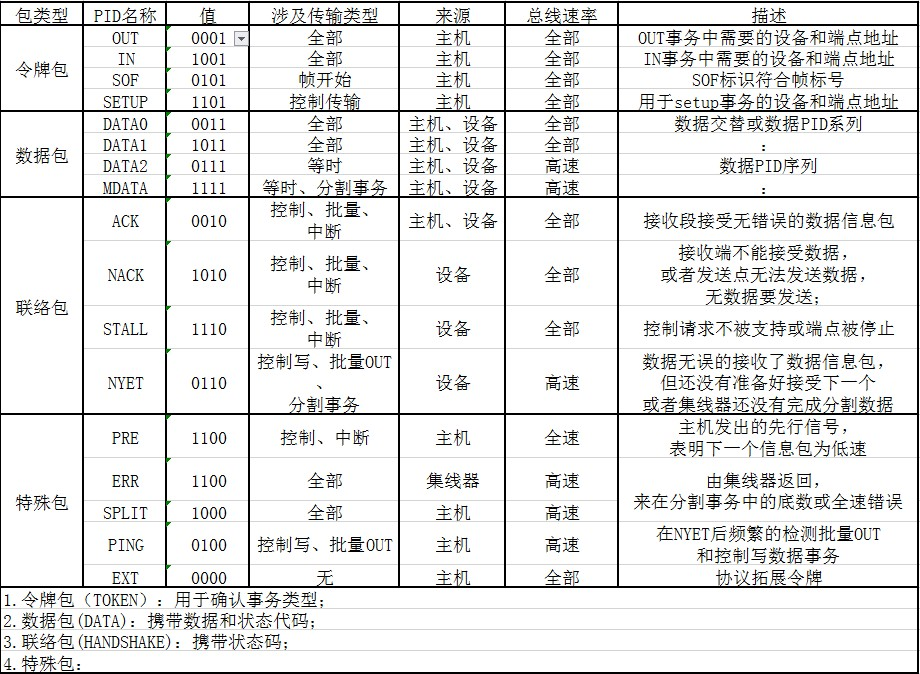
   
         **注意：一般意义上数据帧的开始是SOF包、数据帧的结束是EOF但在包的分类中没有看到有EOF包，是因为EOF并不是一种数据包，EOF是一种电平状态，即D-/D+同时拉低并保持一定时间（好像是10ms）**

     - 包的组成：

       - 同步字段（SYNC）:所有信息数据包都开始于同步字段，通过NRZI编码之后，就是一串方波，在USB的nrzi编码下，逻辑0会造成电平翻转，逻辑1不会造成电平翻转，所以接受者在接收数据的同时，根据收到信号翻转调整同步的频率，保证数据传输正确；

       - 包标识字段（PID）:

       - 数据字段：

       - CRC校验字段：

       - 包尾字段（EOP）：

         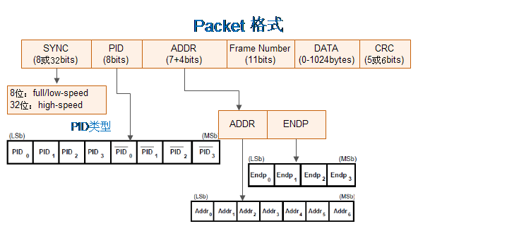

     

3. 事务与数据包的搭配：

   - IN事务：主机期望从设备获取信息：

     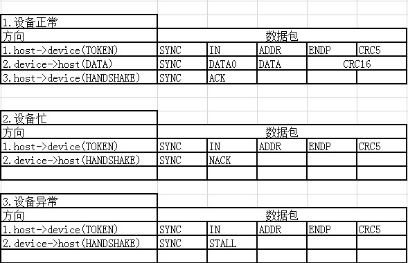
   
   - OUT事务:主机将数据发送到设备 
   
     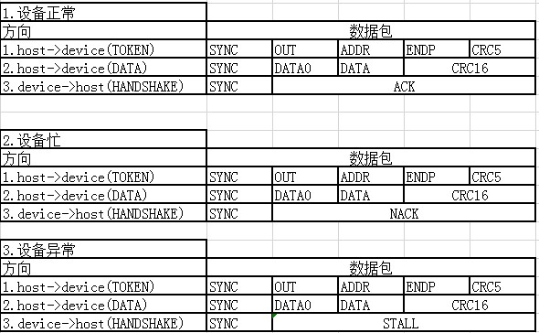
   
   - SETUP事务：
   
     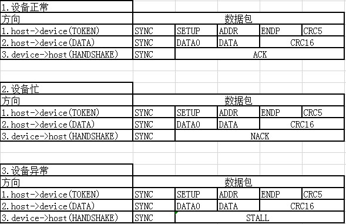

4. 传输类似与传输事务的结合理解：

   - 一次传输可能有多个阶段，每个阶段有一个或多个事务组成，每个事务有多个步骤，每个步骤中又由不同数量的信息数据包组成；

   - 控制传输：主机从USB设备获取配置信息，并设置设备的配置值：

     - 作用：

       - 对所有设备，控制传输携带了主机用以了解和配置设备的标准类请求；
       - 携带任何由类或者厂商定义的请求；
       - 主要用于设备枚举

     - 阶段：每个控住传输都包含建立和状态阶段，数据阶段不一定有

       - 建立（setup）阶段：主机发送请求信息，开始**设置事务**（发送一个setup令牌包），然后在数据步骤发送的数据包内包含有8个字节的请求信息（标准类请求码或者厂商类请求），请求码会确定本次控制传输是否有数据阶段，以及数据阶段的传输方向等，设备正常接收之后会返回ACK应答；

         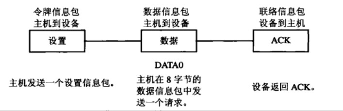

       - 数据（data）阶段：依据数据传输方向及有无数据可分为：

         - 控制写（主机配置设备）：主机配置设备；

           - 主机发送OUT令牌包，表示数据要发送到设备；
           - 主机通过DATA1/DATA0数据包将数据发送到设备；
           - 设备回复状态到主机；
             - ACK:设备正常接收数据；
             - NAK:设备忙（**协议上说明：但是设备已经接收到了host的数据但是无暇响应**）；
             - STALL:设备错误；

           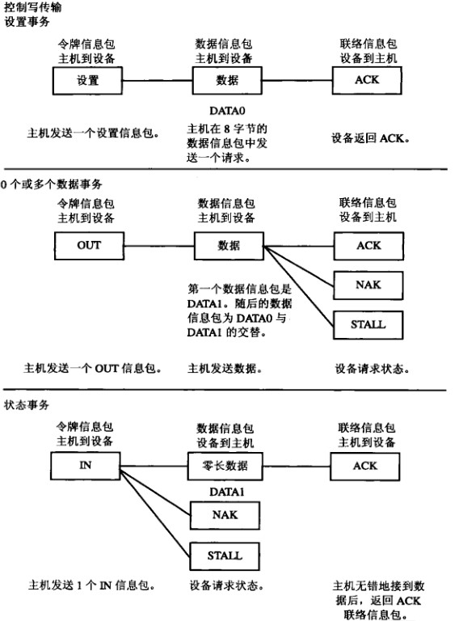

         - 控制读（主机获取设备信息）：主机获取设备的描述符信息，IN事务

           - 主机发送IN令牌包，表示要读数据进来；
           - 设备将通过DATA0/DATA1数据包将描述符信息回传到主机；
           - 主机回复状态到设备:
             - ACK：数据正确接收;
             - NACK:主机正在忙碌；
             - STALL：主机端错误；

           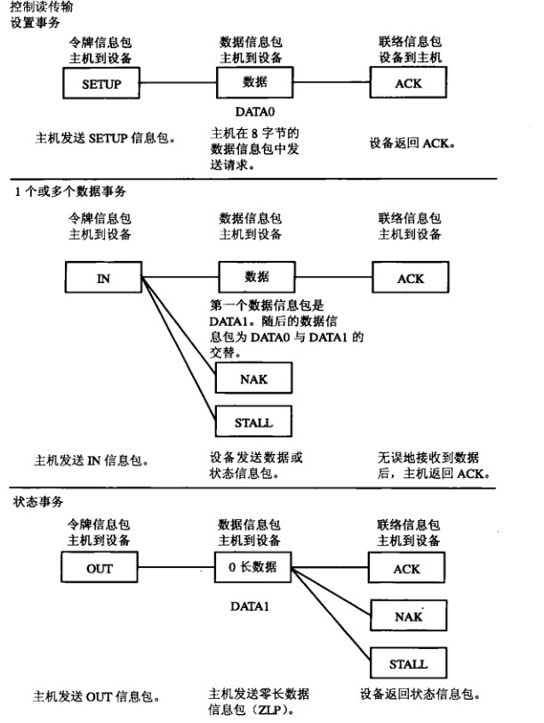

         - 无数据控制：

       - 状态（status）阶段：表示整个传输结束:

         - 状态阶段是事务方向必须与数据阶段都的事务方向相反
         - 对于控制读：主机会发OUT令牌包，后跟0长度的DATA1包，然后设备做出回应;
         - 对于控制写：主机会发IN令牌包，后设备发送出表示完成阶段的0长度的DATA1包，主机再做出相对应的动作；

   - 控制传输：

     - 用于传输大量数据，要求传输不能出错，当对时间没有要求，适用于存储设备、打印机、扫描仪器=等；

     - **低速模式不支持控制传输**；

     - 批量传输是可靠的传输，需要握手包来表明传输结果，若数据量较大，将采用多次批量事务传输来完成全部数据的传输，传输过程中数据包的PID按照DATA0-DATA1-DATA0....的方式翻转，以保证数据发送端和接收端的同步；

     - USB允许连续3次以下的传输错误，会重试该传输，若成功则将**错误计数器清零**否则错误累加器会累加该计数器，超过三次后，host认为该端点功能错误（STALL），放弃该端点的传输任务；

     - **翻转同步**：发送端按照DATA0-DATA1-DATA0...的顺序发送数据包，只有成功的事务才会导致PID翻转，也就是说发送端只有接收到ACK之后才会翻转PID,发送下一个数据包，否则会重试本次事务传输。若在接收端发现接受到数据包不是按照预定的数据进行翻转的，比如连续的收到两个DATA0,那么接收端会认为第二个DATA0是第一个的重传；

     - 阶段： BULK传输从bulk only 协议中的描述来讲大概有3个阶段（如下命名并不是官方命名，个人依据作用命名），每个阶段是由一个或几个IN或OUT事务完成，所有数据沿同一个方向传输：

       - 命令阶段：向设备发送一个SCSI指令（OUT事务）;

       - 数据阶段：发送或者接受设备数据（方向取决于命令，比如read/write）;

       - 状态阶段：设备返回命令执行的状态（IN事务）:

         - IN事务：
           - 主机接收数据，所以handshake是由主机发出，表示当前主机状态：
             - ACK:主机正确无误的接收数据；
             - NAK：设备忙，设备暂时无法响应；
             - STALL:指设备永远停止，需要host软件的干预；

         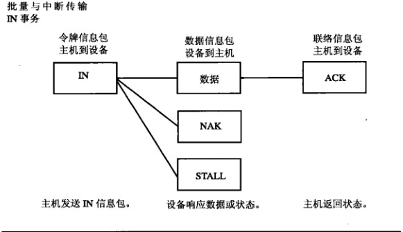

         - OUT事务：

           - 主机发出数据，所以handshake是设备发出：
             - ACK:设备已经正取无误的接收到数据包，且通知host可以按顺序发送下一个数据包
             - NAK：设备已经正确无误的接收到数据包，且通知host重传数据，由于设备端的问题（buffer满）；
             - STALL：设备端点已经停止工作，且通知host不在重传；

           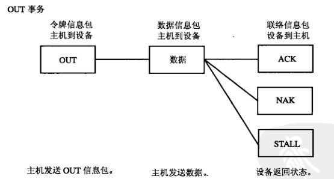

5. <font color = red>数据翻转</font>-----这个必须要说，曾经为了它TI明确不再支持WINCE---多么痛的领悟

   - USB主机和USB设备之间使用数据翻转（data toggle）来实现多个事务的数据传输同步，USB主机和USB设备各自维护一个数据包PID，根据PID来发送数据包：
     - 数据接收方根据数据包的接收情况来改变自身数据包的PID；
     - 数据发送方根据数据接收方的反馈握手包来改变自身的数据包PID；
     - 如果USB主机或USB设备没有更改自身PID，则当前数据包会被重发；
     - 初始状态下USB主机和USB设备自身数据包PID都是DATA0；
     

    + 成功情况:
           + IN事务：
               + 初始状态下USB主机和USB设备自身数据包PID都是DATA0
               + 主机发送一个令牌包指明事务类型为IN事务，设备地址，端点号等
               + USB设备向主机返回一个DATA0数据包；
               + 主机收到该数据包之后将自身的数据包PID改为DATA1
               + 主机向设备返回一个ACK握手包；
               + 设备收到主机的ACK信号之后将自身的数据包PID改为DATA1
               + 至此完成一个IN事务
               + USB主机继续向设备发送IN令牌包（和第一次的一样）；
               + 设备接收到令牌包之后向主机发送一个DATA1数据包;
               + 主机成功收到设备返回的DATA1数据包之后将自身的数据包PID该为DATA0;
               + 主机向设备发送一个ACK握手包
               + 设备收到主机返回的ACK信号之后，将自身数据包的PID该为DATA0
               + ......如此往复
           + OUT事务：
               + 初始状态下USB主机和USB设备自身数据包PID都是DATA0
               + 主机向设备发送一个指明OUT事务类型、设备地址、端点地址的令牌包;
               + 主机发送DATA0数据包;
               + 设备成功收到DATA0数据包后将自己的数据包PID变为DATA1;
               + 设备向主机返回ACK信号;
               + 主机将自身的数据包PID改为DATA1;
               + 如此......
       + 返回NACK情况
           + IN事务：
               + 初始状态下USB主机和USB设备自身数据包PID都是DATA0；
               + 主机向设备发送了一个标识为IN事务、设备地址、端点地址的令牌包；
               + 设备收到令牌包之后，向主机发送一个PID为DATA0的数据包；
               + 由于某种原因主机没有成功接收到设备返回的数据包，所以设备维持自身数据包PID为DATA0;
               + 主机向设备返货NACK握手包；
               + 设备收到NACK之后维持自己的数据包PID为DATA0不变；
               + 此时一个IN事务传输失败，重传开始；
               + 主机向设备发送了一个标识为IN事务、设备地址、端点地址的令牌包；
               + 设备收到令牌包之后，向主机发送一个PID为DATA0的数据包；
               + 主机成功收到设备返回的DATA0数据包，并且将自神的数据包的PID设置为DATA1；
               + 主机向设备返回ACK应答；
               + 设备收到ACK之后将自身的数据包PID变为DATA1；
               + 重发成功；
               + 如果在重过程中由于某种情况主机继续无法成功接收设备的数据包，重发就依旧会失败；
           + OUT事务：
               + 初始状态下USB主机和USB设备自身数据包PID都是DATA0；
               + 主机向设备发送一个指明OUT事务类型、设备地址、端点地址的令牌包;
               + 主机发送DATA0数据包;
               + 由于某种原因设备没能成功接收主机发来的数据包；
               + 设备维持自身的数据包PID保持不变；
               + 设备向主机返回NACK；
               + 主机保持数据包PID为DATA0不变；
               + 数据重传；
               + .....
       + 返回ACK失败情况（接收发发送了ACK但是发送方没有收到）：
           + 初始状态下USB主机和USB设备自身数据包PID都是DATA0；
           
           + 主机向设备发送了一个标识为IN事务、设备地址、端点地址的令牌包；
           
           + 设备收到令牌包之后，向主机发送一个PID为DATA0的数据包；
           
           + 主机成功接收到了设备返回发DATA0数据包，并且将自身的数据包PID改变为DATA1;
           
           + 主机向设备发送ACK握手包；
           
           + 但是由于某种原因设备没能正常接收到主机返回的ACK包，所以设备维持当前数据包的PID为DATA0不变;
           
           + 此时一次IN事务传输完成（主机以及接收到了想要的数据）；
           
           + 主机继续向设备要数据，所以主机继续发送IN令牌包;
           
           + USB设备收到IN令牌包之后，向主机返回一个DATA0数据包（因为上次没改变）；
           
           + 主机成功接收到设备返回的DATA0数据包;
           
           + **主机检查当前自身的数据包PID（DATA1）和收到的DATA0不匹配，则忽略该DATA0数据包且不改变自身的数据包PID**;
           
           + 主机向设备返回一个ACK握手包;
           
           + 设备收到ACK之后，将自身的PID从DATA0变为DATA1,此时完成IN事务重传；
           
           + 此时USB主机和USB设备双方的数据包PID保持一致，如果主机还需要从设备获取数据则继续发送IN事务包，USB设备使用DATA1作为数据包的PID;
           
## Bulk only传输协议

1. 首先应该明确的一点是SCSI是指令集，BOT是传输协议，也就是说SCSI指令是通过BOT传输到设备的；

2. 传输流程:

   - 首先由HOST给设备发送一个CBW（command block wrapper）---5.3.1；
   - device接收到了CBW，会进行解析（识别命令）:
     - device按照CBW里面定义的那样去执行它该做的事情（比如read、write）----5.3.2;
   - 然后给host返回执行状态即一个CSW数据包----5.3.3；

3. CBW: command block wrapper：主要作用是将SCSI指令（CBWCB字段）传输到封包传输出去:

   - 固定长度31bytes;
   - Signature:固定序列：43425355h，CBW数据包的标识；
   - DataTransferLength：host希望device（或者是endpoint）传输多少bytes的数据；
   - flags:表明数据的传输方向，该字段是一个字节长度，bit7表示方向：
     - 0表示 data out即数据从host到device;
     - 1表示 data in 即数据从device到host;
   - Tag：这个 dCBWTag 的意义在于,host 会 send 出去,而 device 将会把这个 Tag 的内容给打印出来,确切的说,device 会回送一个 CSW回来,而在 CSW中会有一个 dCSWTag,她的内容和这个dCBWTag是一样的,所以实际上这就跟接头暗号.每一个 scsi 命令都会被赋上一个 serial_number,这里把她用在了 Tag 上;
   - Lun:表示这个命令是发送个哪个Lun的，即之前提到的get_max_lun获取到的参数；
   - CBWCBLength：即命令的有效长度（bytes），scsi命令的有效长度只能是1到16之间，接下来有个CDB数组，长度为16；

4. CSW: command block wrapper---WINCE现在USB驱动的最大问题就在与接收不到这信息；

   - 固定长度13个字节；

   - Signature:数据包标识符：53425355h；

   - Tag：与CBW中的Tag对应；

   - DataResidue：传输差，不过因为设备的硬件bug 这个字段基本没用了；

   - Status：表示当前命令的执行状态：

     - 00h:command passed("good status")；
     - 01h:command failed；
     - 02h:Phase Error;
     - 03-:Reserved
## 标准类请求

1. 标准类请求通用格式：
   - bmRequestType（请求命令类型）：
     -  D7 : 数据传输方向:
       - 0 主机到设备(OUT);
       -  1 设备到主机(IN)；
     - D6~D5 : 命令的类型 :
       - 00 表示标准请求命令; 
       - 01 类请求命令; 
       - 10 用户定义的请求命令; 
       - 11 保留；
     - D4~D0 : 该命令的接收者类型 :
       - 00000 接收者为设备; 
       - 00001 接收者为接口; 
       - 00010 接收者为端点; 
       - 00011 其他接收者; 
       - 其他值保留；
     
   - bRequest:命令请求码：
   
     
   
   - wValue：在不同的命令中有不同的解释：
   
   - wIndex：索引信息，占2个字节：
     - 传输端点索引信息；
       - D15~D8：保留位，默认值0；
       - D7：方向位：
       - D6~D4:保留位，默认值为0；
       - D3~D0:端点号；
     - 传输接口索引信息：
       - D15~D8:保留位，默认值0；
       - D7~D0:接口编号；
     
   - wLength：传输的数据大小，占2 字节。
     - 数据是主机到给设备 , 值便是实际的数据大小; 
     - 数据是设备到主机时, wLength 的值是设备能够 发送的最大数据包的大小, 当然, 设备实际发送的数据可以比 wLength 的值小。
     
     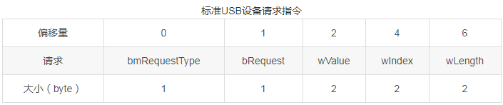
   
2. 获取设备描述符

   - bmRequestType：固定为10000000
     - 数据方向是输 入IN, 即设备发送数据给主机；
     - 命令接收者是设备；
   - bRequest：0x06；
   - wValue：
     - 高字节为描述符的类型编号 ；
     - 低字节为描述符的字符串索引；
   - wIndex：
     - 获取的是字符串描述符, 则此字段的内容即为与字符串有关的语言ID；
     - 获取的是设备或配置描述符, 则此字段的值为0；
   - wLength：为要求设备返回的数据大小；
   - 返回数据：
     - 设备描述符：
     -  获取的是配置描述符时, 设备将会按顺序返回该配置描述符, 以及该配置支持的所有接口描述符和接口使用的所有端点描述符。

3. 设置配置请求：

   - bmRequestType：固定为00000000,
     - 方向OUT, 即主机发送数据给设备；
     - 命令类似：标准类请求； 
     - 命令接收者：设备；
   - bRequest：0x09；
   - wValue：主机要求设备采用的配置的配置值, 即配置描述符中的iConfigurationValue字段的值；
   - wIndex：固定为0；
   - wLength：固定为0；

4. 设置接口请求：

   - bmRequestType：固定为00000001,
     - 方向OUT, 即主机发送数据给设备；
     - 命令类似：标准类请求； 
     - 命令接收者：接口；
   - bRequest：0x0B；
   - wValue：主机希望设定的接口描述符编号, 即接口描述符中的 bAlternateSetting 字段；
   - wIndex：值为接收该命令的接口编号, 即接口描述符中的 bInterfaceNumber 字段的值；
   - wLength：固定为0；
## 传输实例
### wince

1. 一次完整的SCSI传输(DMA+HS):

   ```
   1.ScsiReadWrite(或者其它的应用层下发命令)---scsi2.c
   -依据命令、传输方向、传输数据大小进行组包:即CBW.CB中所涉及到的字段；
   2.UsbsDataTransfer()---usbmsc.c
   -根据device的接口描述符中的字段选择传输方式(CBW是你的包裹，这里只是选择使用哪个快递寄包裹)，
    SCSI设备现在通用选择的就是Bulk only传输方式；
   3.BOT_DataTransfer()---bot.c
   -BOT_ResetAllPipes()---bot.c
   --复位传输所涉及到的控制端点和IN/OUT端点----这里也是有层次关系的;
   -填充CBW包:包括操作码、命令参数传输方向、传输数据大小等最大长度31 bytes;
   -bulk only  命令阶段5.3.1---肯定是一次OUT事务(固定长度为31个字节):
   --IssueBulkTransfer()传输函数----usbclient.c:
   ---函数中有一个形参：Timeouts.CommandBlock：即传输的超时时间，默认是400ms
      在usbmscp.h(\WINCE600\PUBLIC\COMMON\OAK\DRIVERS\USB\CLASS\STORAGE\CLASS)中定义;
      当前通过修改platform.reg注册表将该值修改为512ms;
   ---pUsbFuncs->lpIssueBulkTransfer()调用设备的传输函数
      hcd.cpp(WINCE600\PLATFORM\NK280B_A8\SRC\COMMON_TI_V1\AM33X\USB\usb2com);
   ----UsbFuncs:UsbFuncs结构体定义了Function（device）所支持的所有操作；
   -----该结构体的定义在：usbdi.h(\WINCE600\PUBLIC\COMMON\DDK\INC);
   -----结构体赋值在:
   ----SHcd * pHcd = pDev->pHcd;
   ----pFunc = pHcd->pHcdFuncs->lpIssueTransfer
   -----HcdFuncs结构体定义在
   -----该结构体赋值在：
   -----所以此处调用的是HcdIssueTransfer()
        hcddrv.cpp(\WINCE600\PLATFORM\NK280B_A8\SRC\COMMON_TI_V1\AM33X\USB\usb2com)
   ------ISSUE_TRANSFER_PARAMS 将之前传递几个参数在这里全部赋值到这个结构体里面；
   ------RetVal = pHcd->IssueTransfer( pITP );
   -------pRoot->IssueTransfer();
   --------status = pRoot->IssueTransfer( pITP );这里就开始体现出层次结构了,
           CHub::IssueTransfer( ISSUE_TRANSFER_PARAMS* pITP )
   		cdevice.cpp(\WINCE600\PLATFORM\NK280B_A8\SRC\COMMON_TI_V1\AM33X\USB\usb2com);
   ---------status = m_ppCDeviceOnPort[ port ]->IssueTransfer( pITP ):Root tier 0
   ----------status = m_ppCDeviceOnPort[ port ]->IssueTransfer( pITP );:External tier 1
   -----------CFunction::IssueTransfer( ISSUE_TRANSFER_PARAMS* pITP ):tier 2
   ------------status = m_ppCPipe[ pITP->pipeIndex ]->IssueTransfer()::pipe
               CQueuedPipe::IssueTransfer()；cpipe.cpp:(\WINCE600\PLATFORM\NK280B_A8\SRC\COMMON_TI_V1\AM33X\USB\USBH)	
   -------------SetEvent(m_pCOhcd->m_hUsbProcessingEvent);
                触发UsbProcessingThrea线程()这个线程是传输的起始地方也是传输的结束地方起始传输过程中
   			 也有涉及;
   -------------dwWait = Objectionableness(m_microprocessing, PROCESSING_EVENT_TIMEOUT);DWORD CHW::UsbProcessingThread( )：
   			 chw.cpp(\WINCE600\PLATFORM\NECKBAND_A8\SRC\COMMON_TI_V1\AM33X\USB\USBH);
   --------------执行 Bulk IN/OUT 代码分支（或者其它的传输类型分支，这里只关注bulk传输类型），
                 对于每一次传输都有三个状态：
   ---------------STATUS_IDL:开始传输:
   1.InitializeTransaction(m_portBase, pED, pTD)：初始化传输，对于Bulk传输来说走TD_OUT_PID、TD_IN_PID两个分支---chw.cpp
     -BOOL fResult = pED->pDmaChannel->IssueTransfer():根据RX、TX选择DMA通道
     --CCppiDmaRxChannel::IssueTransfer():cppidma.cpp（\WINCE600\PLATFORM\NK280B_A8\SRC\COMMON_TI_V1\AM33X\USB\USBH）
     ---fResult = ScheduleTransfer():Schedule next RX DMA segment
        这里就涉及到cppidma传输较为底层的内容(RXCSR：RX状态寄存器/RXGCR：全局配置寄存器)
     ----NextSegment(); Create HDs for next segment:pushP PD到queue
     -----QueuePush(pHd);
     ------m_pController->QueuePush(m_qNum, pD);
     -------addr = DescriptorVAtoPA(pD);
     -------value = ((addr & QMGR_QUEUE_N_REG_D_DESC_ADDR_MASK) | (size & QMGR_QUEUE_N_REG_D_DESCSZ_MASK   ));---addr:0x8aed3fc0,size:10（size是固定的为什么是这个数字？）
     -------m_pCppiRegs->QMQUEUEMGMT[qNum].QCTRLD = value：写数据包的PA地址、size写入.QCTRLD寄存器中相当于压入queue;
     ---判断是否需要写toggle位（当前toggle状态）
     ---m_pUsbEpcsrRegs->RXCSR = nCsr：写状态寄存器 开启DMA发送对应的OUT、IN请求
     ---将pD压入queue然后开启DMA，DMA传输就开始了，传输过程无法监控，只能得知传输结果
     ---传输完成之后读取到的刚刚压入的queue值就会变空，同时与该queue对应的状态queue中会存有与之相同的值（具体使用哪个queue是芯片已经规定好的输入、输入对应的queue）
   1.1正常传输完成会触发一个AM335X的中断（irq=17 USBSSINT: USBSS IRQ_STATUS中的pd_cmp_flag标识位）
    -该中断的IST对应于IntrThread():WaitForSingleObject(g_Dc.hIntrEvent, INFINITE);usbcdma.c(\WINCE600\PLATFORM\NK280B_A8\SRC\COMMON_TI_V1\AM33X\USB\USBCDMA)
    --在该文件中的UCD_Init()中执行了事件与中断的绑定（wince中断处理方式就是这样）
    --g_Dc.pUsbssRegs->IRQ_STATUS = g_Dc.pUsbssRegs->IRQ_STATUS：进来之后先清中断
    --判断queue状态执行对应的回调函数：queue的状态根据PENG寄存器体现出来的如果有值则对应pend寄存器中的值为1同理如果queue中没有值则对应的pen寄存中对应的位为0
    --g_Dc.usb[1].callback(g_Dc.usb[1].param);执行相应的回调函数
   1.2回调流程：
   -VOID CCppiDmaController::CompletionCallback(PVOID param):cppidma.cpp(WINCE600\PLATFORM\NK280B_A8\SRC\COMMON_TI_V1\AM33X\USB\USBH)
   --(CCppiDmaController*)param)->OnCompletionEvent();
   ---void CCppiDmaController::OnCompletionEvent()：同文件中定义
   ----读取PEND寄存中的值判断是处理输入、还是输出；
   ----void* pD = QueuePop(qnum);获取周=queue中的数值:物理地址转虚拟地址
   -----return（**DescriptorPAtoVA**( m_pCppiRegs->QMQUEUEMGMT[qNum].QCTRLD））
   ----ProcessCompletionEvent(pD):在这个函数里面有两个处理分支
   -----USB_CPPI41_DESC_TYPE_HOST(Host Descriptor )：传输成功的处理分支:
   ------pChannel->ProcessCompletedPacket(pHd);
   -------对应RX、TXchannel;
   -------CppiDmaRxChannel::ProcessCompletedPacket(HOST_DESCRIPTOR* pHd)
   --------if (!ValidateTransferState())检测当前传输状态，其实就是读取RXCSR寄存器的值判断DMA有没有关闭，有没有FIFO溢出等；
   ---------ValidateTransferState如果传输状态正常：返回TRUE;
   ---------如果传输完成（fTransferComplete）：通知应用层传输完成：
   ----------(m_pCallback)执行传输完成的回调函数(TX与RX略有不同，TX在执行m_pCallback之前还有一个自己 的OnTransferComplete())：
   -----------m_pCallback实际执行的的是void CHW::DmaTransferComplete()函数：chw.cpp(\WINCE600\PLATFORM\NK280B_A8\SRC\COMMON_TI_V1\AM33X\USB\USBH)
   ------------在哪执行的绑定呢？
   ------------SetEvent((m_pChw[pChannel->m_chwInd])->m_hUsbProcessingEvent);触发UsbProcessing线程（传输的开始和结束都在这里STATUS_COMPLETE状态
   ------------到此整个回调处理流程结束（传输没有结束），回调的开始是在IntrThread()开始，同样结束也在这里完成
   ---------如果没有传输完成（fTransferComplete）：继续调度传输；
   ----------ScheduleTransfer........继续该流程；
   ---------如果传输状态异常：返回FALSE：
   ---------- m_pController->HdFree(pHd); // Free the HD
   -----USB_CPPI41_DESC_TYPE_TEARDOWN(Teardown Descriptor )：传输失败的处理分支：
   ---------------STATUS_PROGRESS:
   ---------------STATUS_COMPLETE:
   1.DmaTransferComplete中触发UsbProcessing线程之后，线程继续执行，判断该传输类型，传输状态，传输完成之后进入到该阶段；
    - ( *pTD->sTransfer.lpfnCallback )( pTD->sTransfer.lpvCallbackParameter )：执行回调，这里的回调就是IssueTransfer()开始时传入的DefaultTransferComplete()
    --DefaultTransferComplete()----usbclient.c(WINCE600\PUBLIC\COMMON\OAK\DRIVERS\USB\CLASS\COMMON);
    ---setEvent( hEvent)：触发完成事件；
   
   ----IssueBulkTransfer()传输函数usbclient.c:dwWaitReturn = WaitForSingleObject( NotifyContext, dwTimeout )：
       这里等到的实践就是DefaultTransferComplete中触发的事件，dwTimeout就是一开始传入的超时时间，如果在这个时间内没等到该事件触发（传输完成）就认为传输超时,
   -----CloseTransferHandle(pUsbFuncs, hTransfer);usbclient.c(\WINCE600\PUBLIC\COMMON\OAK\DRIVERS\USB\CLASS\COMMON)
   ------lpCloseTransfer():CloseTransfer:usbdrv.c(WINCE600\PUBLIC\COMMON\OAK\DRIVERS\USB\USBD)
        如果正常传输则结束传输，如果异常则进入到AbortTransfer()
   到此一次完整的命令传输就结束
   
   
   1.3传输失败情况1：传输超时：理论上任何一个环节都有可能造成传输超时，但是目前识别到到主要是：DMA没有触发相应的USBSSINT中断，此时需要手动触发一次中断()
    -传输超时之后进入到AbortTransfer()终止传输usbdrv.c(WINCE600\PUBLIC\COMMON\OAK\DRIVERS\USB\USBD)
    --fRet =(*pFunc)(pHcd->pvHcd, pDev->iDevice, pPipe->iEndpointIndex, lpStartAddress, lpvNotifyParameter, pTransfer);
    --pFunc = pHcd->pHcdFuncs->lpAbortTransfer;
    --BOOL CHcd::AbortTransfer():hcd.cpp(\WINCE600\PLATFORM\NK280B_A8\SRC\COMMON_TI_V1\AM33X\USB\usb2com)
    ---fSuccess = (requestOK == pRoot->AbortTransfer()
    ---CHub::AbortTransfer():cdevice.cpp:(\WINCE600\PLATFORM\NK280B_A8\SRC\COMMON_TI_V1\AM33X\USB\usb2com)
    ----status = m_ppCDeviceOnPort[ port ]->AbortTransfer():root hub&external hub
    -----CFunction::AbortTransfer()
    ------status = m_ppCPipe[ pipeIndex ]->AbortTransfer()
    -------CQueuedPipe::AbortTransfer():cpipe.cpp()(WINCE600\PLATFORM\NK280B_A8\SRC\COMMON_TI_V1\AM33X\USB\USBH)
    --------pED->pDmaChannel->CancelTransfer():区分RX/TX
    ---------CCppiDmaRxChannel::CancelTransfer():这里执行了一系列步骤此处只说流程比较重要的一步
    ----------KickCompletionCallback();void CCppiDmaChannel::KickCompletionCallback()：cppidma.cpp:(WINCE600\PLATFORM\NK280B_A8\SRC\COMMON_TI_V1\AM33X\USB\USBH) 
    -----------USBCDMA_KickCompletionCallback(m_pController->m_hUsbCdma):VOID USBCDMA_KickCompletionCallback(HANDLE hUsbModule):usbcdma.c()
    -----------SetEvent(g_Dc.hIntrEvent)：也就说这里手动触发USBSSINT 中断
    --------pED->TransferStatus = STATUS_IDLE;
    --------SetEvent(m_pCOhcd->m_hUsbProcessingEvent);最后的传输都要回到UsbProcessingThread
   ```

   ```
   USBMSC>UsbsDataTransfer
       USBMSC>BOT_DataTransfer
       USBMSC>BOT_ResetAllPipes
       MGHC: +CHcd::IsPipeHalted - address = 2, pipeIndex = 0
       MGHC: +CHub(Root tier 0)::IsPipeHalted - address = 2, pipeIndex = 0
       MGHC: +CHub(External tier 1)::IsPipeHalted - address = 2, pipeIndex = 0
       MGHC: +CFunction(tier 2)::IsPipeHalted - address = 2, pipe = 0
       +CPipe(Control)::IsPipeHalted
       -CPipe(Control)::IsPipeHalted, *lpbHalted = 0, returning HCD_REQUEST_STATUS 1
       MGHC: -CFunction(tier 2)::IsPipeHalted - address = 2, pipe = 0, returing HCD_REQUEST_STATUS 1
       MGHC: -CHub(External tier 1)::IsPipeHalted - address = 2, pipe = 0, returing HCD_REQUEST_STATUS 1
       MGHC: -CHub(Root tier 0)::IsPipeHalted - address = 2, pipe = 0, returing HCD_REQUEST_STATUS 1
       MGHC: -CHcd::IsPipeHalted - address = 2, pipeIndex = 0, *lpbHalted = 0, retval = 1
       MGHC: +CHcd::IsPipeHalted - address = 2, pipeIndex = 1
       MGHC: +CHub(Root tier 0)::IsPipeHalted - address = 2, pipeIndex = 1
       MGHC: +CHub(External tier 1)::IsPipeHalted - address = 2, pipeIndex = 1
       MGHC: +CFunction(tier 2)::IsPipeHalted - address = 2, pipe = 1
       +CPipe(Bulk)::IsPipeHalted
       -CPipe(Bulk)::IsPipeHalted, *lpbHalted = 0, returning HCD_REQUEST_STATUS 1
       MGHC: -CFunction(tier 2)::IsPipeHalted - address = 2, pipe = 1, returing HCD_REQUEST_STATUS 1
       MGHC: -CHub(External tier 1)::IsPipeHalted - address = 2, pipe = 1, returing HCD_REQUEST_STATUS 1
       MGHC: -CHub(Root tier 0)::IsPipeHalted - address = 2, pipe = 1, returing HCD_REQUEST_STATUS 1
       MGHC: -CHcd::IsPipeHalted - address = 2, pipeIndex = 1, *lpbHalted = 0, retval = 1
       MGHC: +CHcd::IsPipeHalted - address = 2, pipeIndex = 2
       MGHC: +CHub(Root tier 0)::IsPipeHalted - address = 2, pipeIndex = 2
       MGHC: +CHub(External tier 1)::IsPipeHalted - address = 2, pipeIndex = 2
       MGHC: +CFunction(tier 2)::IsPipeHalted - address = 2, pipe = 2
       +CPipe(Bulk)::IsPipeHalted
       -CPipe(Bulk)::IsPipeHalted, *lpbHalted = 0, returning HCD_REQUEST_STATUS 1
       MGHC: -CFunction(tier 2)::IsPipeHalted - address = 2, pipe = 2, returing HCD_REQUEST_STATUS 1
       MGHC: -CHub(External tier 1)::IsPipeHalted - address = 2, pipe = 2, returing HCD_REQUEST_STATUS 1
       MGHC: -CHub(Root tier 0)::IsPipeHalted - address = 2, pipe = 2, returing HCD_REQUEST_STATUS 1
       MGHC: -CHcd::IsPipeHalted - address = 2, pipeIndex = 2, *lpbHalted = 0, retval = 1
       USBMSC<BOT_ResetAllPipes:1
       Cbw.CBWCB[0]:0x1a
       Cbw.CBWCB[1]:0x0
       Cbw.CBWCB[2]:0xc0
       Cbw.CBWCB[3]:0x0
       Cbw.CBWCB[4]:0x0
       Cbw.CBWCB[5]:0x0
       Cbw.CBWCB[6]:0x0
       Cbw.CBWCB[7]:0x0
       Cbw.CBWCB[8]:0x0
       Cbw.CBWCB[9]:0x0
       5.3.1 CBW
       IssueBulkTransfer dwTimeout:4000
       MGHC: +CHcd::IssueTransfer - address = 2, pipe = 2, dwFlags = 0x300, lpvControlHeader = 0x0, lpvBuffer = 0xd4f0dad0, dwBufferSize = 31
       MGHC: +CHub(Root tier 0)::IssueTransfer, address = 2, pipe = 2
       MGHC: +CHub(External tier 1)::IssueTransfer, address = 2, pipe = 2
       MGHC: +CFunction(tier 2)::IssueTransfer
       +CQueuedPipe(Bulk)::IssueTransfer, address = 2
       IT: EP1 BULK OUT, len 31
       CQueuedPipe::SetEvent:m_pCOhcd->m_hUsbProcessingEvent!
       UPD:m_hUsbProcessingEvent+
       +ValidateTransferState
       -ValidateTransferState
       UPD:Bulk (out) requests
       UPD:Bulk (out) requests:STATUS_IDLE
       CHW::InitializeTransaction port B2D01800, pED D4EF7938, TrDsc D4EFDAA8
       +CCppiDmaTxChannel::IssueTransfer: TX Ch 0 (EP 1/0x02/2/512) - 31 bytes
        CCppiDmaTxChannel::IssueTransfer: RndisMode 1, epMaxPkt 512, MaxBD 65536
       +CCppiDmaChannel::UpdateRndisMode: TRUE
       -CCppiDmaChannel::UpdateRndisMode: Ch 0 MODE RegVal 0x00000003
        CCppiDmaTxChannel::IssueTransfer: Length 31, 1 frames, options 0x00000300
       +CCppiDmaTxChannel::ScheduleTransfer: OUT Ch 0 (EP 1)
       TXCSR_value:0x3000
       +CCppiDmaChannel::NextSegment: OUT Ch 0 (EP 1/0x02/2/512)
        CCppiDmaChannel::NextSegment: TransferLength 31, BytesLeft 31, FramesLeft 1
        CCppiDmaChannel::NextSegment: BD 0 - Next 0x00000000, Buffer 0x8af6f000, Length 31
       +CCppiDmaController::QueuePush
       CCppiDmaController::DescriptorVAtoPA:0xd501ffc0->0x8aed3fc0
       addr:0x8aed3fc0,size:10
       +.+
       irq = 17
       IntrThread::hIntrEvent +
       g_Dc.pUsbssRegs->IRQ_STATUS = 0x404
       PEND0= 0x80000000
       PEND1= 0x0
       PEND2 = 0x0
       PEND3= 0x20000000
       PEND4 = 0x0
       +CCppiDmaController::CompletionCallback
       +CCppiDmaController::OnCompletionEvent
       QSTATA= 0x0
       QSTATB= 0x0
       QSTATC= 0x0
       +CCppiDmaController::OnCompletionEvent
        CCppiDmaController::QueuePop:value 0x8aed3fc0,queue 125,
       CCppiDmaController::DescriptorPAtoVA:0x8aed3fc0->0xd501ffc0
       +CCppiDmaController::ProcessCompletionEvent: 0xd501ffc0
        CCppiDmaController::ProcessCompletionEvent: type 16
       +CCppiDmaTxChannel::ProcessCompletedPacket: OUT Ch 0 (EP 1)
       -.-
       -CCppiDmaController::QueuePush: type 16, queue 62, value 0x8aed3fca
       -CCppiDmaChannel::NextSegment: 1 BDs in the chain
       -CCppiDmaTxChannel::ScheduleTransfer
        CCppiDmaTxChannel::ProcessCompletedPacket: Packet 1 (of 1), bytes 31
        CCppiDmaTxChannel::ProcessCompletedPacket: Sent 31/31, 0/31
        CCppiDmaTxChannel::ProcessCompletedPacket: Completed 31/31, status 0x0
       +CCppiDmaTxChannel::OnTransferComplete: OUT Ch 0 (EP 1)
       -CCppiDmaTxChannel::IssueTransfer
       OUT take 1
       UPD:Bulk (in) requests
       -CCppiDmaTxChannel::OnTransferComplete
       -CCppiDmaTxChannel::ProcessCompletedPacket
       -CCppiDmaController::ProcessCompletionEvent
       -CCppiDmaController::OnCompletionEvent
       -CCppiDmaController::CompletionCallback
       -USBCDMA: IntrThread - ISR
       +UsbProcessingThread
       UPD:m_hUsbProcessingEvent+
       UPD:Bulk (out) requests
       UPD:Bulk (out) requests:STATUS_COMPLETE
       TC: EP1 BULK OUT, len 31UPD:Bulk (out) requests
       UPD:Bulk (in) requests
       +UsbProcessingThread
       -CQueuedPipe(Bulk)::IssueTransfer - address = 2, returning STATUS 1
       MGHC: -CFunction(tier 2)::IssueTransfer - returing HCD_REQUEST_STATUS 1
       MGHC: -CHub(External tier 1)::IssueTransfer address = 2, pipe = 2, returing HCD_REQUEST_STATUS 1
       MGHC: -CHub(Root tier 0)::IssueTransfer address = 2, pipe = 2, returing HCD_REQUEST_STATUS 1
       MGHC: -CHcd::IssueTransfer - returing BOOL 
       GetTransferStatus
   ```
   
   

### linux

1. linux USB驱动完成一个scsi命令的bulk only传输过程：(为了显示层级关系只能这样看了)

   ```
   void usb_stor_transparent_scsi_command(struct scsi_cmnd *srb, struct us_data *us)--- drivers/usb/storage/protocol.c.同wince中的SCSI2.C这一级，只不过wince中对一些常用的SCSI命令直接做了封装
   	usb_stor_invoke_transport(srb, us);---void usb_stor_invoke_transport (struct scsi_cmnd *srb, struct us_data *us）---transpot.c
   			初始化的时候依据srb 中包含的SCSI命令信息、传输信息等完成CBW的组包，然后开始传输；
   			result = us->transport(srb, us);---int usb_stor_Bulk_transport(struct scsi_cmnd *srb, struct us_data *us)
   				result=usb_stor_Bulk_transport()---此函数相当于wince中的BOT_transport()-----bot.c具体完成BOT传输的三个阶段
   					5.3.1 command stage:
   					result=usb_stor_bulk_transfer_buf()---此函数相当于wince中的IssueTransfer()函数
   						usb_fill_bulk_urb():---构建urb,但是这里只是填充了一些bulk和本次传输的特殊参数，在Linux驱动中数据的传输单元是urb,其实在wince中也有类似的操作，在HcdIssueTransfer()中将最初BOT传入的一堆参数最终都
   											赋值到ISSUE_TRANSFER_PARAMS 结构体中，然后以结构体传参的形式将传输参数传输到HCD层；
   						result = usb_stor_msg_common(us, 0)---之前的urb并没有完全填充完成，一些通用的参数在这里完成，同时会将URB提交，
   											 这个函数的参数中有一个timeout的值在后面需要用到；
   											 (在Linux设备驱动中一次SCSI传输只需要提交一个 urb 就可以了,剩下的事情 usb core 会去处理,有了结果它会通知到这边.而提交
   											  urb,usb core准备了一个函数,usb_submit_urb()所以不管使用什么传输方式,都只要调用这个函数
   											  即可,而在调用之前,设备驱动需要做的只是准备好一个urb,把urb中各相关的成员填充好,然后就ok了)
   							status = usb_submit_urb(us->current_urb, GFP_NOIO)---向USB核心层提交URB，有点类似于wince usbd 向HCD转接的过程但是又包含有HCD到device、pipe一级的一些东西----\kernel\drivers\usb\core
   																			 对于设备驱动层（类似于wince的class层）来将只需要将传输数据提交到这里，然后等待执行结果即可，无需关注函数的实现
   																			这里传了两个参数一个是需要提交的URB,一个是申请内存的方式；
   																			GFP_NOIO：申请内存的时候不能进行IO操作---wince上应该不需要考虑这个，这个与Linux的SWAP分区有关
   																			如果函数执行正常这里返回的0，如果不正常这里返回一个错误的状态码，如果与wince对比的话这里的status就是bot单个阶段的返回值hTransfer
   																			（只是作用类似都标记这数据已经提交可以进行下一步），但是又不完全一致
   																			status返回值只是标识当前的urb有没有被提交成功，不能完全标识本次传输带状态；
   																			urb被正常提交至会将us->flag 置成US_FLIDX_URB_ACTIVE，标识当前的URB是活动状态，
   																			在进入等待URB传输完成之前还会判断是一下提交的URB是不是被某个环节（其它线程）标识成aborting或者disconnect
   																			如果URB被正常被提交接下里就要进入到等待状态了---进程进入休眠状态；
   								timeleft = wait_for_completion_interruptible_timeout(&urb_done, timeout ? : MAX_SCHEDULE_TIMEOUT):等待传输完成	(wince中的WaitForSingleObject( NotifyContext,dwTimeout)-)										
   																			 timeout:之前在传参的时候这里传入的是0； MAX_SCHEDULE_TIMEOUT：#define LONG_MAX	((long)(~0UL>>1)):2147483647其实相当于无限制等待
   																			 也就是相当于bulk传输的某一个阶段是无限制等待--wince中的WaitForSingleObject( NotifyContext,dwTimeout)dwTimeout =INFINITE，实际上当前
   																			 wince驱动代码找中这个超时时间是4S（或者512ms），这一点是很大的不同，但是可能与两者的传输机制有关
   									wait_for_common(x, timeout, TASK_INTERRUPTIBLE)---:这里的第一个参数是urb_done(struct completion结构体)，在前面的初始化过程(usb_stor_msg_common函数中)可以看到init_completion(&urb_done)
   																					在这里初始化了urb_done，completions是Linux中的一种同步机制的一个数据结构体，其作用流程大概是：首先调用init_completion初始化一个completions数据结构
   																					然后调用wait_for_common()使当前线程、进程进入休眠（等待）状态，而其它相关的工作线程、进程会在做完某个动作之后调用complete()函数，一但调用这个函数刚才等待的
   																					进程、线程就会被唤醒：（与wince中的wince中的WaitForSingleObject() 、setEvent()机制作用相同）;
   																					相应的这里的唤醒操作是在usb_stor_blocking_completion()中完成的，在usb_fill_bulk_urb()初始化urb时
   																					urb->complete = complete_fn;此处的回调函数被赋值为usb_stor_blocking_completion；对应的在wince中IssueBulkTransfer传参时会指定对应的完成回调函数DefaultTransferComplete
   										usb_stor_blocking_completion()---urb传输完成的回调函数complete(urb_done_ptr);--这个函数会在USB 核心层或者HCD层被调用
   																	  大概流程是：当URB传输完成之后，USB host controller会通知传输层(transport layer)当前URB传输已经完成，但是 usb host controller 又不会直接去通知
   																	  而是通过一个中间人去通知即通过执行URB指定的回调函数，然后在回调函数中在执行complete()通知传输层，传输已经完成可以继续执行
   																	  对应的流程在wince中体现为UsbProcessingThread()中如果以检测到本次传输已经完成（STATUS_COMPLETE，status的切换是在UsbInterruptThread线程中切换--PIO模式，DMA是在另外一个线程）
   																	  则执行对应的( *pTD->sTransfer.lpfnCallback )( pTD->sTransfer.lpvCallbackParameter )---对应的就是DefaultTransferComplete(PVOID Context)函数，然后在该函数中执行SetEvent( hEvent)
   																	  继而在WaitForSingleObject( NotifyContext, /*INFINITE*/dwTimeout)处就可以得到想要的信号，线程被唤醒，然后进行后续操作
   																	  这个函数在哪里被调用的那是USB 核心层或者是HCD层的事情---这里很重要，顺着这条线可以找到HCD层的传输流程；
   																	  这里有一个问题就是即使是出现了超时usb_stor_blocking_completion还是会被调用，只不过此时的urb状态不一致（它会通知该urb已经被cancel），这一点与wince中也是一致的
   																	  在超时之后的ResetBulkEndpoint中会执行(*NotifyRoutine)(NotifyContext);
   									timeleft如果为0表示超时、如果为正表示传输完成，这里还有一个-ERESTARTSYS if interrupted；
   									当然这里无论传输超时还是传输成功最终都是通过us->current_urb->status;返回上一级的，在wince中无论是超时还是完成都会调用GetTransferStatus()同样会标记当前的传输状态
   									然后执行CloseTransferHandle()以明确下一步是否需要abort-cancel transfer，在Linux中将status返回到usb_stor_bulk_transfer_buf中以决定下一步的动作，所以继续回到usb_stor_bulk_transfer_buf
   									
   						result=us->current_urb->status：返回当前的urb状态(回到usb_stor_bulk_transfer_buf)，按照Linux驱动代码的设计思路虽然在wait_for_common中传入的超时参数虽然是“无限制”的但是肯定会在USB核心层或者HCD层进行处理，
   														不会无限制的等待，否则在极端的错误情况下这里可能永远执行不到---这不符合设计
   														这里的返回状态再进行判断及处理有点类似于wince的CloseTransferHandle()但是不完全是，linux这个地方处理的范围更大一些，wince中的WaitForSingleObject
   														有一部分在BOT中处理；
   						return interpret_urb_result():根据传入参数对当前的传输结果进行处理，partial参数是SCSI期望传输数据量，length是实际传输的数据量，pipe本次传输使用的管道号，result是usb_stor_msg_common函数执行的返回值(这个result参数实际上是usb 核心层传过来的参数)；
   													 如果reslut== 0 则说明URB是正常提交且USB核心层+HCD层是正常发送了提交的URB（或者可以理解为只是链路是通的有数据进行传输），但是这里有对于result==0还有两种情况，
   													 USB_STOR_XFER_SHORT：实际传输的数据与期望的数据不符合（对于BOT5.3.1来说这里的数据长度固定为31bytes，对于5.3.3来说数据长度固定为13bytes）
   													 USB_STOR_XFER_GOOD：数据传输完全符合预期；
   													 其它非0情况都是错误情况;
   													 这个函数的返回值直接作为usb_stor_bulk_transfer_buf函数的返回值返回，然后就直接返回到usb_stor_Bulk_transport()函数成为本阶段的传输结果
   													 
   					result=usb_stor_bulk_transfer_buf()：如果此处接收的结果不为result=USB_STOR_XFER_GOOD,usb_stor_Bulk_transport()函数也没必要往下进行了，直接向上级返回us->transport(srb, us)交由应用层处理，
   														 如果成功则继续进行向下进行；----5.3.1一直没有没有遇到错误，这里先不急返回到错误处理；这里先假设5.3.1传输正常
   												
   				    在Linux驱动代码中对于某些设备命令阶段到数据阶段有一个大概125us的延时，这是一个某些产家硬件bug,查了一下是一些老式设备(手机、照相机等设备)，没有完全按照协议标准设计导致，现在的不存在---wince驱动没有这部分处理，也不需要了
   					5.3.2 data stage:
   				    在数据阶段使用的传输函数result = usb_stor_bulk_srb(us, pipe, srb)----\kernel\drivers\usb\storage\transport.c:
   					在这里Linux驱动中提到一个USB_STOR_XFER_LONG的概念，即如果数据阶段是RX，设备可能会往host发送比预期多的数据，在wince驱动的5.3.2阶段没有显示考虑、处理这种情况,而是在HCD级的传输函数中会对data overflow做处理；
   					数据传输的过程与命令阶段大体类似，只是数据的前期组织(scatter-gather:目的就是让一堆不连续的 buffers 一次 DMA 操作就都传输出去.)有些不同，目前没有在数据阶段发现明显错误，先不看这部分--wince 这部分与Linux数据的组包、分包方式是相同的；
   					先假设数据阶段传输一切正常；
   					
   					5.3.3 status stage:
   					从bulk only的传输过程、SCSI 、USB协议中的描述可知，USB设备接收host发送的SCSI命令，然后解析该命令(不同的USB设备对命令的解析速度是不同的，从网上了解到有的设备甚这个解析命令的过程会长达300-400ms,,但是对于当前的wince驱动在命令到数据阶段加延时(相当于给设备充足的命令解析时间)没有任何作用)
   					设备解析命令，执行命令（接收、返回host期望的数据），完成数据阶段之后进入status状态(device向host返回一个固定13bytes的状态包)
   					主机接收到状态包的时候对其进行解析，判断本次命令的执行状态；
   					
   					result = usb_stor_bulk_transfer_buf();使用的传输函数与5.3.1完全一致:
   														  US_BULK_CS_WRAP_LEN:status包的长度---固定长度13bytes；
   														  cswlen：记录该阶段的实际传输长度；
   														  bcs：CSW数据buffer
   														  对于CSW阶段的处理还是比较多的
   						1.数据有传输但是实际数据长度小于期望的US_BULK_CS_WRAP_LEN，且实际传输长度为0：有些设备在数据阶段传输结束之后会返回0长度的状态包，这个包不是主机需要的但是设备被会发，所以要处理这个特殊的数据包
   						  如果接受到0长度的状态包， 将其丢弃，然后再次接受CSW数据包“Received 0-length CSW; retrying...”-----wince驱动中在5.3.3阶段没有显示的处理这种情况--实际上遇到的都是没有状态包（不等于状态包的长度为0）
   						  但是这里也有一个问题，如果状态包的长度为0，HCD层或USB核心层是怎标记传输完的---如何触发USB中断？），
   						  
   						  如果再次接收CSW的时候出现了USB_STOR_XFER_STALLED错误那就Attempting to get CSW (2nd try)...再尝试一次，并且这次cswlen参数为NULL；
   							USB_STOR_XFER_STALLED对应到interpret_urb_result()的switch语句中就是-EPIPE：这个-EPIPE状态是usb 核心层回传的，表示的就是当前管道不通即数据链路（逻辑上的链路层）
   							有故障，对于bulk传输端点出现halt是有可能的；
   						  如果在第二次重试的时候还出错直接先上一接返回USB_STOR_TRANSPORT_ERROR;这个返回直接就回到us->transport()---这里也反向说明一个问题，对CSW阶段不同的USB设备
   						  确实可能在这里出错;
   						2.如果可以正常接收到CSW数据包，则对其进行数据解析依次判断：
   							Tag：与CDB对于的tag序列
   							Status：
   								这个一个比较重要的字段，反映了本次命令的执行状态，从协议上看该字段目前只支持三个值，
   								00：命令执行成功（command passed）: US_BULK_STAT_OK
   								01：command failed:US_BULK_STAT_FAI
   								02：Phase Error:US_BULK_STAT_PHASE
   								这里的每一个状态下都有对应的返回值表示当前的传输状态，直接作为usb_stor_Bulk_transport函数的返回值返回到us->transport()
   								
   								这里有有一个概念在驱动是中是比较重要的 failed 和 error:
   								failed：传输本身没有问题（设备状态或者pipe的状态等），但是传输数据、结果等可能出错了；
   								error：传输本就出问题了（数据链路都是错误）；
   							bcs_signature：判断CSW的签名 在Linux驱动代码中，这里有两个数值（之前一些老的设备不按照协议做事），在wince中只有当前bot 协议规定的0x53425355
   							residue：实际上由于一些硬件bug这个条件只是判断但没有实际的作用了，在wince干脆就根本不管这个字段：ignore the dCSWDataResidue
   						  
   						3.在这部分代码中还涉及到一个fake_sense的变量，在BOT传输的第2阶段如果出现了，设备返回的数据比期望的数据多的情况就将fake_sense置为1，
   						  驱动会做一个假的sense_data 数据包（sense data 数据包会返回设备的当前状态信息数据，对应的在SCSI协议中有对应错误的处理方法） 
   						  返回给发送request sense SCSI命令的地方，这部分先不用详细了解（在实际测试中并没有出现过这种情况，即使出现传输超时 发送request sense
   						  命令获取到的数据也都是显示设备是正常的---或者说设备认为自己是正常的）；
   					    对应的这个函数的返回值有4中传输状态返回到usb_stor_invoke_transport()，然后做对应的状态处理
   		BOT传输完成或者传输出错之后返回到usb_stor_invoke_transport函数中，在这里对传输的状态、错误做处理：
   		1.US_FLIDX_TIMED_OUT：如果被抛弃了就执行错误处理代码；srb->result = DID_ABORT 
   		2.USB_STOR_TRANSPORT_ERROR：传输错误，传输本身就有问题，比如pipe close 等，如果传输错误就执行错误处理；srb->result = DID_ERROR
   		3.USB_STOR_TRANSPORT_NO_SENSE：这个状态对应fake_sense = 1 的情况；srb->result = SAM_STAT_CHECK_CONDITION;
   		4.srb->result = SAM_STAT_GOOD：说明传输一切正常（这里的正常是URB传输没有被终止，传输没有ERROR），但是这里又跑出一个need_auto_sense的临时变量，初始化为0；
   		 如果USB_STOR_TRANSPORT_FAILED need_auto_sense = 1，如果传输失败则need_auto_sense将该变量置位提示host 发送request sense命令指示设备返回当前的设备状态
   		
   		5.resid大于0的情况（命令执行过程数据传输期望与实际传输不符合）,实际传输的字节数要少于期望传输的字节数，但是对于这边列出的几个命令host
   		  认为设备少传几个字节也会无所谓的，这里也是只是打印了一句 unexpectedly short transfer，并没实际作用---目前的U盘基本不会出现这种情况，但是当前U盘对一些标准命令的
   		  支持会有不同比如SanDisk U盘对MODE_SENSE_10的支持；
   		6.如果需要进行get sense data 操作则进行request sense操作if we need to do the auto-sense, let's do it----在wince中这个操作是在SCSI这一级做的ScsiReadWrite()
   		  如同任何一个scsi指令这里只不过又进行了一次BOT传输，以及对获取到的sense data 执行对应的情景处理；-----这里还有点问题就是Linux 驱动代码中这部分提到的sense data 
   		  有时候会欺骗host即返回全0状态----wince驱动中没有这部分判断以及什么设备会发回全0的sense data
   
   		7.如果传输没有问题则直接返回一个SCSI指令的传输就结束了（没有返回值），如果有之前的US_FLIDX_TIMED_OUT、USB_STOR_TRANSPORT_ERROR等需要执行错误处理代码Handle_Errors：
   			我们的代码是usb_stor_control_thread():\kernel\drivers\usb\storage\usb.c---us->proto_handler(us->srb, us)----usb_stor_transparent_scsi_command()
   			usb_stor_control_thread:守护进程一个命令完成它会进入到睡眠状态等到下一条命令的到来，进入就绪等到时间片之后就开始执行（***thread awakened）,执行完一条命令之后
   			又进入到休眠状态（***thread awakened）---一会再说吧，对于winc驱动来说与之实现功能类似的是DSK_IOControl()---disk.c ---ScsiRWSG()但是这部分只是读写命令，其它的SCSI
   			功能命令以及完全封装成了功能模块（函数）也可以看出 wince不会将这些命令抛出到应用层，而对于Linux来讲所有的指令都是同等的；
   		8.Handle_Errors:
   			所谓的错误处理就是reset 没有什么是reset不能解决的如果不能那就是reset的程度还不够:port_reset、device_reset、transport_reset：
   ```

   