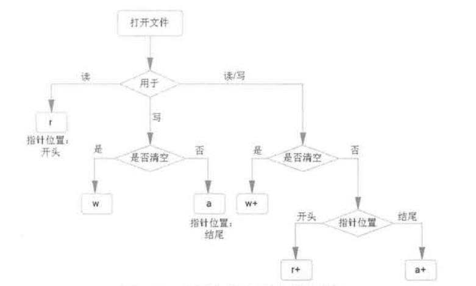
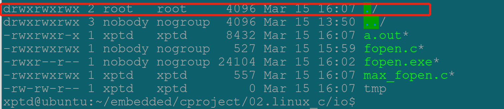
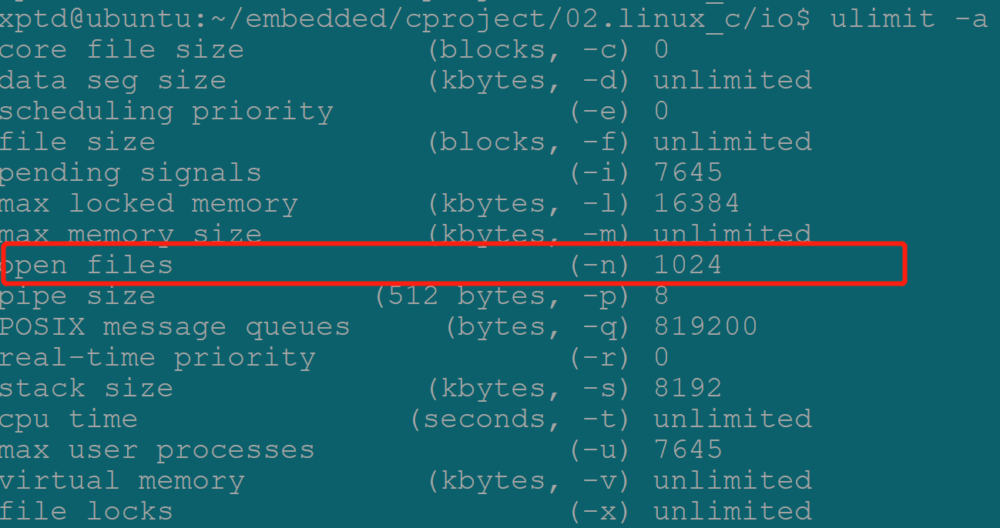
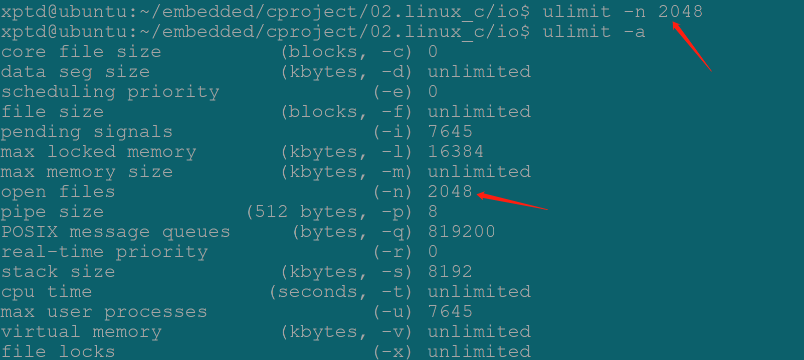
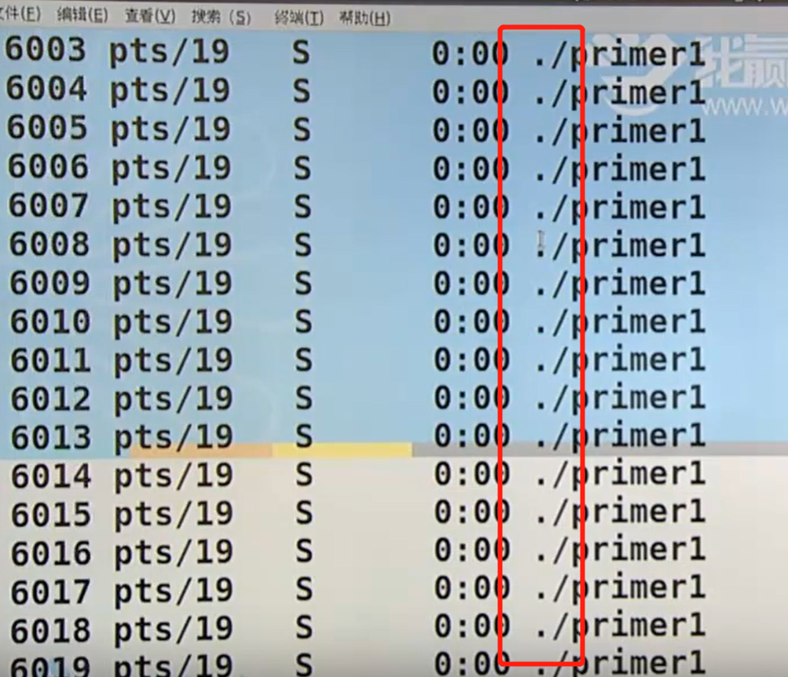
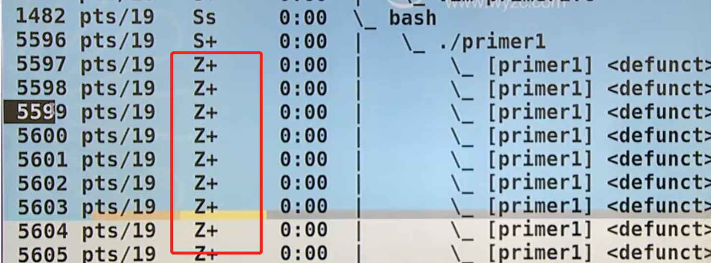

# I/O操作

1. IO操作时一切实现的基础；
2. IO操作分为：
   - sysio:系统调用IO即文件IO；
   - stdio:标准IO;
   - 在两种IO都能实现某个功能的时候**优先使用stdio**;
     - sysio与具体的平台有关；
     - stdio是C抽象出来的IO操作，对平台相关的IO功能进行了封装；
       - 程序员不需要关注底层实现；
       - 标准IO底层依赖系统调用IO，也就是说平台厂商封装了自己的系统IO以支持标准IO；
       - 比如fopen()是一个标准IO操：
         - 在linux 下依赖open();
         - 在windows下依赖openfile();
         - 在两个平台下都可以通过fopen()实现打开文件的功能，但是如果只考虑单个平台的话在Linux下使用open()即可，在windows下使用openfile()即可；
       - 使用stdio增强了代码的可移植性
   - 

## 系统IO

## 标准IO

### 文件类型

1. FILE文件类型贯穿始终：
   - 文件对象结构体

### 文件打开：

1. fopen()：

   - 函数原型：

     ```c
     File* fopen(const char*pathname,const char*mode);
     ```
   
   - 功能：打开指定的文件；
   
   - 参数：
   
     - 指定打开文件的**路径**；
   
       - 一个完整的文件名就是文件的全路径；
   
     - 打开文件的模式；
   
       - 参数只检测模参数字符串的开头：“string beginning with one of the >..”
   
         - 也就是说如果模式参数传入”readwrite“，函数不会报错，因为函数只使用开头的'r'，或者rb、r+等；
   
       - | 字符 | 说明                                                         |
         | ---- | ------------------------------------------------------------ |
         | r    | 只读方式打开文件                                             |
         | w    | 只写方式打开文件，清空文件内容（文件不需要存在）             |
         | a    | 只写方式打开文件，在文件尾追加文件（文件不需要存在）         |
         | r+   | 以可读可写的方式打开文件，从文件头开始                       |
         | a+   | 以可读可写的方式打开文件，从文件尾追加（如果是写），从文件头读 |
         | w+   | 以可读可写的方式打开文件，清空文件（如果文件存在就截去）     |
   
       - 
   
       - **r系列要求必须要有文件存在否则出错返回，a系列、w系列要求文件存在**；
   
         - a、w模式下如果文件不存在，则会自动创建文件，但是并没有接口指定创建文件的权限：
   
           - **默认的权限来自于：0666 &~（umask）**;
   
             - **0664;**
   
             - 在Linux下键入“umask”即可查看umask的数值
   
               - umask的数值越大文件的权限越小；
   
               - ```c
                 xptd@ubuntu:~/embedded/cproject/02.linux_c/io$ umask
                 0002
                 ```
   
             - 
   
           - Linux中文件属性（权限）分为：
   
             - 可读：r(4)
   
             - 可写：w(2)
   
             - 可执行：x(1)
   
             - 无任何权限：-（0）
   
             - 通过chmod指令可以修改文件的属性,默认修改的是当前用户对我文件的权限：
   
               - 在使用时可以指定参数，表明修改权限的范围：
   
                 | 参数 | 说明                 |
                 | ---- | -------------------- |
                 | -u   | 即user，所属用户     |
                 | -g   | 即group，所属组；    |
                 | -o   | 即other,其它用户     |
                 | -a   | 即all,所有用户；     |
                 | -R   | 递归处理（比较常用） |
   
               - chmod
   
           - Linux文件的拥有者（owner）可分为：
   
             - 当前用户：
             - 当前用户所在组：
             - 其它用户；
             - 可以通过chown 命令修改文件的所有者：
               - chown xptd xxx.c;
             - 
   
           - 在命令行下执行ll 命令会列出当前文件夹下面的文件、文件夹等内容的详细信息:
   
             - 第一个字段是文件属性相关信息：
   
               - 第1位表示文件的类型：
   
                 - | 符号 | 说明         |
                   | ---- | ------------ |
                   | -    | 普通文件     |
                   | d    | 目录         |
                   | l    | 符号连接     |
                   | b    | 块设备文件   |
                   | c    | 字符设备文件 |
   
               - 接下来的9位以3位为区分分别表示：
   
                 - 当前用户权限；
                 - 当前用户所在组权限：
                 - 其它用户权限；
   
             - 第二个字段表示文件个数：
   
               - 如果是文件那么这个字段就是1；
               - 如果是文件夹那么表示的就是文件夹中的文件个数；
   
             - 第三个字段：文件的拥有者；
   
             - 第四各字段：文件拥有者所属的组；
   
             - 第5个字段：文件大小：
   
               - 默认情况下文件大小以字节为单位；
               - 空目录一般都是1024个字节；
               - 当然可以在ls 中指定文件大小的单位：
                 - ls -k  即以KB显示；
   
             - 第六个字段：文件最后修改时间；“月-日-年”；
   
             - 第7个字段：文件名；
   
             - 
   
       - 如果是二进制文件在上述的模式下加**“b”**:
   
         - 在windows环境下：区分文本文件和二进制文件，所有在打开文件的时候要添加b参数；
           - 文本文件：
           - 二进制文件：
         - **在POSIX环境下关键参数**“b”**是可以被忽略**：
           - 只有流（stream）的概念，并不区分文本流还是二进制流；
   
     - 两个参数都使用const 进行修饰，即两个参数都是**常量指针**即不会对指针指向的内容（文件路径、mode）做修改；
   
       - 注意**指针常量**(char * const ptr)的区分；
         - 指针的指向不能变；
   
   - 返回值：
   
     - 成功：FILE * 打开文件的指针(文件对象)；
   
       - 返回的FILE文件指针，也就是说在fopen()函数中会malloc一个FILE类型大小的结构体空间，该空间的位置考虑；
   
         - 栈：函数返回的时候，fopen()函数的栈帧空间就会被回收，所以传出去的地址其实是非法的地址，不能保证文件指针的作用域，所以不可能在栈空间；
   
           - ```c
             FILE tmp；
             .....
             retrun &tmp;
             ```
   
         - 静态区：出于上面的考虑，所以在fopen（）函数中以static修饰FILE变量，这样的话即使函数返回了，FILE变量是存在于静态区的不会被马上回收，但是static 修饰的局部变量在内存空间中只有一份，比如调用10次fopen()打开10个文件，但实际上内存中只有1份文件（覆盖形式），这样只能对最后打开一份文件，所以不能放在静态区；
   
           - ```c
             static FILE tmp;
             ....
             return &tmp;
             ```
   
         - **堆**：所以综合考虑fopen（）函数的FILE对象放在堆上是最合适的（所以后面才能执行fclose()即free()）;
   
           - ```c
             FILE *tmp = mallloc(sizeof(FILE));
             ....
             retrun tmp;
             ```
   
           - 一般情况下有成对出现的互逆操作的时候，比如打开、关闭、申请、释放等，这个时候返回的地址空间基本上都是在堆空间上；
   
           - 如果没有互逆操作那么返回的指针指向的地址空间可能在**堆**上、也可能在**静态区**；
   
           - 此处也反映了同时打开的文件数量是有限的（堆空间是有限制的）；
   
             - 一个进程启动的时候默认会打开3个流：
   
               | 文件指针 | 流         | 默认 |
               | -------- | ---------- | ---- |
               | stdin    | 标准输入流 | 键盘 |
               | stdout   | 标准输出流 | 屏幕 |
               | stderr   | 标准错误流 | 屏幕 |
   
             - 这里测试的结果是1021个，实际上一个进程能够最大容纳的应该是1021+3 = 1024个；
   
             - ```c
               #include <stdlib.h>
               #include <stdio.h>
               #include <errno.h>
               #include <string.h>
               int main(int argc, char const *argv[])
               {
               	int count = 0;
               	FILE *fp = NULL;
               	while(1)
               	{
               		fp = fopen("tmp","w+");
               		if(NULL == fp)
               		{
               			perror("fopen:");
               			break;
               		}
               		count++;
               	}
               	printf("max file count:%d\n",count);
               	exit(0);
               	return 0;
               }
               --------------------
               fopen:: Too many open files
               max file count:1021
               ```
   
             - 其实在Linux下键入”ulimit -a“结果中的”open files“字段即指定了最大流（文件数）：
   
               - 
   
             - 同时通过这个命令也可以修改该限制
   
               - 
   
     - 失败：NULL空指针，and errno;
       
       - errno:全局变量：记录当前代码执行的错误；
         
         - 包含头文件<errno.h>
           
         - 如果想通过errno变量获取当前的错误代码，必须要马上处理，因为其它地方也能使用到该全局变量，可能会把上一次的错误码覆盖；
         
         - errno错误代码参考表：/user/include/asm-generic/errno/
         
         - 如果在代码中只时打印一个errno的值其实时没有实际意义的，或者还需要用户对照errno代表查找对应的错误信息；
         
           - 比如如果以r的方式打开一个文件，而该文件本身不存在，所以在fopen（）的时候就会将错误码置为2，对应的就是”no such file or.....“
         
           - ```c
             fprintf(stderr, "fopen err,errno:%d\n",errno);
             fopen err,errno:2
             ```
         
         - 所以在代码中如果需要捕获errno的数值，并且需要输出有意义的错误消息，选择使用**perror()**打印函数；
         
           - 该函数自动关联errno
         
           - 该函数不但可以输出标准的errno对应的错误信息，还可以接收用户自定义的输出消息；
         
           - ```c
             perror("fopen:");
             fopen:: No such file or directory
             ```
         
         - 或者选择使用：char * strrerror(int errnum):
         
           - 包含在<string.h>
         
           - 接收一个errno参数；
         
           - ```c
             fprintf(stderr, "fopen():%s\n", strerror(errno));
             fopen():No such file or directory
             ```
   
   - 说明：
   
     - man 3 fopen();
   
     - 在写代码时如果接收的参数是一个常量，形参中尽量使用const进行修饰；
   
     - 实例1：
   
       - 非常量指针指向一个字符串常量，让后尝试同过修饰指针指向的内容，修改字符串：
   
       - 在Linux下会抛出段错误；
   
       - 但是不一定所有的编译器都会将字符串常量放在“常量区”，所以有可能在某下编译器下会实现更改的效果；
   
       - ```c
         #include <stdio.h>
         
         int main(int argv,const char* argc[])
         {
         	char *ptr = "abc";
         	printf("original str:%s\n",ptr);
         	ptr[0] = 'x';
         	printf("modfied:%s",ptr);
         }
         ```
   
     - 实例2：
   
       - 如下代码，在编译时会报类型不匹配的警告（其实现在就是提醒没有头文件包含），通常会以为是将void* 赋值到int*的时候没有做类型转换导致编译警告，所以在写代码时遇到该警告之后就会：int\*p  = (int \*p)malloc().....
   
         - 这样做其实只是在掩盖问题并没有将问题暴露；
         - 真实的情况是，由于没有<stdib.h>头文件包含，编译器找不到malloc函数原型默认malloc的返回值为int,此时将int类型赋值给int* ，所以才会报类型不匹配
         - 所以在**编程时涉及到的库函数头文件一定要完整包含**；
   
       - ```c
         #include <stdio.h>
         
         int  main()
         {
         	int* p = malloc(sizeof(int));
         	return 0;
         }
         ```
   
   - 

### 文件关闭：

1. fclose();

   - 函数原型：

     - ```c
       int fclose(FILE *stream);
       ```
   
   - 功能：关闭一个已打开的文件；
   
   - 参数：指向一个已经打开的文件指针；
   
   - 返回值：
   
     - 成功：0；
     - 失败：EOF：不一定是-1，所在使用时一定要用宏定义EOF不要使用具体的数值，避免平台差异导致的程序错误；
       - #define EOF -1;
   
   - 说明：
   
     - ```c
       #include <stdlib.h>
       #include <stdio.h>
       #include <errno.h>
       #include <string.h>
       int main(int argc, char const *argv[])
       {
       	FILE *fp = NULL;
       	fp = fopen("tmp","w+");
       	if(NULL == fp)
       	{
       		//fprintf(stderr, "fopen err,errno:%d\n",errno);
       		//perror("fopen:");
       		fprintf(stderr, "fopen():%s\n", strerror(errno));
       		exit(1);
       	}
       	puts("OK");c
       	fclose(fp);
       	exit(0);
       	return 0;
       }
       ```
   
       

### 文件读写：

#### 字符读写

1. 字符读fgetc()：
   
   - 函数原型：
   
     - ```c
       int fgetc(FILE* stream);
       ```
   
   - 参数：
   
     - 指定的文件流
   
   - 返回值：
   
     - 成功：返回字符的int值；
     - 失败：返回EOF;
   
   - 说明：
   
     - 类函数关系：
       - getchar()=getc(stdin)
         - int getchar(void*);
       - getc()=fgetc()
         - int getc(FILE *stream);
       - fgetc():
         - int fgetc(FILE* stream);
       - 最开始的时候getc是宏定义实现的，fgetc是函数实现的：
         - 宏只占用编译时间不占用调用时间（内核的实现为了节约时间多使用次方法）；
         - 函数要占用调用时间；
         - 
   
2. 字符写fputc()：
   
   - 函数原型：
   - 功能：
   - 参数：
   - 返回值：
   - 说明：
     - 类函数关系
       - putchar():=putc(c，stdout)；
         - int putchar(int c);
       - putc():=fputc()
         - int putc(int c, FILE *stream);
       - fputc():=putc();
         - int fputc(int c,FILE *stream)
   
3. 拷贝文件功能实现：

   - 拷贝完成之后可以使用diff 指令（diff src des）查看两个文件的异同

   - 当然可以自己实现一个compare功能；

   - ```c
     #include <stdio.h>
     #include <stdlib.h>
     #include <errno.h>
     #include <string.h>
     
     // my_cp src_path des_path 
     // copy srcfile to despath
     
     int main(int argc, char const *argv[])
     {
     	/* code */
     	// not define char c;
     	int c = EOF;
     
     	FILE *src_file = NULL;
     	FILE *des_file = NULL;
     
     	if (argc < 3)
     	{
     		fprintf(stderr,"useage:%s <srcfile> <desfile>\r\n",argv[0]);
     		goto _err1;
     	}
     	if(NULL == (src_file = fopen(argv[1],"r")))
     	{
     		perror("open srcfile err:");
     		goto _err1;
     	}
     	if(NULL == (des_file = fopen(argv[2],"w")))
     	{
     		perror("open desfile err:");
     		goto _err2;
     	}
     
     	while((c = fgetc(src_file)) != EOF)
     	{
     		fputc(c,des_file);
     	}
     	fclose(des_file);
     	fclose(src_file);
     	exit(0);
     
     _err2:
     	fclose(src_file);
     _err1:
     	exit(1);
     }
     ------ ---------------------
     diff fopen.c cpfopen.c 
     ```
   
4. 实现size功能，输出文件的大小（字节为单位）:

   - 当然计算文件大小的功能使用文件指针的方式会更简单；

   - ```c
     #include <stdio.h>
     #include <errno.h>
     #include <stdlib.h>
     int main(int argc, char const *argv[])
     {
     	FILE *fp = NULL;
     	int ch = EOF;
     	unsigned int count = 0;
     	if(argc < 2)
     	{
     		fprintf(stderr, "Useage:%s file\n",argv[0]);
     		exit(1);
     	}
     	if(NULL == (fp = fopen(argv[1],"r")))
     	{
     		perror("open file err:");
     		exit(1);
     	}
     	while((ch = fgetc(fp)) != EOF)
     		count++;
         fclose(fp);
     	printf("file:%s len:%d bytes;\n", argv[1],count);
     	exit(0);
     }
     
     --------------------------
     xptd@ubuntu:~/embedded/cproject/02.linux_c/io$ ./size.out size.c
     file:size.c len:588 bytes;
     ```

     

5. EOF:

   - 通常的书籍、文档中会说明在读取一个文件时候，以读取到文件结束符结束，实质上是fgetc()等读取函数在失败时即读取不到内容时，返回值时EOF；

#### 字符串读写

1. 字符串读fgets()：

   - 函数原型：

     - ```c
       char * fgets(char *s,int size, FILE* stream)
       ```

   - 功能：

     - 从指定的流中读取size大小个字符返回到s指定buffer；

       - 其实该函数通常也被称为“行读取”函数，即读取文件中一行的内容

         - 行的概念只存在于文本文件中，二进制文件是没有行的概念；

         - 如果一行的大小超出size指定的大小则只读取size-1个字符,函数结束；
           - abcde：size指定为5：函数只读取abcd就返回，末尾添加'\0'；
         - 如果一行的内容小于size指定的个数则读取到‘\n’符号就返回；
           - ab:size指定为5：函数只读取ab\n就返回，末尾添加'\0',所以buffer中的内容是“ab\n\0”;
           - abcd:size指定为5：需要执行两次才能读取完毕；
           - '\n':换行符（10）；
           - '\r':回车符（13）；
           - '\0':字符串的结尾符（0）；

   - 参数：

   - 返回值：

     - 失败：返回NULL;
     - 成功：返回buffer 本身；

   - 说明：

     - 类函数关系：
       - gets():
         -  char *gets(char *s);
           -  **Never use this function**这个函数有BUG，不推荐使用；
           - 不检查buffe溢出；
       - fgets():

2. 字符串写fputs()：

   - 函数原型：
   
     - ```c
       int fputs(const char* s,FILE* stream);
       ```
   
   - 功能：
   
     - **向指定的流中输出字符串s，直到遇到‘\0’为止**;
   
   - 参数：
   
     - 指定的流；
     - 需要输出的字符串；
   
   - 返回值：
   
     - 失败：返回NULL;
     - 成功：返回buffer 本身；
   
   - 说明：
   
     - 类函数关系：
       - puts():
         - int puts(const char *s);现stdout 输出字符串s，直到遇到‘\0’为止；
       - fputs():
   
   - 实现文件拷贝、比较功能：
   
     - ```c
       #include <stdio.h>
       #include <errno.h>
       #include <stdlib.h>
       #include <string.h>
       
       #define BUF_LEN  1024
       
       /*
       	ret:
       		0:ok
       		1:err
       */
       
       int copy_file(FILE *src ,FILE *des)
       {
       	char buf[BUF_LEN];
       
       	if(NULL == src || NULL == des)
       	{
       		printf("%s\n","file err");
       		return 1;
       	}
       	fseek(src,0,SEEK_SET);
       	fseek(des,0,SEEK_SET);
       
       	while(fgets(buf,BUF_LEN,src))
       		fputs(buf,des);
       	return 0;
       }
       
       int compare_file(FILE* src ,FILE* des)
       {
       	char src_buf[BUF_LEN];
       	char des_buf[BUF_LEN];
       	if(NULL == src || NULL == des)
       	{
       		printf("%s\n", "file err ");
       		return 1;
       	}
       	fseek(src,0,SEEK_SET);
       	fseek(des,0,SEEK_SET);
       	if(ftell(src) != ftell(des))
       	{
       		printf("%s\n","compare_file err len diff" );
       		return 1;
       	}
       
       	fseek(src,0,SEEK_SET);
       	fseek(src,0,SEEK_SET);
       	memset(src_buf,0,BUF_LEN);
       	memset(des_buf,0,BUF_LEN);
       	while(fgets(src_buf,BUF_LEN,src))
       	{
       		fgets(des_buf,BUF_LEN,des);
       		if(strcmp(src_buf,des_buf))
       			return 1;
       		memset(src_buf,0,BUF_LEN);
       		memset(des_buf,0,BUF_LEN);
       	}
       	return 0;
       }
       
       int main(int argc, char const *argv[])
       {
       	FILE *fp_src = NULL;
       	FILE *fp_des = NULL;
       	if (argc < 3)
       	{
       		fprintf(stderr, "Usage:%s <srcfile> <desfile>\n",argv[0] );
       		goto _err1;
       	}
       	if(NULL == (fp_src = fopen(argv[1],"r")))
       	{
       		perror("open src err:");
       		goto _err1;
       	}
       	if(NULL == (fp_des = fopen(argv[2],"w+")))
       	{
       		perror("open des err:");
       		goto _err2;
       	}
       	if(!copy_file(fp_src,fp_des))
       	{
       		printf("%s\n","copy file success\r\n" );
       		if(!compare_file(fp_src,fp_des))
       		{
       			printf("%s\n","compare file success\r\n" );
       			fclose(fp_des);
       			fclose(fp_src);
       			exit(0);
       		}
       	}
       	else
       	{
       		printf("copy file failed\r\n");
       		goto _err3;
       	}
       
       _err3:
       	fclose(fp_des);
       _err2:
       	fclose(fp_src);
       _err1:
       	exit(1);
       }
       ```
   
       

#### 二进制数据块读写

1. 数据块读fread()：

   - 函数原型：

     - ```c
       size_t fread(void *ptr,size_t size,size_t nmemb,FILE *stream)
       ```

   - 功能：

     - 从流中读取指定个数的 块数据；

   - 参数：

     - ptr：数据buffer:buferr 长度=size*nmemb（bytes）
     - size：单个数据块的大小；
     - nmemb：数据块的个数；
     - stream：目标流；

   - 返回值：

     - 成功：实际读取的**对象个数（不是字节数）**；
     - 失败：0；

   - 说明:

     - 致命错误：并不会对块地址的起始地址进行校验（对齐检测）；

       - ```c
         fread(buf,1,10,fp)
         ```
         - 读取10个对象，一个对象的大小为1个字节：
   - 假设文件中有足够的数据量，则本次读取返回10---实际读取到字节为10个；
         - 假设文件中数据量不够10个字节（假设有5个），函数返回值为5（实际读取5个对象），实际读取到的字节数为5；
         
       - ```c
         fread(buf,10,1,fp)
         ```

       - 读取1个读写，对象大小为10个字节；
         - 假设文件中有足够的数据量，函数的返回值为1，实际读取到的字节数10；
         - 假设文件中数据量不够10个字节（假设有5个），函数的返回值为0，即一个字节都没有；

       - **所以如果要使用块读取的方式，尽量将其的对象大小设置为1（分参合）**；

2. 数据块写fwrite():

   - 函数原型：
   
     - ```c
       size_t fwrite(const void *ptr,size_t size,size_t nmmeb,FILE *stream)
       ```
   
   - 功能：
   
     - 向流中写入指定个数个数据块；
   
   - 参数：
   
     - ptr:数据buffer;
     - size：单个数据块的大小；
     - nmemb：数据块的个数；
     - stream：目标流；
   
   - 返回值：
   
     - 成功：实际写入的字节数；
     - 失败：0
   
   - 说明：
   
     - 写文件的时候一定要注意写入数据量；

### 文件位置指针

1. fseek()
2. ftell()
3. ()

### printf函数簇

1. printf:

   - 函数原型：

     - ```c
       int prinft(const char* format,...);
       ```

   - 功能：

     - stdout流输出信息；

   - 参数：

   - 返回值：

   - 说明：

2. fprintf:

   - 函数原型：

     - ```c
       int fprintf(FILE* stream, consr char*format,...)
       ```

   - 功能：

     - 指定文件流的printf;

   - 参数：

   - 返回值：

   - 说明：

3. sprinft:

   - 函数原型：

     - ```c
       int sprintf(char* str,const char* format,...);
       ```

   - 功能：

     - 格式化字符串；

   - 参数：

   - 返回值：

   - 说明：

4. snprintf:

   - 函数原型：
   - 功能：
   - 参数：
   - 返回值：
   - 说明

### scanf 函数簇

# 文件系统


# 并发

## 进程

### 进程标识符pid

1. 类型:pid_t;(传统意义上时有符号的16位)；

   - 在不同的机型上实现不同；

2. ps 命令：打印当前系统的进程消息，携带不同的参数可查看到不同的信息：

   - ps -axf:
   - ps -axm:
   - ps ax -L:

3. 进程标识符（进程号）：是顺次向下使用（全部使用完才会再从头开始找可用标识符）

   - 文件描述符是优先使用当前可用集合中**最小的**；

4. 操作方法：

   - 获取当前进程的进程号：

     - 函数原型：

       - ```c
         pid_t get_pid(void);
         ```

     - these function always successful;

     - 包含头文件：

       ```c
       #include <sys/types.h>
       #include <unistd.h>
       ```

       

   - 获取父进程的进程号：

     - ```c
       pid_t getppid(void);
       ```

### 进程的产生

1. fork()函数(叉子)：

   - 函数原型：

     ```c
     pid_t fork(void)
     ```

   - 返回值，执行一次返回两次：

     - 成功：-1
       - pid_t=0；子进程中返回0
       - pid_t=子进程pid号:父进程中返回子进程的pid
     - 失败：返回-1，并且设置errno；

   - 说明：

     - duplicate：通过**复制**发方式创建一个子进程；
       - fork()的成本比较高也体现在这里，子进程要memcp一份父进程，这个开销是相当大的；
     - 父子进程几乎一模一样，连执行到的位置都一样，然后子进程接着从fork()函数的调用处开始执行(即获取pid的时刻)；
       - fork()的返回值不一样；
         - 通过pid的数值区分父子关系；
       - 进程标识符不一样；
       - 同理getppid()也不同；
       - **未决信号、文件锁不继承**；
       - 资源利用量归0；
     - **永远不要猜测父子进程哪个先执行**：
       - 调度器的调度策略来决定哪个进程先执行；

   - 实例1：

     ```c
     #include <stdio.h>
     #include <unistd.h>
     #include <sys/types.h>
     #include <errno.h>
     #include <stdlib.h>
     int main(int argc, char const *argv[])
     {
     	pid_t pid;
         printf("process begin:%d\n", getpid());
         fflush(NULL);
         pid  = fork();
         if (pid < 0)
         {
         	perror("fork err:");
         	exit(1);
         }
         if(pid == 0)
         {
     		printf("child process pid:%d,ppid:%d\n",getpid(),getppid());
         }
         if(pid > 0)
         {
         	//child process
         	printf("parent process pid:%d,child pid :%d\n",getpid(),pid);
         }
     	printf("process end:%d\n", getpid());
        // getchar();
         printf("\n");
     	exit(0);
     }
     
     
     // -------------------
     // process begin:2754
     // parent process pid:2754,child pid :2755
     // process end:2754
     
     // xptd@ubuntu:~/embedded/cproject/02.linux_c/process$ child process pid:2755,ppid:1
     // process end:2755
     
     // -----------------------------------------
     // xptd@ubuntu:~/embedded/cproject/02.linux_c/process$ ./a.out  > ./tmp
     // xptd@ubuntu:~/embedded/cproject/02.linux_c/process$ cat tmp
     // process begin:2757
     // parent process pid:2757,child pid :2758
     
     
     // process end:2757
     // process begin:2757
     // child process pid:2758,ppid:1
     // process end:2758
     
     // --------------------------------------------
     // process begin:2769
     // parent process pid:2769,child pid :2770
     // process end:2769
     
     // child process pid:2770,ppid:1
     // process end:2770
     
     ```

     - 正常情况下终端输出的只能看到一个**begin **打印，这是正常情况可以被理解；
       - 输出到终端是行缓冲模式，所以在begin后面加‘\n’其实起到了刷新的作用；
     - 但是如果将输出重定向到一个文件就会看到**begin**被打印了两次；
       - 输出到文件默认是全缓冲模式，所以即使是在‘\n’也只是被认为是换行符号，所以begin被放到缓冲区，子进程copy了父进程的缓冲区，此时里面有“begin”的内容，所以会输出两次，且两次begin携带的进程号都是父进程的进程号；
     - 在fork()之前fflush(NULL)刷新所有的流之后，再次 将输出重定向到文件begin只打印了一次；
     - <font color = red>**在fork()之前一定要flush()所有的流**，否则程序会产身意想不到的结果；</font>

2. init进程：

   - 是所用进程的**祖先进程**；
   - 进程pid:1(1号进程)；
   - 不能认为是所有进程的**父进程**
     - 在子进程中打印ppid如果在打印之前父进程已经结束了，此时获取到的ppid= 1即init进程；
   - **谁打开，谁关闭，谁申请，谁释放**：
     - 子进程由父进程创建，所有子进程也应该由父进程销毁（回收资源即收尸）；
     - 若父进程没有对子进程进行收尸过程，父进程已经结束（），此时子进程会变成孤儿进程，托孤到init进程，并且此时的子进程状态变为Zombia(僵尸态)，init进程在接收到这些孤儿进程之后对其收尸；
       - 收尸的前提是子进程已经运行结束；
     - 僵尸态：
       - 父进程已经结束，没有对子进程进程收尸，交由init进程，init进程等待子进程执行完毕，然后回收；
         - 
       - 父进程忙没时间进程收尸；
         - 僵尸态应该是一个很短暂的状态；
         - 
       - 僵尸态度，本身占据的当前可执行程序的空间比较少：
         - 但是它占据了一个宝贵的PID资源；

3. 父子进程关系：

   - 实例1：求素数_单机版：

     - 统计结果  ./a.out   | wc -l

     - 显示程序运行时间;time ./a.out 

     - 只显示时间不显示具体结果：time ./a.out  >/dev/null

       - /dev/null 空设备，time无法重定向到该空设备；

     - ```c
       #include <stdio.h>
       #include <stdlib.h>
       #include <errno.h>
       
       #define LEFT 30000000
       #define RIGHT 30000200
       
       int main(int argc, char const *argv[])
       {
       	int i,j,flag;
       	for (i = LEFT; i <= RIGHT;i++)
       	{
       		flag = 1;//primer;
       		for(j = 2; j < i/2;j++)
       		{
       			if(i % j == 0)
       			{
       				flag = 0;// not primer
       				break;
       			}
       		}
       		if(flag)
       			printf("%d is a primer\n", i);
       	}
       
       	exit (0);
       }
       ```

   - 实例2，创建201个子进程，每个进程计算一个数：

     - 消耗时间明显要小于上一个版本：

       - 并发：是正在意义上的多个任务同时执行，并发只存在于多处理器上；

       - 对于单处理器只能做到“并行”，同一时间只能又一个任务在执行；

       - <font color = red>一定要注意子进程完成任务之后退出（exit()）</font>

       - ```c
         #include <stdio.h>
         #include <stdlib.h>
         #include <errno.h>
         
         #include <sys/types.h>
         #include <unistd.h>
         
         #define LEFT 30000000
         #define RIGHT 30000200
         int main(int argc, char const *argv[])
         {
         	int i,j,flag;
         	pid_t pid;
         
         	for (i = LEFT; i <= RIGHT;i++)
         	{
         		fflush(NULL);
         		pid = fork();
         		if(pid < 0)
         		{
         			perror("fork err:");
         			exit(1);
         		}
         		if(pid == 0)
         		{
         			//child process;
         			flag = 1;//primer;
         			for(j = 2; j < i/2;j++)
         			{
         				if(i % j == 0)
         				{
         					flag = 0;// not primer
         					break;
         				}
         			}
         			if(flag)
         				printf("%d is a primer\n", i);
         			exit(0);
         		}
         		
         	}
         
         	exit (0);
         }
         ---------------------------
         
         real    0m0.105s
         user    0m0.000s
         sys     0m0.010s
         ```

4. vfork():

   - 原始的fork()函数在创建子进程的时候，是memcpy一份自己，这样的话开销比较大；
   - 为了解决这个问题就引入了vfork(),即子进程与父进程公用一份数据：
     - vfork()中只能保证某些exec()函数执行是正确的，其它行为未定义：
       - 如果在父进程中打开以恶搞文件fb，通过vfork()创建子进程后，在子进程中修改fb,那在父进程对该文件的修改是会保存吗？
         - 答案是未知；
   - 后来在fork()中就引入了**“写时拷贝技术”**，就淘汰了vfork()的使用：
     - 如果父子进程只对资源有写的操作，那么就共同访问一份资源；
     - 如果进程有对资源进程写操作的需求，那么就将目标资源拷贝到自己的进程空间：
       - 谁写谁拷贝；

### 进程的消亡已经释放资源

1. wait():

   - 函数原型：

     - ```
       pid_t wait(int* status);
       ```

       

   - 功能：

     - wait for process to **change state:**

   - 参数：

     - 输出型参数是，返回子进程的结束状态；
       - 正常结束：
       - 异常结束：

   - 返回值：

     - 失败：-1；
     - 成功：终止的子进程的进程标识符； the porcess id of terminalted chils;

   - 说明：

     - 系统调用：man 2 wait;
     - wait只是等待子进程的状态发生改变：
       - 只能等待子进程的状态，不能等待父进程的状态；
     - 进程的终止：
       - 五条正常终止：
         - main 函数中执行return 语句；
         - 调用exit()函数；
         - 调用\_exit()或者\_Exit()函数；
         - 进程最后一个线程在其启动例程中执行return 语句；
         - 进程的最后一个线程调用pthread_exit()函数；
       - 三条异常终止：
         - 调用abort,它产生SIGABRT信号；
         - 当前进程接收到某些信号；
         - 最后一个线程对“取消”请求做出响应；
     - wait()函数没有指向性即必须要等到所有的子进程结束；
     - wait()函数只能是**“死等”**，阻塞；

   - 示例：

     - ```
       #include <stdio.h>
       #include <stdlib.h>
       #include <errno.h>
       #include <sys/wait.h>
       #include <sys/types.h>
       #include <unistd.h>
       
       #define LEFT 30000000
       #define RIGHT 30000200
       int main(int argc, char const *argv[])
       {
       	int i,j,flag;
       	pid_t pid;
       
       	for (i = LEFT; i <= RIGHT;i++)
       	{
       		fflush(NULL);
       		pid = fork();
       		if(pid < 0)
       		{
       			perror("fork err:");
       			exit(1);
       		}
       		if(pid == 0)
       		{
       			//child process;
       			flag = 1;//primer;
       			for(j = 2; j < i/2;j++)
       			{
       				if(i % j == 0)
       				{
       					flag = 0;// not primer
       					break;
       				}
       			}
       			if(flag)
       				printf("%d is a primer\n", i);
       			exit(0);
       		}
       		
       	}
        for (i = LEFT;i< RIGHT;i++)
        		wait(NULL); //wait
       	exit (0);
       }
       
       ```

2. waitpid():

   - 函数原型：

     - ```c
       pit_t wait_ipd(pid_t pid,int *status，int options);
       ```

   - 功能：

     - wait()函数的增强版本：

   - 参数：

     - 等待子进程的Ppid;
       - < -1：进程组号==abs(pid)进程组中的任何一个子进程的状态；
       - \>0:即某一个子进程；
       - =0:同进程组中的任何一个；
       - =-1：类似wait()；==waitpid(-1,&status,0)
       - 
     - 子进程结束状态：
     - options:
       - WNOHAN:非阻塞，立马返回；

   - 返回值：
   - 说明：
   - 在wait()函数的基础上，增加了指向性，即可以wait()指定进程号的进程结束；

3. waitip():

4. wait3():

5. wait4():

#### 进程分配

1. 如上面求素质的代码，如果所求的数据方位扩大，那么就需要继续扩大创建子进程的数量，但是进程数是有限制的，显然这种方式不太适合；

2. 分块法：

   - 即将目标数据进行分块，比如201个数据就分成3块，分别开辟3个子进程去处理，这样在一定程度上可以解决问题，但是fork()出来的3个子进程负载时 不同的：
     - 第一个子进程的负载相对较大一些：素数在较小的数范围中存在比较多；

3. 交叉分配法：

   - 即开启三个子进程，第一个数给1号子进程，第2个数给2号子进程，第3个数给3号子进程，第4个数给1号子进程，第5个数2号子进程.....；

   - **一般情况下即可以使用块分配、也可以使用交叉分配的时候，选择使用交叉分配**；

   - 但是在求素数的模型一定有一个进程分配的数，都不是素数即负载不均衡：

     - 比如1号进程分配的到数组0、3、6、9.....都是3的倍数，即都不是素数；

   - 示例代码：

     ```c
     #include <stdio.h>
     #include <unistd.h>
     #include <errno.h>
     #include <sys/types.h>
     #include <sys/wait.h>
     #include <stdlib.h>
     #define LEFT 30000000
     #define RIGHT 30000200
     #define N 3
     
     int main(int argc, char const *argv[])
     {
     	 int i,j,mark,n;
     	 pid_t pid;
     	 for(n = 0; n < N;n++)
     	 {
     	 	fflush(NULL);
     	 	pid = fork();
     	 	if(pid < 0)
     	 	{
     	 		perror("fork err:");
     	 		exit(1);
     	 	}
     	 	if(pid == 0)
     	 	{
     	 		//child process
     	 		for(i = LEFT+n;i <=RIGHT;i+=N)
     	 		{
     	 			mark = 1;
     	 			for(j =2;j < i/2;j++)
     	 			{
     	 				if(i % j == 0)
     	 				{
     	 					mark = 0;
     	 					break;
     	 				}
     	 			}
     	 			if(mark)
     	 				printf("[%d] process:%d is primer\n",n,i);
     	 		}
     	 		exit(0);
     	 	}
     	 } 
     
     	 for(i = 0;i < n;i++)
     	 	wait(NULL);
     	exit (0);
     }
     
     -------------------------------------
     [2] process:30000023 is primer
     [1] process:30000001 is primer
     [1] process:30000037 is primer
     [2] process:30000041 is primer
     [1] process:30000049 is primer
     [2] process:30000059 is primer
     [1] process:30000079 is primer
     [2] process:30000071 is primer
     [1] process:30000109 is primer
     [2] process:30000083 is primer
     [2] process:30000137 is primer
     [1] process:30000133 is primer
     [1] process:30000163 is primer
     [2] process:30000149 is primer
     [1] process:30000169 is primer
     [2] process:30000167 is primer
     [1] process:30000193 is primer
     [1] process:30000199 is prime
     ```

     

4. 池类算法：

   - 能者多劳；

   

### exec函数族
### 用户权限及组权限
### 解释器文件
### system()函数
### 进程会计
### 进程时间
### 守护进程
### 系统日志的书写


## 线程

# IPC

# 附

## 参考书目：

1. 《UNIX环境高级编程》APUE；

   - IO:3、5、14
   - 文件系统：4、6、7；
   - 并发：
     - 多进程：信号；10；
     - 多线程：10、11；
   - IPC：进程间通信；
     - 8：进程基础
     - 13：守护进程；
     - 15、16

2. 《UNIX网络编程》UNP；

3. 《TCP/IP详解（卷1）》；

4. 《深入理解计算机系统》；

5. 机制==原理，策略==如何实现；

## 程序员基本素养：
1. 精通两门编程语言；

2. 精通网络编程；

3. 精通一门脚本语言；
4. 系统应用编程的建议：
   - 弃用root用户；
   - 代码重构（编程本身就是一门有缺憾的艺术）；
     - 新的机制解决旧的问题：
       - 很好的解决了旧的问题；
       - 又引入了新的问题（思考、疑问）；
   - 代码量的积累； 
   
## Linux系统常用指令

1. man 指令参数：

   - man 1 cd
   - whatis cd:whatis指令用于查询一个命令执行什么功能；

   | 代码 | 功能                           | 备注 |
   | ---- | ------------------------------ | ---- |
   | 1    | 标准用户指令（std）            |      |
   | 2    | 系统调用（system calls）       |      |
   | 3    | 库调用                         |      |
   | 4    | 特殊文件（设备文件）的访问入口 |      |
   | 5    | 文件格式（配置文件的语法）     |      |
   | 6    | 游戏                           |      |
   | 7    | 杂项:对于开发比较重要讲机制；  |      |
   | 8    | 管理命令                       |      |
   | 9    | 跟kernel 有关的文件            |      |

2. ps指令：

3. wc 指令：

4. time指令：

5. /dev/null:

6. find命令：

   - 功能：
     - 在目录结构中搜索文件，并执行指定操作即在文件树种查找文件、并作出相应的处理：
   - 命令格式：
     - find pathnam -options [-print -exec -ok.....]；
       -  即查找的路径
       - 查找的选项（筛选条件）
       - 找到之后要执行的操作；
       - 
   - 常用参数：
     - 
   - 常用方式：
     - 按照名称查找：
       - -name：按照文件名进行查找，区分大小写：
         - find ./ -name xptd:查找当前目录下名称为xptd的文件  ；
       - -iname：按照文件名进行查找，不区分大小写；
     - 按时间查找：
     - 按文件归属查找：
     - 文件名中有通配符
       - "*":通配任意的字符，任意数量：find ./ -name “xptd\*”
       - "?":匹配任意单个字符：find ./ -name “xptd？”
       - "[]":表示通配[]中任意一个字符：find ./ -name “xptd[123]”:
         - []中的会被拆解为单个字符，所以匹配到的应该是xptd1\xptd2\xptd3;
       - find ./ -name xptd:查找当前目录下名称为xptd的文件
     - 按照文件类型进行查找：
       - find . -type d:目录
       - find . -type c:

7. grep命令：

   - 功能：文件查找：用于查找文件里符合条件的字符串；
     - 如果发现某文件的内容符合指定的范本样式，预设gre指令会把含有范本样式的那一列显示出来；
   - 命令格式：
     - grep [option ] pattern [FILE]
     - grep [options] [-e pattern|-f FILE] [FILE]
       - options:
         - -c:只输出匹配 行的计数；
         - -i:不区分大小写；
         - -n：显示匹配行及行号；
         - -v:显示不包含匹配文本的所有行
         - -r:递归查找；
         - 
   - 实例：
     - 