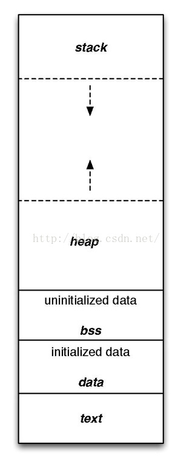

# Makefile

1. 源文件到可执行文件大概要经历：

   - 有时会将预编译归到编译，两者统称为编译阶段：编译的主要惹任务是读取源文件的程序（字符流），对其进行语义解释、语法检查然后将高级语言指令转换为功能汇编代码

   - 预编译：

     - 宏定义处理；
     - 头文件引用；
     - 条件编译处理；
     - 特殊符号处理（替代）；

   - 编译：

     - 对“替换”之后的源文件进行语法、语义检查，确认所有的指令都符合语法规则之后将其翻译成等价的中间代码或者汇编代码；

   - 汇编：其实汇编阶段生成的目标文件是“可重定位文件”，这种文件不能单独执行；

     - 将汇编语言代码翻译成目标机器指令的过程，这个阶段生成目标文件；
     - 目标文件中所存放的也就是与源程序等效的目标的机器语言代码；
     - 目标文件由段组成，通常包含段：
       - 代码段：又称文本段，存储可执行文件的指令，也有可能包含一些只读的常量，例如字符串常量等。
         - .text：
         - .rodata:常量区，并不是所有的常量都存储在该段
           - 有些立即数与指令编译在一起直接放在代码段；
           - 对于字符创常量，编译器会去掉重复符常量，让程序的每个字符串常量只有一份；
           - **用数组形式初始化字符串常量是没有放入常量区的**；
           - **用const修饰的全局变量是放入到常量区的，但是const修饰的局部变量只是设置为只读其它防止修改的效果其实并没有放入到常量区**;
       - 数据段：
         - .data段：已初始化的全局变量、静态变量；
         - .bss段：未初始化的全局变量、静态变量，初始化时会清空；
       - 堆栈段：
         - 堆（向上生长）：malloc内存分配
         - 栈（向下生长）：函数栈帧、局部变量、函数形参等；

         
     - 目标文件分类：
       - 可重定位文件：
         - 包含有适合于其它目标文件链接来创建一个可执行的或共享的目标文件的代码和数据；
       - 共享的目标文件：这种文件存放了适合于在两种上下文里链接的代码和数据；
         - 链接程序可把它与其它可重定位文件及共享文件一起处理来创建另一个目标文件；
         - 动态链接程序将它与另一个可执行文件及其它的共享目标文件结合到一起，创建一个进程映像
       - 可执行文件：
         - 包含了一个可以被操作系统创建一个进程来执行的文件；

   - 链接：

     - 由汇编阶段生成"目标文件"并不能单独执行，需要经过链接阶段，链接的主要工作就是将有关的目标文件彼此链接在一起，即将在一个文件中引用的符号同该符号在另外一个文件中的定义链接起来，使的所有的这些目标文件成一个能够被操作系统装入执行的统一整体；
     - 根据库函数的链接方式的不同，链接处理可以分为两类：
       - 动态链接：
         - 函数的代码被放到称作是动态链接库或者共享对象的某个目标文件中，链接程序此时所做的动作只是在最终的可执行程序中记录下共享读写的名字以及其它少量的必要信息；
         - 在执行可执行程序时，，动态链接库的全部内容将被映射到运行时相应进程的虚拟地址空间；
         - 最终生成的可执行文件短小
       - 静态链接：
         - 函数的代码将从其所在的静态链接库中被拷贝到最终的可执行程序中，该程序被执行时这些代码将被装入到进程的虚拟空间地址中；

   - 对应的gcc命令流程：

     - | 阶段        | 文件格式转换      | 指令   |
       | ----------- | ----------------- | ------ |
       | 预编译(cpp) | \*.c-->\*.i       | gcc -E |
       | 编译(cc)    | *.i-->\*.s        | gcc -S |
       | 汇编(as)    | \*.s-->\*.o       | gcc -c |
       | 链接(ld)    | \*.o-->可执行程序 | gcc    |

     - 默认的使用gcc 指令不带编译参数，将会进预编译、编译、汇编、链接；

2. makefile文件中定义了一系列规则来指定哪些文件需要先编译，哪些文件需要后编译，哪些文件需要编译，哪些文件需要重新编译等等，只要一个make命令整个工程就会进行“自动化编译”

   - 以make、makefile的形式管理工程并不是unix系统的特有方式，只是在Windows下该方式被“封装”了；

   - make是一个命令工具，是一个解释makefile中指令的命令工具；

   - make命令执行时需要一个makefile文件以指导make工具的运行：

     - GNUmakefile
     - Makefile：
     - makefile:
     - 或者make -f 或者 --f 指定一个文件

   - **#符号的使用**：

     - 在Makefile中#号是注释语句的符号，

     - 必须要明确注释是#之后的东西，如果要加注释最好不要和makefile 语句放在同一行

       - 如果写在同一行，请在语句结束之后理解写#注释

     - 如下所示，由于注释语句与makefile 语句之间有空格，其打印结果并不是所期望的

       - ```makefile
         dir := /opt/arm                     #dir
         file := $(dir)/file
         all:
         	@echo $(file)
         ------------------------
         /opt/arm /file
         ```

3. make的执行流程：在默认方式下键入make 指令

   1. make会在**当前目录** 下找命名为**Makefile**或者**makefile**的文件；
      - 默认情况下优先找**makefile**文件；
      - 不识别全大写的形式“MAKEFILE”
   2. 如果找到，它会找文件中第一个目标文件，并把这个文件作为最终的目标文件；
   3. 如果目标文件不存在（没有生成），或者目标文件的依赖文件中有修改时间要比目标文件新，那么make就会执行后面所定义 的命令来生成目标文件；
   4. 如果目标的依赖文件是其它目标，则依次执行第3步，直到所有的目标文件都生成，make会一层嵌套一层的寻址文件的依赖关系，直到最终编译出第一个目标文件（最终目标文件）；
      - 在寻找过程中出现错误，比如依赖文件找不到，make直接退出，并报错；
      - 对于定义的命令错误，或是编译不成功，make 不会理会；
      - **make只关注文件的依赖性**；
   5. 在键入make命令时可以指定其参数作为目标“make clean”,clean 即目标；
   6. 

4. makefile中的单位是**规则**，一个规则包含三个部分：

   - 规则的书写形式：

     - ```makefile
       target ... : prerequisites .....
       	command
       	......
       ```

   - 目标(target)：目标文件：

     - objectfile：
     - 可执行文件：
     - 标签Label:

   - 依赖(prerequisites）：

     - 生成目标文件所需要的文件或者目标；

   - 命令(command):

     - make需要执行的命令（任意的shell命令）；

   - prerequisites中有一个以上文件比target文件新的话，command所定义的命令就要被执行；

   - 示例：

     - \\反斜杠可以起到“续行符”的作用：

     - ```makefile
       edit : main.o kbd.o command.o dispaly.o \
       insert.o search.o files.o utils.o
       	cc -o edit main.o kbd.o command.o display.o \
       insert.o search.o files.o utils.o
       main.o : main.c defs.h
       	cc -c main.c
       kbd.o : kbd.c defs.h command.h
       	cc -c kbd.c
       command.o : command.c command.h defs.h
       	cc -c command.c
       display.o : display.c defs.h buffer.h
       	cc -c display.c
       files.o : files.c defs.h buffer.h command.h
       	cc -c files.c
       insert.o : insert.c defs.h buffer.h
       	cc -c insert.c
       search.o : search.c defs.h buffer.h
       	cc -c search.c
       utils.o : utils.c defs.h
       	cc -c utils.c
       clean:
       	rm -rf edit main.o kbd.o command.o display.o\
       	display.o insert.o search.o utils.o
       
       ```

5. 变量：

   - makefile中的变量都是：全局变量：，在文件中可以随意访问：
     - “”自动化变量除外“；

   - 在上面的示例中 edit依赖的*.o 文件由8个，在依赖关系中需要写一遍，在命令中还需要写一遍，如果增加或者减少一个.o文件就可能需要改动多处，所以出错的概率就比较大，故定义一个变量作为依赖文件的集合，需要修改时只需要对变量进行修改即可；

   - makfile中的变量有点类似于“宏定义”；

   - 变量命名：

     - 数字、字母、下划线（可以使用数字开头，这一点是与C等不同的）
     - 变量大小写敏感，命名是要注意（目前也就见VHDL大小写不区分）；

   - 变量在声明时需要给予初始值；

     - 在初始化变量的时候可以使用其变量作为该变量的“右值”：

     - 变量的赋值符号有三种

       - **=**=左侧是变量，右侧是变量的初始值，右侧的变量的值可以定义在文件的任何一处，也就是说，右侧变量**不一定非要是已经定义号的值（已经明确的值）**，也可以在使用后面定义的值:

         - 这种赋值方式可能会使make陷入到无限递归，所以尽量不使用该方式

         - 示例：

           ```makefile
           foo = $(bar)
           bar = $(ugh)
           ugh = Huh?
           all:
           	echo $(foo)
           ------------------------
           echo Huh?
           Huh?
           ```

           

       - **":="**前面的变量不能使用后面的变量，只能使用前面的已经定义好的变量（即在使用到该变量的值的时候，值是确定的）

         - 如果使用到的变量没确定的变量值，make 也不会报错；

         - ```makefile
           y := $(x)
           # x := bar
           # all:
           # 	@echo $(y) $(x)
           # --------------
           # bar
           ```

       - **？=**赋值

         - 如果变量在之前已经定义了，则此处的变量不进行任何操作，如果之前没有赋值，则进行赋值（声明+初始化）；

         - ```makefile
           
           foo := bar
           foo ?= xptd
           
           all:
           	@echo $(foo) 
           --------------------
           bar
           ```

           

   - 在使用时需要在变量名前加**$符号**，表示**"解引"**,最好使用（）或{}将变量括起来;

     - 这里$符号充当了“转义的作用”所以在真正需要使用$符号的地方需要使用$$;
     - 变量会在使用它的地方精确的展开，就想C语言中的宏定义一样；

   - 实例

     - ```makefile
       objects = main.o kbd.o command.o display.o\
       insert.o search.o files.o utils.o
       
       edit : $(objects)
       	cc -o edit $(objects)
       main.o : main.c defs.h
       	cc -c main.c
       kbd.o : kbd.c defs.h command.h
       	cc -c kbd.c
       command.o : command.c command.h defs.h
       	cc -c command.c
       display.o : display.c defs.h buffer.h
       	cc -c display.c
       files.o : files.c defs.h buffer.h command.h
       	cc -c files.c
       insert.o : insert.c defs.h buffer.h
       	cc -c insert.c
       search.o : search.c defs.h buffer.h
       	cc -c search.c
       utils.o : utils.c defs.h
       	cc -c utils.c
       clean:
       	rm -rf edit $(objects)
       
       
       ```

   - 变量高级用法：

     - **变量值替换**：替换变量中共有的部分

       - $(var :a=b)或者${var:a=b}:把变量var中以字符串“a”结尾的“a”替换成结尾的“b”字符串；

         - 结尾：空格或是结束符号；

         - 将$（foo）中所有已.o字符串结尾全部替换成.c

         - ```makefile
           foo := a.o b.o c.o
           boo := ${foo:.o=.c}
           all:
           	@echo $(foo) $(boo)
           -----------------------
           a.o b.o c.o a.c b.c c.c
           ```

       - “静态模式”的变量替换：

         - 静态模式的变量替换依赖被替换的字串中有相同的**模式**，模式中必须包含一个“%”字符

         - ```makefile
           foo := a.o b.o c.o
           bar :=${foo:%.o=%.c}
           all:
           	@echo $(foo) $(bar)
           ---------------
           a.o b.o c.o a.c b.c c.c
           ```

           

     - 把变量的值再当成变量：

       - 常规的变量嵌套

         - ```makefile
           x = y
           y = z
           z = u
           a:=$($(x))
           all:
           	@echo $(a)
           ```

           

       - **使用多个变量来组成一个变量的名称，再取其值**；

   - 系统变量：

     - MAKELEVEL:如果make有一个嵌套执行的动作（make调用另外一个Makefile），那么这个歌变量就会记录当前Makefile的调用层数；顶层为0；

   - 追加变量值：

     - 使用“+=”操作符号给变量追加值；
     - 如果操作的变量之前那没有定义，“+=”操作符自动转换为“=”

   - 环境变量：

     - make 运行时的系统环境变量可以在make开始运行时被装入到Makefile文件中，但是如果Makefile中一定定义了这个变量，或者这个变量时由make命令行带入，那么系统的环境变量的值将被覆盖；
       - Makefile 指定-e参数，将会使得系统环境变量的值覆盖makefile的值；
       - 当makeq嵌套调用时，上层Makefile中定义的变量会以系统环境变量的方式传递到下层的makefile中：
         - 用export关键字声明；
         - 当然通过命令行设置的变量也会被传递到下一级；

   - 目标变量：

   - 自动化变量：

     - $@:表示规则中的目标文件集合；
     - $%

# shell编程

# 注意点

1. 使用function 关键字定义函数时报错“Syntax error: "(" unexpected”；

   - 脚本的起始改成“#!/bin/bash” 不用使用“#!/bin/sh”

2. shell 子函数中$1 等并不表示shell 脚本接收到的第一个参数，而是函数调用时传进来的第一个参数；

3. ${ROOT_DIR##*/} ：去掉变量里面的路径：

   - ```c
     ROOT_DIR=/home/xptd/embedded/samsun_4412/u-boot
     CUR_DIR=u-boot
     ```

     

