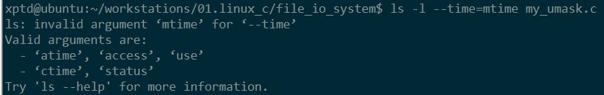

# 文件IO

1. 本章节描述的文件IO是Linux系统下的文件相关**系统调用**，即不带缓冲的IO（unbuffered io）;
   - 每个read、write操作都是调用内核中的一个系统调用；
   - 不带缓冲的io操作不是标准C库函数操作接口（标准库函数是在系统调用上做了对应的封装），是POSIX的内容；
2. 文件类型：
   - 文件文件：
   - 二进制文件：
   - **对于UNIX系统内核而言，文本文件和二进制文件并无区别；**

## 文件描述符

1. 文件描述符是一个**非负整数**；
   - 文件描述符的变化范围是0~OPEN_MAX:
     - OPEN_MAX:规定了最大打开文件数；（似乎已经已经不再使用）
     - ulimit -a 可以查看当前允许的同时打开的文件的个数；
     - ulimit -n xxx 可以修改当前允许的同时打开的文件的个数；
     - 
2. 当打开一个现有文件或创建一个新文件时，内核向进程返回一个文件描述符，表示当前打开、创建的文件；
3. 对文件进行读、写等操作时需要一个文件描述符指定操作目标文件；
4. 特殊描述符：
   - 0:stdin
   - 1:stdout
   - 2:stderr
   - 但是这个些并不是UNIX内核的规定，只是应用程序的使用**惯例**，所以在编写应用程序中最好不要使用0、1、2这些的魔鬼数字（幻数）表示文件流
   - 在unistd.h头文件中：
     - STDIN_FILENO:标准输入流
     - STDOUT_FILENO:标准输出流
     - STDERR_FILENO:标准错误流；
   - 
5. 

## 打开、创建文件

1. open函数

   - 函数原型：

     - ```c
       #include <fcntl.h>
       int open(const char *file_path,int mode，...)
       ```

   - 函数功能：

     - 以指定的模式打开指定文件

   - 函数参数：

     - 打开、创建文件路径（pathname）：

       - 绝对路径
       - 相对路径
       - 文件名和路径名截短：
         - NAME_MAX

     - 打开模式：

       - 虽然打开模式的参数是一个整数型变变量，但是考虑到程序的兼容性尽量在代码中使用用头文件中定义的模式常量表示，可以组合(<fcntl.h>)：

       - O_RDONLY：通常定义为0

       - O_WRONLY：通常定义为1

       - ORDWR：通常定义为2；

         

         - | 符号       | 说明                                                         |
           | ---------- | ------------------------------------------------------------ |
           | O_APPEND   | 功能与标准IO中a选项一致                                      |
           | O_CREATE   | 如果文件不存在，创建文件，同时需要指定第三个参数，指定新文件的访问权限； |
           | O_EXCL     | 如果同时指定了O_CREATE,，而文件已经存在，则会出错，用此可以测试一个文件是否存在，如果不存在则创建文件，**使得测试和创建文件两者称为一个原子操作** |
           | O_TRUNC    | 如果文件存在，而且为只写或者读写模式打卡免责将其长度截为0，相当于标准IO中的W，W+参数 |
           | O_NOCTTY   | 与终端设备相关                                               |
           | O_NONBLOCK | 设置非阻塞模式                                               |
           | O_DSYNC    | 使每次write操作等待物理IO操作完成，但是如果写操作不影响读取刚写入的数据，则不等待文件属性被更新 |
           | O_RSYNC    | read操作等待，直至任何对文件同一部分进行的未决写操作完成     |
           | O_SYNC     | 使每次write都等到物理IO操作完成，包括write引起的文件属性更新所需要的IO操作 |

         

   - 返回值：

     - 成功：返回文件描述符（非负整数）；
       - **总是返回最小的未用描述符数值**
         - 这一点可以用来重定位stdin\stdout等，比如一个应用程序可以先关闭标准输出（通常文件描述符1），然后打开另一个文件，执行打开操作前就能了解到该文件一定会在文件描述符1上打开----可以使用但是不安全，通常这类的功能由**dup2函数实现**（在一个给定的描述符上打开一个文件）；
       - 
     - 失败：返回-1

   - 说明：

2. create函数：

   - 函数原型：

     - ```
       #include <fcntl.h>
       int create(const char *pathname,mode_t mode);
       ```

       

   - 函数功能：

     - ```c
       open(const char* pathname,OWRONLY|O_CREATE|O_TRUNC,mode)
       ```

       

   - 函数参数：

   - 返回值：

     - 成功:返回为只写打开的文件描述符
     - 失败：-1

   - 说明：

     - 早期的Unix系统无法打开一个不存在的文件，所以才有create函数的存在；

       

​      

## 关闭文件

1. close函数

   - 函数原型

     - ```c
       #include <fcntl.h>
       int close(int fd);
       ```

   - 功能

     - 关闭一个打开文件

   - 参数

     - 文件描述符

   - 返回值

     - 成功：0
     - 失败：-1

   - 说明

     - 当一个进程终止时，内核自动关闭所有已经打开的文件；

## 读文件

1. read函数

   - 函数原型

     - ```c
       #include <unistd.h>
       ssize_t read(int fd,void *buf,size_t nbytes);
       ```

   - 功能:

     - 

   - 参数

     - 文件描述符
     - 接收buffe地址
     - 期望读取字节数：
       - 原始的系统设计中该值是一个不带符号的整数，一次最多65535个字节
       - SSIZE_MAX

   - 返回值

     - 失败：-1
     - 成功：返回实际读取到的**字节数****，若已经读取到文件为则返回0；**
     - 

   - 说明：

     - 实际读取到的字节数少于期望读取到的字节数的情况：
       - 读取普通文件时，在读到要求字节数之前已到达文件尾端；
       - 当从终端设备读取时，通常是一次最多读取一行；
       - 当从网络中读取时，网络中的缓冲机构可能造成返回值小于所要求读的字节数；
       - 当从管道或FIFO读取时，如若管道包含的字节少于所需的数量
       - 当从某些面向**记录**的设备读取时，一次最多返回一个记录（磁带）；
       - **当某一个信号造成的中断，而已经读了部分数据量是，**

2. 

## 写文件

1. write函数

   - 函数原型：

     - ```c
       #include <unistd.h>
       ssize_t write(int fd,const void*buf,size_t nbytes);
       ```

   - 功能

     - 

   - 参数

     - 文件描述符；
     - 数据buf地址；
     - 写入数据量；

   - 返回值:

     - 错误：-1
     - 成功：返回已写入的字节数；

   - 说明：

     - 在一次成功写之后，该文件偏离量增加实际写入的字节；
     - write出错的一个常见原因是磁盘已写满，或者写操作超过了一个给定进程的文件长度限制；
       - **文件长度限制：**

   - 示例：

     - ```c
       ##include <stdio.h>
       #include <unistd.h>
       #include <fcntl.h>
       #include <sys/stat.h>
       #include <sys/types.h>
       #include <stdlib.h>
       
       #define BUF_SIZE 512
       
       int main(int argc, char const *argv[])
       {
       	int size = -1;
       	char buffer[BUF_SIZE]; 
       	while((size = read(STDIN_FILENO,buffer,BUF_SIZE)) > 0)
       		if((size = write(STDOUT_FILENO,buffer,size) != size))
       			perror("write err:");
       
       	if (size < 0)
           	perror("read err:");
           exit(0);
       }
       
       ---------------------
       xptd@ubuntu:~/workstations/01.linux_c/file_io_system$ ls
       file_io_1  file_io_1.c
       xptd@ubuntu:~/workstations/01.linux_c/file_io_system$ ./file_io_1
       xptd
       xptd
       abcde1234
       abcde1234
       ^C
       ```

       

## 其它操作

### 文件指针定位

0. 每个打开的文件都有一个与之关联的“当前文件偏移量”：
   - 非负数
   - 用户度量从文件开始处计算的**字节数**
   - 系统默认情况下打开的文件是定位在问题头的即文件偏移量为0；

1. lseek函数：

   - 函数原型：

     - ```
       #include <unistd.h>
       int lseek(int fd,off_t offset, int whence)
       ```

   - 功能：

     - 文件指针定位:显示的为一个打开的文件设置其便偏移量；

       

   - 参数：

     - fd:文件描述符

     - 文件指针偏移量

     - 相对偏移位置：

       - | 符号     | 内容                        |
         | -------- | --------------------------- |
         | SEEK_SET | 相对于文件头（int 0）       |
         | SEEK_CUR | 相对于当前文件位置（int 1） |
         | SEEK_END | 相对于文件尾（int 2）       |

       

   - 返回值

     - 成功：**返回新的文件偏移量**
     - 错误：返回-1

   - 说明：

     - 如果fd(文件描述符)是指向了一个FIFO或者是网络套接字，lseek返回-1，并将error设置为ESPIPE;
     - 文件偏移量可以大于原始文件长度：这种情况下，对该文件的下一个写将加长该文件，并在文件中构成一个**空洞**，（位于文件中但是没有写过的字节都被都被读为0）
       - 文件空洞并不要求在磁盘上占用存储区，具体的处理方式与文件系统的实现有关
       - 当定位到超出文件尾端之后写时，对于新写的数据需要分配磁盘；
         - 对于源文件尾端和新开始的写位置之间的部分不需要分配磁盘块；


### 文件共享

1. 这里的共享指的是两个文件指针（进程中的文件描述符表项）指向同一个文件表项；

   - UNIX系统支持在不同进程间共享打开的文件；

2. 与文件相关的三个数据结构

   - 进程：每个进程都有一个记录当前进程的“进程控制块（PCB）数据结构”，在进程控制块中记录了当前进程所有已经打开的文件（可以视为一张表，就称为**文件描述符表**），每个文件描述符占用一项，与每个文件描述符相关的：

     - **文件描述符标志**
       - 作用域只在一个进程的一个描述符
     - 指向一个**文件表项**的指针
       - 每个进程独立拥有对于打开文件的文件表项：使得每个进程都有它自己对该文件的当前状态、当前偏移量；

   - 内核：内核为所有打开的文件维护一张文件表，每个文件表项包括

     - 文件状态（读、写等）；
       - 适用于指向该给定文件表项的任何进程中的所有描述符（文件共享时会出现多个进行的描述符指向了同一个文件表项）；
     - 当前文件偏移量；
     - 指向该文件**v结点表项的指针**

   - 文件：每个打开的文件（设备）都有一个v结点，包含了：

     - 一个打开的文件只对应一个V结点，V结点与具体的文件系统无关；

     - 文件类型
     - 对该文件进行各种操作的函数指针
     - i结点指针；
       - i结点与具体的文件系统相关
       - 包含了文件的所有者，文件长度，文件所设备。指向文件时间数据块在磁盘上所造位置的指针等；
     - V结点的存在是为**多文件系统**存在的需求，即对不同的 文件系统做了上一层的封装，V结点中的I结点项再关联具体的文件系统；
     - **Linux不存在V结点**
       - 使用了一个独立于文件系统的i结点和依赖于文件系统的i结点；

   - 

3. 两个独立的进程打开同一个文件的情况：

   - 假设两个进程打开了同一个文件，A进程使用文件描述符3，B进程使用文件描述符4，
   - 打开该文件的每个进程都得到了一个文件表项，但是对于文件来说，只存在一个V结点数据结构
   - 在完成每个write操作之后，文件表项中的当前文件偏移量即增加的所写的字节数，如果当前文件偏移量超过了当前文件长度，则在i结点表项中的当前的文件长度被设置当前文件偏移量（无论是哪个进程写操作）；
     - 如果使用O_APPEND方式打开文件，则相应的标志也被设置到文件表项的文件状态标识，每次对这种具有添加写标志的文件执行写操作时，在文件表项中的当前文件偏移量首先被设置为i结点表项中的文件长度 ，**保证每次写的数据都是添加到文件的尾部**
     - 若一个文件用lseek()定位到文件当前的尾端，则文件表项中的当前文件偏移量被设置成为i结点表项中的当前文件长度；
   - 

#### 文件共享概念

#### 原子操作

1. 对文件进行写操作情景：

   - 在一个文件的文件尾部添加指定内容，早起的UNIX系统并不支持O_APPEND选项，所以实际的写内容代码大概是:

     - ```c
       if（lseek(fd,0,SEEK_END) <）
       	perror("lseek erro:");
        if((size = write(fd,buf,buf_size)!= buf_size)
        	perror("write err");
       ```

     - 即先定位到文件末尾，再向文件尾部追加内容

     - 对于单进程的程序，这样写文件没有问题，但是对于多进程这样的操作就可能会出问题（多个进程都对该文件进行写操作）；

   - 假设有A、B两个独立的进程，都对同一个文件进行写操作，每个进程都打开了该文件（未使用O_APPEND标志），此时每个进程都有自己的文件描述读标识指向各自进程的文件表项，而两个文件表项中的V结点指针都指向同一个V结点数据结构（当然，V结点中的i结点指针指向了同一个I结点数据结构）

   - 假设A进程调用lseek(),将当前文件偏移量（文件表项）设置为1500字节（当前文件的文件尾），

   - 内核切换进程使B进程运行，进程B调用lseek()函数，将当前文件的偏移量设置为1500（文件尾）

   - B进程调用write()函数，从1500处写入1000bytes,同时当前文件偏移量移动到了1600处（只是记录在了B进程的文件描述符指向的文件表项的当前文件偏移量处），

   - 因为文件长度已经更新，所以内核对V结点中的当前文件长度进行了更新（更新了1600）；

   - 内核调度A进程继续运行，A调用write函数进行写操作，此时写的位置是上一次调度时定位到的1500处，所以，此时A进程写的内容会覆盖掉B进程写的内容；

     - <font color = red>如果是打开文件时使用的是O_APPEND选项，在执行写操作的时候会根据当前文件长度，重新定位文件偏移量</font>

2. 此情景下两个进程写文件出错的关键再于<font color =red>先lseek定位再write执行写操作</font>

   - 使用了两个分开的函数调用，**任何一个需要在多个函数调用的操作都不可能是原子操作**，因为在在函数调用之间内核可能会临时挂起该进程

   - 解决该问题的方法就是使**在文件末尾写文件成为一个原子操作（目的向导）**，

   - ****

     **UNIX**系统提供了打开文件时指定O_APPEND选项使得“lseek+write”“操作成为原子操作，即内核每次都这种文件进行写之前，都将进程的当前文件偏移量设置到该文件的末尾处（读取当前文件长度）

3. pread&pwrite

   - 将文件定位与文件IO操作封装成原子操作

   - 函数原型

     - ```c
       #include <unistd.h>
       size_t pread(int fd ,void* buf,size_t nbytes,off_t offset)
       ```

       - 返回值：
         - 成功：实际读取的字节数
         - 0：文件末尾
         - 失败：-1
           - 还要判断信号打断的情况
       - 相当于调用lseek+read,无法中断定位和读操作

   - 函数原型

     - ```c
       size_t pwrite(int fdm void *buf, size_t nbytes,off_t offset);
       ```

       - 返回值：
         - 成功：返回实际写入的字节数
         - 失败：-1

4. 一般而言，原子操作（atomic operation）指的是由多步组成的操作，如果该操作原子的执行，则要么一次性执行完所有的操作，要么一步也不执行，不可能只执行所有步骤的一个子集；

#### dup&dup2函数

1. 复制一个现存的文件描述符（两个文件描述符指向同一个打开的文件）即dup,dup2函数返回新文件描述符与原文描述符<font color =red>共享</font>一个文件表项

   

2. dup

   - 函数原型

     - ```c
       #include <unistd.h>
       int dup(int fd)
       ```

   - 功能

     - 

   - 参数

     - 需要复制（重定位）的文件描述符

   - 返回值

     - 成功：新的文件描述符
     - 失败：-1

   - 说明

     - dup函数返回的一定是当前可用文件描述符中的最小值；

3. dup2

   - 函数原型

     - ```c
       #include <unistd.h>
       int dup2(int fd ,int fd2)
       ```

       

   - 功能

   - 参数

     - fd:原文件描述符（待复制文件描述符）；
     - fd2:目标文件描述符

   - 返回值

     - 成功:返回新的文件描述符
     - 失败;-1

   - 说明

     - 如果fd2已经打开，则先将其关闭
     - 如果fd == fd2，则dup2返回fd2,而不关闭文件

4. fcntl函数与dup、dup2函数有同样的效果:

   - dup(filedes)等效于fcntl(filedes,F_DUPFD,0)
   - dup2(filedes,filedes2):等效于
     - close(filedes2);
     - fcntl(filedes,F_DUPFD，filedes2);
     - dup2是原子操，而close+fcntl是两个函数调用
     - dup2和fcntl有某些不同的errno;
### 文件同步

1. 延迟写（delayed write）：

   - 传统的UNIX系统实现在内核中设有**缓冲区**或者**页面高速缓存**，大多数磁盘IO都通过缓冲进行。
   - 当数据写入文件时，内核通常先将数据复制到其中一个缓冲区，如果缓冲区还没有写满，则并不将其排入到**写入队列**，而是等待其写满或者内核需要重用该缓冲区以存放其它磁盘块数据时再将该缓冲区排入到**输出队列**，然后等待其到达**队首**时才进行实际的IO操作
   - 缓冲区----输出队列---输出队列头----实际执行写操作；

2. 延迟写的方案减低了磁盘的实际读写次数，但是却降低了文件内容的更新速度，使得欲写入文件中的数据据在一段时间内并没有写到磁盘上；

   - 当系统发送故障时，这种延迟写可能造成文件更新内容的丢失（没有及时写入到硬磁盘中，缓冲区的数据系统故障时丢失）；

3. 数据同步函数

   - sync函数

     - 函数原型

       - ```c
         void sync(void)
         ```

         

     - 参数

     - 返回值

       - 成功：0
       - 失败：-1

     - 说明

       - sync函数只是将缓冲区排入到写队列（输出队列），然后函数就返回了，它并不等待实际写磁盘开始、结束；
       - 通常称为update的系统守护进程会周期性地（一般30s）调用sync函数，保证了定期冲洗内核的块缓冲区
       - 

   - fsync函数

     - 函数原型

       - ```c
         int fsync（int fd）
         ```

     - 参数

     - 返回值

       - 成功：0
       - 失败：-1

     - 说明

       - fsync函数只是对有文件描述符fd指向的单一文件起作用，并且等待写磁盘操作结束，然后返回。
       - 同时更新文件的属性；

   - fdatasync函数

     - 函数原型

       - ```c
         int fdatasync(int fd)
         ```

     - 参数

     - 返回值

       - 成功：0
       - 失败：-1

     - 说明

       - 功能与fsync一致但是只更新文件的数据部分，文件属性部分不能实时更新

### fcntl函数

1. fcntl

   - 函数原型

     - ```c
       int fcntl(int fd,int cmd,.../* int arg*/)
       ```

       

   - 功能

     - 改变已打开文件的**性质**
     - 

   - 参数

     - 目标文件的文件描述符

     - 功能参数:

       - F_DUPFD:复制一个现有的描述符

         - 复制文件描述符(类似dup函数功能），新文件描述符作为胆函数的返回值
         - 新的文件描述符，是当前未使用的所有描述符中大于或者等于第3个参数的最小整数值
         - 新描述符与原描述符共享同一个文件表项，但是新描述符有自己的一套**文件描述符标志**，其FD_CLOEXEC文件描述符标志被清除即该描述符在通过一个exec时仍保持有效；
         - 

       - F_GETFD/F_SETFD:获取、设置文件描述符

         - F_GETFD:对应于fd（文件描述符）文件描述符标志作为函数返回值
           - 当前值定义了一个文件描述符标致“FD_CLOEXEC”;
           - 
         - F_SETFD:
           - 设置文件描述符标志，新的文件描述符标识是就函数的第3个参数：
           - 

       - F_GETFL\F_SETFL：获取、设置文件状态标志

         - F_GETFL:

           - 获取当前文件（文件描述符）的文件状态（文件状态存储在文件表项中）

           - **即将当前文件的文件状态作为函数返回值返回；**

             - | 符号       | 描述                     |
               | ---------- | ------------------------ |
               | O_RDONLY   | 只读                     |
               | O_WRONLY   | 只写                     |
               | O_RDWR     | 只读、只写               |
               | O_APPEND   | 每次写时追加             |
               | O_NONBLOCK | 非阻塞模式               |
               | O_SYNC     | 等待写完成（数据和状态） |
               | O_DSYNC    | 等待写完成（仅数据）     |
               | O_RSYNC    | 同步读写                 |
               |            |                          |

             

         - F_SETFL:

           - 设定文件状态标志；

           - fcntl的第三个参数指定设置的文件状态

           - 可以跟更该的文件状态标志：

             - | 符号       | 说明 |
               | ---------- | ---- |
               | O_APPEND   |      |
               | O_NONBLOCK |      |
               | O_SYNC     |      |
               | O_DSYNC    |      |
               | O_RSYNC    |      |
               | O_FSYNC    |      |
               | .....      |      |

             

       - F_GETOWN\F_SETOWN:获取、设置异步IO所有权

         - F_GETOWN:
           - 取当前接收SIGIO和SIGURG信号的进程或者进程组ID
         - F_SETOWN:
           - 设置接收SIGIO和SIGURG信号的进程ID和进程组ID

       - F_GETLK\F_SETLK:获取、设置记录锁

   - 返回值

     - 成功：与具体的cmd命令相关;
       - 
     - 错误：-1

   - 说明：

2. 示例

   - ```c
     #include <stdio.h>
     #include <stdlib.h>
     #include <unistd.h>
     #include <fcntl.h>
     #include <error.h>
     #include <string.h>
     
     void err_abort(char* info)
     {
     	fprintf(stderr,"%s\n",info);
     	exit(1);
     }
     
     int main(int argc, char const *argv[])
     {
     	int ret;
     	if(argc != 2)
     		err_abort("Usage:./fcntl_1 <file descriptor>");
     	 
     	if ((ret = fcntl(atoi(argv[1]),F_GETFL,0)) < 0)
     		//err_abort(sprintf("get file descriptor %d file flags err",atoi(argv[1])));
     
     	switch(ret & O_ACCMODE)
     	{
     		case O_RDONLY:
     			printf("%s\n", "read only");
     			break;
     		case O_WRONLY:
     			printf("%s\n","write only");
     			break;
     		case O_RDWR:
     			printf("%s\n","read and write");
     			break;
     		default:
     			printf("%s\n", "unknown access mode");
     			break;
     	}
     	if(ret & O_APPEND)
     		printf("%s\n", "append");
     	if(ret & O_NONBLOCK)
     		printf("%s\n","nonblock");
     
     #if defined(O_SYNC)
     	if(ret & O_SYNC)
     		printf("%s\n","O_SYNC");
     #endif
     
     	putchar('\n');
     	exit(0);
     }
     ```


### ioctl函数

### /dev/fd

1. 系统提供一个“/dev/fd”的目录，其目录项是名为0,1,2等的文件，

2. 打开文件/dev/fd/n等效于赋值描述符

   - ```c
     fd = open("/dev/fd/0",mode)
     ```
     - 大多数系统忽略它所指定的mode，而另外一些系统则要求mode必须是所涉及的文件原先打开时所使用mode的子集：
     - 比如已经打开的文件的打开属性是O_RDONLY，那么此时也只能对fd进行读操作
     - 对于忽略mode参数的系统，即使在执行open("/dev/fd/0",O_RDWR)时可以调用成功，但是不能对其进行写操作；

   - 等效于fd = dup(0),即fd与0共享同一文件表项；

   - 某些系统提供

     - /dev/stdin:/dev/fd/0
     - /dev/stdout:/dev/fd/1
     - /dev/stderr:/dev/fd/2

## 

### 错误信息处理

1. UNIX系统多数函数在出错时返回-1，并且设置全局变量整型变量**errno**（附件更多的错误信息）:

   - 函如果函数的返回值是指针类型，则函数出错的时候返回一个NULL空指针
   - errno以及与其相关联的常量错误信息包含在头文件<error.h>
   - **任一函数都不会将errno值设置为0（函数返回0一般表示正常返回）**
   - 如果函数调用没有出错，则其值不会被一个例程清楚（即保留上一次错误数值，所以仅当函数返回值指明函数错误时，才检验其值）；

   - 有些函数错误之后并不会设置全局变量errno,而是返回一个错误码，该错误码的错误定定是与errno一致的；

   - 输出错误信息：

     

     - 可以通过C标准库函数将错误码转换成对应的错误信息（字符串信息）

     - ```c
       #include <string.h>
       char *strerror(int errcode)
       ```

     - perror函数：基于errno的当前值，在标准出错上产生一条错误消息，然后返回（**输出指定的打印消息之后，输出一个空格，将errno自动转换为对应的错误信息并输出，换行**）

       - ```c
         #include <stdio.h>
         int perror(const char *msg)
         ```

## 总结
1. 文件IO都是直接进场系统调用，在函数内部不会对数据进行缓冲处理，系统每次读写磁盘数据都会经过内核的**块缓冲器**，但这并不是指缓冲，缓冲指的是进场内部对读写的数据做缓冲处理是软件方面的定义而不是硬件的缓冲（延时写指的是硬件缓冲）；

2. 实现dup2函数功能，不调用fcntl函数：

   - dup2函数：

     - 功能：文件共享，两个文件描述符指向同一个文件表项
     - 参数：
       - fdsrc:已经打开的文件描述符
       - fddes:目标文件描述符
         - 如果目标文件描述符指向一个已经打开的文件则将其关闭
         - 如果fdsrc==fddes 则不关闭fddes文件
     - 返回值：
       - 成功：目标描述符
       - 失败：-1

   - 示例代码

     - 实现功能:在命令行下执行./my_dup2 pathname fddes 

     - 打印目标fddes并且向fddes文件描述符指向的文件（即pathname文件中写入“xptd_dup2_test”消息）

     - 示例代码：

       - 使用dup函数循环查找，找到返回的文件的描述符可能等于目标描述符，可能大于目标描述符，无论哪种情况都说明目标文件描述符已经打开（等于的情况打开的就是原始文件，大于的情况说明打开的是其它文件），需要关闭文件，然后再执行一次dup函数即可重定向到目标文件描述符；

       - 注意关闭之前重定向的小于目标文件描述符的函数；

       - ```c
         #include <stdio.h>
         #include <stdlib.h>
         #include <error.h>
         #include <string.h>
         #include <unistd.h>
         #include <fcntl.h>
         #include <sys/types.h>
         #include <sys/stat.h>
         
         #define BUF_SIZE 4096
         int my_dup2(int fdsrc,int fddes)
         {
         	int ret;
         	int tmp_fd[BUF_SIZE];
         	int index = 0;
         	int i = 0;
         	if(fddes < 0 || fdsrc < 0 || fddes > sysconf(_SC_OPEN_MAX))
         		return -1;
         
         	//
         	if(fddes == fdsrc)
         		return fdsrc;
         	
         	while((ret = dup(fdsrc)) < fddes)
         	{
         		if(ret < -1)
         		{
         			fprintf(stderr, "%s\n", "dup file err");
         			return -1;
         		}
         		tmp_fd[index++] = ret;
         	}
         
         	close(fddes);
         
         	ret = dup(fdsrc);
         	if(ret  < 0)
         	{
         		fprintf(stderr, "%s\n", "dup file err:");
         		return -1;
         	}
         	for (i = index -1 ; i >=0; i--)
         		close(tmp_fd[i]);
         
         	return ret;
         }
         
         int main(int argc, char const *argv[])
         {
         	
         	int fdsrc;
         	int fddes;
         	int ret;
         	//check params 
         	if(argc != 3)
         	{
         		fprintf(stderr, "%s\n", "Params err\nUsage: ./my_dup2 pathname fddes");
         		exit(1);
         	}
         	//open src file
         	fdsrc = open(argv[1],O_RDWR|O_APPEND|O_CREAT,S_IRWXU);
         	if(fdsrc < 0)
         	{
         		perror("open err:");
         		exit(1);
         	}
         	if( (fddes = my_dup2(fdsrc,atoi(argv[2])))!=atoi(argv[2]))
         	{
         		fprintf(stderr, "%s\n", "my_dup2 err");
         		exit(1);
         	}
         	else
         		write(fddes,"xptd_dup2_test_ok\n",sizeof("xptd_dup2_test_ok"));
         		
         	printf("%d\n", fddes);
         	close(fddes);
         
         	exit(0);
         }
         ```

         

3. 常用代码段

   - ```c
     fd = open(xxx,mode);
     dup2(fd,0);
     dup2(fd,1);
     dup2(fd,2）;
     if(fd > 2)
     	close(fd);
     ```

     - 重定向0、1、2、标准输入、标准输出、标准错误

   - 

# 文件和目录

## stat

1. UNIX系统中文件相关属性数据信息都存储在**stat**数据结构中：

   - ```c
     #include <sys/stat.h>
     struct stat {
                    dev_t     st_dev;     /* ID of device containing file */
                    ino_t     st_ino;     /* inode number */
                    mode_t    st_mode;    /* protection */
                    nlink_t   st_nlink;   /* number of hard links */
                    uid_t     st_uid;     /* user ID of owner */
                    gid_t     st_gid;     /* group ID of owner */
                    dev_t     st_rdev;    /* device ID (if special file) */
                    off_t     st_size;    /* total size, in bytes */
                    blksize_t st_blksize; /* blocksize for filesystem I/O */
                    blkcnt_t  st_blocks;  /* number of 512B blocks allocated */
                    time_t    st_atime;   /* time of last access */
                    time_t    st_mtime;   /* time of last modification */
                    time_t    st_ctime;   /* time of last status change */
                };
     
     ```

     


2. 获取stat数据相关方法

   - stat

     - 函数原型

       - ```c
         int stat(const char *restrict pathname ,struct stat* restrict buf)
         ```

         

     - 功能

       - 获取指定文件的属性数据信息

     - 参数

       - 全文件名
       - stat 结构体指针（输出型参数）

     - 返回值

       - 失败：-1
       - 成功：0

     - 说明

   - fstat

     - 函数原型

       - ```c
         int fstat(int fd,struct stat * restict buf)
         ```

         

     - 功能

     - 参数

     - 返回值

       - 失败：-1
       - 成功：0

     - 说明

       - 函数参数是一个fd文件描述符，说明此时文件已经打开即获取一个已经打开的文件的文件属性
       - 

   - lstat

     - 函数原型

       - ```c
         int lstat(const char* restrict pathname,struct stat* restrict buf)
         ```

         

     - 功能

     - 参数

     - 返回值

     - 说明

       - 功能与stat相似
       - 但是当命名的文件是一个符号链接文件时，lstat返回该符号链接的相关信息，而不是由该符号链接引用的文件的信息；


## 文件类型

1. UNIX系统中的文件类型：
   - 普通文件:
     - 包含了某种形式的数据

       - 对于Unix系统这种数据是文本文件还是二进制文件并无差别
         - 实际读取文件的过程是：磁盘---》文件缓冲区---》应用程序内存空间
         - Linux不对换行符号进行隐式转换
         - 所以**对于Unix系统这种数据是文本文件还是二进制文件并无差别**实际上指的是：
           - 两者在物理存储上都是二进制数据流
           - 数据流从磁盘读取到文件缓冲区的时候都不对‘\n’做隐式的转换；
       - 二进制文件没有“行”的概念；

     - 对普通文件内容的解释有处理该文件的应用程序进行；

       

     - 文本文件：

       - 广义上来讲文件文件也属于二进制文件,因为所有的文件存储在磁盘上都是以0、1二进制数值存储；
       - 

     - 二进制文件：

       - 二进制可执行文件：内核对其进行解析；

     - 最表现的区别：

       - 文本文件使用记事本就可以打开
       - 二进制文件必须要使用特定的软件才能打开，比如.mp4需要视频解码器，.bmp格式需要图片查看器

     - 深入区别：

       - 文本文件存储（逻辑层面的存储不是物理层次的存储（物理层都是0、1数据））的是字符串，二进制文件存储是0、1序列；

     - 更深入的区别：

       - 二进制文件读写速度非常快:二进制文件就是将数据在内存中的存储形式原样放到文件中读出来的时候不需要经过出来就可以直接放到内存中用，但是这些二进制序列用户是看不懂的，所需需要专门的解码软件来处理，才能见二进制序列转换为用户可以看懂的内容
       - 文本文件都有指定的编码方式，文件存储时需要先将文本内容按照指定的编码方式进行编码（文本内容转换为二进制序列），需要查看文件内容时，需要先将磁盘中的二进制数据流读取出来然后对其进行解码，这样才能将文本文件内容显示出来

     - 对换行符号的处理

       - 文本文件，操作系统会对‘\n’进行隐式的转换：
         - Windows系统下
           - 写入'\n'时操作系统会将换行符号隐式的转换为“\r\n”,再写入到文件中，
           - 读取文件是会把“\r\n”隐式转换为'\n'
         - Linux系统不会对‘\n’进行隐式转换
       - **二进制文件没有“行”的概念，所以不存在在不同操作系统下对换行符号的处理，所以二进制文件可以跨平台，而文本文件不一定能够跨平台**

     - 选择：

       - 实际存储中要数据区分成**字符数据**和非字符数据两类：
         - 字符数据（char）：
           - 无论采用文本文件还是二进制文件都没有任何差别；
         - 非字符数据：
           - 如果需要频繁的访问和保存数据，那么应该采用二进制文件进程存储，这样可以节省存储空间和转换时间；
           - 如果需要频繁的向终端显示数据或从终端读取数据那么就将采用文本文件进行存储
       - 二进制文件（无法区分的时候就是使用二进制文件）：
         - 二进制文件节省空间：文本文件和二进制文件在存储字符型信息是并没有差别，但是在存储数字，特别是实型数据时二进制文件节省空间
         - 内存中参加计算的数据都是二进制无格式存储起来的因此，使用二进制存储到文件就根据快捷， 如果是文本文件则还需要对其进行解码
         - 对于一些精确的数据，使用二进制存储不会造成有效位的丢失；

   - 目录文件：
     - 包含了其它文件的名字以及指向与这些文件有关信息的指针（一张信息表）；
     - 对一个目录文件由读权限的任一进程都可以读该目录的内容，但是只有内核可以直接写目录文件
     - 进程必须通过相应的接口修改其对目录的权限之后才可以写目录；

   - 块特殊文件

     - 提供对块设备（磁盘）**带缓冲**的访问，每次访问以固定长度为单位；

   - 字符特殊文件
     - 提供对字符设**不带缓冲**的访问，每次长度可变
     - 系统中的所有设备要么字符文件，要么是块特殊文件

   - FIFO

     - 这类文件用于进程间通信，有时也将其称为命名管道（named pipe）

   - 套接字

     - 这里文件用于进程间的网络通信
     - 也可以一用于一台宿主机上进程之间的非网络通信；

   - 符号链接（symbolic link）

     - “快捷方式”，指向另一个文件；

2. 文件类型信息包含在stat结构体中的**st_mode成员**（mode_t）

   - 通过<sys/stat.h>中的相关宏定义确认文件类型

     - | 宏         | 说明         |
       | ---------- | ------------ |
       | S_ISREG()  | 普通文件     |
       | S_ISDIR()  | 目录文件     |
       | S_ISCHR()  | 字符设备文件 |
       | S_ISBLK()  | 块设备文件   |
       | S_FIFO()   | FIFO或管道   |
       | S_ISLNK()  | 符号链接     |
       | S_ISSOCK() | SOCKET套接字 |
       |            |              |
       |            |              |

     - 成功返回TRUE,

   - 示例：注意lstat函数的使用；

     - 在shell 命令行下输入反斜杠“\”表示“续行操作”，shell会输出“>”提示用户输入
     - 

     ```c
     #include <stdio.h>
     #include <stdlib.h>
     #include <unistd.h>
     #include <sys/stat.h>
     #include <sys/types.h>
     #include <fcntl.h>
     
     int main(int argc, char const *argv[])
     {
     	
     	int index = 1;
     	struct stat stat_buf;
     	char *file_type = NULL;
     	for(index = 1;index < argc;index++)
     	{
     		printf("%s::file tyep:",argv[index]);
     
     		if(lstat(argv[index],&stat_buf) < 0)
     		{
     			file_type = "get file type err";
     			continue;
     		}
     		if(S_ISREG(stat_buf.st_mode))
     			file_type  = "regular file";
     		else if(S_ISDIR(stat_buf.st_mode))
     			file_type = "dir file";
     		else if(S_ISCHR(stat_buf.st_mode))
     			file_type = "char dev file";
     		else if(S_ISBLK(stat_buf.st_mode))
     			file_type = "block dev file";
     		else if(S_ISFIFO(stat_buf.st_mode))
     			file_type = "pipe file";
     		else if(S_ISSOCK(stat_buf.st_mode))
     			file_type = "socket file";
     		else if(S_ISLNK(stat_buf.st_mode))
     			file_type = "link symbol file type";
     		else
     			file_type = "unknown file type";
     
     		printf("%s\n",file_type );
     	}
     }
     
     -------------------
     xptd@ubuntu:~/workstations/01.linux_c/file_io_system$ ./file_mode /etc /dev/tty /dev/cdrom /dev/log
     /etc::file tyep:dir file
     /dev/tty::file tyep:char dev file
     /dev/cdrom::file tyep:link symbol file type
     /dev/log::file tyep:socket file
     ```

## 设置用户ID和组ID

1. 一个进程中相关的用户ID和组ID:
   - 实际登录用户
   - 权限检测
   - exec相关

2. 实际登录用户
   - 实际用户ID
   - 实际组ID
   - 当前实际登录用户ID和用户组ID

3. 用于文件权限检查
   - 有效用户ID
   - 有效组ID
   - 附加组ID
   - 通常实际用户ID=有效用户ID,实际组ID=有效组ID

4. 由exec函数保存
   - 保存的设置用户ID
   - 保存的设置组ID

5. 一个文件通常由所有者（用户）以及组所有者
   - stat.uid
   - stat.gid

6. 当**执行一个程序文件时**，进程的有效用户ID通常就是实际用户ID，有效组ID通常就是实际组ID,
   - 可以在文件模式字段（stat.st_mode）中设置
   - 设置用户ID:
     - 当执行此文件时，将进程的有效用户ID设置为**文件所有者的用户ID**（stat.st_uid）：
     - S_ISUID(st_mode)
   - 设置用户组ID：
     - 当执行次文件时，将执行此文件的进程的有效组ID设置为**文件的组所有者**（stat.st_gid）
     - S_ISGID（st_mode）
   - **比如某个可执行文件的所以者是root用户**，**当使用当前用户执行该文件的时候，当前用户的有效ID和有效组ID就变成了root用户和root用户所在组ID，当前进程就具备了超级管理员权限了（相当于 sudo ./a.out）**
     - 比如用户执行passwd命令:设置、修改用户密码（或者创建用户并且设置密码）
     - 用户名以及对应的密码将会被写入到一下文件：
       - /etc/passwd
       - /etc/shadow
       - 这两个文件的所有者是root用户，但是当前登录的任意一个用户都可以执行passwd指令更爱该用户账户信息，即当前用户在执行该应用程序时获取了root用户的权限（进程的有效用户ID和有效组ID暂时被设置为root）

7. 权限下放的条件<font color = red>修改的可执行文件的 所有者和设置可执行文件的设置用户id标志位</font>

   - 可执行文将的所有者、组所有者有对应权限（比如root）

   - 可执行文件本身被设置了，更改用户ID：

     - 更改用户ID：S_ISUID()

       - u+s

     - 更改组ID：S_ISGID()

       - g+s

## 文件权限
1. 所有文件类型（普通文件、字符设备文件）都有访问权限（access permission）**并不是只有普通文件由访问权限**

   - 文件访问权限包含在st_mode 字段

2. 每个文件有9个访问权限位置（ls -l  文件信息的第一个字段中的1-9为，第0位表示文件类型），分为三类

   - 可以通过chmod 指令修改文件的权，chmod u\g\o +

   - 用户(文件所有者)
     - 可读：r(4):S_IRUSR
     - 可写：w(2):S_IWUSR
     - 可执行：x(1):S_IXUSR
   - 用户组（同组用户对该文件的访问权限）
     - 可读:S_IRGRP
     - 可写:S_IWGRP
     - 可执行:S_IXGRP
   - 其它
     - 可读:S_IROTH
     - 可写:S_IWOTH
     - 可执行:S_IXOTH

3. 用名字打开任一类型的文件时，对该名字中包含的**每一个目录**，包括它可能隐含的当前工作目录都应该具有**执行权限**，然后对于文件本身是权限，取决于以何种模式打开文件

   - 对于目录文件其执行权限位常被称为**搜索位**
   - 为了打开“/usr/include/stdio.h”文件，需要“/”目录，“/usr”，“/usr/include”目录具有执行权限；
   - 如果当前目录是“/usr/include”那么为了打开stdio.h文件，需要对该工作目录的执行权限
   - 目录的读权限与可执行权限不同：
     - 读权限：只允许获取在该目录中的所有文件名的列表
     - 可执行权限：
       - 当一个目录时候需要访问的文件的路径名的一个组成部分时，对该目录的执行权限使的用户可以通过搜索该目录，寻找一个特定的文件名；

4. 对于一个文件的读权限决定了是否能够打开该文件进行读操作，这与open函数的O_RDONLY、O_RDWR标志相关；

5. 对于一个文件的写权限决定了能否对打开的文件进行写操作，这与open函数的O_WRONLY、O_RDWR标志有关；

6. 为了在一个目录中创建文件，必须对该目录具有**写权限和执行权限；**

7. 为了删除一个文件必须要对该文件所在目录具有写权限和执行权限，**对文件本身则不需要有读、写权限**

8. exec函数族中的任何一个函数执行某个文件，都必须对该文件具有执行权限，该文件还必须是一个普通文件

9. 进程每次**打开、创建或者删除**一个文件时，内核就进行文件访问权限测试

   - 权限测试涉及
     - 文件属性
       - 文件所有者（st_uid）
       - 文件组所有者(st_gid)
     - 进程属性
       - 进程有效用户ID
       - 进程有效用户组ID
       - 进程附加组ID
   - 若进程的有效用户ID是0（root用户），则允许访问，不需测试“适当的权限访问位”
   - 若进程的有效用户ID等于文件的所有者ID，即该进程拥有该文件，所有对文件的访问需要检测对应的访问权限，若所有者适当的访问权限位被设置，则允许访问，否则拒绝
   - 若进程的有效组ID和附加组ID之一等于文件组所有者ID，则对文件的访问需要测试其访问权限位
   - 若其它用户适当的访问权限被设置，则允许访问，则拒绝访问；
   - <font color = red>若检测到当前文件所有该进程，则按照用户访问权限批准或拒绝该进程对文件的访问-不查看组文件，若文件不属于进程则需要检测按组访问权限批准或者拒绝进程对文件的的访问，不查看其它用户的访问权限</font>
### 新文件和目录的所有权

1. open或creat函数创建一个新文件时：

   - 新文件的用户ID设置为进程的有效用户ID

   - 组ID：

     - 新文件的组ID可以是当前进程的**有效组ID**
     - 新文件组ID可以是它所在**目录的组ID**

### access

1. 进程在打开、创建、删除文件时需要文件的所有者ID和有效用户ID做测试，（内核以进程的有效用户ID和有效组ID为基础执行其权限测试）

   - 是有实际用户ID、实际用户组ID并不一定与有效用户ID、有效用户组ID一致，需要以实际用户组ID和实际用户组ID进程权限测试
     - 比如当前进程已经取得超级用户ID（有效用户ID更改为root），但是还是想测试实际用户能否访问一个给定的文件

2. access函数

   - 函数原型

     - ```c
       #include <unistd.h>
       int access(const char *pathname,int mode)
       ```

       

   - 功能

     - access函数以实际用户ID、实际用户组ID进权限测试（测试步骤与有效用户权限测试一致）

   - 参数

     - 文件名
     - 测试权限

   - 返回值

     - 成功：0
     - 失败：-1

   - 说明

     - | 符号 | 描述             |
       | ---- | ---------------- |
       | R_OK | 测试读权限       |
       | W_OK | 测试写权限       |
       | X_OK | 测试执行权限     |
       | F_OK | 测试文件是否存在 |
       |      |                  |

   - 示例：

     ```c
     #include <stdio.h>
     #include <stdlib.h>
     #include <unistd.h>
     #include <sys/stat.h>
     #include <sys/types.h>
     #include <fcntl.h>
     #include <error.h>
     
     int main(int argc, char const *argv[])
     {
     	
     	if(argc != 2)
     	{
     		fprintf(stderr, "%s\n", "Params err!\n Usage: ./access pathnam");
     		exit(1);
     	}
     	if(access(argv[1],R_OK) < 0)
     		perror("access err:");
     		
     	if(open(argv[1],O_RDONLY) < 0)
     	{
     		perror("open err:");
     		exit(1);
     	}
     	printf("open %s with read access!\n",argv[1]);
     	exit(0);
     }
     
     
     --------------------------------------
     xptd@ubuntu:~/workstations/01.linux_c/file_io_system$ ./access my_dup2.c 
     open my_dup2.c with read access!
     xptd@ubuntu:~/workstations/01.linux_c/file_io_system$ ./access /etc/shadow
     access err:: Permission denied
     open err:: Permission denied
     xptd@ubuntu:~/workstations/01.linux_c/file_io_system$ su
     Password: 
     root@ubuntu:/home/xptd/workstations/01.linux_c/file_io_system# chown root access
     root@ubuntu:/home/xptd/workstations/01.linux_c/file_io_system# chmod u+s access
     root@ubuntu:/home/xptd/workstations/01.linux_c/file_io_system# exit
     exit
     xptd@ubuntu:~/workstations/01.linux_c/file_io_system$ ./access /etc/shadow
     access err:: Permission denied
     open /etc/shadow with read access!
     xptd@ubuntu:~/workstations/01.linux_c/file_io_system$ 
     
     ```

### umask更改创建文件的默认权限

1. 新创建的文件都有一个默认的权限，默认权限与当前umask权限值设置有关

   ```shell
     xptd@ubuntu:~/workstations/01.linux_c/file_io_system$ umask
     0022
     xptd@ubuntu:~/workstations/01.linux_c/file_io_system$ 
   ```

2. umask函数

  - 函数原型

    - ```c
      #include <sys/stat.h>
      mode_t umask(mode_t cmask)
      ```

      

  - 函数功能

    - 为当前进程设置文件模式创建屏蔽字

  - 参数:三类权限“或”

    - 用户
      - S_IRUSR
      - S_IWUSR
      - S_IXUSR
    - 用户组
      - S_IRGRP
      - S_IWGRP
      - S_IXGRP
    - 其它
      - S_IROTH
      - S_IWOTH
      - S_IXOTH

  - 返回值

    - 返回之前的umask值
    - **无错误返回值**

  - 说明

    - 默认是777权限，umask的对应为置位的权限在创建是不会拥有(mask)
    - umask 数值越大则创建的文件的所拥有的权限越少；
    - umask 并不会影响**父进程**的umask 数值（通常是shell）；
    - 
    - 

3. 示例：

    ```c
    #include <stdlib.h>
    #include <stdio.h>
    #include <unistd.h>
    #include <sys/stat.h>
    #include <sys/types.h>
    #include <fcntl.h>
    
    #define RWRWRW (S_IRUSR|S_IWUSR|S_IRGRP|S_IWGRP|S_IROTH|S_IWOTH)
    int main(int argc, char const *argv[])
    {
    	
    	umask(0);
    	if(creat("xptd.log",RWRWRW) < 0)
    		perror("creat err:");
    
    	umask(RWRWRW);
    	if(creat("xptd_1.log",RWRWRW) < 0)
    		perror("creat err");
    	exit(0);
    }
    
    
    ---------------------
    ----------  1 xptd sambashare    0 Apr 23 18:12 xptd_1.log
    -rw-rw-rw-  1 xptd sambashare    0 Apr 23 18:12 xptd.log
    ```

4. 用户可以设置umask值以控制创建文件的默认权限，该值表示成八进制数，一位表示一种药屏蔽的权限

    - 0022:阻止同组成员和其它用户写文件；

    -  umask -S 以用户友好方式显示当前mask值

### chmod&fchmod：修改现有文件的权限

1. 在shell 命令行下通常通常执行“chmod “ 命令修改现有文件的权限；

2. 改变文件权限

   - chmod函数

     - 函数原型

       - ```c
         int chmod(const char* pathname ,mode_t mode)
         ```

         

     - 功能

       - 修改现有文件的文件访问权限

     - 参数

       - 文件名
       - 权限

     - 返回值

       - 成功：0
       - 失败：-1

   - fchmod函数

     - 函数原型

       - ```c
         int fchmod(int fd, mode_t mode);
         ```

         

     - 功能

       - 修改一个已经**打开**的文件的文件权限；

     - 参数

       - 已打开文件的文件描述符
       - 文件权限；

     - 返回值

       - 成功：0
       - 失败：-1

   - 文件权限参数

   - | 符号     | 描述                   |
     | -------- | ---------------------- |
     | S_ISUID  | 执行时设置用户ID:u+s   |
     | S_ISGID  | 执行时设置组ID：g+s    |
     | S_IRWXU  | 用户可读、可写、可执行 |
     | S_IRUSER | 用户读                 |
     | S_IWUSR  | 用户写                 |
     | S_IXUSR  | 用户执行               |
     | 组类似   |                        |
     | 其它类似 |                        |
     |          |                        |

3. 示例

   ```c
   #include <stdio.h>
   #include <stdlib.h>
   #include <unistd.h>
   
   #include <sys/stat.h>
   #include <sys/types.h>
   #include <fcntl.h>
   
   int main(int argc, char const *argv[])
   {
   	
   	int fd = -1;
   	struct stat stat_buf;  
   
   	if((fd= open("xptd.log",O_RDWR)) < 0)
   	{
   		perror("open err:");
   		exit(1);
   	}
   
   	if(chmod("xptd_1.log",S_IRUSR|S_IWUSR|S_IXUSR) < 0)
   		perror("chmod err:");
   
   	if(fstat(fd,&stat_buf) <0)
   	{
   		perror("get file stat err:");
   		exit(1);
   	}
   	if(!(stat_buf.st_mode & S_ISGID))
   		if(fchmod(fd,S_ISGID) < 0)
   			perror("fchmod err:");
   	exit(0);
   }
   
   
   ---------------------------------------------------
   ----------  1 xptd sambashare    0 Apr 23 18:13 xptd_1.log
   -rw-rw-rw-  1 xptd sambashare    0 Apr 23 18:13 xptd.log
   ------------------------------------------------------------
   -rwx------  1 xptd sambashare    0 Apr 23 18:13 xptd_1.log
   ------S---  1 xptd sambashare    0 Apr 23 18:13 xptd.log
   ```

### 改变文件所有者
1.  新建文件时默认情况下：

   - 文件所有者的ID是当前进程的有效用户ID
   - 文件组所有者ID
     - 当前进程有效组ID
     - 所在目录的组ID；

2. 改变文件的用户ID和组ID：

   - chown

     - 函数原型

       - ```c
         int chown(const char * pathname,uid_t uid,gid_t gid )
         ```

         

     - 功能

       - 修改已有文件的用户ID和用户组ID

     - 参数

       - 文件名

     - 返回值

       - 成功：0
       - 失败：-1

     - 说明

       - 

   - fchown

     - 函数原型

       - ```c
         int fchown(int fd,uid_t uid,gid_t gid)
         ```

         

     - 功能

       - 修改一个已经打开的文件的文件所有者以及组所有者

     - 参数

       - 文件描述符
       - **如果uid、gid中任意一个为-1则对应的ID不变**
       - 

     - 返回值

       - 成功：0
       - 失败：-1

     - 说明

       - 

   - lchown

     - 函数原型

       - ```c
         int lchown(const char* pathname,uid_t uid,gid_t gid)
         ```

         

     - 功能

       - 修改一个符号链接文件的文件所有者、组所有者

     - 参数

       - 链接文件

     - 返回值

       - 成功：0

     - 失败：-1

     - 说明

       - 修改的是符号链接本身的所有者以及组所有者，而不是目标文件的所有者以及组所有者；

3. 基于BSD的系统一直规定只有**超级用户**才能更改一个文件的所有者

   - 防止用户改变其文件的所有者从而摆脱磁盘空间限额对他们的限制
   - 系统V则允许任意用户更改**他们所拥有的文件**的所有者

4. _POSIX_CHOWN_RESTRICTED：

   - 可选的定义在<unistd.h>头文件中：
     - 使用pathconf或者fpathconf函数查询
   - 若该宏定义起作用：
     - 只有超级用户进程能更改文件的用户ID
     - 若满足下列条件，一个非超级用户进程就可以更爱该文件的组ID
       - 进程拥有此文件（有效用户ID等于文件的用户ID）
       - 参数uid等于-1或文件的用户ID，并且参数gid等于进程的有效组iD或者进程符附加组ID之一
     - 也就是说不能更改其他用户文件的的用户ID，可以更改你所拥有的文件的组ID，但是只能该到你所属的组；

## 文件长度

1. 文件属性数据结构stat中的st_size字段，表示当前文件的长度

   - 以**字节**为单位；

   - 文件长度只对普通文件、目录文件、链接文件有意义
   - 普通文件:其文件长度可以为0，读取该文件的时候直接读取到0，表示文件结束
   - 目录文件：文件长度通常是一个数（16\512）的倍数
   - 链接文件：**文件长度是文件名中的实际字节数**（实际文件的文件名的字符个数，不包含字符串的结束字符）；
     - usr/lib:长度为7；

2. st_blksize

   - 对文件IO较合适的**块长度**
   - 一般是512字节（与块读、写效率有关）；

3. st_blocks

   - 所分配的实际512字节**块的数量**；

### 文件空洞

1. 

### 文件截短

1. 在文件尾部截去一些数据以缩短文件：

   - 将一个文件清空为0是一个特例
   - 打开文件时可以选取O_TRUNC标识：
     - 如果文件存在，而且为只写或者读写模式打开文件将其长度截为0，相当于标准IO中的W，W+参数

2. 文件截取函数：

   - truncate函数

     - 函数原型

       - ```c
         int truncate(const char* pathname,off_t len)
         ```

         

     - 功能

       - **把现有文件的文件长度截短为len字节**

     - 参数

       - 文件名
       - 偏移量
         - 如果原始文件的长度大于len,则常超过len的部分数据则不能再访问
         - 如果原始文件的长度小于len,其结果与操作系统实现相关；
           - 遵循XSI的系统将增加该文件的长度
             - 以前的文件尾端和新的文件尾端之间的数据将读做0即在文件中出现了一个**空洞**；

     - 返回值

       - 成功：0
       - 错误：-1
       - 

     - 说明

   - ftruncate函数

     - 函数原型

       - ```c
         int ftruncate(int fd,off_t len)
         ```

         

     - 功能

     - 参数

       - 文件描述符

     - 返回值

       - 成功：0
       - 失败：-1

     - 说明
## 文件系统

1. 文件系统：首要的或者说主要功能是组织管理文件，但是现代的文件系统还兼有对硬件的负载均衡等管理；

2. 可以把一个磁盘分成一个或者多个分区，每个分区包含一个文件系统；

3. 之前在介绍与文件相关的数据结构的时候提到在文件一级与文件相关的数据结构**i节点**（**i结点的逻辑层次）**

   - 进程中的文件描述符表中包含了文件描述符表项
   - 文件描述符表项中的每一项都包含了一个文件描述符（fd）和一个文件表指针
   - 文件表指针直线一个内核创建的文件表项
     - 内核为每个打开的文件都创建了一个文件表项
       - 已经打开的文件都记录在文件表中，每一个打开的文件在这张表中都体现为一个文件表项
     - 文件表项中包含了：
       - 文件状态
       - 当前文件指针偏移量
       - V结点指针
   - 文件表项中包含了指向文件相关的V结点指针(也可能是i结点)
     - V结点包含了：
       - 文件类型
       - 操作文件的函数指针
       - i结点指针
     - V节点中包含了i指针
       - **i节点中包含了**文件的所有属性信息，stat类函数获取到的文件属性数据大部分来自i结点

   

4. i结点的物理层次：

   - 
   - 
   - **磁盘---分区--文件系统---目录表---目录项（文件名+i节点号（i节点数组））--i结点---数据块；**

5. i结点

   - **i节点中包含了**文件大部分属性信息，stat类函数获取到的文件属性数据大部分来自i结点

     - **i结点是固定长度的记录项**

   - i结点包含了大多数与文件有关的信息：
     - stat结构的大多数信息都取自i节点：
       - 文件类型
       - 文件访问权限
       - 文件长度
       - 指向该文件所占用的数据块的指针
       - ....
     - 文件名和i结点编号存储在目录项
       - ino_t:结点编号数据类型

   - 每个文件系统各自对他们的i结点进行编号，因此目录项中的i节点编号数指向**同一文件系统**中的那个的相应的i结点，不能使用一个目录项指向另一个文件系统的i结点：
     - 这就是为什么ln命令不能跨越文件系统的原因
       - ln命令：创建一个文件的软连接（相当于快捷方式）

   - 在不更改文件系统的前提下如果需要更改文件名，并不需要移动实际实际内容，只需要构造一个指向现有i结点的新目录项，并解除与旧目录项的链接

   - 每个i节点都有一个**链接计数**，其值是指向该i节点的目录项数

     - 只有当链接数减少至0时才可以删除该文件（释放该文件的占用的数据块）

       - **解除对一个文件的的链接操作并不总是意味着释放该文件占用的磁盘块**
       - 这样是为什么删除一个**目录项**的函数被称为unlink而不是delete的原因
         - 删除目录项只是解绑了目录项与i结点（文件）的链接关系不一定是删除文件；

     - stat（文件属性）数据结构中st_nlink成员标识了当前i结点的链接数

       - 数据类型是nlink_t
       - 常量LINK_MAX指定了一个文件链接数数的最大值；
       - 硬链接：**多个目录项都是直接指向了i结点**；（ln 源文件 目标文件）
         - 软链接（symbolic link）：该文件（链接文件）的实际内容（在数据块中）包含了该符号链接所指向的文件的名字（即链接文件的st_size=实际指向文件的文件名长度）
           - 在目录项中文件名称（链接文件）所对应的i结点的文件类型是S_IFLNK
             - 比如 lib->/usr/lib即目录项中文件名lib,指向的i结点是一个符号链接i结点其包含的数据内容是“/usb/lib”
           - 所以删除软链接不会影响到实际指向的文件，最多是删除了磁盘中对应的i结点（链接结点，即删除**了符号链接与文件名的关系**）
           - ln -s 源文件 目标文件

     - 目录文件的链接数：

       - 任何一个叶目录（不包含其他任何目录的目录）的链接计算总是2

         - 命名该目录的目录项以及在该目录项中.项

       - 父目录中的每一个子目录都会在该父目录的链接计算增加1

         - 每个目录找下其实都包含了两个目录
           - .：当前目录
           - ..:上一级目录（父目录）
           - 所以任何一个叶目录其至少有.和本身目录项指向了对应的目录i结点所以链接计数是2
           - 只要包含了子目录那么该目录结点的计数至少3
             - 本身的2+子目录中的..

       - 根目录下没有.当前目录和..上级目录

### link&unlink&remove&rename

1. link函数

   - 函数原型

     - ```c
       int link（const char * existingpath ,const char *newpath）
       ```

       

   - 功能

     - 为现有文件创建一个指向该文件链接
     - 即创建一个新的目录项newpath,它引用现有的文件existingpath
       - **只创建newpath中最后的一个分量，路径中的其它部分应当已经存在**

   - 参数

     - 现有文件：
     - 新目录项
       - zhi

   - 返回值

     - 成功：返回0
     - 失败：返回-1
       - 如果newpath已经存在，则返回出错
       - 

   - 说明

     - 创建新的目录项则对应的i结点的增加链接计数应当是一个原子操作，虽然POSIX.1允许实现支持跨文件系统的链接，但是大多数时间要求两个路径名在同一个文件系统中
     - 如果实现支持创建指向一个目录的硬链接，那么也仅限于超级用户才可以这样操作
       - 可能会在文件系统中形式循环？
       - <font color = red>因此很多操作系统不允许对目录设置硬链接？</font>
     - 

2. unlink函数

   - 函数原型

     - ```c
       int unlink(const char * pathname)
       ```

       

   - 功能

     - 删除一个现有的目录项，并且该目录项所引用文件的链接计算减1
     - 如果还有其它指向该文件i结点的目录项，则还可以通过这些目录项访问文件数据内容
     - 当文件的链接计数减为0的时候，该文件的内容才可被删除；
       - 

   - 参数

     - 现有的目录项

   - 返回值

     - 成功：0
     - 失败：-1
       - 如果出错则不对文件做任何修改

   - 说明

     - 为了解除对文件的链接，**必须对包含该目录项的目具有写权限和执行权限**；
     - 如果对该目录设置了“粘住位”则对该目录必须具有写权限，并且具备：
       - 拥有该文件
       - 拥有该ml具有超级用户权限
     - 删除文件：
       - 当文件的链接计数减为0
       - 没有进程打开该文件
         - **关闭一个文件时，内核会首先检测打开该文件的进程数如果达到0，然后内核检查其链接计数，如果这个说也是0，那么就删除该文件**
     - 如果pathname是符号链接，那么unlink删除该符号链接，而不会删除由该符号链接所引用的文件
       - **给出符号链接的情况下没有一个函数能删除由该符号链接所引用的文件**

   - 示例：

     - 命令行写生成指定大小的文件

       - truncate filename -s
         - truncate test.bin -s 10M
         - 生成全0文件
       - dd if=/dev/zero of=filename bs=1M count =10
         - bs：block size
         - count:block count
         - filezise = bs*count
         - 如果要生成随机数
           - if=/dev/urandom

     - head:

       - -c：显示前k个字节
       - -n:显示前k行

     - hexdump -n 10240 filename打印n1024个字节

       - -C:显示对应的ASCII字符

     - ```c
       #include <stdio.h>
       #include <stdlib.h>
       #include <unistd.h>
       #include <sys/stat.h>
       #include <sys/types.h>
       #include <fcntl.h>
       #include <error.h>
       
       int main(int argc, char const *argv[])
       {
       	int ret = -1;
       	if(argc != 2)
       	{
       		fprintf(stderr, "%s\n", "Param err\n Usage:./my_unlink <desfile pathname>");
       		exit(1);
       	}
       
       	if((ret =open(argv[1],O_RDWR)) < 0)
       	{
       		perror("open err:");
       		exit(1);
       	}
       	if(unlink(argv[1]) <0)
       	{
       		perror("unlink err:");
       		exit(1);
       	}
       	close(ret);
       	sleep(30);
       
       
       	exit(0);
       }
       ```

       - 执行完unlink函数之后磁盘空间并没有立即释放，在关闭文件时内核才检测当前文件的链接数以及打开该文件的进程数；
         - 

3. remove函数

   - 函数原型

     - ```c
       int remove(const char*pathname);
       ```

       

   - 功能

     - 对于文件：函数功能与unlink一致
     - 对于目录：函数功能与rmdir相同
     - 

   - 参数

   - 返回值

     - 成功：0
     - 失败：-1

   - 说明

4. rename函数

   - 函数原型

     - ```c
       int rename(const char*oldname,const char* newname)
       ```

       

   - 功能

     - 对文件、目录进行更名

   - 参数

     - 

   - 返回值

     - 成功：0
     - 失败：-1

   - 说明

     - 标准C该函数只对文件有效；

     - 如果oldname指的是一个文件而不是目录，那么为该文件或者符号链接更名

       - 如果newname已经存在，则它不能引用一个目录，‘
       - 如果newname已经存在，而且不是一个目录，则先将该目项删除然后将oldname更名为newname
         - 对于包含oldname的目录以及包含newname的目录，调用进程必须具有写权限，

     - 如果oldname指的是一个目录，那么为该目录更名，

       - 如果newname已经存在，则它必须引用一个目录，且该目录应当是一个空目录
         - 空目录：叶目录：其下部包含任何其他目录。
           - 当前目录.和上级目录..除外
       - 如果newname存在而且是一个空目录，则先将其删除，然后将oldname更名为newname
       - 当一个目录更名时，newname 不能包含oldname做前缀
         - 无法将oldname删除

     - 如果oldname或者newname引用符号链接，则处理的是符号链接本身，而不是它所引用的文件

     - 如过oldname与newname是引用同一文件，则函数不做任何处理直接成功返回

### 符号链接

1. 符号链接是指向一个文件的**间接**指针，也称为软链接

   - 硬件链接：直接指向文件的i节点
   - 引入符号链接是为了避开硬链接的限制：
     - 硬链接通常要求链接和文件位于同一文件系统中；
     - 只有超级用户才能创建指向目录的硬件链接
   - 任何用户都可以创建指向目录的符号链接
   - 符号链接以及它指向何总对象并无任何文件系统限制
   - 符号链接一般用于将一个文件或者整个目录结构移到系统中的另以一个位置

2. 文件系统中构成循环：

   - 链接文件指向目录，造成的无限递归
   - 大多数查找路径名单函数在这种情况发生时都将返回“ELOOP”的错误码（errno）

3. 函数具有链接跟随功能：

   - 函数具有处理符号链接的功能可以通符号链接跟踪到实际指向的文件
   - 如果函数具有链接跟随的功能则其路径名差神女湖引用用符号链接指向的文件，若函数不具有链接跟随的功能，则路径名参数将引用链接本身，而不是该链接指向的文件

4. **创建符号链接的时候目标文件可以不存在**

   - 使用open函数打开一个文件时如果路径名是一个符号链接，那么open跟随此链接未能到达指定的文件，若此符号链接指向的文件并不存在，则open函数返回错误

5. 创建符号链接

   - 函数原型

     - ```c
       #include <unistd.h>
       int symlink(const char*artuakpath,const char* sympath)
       ```

       

   - 功能

     - 创建一个指向actualpath符号链接symlink（软链接）

   - 参数

     - 实际文件的路径
       - 可以不存在
     - 符号链接路径
       - 符号链接可以与实际文件不在一个文件系统中；

   - 返回值

     - 成功：0
     - 失败：-1

   - 说明

     - 

6. 跟随符号链接

   - 函数原型

     - ```c
       #include <unistd.h>
       int readlink(const char* restrict pathname,
       char* restrict buf)
       ```

       

   - 功能

     - 打开符号链接，读取链接文件中存储的文件名（实际文件）

   - 参数

     - 

   - 返回值

     - 成功:实际读取到的链接文件中的文件名长度（文件名包含的字符个数，不算字符创结尾符号）
     - 失败：-1

   - 说明

     - 

## 文件时间

1. 与文件相关的时间属性：

   | 字段     | 描述                  | 例子        | ls 选项 |
   | -------- | --------------------- | ----------- | ------- |
   | st_atime | 最后访问时间          | read        | ls -u   |
   | st_mtime | 最后修改时间          | write       | default |
   | st_ctime | i结点状态最后修改时间 | chmod\chown | ls -c   |

2. 修改时间（st_mtime）：

   - ls 中没有--time = mtime中的选项
     - 

   - 指文件**数据内容**最后一次被修改的时间;

3. 更新状态时间(st_ctime):

   - **系统并不保存对一个i结点的最后一次访问时间所以，access和stat lsstat fstat函数并不会修改文件时间**

   - 文件i结点最后一次被修改的时间
     - 更改文件的访问权限、用户ID、链接数
     - i结点中所有信息都是与文件的实际内容分开存放的，所以除了文件数据修改时间以外，还需要更改状态的时间
       - 如果修改了文件的内容即文件的长度被修改了，文件的状态修改时间会改变
       - 

4. 访问时间(st_atime):

   - 系统管理员可以使用文件的访问时间，删除一定时间内没有访问的文件

5. 各种函数对访问吗，修改和更改状态时间的作用

   - 

6. utime函数

   - 函数原型

     - ```c
       #include <utime.h>
       int utime(const char*pathname,const struct utimbuf *times)
       ```

       

   - 功能

     - 修改一个文件的**访问时间和修改时间**
       - **st_ctime时间值不能通过utime函数修改，该字段值将会被自动更新**

   - 参数

     - 文件名

     - 时间参数

       - ```c
         struct utimebufP{
             time_t actime;/*access time*/
             time_t modtime;/*modification time*/
         }
         ```

         

   - 返回值

     - 成功：0
     - 失败：-1

   - 说明

     - 如果times参数为NULL，则访问时间和修改时间被设置为当前时间。
       - 进程的有效用户ID必须等于该文件的所有者ID即进程拥有该文件
       - 或者进程必须对对该文件具有写权限；
     - 如果times指针空，则文件的访问时间和修改时间被设置为times所指向的结构体中的值
       - 进程的有效用户ID必须等于发改文件的所有者
       - 或者**进程必须是一个超级用户进程，对文件只具有写权限是不够的**

7. 示例：

   - 打开一个非0长度的文件，然后修改文件的长度为0，但是不更改文件的修改时间和最后访问时间

     - 在做修改动作之前先获取到文件的时间信息（stat字段）
     - 将文件的长度修改为0
       - 打开文件的时候指定O_TRUNC标志（类似于fopen函数选项文件指针指向文件头）
       - 调用truncate\ftruncate函数截取文件长度为0；
     - <font color=red>ctime时间会自动修改</font>

   - 示例代码1

     - ```c
       #include <stdio.h>
       #include <stdlib.h>
       #include <unistd.h>
       #include <sys/stat.h>
       #include <sys/types.h>
       #include <string.h>
       #include <error.h>
       #include <utime.h>
       #include <fcntl.h>
       
       int main(int argc, char const *argv[])
       {
       	int ret  = -1;
       	struct stat stat_buf;
       	struct utimbuf utim;
       	if(argc != 2)
       	{
       		fprintf(stderr, "%s\n", "Params err\nUsage:./my_utime <pathname>");
       		exit(1);
       	}
       	if((ret=open(argv[1],O_TRUNC)) < 0)
       	{
       		perror("open err:");
       		exit(1);
       	}
       	
       	if(lstat(argv[1],&stat_buf) < 0)
       	{
       		perror("get stat err:");
       		close(ret);
       		exit(1);
       	}
       	utim.actime = stat_buf.st_atime;
       	utim.modtime =stat_buf.st_mtime;
       	printf("file size:%d\n",(int)stat_buf.st_size);
       	if(utime(argv[1],&utim) <0)
       	{
       		perror("utime err:");
       		close(ret);
       		exit(1);
       	}
       
       
       	exit(0);
       }
       
       
       --------------------------------------
       xptd@ubuntu:~/workstations/01.linux_c/file_io_system$ ls -l --time=atime my_unlink
       -rwxr-xr-x 1 xptd sambashare 7635 Apr 25 15:35 my_unlink
       xptd@ubuntu:~/workstations/01.linux_c/file_io_system$ ./my_utime my_unlink
       file size:0
       xptd@ubuntu:~/workstations/01.linux_c/file_io_system$ ls -l --time=atime my_unlink
       -rwxr-xr-x 1 xptd sambashare 0 Apr 25 15:35 my_unlink
       xptd@ubuntu:~/workstations/01.linux_c/file_io_system$ 
       ```

       

   - 示例代码2

     - ```c
       #include <stdio.h>
       #include <stdlib.h>
       #include <unistd.h>
       #include <sys/stat.h>
       #include <sys/types.h>
       #include <fcntl.h>
       #include <error.h>
       #include <utime.h>
       
       
       int main(int argc, char const *argv[])
       {
       	int ret;
       	struct stat stat_buf; 
       	struct utimbuf utim_buf;
       
       	if(argc != 2)
       	{
       		fprintf(stderr, "%s\n", "Params err:\nUsage:./my_utime2 <pathname>");
       		exit(1);
       	}
       
       	if((ret =open(argv[1],O_RDWR)) < 0)
       	{
       		perror("open err:");
       		exit(1);
       	}
       	if(fstat(ret,&stat_buf) < 0)
       	{
       		perror("stat err");
       		close(ret);
       		exit(1);
       	}
       	printf("%s:size:%d\n", argv[1],(int)stat_buf.st_size);
       	utim_buf.actime =stat_buf.st_atime;
       	utim_buf.modtime = stat_buf.st_mtime;
       	if(ftruncate(ret,0) < 0)
       	{
       		perror("truncate err:");
       		close(ret);
       		exit(1);
       	}
       	if(utime(argv[1],&utim_buf) <0)
       	{
       		perror("utime err:");
       		close(ret);
       		exit(1);
       	}
       
       	close(ret);
       	exit(0);
       }
       ---------------------------------------------------------
       xptd@ubuntu:~/workstations/01.linux_c/file_io_system$ ls -l --time=atime my_utime 
       -rwxr-xr-x 1 xptd sambashare 7684 Apr 26 13:29 my_utime
       xptd@ubuntu:~/workstations/01.linux_c/file_io_system$ ls -l --time=ctime my_utime 
       -rwxr-xr-x 1 xptd sambashare 7684 Apr 26 13:28 my_utime
       xptd@ubuntu:~/workstations/01.linux_c/file_io_system$ ./my_utime2 my_utime
       my_utime:size:7684
       xptd@ubuntu:~/workstations/01.linux_c/file_io_system$ ls -l --time=ctime my_utime
       -rwxr-xr-x 1 xptd sambashare 0 Apr 26 13:47 my_utime
       xptd@ubuntu:~/workstations/01.linux_c/file_io_system$ ls -l --time=atime my_utime 
       -rwxr-xr-x 1 xptd sambashare 0 Apr 26 13:29 my_utime
       xptd@ubuntu:~/workstations/01.linux_c/file_io_system$ ls -l my_utime
       -rwxr-xr-x 1 xptd sambashare 0 Apr 26 13:28 my_utime
       ```

## 文件目录

### 创建、删除目录

1. mkdir函数

   - 函数原型

     - ```c
       int mkdir(const char *pathname,mode_t mode)
       ```

       

   - 功能

     - 创建一个**空目录**
       - 空目录：叶目录
       - 目录下的.当前文件和..上级目录自动生成
       - 生成目录之后其父目录的链接即使自动+1（当前目录下包行含..）；
       - 空目录的链接计数为2（.目录和当前文件名）
       - 

   - 参数

     - 目录名
     - mode:文件访问权限，受进程的umask字段影响
       - 可以通过umask()函数进行修改文件权限屏蔽字

   - 返回值

     - 成功：0；
     - 失败：-1；

   - 说明

     - 对于目录通常至少要设置1个执行权限位
     - 常见的错误是指定与文件相同mode:只指定读、写权限

2. rmdir函数

   - 函数原型

     - ```c
       #include <unistd.h>
       int rmdir(const char* pathname)
       ```

       

   - 功能

     - 删除一个**空目录**

   - 参数

     - 目录名

   - 返回值

     - 成功：0
     - 失败：-1

   - 说明

     - 如果调用此函数使目录的链接计数成为0，并且也米有其它进程打开此目录，则释放由此目录占用的空间，如果在链接计数达到0时，有一个或者几个进程打开了此目录，则在此函数返回前删除最后一个链接即.和..项，且不能在此目录中不能再创建文件，但是在最后一个今年初关闭它之前并不释放此目录（即使另外一个进程打开该目录，它们在此目录下也不能执行其他操作）
     - 为了使该函数执行成功，目标目录必须是空的
### 读目录

1. 对某个目录具有访问权限的任一用户都可以读该目录
   - 只有内核才能写目录
   - 一个目录的写权限位和执行权限位决定了在该目录中能否创建新文件以及删除文件，并不能表示能否写目录本身
   - 目录的实际格式依赖于UNIX系统，特别是其文件系统的具设计和实现
     - 早期的结构：**每个目录项是16个字节**
       - 14个字节的文件名，2个字节的i节点编号
     - 对于4.2BSD系统，支持较长的文件名，所以每个目录项的长度是**可变的**
       - 这就意味着读 目录的程序与系统有关：
         - 很对实现阻止应用程序阻止read函数读取目录的内容，**从而进一步将应用程序与目录格式中与实现相关的细节隔离开；**

2. UNIX系统包含了一套与读目录有关的例程：

   - opendir函数

     - 函数原型

       - ```c
         DIR* opendir(const char* pathname);
         ```

         

     - 功能:

       - 打开一个指定的 目录文件

     - 参数

       - 目标目录

     - 返回值

       - 成功：返回DIR结构体指针；
       - 失败：NULL空指针；

     - 说明

   - readdir函数

     - 函数原型：

       - ```c
         struct dirent* readdir(DIR *dp)
         ```

         

     - 功能

       - 

     - 参数

     - 返回值

       - 成功：目录项指针（dir entry）;

       - 失败：NULL指针

         - 若到达目录尾或者读取错误都返回NULL指针

       - dirent:

         - ```c
           #include <dirent.h>
           struct dirent{
               ino_t d_ino;
               char d_name[NAME_MAX+1];
           }
           ```

         - NAME_MAX:

           - 其值依赖于该目录所在的文件系统；
           - 通过fpathconf函数获取
           - NAME_MAX的常用值是255；

     - 说明

       - **目录中各目录项的顺序与实现有关，它们通常并不是按照字母顺序排列**

   - rewinddir函数

     - 函数原型

       - ```c
         void rewinddir(DIR *dp)
         ```

         

     - 功能

       - 

     - 参数

     - 返回值

       - 无

     - 说明

   - closedir函数

     - 函数原型：

       - ```c
         int closedir(DIR *dp)
         ```

         

     - 功能

       - 关闭一个已打开的目录

     - 参数

       - 待关闭的目录

     - 返回值

       - 成功：0
       - 失败:-1

     - 说明

   - telldir函数

     - 函数原型:

       - ```c
         long telldir(DIR *dp)
         ```

         

     - 功能：

       - 返回与dp关联的目录中的当前位置；

     - 参数

       - 已打开的目录文件描述符

     - 返回值

       - 与dp关联的目录中的当前位置；

     - 说明

   - seekdir函数

     - 函数原型

       - ```c
         void seekdir(DIR* dp，long loc)
         ```

         

     - 功能:

       - 

     - 参数

     - 返回值

       - 无

     - 说明

     - 

### 切换目录

1. 每个进程都有一个当前工作目录，此目录是搜索所有相对路径名的起点
   - 不以“/”根目录开始的都是相对路径名;
   - 当用户登录到UNIX系统是，其当前工作目录通常是口令文件(/etc/passwd)中该用户登录项的第6个字段---用户的起始目录
     - 当前工作目录是进程的一个属性，起始目录则是登录名的一个属性；

2. chdir函数：

   - 函数原型

     - ```c
       #include <unistd.h>
       int chdir(const char* pathname);
       ```

   - 功能

     - 切换当前目录

   - 参数

     - 用pathname指定新的当前工作目录；

   - 返回值

     - 成功：0
     - 失败：-1

   - 说明

   - 示例：

     - 执行my_chdir 并没有继续爱shell的当前工作目录：

       - shell创建一个子进程，由子进程执行my_chdir应用程序，所以修改的是子进程的当前工作目录
       - 如果想要修改shell的当前工作目录则需要通过shell进程执行chdir函数

     - 

       

3. fchdir函数

   - 函数原型

     - ```c
       #include <unistd.h>
       int fchdir(int fd);
       ```

   - 功能:

     - 

   - 参数

     - 用打开文件描述符指定当前的工作目录

   - 返回值

     - 成功：0
     - 失败：-1

   - 说明

4. getcwd函数

   - 函数原型

     - ```c
       #include <unistd.h>
       char *getcwd(char *buf,size_t size);
       ```

       

   - 功能

     - 获取当前的目录的绝对路径名

   - 参数

     - 存放路径名的buf
     - 指定size

   - 返回值

     - 成功：buf
     - 失败：NULL

   - 说明

   - 示例

     - ```c
       #include <stdio.h>
       #include <stdlib.h>
       #include <unistd.h>
       #include <sys/stat.h>
       #include <sys/types.h>
       #include <fcntl.h>
       #include <error.h>
       #include <errno.h>
       
       #ifdef	PATH_MAX
       static long	pathmax = PATH_MAX;
       #else
       static long	pathmax = 0;
       #endif
       
       static long	posix_version = 0;
       static long	xsi_version = 0;
       
       /* If PATH_MAX is indeterminate, no guarantee this is adequate */
       #define	PATH_MAX_GUESS	1024
       
       char *
       path_alloc(size_t *sizep) /* also return allocated size, if nonnull */
       {
       	char	*ptr;
       	size_t	size;
       
       	if (posix_version == 0)
       		posix_version = sysconf(_SC_VERSION);
       
       	if (xsi_version == 0)
       		xsi_version = sysconf(_SC_XOPEN_VERSION);
       
       	if (pathmax == 0) {		/* first time through */
       		errno = 0;
       		if ((pathmax = pathconf("/", _PC_PATH_MAX)) < 0) {
       			if (errno == 0)
       				pathmax = PATH_MAX_GUESS;	/* it's indeterminate */
       			else
       				perror("pathconf error for _PC_PATH_MAX");
       		} else {
       			pathmax++;		/* add one since it's relative to root */
       		}
       	}
       
       	/*
       	 * Before POSIX.1-2001, we aren't guaranteed that PATH_MAX includes
       	 * the terminating null byte.  Same goes for XPG3.
       	 */
       	if ((posix_version < 200112L) && (xsi_version < 4))
       		size = pathmax + 1;
       	else
       		size = pathmax;
       
       	if ((ptr = malloc(size)) == NULL)
       		perror("malloc error for pathname");
       
       	if (sizep != NULL)
       		*sizep = size;
       	return(ptr);
       }
       
       
       int main(int argc, char const *argv[])
       {
       	char *dir_buf;
       	int size;
       	if(argc != 2)
       	{
       		fprintf(stderr, "%s\n", "Params err\nUsage:./my_getdir <dirname>");
       		exit(1);
       	}
       	printf("%s\n", argv[0]+2);
       	if(chdir(argv[1]) < 0)
       	{
       		perror("change dir err:");
       		exit(1);
       	}	
       	printf("change dir:%s success!\n",argv[1]);
       	dir_buf = path_alloc(&size);
       
       	if(NULL == getcwd(dir_buf,size))
       	{
       		perror("getcwd err:");
       		exit(1);
       	}
       	printf("current dir:%s\n",dir_buf);
       
       
       	return 0;
       }
       
       ----------------------------------------------
       xptd@ubuntu:~/workstations/01.linux_c/file_io_system$ ./my_getdir /etc/
       my_getdir
       change dir:/etc/ success!
       current dir:/etc
       xptd@ubuntu:~/workstations/01.linux_c/file_io_system$ ./my_getdir /tmp
       my_getdir
       change dir:/tmp success!
       current dir:/tmp
       xptd@ubuntu:~/workstations/01.linux_c/file_io_system$ ./my_getdir /tmep
       my_getdir
       change dir err:: No such file or directory
       xptd@ubuntu:~/workstations/01.linux_c/file_io_system$ 
       ```

## 设备特殊文件

1. st_dev&st_rdev

   - 每个文件系统所在的存储设备都由其主、次设备号表示。
     - 设备号所用的数据类型是基本系统数据类型dev_t
     - 主设备号表示**设备驱动程序**：
       - 有时编码为与其通信的外设板
     - 次设备号标识特定的**子设备**
       - 磁盘驱动器经常包含若干个文件系统，在同一磁盘驱动器上的各个文件系统，在同一磁盘驱动上的个文件系统通常具有相同的主设备号，但是它们的次设备号却不同
     - 通常可以使用两个major宏和minor来访问主设备号、此设备号
   - **系统中与每个文件名关联的st_dev值是文件系统的设备号，该文件系统包含了这一文件名与其对应的i结点**
   - **只有字符特殊文件和块特殊文件才有的st_rdev值，此值包含了实际设备的设备号**

2. 示例

   - ```c
     #include <stdio.h>
     #include <stdlib.h>
     #include <string.h>
     #include <unistd.h>
     #include <sys/stat.h>
     #include <sys/types.h>
     #include <error.h>
     #include <errno.h>
     
     int main(int argc, char const *argv[])
     {
     	struct stat stat_buf;
     	int index;
     	if(argc < 2)
     	{
     		fprintf(stderr, "%s\n", "Params err:\nUsage:./my_dev <dev>");
     		exit(1);
     	}
     
     	for(index  = 1; index < argc;index++)
     	{
     		printf("%s: ", argv[index]);
     
     		if(stat(argv[index],&stat_buf) < 0)
     		{
     			perror("get stat err:");
     			continue;
     		}
     		printf("dev=%d/%d",major(stat_buf.st_dev),minor(stat_buf.st_dev));
     		if(S_ISCHR(stat_buf.st_mode) || S_ISBLK(stat_buf.st_mode))
     		{
     			printf(" (%s) rdev:%d/%d\n", 
     				S_ISCHR(stat_buf.st_mode)?"char device":
     				"block device",
     				major(stat_buf.st_rdev),
     				minor(stat_buf.st_rdev)
     				);
     
     			
     		}
     		printf("\n");
     	}
     	
     	exit(0);
     }
     
     -----------------------------------------------------
     xptd@ubuntu:~/workstations/01.linux_c/file_io_system$ ./my_dev ./my_chmod.c  /dev/tty[01] /etc/passwd /dev/sda
     ./my_chmod.c: dev=8/1
     /dev/tty0: dev=0/5 (char device) rdev:4/0
     /dev/tty1: dev=0/5 (char device) rdev:4/1
     /etc/passwd: dev=8/1
     /dev/sda: dev=0/5 (block device) rdev:8/0
     ```

     

# 标准IO

1. 标准IO是标准C函数库，所以在很多操作系统上都实现了此库，能使用标准C库的时候要尽量使用标准C函数；
   - 标准IO库是由Dennis Ritchie **在1975**年左右编写的，经过30年后，对标准IO只做了极小的修改。
2. IO操作是一切操作的基础；
3. IO操作：
   - 系统IO:文件IO系统调用
     - 
   - 标准IO：
     - 两种IO都能实现某个功能的时候有限时间标准io
     - 标准IO是C抽象出来的 IO操作，对平台相关IO功能进行了封装
       - 程序不需要关注底层实现
       - 标准IO依赖系统IO，也就是说平台厂商封装了自动的系统IO以支持标准IO
         - 比如fopen()是一个标准IO操作
           - 在linux系统下依赖open()函数
           - 在Windows系统系依赖openfile()函数
           - 两个平台下都可以通过fopen()实现打开文件的功能，但是如果只考虑单个平台的话在Linux下使用open即可，在Windows下或使openfile()即可
     - 使用标准IO增强代码的可移植性
     - 

## 流和FILE对象

1. 标准IO库的操作都是围绕流（stream）进行的，当于标准IO库打开或创建一个文件时，已使一个流与一个文教相关联；

2. 标准IO文件流可用于单字节或多字节（宽字节）：

   - ASCII字符集，一个字符用一个字节表示
   - 对于国际字符集，一个字符可用多个字节表示
     - Unicode：定长字符集
     - utf-8字符集：可变长字符集

3. 流的定向（stream orientation）:

   - 决定了所读、写的字符是单字节还是多字节

   - 当一个流最初被创建时，它并没有定向，

   - 如若在未定向的流上使用一个多字节IO函数,则将该流的定向设置为

     - 包含在<wchar.h>

   - 若在未定向的留上使用一个单字节IO函数，则将该流的定向设置为字节定向的

   - 改变流的定向：

     - freopen函数

     - fwide函数

       - 函数原型

         - ```c
           #include <stdio.h>
           #include <wchar.h>
           int fwide(FILE *fp，int mode)
           ```

           

       - 功能

         - 

       - 参数

         - 文件指针
         - mode:
           - mode为负值：fwide将试图使指定的流是字节定向的
           - mode为正值：fwide将试图使指定的流是宽字节定向的
           - **mode 为0：fwide将试图不设置流的定向，但是返回流定向的值**

       - 返回值:

         - 若流是宽定向的则返回正值
         - 若流是单字节定向的则返回负值
         - 若流未定向的返回0

       - 说明

### stdin&stdout&stderr

1. 对一个进程预定义了三个L流，并且这三个流可以自动的被进程使用

   - 标准输入：

     - 对应文件描述符STDIN_FILENO

   - 标准输出：

     - STDOUT_FILENO

   - 标准出错：

     - STDERR_FILENO

   - 这三个标准IO流通过预定义文件指针加以引用

     - ```c
       <stdio.h>
       ```

       

     - stdin

     - stdout

     - stderr
## 缓冲
1. 标准IO库提供缓冲的目的是尽可能的减少使用read、write调用的次数，

   - 对每一个IO流自动地进行管理；
2. 标准IO提供了三种类型的缓冲：
   - 全缓冲：
     - 在填满标准IO缓冲区之后才进行实际IO操作
     - **对于文件一般执行的是全缓冲**
     - 刷新全缓冲区：
       - 当填满一个缓冲区的时候，缓存区可以被标准IO例程自动冲洗
       - 可以调用fflush()函数强制的刷新一个缓冲区（或者全部缓冲区）
         - flush的含义：
           - 对于标准IO，flsuh表示间缓冲区中数据强制刷新到数据流中
           - 对于终端驱动程序，**flush表示丢弃已缓冲的数据**；

   - 行缓冲：
     - 在输入、输出中遇到**换行符号**时，标准IO库执行IO操作（一次写、读一个字节，但是实际上直只有在遇到换行符时，才执行真正的IO操作）；
     - **当流涉及到一个终端时通常使用行缓冲（标准输出、标准输入）**
     - 标准IO库用来收集每一行的缓冲区的长是固定的，所以只要填满了缓冲区，即使没还没有写一个换行符，也执行对应的IO操作
     - 通过标准io库从**一个不带缓冲的流或者一个行缓冲的流（它要求从内核得到数据）得到输入数据**，那么就会造成冲洗所有行缓冲**输出流**？？？
       - 不带缓冲区的输入流：从内核获取数据
       - 带行缓冲的输入流：但是从内核获取数据即排除数据已经缓冲在数据区域的可能；

   - 不带缓冲：
     - **标准IO库不对字符进行行缓冲**，立即写指相关联的文件上
     - **标准输出stderr通常是不带缓冲的**，这样可以使得出错信息可以尽快的显示出来，而不管他们是否含有一个换行符号

   - 缓冲要求：
     - 当且仅当标准输入和标准输出并不**涉及交互设备时，它们才是全缓冲，标准错误输出决不会是全缓冲**
       - 但是这里并没有规定如果标准输入、标准输出涉及交互设备时应该是不缓冲还是行缓冲，以及标准错误输出是行缓冲还是不缓冲；
     - 多数系统的默认：
       - 标准输出是不带缓冲的
       - 若涉及到终端设备的其它流，则他们是行缓冲，否则是全缓冲；

   - 修改缓冲类型：对一个给定的流，可以更改其缓冲类型

     - setbuf函数

       - 函数原型：

         - ```c
           void setbuf(FILE *restrict fp,char* restrict buf)
           ```

           

       - 功能

         - 修改该文件流的缓冲类型；
         - 开启缓冲模式：
           - buf 参数指向一个长度为BUFSIZE的缓冲区
             - BUFSIZE:定义在<stdio.h>
             - 如果该流与一个终端设备相关，那么该流的缓冲类型是行缓冲；
             - 如果该流与终端设备无关，那么该流的缓冲类型就是全缓冲；
         - 关闭缓冲模式：
           - buf 参数设置为null

       - 参数

         - 

       - 返回值

         - 成功：0；
         - 失败：非0值；

       - 说明

         - 修改一个已经打开的流文件的缓冲类型；
         - 打开该流在其他流操作之前修改缓冲类型；

     - setvbuf函数

       - 函数原型：

         - ```c
           #include <stdio.h>
           int setvbuf(FILE *restrict fp,char *restrict bug,int mode,size_t size)
           ```

           

       - 功能

         - 精确的指定所需的缓冲类型

       - 参数

         - mode：指定缓冲类型
           - _IOFBF:全缓冲
           - _IOLBF：行缓冲
           - _IONBF:不带缓冲；
         - 如果指定的流为不带缓冲类型的则忽略buf、size参数；
         - 如果选定行缓冲或者是全缓冲则需要指定buf以及size参数；
         - 如果是带缓冲的流但是buf参数是NULL，则标准IO库将自动为为该流分配适当长度的缓冲区，
           - 即BUFSIZE常量指定的长度；
           - 

       - 返回值

         - 成功：0
         - 失败：非0

       - 说明

   - fflush函数

     - 函数原型：

       - ```c
         #include <stdio.h>
         int fflush(FILE *fp)
         ```

         

     - 功能：

       - 该函数使所有未写的数据都被传输至内核
       - 

     - 参数

       -  如果参数我NULL,则此函数将导致所有的输出流都被冲洗

     - 返回值

       - 成功：0
       - 失败：EOF

     - 说明
## 打开流

1. fopen函数

   - 函数原型

     - ```c
       FILE *fopen(const char *pathname,
       const char* type)
       ```

       

   - 功能

     - 打开一个指定文件

   - 参数

     - 文件名称w
     - 打开文件的模式
       - 只读
         - r
       - 只写
         - 文件覆盖：	
           - w
         - 尾部追加：
           - a
       - 可读可写
         - 文件指针在开头：
           - r+；
           - w+:文件截取为0长度；
         - 文件指针在尾部
           - a+
         - 对于二进制文件添加对于的b选项即可开r+b或rb+
         - **只有r\r+的时候要求文件必须存在**
         - 在Unix系统下部区分文件文件、二进制文件所以指定b选项没有实际意义
           - 文件中换行符号的处理
         - 

   - 返回值

     - 成功：返回打开文件指针（FILE*类型）
     - 失败:NULL

   - 说明

     - 当以可读可写（+）模式打开文件时
       - **如果中间没有fflush、fseek、fsetpos、rewind，则在输出的后面不能直接跟输入**
       - **如果中间没有fseek，fsetpos或者rewind,或者一个输入操作没有打开文件尾端，则在输入操作之后不能直接跟随输出**

2. freopen函数

   - 函数原型

     - ```c
       #include <stdio.h>
       FILE* freopen(const char* pathname,
       const char* typed,
       FILE* fp);
       ```

       

   - 功能

     - 在一个指定的流上打开一个指定的文件
       - 若该流已经打开，则先关闭该流
       - 若流已经定向，则清楚该定向
     - 一般用于将一个指定的文件打开为一个预定义的流：
       - 标准输入
       - 标准输出
       - 标准错误
     - 

   - 参数

   - 返回值

     - 成功：文件指针
     - 失败：NUL

   - 说明

3. fdopen函数

   - 函数原型

     - ```c
       #include <stdio.h>
       FILE* fdopen(int fd,const char*type)
       ```

       

   - 功能

     - 获取一个现有的文件描述符即将一个现有的文件描述符转换为一个文件指针，
       - open
       - dup
       - dup2
       - fcntl
       - pipe
       - socket
     - 常用于由于创建管道和网络通信道函返回的描述符
       - 这些特殊类型的文件不能用标准IO直接打开，所必须先调用设备专用函数打开获取到对应的文件描述符然后用fdopen将文件描述符与一个文件指针关联即与标准IO关联
     - 

   - 参数

     - 当type 参数指定为写（w、w+）的时候并**不截短对应**的文件内容；
       - 
     - 当type参数指定追加写（a、a+）时不能创建文件
       - 若一个文件描述符引用一个文件，则该文件一定已经存在；

   - 返回值

     - 成功：文件指针
     - 失败：NULL

   - 说明

## 关闭流

1. fclose函数

   - 函数原型：

     - ```c
       #include <stdio.h>
       int fclose(FILE *fp)；
       ```

       

   - 功能

     - 关闭一已经打开的数据流
     - 

   - 参数

     - 文件指针

   - 返回值

     - 成功：0
     - 失败EOF

   - 说明

     - 在文件被关闭之前，冲洗缓冲区中的输出数据，丢弃缓冲区中的任何输入数据

     - 如果标准IO库已经为该流自动分配了一个缓冲区，则释放该缓冲区

     - 当一个进程正常终止时，则所有带未写缓冲数就的标准IO流都会被冲洗，所有打开的标准io流都会被关闭；

       - 进程的终止3中异常，5种正常

## 流的读写

1. 一旦打开了流，则可以在三种不同类型的**非格式化**IO中进行选择，对其进行读、写操作：
   - 字符
     - 每次读写一个字符，如果流是带缓冲的，则标准IO函数会处理所有缓冲；
   - 行
     - 每次读、写一行，没行都以一个换行符号终止
   - 块
     - 每次IO操作读或写**某种数量的对象**，而每个**对象有指定的长度**
     - 通常用于从二进制文件中每次读、写一个结构；

### 读流

#### 字符读

1. getc

   - 函数原型：

     - ```c
       #include <stdio.h>
       int getc(FILE *fp)
       ```

   - 说明

     - 

2. fgetc

   - 函数原型

     - 

       ```c
       #include <stdio.h>
       int fgetc(FILE *fp)
       ```

       

   - 说明

3. getchar

   - 函数原型

     - ```c
       int getchar(void)
       ```

       

4. 字符读取函数说明

   - 三个函数执行成功返回下一个字符;
   - <font color = red>若已经到达文件尾或者读取错误则返回**EOF**</font>;
     - end of  file
     - 为了区分两种不同的返回值情况，可以使用ferror函数、feof函数；
   - 接收值是int类型，不是char类型：EOF一般是-1
     - EOF是一个小于0的数，通常是-1,<stdio.h>;
     - 
   - getc函数与fgetc：
     - **getc可被实现为宏定义**，fgetc一定是函数实现；
       - 掉用fgetc所需时间**很可能**长于调用getc,因为**调用函数通常所需的时间要长于调用宏；**
     - getc的参数不应当是具有副作用的表达式
     - 因为fgetc一定是一个函数，所以可以得到其地址，故允许将fgetc的地址作为参数传递给另外一个函数
   - getchar
     - 即从stdin读取字符;
     - 等价于getc(stdin);

5. ferror函数

   - 函数原型

     - ```c
       #include <stdio.h>
       int ferror(FILE *fp)
       ```

       

   - 功能

     - io操作是否出错

   - 参数

     - 文件指针

   - 返回值

     - 条件为真返回**非0值**
     - 条件为加返回**0值*

   - 说明

6. feof函数

   - 函数原型

     - ```c
       #include <stdio.h>
       int feof(FILE *fp)；
       ```

       

   - 功能

     - 判断文件是否已经到达文件尾

   - 参数

     - 文件指针

   - 返回值

     - 条件为真返回**非0值**
     - 条件为加返回**0值**

   - 说明

7. 文件标志：

   - 在大多数文件中，**为每个流在FILE对象中维护了链各个标志**
     - 错误标志
     - 文件结束标志

   - clearerr:清除文件标志

     - 函数原型：

       - ```c
         #include <stdio.h>
         void clearerr(FILE *fp)
         ```

8. ungetc函数

   - 函数原型

     - ```c
       #include <stdio.h>
       int ungetc(int c,FILE *fp)
       ```

   - 功能

     - 将字符压送回流

   - 参数

     - 压入字符
     - 指定的流对象

   - 返回值

     - 失败：EOF
     - 成功：压入的字符c

   - 说明

     - 压送回到流中的字符以后又可以从流中读出，但是读出字符顺序与压回的顺序相反
       - 文件游标后退模型
     - 可以支持**任何次数**的回送，但是一次只能回送一个字符，不能一次回送多个字符
     - 回送的字符不一定是上次读取到的字符（源文件中的字符）
     - 不能回送EOF
     - 当文件已经到达文件尾端时，仍可以回送一个字符，下次读取将返回给字符，再次读取则返回EOF，
       - 一次成的ungetc调用会清楚该流的文件结束标识；
     - 有时需要先看一下下一个字符以决定如何处理当前字符，然后就需要方便的将刚查看的字符送回，以便下一次调用getc时返回该字符
       - 

#### 行读

1. gets函数

   - 函数原型

     - ```c
       char* gets(char *restrict buf)；
       ```

   - 返回值：

     - 成功：返回buf;
     - 失败：已经到达文件尾或者出错返回NULL；

   - 说明：

     - gets默认从stdin读取数据；
     - 该函数在调用时不指定数据缓冲区的长度，可能会造成数据缓冲区溢出的情况，
       - 如果一行的数据长度大于指定缓冲区长度；
     - 所以不推荐是用该函数；

2. fgets函数

   - 函数原型

     - ```
       char* fgets(char* restrict buf,int n,FILE *restrict fp)
       ```

   - 说明：

     - 函数一只读取知道下一个**换行符**为止
       - 数据缓冲区大于一行的长度：
         - 全部读取一行的数据并且以行结束符结束；
       - 数据缓冲区小于一行的长度：
         - 获取n-1个字符，并且以null字符结尾；
         - 下一次调用fgets继续读取未读完的数据；
     - 

   - 

#### 块读

1. fread函数

   - 函数原型

     - ```c
       #include <stdio.h>
       int fread(void *restrict ptr,
       			sizt_t size,
       			size_t nobj,
       			FILE* restrict fp);
       ```

   - 

   - - 致命错误：并不会对块地址的起始地址进行校验（对齐检测）；

       - ```c
         fread(buf,1,10,fp)
         ```

         - 读取10个对象，一个对象的大小为1个字节：

     - 假设文件中有足够的数据量，则本次读取返回10---实际读取到字节为10个；

     - 假设文件中数据量不够10个字节（假设有5个），函数返回值为5（实际读取5个对象），实际读取到的字节数为5；

       - ```c
         fread(buf,10,1,fp)
         ```

     - 读取1个读写，对象大小为10个字节；

       - 假设文件中有足够的数据量，函数的返回值为1，实际读取到的字节数10；
       - 假设文件中数据量不够10个字节（假设有5个），函数的返回值为0，即一个字节都没有；

     - **所以如果要使用块读取的方式，尽量将其的对象大小设置为1（分参合）**；

### 写流

#### 字符写

1. putc

   - 函数原型

     - ```c
       #include <stdio.h>
       int putc(int c, FILE* fp)
       ```

   - 返回值

     - 成功：返回c;
     - 失败：返回EOF;
     - 

2. fputc

   - 函数原型：

     - ```c
       int fputc(int c,FILE* fp)
       ```

       

3. putchar

   - 函数原型：：

     - ```c
       int putchar(int c)
       ```

4. 说明：

   - putchar等效于putc(int c, stdout);
   - putc可以实现为宏定义而fputc必须是函数实现；
   - 

#### 行写

0. **此处的行是指：行结束符号，即字符串的结尾，并不是换行符；**

1. fputs函数

   - 函数原型：

     - ```c
       int fputs(const char *str,FILE* restrict fp)；
       ```

   - 返回值

     - 成功：非负值；
     - 失败：EOF；

   - 说明：

     - 函数将一个以null字符（行结束符‘\0’）终止字符串写到指定的流，尾端的终止符号null不写出；
       - 并不一定是每次输出一行，因为它并不要求null字符之前一定是换行符，
       - 通常，在null字符之前是一个换行符，但并不要求总是如此；
     - 

2. puts函数

   - 函数原型：

     - ```c
       int puts(const char *str)
       ```

   - 说明：

     - 函数将一个以null字符结尾的字符串写到stdout，终止符不输出；
     - puts输出目标字符串之后还会输出一个“换行符号”；
     - 

#### 块写

1. fwrite函数

   - 函数原型

     - ```c
       size_t fwrite(const void* restrict ptr,
       			size_t size,
       			size_t nobj,
       			FILE* restrict fp);
       ```

   - 返回值：

     - 成功：**写的对象数**；
       - 对象数不是字节数；
     - 失败：0；

2. **块读、写尽量将对象大小设置为1**：

   - 在一个系统上的块读、写不会出问题，
   - 如果是在一个系统上fwrite写的文件在另一个系统上使用fread函数进行读取可能会出问题：
     - 在一个结构体中，同一成员的偏移量可能因编译器换为系统而异；
     - 用来存储多字节整数和浮点值的二进制值格式在不同机器体系结构之间也可能不同；

## 定位流

- 需要移植到非UNIX系统上雨欣的应用程序应当是使用fgetpos函数与fsetpos函数的组合实现文件定位；
- 

### 方式1

1. ftell函数
   - 函数原型

     - ```c
       long ftell(FILE *fp)
       ```

       

   - 功能

   - 参数

   - 返回值

     - 成功：返回当前文件位置；
     - 错误：-1L；

   - 说明

   - 

2. fseek函数
   - 函数原型

     - ```c
       int fseek(FILE *fp,long offset,int whence);
       ```

       

   - 功能

     - 定位文件位置；

   - 参数

     - whence参数指定offset的相对偏移位置

       - | 符号     | 说明           |
         | -------- | -------------- |
         | SEEK_CUR | 当前位置       |
         | SEEK_SET | 表示文件的位置 |
         | SEEK_END | 表示文件的末尾 |

       - **ISO C 并不要求一个实现对二进制文件支持SEEK_END规范，其原因是某些系统要求二进制文件的长度是某个幻数的整数倍，非时间内容部分则填充0，但是在UNIX系统中，对于二进制文件,SEEK_END是支持的**

       - 对于文本文件，whence一定要是SEEK_SET,而且offset只能有两种值：

         - 0，回到文件的起始位置
         - 或者是对该文件调用ftell所返回的值；

   - 返回值：

     - 成功：0
     - 失败：非0值；

   - 说明

3. rewind函数

   - 函数原型

     - ```c
       void rewind(FILE* fp)；
       ```

       

   - 功能

     - 将一个流的设置到文件的起始位置
     - 

   - 参数

     - 文件描述符

   - 返回值

     - 无

   - 说明：

     

### 方式2

1. ftello函数
   - 函数原型

     - ```c
       off_ t ftello(FILE *fp);
       ```

       

   - 功能

   - 参数

   - 返回值

     - 成功：返回当前文件位置指示，
     - 错误：-1

   - 说明
2. fseeko函数
   - 函数原型

     - ```c
       int fseeko(FILE*fp,off_t offset,int whence)
       ```

       

   - 功能

   - 参数

   - 返回值

   - 说明

### 方式3

1. fgetpos函数
   - 函数原型

     - ```c
       int fgetops(FILE*fp,fpos_t *pos);
       ```

       

   - 功能

     - 获取文件位置指示器的档当前值存入到由pos指向的对象

   - 参数

     - 成功：0
     - 失败：非0值

   - 返回值

   - 说明
2. fsetpos函数
   - 函数原型

     - ```c
       int fsetpos(FILE* fp，consts fpos_t *pos);
       ```

       

   - 功能

     - 设置由pos指针指向的文件位置；

   - 参数

   - 返回值

   - 说明

## 格式化流

### 格式化输出

### 格式化输入


# 高级IO

# 进程环境

## main函数

- C程序总是从main 函数开始执行

  - ```c
    int main(int argc,const char* argv[])
        
    ```

  - ```c
    int main(int argc,char **argv)
    ```

- main函数

  - 当内核执行C程序时（），在调用main函数之前先调用一个**特殊的启动例程**；
  - **可执行程序文件**将此启动例程指定为**程序的起始地址**：
    - 起始地址是由链接编辑器设置的，而链接编辑器则有C编译器（gcc）调用
  - 启动例程从内核获取命令行参数和环境变量值，然后调用**main函数**；
  - 

## 进程终止方式

- 5种正常

  - main函速返回

  - 调用exit

  - 调用_Exit、\_exit

  - 最后一个线程从其启动例程返回

  - 最后一个线程调用pthread_exit

    

- 3种异常

  - 调用abort；
  - 接收到一个信号并终止；
  - 最后一个线程对取消请求做出响应；

- exit类函数

  - exit函数

    - 函数原型

      - ```
        void exit(int status);
        ```

    - 函数参数：

      - exit status:终止状态、退出状态、

        - 若调用函数时没有传入状态码参数，则该进程的终止状态是未定义的
        - 若main函数执行了一个**无返回值的**的return语句，则该进程的终止状态是未定义的 
        - 若main函数**没有声明返回类型为整型**，则该进程的终止状态是未定义的；

        - main函数的隐式退出状态（若main函数终止时没有显示使用return 语句或调用exit函数）：
          - 历史上进程的终止状态是未定义的；
          - 现在，若main函数的返回类型是整数，并且main执行到最后一条语句时返回，等同于return 0；

      - **在main函数中返回一个整型数值，与用该值调用exit是等价的**

        - ```c
          return 0;
          exit(0);
          ```

          

  - _exit函数

    - 函数原型

      - ```c
        #include <unistd.h>
        void _exit(int status);
        ```

        

  - _Exit函数

    - 函数原型：

      - ```c
        #include <stdlib.h>
        void _Exit(int status)
        ```

        

  - 说明：

    - 三个函数用于正常终止一个程序：_exit和\_Exit函数立即进入内核额，exit函数则需要先执行一些清理处理函数，然后再进入内核；
    - exit和_Exit函数是标准C自带函数，而\_exit函数是POSIX.1说明的；

  - **exit函数总是执行一个标准IO库的清理关闭动作,即为所有打开流调用fclose函数**

- atexit函数

  - 函数原型：

    - ```c
      #include <stdlib.h>
      int atexit(void (*func)(void));
      ```

      

  - 函数功能：

    - 注册进程终止前的清理函数，即进程调用exit函数时会会自动执行以注册函数且后**注册的先执行**；
    - exit函数执行完atexit函数注册的清理函数之后，继续按需调用fclose函数

  - 函数返回值：
    - 成功：0；
    - 失败：非0值；

  - 说明：

    - 标准C规定，一个进程可以登记最多**32个函数**，
      - 函数没有返回值，
      - 函数不接受参数
    - **同一个函数若登记多次，则会被执行多次**

  - 示例：

    - ```c
      #include <stdio.h>
      #include <stdlib.h>
      #include <unistd.h>
      
      void exit_func_1(void)
      {
      
      	printf("%s\n", "exit_func_1");
      }
      void exit_func_2(void)
      {
      	printf("%s\n","exit_func_2");
      
      }
      
      int main(int argc, char const *argv[])
      {
      	
      	if(atexit(exit_func_2))
      	{
      		fprintf(stderr, "%s\n", "atexit err");
      		exit(1);
      	}
      	if(atexit(exit_func_1))
      	{
      		fprintf(stderr, "%s\n", "atexit err");
      		exit(1);
      	}	
      	if(atexit(exit_func_1))
      	{
      		fprintf(stderr, "%s\n", "atexit err");
      		exit(1);
      	}
      	exit(0);
      }
      
      -----------------------------
      exit_func_1
      exit_func_1
      exit_func_2
      ```
## 命令行参数

- 当执行一个程序时，调用exec的进程可将命令行参数传递给新程序；

- **标准c和POSIX.1都要求argv[argc]为NULL（空指针）**;

- 示例：

  - ```c
    #include <stdio.h>
    #include <stdlib.h>
    #include <unistd.h>
    
    int main(int argc, char const *argv[])
    {
    	int index;
    	#if 0
    	for(index = 0; index < argc;index++)
    		printf("%s\n", argv[index]);
    	#endif
    	for(index = 0; argv[index] != NULL;index++)
    		printf("%s\n", argv[index]);
    
    	exit(0);
    }
    
    ------------------
    xptd@ubuntu:~/workstations/01.linux_c/process$ make param
    cc     param.c   -o param
    xptd@ubuntu:~/workstations/01.linux_c/process$ ./param
    ./param
    xptd@ubuntu:~/workstations/01.linux_c/process$ make param
    cc     param.c   -o param
    xptd@ubuntu:~/workstations/01.linux_c/process$ ./param xptd param test
    ./param
    xptd
    param
    test
    ```


## 环境表

- 每个程序都接收到一张**环境表**：
  - 环境表是一个指针数组const char *argv[]
  - 环境表的每一项都是一个字符指针，指向一个以null(行结束符号)结束的C字符创的地址，
  - 全局表量environ包含了环境表的首地址；
    - external char ** environ;(**环境指针**)；
    - 

- 历史上main函数应该是包含三个参数，

  - ```
    int main(int argc,cosnt char** argv,char** env)
    ```

  - 后来标准C语言规定main 函数只有两个参数，posix.1也规定使用2个参数而不是三个；

- getenv函数

  - 函数原型

    - ```c
      #include <stdlib.h>
      char *getenv(const char *name);
      ```

      

  - 功能：

    - 获取环境变量（name=vlaue）

  - 参数

    - 环境变量名

  - 返回值

    - 成功：指向与name关联的value;
    - 失败：NULL;

  - 说明：

    - 标准C语言没有定义任何环境变量
    - 

- setenv函数

  - 函数原型：

    - ```c
      int setenv(const char *name,const char*value,int rewrite)
      ```

      

  - 功能：

    - 添加新的环境变量
    - 改变已有环境变量的值

  - 参数

  - 返回值:

    - 成功：0；
    - 失败：非0；

  - 说明：

## C程序的存储空间布局

- 代码段、正文段、.text段：
  - CPU执行的机器指令部分；
  - 代码段是可以共享的（即多个进程使用同一个代码段，在存储器中只有一份代码段的副本）
    - 每个进程都有自己的堆栈、堆、数据段；
  - 代码段是只读的；
  - **常量区**也放在代码段；
- 数据段、.data:
  - 初始化数据段、数据段：
    - 已初始化的全局变量、静态变量；
  - 非初始化数据段、.bss段
    - 为初始化的全局变量、静态变量
      - block started by symbol(由符号开始的块)，在程序开始执行之前，内核将此段重点 数据初始化为0或者空指针；
    - 
- 堆：
  - 动态内存分配空间；
  - 堆位于栈空间之下，非初始化的数据段之上的空间；
  - 
- 栈：

  - 局部变量、函数形参数、函数栈帧等
- 

- 只有代码段和以初始化的数据段放在程序文件中，堆栈、堆、未初始化的数据段都放在内存中，当程序从磁盘加载到内存中的时候才分配空间；

- size 指令

  - 查看一个程序文将的代码段、数据段、bss段的长度：

  - ```c
    xptd@ubuntu:~/workstations$ file test
    test: ELF 32-bit LSB  executable, Intel 80386, version 1 (SYSV), dynamically linked (uses shared libs), for GNU/Linux 2.6.24, BuildID[sha1]=3e51712f261ba76f47a262846039d1caf7518ad1, not stripped
    xptd@ubuntu:~/workstations$ ll
    total 16
    drwxrwxrwx  7 xptd sambashare 4096 May 11 18:40 01.linux_c
    -rwxr-xr-x  1 xptd sambashare 7337 Apr 29 18:02 test
    -rwxrwxr--+ 1 xptd sambashare  159 Apr 29 18:02 test.c
    xptd@ubuntu:~/workstations$ size test
       text    data     bss     dec     hex filename
       1134     280       4    1418     58a test
    ```

  - 第4列、第5列用十进制、十六进制表示三个段的总长度（并不等于文件大小）；

- 

## 共享库

## 进程资源限制

- 每个进程都有一组资源限制，可以查询和修改这些资源限制

  - 类似于在命令行下执行ulimit 命令；
  - 进程的资源限制通常是在系统初始化时有0进程建立然后由每个后续进程继承；

- getrlimit函数

  - 函数原型:

    - ```c
      #include <sys/resource.h>
      int getrlimit(int resource,struct rlimit*rlptr)
      ```

  - 返回值

    - 成功：0
    - 失败：非0值

  - 说明:

- setrlimit函数

  - 函数原型：

    - ```c
      int setrlimit(int resource,const struct rlimit *rlptr)
      ```

  - 返回值

    - 成功：0
    - 失败：非0值

- struct rlimit

  - 原型：

    - ```c
      struct rlimit{
          
          rlimi_t rlim_cur;
          rlimi_t rlim_max;
      }
      ```

  - rlim_t  cur:current limit;

  - rlim_t max:hard limit:max value for lim_cur

  - 说明:

    - 任何一个进程都可以将一个软限制值更改为小于或的呢与其硬件限制值；
    - 任何一个进程都可降低其硬件限制值，但它必须大于或者等于其软件限制值，且这种降低对用户而言是不可逆的；
    - 只有超级用户进程可以T提高硬件的限制

- resource参数：

  - | 符号         | 含义                                                         |
    | ------------ | ------------------------------------------------------------ |
    | RLIMIT_AS    | j进程可用存储区的最大总长度                                  |
    | RLIMIT_CORE  | core文件的最大字节数                                         |
    | RLIMIT_CPU   | CPU时间段最大量值（s）,当超过此软限制时，向进程发送SIGXCPU信号； |
    | RLIMIT_DATA  | 数据段的最大字节长度（初始化数据段+未初始化数据段）；        |
    | RLIMIT_FSIZE | 可以创建文件的最大字节长度，当超过此软件限制时，则向该进程发送SIGFSZ信号 |
    | RLIMIT_LOCKS | y一个进程可持有的文件锁的最大数                              |
    | RLIMIT_STACK | z栈的最大字节长度                                            |
    | .....        |                                                              |

    

# 进程控制

## 进程标识符
- 每个进程都有一个**非负整数**表示的唯一的进程ID

  - 进程ID可以重用，当一个进程结束，其进程id就可以再次使用了。

    - 延迟重用算法；

  - 0号进程：

    - 调度进程，是内核的一部分，它不执行任何磁盘上的程序，也称为**系统进程；**

      

  - 1号进程：用户进程

    - init进程，在自举过程结束时由内核调用
      - 老版本是/etc/init程序文件
      - 现在是/sbin/init
    - init进程决不会结束，它是一个普通的用户进程但是以管理员权限运行；
    - init 进程通常读取与系统初始化有关的文件
      - /etc/rc*wenj
      - /etc/inittab文件
      - /etc/init.d中的文件；

- getpid函数:获取调用进程的进程ID

  - ```c
    pit_t getpid(void)
    ```

    

- getppid函数:获取调用进程 的父进程ID

  - ```c
    int getppid(void)
    ```

    

- getuid函数:获取进程的实际用户ID；

  - ```
    uid_t getuid(void)
    ```

    

- geteuid函数：获取进程的有效用户ID

  - ```
    uid_t geteuid(void)
    ```

    

- getgid函数:获取进程实际组ID

  - ```c
    gid_t getgid(void)
    ```

    

- getegid函数：获取进程的有效组ID

  - ```c
    int getegid(void)
    ```

## 创建进程

### fork函数

  - 函数原型

    - ```c
      #include <unistd.h>
      pid_t fork(void)
      ```

  - 功能：

    - 一个现有的进程可以通过调用fork()函数可以创建一个子进程；
  - 返回值：
    - 子进程：0
      - 一个子进程只有一个父进程，且子进程可以通过getppid()获取到父进程 的ID；
    - 父进程：子进程的进程ID
      - 一个父进程可以有多个子进程，父进程需要通过进程标识符区分子进程，且没有一个现有的函数获取子进程的ID
    - 错误：-1

- 子进程和父进程继续执行fork调用之后的指令：

  - <font color=red>子进程是父进程的副本</font>

    - <font color=red>副本不是共享</font>

      - 父子进程共享代码段；
      - 子进程拥有一份与父进程相同的数据空间、堆、栈；

      

  - 子进程调用exec函数执行新的可执行文件；

- 在fork之后父子进程执行顺序是无法确定的，取决于调度算法；

- 

- **写时复制技术**：

  - 一开始的系统实现是：fork之后父子进程，共享代码段、但是子进程会完全复制一份父进程的数据段、堆、栈空间，这样的开销很大，且fork之后通常是子进程调用exec载入另外的程序，所以复制的父进程的数据空间、堆栈、栈空间没有什么意义，
  - 所以现在的实现是fork之后父子进共享数据区域、堆、栈空间，并且将访问权限设置为**只读**，如果父子进程中的任何一个试图修改共享区域，则内核只为修改区域的那块内存制作一个副本；

- 示例：

  - ```c
    #include <stdio.h>
    #include <sys/types.h>
    #include <unistd.h>
    #include <stdlib.h>
    int g_data =6;
    char out_str[]="test fork by xptd";
    int main(int argc, char const *argv[])
    {
    	
    	pid_t pid;
    	int var = 100;
    	if(write(STDOUT_FILENO,out_str,(sizeof(out_str)/sizeof(*out_str))-1)!=
    		(sizeof(out_str)/sizeof(*out_str))-1)
    	{
    
    		fprintf(stderr, "%s\n", "write err");
    		exit(1);
    	}
    	printf("%s\n", "\r\nbefore fork!");
        pid =fork();
        if(pid < 0)
        	perror("fork err");
        else if(pid == 0)//childe
        {
        	g_data++;
        	var++;
        }
        else// parent 
        {
        	wait(2);
        }
        printf("pid:%d,g_data:%d,var:%d,\n", getpid(),g_data,var);
    
    	exit(0);		
    }
    
    
    ------------------------------
    xptd@ubuntu:~/workstations/01.linux_c/process$ ./my_fork   
    test fork by xptd
    before fork!
    pid:2332,g_data:6,var:100,
    xptd@ubuntu:~/workstations/01.linux_c/process$ pid:2333,g_data:7,var:101,
    ^C
    xptd@ubuntu:~/workstations/01.linux_c/process$ make my_fork
    cc     my_fork.c   -o my_fork
    xptd@ubuntu:~/workstations/01.linux_c/process$ ./my_fork   
    test fork by xptd
    before fork!
    pid:2341,g_data:7,var:101,
    pid:2340,g_data:6,var:100,
    ```

    - strlen、sizeof
      - strlen不计算某位的函结束符号
      - sizeof不区分行结束符
      - strlen需要一次系统调用，
      - **sizeof,因为缓冲区已用一致字符串进行了初始化，其长度是固定的，所有sizeof在编译时计算缓冲区长度**

- 在fork之前最好是刷新当前所有已打开的流文件；

  - 否则没有来的及刷新的缓冲区中的数据会被带到子进程，可能会重复输出

- 文件共享

  - fork之后父进程所有打开的文件描述符都被复制到子进程中，父、子进程的每个相同的打开描述符共享一个文件表项（类似于在在一个进程中使用dup函数的功效）；
  - 进程在创建的时候默认就打开了三个文件
    - 标准输入
    - 标准输出
    - 标准错误
  - fork之后，子进程继承了父进程的打开文件表，也就是出现了父子进程的文件描述符指向了同一个文件表项，操作同一个文件表项的文件偏移量；
    - 如果父、子进程写到统一描述符文件，但又没有任何形式的同步，那么它们的输出就会相互混合；
  - fork之后对处理文件描述符的常用情况：
    - 父进程等待子进程结束，在这种情况下父进程无需对其描述符做任何处理，当子进程终止后，它进行的读、写操作的任一共享描述符的文件偏移量已执行了相应的更新（即在子进程运行的时候，父进程不会对这些文件进行操作）；
    - 父、子进程各自执行不同的程序段;
      - fork之后父、子进程各自关闭他们不需要使用的文件描述符，这样就不胡干扰到对方的使用的文件描述符，
  - 

- fork失败的情况：

  - 系统中可创建进程数已经达到了最大限制；
  - 系统内存空间耗尽

- fork的两种使用方法：

  - 一个父进程复制自己，使父子进程同时执行不同的代码段，
    - 父进程等待客户端服务请求，当这种请求达到时，父进程调用fork,使子进程处理此请求，父进程则继续等待下一个服务请求的到达；
  - 一个进程要执行一个不同的程序：
    - shell环境下执行一个可执行程序，子进程从fork返回后立即低调用exec函数族，开启一个新的执行程序

### vfork
- 函数原型：

  - ```c
    pid_t vfork(void)
    ```

- vfork与fork:

  - vfork函数创建一个新的进程的目的就是为了执行exec（或者exit）;
  - **vfork保证了子进程的优先执行，即在子进程执行exec（）或者exit(）函数之后父进程才可能被调度运行*
    - 如果子进程在调用exit或exec函数之前子进程依赖父进程的某一个条件或中动作，则会导致死锁；
  - vfork其实就是fork之后跟随exec,并采用在写时复制技术；

- 示例

  - ```c
    #include <stdio.h>
    #include <unistd.h>
    #include <stdlib.h>
    #include <sys/types.h>
    
    int g_data = 100;
    int main(int argc, char const *argv[])
    {
    	
    	pid_t pid;
    	int var= 9;
    	pid = vfork();
    	if(pid < 0)
    	{
    		perror("vfork err");
    		exit(1);
    	}
    	else if(pid == 0)//child process
    	{
    		var++;
    		g_data++;
    		//_exit(0);
    	}
    	//parent process
    	printf("%d,%d,%d,\n", getpid(),var,g_data);
    	exit(0);
    }
    
    -------------------------
    xptd@ubuntu:~/workstations/01.linux_c/process$ ./my_vfork
    2731,10,101,
    xptd@ubuntu:~/workstations/01.linux_c/process$ ./my_vfork
    2733,10,101,
    ```

  - _exit()和exit函数()

    - _exit()函数并不执行标准IO缓冲操作，如果调用的是exit(关闭打开的文件流，同时刷新文件缓冲区)，则该程序的输出是不确定的，
      - 它依赖于标准IO库的实现，可能会看到输出没有发生变化，或发现没有出现进程的printf输出；

  - 如果子进程调用exit函数，而事项冲洗所有标准IO流，如果这是函数库采取的唯一动作，那么会看到与子进程调用_exit所产生的输出完全相同；

    - 如果该实现也关闭标准IO流，那么标准输出FILE对象的相关存储区**将被清0，**
      - 因为j子进程借用了父进程的地址空间，所以当父进程恢复运行并调用printf时，就不会产生任何输出，printf函数返回-1
      - <font color=red>父进程的STDOUT_FILENO仍有效，子进程得到的是父进程的文件描述符数组的副本</font>

### exit函数

- 进程的终止有5种正常情况，3种异常情况，但是不论进程如何终止，最后都会执行内核中的同一段代码，这段代码为进程关闭所有打开描述符，释放它所使用的存储器等；

- 终止状态：无论进程是以何种方式进行终止，都希望能够将其退出状态传递给父进程

  - exit、_Exit()、\_exit函数通过函数调用时是的退出码通知到父进程其子进程的退出状态；
  - 在异常终止的情况下，内核产生一个指示其异常终止原因 终止状态；
  - 在任何情况下父进程都可以通过调用wait()或者waitpid函数获取其子进程的终止状态；
  - 退出状态、终止状态
    - 正常退出
    - 异常终止
  - 

- 孤儿进程

  - 如果父进程在子进程运行结束（退出、终止）之前已经结束，那么子进程将会变成**孤儿进程**，这些进程会拖孤到init进程（pid=1）,这种处理方式保证了所有的进程都有父进程；
  - 在一个进程结束时，内核会逐个检查所有活动进程，以判断它是否正要终止进程的子进程，如果是，则将该景点父进程ID更改为1；
  - 

- 子进程早于父进程结束：

  - 内核为每个终止子进程保存了一定量的信息，所以当终止进程的父进程调用wait或者waitpid时，可以得到子进程的遗留信息
    - 进程ID
    - 进程的终止状态
    - 该进程使用从CPU时间总量

- 僵尸进程（zombie）：

  - 在UNIX系统中吗，一个已经终止，但是其父进程尚未对其进程善后处理（获取终止子进程的有关信息，释放它仍占有的资源）的进程称为僵尸进程；
  - ps 命令下僵尸进程的打印标识为Z。
  - 僵尸进程只是一个短暂的状态，即使是进程变成孤儿进程，拖孤到init进程，无论何时只要有一个子进程终止，init就会调用一个wait函数获取其终止状态；

- **进程结束资源释放*

## wait、waitpid

- 当一个进程正常或者异常终止时，内核就向其父进程发送SIGCHLD信号

  - 子进程结束是一个异步事件，所以内核发父进程发SIGCHIL信号也是一个异步事件；
  - 父进程可以选择忽略该信号，或者提供一个该信号发生时即被调用执行的函数（信号处理函数）；

- 父进程调用wait、waitpid:

  - 如果其所有子进程都还在运行、则阻塞；
    - 如果进程在收到SIGCHLD信号之后调用wait函数，则可期望wait会立即返回，
    - 如果在任意时刻调用wait,则进可能会阻塞；
  - 如果有一个进程已终止，正等待父进程获取其终止状态，则取得该子进程的终止状态立即返回；
  - 如果没有任何子进程，**则立即出错返回**；

- wait函数

  - ```c
    #include <sys/wait.h>
    pid_t wait(int *stat)
    ```

    

- waitpid函数

  - ```c
    pid_t waitpid(pid_t pid,int *stat,int option)
    ```

  - 函数参数：

    - WCONTINUED:
      - 若实现支持作业控制，那么由pid指定的任一子进程在暂停后已经继续，但其状态尚未报告，则返回其状态；
      - 
    - WNOHNAG:
      - 若由pid指定的子进程并不是立即可用的则waitpid不阻塞，此时返回状态为0；
    - WUNTRACED:
      - 若某实现支持**作业控制**

- 说明：

  - 在一个子进程终止前，wait使其调用者阻塞,waitpid函数可以指定参数使调用者不阻塞

  - waitpid并不等待在其调用之后的第一个终止进程，它有若干选项，可以控制它所有等待的进程；

  - 如果一个子进程已经终止，并且是一个zombie进程，则wait立即返回并取得该子进程的状态，否则wait使其调用者阻塞阻塞直到一个子进程终止，

    - wait返回终止子进程的进程ID，所以他总能了解到是哪一个子进程终止了；

  - 如果stat参数不为NULL，则终止进程的终止状态就存在它所指向的单元内，如果不关注子进程的终止状态，则可以将该参数指定为空

  - 进程的终止状态**由实现定义的**，其中某些位表示退出状态（正常返回），有些位则指示信号编号（异常返回），有一位指示是产生是一个core文件等；

    - | 宏                     | 描述                                                         |
      | ---------------------- | ------------------------------------------------------------ |
      | WIFEXITED(status)      | 若正常终止子进程返回状态，则为真，对于这种情况可执行WEXITSTATUS（status），取子进程传递给exit、_exit、或\_Exit参数的低8位 |
      | WIFSIGNALED(status)    | 若为异常终止子进程的状态，则为真，对于这种情况可以执行WTERMSIG（status）,取得使子进程终止的信号编号，另外，有些实现定义宏WCOREDUMP（status）,若已经产生终止进程的core文件，则它返回真 |
      | WIFSTOPED(status)      | 若为当前暂停子进程的返回状态，则为真，对于这种情况，可执行WSTOPSIG（status）,取得使子进程暂停的信号编号； |
      | WIFCONTINUED（status） | 若在作业控制暂停后已经继续的子进程返回了状态，则为真（仅用于waitpid） |

  - 示例：

    - ```c
      #include <unistd.h>
      #include <stdio.h>
      #include <stdlib.h>
      #include <sys/wait.h>
      #include <sys/types.h>
      
      void clean(void)
      {
      	printf("main thread pid:%d,ppid:%d over!\n", getpid(),getppid());
      }
      void parse_status(int state)
      {
      	
      	if(WIFEXITED(state))
      		printf("process normal exit\r\nexit code:%d\r\n", WEXITSTATUS(state));
      	else if(WIFSIGNALED(state))
      		printf("process abnormal exit\r\nexit code:%d,%s\n", WTERMSIG(state),
      #ifdef WCOREDUMP
      			WCOREDUMP(state)?"(core file generated)":"");
      #else
      		"");
      #endif
      
      	else if(WIFSTOPPED(state))
      		printf("child process stoped,signal number:%d\n",WSTOPSIG(state));
      }
      
      int main(int argc, char const *argv[])
      {
      	
      	pid_t pid;
      	int state;
      
      	printf("main thread pid:%d,ppid:%d start!\n", getpid(),getppid());
      
      	if(atexit(clean))
      	{
      		perror("atexit err");
      		exit(1);
      	}
      
      	if((pid = fork()) < 0)
      	{
      		perror("fork err:");
      		exit(1);
      	}
      	else if (pid == 0)
      		_exit(7);
      	if(wait(&state) != pid)
      	{
      		fprintf(stderr, "%s\n", "wait err");
      		exit(1);
      	}
      	parse_status(state);
      
      	if((pid=fork() < 0))
      	{
      		perror("fork err");
      		exit(1);
      	}
      	else if(pid == 0)
      		abort();
      	if(wait(&state)!= pid)
      	{
      		fprintf(stderr, "%s\n", "wait err");
      		exit(1);
      	}
      	parse_status(state);
      
      	if((pid =fork() < 0))
      	{
      		perror("fork err:");
      		exit(1);
      	}
      	else if (pid == 0)
      		state /= 0;
      	if(wait(&state)!=pid)
      	{
      		fprintf(stderr, "%s\n", "wait err");
      		exit(1);
      	}
      	parse_status(state);
      	exit(0);
      }
      ```

- **如果一个进程有几个子进程，那么只有一个子进程终止，wait就返回**，

  - 如果要等待一个指定的进程终止
    - 在早期的Unix版本中，必须调用wait,然后将其返回的进程ID和所期望的进程ID相比较，如果终止的进程不是所期望的免责将该进ID和终止状态保存起来然后再调用wait,
  - POSIX.1定义了waitpid函数以提供这种功能：
    - pid==-1:等待任一子进程，就这一方面而言waitpid与wait函数等效；
    - pid>0:等待其进程ID与pid相等的子进程
    - pid==0:等待其组ID等于调用进程组ID的任一子进程
    - pid < -1:等待其组ID等于pid绝对值的任一子进程；

- 出错：

  - wait函数：
    - 调用进程没有子进程；
  - waitppid函数：
    - 指定的进程或进程组不存在；
    - 参数pid指定的进程不是调用进程的子进程；

- 总结：

  - waitpid函数可等待一个特定的进程，而wait则返回任一终止子进程的状态；
  - waitpid函数提供了一个wait的非阻塞版本，有时用户希望取得一个子进程的状态，但不想阻塞；
  - waitpid支持作业控制；

- 示例：

  - 如果一个进程fork一个子进程，但不要他等待子进程终止，也不希望子进程处于zombie状态直到父进程终止，实现这一技巧是调用fork两次

  - ```c
    #include <stdio.h>
    #include <stdlib.h>
    #include <unistd.h>
    #include <sys/types.h>
    #include <sys/wait.h>
    
    int main(int argc, char const *argv[])
    {
    	
    	pid_t pid;
    	int state;
    	if((pid = fork()) <0)
    	{
    		perror("fork err");
    		exit(1);
    	}
    	else if(pid == 0)
    	{
    		if((pid= fork()) < 0)
    		{
    			perror("fork err");
    			exit(1);
    		}
    		else if(pid > 0)
    			exit(0);
    		sleep(2);
    		printf("second child exit,pid:%d,ppid:%d\n",getpid(),getppid());
    		exit(0);
    	}
    	if(wait(&state) < 0)
    	{
    		fprintf(stderr, "%s\n", "wait err");
    		exit(1);
    	}
    	fprintf(stderr, "%s\n", "main thread exit");
    	exit(0);
    }
    xptd@ubuntu:~/workstations/01.linux_c/process$ ./my_wait_1   
    main thread exit
    xptd@ubuntu:~/workstations/01.linux_c/process$ second child exit,pid:3376,ppid:1
    ```
## 竞争条件

- 当多个进程都企图对共享数据进行某种处理，而最后的结果又1取决于进程的执行顺序时，则认为发生了竞争条件（race condition）；

  - 如果fork之后的某种逻辑显示或者隐式的依赖于在fork之后死父进程还是子进程先运行，那么fork函数就是竞争条件的滋生地；

  - 父进程可以通过调用wait系列函数保证父进程等待子进程的结束；

  - 子进程可以通过判读附近进程ID判读父进程是否结束：

    - 如果父进程结束则子进程拖孤给init进程：

    - ```
      while(getppid()!=!)
      	sleep(1);
      ```

    - 这种形式的循环（轮询）及其浪费CPU时间，因为调用者每隔1秒都被唤醒，然后进行条件测试；

  - 可以通过信号机制、进程间通信的方式解决进程间的竞争条件冲突；

- 示例：

  - ```c
    #include <stdio.h>
    #include <stdlib.h>
    #include <unistd.h>
    #include <sys/wait.h>
    #include <sys/types.h>
    
    void char_out(char *str)
    {
    	char c;
    	char *pstr;
    	setbuf(stdout,NULL);
    	for(pstr = str;(c=*pstr++)!=0; )
    		putc(c,stdout);
    }
    
    
    int main(int argc, char const *argv[])
    {
    	pid_t pid ;
    	if((pid= fork())<0)
    	{
    		perror("fork err");
    		exit(1);
    	}	
    	else if(pid == 0)
    		char_out("child process out\n");
    	else
    		char_out("parent process out\n");
    
    	exit(0);
    }
    ```

## exec函数族
- 父进程调用fork函数生成一个子进程，子进程往往是要通过exec函数执行另外一个程序

  - 当进程调用exec函数时，该进程执行的程序完全替换为新程序，而新程序则从其main函数开始执行
  - 调用exec函数并不会产生新的进程，所以前后的进程ID并为改变，exec只是用一个全新的程序替换了当前进程的代码段、数据段、堆、栈段；

- execl函数

  - ```c
    int execl(const char* pathname,const char*arg0,...)
    ```

    

- execv函数

  - ```c
    int execv(const char*pathnam,char*const argv[])
    ```

    

- execle函数

  - ```c
    int execle(const char*pathname,const char*argv,...)
    ```

- execve函数

  - ```c
    int execve(const char* pathnam,char* const argv[],
    	char *const envp[]);
    ```

    

- execlp函数

  - ```c
    int execlp(const char*filename,const char*arg0,....)
    ```

    

- execvp函数

  - ```c
    int execvp(const char*filename,char*const argv[])；
    ```

- 说明：
  - 从整体的分类来看exec函数族分为两大类：
    - l:表示list;

    - v：表示vector;

    - execl:要求将所有新程序的每个命令行参数都说明为一个单独的参数，这种参数表以空指针结尾；

      - char* arg0,char*arg1,...,char\*argn,(char\*)0

        

    - execv：应该构造一个指向各参数的指针数组，然后将该数组的地址作为函数的参数；

  - e：

    - 以e结尾的两个函数execle、execve,可以传递一个指向环境字符串指针数组的指针
      - 其它四个函数则使用调用进程中的environ变量为新程序复制现有的环境变量；
    - 通常情况下一个进程允许将其环境传播给其子进程，但有时也需要为子进程指定某个确定的环境；
    - 

  - p:
    - 函数的一个参数是一个**文件名**，而不是一个**路径**：

      - 如果filename中包含/，则将其视为路径名；

      - 否则就按PATH环境变量，在它所指定的各目录中搜寻可执行文件；

        - PATH变量包含了一张目录表（称为路径前缀），目录之间用冒号分割（Windows系统下是分号分割）。

          - ```shell
            PATH=/bin:/usr/bin:/usr/local/bin:.
            ```

          - 会在PATH字符创指定的四个目录中寻找，（PATH最后的.表示当前目录）；

        - 每个系统对参数表和环境变量的总长度都有一个限制：

          - ARG_MAX宏限定了这参数和环境表总长度
          - 在POSIX.1系统中，此值至少是4096字节m

      - 如果execlp、execvp使用路径前缀中的一个找到了一个可执行文件，但是该文件不是有链接编辑器长产生的机器可执行文件，则认为该文件是一个shell脚本，会尝试电泳/bin/sh,并以该filename作为shelld的输入；

  - <font color=red>exec函数族中之有execve是内核的系统调用，另外5个都只是库函数，他们最终都要通过调用该系统调用</font>

    - 

- 执行exec之后，下列特征保持不变

  - 进程ID，父进程ID
  - 实际用户ID和实际组ID
  - 附加组ID
  - 进程组ID
  - 会话ID
  - 根目录
  - 当前工作目录
  - 文件模式创建屏蔽字
  - 文件锁
  - 资源限制
  - ....
  - 在执行exec前后实际用户ID和实际组ID保持不变，而有效ID是否改变取决于所执行程序文件的设置用户ID位和设置组id位是否设置。如果新程序的设置用户ID位已经设置，则有效用户ID变成程序文件所有者，否则有效用户ID不不变

- 

- 进程中每个打开的描述符都有一个**执行时关闭标志**，若此标志设置，则在执行exec时关闭该描述符，否则该描述符仍打开，

  - 除非用fcntl设置了该标志，否则系统的默认操作是在执行exec后仍保证这中描述符的打开；
  - POSIX.1明确要求在执行exec时关闭打开的**目录流**

- 示例：

  ```c
  // #include <stdio.h>
  // #include <unistd.h>
  // #include <stdlib.h>
  // #include <string.h>
  // #include <sys/types.h>
  
  // const char *env_init[] = {"USER=unknown","PATH=/tmp",NULL};
  
  // int main(int argc, char const *argv[])
  // {
  // 	pid_t pid;
  // 	if((pid = fork())< 0)
  // 		perror("fork err:");
  // 	else if(pid == 0)
  // 	{
  // 		if(execle("/bin/echo","echoall","myarg1","MY ARV2",(char*)0,env_init) < 0)
  // 			fprintf(stderr, "%s\n","execle err");
  // 	}
  // 	if(waitpid(pid,NULL,0) < 0)
  // 		fprintf(stderr, "%s\n", "wait child err");
  
  // 	if((pid = fork())< 0)
  // 		perror("fork err");
  // 	else if(pid == 0)
  // 	{
  // 		if(execlp("echo","echoall","myarg1","myarg2",(char *)0)<0)
  // 			fprintf(stderr, "%s\n", "execlp err");
  // 	}
  
  // 	wait(NULL);
  // 	exit(0);
  // }
  // 
  
  
  #include <stdio.h>
  #include <stdlib.h>
  #include <unistd.h>
  #include <string.h>
  extern char ** environ;
  
  int main(int argc, char const *argv[])
  {
  	
  	int i = 0;
  	char **penv = NULL;
  
  	for(i = 0; i <argc;i++)
  		printf("arg:%s\n", argv[i]);
  	printf("\n");
  	for(penv = environ;*penv != '\0';penv++)
  		printf("%s\n",*penv);
  	printf("\n");
  	exit(0);
  }
  ```

  

## 更改用户ID和组ID

- 一般而言，在设计应用程序时，总是试图使用最小特权模型，

  - 应用程序应当只具有为完成给定任务所需的最小特权，减少安全性收到损害的模型；

- 设置用户ID:

  - 函数原型;

    - ```c
      int set_gid(gid_t gid)
      ```

      

- 设置组ID:

  - 函数原型：

    - ```c
      #include <unistd.h>
      int setuid(uid_t uid);
      ```

- 修改规则（组ID与用户ID规则一致）:

  - 若进程具有超级用户特权，则setuid函数将实际用户ID、有效用户ID以及保存的设置用户id为uid;
  - 若进程没有超级用户特权，但是uid等于实际用户ID或者保存的设置用户ID，则setuid只将有效用户id设置为uid,不改变实际用户ID和保存的设置用户ID；
  - 如果以上两个条件都没有满足，则将errno设置为EPERM,并返回-1；
  - 只有超级用户进程可以更该实际用户ID：
    - 通常实际用户id是在用户登录时由login()函数设置的，而且永远不会改变他
    - 仅当对程序文件设置了设置用户ID位时，exec函数才会设置有效用户ID；
    - 保存的设置用户ID是由exec函数复有效用户ID而得来的，

- seteuid函数

  - ```
    int seteuid(uid_t udi)
    ```

    

- setegid函数

  - ```
    int setegid(gid_t gid)
    ```

  - 一个非特权用户可将其有效用户ID设置为其实际用户ID或其保存的设置用户Id

  - 对于一个特权用户，可以将有效用户id设置为uid(setuid将修改三个用户ID)

## 解释器文件

- 解释器文件是文本文件，其起始格式是：

  - ```
    #！ pathname [option-argumet]
    eg:#!/bin/sh
    ```

  - 感叹号和pathname之间的空格是可选的
  - pathname 通常是绝对路径名

- 内核使调用exec函数的进程实际执行的并不是该解释器文件，而是该解释器文件第一行中pathname所指定的文件；

  - 解释器文件：文件文件，以#！开头；
  - 解释器：解释器文件中第一行中的pathname指定；

- 解释器文件的有用性：

  - 有些程序是用某种语言编写的脚本，解释器文件可将这一事实隐藏起来

    - 执行文件的时候不需要指定解释器，而是将解释器在解释器文件中说明这一的话所有的文件执行都是./filename的形式；

  - 解释器脚本使得程序员可以使用除/bin/sh以外的其它shell来编写shell脚本；

    - 当execlp找到一个**非机器可执行的可执行文件时**， 它总是调用“/bin/sh”来解释执行该文件，但是是用解释器脚本，则可以编写成

      - ```
        #！/bin/csh
        ```

        

## system函数

- ISO C定义了system函数，但是其操作对系统的依赖性很强

- system函数

  - ```
    #include <stdlib.h>
    int system(const char*cmdstring);
    ```

  - 返回值：

    - 如果cmdstring是一个空指针，则仅当命令处理程序可用时，**函数返回非0值；**
      - 可以确定在一个给定的操作系统上是否支持system函数，在Unix系统中system函数总是可用的；
    - 如果fork失败或者waitpid返回EINTER之外的错误，则system返回-1，而其errno中设置了错误类型值
    - 如果exec失败（表示不能执行shell）,则其返回值如同shell执行了exit(127)一样；
    - 所有三个函数都能执行成功，system的返回值是shell的终止状态，

- 使用system而不是直接使用fork好exec的优点是：

  - **system进行了各种所需的出错处理，以及各中信号处理；**

### 进程会计
- 进程会计(process accounting):启动该选项后，**每当进程结束时内核就写一个会计**

  - 任一标准都没有对进程会计进行过说明，于是所有实现都有很大的差别

  - 会计记录文件：

    - FreeBSD、Mac OSX :/var/account/acct
    - Linux：/var/account/pacct
    - Solaris:/var/adm/pacct;

  - 执行带路径名参数的account命令启动会计处理；

  - 执行不带任何参数的accton命令可停止会计处理。

  - ```
    <sys/acct.h>
    ```

- 会计记录所需的各种数据名都由内核保存在进程表中，并在一个新的进程被创建时置初值；

  - 每次进程终止是都会编写一条会计记录；
    - 所以在会计文件中的记录顺序对应于进程的终止顺序而不是他们的启动顺序；
  - **会计对应于进程而不是程序；**
    - 如果一个进程顺序执行了三个程序(A exec B,B exec C,最后C exit)，但是只会写一条会议记录，该记录中的命令名对应于程序C，但是CPU时间是程序A、B、C之和；

## 进程时间

- shell 终端下执行“time ./test.out”可记录当前进程执行的系统时间、用户时间、真实时间；

- 任何一个进程都可以调用times函数以获的它自己以及子进程的用户CPU时间、系统CPU时间、墙上时钟时间；

- times函数

  - 函数原型：

    - ```
      #include <sys/times.h>
      clock_t times(struct tms *buf)
      
      ```

  - 返回值:

    - 成功：返回流逝的墙上时钟时间，单位时钟滴答数；
      - 此值是相对于过去的某一个时刻的测量的，所以不能用其绝对值，而必须使用其相对值，
        - 类似于GetTickCount函数的返回值；
    - 失败：返回-1；
    - 

  - tms结构体

    - ```c
      struct{
          clock_t tms_utime;/*user CPU time*/
          clock_t tms_stime;/*system CPU time*/
          clock_t tms_cutime;/*user CPU time terminated child*/
          clock_t tms_cstime;/*system CPU time, terminated child*/
      }
      ```

    - 

- 


# 进程关系

# 守护进程

# 信号

# 进程间通信

# 高级进程间通信

# 线程

## 线程概念

1. 二进制程序(binaries)：保存在存储介质上的程序，以给定操作系统和计算机体系结构可以访问的格式编译生成，可以运行但是尚未开始；

2. 进程（processes）：操作系统对运行的二进制程序的抽象（正在运行的的二进制程序）

   - 加载的二进制程序（）
   - 虚拟内存
   - 内核资源：
     - 打开的文件
     - 关联的用户等；

3. 线程（thread）：进程内的执行单元，（操作系统调度器可以调度的最小执行单元）。

   - 虚拟处理器
   - 堆栈
   - 程序状态
   - 

4. 单线程、多线程：

   - 单线程：一个进程只包含一个线程，则该进程只有一个执行单元，每次只有一个操作在运行
   - 多线程：一个进程中包含了多个线程，进程会有多个操作在“同时”进行，

5. 虚拟内存、虚拟处理器：

   - 现代操作系统包括了两种对用户空间的基础虚拟抽象：虚拟内存、虚拟处理器，

   - 虚拟内存：为每个进程提供独立的内存地址空间，该内存地址空间连续的映射到物理RAM或者磁盘存储：

     - 实际上RAM中有多个进程在运行，但是每个进程都“感觉”自己独占内存；

     - 虚拟内存与进程有关，与线程无关，每个进程有独立的地址空间，进程中的所有线程共享这份空间；

       

   - 虚拟处理器：是的进程“感觉”只有自己在运行；

     - 与线程有关，与进程无关，每个线程都是可调度的实体，线程只是感觉自己独占CPU但是并没有感觉自己独占内存；

6. 优点：

   - 编程抽象：
     - 把工作切分成多个模块，每个模块分配一个执行单元；
   - 并发性：
   - 提高响应能力：
   - IO阻塞：
   - 上下文切换：
     - 在同一个进程中，从一个线程切换到另一个线程的代价要明显低于进程间的上下文切换；
     - 通常线程切换是进程内部切换，明显消耗要低于进程间的消耗；
     - 在非Linux系统上，这种上下文切换的代价差异非常明显，进程间通信代价非常高，因此在很多系统上，称线程为“轻量级进程”；
     - 在Linux系统中进程间切换的代价并不高，而进程的切换的成本接近于0：接近于进入和退出内核的代价。
       - 进程的代价并不高，但是线程的代价更低；
     - **计算机体系结构对进程切换有影响**，而线程不存在这个问题，
   - 内存保护：

7. 缺点：

   - 线程同步问题：
     - 多线程的进程有多个时间在同时运行（并发性），而这些事件共享同一块内存，也就是说，需要读或者写同一份数据，因此**理解程序如何工作就从理解简单的序列化执行指令转变成对多线程独立运行的理解，时间和顺序不可预测，但是结果肯定是正确的**
     - 如果线程同步失败，会造成输出数据错误，运行出错乃至整个程序崩溃；

8. 使用多线程的目的：

   - 低延迟高IO吞吐：
     - 也可以通过IO多路复用，非阻塞IO、异步IO实现；
     - 
   - 并发性：
     - 相比N个线程，N个进程也能可以利用处理器资源，只是资源开销较大；

9. 线程模型：

   - 一个系统上实现线程模式的方式有好几种，因内核和用户空间提供的支持而有一定的区别；
   - 内核级线程模型
     - 也称为1:1线程模型;
       - 内核提供的线程和用户的线程数量是1:1
       - **Linux系统中的线程就是该模型**
     - 内核是系统线程模型的核心。每个内核线程直接转换成用户线程；
     - 
     - **在Linux内核中只是简单的将线程实现成能够共享资源的进程**，线程库通过系统调用clone()创建一个新的线程，返回的“进程”直接作为用户空间的线程
     - Linux系统中用户调用线程和内核调用线程基本一致；
   - 用户级线程模型
     - N:1线程模型；
     - 用户空间是系统线程支持的关键，一个N个线程的进程只会映射到一个内核进程即N:1;
     - 优点：上下文切换成本几乎为0（不需要内核操作）；
     - 缺点：支持线程的内核实体只有一个，该模型无法利用多处理器，因此无法提供正在的并发性；
   - 混合式线程模模型
     - N:M模型
       - 结合了1:1模型的并发性和N:1模型的上下文切换低成本
     - 内核提供一个简单的线程概念，用户空间也实现用户线程，然后用户空间决定和如何把N个用户线程映射到M个内核线程中（N>=M）;
     - 

10. 线程模式

    - 每个连接对应一个线程
    - 事件驱动L

## 线程标识

1. 在进程环境中每一个线程都有一个唯一的ID（pid）：

   - 在整个系统中是唯一，
   - **非负整数**；
   - 不同的平台其类型实现不同，所以在程序中要使用其统一的数据封装类型pid_t;

2. 同样的在线程环境中也存在线程的标识id;

   - 在整个系统中并不是唯一的，其唯一性只保持在当前的所属的进行环境；

   - 线程ID使用pthread_t  数据结构定义，不同的平台该数据类型的实现不同：

     - Linux：使用无符号长整型；
     - Solaris:无符号整数；
     - FreeBSD、MACOS:用一个指向pthread结构的指针来表示ptherad_t数据类型；

   - 所以不能笼统的将线程ID视为一个整数处理：

     - 不能简单的通过整数的比较（>、\<等）确认其大小：

     - 如果要比较两线程的标识符是否相等要使用：

       - ```c
         int pthread_equal(pthread_t id1,pthread_t id2);
         ```
         - 参数：两个需要比较的线程ID；
         - 返回值：
           - 0：不相等；
           - 非0：相等；

     - **不能使用一种可移植的方式打印线程ID**:

       - 即不可以使用printf类方式%d或者其它类型打印线程id

   - 获取自身线程ID：

     - ```
       pthread_t pthread_self(void);
       ```

       - 返回值：调用线程的线程ID;

## 线程创建

1. pthread_create:

   - 函数原型:

     - ```c
       int pthread_create(pthread_t * restrict tid,
       					const pthread_attr_t *restrict attr,
       					void *(*start)(void),void *restrict arg)
       ```

       

   - 功能：

     - 创建并开启一个线程；

   - 参数：
     - 线程ID：如果线程创建成功，该值将被赋值为新线程的id
     - 线程属性：默认NULL，
       - 后续再看；
     - 函数指针：指向新创建的线程的功能函数；
     - 函数参数：函数指针指向的 函数所带有的函数参数；
       - 如果需要传递的传输不止一个，那么需要把这些参数放到一个结构中，然后把结构的地址作为arg参数传入；

   - 返回值;
     - 成功：0；
     - 失败：返回错误编号；
       - 并不设置errno;
       - 但是其返回值的定义是与errno定义一致的，可以使用strerror(err),转换错误码得到具体错误信息；
       - 
     - 

   - 说明：
     - 不要假设哪个线程先开始执行：新创建的线程和调用线程：
       - **不要在线程调度上做任何猜测；**
     - 新创建的线程可以访问进程的地址空间，并且继承了调用线程的浮点环境和信号屏蔽字，但是该线程的**未决信号**被清楚；

   - 示例：

     - ```c
       #include <pthread.h>
       #include <stdio.h>
       #include <stdlib.h>
       #include <unistd.h>
       #include <string.h>
       #include <errno.h>
       void print_id(const char * str)
       {
       	pthread_t tid;
       	pid_t pid;
       	if(NULL == str)
       		str = "default";
       	pid = getpid();
       	tid = pthread_self();
       	printf("%s:pid:%u tid:%u (0x%x)\n", str,(unsigned int)getpid(),
       		(unsigned int)tid,(unsigned int)tid);
       }
       
       void *(task_fn)(void *argc)
       {
       	print_id("new thread:");
       	return ((void *) 0);
       }
       int main(int argc, char const *argv[])
       {
       	pthread_t tid;
       	int ret = 0;
       	ret = pthread_create(&tid,NULL,task_fn,NULL);
       	if(ret)
       	{
       		fprintf(stderr, " pthread_create err:%s\n",strerror(ret));
       		exit(1);
       	}
       	print_id("main thread:");
       	sleep(2);
       	exit(0);
       }
       
       -------------------------------
       main thread::pid:4371 tid:3076052736 (0xb758d700)
       new thread::pid:4371 tid:3076049728 (0xb758cb40)
       ```

       

## 线程终止

1. 终止线程的时候同时终止进程

   - 线程所属的进程的终止意味着线程的终止；

   - 如果进程中的任意一线程掉用了exit,\_Exit,\_exit函数，那么整个进程就会终止；
   - 如果信号的默认动作是终止进程（多数都是这样），那么把信号发送到该线程会终止整个进程；

2. 只终止线程（在不终止整个进程的情况下终止线程的控制流）：

   - 线程只是从启动例程中返回，返回值是线程的退出码：

     - 任务函数退出；

   - 线程可以被同一进程中的其它线程取消；

   - 线程调用，pthread_exit()函数退出；

   - exit()函数：

     - 函数原型：

       ```c
       void pthread_exit(void *rval_ptr);
       ```

     - 功能:退出当前线程；

     - 参数：
       - void*类型的指针，进程中的其它线程可以通过pthread_join()函数访问该指针；
       - **要主注意该返回值变量的生命周期**;
         - 即这个指针指向的内存空间在函数返回之后仍有效，否则在其他地方访问该地址的时候回报非法地址（内存以及释放，再次访问）；
         - 比如在线程自己的栈空间上分配了一个数据结构体，然后把指向这个数据结构体的指针作为pthread_exit()函数的返回值，调用pthtead_join()时获取到这个指针的时候，其实指针指向的内存空间（栈空间）已经被撤销；

     - 返回值：

     - 说明：其实可以吧这个函数基本上理解为“return或exit函数”并且还携带了返回值，这个返回值通过pthread_join(tid,(void*) &ret)；获取:

       ```c
       void *ret;
       phread_join(tid,(void *)&ret)
       
       ```

   - join()函数：

     - 函数原型：

       ```c
       int pthread_join(pthread_t tid,void** rval_ptr);
       ```

     - 功能：

       - 调用线程将会一直阻塞，直到指定的线程终止（以上3中情况）；

     - 参数：

       - 如果线程函数返回：功能函数的返回值；
       - 线程被取消：PTHREAD_CANCELED;
       - 如果不关注线程的返回值这里可以传入NULL;

     - 返回值：

       - 成功：返回0；
       - 失败:返回错误码；
         - 如果线程已经处于“分离状态”，join()函数调用失败返回EINVAL。

     - 说明：

   - 示例1：

     - ```c
       #include <stdlib.h>
       #include <stdio.h>
       #include <unistd.h>
       #include <errno.h>
       #include <string.h>
       
       
       void *fn1(void *argv)
       {
       	printf("%s runing ", (char*)argv);
       	return((void*) 1);
       }
       void *fn2(void *argv)
       {
       	printf("%s exit\n", (char*)argv);
       	pthread_exit((void *)(2));
       }
       
       int main(int argc, char const *argv[])
       {
       	
       	pthread_t tid1,tid2;
       	int err;
       	void *ret;
       	err = pthread_create(&tid1,NULL,fn1,(void *)"thread_1");
       	if(err)
       	{
       		fprintf(stderr, " thread create err :%s\n", strerror(err));
       		exit(1);
       	}
       	err = pthread_join(tid1,(void *)&ret);
       	if(err)
       	{
       		fprintf(stderr, " join err:%s\n", strerror(err));
       		exit(1);
       	}
       	printf("thread_1 ret:%d\n", (int)ret);
       
       	sleep(2);
       	printf("%s\n","create second therad");
       	err = pthread_create(&tid2,NULL,fn2,(void *)"therad_2");
       	if(err)
       	{
       		fprintf(stderr, " create err: %s\n", strerror(err));
       		exit(1);
       	}
       	err = pthread_join(tid2,(void *)&ret);
       	if(err)
       	{
       		fprintf(stderr, "join thread err:%s\n", strerror(err));
       		exit(1);
       	}
       	printf("thread_2 ret:%d\n", (int )ret);
       	exit(0);
       }
       
       --------------------
       xptd@ubuntu:~/workstations/01.linux_c/pthread$ ./a.out 
       thread_1 runing thread_1 ret:1
       create second therad
       therad_2 exit
       thread_2 ret:2
       ```

   - 示例2：

     - ```c
       #include <stdio.h>
       #include <stdlib.h>
       #include <unistd.h>
       #include <string.h>
       #include <errno.h>
       #include <pthread.h>
       
       typedef struct 
       {
       	int a;
       	int b;
       	int c;
       }TEST,*pTEST;
       
       void print_info(const char *id,const pTEST test)
       {
       	if(NULL == test)
       		printf("%s\n", "inval params");
       	printf("%s\n", id);
       
       	printf("stucture at 0x%p\n",test);
       	printf("test->a:%d\n",test->a);
       	printf("test->b:%d\n",test->a);
       	printf("test->c:%d\n",test->a);
       
       }
       
       void *fn1(void* argc)
       {
       
       	TEST test = {1,2,3,};
       
       	print_info("thread_1",&test);
       	pthread_exit((void *)&test);
       }
       
       void *fn2(void *argc)
       {
       
       	pTEST test = NULL;
       	if(NULL == argc)
       		pthread_exit((void*)EINVAL);
       	test =argc;
       	print_info("thread_2",argc);
       
       }
       
       int main(int argc, char const *argv[])
       {
       		
       	pthread_t tid_1,tid_2;
       	int err;
       	pTEST test = NULL;
       
       	err = pthread_create(&tid_1,NULL,fn1,NULL);
       	if(err)
       	{
       		fprintf(stderr, "thread create err :%s\n",strerror(err));
       		exit(1);
       	}
       	pthread_join(tid_1,(void *)&test);
       	sleep(1);
       	
       	if(test)
       		print_info("main thread:\n",test);
       
       
       	err = pthread_create(&tid_2,NULL,fn2,(void*)test);
       	if(err)
       	{
       		fprintf(stderr, "thread create:%s\n",strerror(err));
       		exit(1);
       	}
       	pthread_join(tid_1,NULL);
       
       	exit(0);
       
       }
       ----------------
       thread_1
       stucture at 0x0xb75b2344
       test->a:1
       test->b:1
       test->c:1
       main thread:
       stucture at 0x0xb75b2344
       test->a:-1216884736
       test->b:-1216884736
       test->c:-1216884736
       thread_2
       stucture at 0x0xb75b2344
       test->a:-1216884736
       test->b:-1216884736
       test->c:-1216884736
       ```

3. cancel取消线程：

   - 函数原型：

     - ```c
       int pthread_cancel(pthread_t tid);
       ```

   - 功能：

     - 默认情况下使得指定id线程的行为表现如同tid线程调用了pthread_exit((void *)PTHREAD_CANCELED)；
     - **线程可以选择取消方式或者控制取消方式；**

   - 参数；

     - 

   - 返回值：

     - 成功：0；
     - 失败：错误码；
       - pthread的错误码并不是设置errno全局变量，但是其具体意义是参考了errno;

   - 说明：

     - pthread_cancel()并不等待线程的结束，它仅仅是发出请求；

4. 线程清理函数：

   - 类似于atexit()函数的功能，在进程退出的时候执行一些收尾动作

     - exit、_Exit、\_exit;

   - 线程清理函数存储结构是**栈**，所以线程处理函数的调用与装载遵循“LIFO”的规则，在装载、调用时要注意这一点

     - ```c
       void pthread_cleanup_push(void (*rtn)(void *),void*arg):
       ```

       - 添加线程处理函数；

     - ```c
       void pthread_cleanup_pop(int excute):
       ```

       - 调用线程处理函数；
       - **如果execute 参数指定为0，则清理函数不被调用**
       - 栈空间的数据在pop之后就没有了，所以无论何种情况pthread_cleanup_pop()都将清理到

   - 调用线程处理函数的几个情况：

     - 线程调用pthread_exit(void *reval)终止l
     - 线程响应pthread_cancel(pthread_t tid )终止；
     - 调用pthread_cleanup_pop(int excute)函数；
       - **如果线程函数return返回 并不会调用线程处理函数**

   - 示例：

     - <font color = red>如果线程是通过从它的启动例程中返回而终止的话，那么它的清理处理程序就不会被调用</font>；

     - 清理程序的调用顺序与装载顺序相反；

     - ```c
       
       #include <stdio.h>
       #include <unistd.h>
       #include <string.h>
       #include <errno.h>
       #include <stdlib.h>
       #include <pthread.h>
       
       void clean_up(void* id)
       {
       	printf("%s:clean up\n", (char*)id);
       }
       
       void* fn1(void *arg)
       {
       	pthread_cleanup_push(clean_up,(void *)"thread_1 first clean up handler");
       	pthread_cleanup_push(clean_up,(void *)"thread_1 second clean up handler");
       
       	if(arg)
       		return ((void *)1);
       	pthread_cleanup_pop(0);
       	pthread_cleanup_pop(0);
       	return ((void *)1);
       }
       
       void *fn2(void *arg)
       {
       	pthread_cleanup_push(clean_up,(void *)"thread_2 first clean up handler");
       	pthread_cleanup_push(clean_up,(void *)"thread_2 second clean up handler");
       	if(arg)
       		pthread_exit((void *)2);
       	pthread_cleanup_pop(0);
       	pthread_cleanup_pop(0);
       	pthread_exit((void *)2);
       }
       
       int main(int argc, char const *argv[])
       {
       	pthread_t tid1,tid2;
       	int err;
       	void *ret;
       
       	err = pthread_create(&tid1,NULL,fn1,(void *)1);
       	if(err)
       	{
       		fprintf(stderr," create thread_1 err:%s\n",strerror(err));
       		exit(1);
       	}	
       	err =pthread_join(tid1,(void *)&ret);
       	if(err)
       	{
       		fprintf(stderr, "thread join err:%s\n", strerror(err));
       		exit(1);
       	}
       	printf("thread_1 ret value:%d\n", (int)(ret));
       	
       
       	err = pthread_create(&tid2,NULL,fn2,(void *)2);
       	if(err)
       	{
       		fprintf(stderr, " create thread err:%s\n",strerror(err));
       		exit(1);
       	}
       
       	err = pthread_join(tid2,(void *)&ret);
       	if(err)
       	{
       		fprintf(stderr, " thread join err:%s\n",strerror(err));
       		exit(1);
       	}
       	printf("thread_2 ret value:%d\n", (int)ret);
       	exit(0);
       }
       
       ---------------------------------------------------------
       thread_1 ret value:1
       thread_2 second clean up handler:clean up
       thread_2 first clean up handler:clean up
       thread_2 ret value:2
       ```

5. 进程、线程函数比较

   - | 进程      | 线程                                    | 描述                       |
     | --------- | --------------------------------------- | -------------------------- |
     | fork()    | pthread_create()                        | 创建新的控制流             |
     | exit()    | pthread_exit((void *)reval)             | 从现有的控制流退出         |
     | waitpid() | pthread_join(pthread_t,(void **))       | 从控制流中得到退出状态     |
     | getpid()  | pthread_self(void);                     | 获取控制流的ID             |
     | atexit()  | pthread_cleanup_push(void *(fn)(void)); | 注册退出控制流时的调用函数 |
     | abort()   | pthread_cancel(pthread_t tid)           | 请求控制流非正常退出       |
     |           |                                         |                            |

   - 默认情况下线程的终止状态会保留到对该线程调用pthread_join()函数，如果线程已经处于**分离状态**，线程的底层存储资源可以在线程终止是立即被收回；

     - 所以对于处于分离态的线程进行pthread_join()调用操作会失败并且返回EINVAL;

   - pthread_detach:

     - 函数原型：

       - ```c
         int pthread_detach(pthread_t tid)
         ```

     - 功能：

       - 使指定tid线程处于分离状态；

     - 参数：

       - 线程ID

     - 返回值：

       - 成功：0；
       - 失败：错误码；

     - 说明：

## 线程同步

1. 当多个控制线程共享相同的内存时，需要确保每个线程看到一致的**数据视图**：

   - 如果每个线程访问的都是自己私有变量其它线程不会对这些变量进行读取、修改，那么就不存在数据一致性问题；
   - 如果所有的线程对共享（都能访问到）变量只是读取访问操作，那么就不在数据一致性问题；
   - 如果有线程对共享变量进行读取操作、有线程对共享变量进行写操作，那么就可能会存在数据不一致的情况；
     - 变量写入存储器的时间多于一个**存储器访问周期**，当存取器的读取与存储器的写入两个操作有交叉的时候就可能会出现数据不一致的情况：
     - 线程A读取到变量A，并且改写了该变量，变量的写入需要两个存储器的访问周期在变量写保存的时候线程B访问了该变量，此时线程B获取到的变量值并不是最新变量值：
       - 
     - 所以需要在线程A写变量的操作过程中加**锁**,即在线程A改写该变量的时候不允许其他变量访问（读、写）该变量：
       - 同样的A在改写该变量的时候也需要首先获取到锁，才有资格改写该变量；
     - 多个线程对同一个变量做递增操作（线程不同步）：
       - 将变量i的数值从存储器中读取到寄存器；
       - 对寄存器中的数值加+1；
       - 将寄存器中的数据写回到存储器；
       - 
       - 

### 互斥量

1. 互斥量（mutex）：

   - 从本质上是说就是一把锁，在访问共享资源前对互斥量进行加锁，在访问完成之后释放互斥量上的锁；

   - 对互斥量进行加锁之后，任何其他试图再次对互斥量加锁的线程将会被阻塞知道当前线程释放该互斥锁；
   - 如果释放互斥锁的时候由多个线程阻塞，所有在该互斥锁上阻塞的线程都会边变成可以运行状态（阻塞---就绪），第一个成为运行状态（就绪--运行）的线程可以对互斥量加锁，其它线程将会看到互斥锁之后依然被阻塞（就绪---阻塞），继续等待.....
     - 就绪的线程中哪一个线程会获取到CPU时间片进入到芸汐传状态，是不可知的；
     - 每次只有一个线程可以向前执行；-
   - 程序设计时候要保证所有的线程必须遵守相同的数据访问，规则只有这样互斥机制才能有效，
     - 如果某一个线程在没有得到锁的情况下也可以范围内共享资源，那么即使其他线程在使用共享资源前都获取了锁，也还是会出现数据不一致；

2.  数据类型：pthread_mutex_t:

   - 在使用mutex之前必须要对其进行初始化；
     - 静态分配的互斥量：
       - 可以直接将其赋值为“PTHREAD_MUTEX_INITIALIZER”;
       - 也可以通过pthread_mutex_init()函数进行初始化；
     - 动态分配的互斥量（malloc类）：
       - 只能通过pthread_mutex_init()函数进行初始化，而且在使用完之后s要通过pthread_mutex_destroy()函数释放；

3. 初始化：

   - 函数原型：

     - ```c
       int pthread_mutex_init(pthread_mutex_t *restrict mutex,
       	const pthread_mutexattr_t *restrict attr)
       ```

   - 功能：

     - 初始化互斥量；

   - 参数：

     - mutex 变量；
     - mutex初始化属性；
       - 如果使用模式属性进行初始化则指定该参数为NULL;

   - 返回值：

     - 成功：0；
     - 失败：错误码；

   - 说明:

4. 释放：

   - 函数原型：

     - ```c
       int pthread_mutex_destroy(pthread_mutex_t *mutex);
       ```

   - 功能：

     - 动态申请的互斥量；

   - 参数：

     - 需要释放的互斥量；

   - 返回值：

     - 成功：返回0；
     - 失败：返回错误码；

   - 说明：

5. mutex加锁:

   - 阻塞：

     - 函数原型：

       - ```c
         int pthread_mutex_lock(pthread_mutex_t *mutex)
         ```

     - 功能：

       - 对mutex进行加锁操作；

     - 参数：

       - mutex指针；

     - 返回值：

       - 成功：0
       - 失败:错误码；

     - 说明：

       - **如果加锁的变量已经上锁，则调用线程将会阻塞指定互斥量被解锁；**

   - 非阻塞：

     - 函数原型：

       - ```c
         int pthread_mutex_trylock(pthread_mutex_t *mutex)
         ```

         

     - 功能:

       - 对互斥量进行加锁操作；

     - 参数：

       - 指向mutex变量的指针

     - 返回值：

       - 成功：0；
       - 失败：错误码；

     - 说明：

       - 调用pthtead_mutex_trylock()函数：
         - 如果此时mutex是解锁状态，则对其加锁并返回0；
         - 如果此时mutex已经处于加锁状态，未能对mutex成功加锁，则返回错误码“EBUSY”,**调用线程不会阻塞；**

6. mutex解锁：

   - 函数原型：

     - ```c
       int ptherad_mutex_ulock(pthread_mutex_t *mutex)
       ```

   - 功能:

     - 解锁mutex变量

   - 参数：

     - 指向mutex变量的指针；

   - 返回值：

     - 成功：0
     - 失败：错误码

   - 说明：

7. 示例：

   - 示例1：

   - 示例2：

   - 示例3：

### 避免死锁
1. 如果线程试图对同一个互斥量加锁两次，那么它自身就会陷入到死锁状态：

   - 如果一个线程一直占有第一个互斥量，并且在试图锁住第二个互斥量时处于阻塞状态，但是拥有第二个互斥量的线程也在试图锁住第一个互斥量，此时两个线程都退回到“阻塞状态”且永远无法恢复到运行状态，于是就产生了死锁；
     - 两个线程都是相互请求对方所拥有的资源，所以两个线程都无法向前运行；
     - 

2. **通过控制互斥量加锁的顺序避免死锁的发生：**

   - <font color = red>只有在一个线程试图以与另外一线程相反的顺序锁住互斥量时，才可能出现死锁</font>；

   - 假设需要对两个互斥量A、B同时加锁，如果所有的线程总是在对互斥量A加锁之前锁住互斥量B（先B后A），那么使用这个连个互斥量的不会产生死锁；
     - 同样的假设在使用B之前需要提前锁住A那么也不会产生死锁（只针对这两个互斥量来说，在其他资源上还有可能出现死锁）

3. 一个程序中，要控制好**锁粒度**：

   - 锁粒度太大：
     - 会出现很多线程阻塞等待相同的锁，源自并发性的改善微乎其微；
     - 
   - 锁粒度太小：
     - 过多的锁开销会使系统性能受到影响而且代码变的相当复杂；
   - 所以要在满足锁需求的情况下，在代码复杂性和优化性能之间找好平衡点；

### 读写锁

1. 互斥量只有两种状态：

   - 加锁：一次只有一个线程可以对其进行加锁；
   - 解锁：
   - 

2. 读写锁是在互斥量的基础上发展而来:

   - 读写锁有三种状态：
     - 读模式下加锁状态：
       - 当读写锁时读加锁状态时，所有试图以读模式对读写锁进行加锁的线程都可以得到访问权；
       - **如果线程希望以写模式对读写锁（已经有其它线程对该锁使用了读模式锁），它必须阻塞直到所有的的线程释放读锁；**
     - 写模式下加锁状态：
       - 当读写锁是**写加锁**状态时，在这个锁解锁之前，所有试题对这个锁加锁的线程都会被阻塞；
     - 不加锁状态：
   - **一次只有一个线程可以占用写模式状态的读写锁，但是多个线程可以同时占有读模式下的读写锁**；
   - 读写锁非常适合于对数据结构**读的次数远大于写的情况**：
     - 在读写锁的写模式下，它所保护的数据结构就可以被安全的修改；
     - 只要线程获取了读模式下的读写锁，该锁锁保护的数据结构可以被多个获得读模式的线程读取；
   - 读写锁也叫“共享-独占锁“：
     - 当读写锁以读模式锁住的时候，它是以共享模式锁住的，
     - 当读写锁以写模式锁住的时候u，它是以独占迷失锁住的；
   - 单一锁，这里的读写锁是只能单一存在的模式，并不能即使得一个读写锁，即处于读状态又处于写加状态：
     - 如果已经处于读加锁状态：
       - 读加锁：ok,可以获取到访问权限；
       - 写加锁：必须阻塞直到所有的读锁释放；
     - 如果已经处于写加锁状态：
       - 读加锁：
       - 写加锁：阻塞，直到释放写加锁；
     - **读-读能共存**；
     - **读-写不能共存；**
     - **写-写不能共存；**

3. 数据类型：pthread_rwclock_t ;

4. 初始化：

   - 函数原型：

     - ```c
       int pthread_rwclock_init(pthread_rwclock_t *restrict rwclock,
       	const pthread_rwclockattr_t *restrict attr);
       ```

   - 功能：

     - 初始化读写锁

   - 参数：

     - 读写锁变量：
     - 初始化属性：

   - 返回值：

     - 成功：0
     - 失败：错误编号：

   - 说明：

     - 使用之前必须进行初始化；

5. 释放：

   - 函数原型：

     - ```c
       int pthread_rwclock_destroy(pthread_rwclock_t *rwclock)
       ```

   - 功能：

     - 销毁读写锁（注意这里并不是注销掉变量所占用的内存空间）；

   - 参数：

     - 指向读写锁变量的指针；

   - 返回值：

     - 成功：0；
     - 失败：错误码；

   - 说明：

     - 在释放读写锁变量的**内存**前必须销毁读写锁变量；
     - 如果在销毁读写锁变量之前已经释放了读写锁变量的内存，那么将不能释放读写锁的资源；
       - 资源？

6. 读加锁：

   - 函数原型：

     - ```c
       int pthread_rwclock_rdlock(pthread_rwclock_t * rwclock);
       ```

   - 功能：

     - 读加锁；

   - 参数：

     - 指向读写锁变量的指针；

   - 返回值：

     - 成功：0
     - 失败：错误码；

   - 说明：

     - 不同的实现下可能会对共享锁的数量做限制，所以需要检测函数的返回值m

   - 非阻塞：

     - ```c
       int pthread_rwclock_tryrdlock(pthread_rwclock_t * rwclock)
       ```

     - 返回值：

       - 成功：0；
       - 失败：错误编号；
       - 无法获取锁：EBUSY；
       - 

7. 写加锁：

   - 函数原型：

     - ```c
       int pthread_rwclock_wrlock(pthread_rwclock_t * rwclock)
       ```

   - 功能：

     - 

   - 参数：

   - 返回值：

   - 说明

   - 非阻塞：

     - ```c
       int pthread_rwclock_trywrlock(pthread_rwclock_t *rwclock)
       ```

     - 返回值：

       - 成功：0；
       - 失败：错误码
       - 获取锁失败EBUSY;

8. 解锁：

   - 函数原型：

     - ```c
       int pthread_rwclock_unlock(pthread_rwclock_t *rwclock)
       ```

   - 功能：

   - 参数：

   - 返回值：

   - 说明

### 条件变量

1. 条件变量是通知共享数据状态信息的；

   - 可以使用条件变量来通知队列已空，或队列非空或任何其他需要有线程处理的共享数据的状态；

2. 条件变量本身不提供互斥，需要一个**互斥量**来同步共享数据的访问；

3. 一个条件变量应该与一个谓词相关：

   - 谓词：（Predicate) 是描述代码所需不变量的状态的语句。谓词可以是如“队列为空”、 “资源可用” 之类的陈述。
   - 如果试图将一个条件变量与多个谓词相关，或者将多个条件变量与一个谓词相关，就有陷入死锁的危险（一对一关系）；

4. 数据类型：pthread_cond_t;

5. 初始化条件变量：

   - 条件变量在使用前必须进行初始化；

   - 静态初始化：

     - ```c
       pthread_cond_t cond  = PTHREAD_COND_INITIALIZER
       ```

     - 静态初始化的条件变量不必进行**主动释放**；

     - 示例：

       - ```c
         struct _cond_test
         {
         	pthread_mutex_t mtx;
         	pthread_cond_t cond;
         	int val;
         }cond_test;
         
         cond_test ={
         	PTHREAD_MUTEX_INITIALIZER,
         	PTHREAD_COND_INITIALIZER,
         	0};
         ```

   - 动态初始化：

     - 对于malloc 类函数申请的一个包含条件变量的结构，无法使用静态的方式初始化条件变量，需要使用动态方式进行初始化：

     - 函数原型：

       - ```c
         int pthread_cond_init(pthread_cond_t * cond，
         	pthread_condattr_t* attr)；
         ```

     - 返回值：

       - 成功：0
       - 失败：错误码

     - 参数：

       - 指向条件变量的指针；
       - 条件变量属性：
         - 默认属性为NULL(似乎在Linux平台下并没有实现该属性所以通常为NULL);
         - 

     - 示例：

       - 

6. 销毁条件变量：

   - 函数原型：

     - ```c
       int pthread_cond_destroy(pthread_cond_t* cond)
       ```

       

   - 功能:

     - 动态初始化的条件变量在不需要它时，调用 `pthread_cond_destory` 来释放

   - 参数：

   - 返回值：

     - 成功：0
     - 失败：错误码;

   - 说明：

     - 在Linux中条件变量不占用任何资源，所以这句话除了检查有没有等待条件变量cond的线程外不做任何操作

   - 示例：

     - ```c
       #include <stdio.h>
       #include <stdlib.h>
       #include <string.h>
       #include <unistd.h>
       #include <pthread.h>
       #include <errno.h>
       
       typedef struct 
       {
       	pthread_mutex_t mtx;
       	pthread_cond_t cond;
       	int val;
       }Cond,*pCond;
       
       
       
       int main(int argc, char const *argv[])
       {
       	
       	int err;
       	pCond cond_test = NULL;
       
       	printf("%s\n", "Main thread");
       	if(NULL == (cond_test = (pCond) malloc(sizeof(Cond))))
       	{
       		perror("mallco err:");
       		exit(1);
       	}
       	cond_test->val = 0;
       
       	err = pthread_mutex_init(&(cond_test->mtx),NULL);
       	if(err)
       	{
       		fprintf(stderr, "init mutex err:%s\n",strerror(err));
       		exit(1);
       	}
       
       	err = pthread_cond_init(&(cond_test->cond),NULL);
       	if(err)
       	{
       		fprintf(stderr, "cond init err: %s\n", strerror(err));
       		exit(1);
       	}
       
       	err = pthread_cond_destroy(&(cond_test->cond));
       	if(err)
       	{
       		fprintf(stderr, "cond destroy err:%s\n", strerror(err));
       		exit(1);
       	}
       
       	err = pthread_mutex_destroy(&(cond_test->mtx));
       	if(err)
       	{
       		fprintf(stderr, "mutex destroy err:%s\n", strerror(err));
       		exit(1);
       	}
       
       	free(cond_test);
       	return 0;
       }
       
       
       ```

7. 等待条件变量：

   - 每个条件变量必须与一个特定的互斥量、一个谓词条件相关：
     - 等待同一个条件变量的线性必须指定同一个相关互斥量：
     - 任何条件变量在特定时刻只能与一个互斥量相关联，而互斥量则可以同时与多个条件变量相关
       - 即不允许出现线程1使用互斥量A等待提条件变量1，而线程2使用互斥量B等待条件变量2；
       - 但是可以出现，线程1使用互斥量A等到条件变量1，线程2使用互斥量A等待条件变量2;
       - **即在任何时刻条件变量只能与一个互斥量关联，而一个互斥量可以和多个条件变量关联；**
     - 等待条件变量的线程在等待条件变量时必须**加锁对应的互斥量**，在线程阻塞（等待）之前，条件变量等待操作**将互斥量解锁**，再重新返回到线程之前，会再次**加锁对应的互斥量**；

   - 常规等待：

     - 函数原型：

       - ```c
         int pthread_cond_wait(pthread_cond_t*cond,pthread_mutex_t *mutex);
         ```

     - 功能：

       - 等待指定的条件变量；

     - 参数：

       - 执行条件变量的指针；
       - 与该条件变量绑定的互斥量：
         - 保护条件变量的互斥锁；
         - 调用线程把锁住的互斥量传给wait函数，函数把调用线程放到等待条件的线程列表上，然后对互斥量解锁，wait函数返回时，互斥量再次被锁住；
           - <font color = red>这样就关闭了条件检查和线程进入休眠状态等待条件改变这两个操作之间的时间通道？？？？不解</font>

     - 返回值：

       - 成功：0；
       - 失败：错误码；

     - 说明：

       - 

   - 超时等待：

     - 函数原型：

       - ```c
         int pthread_cond_timedwait(pthread_cond_t *restrict cond,
                                    pthread_mutex_t *restrict mutex,
                                    const struct timespec *restrict timeout
         	);
         ```

     - 功能：

       - 在给定的超时允许范围内等待条件变量；

     - 参数：

       - 

     - 返回值：

       - 成功：0
       - 失败：错误码；

     - 说明：

       - 超时参数：超时时间以struct timespec结构体表示，可以是秒级也可以是分秒级（纳秒）

         - ```c
           struct timespec
           {
               time_t tv_sec;
               long tv_nsec;
           }
           ```

         - 等待时间是一个**绝对时间**而不是一个相对时间：

           - time():time - get time in seconds

             - ```c
               struct timespec tsp;
               tsp->tv_nsec = 0;
               tsp->tv_sec = time(NULL)+delay_time
               
               ```

               

           - 使用gettimeofday():

             - ```c
               void maketimeout(struct timespec*tsp,long minutes)
               {
                   struct timeval now;
                   gettimeofday(&now);
                   tsp->tv_sec = now.tv_sec;
                   tsp->tv_nsec = now.tv_usec*1000;//us ->ns
                   tsp->tv_sec += minutes*60;
               }
               ```

               

     - 

8. 唤醒等待线程：

   - 一旦有某个线程在为某个谓词在等待一个条件变量，此时就可能需要唤醒它；

   - signal

     - 函数原型：

       - ```c
         int pthread_cond_signal(pthread_cond_t *cond);
         ```

         

     - 功能：

       - 唤醒等待条件的某个线程；

     - 参数：

     - 返回值：

       - 成功：0；
       - 失败：错误码；

     - 说明：

       - 唤醒线程，也称为向某一个线程或者条件发送信号，必须注意一定要在改变条件状态之后再给线程发送信号；

   - boradcast

     - 函数原型：

       - ```c
         int pthread_cond_boradcast(pthread_cond_t *cond)
         ```

         

     - 功能：

       - 唤醒等待该条件的全部线程；

     - 参数：

     - 返回值：

       - 成功：0；
       - 失败：错误码；

     - 说明

   - signal、broadcast:

     - 发信号只唤醒一个等待条件变量的线程
     - 广播将唤醒所有的等待该条件变量的线程，然后线程再检测自己的谓词然后继续等待；**当有什么疑惑的时候就用广播**

9. 示例：

   - 示例1：

     - ```c
       #include <stdio.h>
       #include <stdlib.h>
       #include <string.h>
       #include <unistd.h>
       #include <pthread.h>
       #include <errno.h>
       #include <time.h>
       
       static void err_abort(int err_code,const char* err_msg)
       {
       	fprintf(stderr, "%s:%s\n", err_msg,strerror(err_code));
       	exit(1);
       }
       
       typedef struct 
       {
       	pthread_cond_t data_cond;
       	pthread_mutex_t data_mutex;
       	int data;
       }Data,*pDate;
       
       Data g_data ={
       	PTHREAD_COND_INITIALIZER,
       	PTHREAD_MUTEX_INITIALIZER,
       	0
       };
       
       
       static void clean_up(void)
       {
       	printf("%s\n","main thread exit");
       }
       
       
       void *wait_task(void *arg)
       {
       	int err;
       	int *time =arg;
       	sleep(*time);
       
       	err = pthread_mutex_lock(&(g_data.data_mutex));
       	if(err)
       		err_abort(err,"lock mutex:");
       	g_data.data = 1;
       	err = pthread_cond_signal(&(g_data.data_cond));
       	if(err)
       		err_abort(err,"signal:");
       	err = pthread_mutex_unlock(&(g_data.data_mutex));
       	if(err)
       		err_abort(err,"unlock mutex");
       	return NULL;
       
       }
       
       int main(int argc, char const *argv[])
       {
       	int err;
       	pthread_t tid_wait;
       	struct timespec tsp;
       	int hibernation = 1;
       
       	if(argc > 1)
       		hibernation = atoi(argv[1]);
       
       
       	err = pthread_create(&tid_wait,NULL,wait_task,(void *)&hibernation);
       	if(err)
       		err_abort(err,"thread create err:");
       	tsp.tv_nsec = 0;
       	tsp.tv_sec = time(NULL)+2;
       
       	err = pthread_mutex_lock(&(g_data.data_mutex));
       	if(err)
       		err_abort(err,"mutex lock err:");
       
       	while(g_data.data == 0)
       	{
       		err = pthread_cond_timedwait(&(g_data.data_cond),
       			&(g_data.data_mutex),
       			&tsp);
       		if(err)
       		{
       			if(err == ETIMEDOUT)
       			{
       				printf("Condition wait timeout\r\n");
       				break;
       			}
       			else
       				err_abort(err,"wait condition err:");
       		}
       	}
       	err = pthread_mutex_unlock(&(g_data.data_mutex));
       	if(err)
       		err_abort(err,"unlock mutex:");
       	exit(0);
       }
       ```

       

   - 示例2：

10. 

# 线程控制

### 线程限制

1. sysconf()

### 线程属性

1. 创建线程的时候pthrea_create(）函数的第二个参数pthread_attr_t*restrict att指针通常

### 同步属性


# 网络IPC：socket


