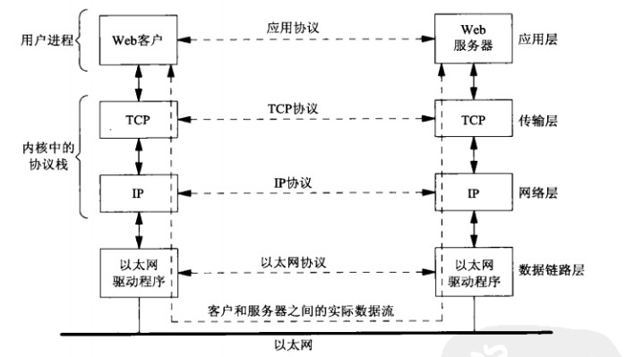

# TCP/IP简介

1. TCP/IP
   - 有时候指代与网络相关的所有协议即TCP/IP协议族：网际协议
     - 现在多数情况下是这层意思
   - 有时候只是指代TCP协议（传输层）和IP协议（网络层）

2. 典型的网络使用场景
   - 
   - Web客户端与服务之间使用某个应用协议通信，传输层使用TCP通信，TCP又转而使用IP协议传输，IP再通过某种形式的数据据链路层通信

3. OSI模型

   - 通常会使用OSI（open system interconnection,OSI）参考模型描述网络中的各个层次
   - 
   - 实际使用模型
     - 认为物理层和数据链路层是与具体硬件和硬件底层驱动有关，所以将这两层合并称为“链路层”
       - 物理链路层
       - 数据链路层
     - 网络层：网络层由IPv4和IPv6两个协议处理
     - 传输层：传输层负责传输的可靠性
       - 传输层使用TCP、UDP、SCTP协议
       - 在图示中TCP、UDP中留有“缝隙”表明：应用层可以绕过传输层直接与网络层进行数据交互，这中通信方式即是所谓的原始套接字（raw socket）
         - 甚至可以绕过网络层直接进行读写数据链路层的数据帧
     - 应用层：将会话层、表示层、应用层合并为”应用层“
       - FTP服务器、Telnet客户端、TFTP服务等

4. SOCKET编程

   - 基于TCP、UDP协议编写网络应用程序
   - 编程接口：应用层到传输层的接口
     - 会话层、表示层、应用层三层的编程通常构成所谓的用户进程，底下层却通常作为操作系统单 内核的一部分提供，不需要应用层程序员关注
       - 内核提供包括两层
         - 硬件驱动接口
         - 网络层、传输层的协议栈
     - 会话层、表示层、应用层处理应用的具体细节而对通信细节不是特别关注，而底下4层与具体的通信相关与具体的通信应用无关

## 基本网络设备

### 传输线缆

- 网线
- 层次：物理层设备即直接连接两个通信设备的线缆
- 作用：
  - 网络中发送方与接收方之间的物理通路
- 常用介质
  - 双绞线（即日常使用的网线）：
    - 非屏蔽双绞线：
      - 价格便宜，传输速率低，抗干扰能力差；
    - 屏蔽双绞线：
      - 抗干扰能力较好，传输速率较快，但是价格相对较高；
  - 同轴电缆：
    - 粗线缆：
      - 传输距离长，性能好但是成高，网络安装维护困难，一般用于大型局域网的干线
    - 细线缆：
      - 安装容易，造价低，但是传输距离短
  - 光纤：
    - 电磁绝缘性较好，信号衰减小，频带宽，传输速度快、传输距离远
    - 价格贵
    - 主要用于远距离通信
  - 无线星号等
### 中继器

 - 层次：物理层设备
 - 作用：
   - **使用于完全相同的两类网络的互联**；
   - 对数据信号进**行再生、还原、重新发送**或转发，**以达到扩大网络传输距离的目的**、保证传输数信号不失真；

   - 集线器（HUB）：多端口的中继器（纯粹的物理设备）

     - 层次：物理层设备
     - 作用：
       - 功能上与中继器相同，相当于多个中继器的合集
     - 说明：
       - 集线器采用**广播**的方式转发数据：
         - 用户数据包向所有节点发送，很可能带来数据同行的不安全，数据容易被截取
         - 所有的数据包都是向所有节点同时发送，容易造成网络塞车，降低网络传输效率
         - 非双向传输，同一时间是每个端口只能执行一个方向的传输；
### 网桥

 - 层次：

   - 数据链路层

 - 功能：

   - 网桥链接两个**相似**的网络，并对网络数据的流通进行 管理，不但能扩展网络的传输距离或范围，而且可以以提高网络的性能、可靠性、安全性
 - 说明：

   - 网桥可以是一个**硬件设备**，也可以是一个**网桥软件**（需要计算机上安装多个网络适配器）
   - 一个网桥两个两个网络，网桥的A端口链接**A子网**，B端口链接B子网，当有数据包进入端口A时网桥从数据包中提取源MAC地址和目的MAC地址，以y源MAC地址更新**转发表**，根据目的MAC地址查找转发表，找到该地址所对应的端口号，进行转发
   - **物理链路层 上来看网桥是大功率集线器(中继器)**
     - 而且是端对端的数据传输而不是“广播”；
   - 数据链路层上来看网桥会对数据做处理保证数据的可靠性

### 网卡
 - 网络接口卡（Network Interface Card ，NIC），网卡，**网络适配器**
 - 层次：**工作在数据链路层**
 - 作用：
   - 发送端：
     - 将主机产生的串性数字信号转换层能通过物理层传输枚举传输的比特流；
   - 接收端：
     - 将传输媒介上接收到的比特数据流转换为本地设备可以处理的数据
 - 网卡其实就是通信终端的抽象

### 交换机Switch

 - 二层交换机
   - 数据链路层；
   - 可以识别数据包中的MAC地址根据MAC地址进行转发（区别于集线器类似网桥）
     - 交换机的MAC-PORT对应表和网桥的不一样
       - 网桥的表是一对多（一个端口对多个MAC地址）
       - 交换机的表是一对一
 - 三层交换机
   - 网络层：
   - 带路由功能；

### 路由器

 - 层次：网络层
 - 作用：
   - 能够根据一定的路由算法，结合数据包中的目的IP地址，确定传输数据的最佳路径
   - 同样是维护一张地址与端口的对应表，但是与网桥和交换机的表不同：
     - 网桥和交换机是利用MAC地址来确定数据的转发端口，而路由器利用网络层中的IP地址，来作出相应的决定，
   - 由于路由器选择算法比较复杂，路由器的数据转发速度比网桥和交换机慢，
   - 主要用于广域网之间或广域网与局域网的互联

### 网关

 - 网间链接器，协议转换器；
 - 层次：传输层之上
 - 作用：
   - 网关是一个解释器，使用在不同的通信协议、数据格式或语言，甚至体系结构完全不同的两种系统之间；
   - 网关需要对接收的信息就那些

### 防火墙

- Fire Wall
- 一个位于计算机和它所连接的网络之间的软件或者硬件，实际上一种隔离技术
  - 硬件防火墙将隔离程序直接固化到芯片上，价格比较贵
- 防火墙是在两个网络通讯时执行的一种访问权限控制，它能将非法按用户或数据拒绝，
- 主要组成：
  - 服务访问规则
  - 验证工具
  - 包过滤
  - 应用网关

## 基本逻辑组成

### 协议族

### IP地址

### 子网掩码

### 默认网关

### DNS

### DHCP

# TCP UDP SCTP

1. TCP、UDP、SCTPs三者都属于传输层协议，这些传输协议都转而使用网络层协议IP：或者IPv4、或者IPv6
   - 尽管可以绕过传输层直接使用IPv4、IPv6，但是这种技术很少用（**原始套接字**，实际的套接字编程是基于TCP、UDP传输层）
   - SCTP(stream control transmission protovol,流控制传输协议)：最初设计用于跨因特网传输电话信令
     - 可靠的传输协议
   - UDP:
     - 简单的、不可靠的**数据报协议**
   - TCP:
     - 复杂、可靠的**字节流协议**

2. 协议族：

   - 

   - 应用层：
   - 传输层：
     - TCP：
       - 传输控制协议（Transmission Control Protocol）：
       - Tcp是一个面向**连接的协议**，为用户进程提供可靠的**全双工字节流**
         - 客户端与服务器端长期保持连接
       - TCP套接字是一种流套接字
       - 可以是IPv4 也可以是IPv6
       - 
     - UDP:
       - 用户数据报协议（user datagram protocol）;
       - UDP套接字是一种**数据报套接字**（datagram sockets）;
       - UDP是无链接的协议，UDP数据包不能保证最终到达目的地；
       - 可以是IPv4 也可以是IPv6
       - 
     - STCP
       - 流控制传输控制协议（stream xxx）
       - 可靠的面向链接的全双工数据流协议
       - 可以是IPv4 也可以是IPv6
   - 网络层：
     - IP
     - ICMP：
       - 网际控制消息协议（Internet control message protocol）;
       - 处理在路由器和主机之间的流通的错误和控制消息
       - 
     - IGMP：
       - 网际组管理协议（Internet Group manag）
       - IGMP用于多播
       - 在IPv4中这个服务是可选
     - IPv4:
       - 网际协议版本4（Internet Protocol version 4）
       - IPv4（通常称之为IP）使用32地址
       - 为TCP、UDP、SCTP、ICMP和IGMP提供分组递送服务；
     - IPv6:
       - 网际协议版本4（Internet Protocol version6）
       - 使用128位地址
       - 为TCP、UDP、SCTP、ICMPv6提供分组递送服务；
   - 链路层：
     - ARP:
       - 地址解析协议（address resolution protocol）
       - ARP把一个IPv4映射成一个硬件地址
     - RARP:
       - 反向地址映射（revers address resolution protocol）
       - 把一个硬件地址转化为IPv4地址
       - 
     - DLPI

## UDP

1. UDP是一个简单的**传输层**协议
2. 

2. 

## TCP

